# Sprawozdanie nr 1
---
## Cel ćwiczenia: Wprowadzenie do środowiska Git. Połączenie z serwerem na wirtualnej maszynie Ubuntu, umiejętność posługiwania się podstawowymi poleceniami Git: branch, commit, add, checkout, itp., poprawne rozumienie struktury gałęzi i posługiwanie się nimi w trakcie laboratorium. Należy zrozumieć ideę kluczy SSH i potrafić je generować.
---

## Przygotowanie środowiska pracy
Utworzyłem serwer na systemie operacyjnym Ubuntu (Linux) w wersji konsolowej, aby móc się z nim łączyć za pomocą protokołu ssh na przykład w Visual Studio Code na mojej lokalnej maszynie. 
## Obsługa kluczy SSH
## Klient Git
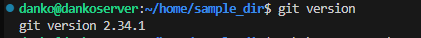
## Klonowanie repozytorium na 2 sposoby
  - za pomocą HTTPS
  - za pomocą klucza SSH
    - utworzenie dwóch kluczy innych niż RSA
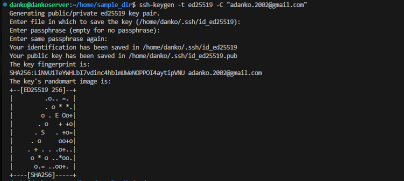
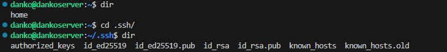
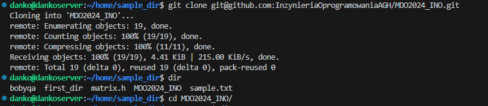
    - Skonfigurowanie klucza SSH pod GitHub
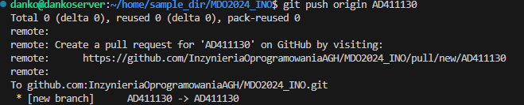
## Przełączanie się pomiędzy gałęziami
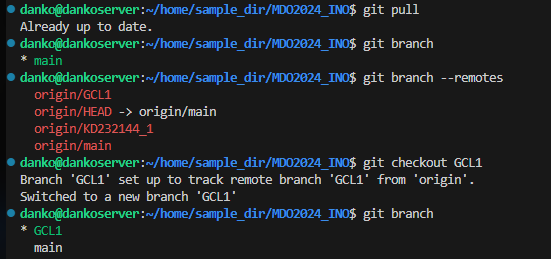
## Utworzenie gałęzi własnej pod gałęzią grupową 
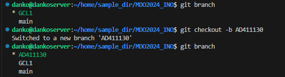

## Własny katalog roboczy
## Własny Git Hooke

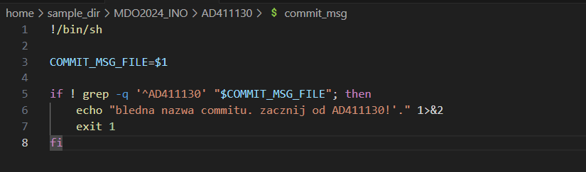
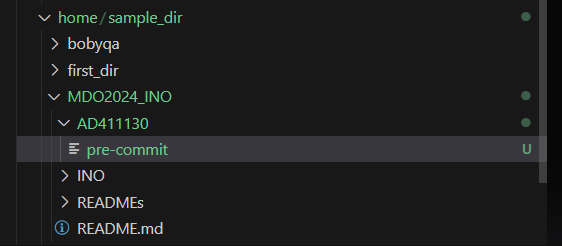
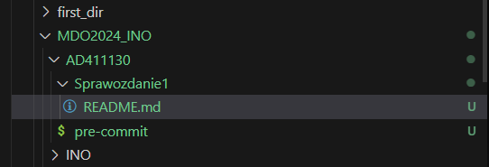
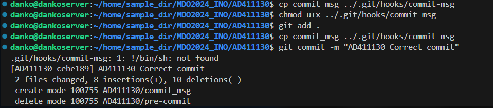
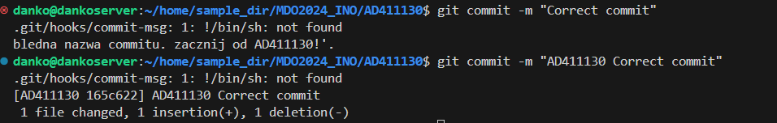
## Plik ze sprawozdaniem
## Zrzuty ekranu
## Wysyłanie zmian do źródła
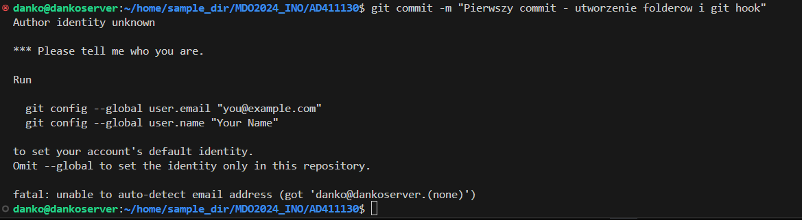
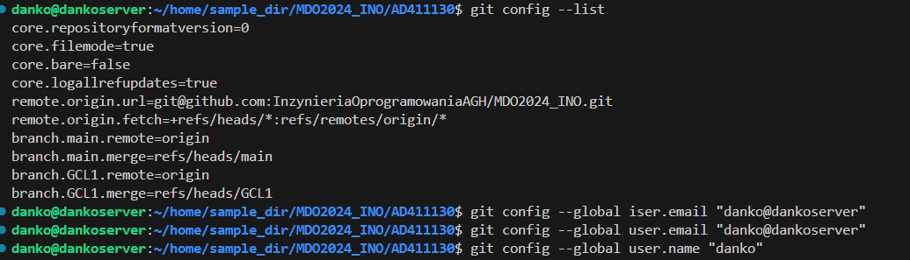
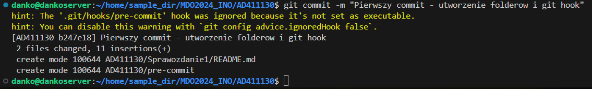
## Wciągnięcie do gałęzi grupowej