# Sprawozdanie 2

### Wybór oprogramowania
Aby poprawnie wykonać zadanie należało znaleźć repozytorium zawierające kod dowolnego oprogramowania na licencji typu open-source. Musiało także być umieszczone z narzędziami pozwalającymi na zbudowanie programu, a także przeprowadzenie testów build'a. Moim wyborem został pokazany na zajęciach modularny klient chatu [IRSSI](https://github.com/irssi/irssi). Spełnia on wszystkie powyższe wymagania, a także pozwala na bardzo dobre zaprezentowanie w jakim celu powstają *build-only* kontenery.
Na samym początku sklonowałem repozytorium na maszynę lokalną, oraz zapoznałem się z **INSTALL.md**, gdzie zostały zawarte instrukcje dotyczące instalacji programu. 

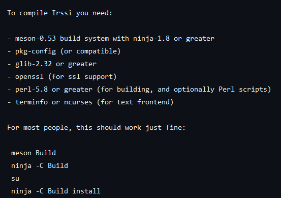

Niestety, twórcy nie wypisali wszystkich zależności potrzebnych do kompilacji. Zatem sposobem prób i wyrzucanych błędów udało mi się stworzyć listę bibliotek potrzebnych do poprawnego zbudowania IRSSI.

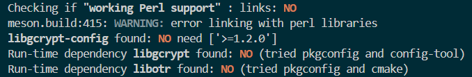

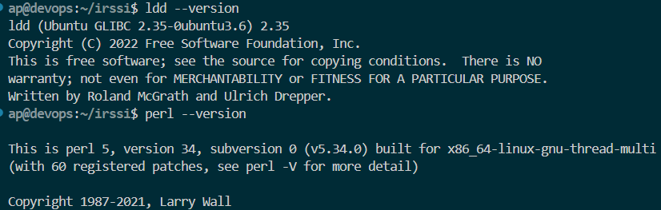

Jak można zauważyć na załączonych zrzutach ekranu, program odmawia kompilacji pomimo zainstalowanych pakietów. Wynika to z faktu, że są to "odchudzone" wersje *runtime*, które służą tylko do uruchomienia skompilowanego programu. W celu jego kompilacji z repozytorium należy pobrać wersje *development*.

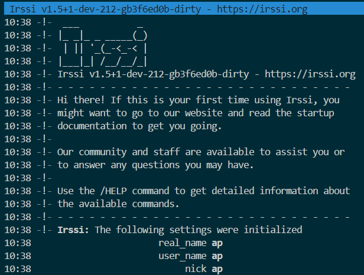

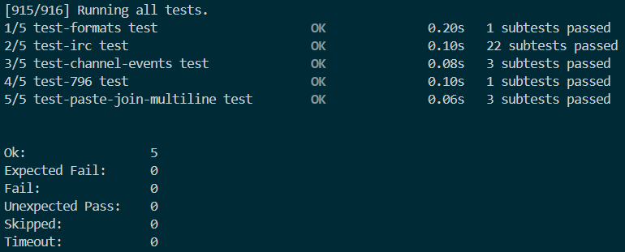

Skompilowana wersja Irssi, wraz z przeprowadzonymi testami. Wszystkie testy zostały przeprowadzone pomyślnie, co wskazuje na poprawną kompilację programu na lokalnej maszynie.

### Przeprowadzanie buildu w kontenerze

Posiadając wszystkie potrzebne informacje, można teraz przeprowadzić build Irssi w kontenerze. Użycie kontenera tworzy środowisko odizolowane od systemu operacyjnego hosta, co pozwala uniknąć problemów związanych z zależnościami i różnicami w konfiguracjach. Ułatwiają także utrzymanie spójności pomiędzy różnymi wersjami projektu, a takze zapobiega konfliktom zależności.

```
FROM ubuntu

RUN apt-get update && apt-get install -y git meson ninja-build net-tools libc6-dev dpkg-dev libssl-dev libncurses-dev libglib2.0-dev libgcrypt20-dev libotr5-dev

RUN git clone https://github.com/irssi/irssi.git

WORKDIR /irssi
RUN meson Build
RUN ninja -C /irssi/Build
```
W powyższym bloku wkleiłem zawartość mojego Dockerfile. Jak można zauważyć, lista zależności potrzebna do kompilacji jest znacznie dłuższa od tej podanej w **INSTALL.md**.
Jako obraz bazowy wybrałem Ubuntu, jednakże dowolny inny system, przykładowo Fedora, także byłby odpowiedni. Po pobraniu wszystkich pakietów sklonowałem repozytorium używając protokołu HTTPS, zmieniłem folder roboczy na irssi, gdzie następnie uruchomiłem `meson Build` przygotowując środowisko do budowy, a `ninja -C /irssi/Build` skompilowałem program.

Następnie użyłem komendy:
```
sudo docker build -t irssi-builder -f ./irssi-builder.Dockerfile .
```
gdzie argument `-t` nadaje obrazowi nazwę wybraną przez użytkownika, a `-f` pozwala na użycie *Dockerfile* o dowolnej nazwie.

Wynikiem powyższej komendy jest:

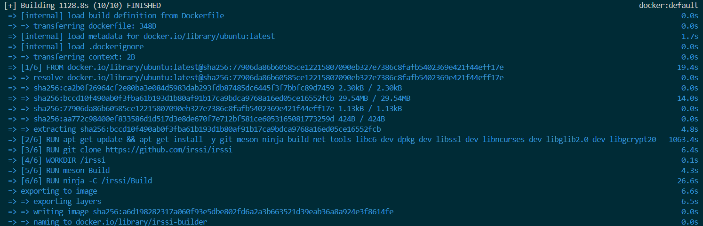

Sprawdzając listę wszystkich kontenerów przy pomocy
```
sudo docker ps -a
```
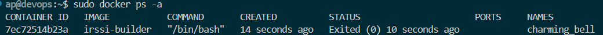

Status kontenera wynosi *0*, co oznacza, że build oraz kompilacja kodu zostały dokonane bez problemu. IRSSI, jako program interaktywny, nie nadaje się do korzystania w kontenerze. Jednakże jesteśmy w stanie wyciągnąć go, a następnie dostarczyć do produkcji. Pierwsze jednak należy przeprowadzić testy jednostkowe. Napisałem nowy Dockerfile dla testów:
```
from irssi-builder

WORKDIR /irssi/Build
RUN ninja test
```
Jako podstawę wykorzystując utworzony wcześniej obraz. Nie ma wtedy potrzeby ponownego pobierania wszystkich zależności oraz budowy i kompilacji programu, a możemy dokonać recyklingu tego co zrobiłem wcześniej.

Zbudowałem ten dockerfile poleceniem:
```
sudo docker build -t irssi-test -f irssi-tester.Dockerfile .
```

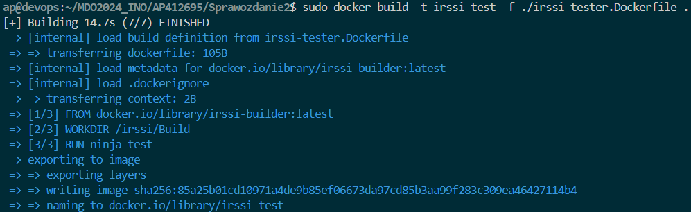

Z powyższego zrzutu ekranu można uznać, że testy zostały ukończone pomyślnie. Nie trzeba uruchamiać tego obrazu, albowiem testy Irssi zostały już przeprowadzone w trakcie jego budowy. Gdyby testy zakończyły się niepowodzeniem, nie powstałby obraz.

Powyższe kontenery można wdrożyć jeden po drugim korzystając z dockerowych kompozycji, zawierające wszystkie potrzebne informacje do automatycznego uruchomienia wszystkich kontenerów zawartych w pliku konfiguracyjnych typu YAML. Korzystając z dokumentacji i przykładów z internetu utworzyłem następujący plik dla kompozycji:

```
services:
  irssi-builder:
    build:
      context: .
      dockerfile: irssi-builder.Dockerfile
    container_name: irssi-builder

  irssi-tester:
    build:
      context: .
      dockerfile: irssi-tester.Dockerfile
    container_name: irssi-tester
    depends_on:
      - irssi-builder
```

Zdefiniowane są dwie usługi, które za parametry budowania przyjmują plik *.Dockerfile*, nazwę jaką ma przyjąć nowopowstały kontener, a także miejsce gdzie ma zostać wybudowany. Dla usługi testującej został także dodany parametr uzależniający budowę tego kontenera od poprawnego wykonania usługi buildera. 

Uruchomiłem kompozycję komendą:
```
sudo docker compose up
```
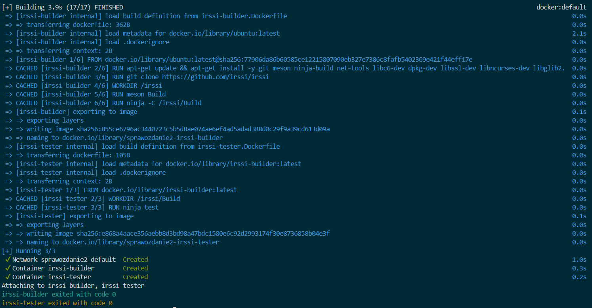

Powyżej wkleiłem logi z tworzenia tej kompozycji. Większość operacji znajdowała się już w pamięci *cache*, dlatego wykonało się to bardzo szybko. Wszystkie operacje wykonały się poprawnie, finalnie wyrzucając kod *0*.

Dla dwóch kontenerów, optymalizacja procesu może wydawać się minimalna, jednakże wrasta proporcjonalnie do wzrostu kontenerów które należy zaimplementować w jednym pliku.

### Woluminy

Dockerowy wolumin jest mechanizmem pozwalającym na zachowanie danych po zakończeniu działania programu. Zgodnie z zadanymi założeniami utworzyłem dwa woluminy używając komend:
```
sudo docker volume create v_in
sudo docker volume create v_out
```
A następnie sprawdziłem czy się poprawnie utworzyły używając:
```
sudo docker volume ls
```
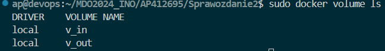

Jako kontener bazowy postanowiłem nie wykorzystywać powstałego na poprzednich zajęciach kontenera, a uprościłem sobie pracę oraz poprzez użycie Dockerfile z prostą aplikacją w NodeJS. Wynika to głównie z tego, że menadżer zależności *npm* znacznie ułatwi mi budowanie tego kontenera.

Aby podłączyć do niego wolumin wejściowy i wyjściowy należy użyć flagi *--mount* dla każdego z nich. Należy także określić źródło (*source*), oraz *target*, czyli lokalizację w której zapiszemy podane dane. Pełne polecenie wygląda w następujący sposób:

```
sudo docker run -it --rm --name node_main --mount source=v_in,target=/input --mount source=v_out,target=/output node bash
```
Po uruchomieniu kontenera możemy sprawdzić, czy przypisane mu woluminy się w nim znajdują:

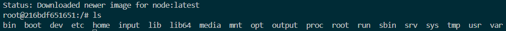

Teraz należało sklonować wybrane repozytorium do kontenera z zewnątrz. W tym celu stworzyłem nowy, tymczasowy kontener, do którego następnie przyłączę wolumin wejściowy. W tym też kontenerze sklonuje odpowienie repozytorium i zapiszę je w woluminie, żeby potem było było dostępne w głównym kontenerze. 

Tymczasowy kontener z *node* uruchomiłem interaktywnie poleceniem:

```
docker run -it --rm --name tmp_node --mount source=v_in,target=/input node bash
```

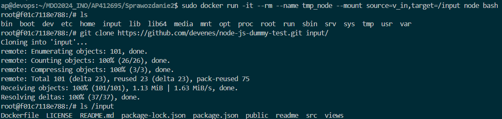

Z powyższego screena wygląda, że wszystko zostało poprawnie zapisane. Teraz można wrócić do głównego kontenera.

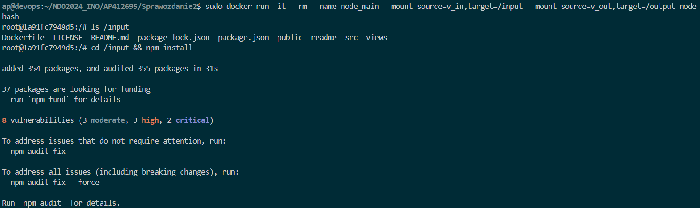

Po upewnieniu się, że pliki na pewno znajdują się na woluminie wejściowym, zainstalowałem swój node'owy program poleceniem:

```
npm install
```

Teraz mogę wyciągnąć najważniejsze - czyli folder *node-modules* - i zapisać je na woluminie wyjściowym, aby ich wynik był dostępny po zakończeniu działania kontenera.

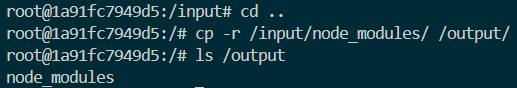

Teraz należy tylko sprawdzić, czy oba te foldery są dostępne po za kontenerem. Odszukałem, gdzie zapisywane są woluminy w systemie plików, a następnie wyświetliłem ich zawartość

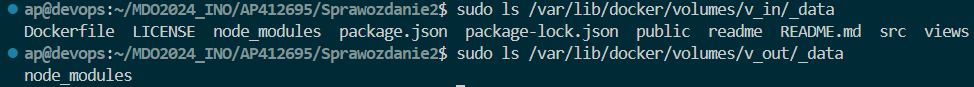

Następne zadanie polegało na sklonowaniu repozytorium w środku kontenera, co było prostsze niż kopiowanie z zewnątrz. Używając głównego kontenera sklonowałem to samo repozytorium do innego folderu w celu rozróżnienia.

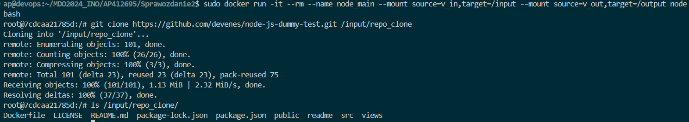

Cały ten proces opisany wyżej można zautomatyzować używając odpowieniego Dockerfile. Po zapoznaniu się z odpowiednią dokumentacją ~~zwaną także [StackOverflow](https://stackoverflow.com/questions/26050899/how-to-mount-host-volumes-into-docker-containers-in-dockerfile-during-build)~~ jednakże inna instrukcja niż VOLUME mi nie działa, albowiem **RUN --mount** wyrzuca błąd o nieistnieniu wyznaczonych woluminów, pomimo tego że dostał ścieżkę absolutną do folderów. Dockerfile pozostawię jako ciekawostkę.

### Eksponowanie portu

W kontenerze z Ubuntu zainstaluję i uruchomię program do analizy jakości łącza *Iperf3*. Po zainstalowaniu używając `apt` włączę serwer używając komendy:

```
iperf3 -s
```

Aby sprawdzić adres tego serwera użyję polecenia:

```
sudo docker inspect -f'{{range .NetworkSettings.Networks}}{{.IPAddress}}{{end}}' *container id*
```
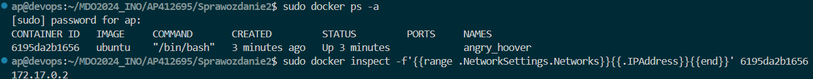

Teraz należało zbadać ruch korzystając z drugiego kontenera. posiadając adres IP można użyć do tego polecenia:

```
iperf3 -c 172.17.0.2
```
Możemy zbadać ruch pomiędzy dwoma kontenerami, gdzie pierwszy działa jako serwer, a drugi jako klient.

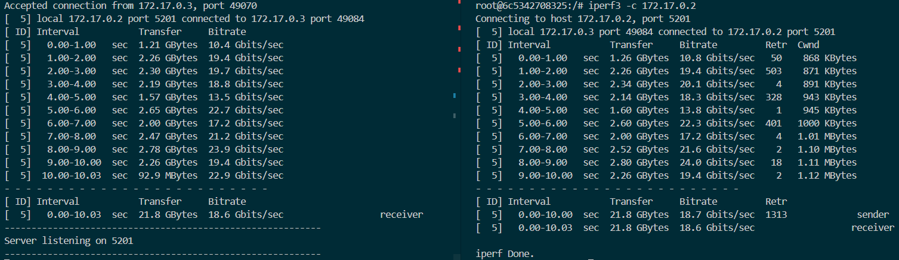

Docker pozwala na utworzenie własnej sieci mostkowej, która pozwala zamiast używać adresów IP na używanie nazw kontenerów. Ułatwia to łączenie się kontenerów w jednej sieci. Aby utworzyć własną sieć mostkową należy użyć polecenia:

```
sudo docker network create tmp_network
```

Teraz ponownie tworzymy dwa kontenery, gdzie jeden będzie serwerem, a drugi klientem:

```
sudo docker run --name server -it --network tmp_network ubuntu bash
sudo docker run --name client -it --network tmp_network ubuntu bash
```

Po ich odpowiedniej konfiguracji możemy sprawdzić ID utworzonej sieci oraz jej szczegóły, wraz z nowymi adresami IP dla uruchomionych kontenerów.

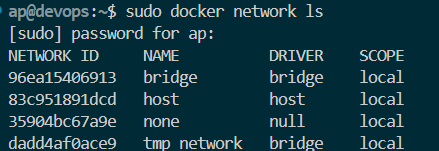

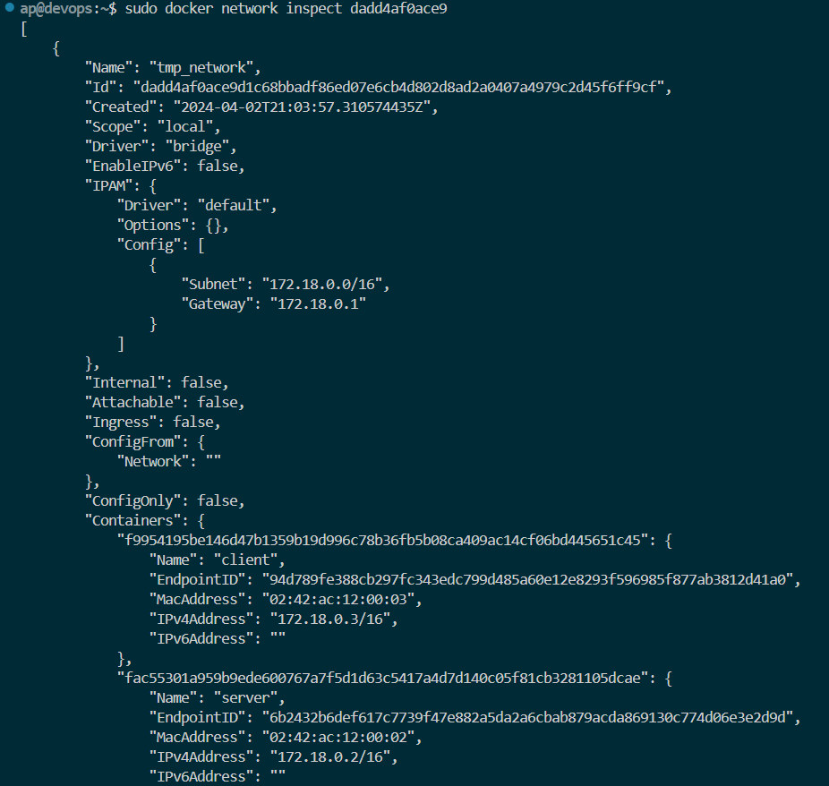

Ponownie łączymy ze sobą oba kontenery, tym razem można użyć nazwy kontenera:

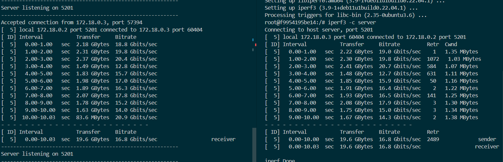

Następnie należało połączyć się z kontenerem z hosta i z po za hosta. Aby zapisać odpowiednie logi serwera utworzyłem wolumin *server_info*, który następnie podepnę do kontenera. Użyłem polecenia:

```
sudo docker run -it --rm --network tmp_network --name server --mount source=server_info,target=/logs ubuntu bash
```

Uruchomiłem serwer i połączyłem się z nim z poziomu hosta:

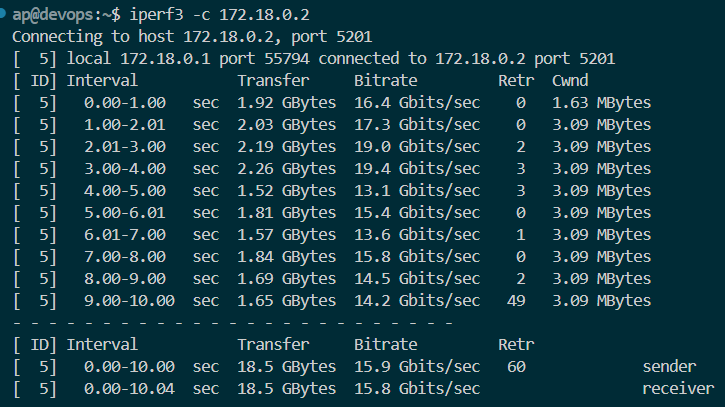

Niestety, ale nie udało mi się połączyć z kontenerem z poza hosta, czyli mojego systemu Windows, dlatego też nie jestem w stanie pokazać tego procesu. Zakładam, że może to być związane z portami lub strukturą sieci.

Należało także zbadać przepustowość komunikacji przez różnych klientów. Zbadałem przepustowość dla następujących przypadków:
- dwa kontenery bez dedykowanej sieci (sieć automatyczna) - Bitrate 19.6 Gbits/s
- dwa kontenery z siecią mostkową (sieć stworzona przez użytkownika) - Bitrate 16.8 Gbits/s
- host z kontenerem - Bitrate 15.6 Gbits/s

Jak widać, wszystkie te prędkości są porównywalne, jednakże najszybsza była sieć automatycznie utworzona przez Docker.

### Instalacja Jenkins

Aby zainstalować Jenkins należało zapoznać się z instrukcją podaną w instrukcji. Nie ma sensu przekopiowywać wszystkich poleceń do sprawozdania, więc przedstawię tylko ich wyniki.

Utworzenie sieci mostkowej Jenkins:

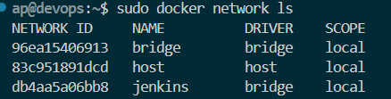

Pobranie odpowiedniego obrazu *docker:dind*

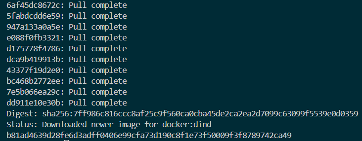

Utworzenie i uruchomienie odpowiedniego pliku *Dockerfile*

```
FROM jenkins/jenkins:2.440.2-jdk17
USER root
RUN apt-get update && apt-get install -y lsb-release
RUN curl -fsSLo /usr/share/keyrings/docker-archive-keyring.asc \
  https://download.docker.com/linux/debian/gpg
RUN echo "deb [arch=$(dpkg --print-architecture) \
  signed-by=/usr/share/keyrings/docker-archive-keyring.asc] \
  https://download.docker.com/linux/debian \
  $(lsb_release -cs) stable" > /etc/apt/sources.list.d/docker.list
RUN apt-get update && apt-get install -y docker-ce-cli
USER jenkins
RUN jenkins-plugin-cli --plugins "blueocean docker-workflow"
```

Uruchomienie kontenera Jenkins:

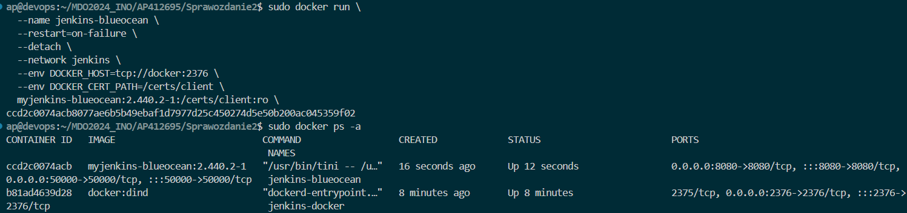

Jenkins z poziomu przeglądarki na hoście:

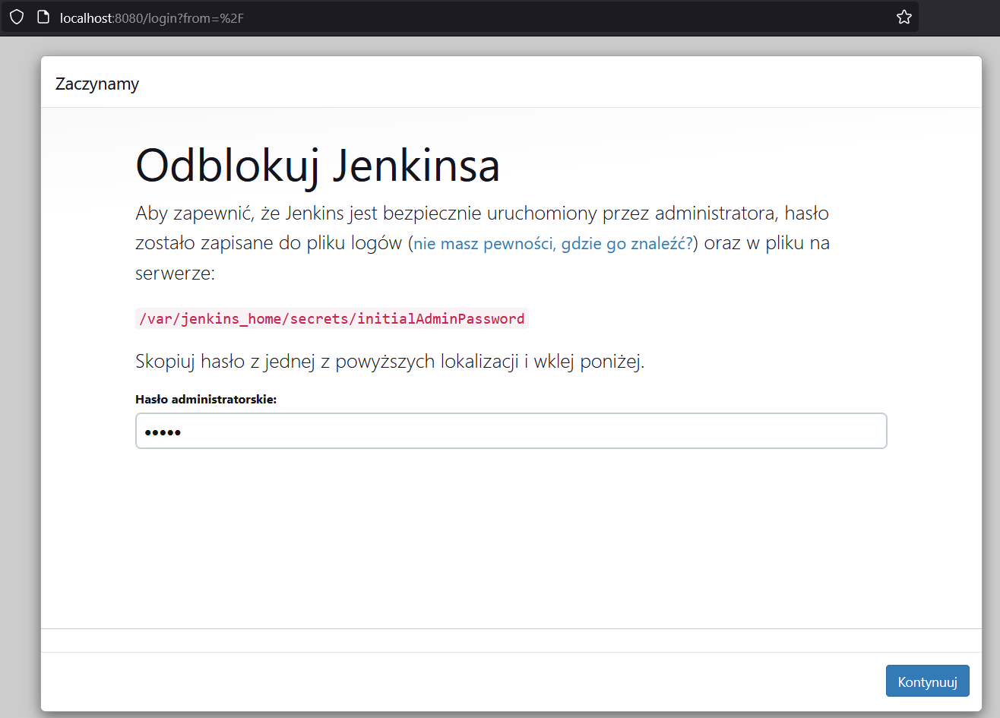
