***Disclaimer***
Sprawozdanie robiłem zdalnie, na wyjeździe. Z jakiegoś powodu Win11 na moim laptopie nie lubi Ubuntu ponieważ:
- VirtualBox nie otworzy spakowanej VM bo nie
- Nie utworzy nowego Ubuntu bo nie
- VMware też nie utworzy nowego Ubuntu bo nie

Dlatego użyłem Fedory 40 i w tym sprawozdaniu komendy mogą się różnić od tych zawartych w poprzednich.

# Sprawozdanie 3

## Instalacja Jenkinsa
Jenkins jest narzędziem do automatyzacji procesów ciągłej integracji (CI), oraz ciągłej dostawy (CD). Pozwala na zdefiniowanie zadań (job'ów), opisujące w jaki sposób zbudować, przetestować, a następnie wdrożyć napisany program. Stworzymy plik Jenkinsfile, będący Pipeline, który można przechowywać wraz z aplikacją jako back-up. Jest wiele opcji instalacji Jenkinsa, ale my wykorzystamy wersję skonteneryzowaną w Dockerze. W tym celu wykorzystam instrukcje z [tej strony](https://www.jenkins.io/doc/book/installing/docker/).

#### Instalacja dind
Najpierw należy utworzyć sieć mostkową w Dockerze, używając komendy:
```
sudo docker network create jenkins
```
Aby móc wykonywać docker'owe komendy w Jenkinsie, należy pobrać i uruchomić obraz 'Docker:dind':

```
docker run --name jenkins-docker --rm --detach \
  --privileged --network jenkins --network-alias docker \
  --env DOCKER_TLS_CERTDIR=/certs \
  --volume jenkins-docker-certs:/certs/client \
  --volume jenkins-data:/var/jenkins_home \
  --publish 2376:2376 \
  docker:dind --storage-driver overlay2
```
#### Instalacja Jenkins
Tworzymy plik Dockerfile z następującą treścią:
```
FROM jenkins/jenkins:2.440.3-jdk17
USER root
RUN apt-get update && apt-get install -y lsb-release
RUN curl -fsSLo /usr/share/keyrings/docker-archive-keyring.asc \
  https://download.docker.com/linux/debian/gpg
RUN echo "deb [arch=$(dpkg --print-architecture) \
  signed-by=/usr/share/keyrings/docker-archive-keyring.asc] \
  https://download.docker.com/linux/debian \
  $(lsb_release -cs) stable" > /etc/apt/sources.list.d/docker.list
RUN apt-get update && apt-get install -y docker-ce-cli
USER jenkins
RUN jenkins-plugin-cli --plugins "blueocean docker-workflow"
```
Następnie budujemy go:
```
sudo docker build -t myjenkins-blueocean:2.440.3-1 .
```
Uruchamiamy kontener z Jenkins komendą:
```
docker run --name jenkins-blueocean --restart=on-failure --detach \
  --network jenkins --env DOCKER_HOST=tcp://docker:2376 \
  --env DOCKER_CERT_PATH=/certs/client --env DOCKER_TLS_VERIFY=1 \
  --publish 8080:8080 --publish 50000:50000 \
  --volume jenkins-data:/var/jenkins_home \
  --volume jenkins-docker-certs:/certs/client:ro \
  myjenkins-blueocean:2.440.3-1
```

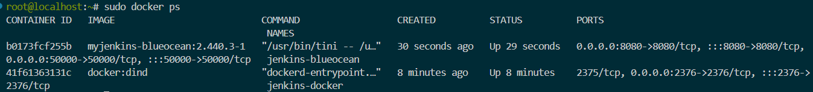

Wspomniany w komendach i Dockerfile **Blue Ocean** jest pluginem zapewniającym znacznie bardziej przystępne dla użytkownika budowanie pipelinów.

 #### Pierwsze uruchomienie
 Łączymy się z Jenkinsem z zewnątrz maszyny wirtualnej wchodząc na [localhost:8080](http://localhost:8080/). Wita nas ekran proszący o hasło administratora:

 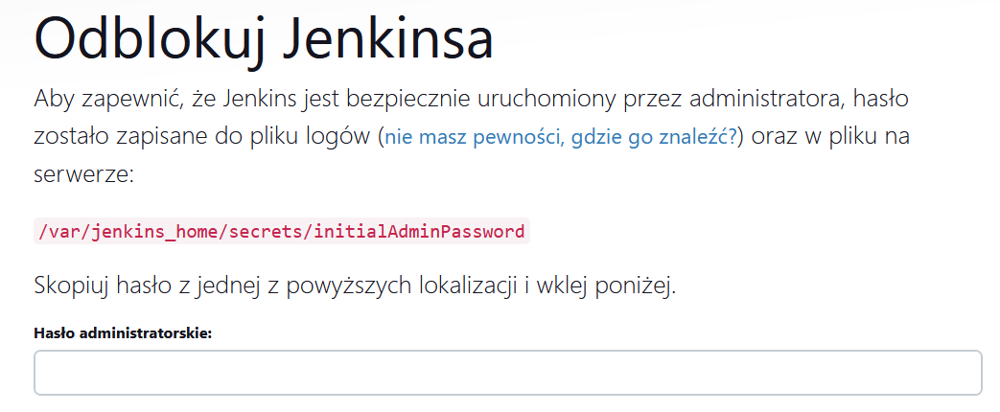

Ponieważ Jenkins został uruchomiony w kontenerze, nie znajduje się w podanej ścieżce (która nie istnieje), a w logach swojego kontenera. Jest ono tam wyszczególnione, oraz łatwe do znalezienia. Należy użyć:
```
sudo docker logs <containerId>
```
Po wklejeniu hasła, użytkownik zostaje zapytany o doinstalowanie wtyczek, rozszerzające funkcjonalność Jenkinsa. Jako niedoświadczony użytkownik, wybrałem wyróżnioną opcję "Zainstaluj sugerowane wtyczki"

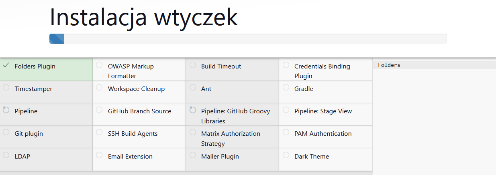

Po zainstalowaniu wtyczek, można utworzyć pierwszego administratora. Jest to krok który można pominąć, korzystając z opcji "Kontynuuj jako administrator".

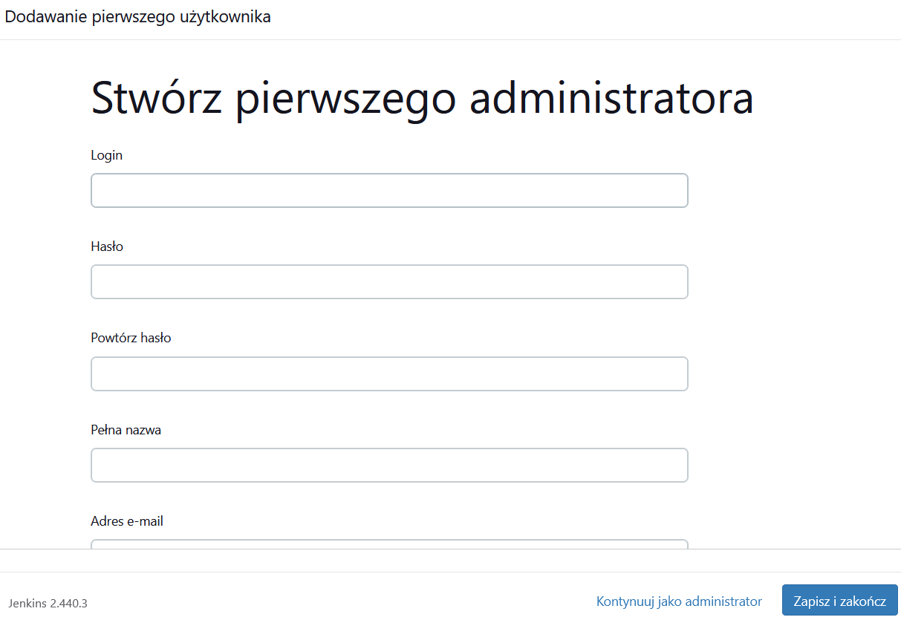

Finalną opcją konfiguracyjną jest customowy URL Jenkinsa. Ja zostawiłem go tak jak jest.

## Tworzenie Pipeline

Po zakończeniu konfiguracji, zostajemy powitani przez stronę startową w pięknym ponglishu (będzie go więcej). Tworzymy pierwszego job'a typu *Pipeline*.

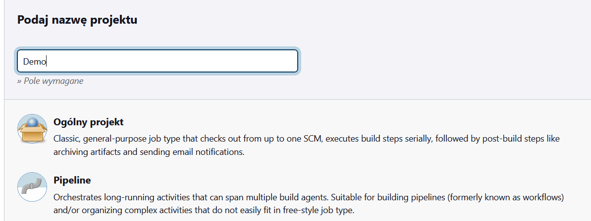

Jest wiele opcji konfiguracyjnych, których szczegóły można wyświetlić klikając pytajnik obok nich. Mnie interesuje tylko okienko skryptu, znajdujące się na samym dole strony. Na sam początek przeniosłem build oraz test do pipeline, wykorzystując prosty skrypy w języku Groovy. Pierwszy krok polega na sklonowaniu przedmiotowego repozytorium, a dokładniej mojej gałęzi. Ponieważ wybrałem **Irssi**, wykorzystam utworzone wcześniej pliki Dockerfile. W następnych krokach zdefiniowałem build oraz test.
```
pipeline {
    agent any
    stages {
        stage('Clone') {
            steps {
                git branch: 'AP412695', url: 'https://github.com/InzynieriaOprogramowaniaAGH/MDO2024_INO.git'    
            }
        }
        stage('Build') {
            steps {
                dir('AP412695/Sprawozdanie2') {
                    sh 'docker build -t irssi-builder -f ./irssi-builder.Dockerfile .'
                }
            }
        }
        stage('Test'){
            steps{
                dir('AP412695/Sprawozdanie2'){
                    sh 'docker build -t irssi-test -f irssi-tester.Dockerfile .'
                }
            }
        }
    }
}
```

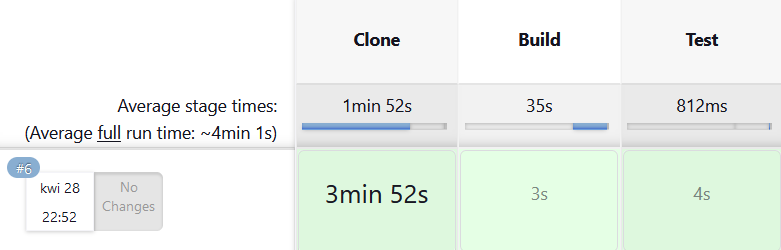

~~Piękno mobilnego internetu~~

 ### Deploy i publish

Do tego momentu pipeline implementuje kroki build i test. Teraz należy przeprowadzić deploy, czyli uruchomienie aplikacji w kontenerze docelowym. Postanowiłem do tego wykorzystać menadżer pakietów **dnf**, używany na systemach takich jak Fedora czy CentOS, oraz istniejący tam system instalacji, deinstalacji i zarządzania pakietami **rpm**. RPM instaluje, za zgodą użytkownika, wszystkie potrzebne dependencje do uruchomienia programu zawartego w danym pakiecie. Jest to bardzo wygodny i w pełni zautomatyzowany proces, idealny dla użytkownika końcowego, czyli klienta. Jest kilka sposobów utworzenia pakietu **.rpm**. Moim pierwszym pomysłem było wykorzystanie skompilowanych już plików binarnych z poprzednich kroków, jednakże finalna operacja *ninja install* nadal potrzebowała wszystkich developerskich bibliotek, więc postanowiłem zmienić podejście. Zamiast budowania typowego pakietu, można utworzyć paczkę z rozszerzenie **src.rpm**, która jak można się domyślić zawiera wszystko co jest potrzebne do zbudowania aplikacji u klienta. Nie nazwałbym tego w żadnym przypadku rozwiązaniem najbardziej efektywnym, albowiem wtedy kontener dla kroku *deploy* będzie musiał zawierać zależności potrzebne do budowy programu, a także potrzebne do jego uruchomienia, oraz program budujący (rpm-build w tym przypadku).

Wprowadzę dodatkowy krok, którego zadaniem zostanie zbudowanie paczki *src.rpm*. W ten sposób kontener dla tego kroku będzie zawierał zależności potrzebne potrzebne dla **rpm**, a kontener dla **Deploy** zależności potrzebne do zbudowania i działania aplikacji. Finalnie, krok **Publish** wyciągnie otrzymany artefakt, który zostanie zapisany do lokalnego repozytorium.

#### Ręczne wdrażanie

Zanim jednak będę w stanie zautomatyzować ten proces za pomocą Jenkinsa, muszę go przeprowadzić w sposób ręczny. Dlatego też utworzyłem nowy kontener "fedora-test":
```
sudo docker run -it --name=fedora-test fedora
```
Gdzie pobrałem wszystkie potrzebne mi zależności do budowy RPMów:
```
dnf install -y rpm-build rpm-devel rpmlint make coreutils patch rpmdevtools git gcc python bash
```

Teraz można stworzyć drzewo w którym przechowywane będą wszystkie potrzebne pliki:
```
rpmdev-setuptree
```
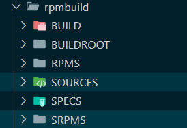

Klonujemy repozytorium Irssi, budujemy z niego archiwum, a następnie umieszczamy w katalogu SOURCES:
```
git clone https://github.com/irssi/irssi.git
tar -czvf irssi.tar.gz irssi
cp irssi.tar.gz ~/rpmbuild/SOURCES
```

Plik konfiguracyjny, z którego zostanie wygenerowany odpowiedni *src.rpm* także można utworzyć komendą. Pierwsze jednak należy się przenieść do folderu rpmbuild/SPECS.
```
rpmdev-newspec irssi
```
 Powstanie pusty szablon, który trzeba teraz tylko odpowiednio uzupełnić. Jego finalna forma wygląda następująco:

```
Name:           irssi
Version:        Test
Release:        1%{?dist}
Summary:        Irssi Test

License:        GPLv2
URL:            https://irssi.org/
Source0:        https://github.com/InzynieriaOprogramowaniaAGH/MDO2024_INO/raw/AP412695/AP412695/Sprawozdanie3/irssi.tar.gz

BuildRequires:  cmake
BuildRequires:  gcc
BuildRequires:  meson
BuildRequires:  ninja-build
BuildRequires:  perl-ExtUtils-Embed
BuildRequires:  utf8proc-devel
BuildRequires:  openssl-devel
BuildRequires:  ncurses-devel
BuildRequires:  glib2-devel
BuildRequires:  gdb
Requires:       glib2
Requires:       openssl
Requires:       perl
Requires:       ncurses-libs       

%description
Something Something tomato


%prep
%setup -n %{name}


%build
meson Build
ninja -C Build

%install
DESTDIR=%{buildroot} ninja -C Build install

%files
/usr/local/bin/%{name}
/usr/local/share/%{name}/
/usr/lib/debug/
/usr/local/include/
/usr/local/lib64/
/usr/local/share/doc
/usr/local/share/man

%changelog
* Mon Apr 29 2024 Prayge
- Initial build

```

Pierwsze linijki są self-explanatory. *Source0* to źródło z którego zostanie pobrana paczka z programem, jeżeli nie zostałaby znaleziona w katalogo SOURCES. *BuildRequires* to wymagane zależności do zbudowania programu. *Requires* to zależności potrzebne do jego uruchomienia. *%prep, %setup* to sekcja pozwalająca na stosowanie skryptów przygotowujących narzędzia. Domyślnie, program poszukuje w archiwum folderu o nazwie `Nazwa-Wersja-Relase`, dlatego korzystając z [odpowiednich makr](http://ftp.rpm.org/max-rpm/s1-rpm-inside-macros.html) nakazałem szukać folderu "irssi", który oczywiście się tam znajdował. *%build i %install* określają w jaki sposób program ma zostać zbudowany oraz zainstalowany. *%files* definiuje miejsca docelowe zainstalowanych plików programu.

Teraz jesteśmy w stanie finalnie zbudować paczkę:
```
rpmbuild -bs irssi.spec
```

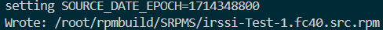

RPMbuild zapewnia narzędzie pozwalające na sprawdzenie, czy paczka została poprawnie zbudowana. Znajduje się ona w folderze SRPMS:
```
rpmlint ~/rpmbuild/SRPMS/irssi-Test-1.fc40.src.rpm
```

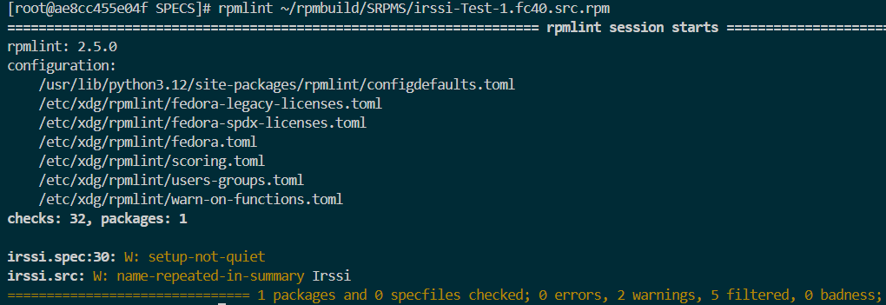

Paczka została zbudowana i tu zadanie tego kontenera zostaje zakończone. Teraz, można utworzyć kolejny, w którym zostanie przeprowadzona budowa tej paczki. Docker nie pozwala na kopiowanie plików pomiędzy kontenerami, więc musimy użyć maszyny wirtualnej jako pośrednika.
```
sudo docker run -it --name=fedora-build-test fedora
dnf -y install rpm-build rpm-devel rpmlint make coreutils patch rpmdevtools git gcc python bash meson ninja-build glib2-devel utf8proc-devel ncurses-devel openssl-devel perl cmake
```

```
sudo docker cp fedora-test:/root/rpmbuild/SRPMS/irssi-Test-1.fc40.src.rpm .
sudo docker cp ./irssi-Test-1.fc40.src.rpm fedora-build-test:/
```
Teraz możemy zbudować paczkę komendą:
```
rpmbuild --rebuild irssi-Test-1.fc40.src.rpm
```
Jeżeli budowanie powiedzie się, powinniśmy dostać następujący komunikat:

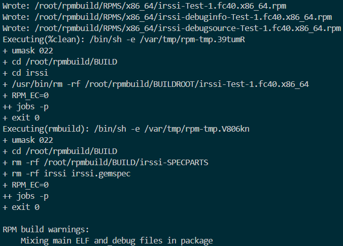

Teraz można przeprowadzić instalację i test działania w kontenerze. Paczka znajduje się w rpmbuild/RPMS/x86_64 (może się różnić w zależności od architektury), wraz z odpowiednimi debugami dla info i source. Paczkę instalujemy **dnf**, jak wszystkie inne.

```
dnf install ~/rpmbuild/RPMS/x86_64/irssi-Test-1.fc40.x86_64.rpm
irssi --version
```

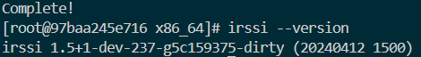

Ponieważ Irssi jest aplikacją interaktywną, w pipeline należy użyć *irssi --version* lub *irssi --help*, które tylko wyświetlają odpowiednie informacje. Jest to jednak wystarczający dowód, że program został poprawnie zainstalowany.

#### Dockerfiles
Teraz wiedząc w jaki sposób zachodzi cały ten proces, jesteśmy w stanie zawrzeć go w odpowiednich Dockerfile. Pierwsze jednak poprawię swój irssi-builder, aby dostosować go do innego systemu (Ubuntu -> Fedora). Co więcej, teraz jestem w stanie skorzystać w zainstalowanych w nim zależności, aby nie pobierać ich osobno dla każdego kolejnego kontenera. Utworzyłem nowy Dockerfile, nazwany "irssi-package-builder.Dockerfile", którego nazwa myślę mówi sama za siebie. Jego zawartość prezentuje się następująco:
```
FROM irssi-build

RUN dnf -y install \
    rpm-build \
    rpm-devel \
    rpmlint \
    make \
    coreutils \
    patch \
    rpmdevtools \
    git \
    python \
    bash

WORKDIR /

RUN tar -czvf irssi.tar.gz irssi
RUN rpmdev-setuptree
RUN cp irssi.tar.gz /root/rpmbuild/SOURCES/

WORKDIR /root/rpmbuild/SOURCES/

COPY ./irssi.spec .

RUN rpmbuild -bs irssi.spec
RUN rpmlint ../SRPMS/irssi-Test-1.fc40.src.rpm
RUN mkdir -p /src
RUN mv /root/rpmbuild/SRPMS/irssi-Test-1.fc40.src.rpm /src
```
```
sudo docker build -f irssi-package-builder.Dockerfile -t irssi-package .
```

Teraz mogę przejść do kroku **Deploy**. Korzystając z `irssi-package`, jedyne dependecje jakie musiałem doinstalować to były cmake oraz gdb, które do tej pory nie były potrzebne. Zawarłem wszystko w odpowiednim Dockerfile:

```
FROM irssi-package

RUN dnf install -y cmake gdb

WORKDIR /src

RUN rpmbuild --rebuild --nodebuginfo irssi-Test-1.fc40.src.rpm
RUN mkdir /rpm
RUN mv /root/rpmbuild/RPMS/x86_64/irssi-Test-1.fc40.x86_64.rpm /rpm
```
Finalnie, został nam etap **Publish**. W nim przeprowadzimy ostateczny test aplikacji na systemie pozbawionym wszystkich poprzednich zależności, a tylko z zależnościami potrzebnymi do uruchomienia Irssi. Gdybyśmy udostępniali nasz artefakt do zewnętrznego repozytorium, to zrobilibyśmy to w tym kroku. Jednakże ponieważ zostanie ono zapisane na lokalnej maszynie, wykorzystam do tego Jenkinsową opcję zapisywania artefaktów.

```
FROM irssi-deploy AS deploy
FROM fedora:40

RUN mkdir -p /rpm && mkdir -p /src

COPY --from=deploy /src /src
COPY --from=deploy /rpm /rpm

RUN dnf install -y \
    perl \
    glib2 \
    ncurses-libs \
    utf8proc \
    openssl

RUN dnf install -y /rpm/irssi-Test-1.fc40.x86_64.rpm

ENTRYPOINT irssi

CMD ['--version']

```

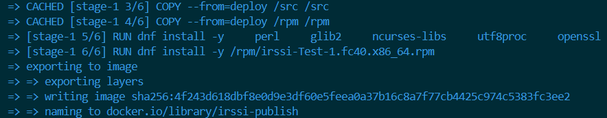

#### Jenkins
Posiadając już wszystkie potrzebne nam elementy, można powrócić do Jenkinsa i zakończyć budowę pipelinu. Całość można zawrzeć w Jenkinsfile, który finalnie prezentuje się następująco:

```
pipeline {
    agent any
    stages {
        stage('Clone') {
            steps {
                git branch: 'AP412695', url: 'https://github.com/InzynieriaOprogramowaniaAGH/MDO2024_INO.git'    
            }
        }
        stage('Build') {
            steps {
                dir('AP412695/Sprawozdanie3') {
                    sh 'docker build -t irssi-builder -f ./irssi-builder.Dockerfile .'
                }
            }
        }
        stage('Test'){
            steps{
                dir('AP412695/Sprawozdanie3'){
                    sh 'docker build -t irssi-test -f irssi-tester.Dockerfile .'
                }
            }
        }
        stage('Build Package'){
            steps{
                dir('AP412695/Sprawozdanie3'){
                    sh 'docker build -f irssi-package-builder.Dockerfile -t irssi-package .'
                }
            }
        }
        stage('Deploy'){
            steps{
                dir('AP412695/Sprawozdanie3'){
                    sh 'docker build -f irssi-deployer.Dockerfile -t irssi-deploy .'
                }
            }
        }
        stage('Publish'){
            steps{
                dir('AP412695/Sprawozdanie3'){
                    sh 'docker build -f irssi-publisher.Dockerfile -t irssi-publish .'
                }
            }
        }
    }
    post {
        always {
            cleanWs()
            sh 'docker rmi -f $(docker images -q)'
        }
        success{
            archiveArtifacts artifacts: 'irssi-Test-1.fc40.x86_64.rpm'
        }
    }
}
```

