# Sprawozdanie 4

## Ansible

### Instalacja Ansible

Ansible jest zestawem narzędzi na licencji open-source, pozwalającymi na zdalnie zarządzanie siecią serwerów za pomocą skryptów. Przykładowo, pozwala na masową, zdalną instalację lub aktualizację systemów bez wykorzystywania fizycznego nośnika lub interaktywnego menu.

Aby wykonać zadanie, utworzyłem nową maszynę wirtualną z systemem Fedora 40 o minimalnych specyfikacjach i utworzyłem użytkownika o nazwie *ansible*. Po uruchomieniu maszyny zaktualizowałem wszystkie pakiety, a następnie upewniłem się, że zainstalowane są programy *tar* oraz serwer **OpenSSH*.

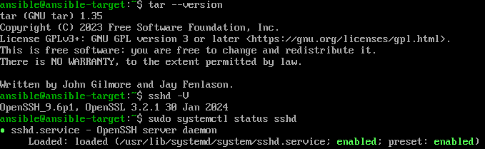

Na swojej głównej maszynie zainstalowałem Ansible za pomocą komendy:

```
sudo dnf install ansible
```

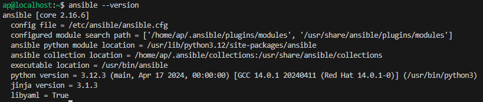

Ostatnim krokiem była wymiana kluczy SSH pomiędzy główną maszyną a ansible-target, żeby móc łączyć się z nią bez podawania hasła. W tym celu utworzyłem nowy klucz RSA, który następnie przekopiowałem do ansible-target przy pomocy komendy:

```
ssh-copy-id -i ~/.ssh/id_rsa.pub ansible@192.168.1.58
```

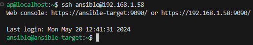

### Inwentaryzacja

Używając *hostnamectl* można wyciągnąć potencjalne nazwy komputerów. Aby nie musieć wywoływać maszyn jedynie przez ich adres IP, można wprowadzić nazwy DNS, dodając odpowiednią linijkę do pliku */etc/hosts*

```
192.168.1.58 ansible-target
```

Następnie sprawdziłem łączność pomiędzy tymi maszynami używając *ping'a*

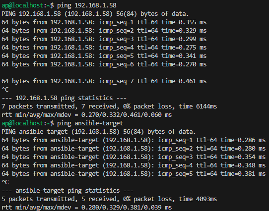

Teraz można zająć się inwentaryzacją. Plik inwentory może mieć dwa rozszerzenia - *.ini* lub *.yml*. Ten drugi pozwala na lepszą skalowalność wraz ze zwiększającą się liczbą węzłów. Jednakże w tym przypadku zarządzamy tylko jedną maszyną, zatem format *.ini* będzie rozsądniejszym wyborem do wykonania tego zadania. Wykorzystując [dokumentację ansible](https://docs.ansible.com/ansible/latest/getting_started/get_started_inventory.html) utworzyłem następujący plik:

```
[Orchestrators]
devops

[Endpoints]
ansible-target ansible_user=ansible
```

i nazwałem go *inventory.ini*. Sprawdziłem jego poprawność wykorzystując komendę:

```
ansible-inventory -i inventory.ini --list
```

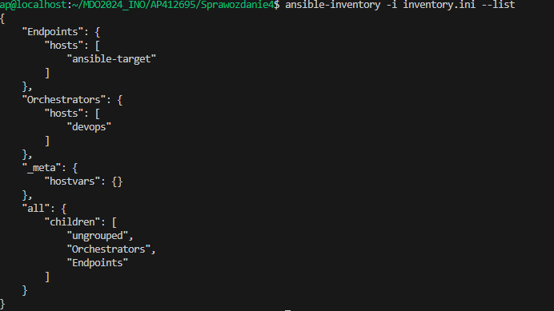

Teraz można spingować nasz "Endpoint", a także wszystkie maszyny. Aby wykonać to drugie polecenie należy dodać klucz SSH do "samego siebie", inaczej Ansible zwróci błąd.

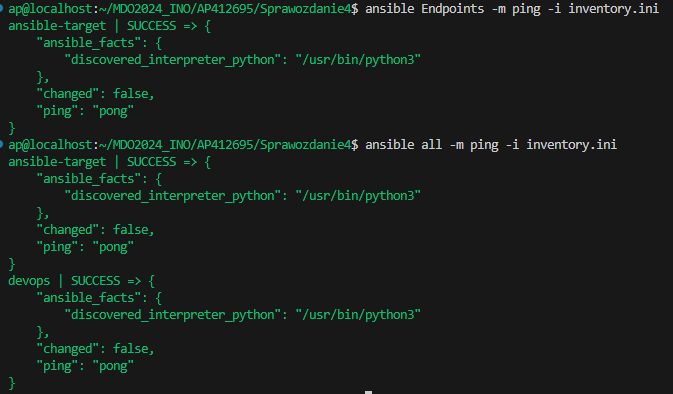


### Zdalne wywoływanie procedur

Ansible zapewnia możliwość utworzenia schematu automatyzacji, czyli **Playbook'a**. Wykorzystuje w tym celu pliki w formacie *.yaml*. Na sam początek postanowiłem przetestować tę opcję i napisałem prosty skrypt pingujący każdą maszynę, a następnie uruchomiłem go komendą:

```
ansible-playbook -i inventory.ini playbook_ping.yaml
```

```
- name: Ping
  hosts: all
  tasks:
    - name: Ping 
      ping:
```

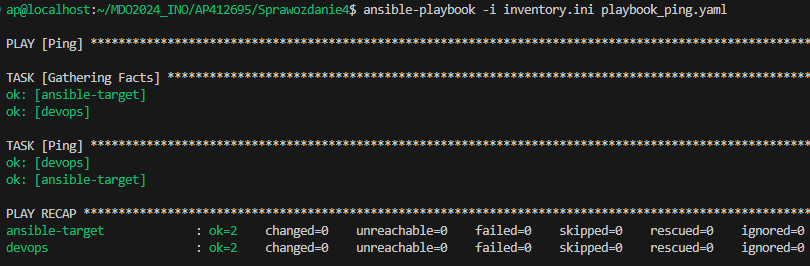

Zadanie wykonało się bez jakichkolwiek problemów, zatem można zaimplementować pozostałe podpunkty z tego zadania:

```
- name: Ping
  hosts: all
  tasks:
    - name: Ping 
      ping:

- name: Copy inventory
  hosts: Endpoints
  tasks:
    - name: Copy
      copy:
        src: ~/MDO2024_INO/AP412695/Sprawozdanie4/inventory.ini
        dest: ~/inventory.ini
    - name: Copy (alt)
      copy:
        src: ~/MDO2024_INO/AP412695/Sprawozdanie4/inventory.ini
        dest: ~/inventory.ini

- name: Update system
  hosts: Endpoints
  become: yes
  vars_files:
    - vault.yml
  tasks:
    - name: update
      dnf:
        name: "*"
        state: latest

- name: Restart sshd&rngd
  hosts: Endpoints
  become: yes
  vars_files:
    - vault.yml
  tasks:
  - name: Restart sshd
    become: yes
    service:
      name: sshd
      state: restarted
      
  - name: Restart rngd
    become: yes
    service:
      name: rngd
      state: restarted
        
```

Niektóre z poleceń, chociażby aktualizacja pakietów czy restart usług są dostępne tylko z poziomu roota, co wymaga też podania hasła. Z tym na pomoc przychodzi ansible-vault, które pozwala na stworzenie pliku typu *.yml* z hasłem roota, a następnie przeprowadza jego enkrypcję. Plik z hasłem można następnie zawrzeć w playbook'u. Sam plik skarbca jest także zahasłowany, a hasło do niego można zawrzeć przykładowo w menadżerze haseł, lub w mało bezpieczny sposób - pliku .txt na lokalnej maszynie. Playbook uruchamiam komendą:

```
ansible-playbook -i inventory.ini playbook_ping.yaml --vault-password-file vault_pass.txt
```

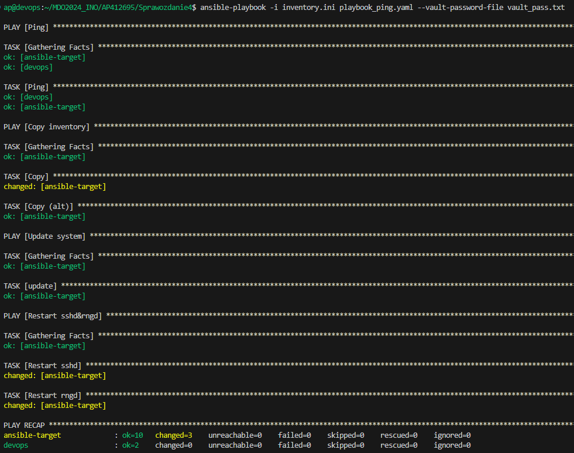

Jak można zauważyć, operacja skopiowania pliku zwraca status "changed", jednakże ponowna próba skopiowania go zwraca "ok", co wskazuje, że plik już istnieje w danym miejscu na maszynie docelowej. Zadania restartujące dane usługi także zwróciły status "changed". Oznacza to, że tylko 3 zmiany zaszły na systemie.

W przypadku wyłączenia serwera SSH na maszynie docelowej, Ansible wyrzuca error i kończy działanie playbook'a

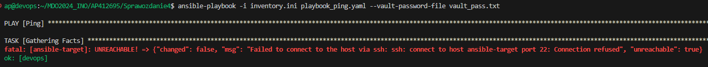

### Zarządzanie kontenerem

Utworzyłem kolejny playbook, który zajmie się instalacją Dockera na maszynie docelowej, a następnie pobierze testowy obraz i uruchomi go zdalnie. Ponieważ moja aplikacja z poprzedniego sprawozdania nie nadaje się do pracy ciągłej, uruchomię nginx jako testowy kontener. 

```
- name: Install Docker
  hosts: Endpoints
  become: yes
  vars_files:
    - vault.yml
  tasks:
    - name: Update packages
      dnf:
        name: "*"
        state: latest
    
    - name: Install Docker
      dnf:
        name: docker
        state: latest
    
    - name: Start Docker
      command: systemctl enable --now docker

- name: Download & Manage Image
  hosts: Endpoints
  become: yes
  vars_files:
    - vault.yml
  tasks:
    - name: Check Volume
      command: docker volume inspect vol
      register: vol_exists
      failed_when: false
    
    - name: Create Volume
      command: docker volume create vol
      when: vol_exists is false

    - name: Get & Run
      docker_container:
        name: ansible_nginx
        image: nginx:latest
        state: started
        recreate: true
        volumes:
          - vol:/nginx
        ports:
          - "4444:80"
```


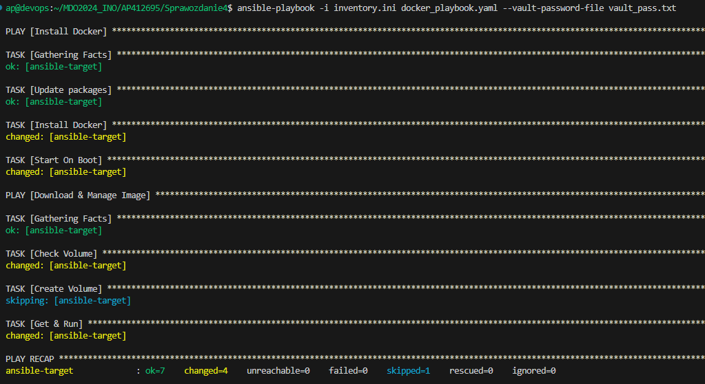

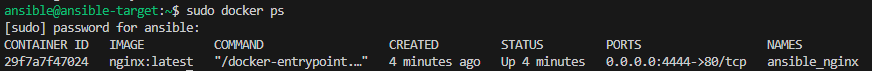

Jak można zauważyć, udało się uruchomić testowy kontener za pomocą playbook'a Ansible. Teraz możemy go też wyłączyć i usunąć. Wystarczy dopisać zadanie:

```
- name: Clean UP Docker
  hosts: Endpoints
  become: yes
  vars_files:
    - vault.yml
  tasks:
    - name: Stop & Remove
      docker_container:
        name: ansible_nginx
        state: absent
```

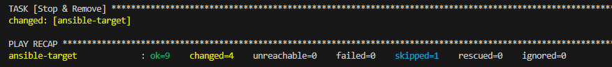

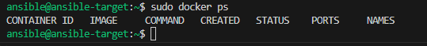


## Pliki odpowiedzi dla wdrożeń nienadzorowanych

W tej części zostanie przygotowane źródło instalacji systemu dla maszyny wirtuaknej lub serwera, które następnie zostanie wykorzystane do automatycznej instalacji środowiska testowego dla programu, który nie jest w stanie pracować w trybie ciągłym w kontenerze. Nie musiałem pobierać Fedory, jako że jest to system na którym pracuję, dlatego też mogę wykorzystać swój własny plik *anaconda-ks.cfg* i zmodyfikować go pod swoje potrzeby.

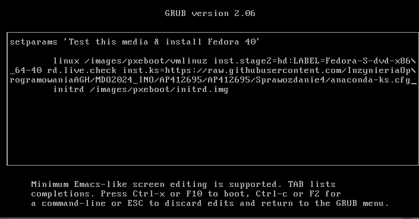