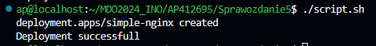

# Sprawozdanie 5
## Instalacja Kubernetes
Wykorzystałem załączoną [instrukcję](https://minikube.sigs.k8s.io/docs/start/?arch=%2Flinux%2Fx86-64%2Fstable%2Frpm+package) zainstalowałem minikube na swoim systemie Fedora:


Dodałem swojego użytkownika do listy "docker", w celu poprawnego działania minikube. Kubernetes ma wymagania minimalne 20 GB wolnej pamięci dyskowej, dwa rdzenie procesora, oraz 2 GB ramu. Zapewniłem je od razu przy tworzeniu maszyny. Wystartowałem minikube komendą:

```
minikube start
```


Następnie pobrałem *kubectl*, które służy do sprawdzania zasobów użytkownika, takich jak działanie podów, deploymentów czy usług. Wykonałem polecenie:

```
minikube kubectl -- get po -A
```

a także wprowadziłem alias dla ułatwienia dalszej pracy:

```
alias kubectl="minikube kubectl --"
```

Poprawne uruchomienie Kubernetes potwierdza działający Dockerowy kontener:


Teraz można uruchomić dashboard Kubernetes. Jest on graficznym menu w którym użytkownik ma pełną kontrolę nad clusterami, oraz znacznie ułatwia i przyśpiesza pracę w porównaniu do używania narzędzi lini komand. Ponieważ korzystam z VS Code, port do dashboard'a zostaje przekierowany automatycznie.

```
minikube dashboard
```


Ponieważ jest to pierwsze uruchomienie, nie ma tutaj nic do wyświetlenia. Pody to najmniejsze "bloczki" służące do budowy jobów w Kubernetes. Deployments za to mają za zadanie zarządzanie podami, ich lifecycle czy ich skalowaniem.

## Wdrażanie kontenera za pomocą Kubernetes

Wdrażając kontener należy mieć na uwadze jego sposób funkcjonowania. Ponieważ w trakcie poprzednich zajęć przeprowadzałem pipeline Irssi, które jest aplikacją działającą w trybie okienkowym, ciągłym. Dlatego też zamieniłem swoją aplikację na prostego Nginx'a, który wyświetla tekst oraz obecną datę oraz godzinę. 

W tym celu zbudowałem Dockerfile o bardzo prostej zawartości, z którego zbuduję obraz, a następnie Kubernetesowy Pod. 

```
FROM nginx:alpine

COPY index.html /usr/share/nginx/html/index.html
```


Zamiast logować się na Docker Hub w celu opublikowania tego testowego kontenera, możemy utworzyć lokalny rejestr dla Minikube, wraz z odpowiednio ustawioną opcją "imagePullPolicy". Trzeba jednakże zapamiętać, że jest to rozwiązanie indywidualne dla każdego otwartego terminala, oraz niekoniecznie sprawdzi się w środowisku produkcyjnym.

```
eval $(minikube docker-env)

docker build -t simple-nginx .
```
Ten obraz został zbudowany dla daemona Minikube, więc ma on do niego dostęp lokalnie. Teraz należy sprawdzić, czy nasz zbudowany obraz jest w stanie działać w trybie ciągłym, zatem uruchamiamy go:
```
docker run -d --rm -p 80:80 --name simple-nginx simple-nginx
```

Po nadaniu tagu w celu oznaczenia wersji 1.0, można uruchomić go na stosie k8s za pomocą komendy:
```
minikube kubectl -- run simple-nginx --image=simple-nginx:1.0 --port=80 --image-pull-policy=Never
```
Pod możemy od razu zobaczyć w dashboardzie:


Albo używając komendy
```
minikube kubectl get pods
```


Teraz można wyprowadzić port używając polecenia:
```
minikube kubectl port-forward pod/simple-nginx 8080:80
```
Jeszcze należy odpowiednio przekierować port w VSCode:


Teraz na maszynie lokalnej można uruchomić localhost:8080 i sprawdzić działanie aplikacji:


## Wdrożenie za pomocą deklaratywnego YAML

Przy pomocy odpowiednio zdefiniowanego pliku z rozszerzeniem YAML można zautomatyzować proces wdrażania podów. W pliku należy zdefiniować nazwę wdrożenia, ilość replik, wykorzystany obraz oraz strategię wdrożenia. Dodałem także opcję korzystania z lokalnego repozytorium obrazów, tak jak w trakcie ręcznego wdrażania.
Bazując na przykładzie z dokumentacji dostarczonej przez Kubernetes, napisałem plik:

```
apiVersion: apps/v1
kind: Deployment
metadata:
  name: simple-nginx
spec:
  replicas: 3
  selector:
    matchLabels:
      app: simple-nginx
  template:
    metadata:
      labels:
        app: simple-nginx
    spec:
      containers:
      - name: simple-nginx
        image: simple-nginx:2.0
        imagePullPolicy: Never
        ports:
        - containerPort: 80
```
Jego wynikiem powinny być 3 kopie podów zawierające moją aplikację. Wynika to z faktu, że nie umiem czytać instrukcji.

Aplikujemy plik deploymentu do kubectl za pomocą:
```
minikube kubectl -- apply -f remote.yaml
```
Następnie pobieramy zaaplikowane developmenty:
```
minikube kubectl get deployments
```

Status deploymentów można sprawdzić przy pomocy Dashboarda, lub za pomocą komendy:
```
minikube kubectl rollout status
```


Kolejne zadanie polegało na przygotowaniu nowej wersji obrazu do wdrożenia. W tym celu dokonałem drobnej zmiany na stronie startowej swojego programu, dodając nowy paragraf. Po raz kolejny należy zbudować obraz oraz odpowiednio go otagować jako nową wersję. Z nieznanego przeze mnie powodu strona nie odświeża się w przeglądarce, ale curl poprawnie zwraca jej zawartość i na maszynie wirtualnej i na hoście.


Ostatni podpunkt dotyczył utworzenia obrazu, który nie uruchomi się ze względu na błąd. W tym celu dodałem trzecią linijkę do Dockerfile
```
...
CMD ["exit", "1"]
```

Po zbudowaniu i zmiany pliku deploymentu, dokonałem jego zaaplikowania:


Jak można zauważyć, po dokonaniu 3 restartów Kubernetes wyrzuca error i nie jest w stanie dokończyć deploymentu.

## Modyfikacje deploymentu

To zadanie polegało na wielokrotnych zmianach deploymentu i notowaniu ich.
Pierwsze znacznie zwiększyłem liczbę replik podów do 12:


Następnie zmniejszenie ich liczby do 1:


Oraz do 0:


Wdrożenie nowej wersji obrazu:


Możemy sprawdzić historię rewizji deploymentu, wykorzystując komendę:

```
minikube kubectl rollout history deployment/simple-nginx
```


Teraz można cofnąć się wersję do tyłu wykorzystując komendę:

```
minikube kubectl rollout undo deployment/simple-nginx
```

Jeżeli chcemy wycofać do wybranej przez siebie wersji, należy dodać argument `--to-revision`


Jak można zauważyć, wdrożenie cofnęło wersję aplikacji z 2.0 do 1.0

## Kontrola wdrożenia i strategie

Wdrożenie jesteśmy w stanie kontrolować poprzez skrypt, który mierzy czas jaki upłynął od wystartowania polecenia. Zgodnie z wymaganiami, powinien wyświetlić się komunikat o tym, że deployment nie wyrobił się w wyznaczonym czasie.
Napisałem skrypt:

```
#!/bin/bash

minikube kubectl -- apply -f remote.yaml

if minikube kubectl -- rollout status deployment/simple-nginx --timeout=60 > /dev/null 2>&1; then
echo "Deployment successfull'
exit 0
else
echo "Deployment timeout. Expected time exceeded."
exit 1
fi
```

Wdrożenie jest aplikowane, a następnie wypisujemy status rolloutu. Jeżeli będzie on trwał dłużej niż zadane 60 sekund, zostanie wyrzucony błąd (który zostaje wyrzucony w eter, ponieważ nie jest nam potrzebny) oraz wyświetla się własny komunikat.



W celu zaprezentowania przypadku fail'a deploymentu użyłem niedziałającego obrazu:


Trzeba pamiętać o rollbacku developmentu, który zwrócił błąd. Można to zrobić ręcznie, albo dopisać odpowiednią linijkę do skryptu.

Wdrażając nowe wersje kontenerów, można wybrać strategię, czyli w jaki sposób zostanie dokonane wdrożenie. Domyślną opcją jest RollingUpdate, gdzie stare pody są stopniono zamieniane na nowe. Jako pierwszy przykład pokażę właśnie tą strategię, ale ze zmienionymi parametrami. Do pliku yaml dodaję informację ze strategią, oraz zwiększam liczbę podów dla lepszego pokazania efektu:

```
apiVersion: apps/v1
kind: Deployment
metadata:
  name: simple-nginx-Rolling
spec:
  replicas: 20
  strategy:
    type: RollingUpdate
    RollingUpdate:
      maxUnavailable: 3
      maxSurge: 30%
  selector:
    matchLabels:
      app: simple-nginx
  template:
    metadata:
      labels:
        app: simple-nginx
    spec:
      containers:
      - name: simple-nginx
        image: simple-nginx:2.0
        imagePullPolicy: Never
        ports:
        - containerPort: 80
```


Inną strategią jest Recreate, gdzie wszystkie pody są wyłączane i usuwane, a powstają nowe na ich miejsce. Jest to operacja szybsza niż poprzednia wspomniana strategia, jednakże niemożliwa dla aplikacji które muszą działać bez przerwy.
Skrypt dla strategii Recreate prezentuje się następująco:

```
apiVersion: apps/v1
kind: Deployment
metadata:
  name: simple-nginx-rolling
spec:
  replicas: 20
  strategy:
    type: Recreate
  selector:
    matchLabels:
      app: simple-nginx
  template:
    metadata:
      labels:
        app: simple-nginx
    spec:
      containers:
      - name: simple-nginx
        image: simple-nginx:1.0
        imagePullPolicy: Never
        ports:
        - containerPort: 80
```


Finalną strategią do zastosowania jest Canary. W tym przypadku nowa aplikacji zostaje zaaplikowana tylko do pewnej części podów. Pozwala to na "beta-testing" dla wybranych użytkowników oraz zauważenie i naprawienie problemów zanim program zostanie dostarczony wszystkim użytkownikom. Niestety, nie udało mi sie jej zaimplementować poprawnie, jednakże zostawię plik do tego służący.