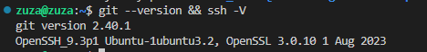
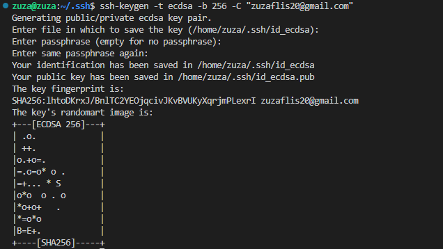
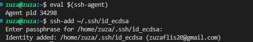
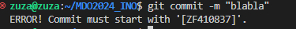
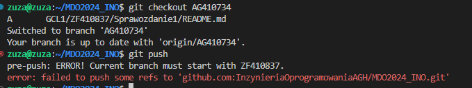

# Sprawozdanie 1 

> **Główne punkty sprawozdania :**
 > - komendy gita 
 > - git hook
 > -  klucze SSH
 > - docker


# Przygotowanie środowiska

Sprawdzenie czy mamy już domyslne zainstalowanego Git klienta i openSSH:
```bash
ssh -V
git --version
```


Instalacja klienta Git i SSH w systemie **ubuntu** przebiega w następujący sposób: 

- Aktualizacja listy pakietów
```bash
sudo apt update 
```
- Instalacja klienta Git
```bash
sudo apt install git
```
- Instalacja  OpenSSH
```bash
sudo apt install openssh-client
```


## Klucze SSH
Docs: [ssh-keygen](https://docs.oracle.com/cd/E36784_01/html/E36870/ssh-keygen-1.html)

Najpierw sprawdźmy istniejące już pary kluczy za pomocą polecenia:
```bash
ls -al ~/.ssh
```

Aby utworzyć parę kluczy nalezy użyć komendy ssh-keygen. Utworzenie klucza RSA przebiega za pomocą polecenia:
```bash
ssh-keygen -t rsa -b 4096 -C
```


 W moim wypadku mam już utworzony klucz publiczny RSA. W zadaniu  należało wygenerować dwa inne klucze niż RSA, wybieram ed25519 i ECDSA. Wygenerowane klucze muszą znaleźć się w folderze nazwanym .ssh. Przechodzimy do tego folderu za pomocą polecnia:
```bash
cd ~/.ssh
```
Tworzenie klucza:
```bash
ssh-keygen -t ecdsa -b 256 -C "your_email@example.com"
```

Utworzony klucz: 


Dodanie klucza do SSH agenta:
```bash
ssh-add ~/.ssh/id_ecdsa
```
Uruchomienie agenta jeśli wystepuje 'Could not open a connection to your authentication agent.'
```bash
eval $(ssh-agent)
```

 
 Aby dodać klucz do konta na Githubie należy przejść:
 
  >Settings
  >SSH and GPG keys(left side) 
  > Add new SSH key
 
 W miejscu key należy wkleić skopiowaną wartość klucza publicznego, któa znajduje się w  ~/.ssh. Plik z rozszerzeniem .pub.
 Po wykonaniu tych kroków możemy użyć klucza ECDSA do uwierzytelniania za pomocą SSH.
Klonowanie repo poprzez SSH:
```bash
git clone git@github.com:InzynieriaOprogramowaniaAGH/MDO2024_INO.git
```
 
## Komendy Git

- Lista wszystkich gałęzi, zarówno lokalnych, jak i zdalnych.
```bash
	git branch --all
```
-  Tworzy nową gałąź o nazwie `[nazwa]` i przechodzi na nią.
```bash
	git checkout -b [nazwa]
```
- Przechodzi na istniejącą gałąź o nazwie `[nazwa]`
```bash
	git checkout [nazwa]
```
- Usuwa lokalną gałąź o nazwie `[nazwa]`
```bash
	git branch -d [nazwa]
```
- Zmienia nazwę bieżącej gałęzi z `[stara_nazwa]` na `[nowa_nazwa]`
```bash
	git branch -m [stara_nazwa] [nowa_nazwa]
```
 - Dodaje zmiany do obszaru 'staged', można dać ' .' aby dodać wszystkie zmiany.
 ```bash
	git add [nazwa_pliku]
```
- Tworzy nowy commit ze zmianami dodanymi  z opcjonalną wiadomością commita
 ```bash
	git commit -m "[wiadomość_commita]
```
-  Wysyła zmiany z lokalnej gałęzi do zdalnego repozytorium(jeśli jestesmy na dobrej branchy)
```bash
	git push 
```
- Pobiera zmiany z zdalnego repozytorium i łączy je ze zmianami na bieżącej gałęzi. Można użyć opcji '--rebase' jeśli chcemy uniknąć niepotrzebnych merge commitów.
```bash
	git pull
```
- Pobiera zmiany z określonej zdalnej gałęzi, ale nie łączy ich automatycznie z lokalną gałęzią.
```bash
	git fetch [nazwa_zdalnego_repozytorium] [nazwa_zdalnej_gałęzi]
```
- Usuwanie ostatniego commita, opcja --hard usuwa zmiany też z katalogu roboczego, --soft zachowuje zmiany.
```bash
	git reset --hard HEAD~1
	git reset --soft HEAD~1
```
- Usunięcie zmian w określonym pliku.
```bash
	git checkout -- <nazwa_pliku>
```
- Cofanie dodania ostatnich zmian do obszaru 'staged' (zmiany zostaja zachowane w katalogu)
```bash
	git restore --staged <file>
```

## Dodanie git hooka
Git hook to skrypt, któy jest automatycznie uruchamiany w odpowiedzi na określone wydarzenie w repozytorium Git, np. automatyczne formatowanie kodu przed comitowaniem.git  Aby działaly poprawnie muszą znajdować się w folderze .git/hooks. Aby się do niego dostać musimy przejść z głównego folderu ~/MD2024_INO do hooks za pomocą:
```bash
	cd ./.git/hooks
```
Tam aby hooki działały nalezy usunąc '.sample' z nazwy przykładowego hooka i edytować go lub zostawić. Po tej poprawce hook powinien automatycznie działać.

Stworzyłam dwa git hooki, jeden walidujący komunikat commita(musi zaczynać się od "[ZF410837]", drugi sprawdzający czy próbujemy zrobić pusha w dobrej branchy czyli znowu mojej nazwy "ZF410837".


**commit-msg**


**pre-push**
