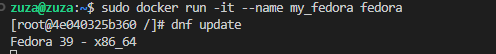

# Sprawozdanie 1 

> **Główne punkty sprawozdania :**
 > - komendy gita 
 > - git hook
 > -  klucze SSH
 > - docker


# Przygotowanie środowiska

Sprawdzenie czy mamy już domyslne zainstalowanego Git klienta i openSSH:
```bash
ssh -V
git --version
```


Instalacja klienta Git i SSH w systemie **ubuntu** przebiega w następujący sposób: 

- Aktualizacja listy pakietów
```bash
sudo apt update 
```
- Instalacja klienta Git
```bash
sudo apt install git
```
- Instalacja  OpenSSH
```bash
sudo apt install openssh-client
```


## Klucze SSH
Docs: [ssh-keygen](https://docs.oracle.com/cd/E36784_01/html/E36870/ssh-keygen-1.html)

Najpierw sprawdźmy istniejące już pary kluczy za pomocą polecenia:
```bash
ls -al ~/.ssh
```

Aby utworzyć parę kluczy nalezy użyć komendy ssh-keygen. Utworzenie klucza RSA przebiega za pomocą polecenia:
```bash
ssh-keygen -t rsa -b 4096 -C
```


 W moim wypadku mam już utworzony klucz publiczny RSA. W zadaniu  należało wygenerować dwa inne klucze niż RSA, wybieram ed25519 i ECDSA. Wygenerowane klucze muszą znaleźć się w folderze nazwanym .ssh. Przechodzimy do tego folderu za pomocą polecnia:
```bash
cd ~/.ssh
```
Tworzenie klucza:
```bash
ssh-keygen -t ecdsa -b 256 -C "your_email@example.com"
```

Utworzony klucz: 


Dodanie klucza do SSH agenta:
```bash
ssh-add ~/.ssh/id_ecdsa
```
Uruchomienie agenta jeśli wystepuje 'Could not open a connection to your authentication agent.'
```bash
eval $(ssh-agent)
```


 
 Aby dodać klucz do konta na Githubie należy przejść:
 
  >Settings
  >SSH and GPG keys(left side) 
  > Add new SSH key
 
 W miejscu key należy wkleić skopiowaną wartość klucza publicznego, któa znajduje się w  ~/.ssh. Plik z rozszerzeniem .pub.
 Po wykonaniu tych kroków możemy użyć klucza ECDSA do uwierzytelniania za pomocą SSH.
Klonowanie repo poprzez SSH:
```bash
git clone git@github.com:InzynieriaOprogramowaniaAGH/MDO2024_INO.git
```
 
## Komendy Git z zajęć

- Lista wszystkich gałęzi, zarówno lokalnych, jak i zdalnych.
```bash
	git branch --all
```
-  Tworzy nową gałąź o nazwie `[nazwa]` i przechodzi na nią.
```bash
	git checkout -b [nazwa]
```
- Przechodzi na istniejącą gałąź o nazwie `[nazwa]`
```bash
	git checkout [nazwa]
```
- Usuwa lokalną gałąź o nazwie `[nazwa]`
```bash
	git branch -d [nazwa]
```
- Zmienia nazwę bieżącej gałęzi z `[stara_nazwa]` na `[nowa_nazwa]`
```bash
	git branch -m [stara_nazwa] [nowa_nazwa]
```
 - Dodaje zmiany do obszaru 'staged', można dać ' .' aby dodać wszystkie zmiany.
 ```bash
	git add [nazwa_pliku]
```
- Tworzy nowy commit ze zmianami dodanymi  z opcjonalną wiadomością commita
 ```bash
	git commit -m "[wiadomość_commita]
```
-  Wysyła zmiany z lokalnej gałęzi do zdalnego repozytorium(jeśli jestesmy na dobrej branchy)
```bash
	git push 
```
- Pobiera zmiany z zdalnego repozytorium i łączy je ze zmianami na bieżącej gałęzi. Można użyć opcji '--rebase' jeśli chcemy uniknąć niepotrzebnych merge commitów.
```bash
	git pull
```
- Pobiera zmiany z określonej zdalnej gałęzi, ale nie łączy ich automatycznie z lokalną gałęzią.
```bash
	git fetch [nazwa_zdalnego_repozytorium] [nazwa_zdalnej_gałęzi]
```
- Usuwanie ostatniego commita, opcja --hard usuwa zmiany też z katalogu roboczego, --soft zachowuje zmiany.
```bash
	git reset --hard HEAD~1
	git reset --soft HEAD~1
```
- Usunięcie zmian w określonym pliku.
```bash
	git checkout -- <nazwa_pliku>
```
- Cofanie dodania ostatnich zmian do obszaru 'staged' (zmiany zostaja zachowane w katalogu)
```bash
	git restore --staged <file>
```

## Dodanie git hooka
Git hook to skrypt, któy jest automatycznie uruchamiany w odpowiedzi na określone wydarzenie w repozytorium Git, np. automatyczne formatowanie kodu przed comitowaniem.git  Aby działaly poprawnie muszą znajdować się w folderze .git/hooks. Aby się do niego dostać musimy przejść z głównego folderu ~/MD2024_INO do hooks za pomocą:
```bash
	cd ./.git/hooks
```
Tam aby hooki działały nalezy usunąc '.sample' z nazwy przykładowego hooka i edytować go lub zostawić. Po tej poprawce hook powinien automatycznie działać.

Stworzyłam dwa git hooki, jeden walidujący komunikat commita(musi zaczynać się od "[ZF410837]", drugi sprawdzający czy próbujemy zrobić pusha w dobrej branchy czyli znowu mojej nazwy "ZF410837".


**commit-msg**


**pre-push**


# Docker

**Docker to narzędzie do konteneryzacji, umożliwia pakowanie, dostarczanie i uruchamianie aplikacji w izolowanych środowiskach zwanych kontenerami.**

Konteneryzacja polega na pakowaniu aplikacji i wszystkich zależności w kontener który można łatwo uruchamiać na róznych platformach. Kontenery są izolowane od siebie i od hosta, co oznacza że każdy działa w swoim własnym środowisku, niezależnie od innych kontenerów.

Kontener zawiera wszystkie składniki potrzebne do uruchomienia aplikacji, włącznie z kodem źródłowym, zależnościami, bibliotekami systemowymi i środowiskiem wykonawczym. Kontenery są oparte na obrazach Docker'a, które są szablonami zawierającymi wszystkie wymagane elementy do uruchomienia aplikacji. Obrazy Docker'a są tworzone za pomocą plików konfiguracyjnych Dockerfile, które określają kroki potrzebne do zbudowania obrazu.

> Official Docker:  [docker-docs](https://docs.docker.com/get-docker/)

## Docker komendy z zajęć

**Tworzenie nowego kontenera**


- Nowy obraz
```bash
	docker run IMAGE
```
-  Zmiana nazwy obrazu
```bash
	docker tag IMAGE_ID nowa_nazwa_obrazu:tag
```
-  Mapowanie portów kontenera i uruchomienie obrazu
```bash
	docker run -p HOSTPORT:CONTAINERPORT IMAGE
```
**Zarządzanie kontenerami**

- Wyświetlanie uruchomionych kontenerów(opcja '-a' wyświetla WSZYSTKIE kontenery)
```bash
	docker ps
```
- Usuwanie kontenera
```bash
	docker rm CONTAINER
```
 - Zatrzymywanie kontenera
 ```bash
	docker stop CONTAINER
```
 - Uruchamianie kontenera
 ```bash
	docker start CONTAINER
```

**Zarządzanie obrazami**
- Pobieranie obrazu
```bash
	docker pull IMAGE[:TAG]
```
-  Usuwanie obrazu
```bash
	docker rmi IMAGE
```
 - Wyświetlanie obrazów
 ```bash
	docker images
```
 -  Budowanie obrazu na podstawie pliku Dockerfile
 ```bash
	docker build DIRECTORY
```
 DIRECTORY - ścieżka do pliku Dockerfile
**Rozwiązywanie problemów i informacje**

-Wyświetlanie logów
```bash
	docker logs CONTAINER
```
-   Wyświetlanie procesów
```bash
	docker top CONTAINER
```
 - Wyświetlanie zmapowanych portów
 ```bash
	docker port CONTAINER
```


## Pobranie obrazów i ich uruchomienie

Aby pobrać obrazy używamy docker pull, ażeby wyświetlić docker images. Moje pobrane obrazy:


Aby je uruchomić uzywamy komendy docker run. Aby uruchomić obraz taki jak 'busybox' interaktywnie  dodajemy opcję '-i'.  Aby wywołać numer wersji używamy komendy:
 ```bash
	uname -a
```


**Uruchomienie systemu w kontenerze**

System, który wybieram to fedora, ponieważ pracuje na ubuntu. 

Uruchamiamy poleceniem:
 ```bash
	docker run -it --name my-fedora fedora
```
Opcja '-i' umozliwia interaktywny tryb, a '-t' tworzy pseudoterminal.


Aby zaktualizować pakiety należy użyć :
 ```bash
	dnf update
```



PID1 w kontenerze odpowiada za inicjalizację i zarządzanie wszystkimi innymi procesami wewnątrz kontenera. Aby zaprezentować 'PID1' w kontenerze fedora używamy komendy(przed musimy zainstalować bibliotekę procps):

 ```bash
	ps
```


Procesy na hoście: 


Jak widać procesy w kontenerze zaczynaja się od 'basha' co pokazuje jak izolowany jest system fedory w kontenerze. Powłoka 'bash' jest procesem inicjalizacyjnym dla tego kontenera. 
 Kontenery Docker są oparte na mechanizmach izolacji jądra systemu Linux, takich jak przestrzenie nazw i grupy kontrolne. Przestrzenie nazw(namespaces) izolują globalne zasoby systemowe, dzięki temu uzyskujemy wrażenie, że każdy kontener działa w swoim własnym odseparowanym środowisku. Grupy kontrolne (cgroups) kontrolują zuzycie zasobów CPU, pamięć, dysk itp.

Procesy w kontenerze widzą tylko zasoby dostępne wewnątrz tego kontenera i są ograniczone przez zasady izolacji nałożone przez Docker Engine lub inny silnik kontenerów.


Aby wyjść z kontenera wystarczy wpisać 'exit'.

## Tworzenie Dockerfile
Przy tworzeniu kierujemy się [dobrymi praktykami](https://docs.docker.com/develop/develop-images/dockerfile_best-practices/).


  ```bash
FROM fedora:latest
	
RUN dnf install -y git

RUN git clone https://github.com/InzynieriaOprogramowaniaAGH/MDO2024_INO.git

WORKDIR /repos

CMD ["/bin/bash"]
```

- **FROM fedora:latest**
 określa, że obraz będzie buowany na bazie najnowszego obrazu Fedory.
 
 - **RUN dnf install -y git**
  instalacja Gita wewnatrz kontenera, flaga '-y' oznacza automatyczne potwierdzenie pytań związanych z instalacja.
  
  - **RUN git clone**
  klonowanie repozytorium
  
  - **WORKDIR /repos**
   ustawia katalog roboczy w kontenerze na '/repos', co oznacza, że kolejne operacje na plikach bedą wykonywane w tym katalogu
  
  - **CMD ["/bin/bash"]**
   to poleceniedefiniuje domyslną komendę jaka zostanie uruchomiona po uruchomieniu kontenera, w tym wypadku będzie dostepny wiersz poleceń 'bash'.


Zmiana nazwy i wyświetlenie:


Zbudowanie obrazu w trybie interaktywnym i pokazanie naszego repo: 


Pokazanie uruchomionych kontenerów i WSZYTSKICH kontenerów w podanej kolejności:


Zatrzymanie działających kontenerów i usunięcie ich.

 ```bash
	docker stop $(docker ps -aq)
	docker rm $(docker ps -aq)
	
```

Usuwanie obrazów:

 ```bash
	 docker rmi $(docker images -aq)
```


