# Sprawozdanie 2

> **Główne punkty sprawozdania :**
 > - budowa i testowanie wybranych aplikacji w kontenerze
 > -  tworzenie docker compose
 > -  korzystanie z wolumenów
 > -  iperf3
 > -  jenkins

W ramach zajęć przeprowadzamy operacje budowy i testowania wybranych aplikacji z wykorzystaniem różnych narzędzi (u mnie npm, meson i maven). Na tej podstawie następnie zautomatyzujemy cały proces poprzez stworzenie plikow Dockerfile. Poprzez nieumieszczanie poleceń CMD i ENTRYPOINT w plikach Dockerfile, kontenery są tworzone i kończą swoje działanie natychmiast po poprawnej budowie lub teście aplikacji (kod exit 0). Dzięki temu uzyskujemy środowisko o zdefiniowanej architekturze i konfiguracji, które wymaga niewielkich zasobów sprzętowych, co ułatwia automatyzację procesu (budowanie, testowanie, wdrażanie). Kontenery służą głównie do budowy i testowania aplikacji, a nie do ich uruchamiania. Jest to szczególnie istotne ze względu na to, że uruchamianie aplikacji graficznych lub interaktywnych w kontenerach może być mniej wydajne lub niepraktyczne, ponieważ kontenery są przede wszystkim przeznaczone do pracy w tle lub do serwowania usług.


## Wybór oprogramowania na zajęcia

Wybrałam repozytoria z zajęć:
-  [https://github.com/devenes/node-js-dummy-test](https://github.com/devenes/node-js-dummy-test)  (npm)
-   [https://github.com/irssi/irssi](https://github.com/irssi/irssi)  (meson)

Oraz
- https://github.com/spring-projects/spring-petclinic (maven)

Licencja dla wszystkich umożliwia korzystanie z kodu. Środowiska umożliwiają budowanie i testowanie.


## Wykorzystanie narzędzia Maven

Aby zbudować projekt w kontenerze maven, wykonujemy następujące kroki: Uruchamiamy kontener w trybie interaktywnym, instalujemy git, jeśli nie jest już zainstalowany w kontenerze, wykonujemy skrypt mavena do budowy projektu, a następnie uruchamiamy skrypt do wykonania testów aplikacji.


```bash
docker run -it maven:latest /bin/bash
git clone https://github.com/spring-projects/spring-petclinic.git
cd spring-petclinic
./mvnw compile
./mvnw test
```

Budowa:

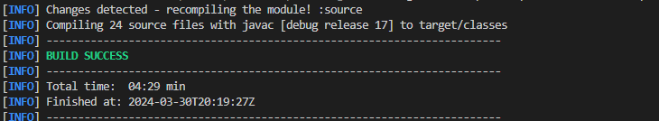

Testy:

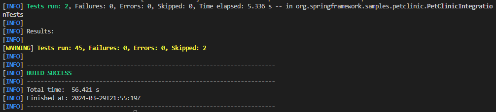

### Automatyzacja powyższych operacji

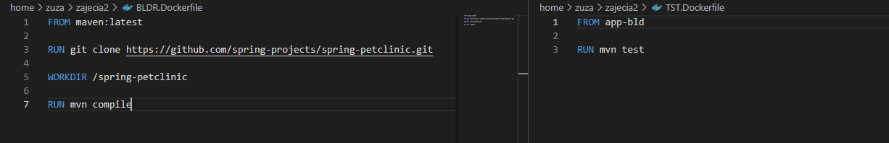

Aby zbudować używam komendy:
```bash
	docker build -t app-bld -f BLDR.Dockerfile .
```
Tak samo robimy dla testów.

- Poprawność wykonania możemy sprawdzić poprzez: 
 
```bash
	docker run bld-app
	docker run tst-app
```
Wynik :
 
 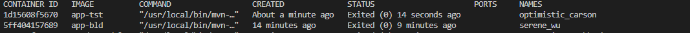

## Wykorzystanie środowiska npm

Zadanie wykonuje w wersji z Dockerfile, ponieważ wcześniejszą wykonywaliśmy na zajęciach.

Wersja zautomatyzowana: 

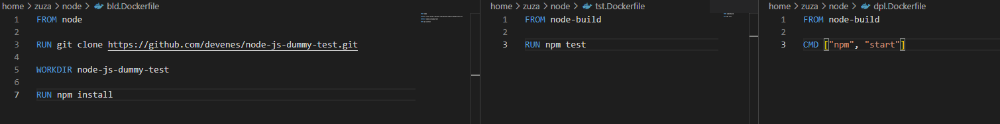

Wynik działania: 

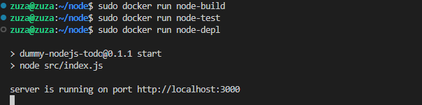    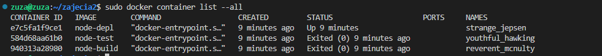


## Docker Compose
Docker Compose to narzędzie do definiowania i uruchamiania wielu kontenerów jako pojedynczej aplikacji. Pozwala ono zdefiniować konfigurację aplikacji w pliku YAML, w którym określane są kontenery, sieci, wolumeny oraz inne ustawienia.

Plik napisany dla kontenerów stworzonych dla aplikacji napisanej w javie:

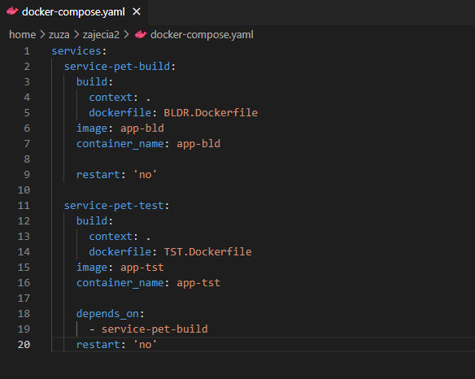


Aby uruchomić ten plik musimy pobrać rozszerzenie docker-compose, a później wykonać operację:
 ```bash
	docker-compose up
```


Plik dla środowiska node:

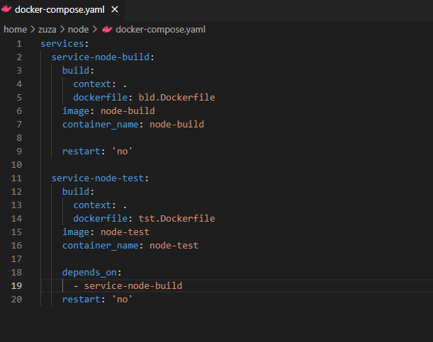


Wynik działania: 

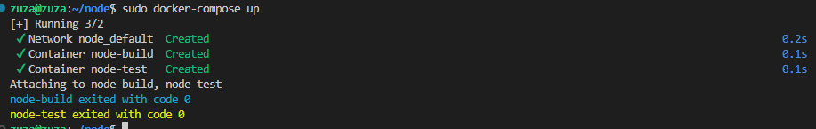

# Część 2

## Zachowywanie stanu

Wolumeny w dockerze służą do przechowywania danych, które mają być dostępne pomiędzy różnymi kontenerami lub zachowane nawet po zniszczeniu kontenera. W wolumenie najczęściej przechowywane są dane produkcyjne aplikacji takie jak bazy danych, pliki konfiguracyjne, czy zmienne środowiskowe.

Należy zbudować kontener do budowania aplikacji, w taki sposób aby dostarczyć do niego kod z zewnatrz lub skopiować go w środku, następnie zbudować aplikacje i zapisać potrzebne pliki w wolumenie wyjściowym


 -   **Przygotuj wolumeny wejściowy i wyjściowy, o dowolnych nazwach, i podłącz je do kontenera bazowego, z którego rozpoczynano poprzednio pracę**  

Tworzenie wolumenów następuje poprzez komendy:
 ```bash
	docker volume create input_volume
	docker volume create output_volume
```

Aby sklonować repozytorium na wolumen wejściowy możemy utworzyć nowy kontener podpiąc do niego wolumen i wewnatrz klonować repo. 

- **Klonowanie repozytorium wewnątrz pomocniczego kontenera**
Montujemy wolumen do kontenera za pomocą *--mount source=<volume>,destination=<path_in_container>* lub *-v <volume>:<path_in_container>*
```bash
	docker run -it -v input_volume:/irssi fedora bash
```
Nastepnie musimy sklonować repozytorium na odpowiednią ścieżkę(!).
```bash
	git clone https://github.com/irssi/irssi
```

 Po zakończeniu możemy sprawdzić czy wszystko się zgadza: 
 
  ```bash
sudo ls /var/snap/docker/common/var-lib-docker/volumes/input_volume/_data
```


## Wykonanie powyższych kroków w kontenerze bazowym

- Uruchomienie kontenera bazowego i podłączenie wolumenów

 ```bash
docker run -it --name base_container
 --mount source=input_volume, destination=/input
 --mount source=output_volume, destination=/output
 ubuntu bash

```

- Instalacja wymagań
```bash
	apt-get update
```

- Sklonowanie repozytorium na wolumenie wejściowym

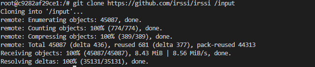


- Uruchomienie procesu budowania 
Najpierw musimy przejść do folderu w którym jest repozytorium jest zapisane w wolumenie wejściowym.

 ```bash
	cd input
```

Nastepnie budujemy za pomocą:
 ```bash
	meson Build
	ninja -C Build
```

Pliki wynikowe zostały zapisane w wolumenie wyjściowym:

[](ss/13.png)


**Sprawdzenie poprawności wykonania wolumenów:**
 ```bash
sudo ls /var/snap/docker/common/var-lib-docker/volumes/input_volume/_data
```

[](ss/14.png)

## Wykonanie powyższych kroków za pomocą Dockerfile

W pliku Dockerfile instrukcja VOLUME jest używana do określenia punktu dla wolumenu wewnątrz kontenera. Wolumen zostanie utworzony podczas budowy kontenera i może być dostępny oraz modyfikowany przez procesy działające wewnątrz kontenera.


 ```bash
FROM ubuntu:latest

# Instalacja wymaganych narzędzi
RUN apt-get update && apt-get install -y \
git \
meson \
ninja-build \
glib2.0 \
libncurses5 \
libncurses5-dev \
perl

# Katalogi na wolumeny wejściowy i wyjściowy
RUN mkdir -p /input_volume /output_volume

# Przygotowanie wolumenów
VOLUME /input_volume_dock /output_volume_dock

# Ustawienie katalogu roboczego na wolumenie wejściowym
WORKDIR /input_volume


# Klonowanie na wolumen wejściowy
RUN git clone https://github.com/irssi/irssi .

RUN meson Build && ninja -C /irssi/Build

  
# Kopiowanie build do wolumenu wyjściowego
RUN cp -r /input_volume/Build /output_volume_dock
	
```


Do powyższego można jeszcze dodać opcję dostarczania kodu z zewnatrz za pomoca wolumenu.
# Eksponowanie portu

Iperf3 to narzędzie do pomiaru przepustowości sieciowej między dwoma punktami końcowymi. Pozwala na wykonanie testów wydajnościowych sieci TCP, UDP i SCTP poprzez generowanie ruchu sieciowego między serwerem a klientem.


- **Uruchomienie kontenera serwera**


Tworzymy dockerfile, który będzie nam budował obraz tworzący serwer. 
 ```bash
FROM fedora:latest

#instalacja iperf3

RUN dnf install -y iperf3 && dnf clean all

# uruchomienie serwera

CMD ["iperf3", "-s"]
```

Budujemy obraz za pomocą:


 ```bash
sudo docker build -t iperf-server -f server.Dockerfile .
```

Uruchamiamy kontener w tle(opcja -d) na podstawie naszego obrazu. Port 5201 jest portem domyslnym dla aplikacji iperf3.

 ```bash
docker run -d --name iperf-server iperf-server
```


Kontener z serwerem:

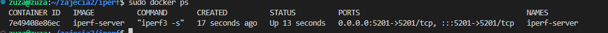

- **Uruchomienie kontenera klienta**

Uruchamiamy kontener dla klienta

 ```bash
docker run -it --name iperf-client fedora /bin/bash
```


Pobieramy iperf3, a nastepnie próbujemy połączyć się z IP serwera.

 ```bash
iperf3 -c <adres_IP_serwera>
```
 IP serwera mozemy znaleźć za pomocą komendy 'inspect'.

 ```bash
docker inspect -f '{{range .NetworkSettings.Networks}}{{.IPAddress}}{{end}}' iperf-server
``` 

Wynik połączenia: 

 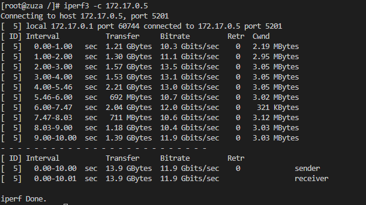


# Sieć mostkowa
Polecenie 'docker network create' jest używane do tworzenia nowych sieci w Dockerze. Podczas instalacji Docker Engine tworzona jest automatycznie sieć typu bridge, która odpowiada mostkowi docker0, przy uruchamianiu nowego kontenera za pomocą 'docker run' automatycznie łączy się z tą siecią.
Tworzenie swojej własnej sieci mostkowej umozliwia konfigurowanie różnych parametrów sieci, takich jak typ sieci, nazwa sieci, adresy IP, bramy domyślne, ograniczenia przepustowości i wiele innych

- **Tworzenie własnej sieci mostkowej**

 ```bash
	docker network create iperf-network
```

- **Uruchomienie kontenera serwera iperf3 w utworzonej sieci**

Uruchamiam kontener serwera iperf3, aby działał w utworzonej sieci 'iperf-network'. za pomocą '--network'. Wykorzystam do tego wcześniej utworzony obraz 'iperf-server'.

 ```bash
docker run -d --name iperf-server-net --network iperf-network iperf-server
```

- **Uruchomienie kontenera klienta iperf3 w utworzonej sieci**
Podobnie jak wcześniej, uruchamiamy klienta w trybie terminalowym w utworzonej wczesniej sieci.

 ```bash
docker run -it --name iperf-client-net --network iperf-network fedora /bin/bash
```

- **Połączenie z serwerem z poziomu klienta**
Tym razem  nie musimy podawać adresu IP bo zostanie automatycznie rozpoznany na podstawie nazwy kontenera w utworzonej sieci.

 ```bash
iperf3 -c iperf-server-net
```

Wynik:

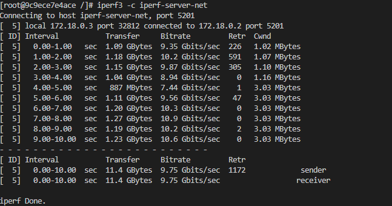

Inspekcja sieci:

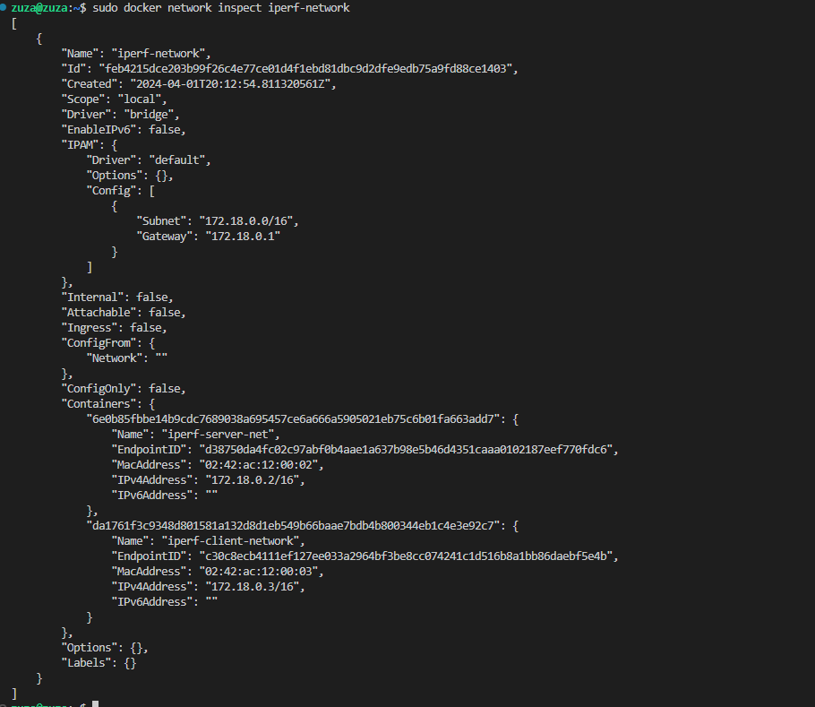


- Łączenie się z hosta, z maszyny wirtualnej

Łącze się do utworzonego wczesniej serweru z własną siecią.
 ```bash
iperf3 -c 172.18.0.2
```

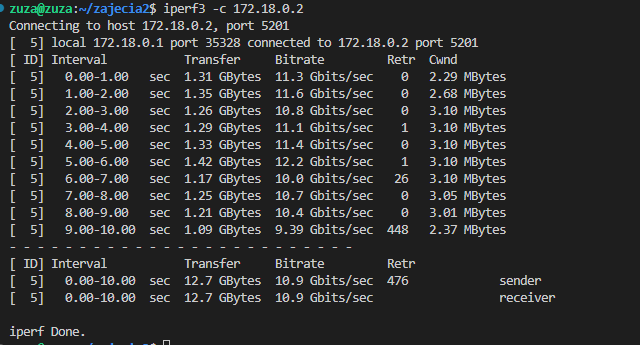

- **Logi z kontenera**

Aby znaleźć logi z poziomu systemu plików hosta można użyć polecenia *docker logs <container_name>*.


Aby podłączyć wolumen do kontenera i zapisywać do niego logi oraz inne dane możemy:

1. Utworzyć wolumen za pomocą *docker volume create*
2. Uruchomić kontener, podłączając wolumen, używamy opcji *--mount*
 ```bash
docker run -d --name nazwa --mount source=nazwa_wolumenu,target=/sciezka/w/kontenerze nazwa_obrazu_kontenera
```

3. Po uruchomieniu kontenera można wykonać polecenie 'find' wewnatrz, aby znaleźć logi:

 ```bash
docker exec nazwa find /sciezka/w/kontenerze -name "*.log"
```


## Instancja Jenkins

Idąc zgodnie z instrukcjami:
https://www.jenkins.io/doc/book/installing/docker/.

- Tworzymy sieć:
 ```bash
docker network create jenkins
```

- Uruchamiamy kontener z DIND
 ```bash
docker run \
  --name jenkins-docker \
  --rm \
  --detach \
  --privileged \
  --network jenkins \
  --network-alias docker \
  --env DOCKER_TLS_CERTDIR=/certs \
  --volume jenkins-docker-certs:/certs/client \
  --volume jenkins-data:/var/jenkins_home \
  --publish 2376:2376 \
  docker:dind \
  --storage-driver overlay2
```

- Dostosowujemy oficjalny obraz Jenkins za pomocą swojego Dockerfile.
 - Budujemy nowy obraz
 ```bash
docker build -t myjenkins-blueocean:2.440.2-1 -f jenkins.Dockerfile .
```
-  Uruchomienie kontenera Jenkinsa na podstawie obrazu
 ```bash
docker run \
  --name jenkins-blueocean \
  --restart=on-failure \
  --detach \
  --network jenkins \
  --env DOCKER_HOST=tcp://docker:2376 \
  --env DOCKER_CERT_PATH=/certs/client \
  --env DOCKER_TLS_VERIFY=1 \
  --publish 8080:8080 \
  --publish 50000:50000 \
  --volume jenkins-data:/var/jenkins_home \
  --volume jenkins-docker-certs:/certs/client:ro \
  myjenkins-blueocean:2.440.2-1
```

Teraz po wpisaniu w przeglądarke IP host:8080, otrzymujemy:
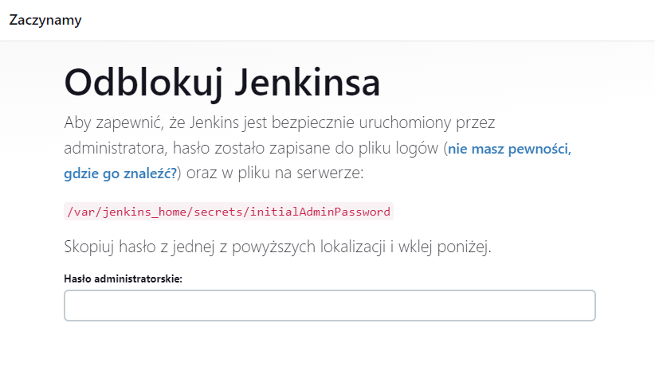


Kontenery:
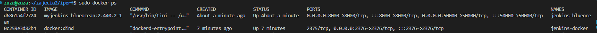

