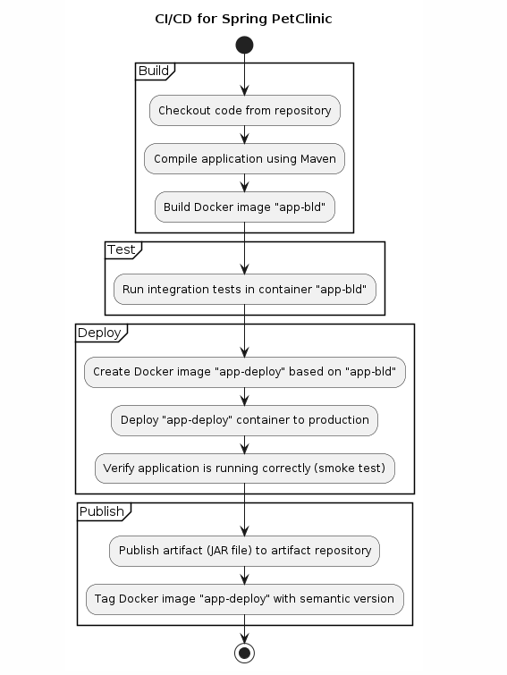
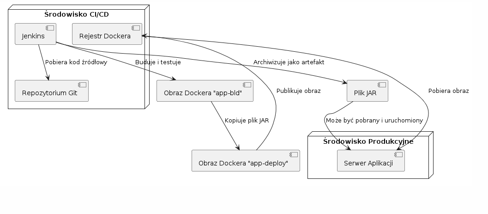
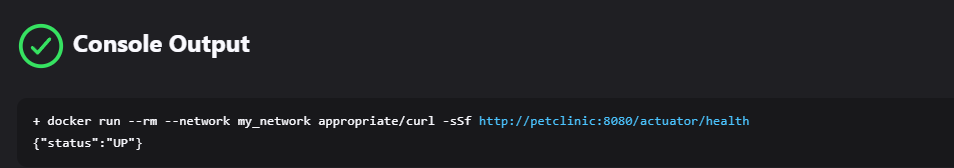
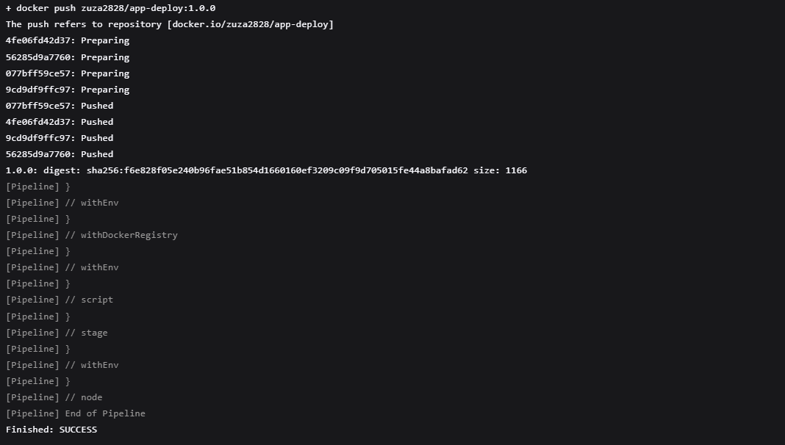
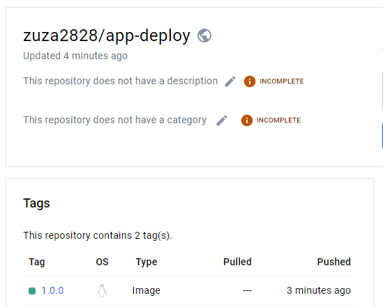
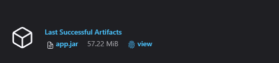
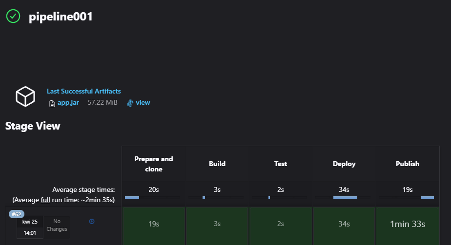
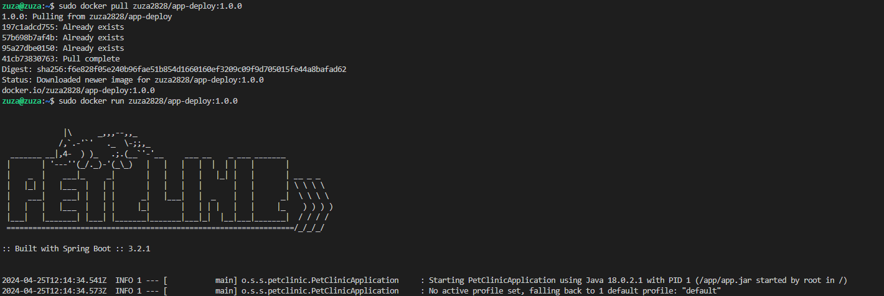

# Sprawozdanie 3

Laboratoria polegały na przeniesieniu procesu budowy i testowania programu do pipeline'u Jenkins z wykorzystaniem kontenerów Docker. Nastepnie opiszę również kroki deploy i publish, odpowiednio dostosowane do wybranego przeze mnie programu.


# Łączenie się z Jenkinsem

Opis instalacji Jenkinsa + DIND znajduje się we wcześniejszym sprawozdaniu. Obecnie działające kontenery umożliwiające połączenie z jenkinsem to: 


 Kontener `jenkins-blueocean` zawiera serwer Jenkins wraz z zainstalowanym dodatkiem Blue Ocean. Blue Ocean to interfejs graficzny dla Jenkins, który oferuje narzędzia do zarządzania CI/CD, wizualizację wyników oraz monitorowanie pipeline'ów.

 Kontener `docker:dind` dostarcza usługę Docker-in-Docker, co oznacza, że wewnatrz tego kontenera można uruchamiać inne kontenery.  Czyli umożliwia uruchamianie kontenerów Docker wewnatrz środowiska CI/CD, bez konieczności instalacji Dockera na serwerze Jenkins.

Aby połączyć się z serwerem wystarczy wpisać IP hosta na którym Jenkins jest uruchomiony oraz port na którym nasłuchuje serwer (jest to 8080).

##  Użyta aplikacja

Wybrany przeze mnie program to : https://github.com/spring-projects/spring-petclinic

Jest to aplikacja webowa napisana w Javie 17 korzystająca z Maven i Spring. Aplikacja buduje się i przechodzi testy oraz posiada odpowiednią licencję do przetwarzania kodu (sprawdzone w sprawozdaniu 2) .


##  Diagramy UML i wymagania

### Wymagania wstępne środowiska
Aby uruchomić proces CI dla aplikacji PetClinic, wymagane są następujące elementy:

1.  **Java 17 lub nowsza (pełne JDK, nie JRE)**: Aplikacja  wymaga pełnej instalacji Java Development Kit (JDK) w wersji 17 lub nowszej.
2.    **Maven**: Narzędzia do budowania i zarządzania zależnościami projektu Java.
3.  **Git**.

### Diagram aktywności



###  Diagram wdrożeniowy



## Różnica między DIND a budowaniem bezpośrednio w kontenerze CI.
1.  **Podejście DIND (Docker in Docker)**:
   
    -   W podejściu DIND, kontener CI (np. Jenkins) uruchamia inny kontener Dockera, w którym następuje kompilacja i testowanie aplikacji.
    -   Zalety DIND:
        
        -   Zapewnia izolowane środowisko do budowania i testowania, niezależne od maszyny hosta.
        -   Umożliwia wykorzystanie różnych wersji Dockera lub obrazów bazowych w zależności od potrzeb.
        
    -   Wady DIND:
        
        -   Dodatkowa warstwa abstrakcji może zwiększać złożoność konfiguracji i zarządzania.
        -   Wydajność może być nieco niższa ze względu na dodatkową warstwę wirtualizacji.
        
    
2.  **Budowanie bezpośrednio w kontenerze CI**:
    -   Budowanie i testowanie aplikacji odbywa się bezpośrednio w kontenerze CI (Jenkins), bez korzystania z dodatkowego kontenera Dockera.
    -   Zalety budowania bezpośrednio w kontenerze CI:
        
        -   Prostota konfiguracji i zarządzania - brak dodatkowej warstwy abstrakcji.
        -   Potencjalnie lepsza wydajność, ponieważ nie ma dodatkowej wirtualizacji.
        
    -   Wady budowania bezpośrednio w kontenerze CI:
        -   Ograniczenie do środowiska i narzędzi dostępnych w kontenerze CI.
        -   Mniejsza elastyczność w konfiguracji środowiska budowania.


**Używam podejścia pierwszego DIND.**


## Przeniesienie build + test do pipeline'u Jenkins


Na podstawie dockerfile z poprzedniego sprawozdania tworzę etapy: `Prepare and clone`, `Build` i `Test` dla aplikacji.  Omówienie poszczególnych etapów:

1.  **Prepare and clone**: W tym etapie wykonuje się przygotowanie i klonowanie repozytorium kodu z GitHuba. Najpierw usuwane są istniejące pliki z katalogu `MDO2024_INO/` (ponieważ wszystkie dane z pipeline są zapisywane w jednej lokalizacji), a następnie repozytorium jest klonowane. Po sklonowaniu repozytorium przechodzi się do katalogu `MDO2024_INO/` i wykonywane jest przełączenie na konkretny branch  `ZF410837`.
2. **Build**: W tym etapie buduje się obraz aplikacji przy użyciu pliku Dockerfile `pet_app_bld.Dockerfile` znajdującego się w katalogu `MDO2024_INO/GCL1/ZF410837/Sprawozdanie2/pet_app_dockerfiles`. Obraz jest oznaczany jako `app-bld`.
3. **Test**: W tym etapie buduje się obraz testowy aplikacji przy użyciu pliku Dockerfile `pet_app_tst.Dockerfile`. Obraz ten jest oznaczany jako `app-tst` i jest oparty na obrazie `app-bld`, co umożliwia przeprowadzenie testów, korzystając z artefaktów zbudowanych w poprzednim etapie.


```pipeline {
    agent any
    stages {
        stage('Prepare and clone') {
            steps {
                sh "rm -rf MDO2024_INO/"
                sh "git clone https://github.com/InzynieriaOprogramowaniaAGH/MDO2024_INO.git"
                dir ("MDO2024_INO") {
                    sh "git checkout ZF410837"
                }
            }
        }
        stage('Build'){
            steps {
                dir("MDO2024_INO/GCL1/ZF410837/Sprawozdanie2/pet_app_dockerfiles") {
                    sh "docker build -t app-bld -f pet_app_bld.Dockerfile ."
                }
            }
        }
        
        stage('Test'){
            steps {
                dir("MDO2024_INO/GCL1/ZF410837/Sprawozdanie2/pet_app_dockerfiles") {
                    sh "docker build -t app-tst -f pet_app_tst.Dockerfile ."
                }
            }
        }
```


## Krok Deploy
W przypadku tej aplikacji, kontener buildowy i docelowy są tymi samymi obrazami Dockera. Oznacza to, że możemy bezpośrednio wdrożyć obraz "app-deploy" w środowisku produkcyjnym,  po skopiowaniu zbudowanych plików z wcześniejszego obrazu i ustawieniku `ENTRYPOINT`	

### Etapy `Deploy`:
1.  **Budowanie obrazu "app-deploy"**:
    
    -   W pliku `pet_app_deploy.Dockerfile` kopiuje plik JAR aplikacji ze zbudowanego wcześniej obrazu "app-bld".
    -   Buduje obraz "app-deploy" na podstawie tego Dockerfile.
    - Ustawiamy jako ENTRYPOINT punkt uruchamiający aplikacje
    - `EXPOSE 8080` jest informacyjnym znacznikiem , który mówi jaki port powinien być eksponowany na zewnątrz.
```
FROM openjdk:latest

COPY --from=app-bld /spring-petclinic/target/*.jar /app/app.jar

ENTRYPOINT ["java", "-jar", "/app/app.jar"]

EXPOSE 8080
```    

2.  **Uruchomienie kontenera "app-deploy"**:
    
    -   Tworzę sieć Docker o nazwie "my_network", aby umożliwić komunikację między kontenerami.
    -   Uruchamiam kontener "app-deploy" w tle, mapując port 8080 kontenera na port 8081 hosta.
    ```
    docker run -d -p 8081:8080 --name petclinic --network my_network app-deploy
    ```
    -   Nadaje kontenerowi nazwę "petclinic", aby ułatwić jego identyfikację.
    - opcja `-d` uruchamia w tle
    
3.  **Weryfikacja poprawności wdrożenia (smoke test)**:
    -   Wykonuje test weryfikujący, czy aplikacja działa poprawnie po wdrożeniu.
    -   Poleceniem `curl` do sprawdzenia dostępności endpointu `/actuator/health` w kontenerze "petclinic".
    -   Powtarzam test 8 razy, aby upewnić się, że aplikacja jest w pełni funkcjonalna.

Wynik: 




## Dyskusja na temat sposobu wdrożenia

1. **Pakowanie aplikacji**
W tym przypadku aplikacja PetClinic jest wdrażana jako obraz Dockera, a nie jako przenośny plik(JAR). Wdrożenie w tej postaci zapewnia spójne i powtarzalne środowisko uruchomieniowe oraz zawiera zależności i konfiguracje niezbędne do wdrożenia.
2. **Zawartość obrazu Dockera**:
Obraz `app-deploy` zawiera jedynie plik JAR aplikacji skopiowany z obrazu `app-bld`. Nie ma potrzeby, aby obraz zawierał sklonowane repozytorium, logi ani artefakty z procesu budowania. Wystarczy, że obraz zawiera skompilowaną aplikację.
3.  **Proces wdrożenia**:
  Wdrożenie aplikacji odbywa się poprzez uruchomienie kontenera "app-deploy" . Kontener jest uruchamiany w tle (`-d`) i mapuje port 8080 kontenera na port 8081 hosta. Użycie sieci Docker "my_network" umożliwia komunikację między kontenerami. Na końcu wykonywany jest test weryfikujący poprawność działania aplikacji (smoke test), który sprawdza dostępność endpointu `/actuator/health`.


## Krok Publish
### Publikacja obrazu Dockera

Publikacja obrazu Dockera "app-deploy" do zewnętrznego rejestru.

1.  **Oznaczenie obrazu wersją semantyczną**:
    
    -   W etapie "Publish" oznaczam obraz "app-deploy" wersją semantyczną, np. `1.0.0`.
    -   Takie oznaczenie ułatwia identyfikację i zarządzanie wersjami obrazu.
    
2.  **Publikacja obrazu do rejestru**:
    -   W etapie "Publish" wypycham obraz "app-deploy" do zewnętrznego rejestru Dockera, `Docker Hub`.
Najpierw taguje obraz `app-deploy` utworzony we wczesniejszym etapie, nastepnie taguje obraz z pełną nazwą repozytorium z DockerHub. Wypychanie obrazu wykonuję w bloku `docker.withRegistry` używam do tego wczęsniej dodanych credentials w opcjach zarządzania Jenkinsem i 'credentials'.

Logi: 



Repozytorium na DockerHub:




### Artefakt JAR

W przypadku tej aplikacji, można również udostepnić artefakt plik JAR zawierający skompilowaną aplikację Spring PetClinic.

1.  **Budowanie pliku JAR**:
    
    -   W etapie "Build" aplikacja została już skompilowana przy użyciu Maven.
    -   Plik JAR znajduje się w katalogu `target` projektu.
    
2.  **Archiwizacja pliku JAR**:
    
    -   W Dockerfile, w etapie "Publish", skopiowałam plik JAR z kontenera "petclinic" z etapu "deploy" do bieżącego katalogu.
    -   Następnie zarchiwizowałam ten plik JAR jako artefakt przy użyciu polecenia `archiveArtifacts`.
```bash
 sh 'docker cp petclinic:/app/app.jar .'
 archiveArtifacts artifacts: '*.jar', fingerprint: true
```    


3.  **Publikacja artefaktu JAR**:
    -   Dzięki archiwizacji, plik JAR aplikacji jest dostępny jako pobieralny obiekt w ramach rezultatów przebiegu procesu CI/CD w Jenkins.




# Pełny proces pipeline:




# "Definition of done"

1.  **Czy opublikowany obraz może być pobrany z Rejestru i uruchomiony w Dockerze bez modyfikacji?**
    
	   Tak, opublikowany obraz `"app-deploy:{TAG}"` powinien móc być pobrany z rejestru i uruchomiony w Dockerze bez konieczności wprowadzania dodatkowych modyfikacji.

Sprawdzenie: 


    
2.  **Czy dołączony do jenkinsowego przejścia artefakt, gdy pobrany, ma szansę zadziałać od razu na maszynie o oczekiwanej konfiguracji docelowej?**

Aby plik JAR mógł zostać uruchomiony wymagane jest zainstalowanie `JRE(Java Runtime Environment).`

Aplikacja Spring PetClinic może być uruchomiona bezpośrednio z pliku JAR za pomocą polecenia `java -jar target/*.jar`.  Plik jest archiwizowany jako plik JAR i po pobraniu powinien uruchomić aplikację.


# Plik Jenkinsfile

```jenkinsfile
pipeline {
    agent any
    
    environment {
        appVersion = '1.0.0'
    }

    stages {
        stage('Prepare and clone') {
            steps {
                sh "rm -rf MDO2024_INO/"
                sh "git clone https://github.com/InzynieriaOprogramowaniaAGH/MDO2024_INO.git"
                dir ("MDO2024_INO") {
                    sh "git checkout ZF410837"
                }
            }
        }
        stage('Build'){
            steps {
                dir("MDO2024_INO/GCL1/ZF410837/Sprawozdanie2/pet_app_dockerfiles") {
                    sh "docker build -t app-bld -f pet_app_bld.Dockerfile ."
                }
            }
        }
        
        stage('Test'){
            steps {
                dir("MDO2024_INO/GCL1/ZF410837/Sprawozdanie2/pet_app_dockerfiles") {
                    sh "docker build -t app-tst -f pet_app_tst.Dockerfile ."
                }
            }
        }
        
        stage('Deploy') {
            steps {
                sh 'docker network create my_network || true'
                
                 dir("MDO2024_INO/GCL1/ZF410837/Sprawozdanie2/pet_app_dockerfiles") {
                    sh "docker build -t app-deploy -f pet_app_deploy.Dockerfile ."
                }
                
                sh 'docker rm -f petclinic || true'
                
                //deploy
                sh 'docker run -d -p 8081:8080 --name petclinic --network my_network app-deploy'
                
                sleep 10
                //smoke test
                script {
                    retry(8) {
                        sh 'docker run --rm --network my_network appropriate/curl -sSf http://petclinic:8080/actuator/health'
                    }
                }
            }
        }
        
        stage('Publish'){
            steps{
                sh 'docker cp petclinic:/app/app.jar .'
                archiveArtifacts artifacts: '*.jar', fingerprint: true
                

                sh "docker tag app-deploy app-deploy:${appVersion}"
                
                script{
                   docker.withRegistry("", "docker-credentials1") {
                    sh "sudo docker push zuza2828/app-deploy:${appVersion}"
                    }  
                }
            }  
        }
    }
}

```

