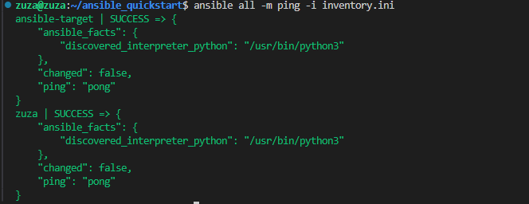

# Sprawozdanie 4

Celem pierwszych zajęć jest automatyzacja i zdalne wykonywanie poleceń za pomocą `Ansible`.  Drugi temat jest poświęcony przygotowaniu źródła instalacyjnego systemu dla maszyny wirtualnej/fizycznego serwera/środowiska IoT. Źródła takie stosowane są do zautomatyzowania instalacji środowiska testowego dla oprogramowania, które nie pracuje w całości w kontenerze. Celem jest przeprowadzenie instalacji systemu, który po uruchomieniu rozpocznie hostowanie naszego programu.

# Instalacja Ansible i tworzenie nowej maszyny

>Utwórz drugą maszynę wirtualną o **jak najmniejszym** zbiorze zainstalowanego oprogramowania

System operacyjny jaki stosuje to `ubuntu` , ponieważ moja główna maszyna go ma.  Podczas tworzenia maszyny nadajemy hostname `ansible-target` oraz tworzymy użytkownika `ansible`. Niestety robiłam to na zajęciach i zapomniałam zrobić screenshoty.


Zapewniamy obecność potrzebnych programów `tar` i serwera OpenSSH (`sshd`).

```bash
sudo apt install tar
```

Sprawdzamy czy serwer ssh jest poprawnie uruchomiony.


Maszyna `ansible-target` jest gotowa. Następnie robimy migawkę i przechodzimy do instalacji `ansible` na głównej maszynie, najlepiej z repozytorium dystrybucji.
Sprawdzamy poprawność instalacji:


>   Wymień klucze SSH między użytkownikiem w głównej maszynie wirtualnej, a użytkownikiem  `ansible`  z nowej tak, by logowanie  `ssh ansible@ansible-target`  nie wymagało podania hasła

Najpierw tworzymy klucz, a póxniej dodajemy go aby umożliwić logowanie bez podawania hasła. Wszystko jest opisane w sprawozdaniu 1.


Po wykonaniu tych kroków możemy zalogować się w ten sposób bez podania hasła:


# Inwentaryzacja
 
 >    Ustal przewidywalne nazwy komputerów stosując  `hostnamectl`
Wcześniej utworzona maszyna ma nazwe hostname `ansible-target`
>Wprowadź nazwy DNS dla maszyn wirtualnych


>  Stwórz  [plik inwentaryzacji](https://docs.ansible.com/ansible/latest/getting_started/get_started_inventory.html)


Sprawdzamy inwentarz za pomocą:
```bash
ansible-inventory -i inventory.ini --list
```


Komenda pingu:
```bash
ansible Endpoints -m ping -i inventory.ini
```


Komenda pingu dla wszystkich:
```bash
ansible all Endpoints -m ping -i inventory.ini
```




#  Zdalne wywoływanie procedur

Tworzymy [_playbooka_](https://docs.ansible.com/ansible/latest/getting_started/get_started_playbook.html) Ansible:

>  Wyślij żądanie  `ping`  do wszystkich maszyn
```yaml
- name: Ping all machines
hosts: all
tasks:
- name: ping my hosts
ansible.builtin.ping:
```

Komenda do wywołania:
```bash
ansible-playbook -i inventory.ini playbook.yaml
```


> Skopiuj plik inwentaryzacji na maszyny/ę  `Endpoints`

```yaml
- name: Copy inventory
hosts: Endpoints
tasks:
- name: Copy
copy:
src: ~/MDO2024_INO//GCL1/ZF410837/Sprawozdanie4/inventory.ini
dest: ~/inventory.ini
```


> Zaktualizuj pakiety w systemie


Dyrektywa `become: yes` powinna powodować, że Ansible będzie wykonywać to zadanie z uprawnieniami sudo, trzeba tez dodatkowo podać hasło, w innym wypadku nie działa. Czytałam, że można to zrobić poprzez klucze ssh z odpowiednimi uprawnieniami, ale nie miałam czasu żeby to robić. 

```yaml
- name: Update packages
hosts: Endpoints
vars:
ansible_become_pass: ansible
become: yes
tasks:

- name: Update packages
apt:
update_cache: yes
upgrade: dist
```


> Zrestartuj usługi  `sshd`  i  `rngd`

Nalezy się upewnić czy serwisy są zainstalowane na naszym hoscie, u mnie trzeba bylo doinstalować rngd.

```yaml
- name: Restart sshd and rngd
hosts: Endpoints
vars:
ansible_become_pass: ansible
tasks:
- name: Restart sshd
become: yes
service:
name: ssh
state: restarted
- name: Restart rngd
become: yes
service:
name: rng-tools
state: restarted
```


>  Przeprowadź operacje względem maszyny z:
>  - wyłączonym serwerem SSH,

Zatrzymuje serwer ssh na hoscie `ansible-target`:


Ale nadal da się połączyć przez ssh.socket. Nie udało mi się tego pozbyć, dlatego po pingowaniu nadal dało się połączyć.


>  - z odpiętą kartą sieciową


Wynik działania:


## Zarządzanie kontenerem

>Uruchom aplikację dostarczaną kontenerem Deploy/Publish, podłącz _storage_ oraz wyprowadź port

Obraz jaki będe poboerać to ten  utworzony ostatnio:


Caly playbook:
```yaml
- name: Installation
hosts: Endpoints
vars:
ansible_become_pass: ansible
tasks:

- name: install docker
become: yes
apt:
name: docker.io
state: latest
- name: starting docker
become: yes
command: systemctl enable --now docker

 
- name: Deploy pet-clinic
hosts: Endpoints
vars:
ansible_sudo_pass: ansible
tasks:

- name: Pull image from DockerHub
become: yes
docker_image:
name: zuza2828/app-deploy:1.0.0
source: pull

- name: Run container
become: yes
docker_container:
name: app-deploy
image: zuza2828/app-deploy:1.0.0
state: started

```


Najpierw pobieram dockera i sprawdzam czy wszystko jest poprawnie. Nastepnie próbuje pobrać obraz i uruchomić go. Niestety w początkowej wersji dostawałam ciągle błedy `permission denied`.


Po dodaniu tak jak poprzednio:` become: yes` oraz `ansible_sudo_pass: {PASSWORD}`, udało się ich pozbyć.


Na serwerze `ansible-target`:


> Zatrzymaj i usuń kontener

Aby tego dokonać dodajemy do playbooka:

```yaml
- name: Stop and remove container
hosts: Endpoints
vars:
ansible_become_pass: ansible
tasks:
- name: stop and remove container
become: yes
community.docker.docker_container:
name: app-deploy
state: absent
```

W module `docker_container`,  `state: absent` oznacza, że  chcemy aby kontener był nieobecny, co oznacza, że ​​Ansible zatrzyma go, jeśli działa, a następnie go usunie.

### Ubierz powyższe kroki w  [_rolę_](https://docs.ansible.com/ansible/latest/playbook_guide/playbooks_reuse_roles.html), za pomocą szkieletowania  `ansible-galaxy`

Po ubraniu wczesniejszych zadań w role, bedziemy mogli zamiast powtarzać te zadania w różnych playbookach, to tylko będziemy używać roli aby zarządzać instalacją i wdrażaniem aplikacji na hostach.


- Tworzymy szkielet roli:
```
ansible-galaxy init deployment_role
```

Struktura plików:


- Aktualizujemy zadania w **`tasks/main.yml`**:
```yaml
- name: Install Docker
  apt:
    name: docker.io
    state: latest
  become: true

- name: Start Docker service
  systemd:
    name: docker
    state: started
    enabled: yes
  become: true

- name: Pull image from DockerHub
  docker_image:
    name: zuza2828/app-deploy:1.0.0
    source: pull
  become: true

- name: Run container
  docker_container:
    name: app-deploy
    image: zuza2828/app-deploy:1.0.0
    state: started
  become: true

- name: Stop and remove container
  community.docker.docker_container:
    name: app-deploy
    state: absent
  become: true
```
- Aktualizujemy zmienne w **`defaults/main.yml`**:

Dodaje tam hasło, którego ciągle muszę używać
```yaml
ansible_become_pass: ansible
```

- Tworzymy prosty playbook z wykorzystaniem roli:

```yaml
- name: Playbook with Deployment Role
hosts: Endpoints
roles:
- deployment_role
```

Uruchamiamy:
```bash
ansible-playbook -i inventory.ini roles-playbook.yaml 
```

