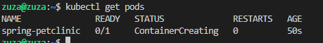

# Sprawozdanie 5


# Instalacja klastra Kubernetes

> ### Instalacja minikube

Minikube jest narzędziem do tworzenia lokalnego klastra Kubernetes na pojedynczej maszynie. Nie jest przeznaczone do użytku w środowisku produkcyjnym, ale raczej do celów deweloperskich i testowych.

Aby zainstalować minikube  ostatnią **stabilna**  wersję na  **x86-64**  **Linux**  :

```shell
curl -LO https://storage.googleapis.com/minikube/releases/latest/minikube-linux-amd64
sudo install minikube-linux-amd64 /usr/local/bin/minikube && rm minikube-linux-amd64
```

Sprawdzamy wersję:


 >  ### Polecenie kubectl w wariancie minikube

Minikube instaluje własną wersję kubectl, która jest skonfigurowana do komunikacji z lokalnym klastrem minikube. Można użyć kubectl lub utworzyć alias:

`alias minikubectl='kubectl'`

Jest to rozwiązanie tylko dla danego terminala.

> ### Uruchom Kubernetes i pokaż działający kontener
1.  Najpierw uruchamiamy klaster minikube:

`minikube start`


2.  Sprawdzamy stan klastra i węzłów:

`kubectl get nodes` 

Jeden węzeł jest w stanie `Ready`.


> ### Zmityguj problemy wynikające z wymagań sprzętowych

Minikube ma następujące wymagania sprzętowe:

-   2 CPU
-   2GB RAM
-   20GB wolnego miejsca na dysku

Początkowo na zajęciach nie udało mi się uruchomić klastra z powodu zbyt małej pamięci. Aby to rozwiązać wróciłam do poprzedniej migawki w której miałam 10GB wolnej pamięci więcej.

Można również zmniejszyć wymagania minikube za pomocą flagi `--memory` i `--cpus` (np. `minikube start --memory=1024 --cpus=2`), ale nie próbowałam.


> ### Uruchom Dashboard i przedstaw łączność

1.  Uruchamiamy Dashboard Kubernetes:

`minikube dashboard` 

To polecenie otworzy Dashboard w przeglądarce internetowej. Można tam zobaczyć informacje o klastrze, węzłach, podach, deploymentach itp.


> ### Zapoznaj się z koncepcjami funkcji wyprowadzanych przez Kubernetesa

### Pod
Najmniejsza jednostka w Kubernetesie, reprezentująca jeden lub więcej kontenerów, które muszą być zaplanowane na tym samym hoście. Pody są tworzone i zarządzane przez inne obiekty, takie jak Deployments.

```
# Tworzenie poda dla nginx
kubectl run nginx --image=nginx

# Wyświetlanie podów
kubectl get pods
``` 

### Deployment

Deployment zarządza zestawem replik Podów i zapewnia deklaratywne aktualizacje i wycofywanie wersji aplikacji. Opisuje pożądany stan aplikacji, a Kubernetes zajmuje się zmianami w celu osiągnięcia tego stanu.

````
# Tworzenie deploymenta dla nginx
kubectl create deployment nginx --image=nginx

# Wyświetlanie deploymentów
kubectl get deployments
````

### Service

Definiuje logiczny zestaw Podów i zasady dostępu do nich. Umożliwia łączenie się z Podami za pomocą nazwy DNS lub adresu IP.

```
# Tworzenie serwisu
kubectl expose deployment nginx --port=80

# Wyświetlanie serwisów
kubectl get services
``` 

# Analiza posiadanego kontenera


>### Przygotuj obraz Docker ze swoją aplikacją - sprawdź, że Twój kontener Deploy na pewno **pracuje**, a nie natychmiast kończy pracę

Sprawdzone we wcześniejszych sprawozdaniach.


Poprawność:


# Uruchamianie oprogramowania

1.  **Uruchom kontener na stosie k8s**

Uruchomię kontener z aplikacją Spring PetClinic w minikubie za pomocą polecenia:

```
minikube kubectl run spring-petclinic --image=zuza2828/app-deploy:1.0.0 --port=8080 --labels app=spring-petclinic
``` 


To spowoduje utworzenie wdrożenia (deployment) z podem zawierającym kontener z aplikacją PetClinic. Flaga `--port=8080` informuje Kubernetes, że aplikacja nasłuchuje na porcie 8080.

Wyświetlamy pody:
```kubectl get pods```


 
 I dashboard:


2.   **Wyprowadź port celem dotarcia do eksponowanej funkcjonalności**

Aby uzyskać dostęp do aplikacji PetClinic z zewnątrz klastra, użyję przekierowania portów (`port-forward`):

```kubectl port-forward pod/spring-petclinic 8080:8080```


Teraz port 8080 jest przekierowany na lokalny host, mogę otworzyć przeglądarkę i przejść do `http://localhost:8080`.


# Część II
# Konwersja wdrożenia ręcznego na wdrożenie deklaratywne YAML

1.  **Zapisanie wdrożenia jako plik YAML**

Tworzę nowy plik o nazwie `spring-petclinic-deployment.yaml` i dodaję następującą zawartość:


Zmieniam liczbę replik w sekcji `spec.replicas` na 4:

2.  **Rozpoczęcie wdrożenia za pomocą kubectl apply**

```
kubectl apply -f spring-petclinic-deployment.yaml
```
3.  **Zbadanie stanu za pomocą kubectl rollout status**
```
kubectl rollout status deployment/clinic-app-deployment
```


W dashboard 4 pody:


Sprawdzamy też  w terminalu: 


Wszystkie w stanie running (ostatni jest z wcześniejszych zajęć)

 ## Stworzenie obrazu kończącego się błędem

Aby tego dokonać zmodyfikowałam swój dotychczasowy Dockerfile z deploymentem. Ustawiłam zły ``ENTRYPOINT`` w takim wypadku obraz będzie kończył się błędem. Następnie taguje go, i wypycham na DockerHub


Na DockerHub:


# Zmiany w deploymencie
1.  **Zwiększenie replik do 5**

Edytujemy plik `spring-petclinic-deployment.yaml` i zmieniamy liczbę replik na 5:

```yaml
spec:
  replicas: 5
```
Następnie stosujemy zmiany:

`kubectl apply -f spring-petclinic-deployment.yaml` 

Możemy monitorować postęp wdrożenia za pomocą `kubectl rollout status`.


2.  **Zmniejszenie liczby replik do 1**

Edytujemy plik `spring-petclinic-deployment.yaml` i zmieniamy liczbę replik na 1:

```yaml

`spec:
  replicas: 1` 
  ```

Stosujemy zmiany:

`kubectl apply -f spring-petclinic-deployment.yaml` 

-   Po zmniejszeniu liczby replik do 1 i zastosowaniu zmian, Kubernetes rozpoczął proces terminacji 4 z 5 istniejących podów.


3.  **Zmniejszenie liczby replik do 0**

Edytujemy plik `spring-petclinic-deployment.yaml` i zmieniamy liczbę replik na 0:

```yaml

`spec:
  replicas: 0` 
  ```

Stosujemy zmiany:

`kubectl apply -f spring-petclinic-deployment.yaml`

-   Po zmniejszeniu liczby replik do 0 i zastosowaniu zmian, Kubernetes rozpoczął proces terminacji wszystkich istniejących podów.


Wszystkie mają status ``TERMINATING``.

### Podsumowując, podczas zwiększania liczby replik, Kubernetes tworzy nowe pody, aby osiągnąć pożądaną liczbę. Natomiast podczas zmniejszania liczby replik, Kubernetes terminuje nadmiarowe pody, aby dostosować się do nowej konfiguracji. Proces ten jest wykonywany stopniowo, aby zapewnić ciągłość działania aplikacji podczas skalowania


4.  **Zastosowanie nowej wersji obrazu (z błędem)**

Edytujemy plik `spring-petclinic-deployment.yaml` i zmieniamy obraz na wersję z błędem z ``JEDNA`` replika:

```yaml

`spec:
  template:
    spec:
      containers:
      - name: clinic-app
        image: zuza2828/app-deploy:error
```

Stosujemy zmiany:

`kubectl apply -f spring-petclinic-deployment.yaml`


Jak widzimy:
- pod o nazwie `clinic-app-deployment-67dcc8d555-7bvfb`, który jest w stanie `Error`, został zrestartowany 4 razy w ciągu ostatnich 53 sekund przed wyświetleniem outputu.

- Pod `clinic-app-deployment-67dcc8d555-7bvfb` jest w stanie `CrashLoopBackOff`, co oznacza, że Kubernetes wielokrotnie restartuje ten pod bez powodzenia. Kontener wewnątrz tego poda ciągle się zawiesza po uruchomieniu.

Wszystko się więc zgadza bo obraz ten został celowo zbudowany z błędem, co powoduje, że kontener nie może się prawidłowo uruchomić i utknął w pętli restartu.
Replika `spring-petclinic` należy do wczesniejszego deploymentu.


5.  **Przywracanie poprzednich wersji wdrożeń**

Aby przywrócić poprzednią wersję wdrożenia, możemy użyć poleceń:


```yaml
# Wyświetlenie historii wdrożeń
kubectl rollout history deployment/clinic-app-deployment


# Przywrócenie do poprzedniej wersji
kubectl rollout undo deployment/clinic-app-deployment
```
Kubernetes automatycznie wdroży poprzednią wersję aplikacji, zachowując ciągłość działania dzięki strategii wdrażania "RollingUpdate".

#  Kontrola wdrożenia
Dodaję następujący skrypt:


Krótki opis działania skryptu:

1.  Definiuje trzy zmienne: `MAX_WAIT_TIME` , `DEPLOYMENT_NAME`  i `DEPLOYMENT_FILE` (ścieżka do pliku YAML z definicją wdrożenia).
2.  Stosuje definicję wdrożenia za pomocą `minikube kubectl apply -f $DEPLOYMENT_FILE`.
3.  SprawdzaM status wdrożenia za pomocą `minikube kubectl rollout status deployment/$DEPLOYMENT_NAME --timeout=${MAX_WAIT_TIME}s`. Kod wyjściowy tego polecenia jest zapisywany w zmiennej `ROLLOUT_STATUS`.
4.  Oblicza czas trwania wdrożenia I  różnicę czasu w zmiennej `ELAPSED_TIME`.
5.  Sprawdza wartość zmiennej `ROLLOUT_STATUS`. Jeśli jest równa 0, oznacza to pomyślne wdrożenie.
6.  W przeciwnym przypadku, skrypt kończy działanie z kodem wyjściowym 1 (błąd).

Wynik:


# Strategie wdrożenia

1.  **Strategia Recreate**

Plik ``pet-cli-recreate.yaml`` 


Aby uzyskać tą startegię dodajemy: 
```yaml
strategy: type: Recreate
```


 Kubernetes zatrzymuje wszystkie istniejące pody należące do starej wersji wdrożenia. Następnie tworzy nowe pody z nową wersją obrazu kontenera.

Strategia `Recreate` jest odpowiednia, gdy aplikacja nie wymaga ciągłej dostępności podczas wdrażania nowej wersji lub gdy nowa wersja wprowadza znaczące zmiany, które mogą powodować problemy z kompatybilnością podczas stopniowej aktualizacji.

2.  **Strategia Rolling Update**

```yaml
strategy: 
	type: RollingUpdate 
	rollingUpdate: 
		maxUnavailable: 1 
		maxSurge: 1

```
**Parametry RollingUpdate**

-   `maxUnavailable: 1`: Określa maksymalną liczbę podów, które mogą być niedostępne (w stanie innym niż `Ready`) podczas aktualizacji. W tym przypadku, tylko jeden pod może być niedostępny w danym momencie.
-   `maxSurge: 1`: Określa maksymalną liczbę podów, które mogą być uruchomione ponad żądaną liczbę replik podczas aktualizacji. Tu tylko jeden dodatkowy pod może być uruchomiony podczas aktualizacji.


Podczas wdrażania nowej wersji aplikacji z użyciem strategii `RollingUpdate`, Kubernetes będzie stopniowo zastępować stare pody nowymi, zgodnie z ustawieniami `maxUnavailable` i `maxSurge`

3.  **Strategia Canary Deployment**

Podczas wdrażania nowej wersji aplikacji w strategii Canary Deployment, rozpoczynamy od jednej repliki nowej wersji. 
```yaml
replicas: 1
```
Nastepnie ustawiamy strategię **RollingUpdate** z odpowiednimi parametrami
```yaml
strategy: 
	type: RollingUpdate 
	rollingUpdate: 
		maxSurge: 1 
		maxUnavailable: 0
```


Strategia ``Canary Deployment`` polega na stopniowym wprowadzaniu nowej wersji aplikacji, monitorowaniu jej działania, a następnie stopniowym zwiększaniu liczby replik nowej wersji, aż do całkowitego zastąpienia starej wersji.Dzięki ustawieniu `replicas: 1` i parametrom `maxSurge: 1` oraz `maxUnavailable: 0`, podczas wdrażania nowej wersji, Kubernetes uruchomi jedną replikę nowej wersji, pozostawiając stare pody działające.


# Omówienie

Różnice w zachowaniu podczas wdrażania nowej wersji aplikacji:

-   **Recreate**: Wszystkie stare pody są zatrzymywane, a następnie uruchamiane nowe pody. **Może to spowodować krótką niedostępność aplikacji**.

-   **Rolling Update**: Stare pody są stopniowo zastępowane nowymi, zgodnie z ustawieniami `maxUnavailable` i `maxSurge`. **Aplikacja pozostaje dostępna podczas wdrażania**.

-   **Canary Deployment**: Nowa wersja aplikacji jest wdrażana z jedną repliką, a następnie stopniowo skalowana. Umożliwia to monitorowanie nowej wersji przed całkowitym wdrożeniem. **Aplikacja pozostaje dostępna podczas wdrażania**