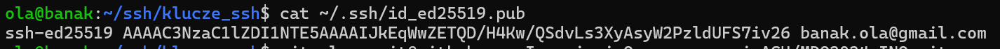
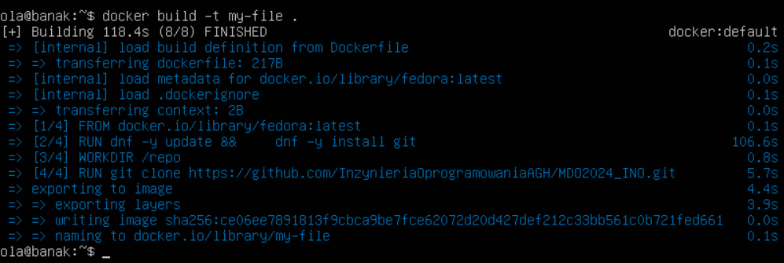

##  Sprawozdanie 1

Aleksandra Banak

Numer Indeksu: 413227

Inżynieria Obliczeniowa


### Cel projektu

Celem projektu jest wprowadzenie do GitHuba - zapoznanie czym jest i jak działa repozytorium (zarówno lokalne jak i zdalne), nauka podstawowych komend do obsługi GitHuba, przydatnych również do modyfikacji plików tworzonych na własnych gałęziach.

Po poprawnym zrealizowaniu tematu ze zrozumieniem można z łatwością klonować repozytoria poprzez protokoły HTTPS i SSH, łączyć się do nich za pomocą specjalnie i włąsnoręcznie wygenerowanych kluczy dostępu oraz uaktualniać wszystkie edycje wykonane zdalnie u siebie na repozytorium lokalne, gdzie każdy uczestnik ma dostęp. Drugie zajęcia pozwoliły podszkolić się w podstawowych komendach używanych przy korzystaniu z Docker'a. Po wykonaniu instrukcji ze zrozumieniem, z łatwością można już uruchamiać, zatrzymywać czy usuwać kontenery. Znajomość użytych poleceń zostanie wykorzystana do przyszłych laboratoriów, dzięki czemu na pewno będzie dużo prościej zrozumieć, co tak naprawdę zostało wykonane. 

### Przebieg projektu

### Wprowadzenie, Git, Gałęzie, SSH

#### 1. Instalacja klienta Git i obsługę kluczy SSH

Podczas instalowania Ubuntu na maszynę wirtualną, zaznaczyłam polecenie umożliwiające pobranie OpenSSH automatycznie. Po uruchomieniu serwera sprawdziłam, czy wszystko zostało poprawnie zainstalowane. Po zastosowaniu komendy powinna wyświetlać się bieżąca wersja Gita.


Bardzo podobnie wygląda sytuacja z obsługą kluczy SSH. Wybierając wcześniej opcje instalacji OpenSSH, nie powinno być żadnego problemu z obsługą kluczy. W rzeczy samej jest to część SSH.


#### 2. Klonowanie repozytorium za pomocą protokołu HTTPS i personal access token

Do sklonowania repozytorium poprzez HTTPS wykorzystałam komendę:

```
git clone link_https_do_repozytorium
```

Całe repozytorium jest pobierane, w związku z czym możemy już na nim wykonywać wszelakie modyfikacje zdalnie.


HTTPS jest prostsze w ustawieniu i bardziej powszechne, używa szyfrowania SSL/TLS, jednak wymaga podawania nazwy użytkownika i hasła/tokena przy każdej operacji, takiej jak fetch, pull czy push.

W ramach ćwiczeń utworzyłam również na swoim koncie token, który wykorzystałam do osobnego sklonowania repozytorium. Taki token można wygenerować wchodząc w ustawienia, następnie w *Developer settings -> Personal access tokens -> Fine-grained tokens*. Należy tam wygenerować specjalny osobisty token i przy jego użyciu ponownie wykorzystać git clone.

```
 git clone https://wygenerowany_token@dalsza_czesc_linku_skopiowanego_z_githuba
```

Poniżej przedstawiam zastosowanie tej komendy przeze mnie (korzystałam z innego serwera, jednak jest to i tak moje konto):


#### 3. Klonowanie repoyztorium za pomocą protokołu SSH

- *Utwórz dwa klucze SSH, inne niż RSA, w tym co najmniej jeden zabezpieczony hasłem*

  Klucze SSH zapewniają solidny sposób uzyskiwania dostępu do zdalnych serwerów bez konieczności podawania hasła, dzięki wykorzystaniu dwóch połączonych ze sobą komponentów - klucza publicznego i odpowiadającego mu prywatnego odpowiednika.

  W celu utworzenia nowego klucza należy zastosować polecenie:

  ```
  ssh-keygen -t typ_klucza -C "twoj@email.com"
  ```

  *-t* określa typ klucza, np. *ed25519, ecdsa*

  *-C* umożliwia dodanie komentarza do klucza podczas jego użycia do uwierzytelniania

  Wybrałam klucze *ed25519* oraz *ecdsa*.

  Klucze *ed25519* są krótsze niż klucze RSA przy zachowaniu podobnego poziomu bezpieczeństwa. Są zalecane przez wielu ekspertów kryptografii ze względu na swoją wydajność i bezpieczeństwo.

  Klucze *ecdsa* są stosowane w wielu systemach kryptograficznych, w tym w protokole SSL/TLS do uwierzytelniania serwerów i klientów. Ich bezpieczeństwo zależy od wyboru odpowiedniej krzywej eliptycznej oraz rozmiaru klucza.

  W załączniku widać, w jaki sposób przebiega ich generowanie:

  

  


- *Skonfiguruj klucz SSH jako metodę dostępu do GitHuba*

  Należy dodać utworzony klucz do konta na GitHub. Umożliwia to edytowanie repozytorium bez ciągłego uwierzytelniania operacji hasłem, tak jak to miało miejsce podczas korzystania z protokołu HTTPS.

  Aby dodać klucz, należy wejść ponownie w ustawienia swojego konta i wybrać *SSH and GPS keys*, a następnie przekopiować zawartość klucza w wyznaczone okienko. Należy pamiętać, że klucz musi byc publiczny, inaczej nie będzie można go dodać.

  
 
  
 
- *Sklonuj repozytorium z wykorzystaniem protokołu SSH*
 
  Jeśli wszystko poszło poprawnie, sklonowanie repozytorium należy wykonać ponownie komendą
 
  ```
  git clone link_ssh_do_repozytorium
  ```
 

Przedstawiam efekt końcowy na poniższym zdjęciu:


#### 4. Utworzenie i przełączenie się na swoją indywidualną gałąź: AB413227

Klonując repozytorium automatycznie jesteśmy na gałęzi o nazwie *main*. Aby przełączyć się na utworzoną już wcześniej inną gałąź należy zastosować polecenie:

```
git checkout NAZWA_GALEZI
```

Bardzo podobnie postępujemy przy tworzeniu gałęzi. Wystarczy dodać opcję *-b*. Przy utworzeniu nowej gałęzi użytkownik od razu przedostaje się na nią za pomocą jednej i tej samej komendy:

```
git checkout -b NAZWA_NOWEJ_GALEZI
```

W celu utworzenia swojej indywidualnej gałęzi musiałam dostać się najpierw na gałąź grupy, również za pomocą powyższej komendy. Bardzo przydała się również funkcja umożliwiająca sprawdzenie, na jakiej gałęzi obecnie jesteśmy:

```
git branch
```

W załączniku poniżej przedstawiam procedurę przełączenia się na swoją gałąź nazwaną AB413227 - są to moje inicjały i numer indeksu.


#### 5. Git hook

Korzystając z githook'ów dostępnych w folderze *.git/hooks*, napisałam swój własny skrypt, który sprawdza poprawność *commit message* przed wykonaniem funkcji *commit*. Forma mojego git hook'a jest najbardziej zbliżona do treści *commit-msg.sample*.

Utworzyłam w swoim katalogu *AB413227* plik o nazwe *commit-msg*, następnie przekopiowałam go w miejsce, gdzie będzie on aktywny na każdym poziomie, a nie tylko w moim folderze. Jest to folder *.git/hooks*, tam gdzie pozostałe, automatycznie utworzone git hook'i.


Dodałam również potrzebne uprawnienia:

```
chmod +x commit-msg
```

Polecenie *chmod* zmienia prawa dostępu do pliku. Polecenia *+x* sprawia, że plik może być wykonywalny - faktycznie będzie wykonywał napisany skrypt.


Mój git hook porównuje napisaną wiadomość podczas użycia funkcji *commit* z wzorcem, który w moim przypadku jest inicjałem i indeksem legitymacji. Jeśli początek wiadomości nie zaczyna się od określonego w ten sposób wzorca, na ekranie wyskakuje wiadomość o błędzie. Jeśli jednak forma wiadomości jest poprawna, *commit* zostaje wywołąny poprawnie.

Efekt uruchomienia git hook'a prezentuję poniżej:


Poniżej załączam pełną treść skryptu.


#### 6. Sprawozdanie

Sprawozdanie w formacie markdown zostało utworzone jako plik w osobnym katalogu *AB413227*.


Zrzuty ekranu będą dodawane jako zdjęcia *inline*. Utworzyłam dodatkowy folder o nazwie *ss*, gdzie znajdują się jedynie wykorzystywane do sprawozdań zdjęcia. Zdjęcia tworzą się przy użyciu zapisu:

```

```

U mnie ta ścieżka będzie miała wzór:

```
./ss/<nazwa zdjęcia>
```

Kiedy już wszystko zostało wykonane według instrukcji nadszedł czas na przesłanie wszystkich dokonanych zmian do zdalnego repozytorium. Będą potrzebne 3 komendy:

```
git add
```

Polecenie *git add* służy do przenoszenia zmodyfikowanych plików do obszaru roboczego w celu zatwierdzenia. Znanych jest kilka podstawowych opcji:

- git add nazwa_pliku – aby dodać określony plik
 
- git add * – umieszcza wszystkie, czyli nowe, zmodyfikowane i usunięte pliki
 
- git add . - przygotowuje tylko nowe i zmodyfikowane pliki, z wyłączeniem plików usuniętych
 

Bardzo pomocna jest dodatkowo komenda:

```
git status
```

Dzięki niej można sprawdzić, co zostało do tej pory zmodyfikowane.


Aby udostępnić plik online, trzeba „wypchnąć” zmiany na swoich lokalnych plikach by zsynchronizować je ze zdalnym repozytorium.

```
git commit
```

Polecenie *git commit* przenosi zmiany z obszaru roboczego do lokalnego repozytorium. Za każdym razem należy podać krótką wiadomość wyjaśniającą wprowadzone zmiany.

Na koniec polecenie *git push* przenosi zmiany z lokalnego do zdalnego repozytorium. W ten sposób wprowadzone zmiany zostaną opublikowane i udostępnione zdalnie.

Można konkretnie ustalić, do której gałęzi wysłać zmiany jedną komendą:

```
git push origin 'nazwa_galezi'
```


#### 7. Wciągnięcie swojej gałęzi do gałęzi grupowej GCL01

Początkowo trzeba ponownie przełączyć się na gałąź grupy GCL1 komendą:

```
git checkout GCL1
```


W tym momencie gałąź jest już wciągnięta, jednak tą zmianę widzi tylko użytkownik zdalnego repozytorium. Aby udostępnić ten status do lokalnego repozytorium wymagane jest jeszcze zastosowanie komendy:

```
git push
```


#### 8. Aktualizacja zdalnego repozytorium

Początkowo miałam problem z aktualizacją, ponieważ repozytoria zdalne i lokalne nie zgadzały się ze względu na treść (np. w jednym repozytorium były zdjęcia, a w drugich nie). Aby znów korzystać ze wspólnej zawartości obu repozytoriów, zastosowałam komendę *git merge*. 
Dzięki temu każda kolejna aktualizacja polegała na dodaniu zmian i wysłaniu ich do źródła z zastosowaniem poznanych już wcześniej komend:

```
git add .
git commit -m
git push
```

### Git, Docker

#### 1. Instalacja Docker w systemie linuksowym

Po pobraniu Dockera należy uruchomić system:

```
sudo systemctl start docker
```

Następnie w celu sprawdzenia, czy Docker faktycznie jest uruchomiony, należy wpisać:

```
sudo systemctl status docker
```

W moim przypadku musiałam dodatkowo dodać nową grupę i wybranego użytkownika. W przeciwnym razie demon nie był poprawnie uruchomiony, przez co nie można nawet pobrać obrazu.

Utworzenie grupy *docker*:

```
sudo groupadd docker
```

Dodanie użytkownika do grupy *docker*:

```
sudo usermod -aG docker $USER
```

Aktywacja zmienionych grup:

```
newgrp docker
```

Ponowne sprawdzenie, czy Docker działa poprawnie, np. poprzez próbę pobrania i uruchomienia obrazu:

```
docker run hello-world
```


#### 2. Rejestracja w systemie Docker Hub

Docker Hub to największa społeczność i repozytorium, gdzie można przechowywać obrazy Dockera. Pozwala na udostępnianie, pobieranie oraz korzystanie z obrazów. Konto miałam utworzone już wcześniej, poniżej znajduje się mój profil.


#### 3. Pobranie obrazów

Należało pobrać kilka obrazów wymienionych w instrukcji. Tą operację można wykonać na dwa spoosby.

```
docker pull <nazwa_obrazu>
```

Powyższa komenda jedynie pobiera wskazany obraz.

Można jednak od razu uruchomić obraz po jego pobraniu. Umożliwia to polecenie:

```
docker run <nazwa_obrazu>
```

Wszystkie pobrane obrazy można sprawdzic poprzez *docker images*. Na ekranie można odczytać rozmiar oraz ID każdego z obrazów.


#### 4. Uruchomienie kontenera z obrazu *busybox*

*Efekt uruchomienia kontenera*

Znana już komenda *docker run* oraz wykorzystanie:

```
docker container list --all
```

udowadnia, że kontener został uruchomiony, jednak teraz jest już nieaktywny. Funkcja *--all* pozwala zobaczyć wszystkie kontenery - te działające i nie.


*Interaktywne podłączenie się do kontenera* 

Wykorzystałam tutaj interaktywne uruchomienie obrazu:

```
docker run -i nazwa_obrazu
```

*-i* pozwala na interakcję z kontenerem poprzez standardowe wejście. W praktyce oznacza to, że można wprowadzić dane do kontenera z naszej konsoli.

Przydatne komendy używane w konsoli:

*uname -a* wyświetla informacje o systemie operacyjnym i sprzęcie.


#### 5. Uruchomienie "systemu w kontenerze" *fedora*

Uruchomienie systemu wykonałam poprzez komendę:

```
docker run -it nazwa_obrazu
```

*-it* jest skrótem do *--interactive --tty*. Przy użyciu tej komendy utworzona zostaje sesja terminala pozwalająca użytkownikowi na interakcję z kontenerem.

*interactive* odpowiada za przekierowanie terminala z kontenera na terminal użytkownika, użytkownik może wprowadzać dane i otrzymywać odpowiedzi w czasie rzeczywistym

*tty* przekierowuje dane wejściowe i wyjściowe między kontenerem a hostem, umożliwiając interaktywne sesje

Po przejściu do terminala należy zacząć od zainstalowania biblioteki *procps*. Jest to zestaw narzędzi w systemach opartych na jądrze Linux, które służą do monitorowania i zarządzania procesami.


*ps* wyświetla działające w tym czasie procesy, gdzie dodatkowo można odczytać PID, czyli identyfikator procesu

*ps -aux*  wyświetla listę wszystkich procesów działających na systemie, wraz z dodatkowymi szczegółami, takimi jak użytkownik właściciel, zużycie zasobów


*dnf upgrade* aktualizuje pakiety


*exit* wyjście z terminala, po wylistowaniu procesów, ich status powinien być ustawiony na *Exited*


#### 6. Utworzenie pliku Dockerfile i klonowanie repozytorium

Plik Dockerfile utworzyłam i zmodyfikowałam poprzez komendy:

```
touch Dockerfile
nano Dockerfile
```

Pełna wersja mojego pliku znajduje się w folderze Sprawozdanie1, w osobnym pliku o nazwie *Dockerfile*.

```
FROM fedora

RUN dnf -y update && \
    dnf -y install git

WORKDIR /repo

RUN git clone https://github.com/InzynieriaOprogramowaniaAGH/MDO2024_INO.git

ENTRYPOINT ["/bin/bash"]
```

Powyższy plik napisałam kierując się dobrymi praktykami:

**FROM fedora** określa obraz bazowy użyty do zbudowania nowego obrazu, u mnie jest to obraz *fedora*

**RUN dnf -y update && \ dnf install -y git** aktualizacja pakietów i instalacja git'a

**RUN git clone** klonuje repozytorium

**WORKDIR /repo** ustawia katalog roboczy na `/repo`. Wszystkie późniejsze polecenia będą wykonywane w tym katalogu.

**ENTRYPOINT ["/bin/bash"]** ustawia domyślne polecenie dla kontenera na `/bin/bash`. Jeśli nie zostanie podane inne polecenie w linii poleceń przy uruchamianiu kontenera, kontener automatycznie uruchomi interaktywny terminal Bash.

Budowanie obrazu na podstawie pliku Dockerfile:

```
docker build -t nazwa_pliku .
```

Potwierdzenie utworzenia mojego pliku:



Przejścia do sklonowanego repozytorium dokonałam poprzez interaktywne uruchomienie pliku.


#### 7. Uruchomione ( != "działające" ) kontenery i ich czyszczenie

W celu znalezienia wszystkich (nawet tych kontenerów, które nie działąją) należy wykorzystać komendę:

```
docker ps -a
```

Zatrzymanie kontenerów odbywa się przy użyciu komendy:

```
docker stop $(odpowiednie_argumenty)
```

Usuwanie jest dokonywane poprzez:

```
docker rm $(odpowiednie_argumenty)
```

W obu przypadkach wybrałam argumenty:

*-a* wyświetlenie listy wszystkich kontenerów

*-q* wyświetlenie identyfikatorów obrazów

Poniżej przedstawiam zastosowanie tych komend u mnie i efekt końcowy:


#### 8. Czyszczenie obrazów
Czyszczenie obrazów wykonuje się bardzo podobnie jak czyszczenie kontenerów, poprzez funkcję *rmi*

```
docker rmi $(odpowiednie_argumenty)
```

Ja wykorzystałam funkcje:

*-a* wyświetla listę wszystkich obrazów

*-q* zostają wyświetlone tylko identyfikatory obrazów, a nie ich pełne informacje


#### 9. Pull Request do gałęzi grupowej jako zgłoszenie wykonania zadania

Po wykonaniu wszystkich poleceń w obu instrukacjach zdalnie, zaktualizowałam swoją gałąź z lokalnym repozytorium. Sprawozdanie napisałam w programie MarkText - jest tam opcja zapisania pliku w formacie Markdown, co bardzo ułatwiło mi sprawę. 

*Pull request* jest żądaniem o sprawdzenie oraz zatwierdzenie zmian wprowadzonych przez programistę do istniejącego repozytorium kodu. Głównym celem *pull requestu* jest umożliwienie innym członkom zespołu przeglądnięcie proponowanych zmian, dostarczenie informacji zwrotnej oraz ewentualne zatwierdzenie lub odrzucenie tych zmian.
