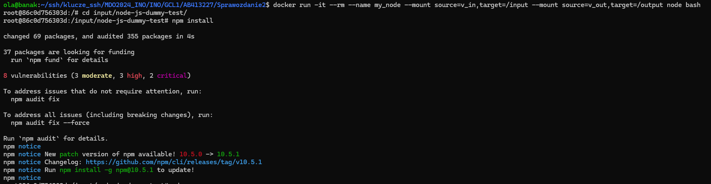

## Sprawozdanie 2

Aleksandra Banak

413227

Inżynieria Obliczeniowa

### Cel projektu

Zapoznanie się z działaniem kontenerów Docker i wykorzystaniem ich do budowania, testowania i uruchamiania aplikacji. Poznanie działania wolimunów oraz sieci mostkowej. Przetestowanie działania serwera *iperf3* . Sprawdzenie procesu logowania oraz stanu kontenerów poprzez instancję Jenkins.

**Znalezienie repozytorium z kodem dowolnego oprogramowania, które:**

- dysponuje otwartą licencją
- jest umieszczone wraz ze swoimi narzędziami Makefile tak, aby możliwe był uruchomienie w repozytorium czegoś na kształt make build oraz make test. Środowisko Makefile jest dowolne. Może to być automake, meson, npm, maven, nuget, dotnet, msbuild...
- Zawiera zdefiniowane i obecne w repozytorium testy, które można uruchomić np. jako jeden z targetów Makefile'a. Testy muszą jednoznacznie formułować swój raport końcowy (gdy są obecne, zazwyczaj taka jest praktyka)

Osobiście wybrałam repozytorium dostępne pod poniższym linkiem: https://github.com/devenes/node-js-dummy-test.git

Repozytorium zawiera narzędzia i pliki, które są potrzebne do stworzenia i przetestowania oprogramowania. W pliku 'package.json' znajdują się ustawienia oraz informacje o potrzebnych do budowy programu zmiennych i zależnościach.

Program dysponuje licencją Apache License 2.0. Jest to wolna licencja, która pozwala użytkownikom na swobodne korzystanie, modyfikowanie i rozpowszechnianie oprogramowania.

Program jest napisany z wykorzystaniem Node.js, w związku z tym do kompilacji będzie potzrebna komenda *npm*, a nie *make*. Należy wybrać kontener zbudowany z obrazu *node* i otworzyć w trybie interaktywnym.

**Sklonowanie repozytorium, przeprowadzenie build programu w tym doinstalowanie wymaganych zależności**

Repozytorium trzeba sklonować (*git clone*), a następnie pobrać wszystkie zależności z pliku .json. Są one potrzebne do budowania i testowania aplikacji. Wykorzystana komenda:

```
npm install
```


Po poprawnej instalacji można przejść do uruchomienia testów:

```
npm test 
```

Jeśli program działa poprawnie, powinna pokazać się informacja o pozytywnym zaliczeniu testów.


**Przeprowadzenie buildu w kontenerze**

Pierwszy krok to uruchomienie kontenera interaktywnie:

```
docker run -it node bash
```

Sklonowanie repozytorium, a następnie najważniejsza część - przeprowadzenie *build* w odpowiednim katalogu:


Po zakończeniu operacji należy sprawdzić czy wszystko wykonało się poprawnie poprzez uruchomienie testów komendą *npm test*:


**Stworzenie dwóch (+ dodatkowy) plików Dockerfile automatyzujących kroki powyżej, z uwzględnieniem następujących kwestii**

W celu zautomatyzowania powyższego procesu można stworzyć pliki Dockerfile (bardzo podobne do tych wykorzystywanym w poprzednim sprawozdaniu).

Jeden plik wykonuje wszystkie kroki (klonowanie repozytorium, pobranie zależności) do momentu wywołania *build* -> *node-builder.Dockerfile*.


Obraz należy zbudować:


Drugi plik testuje aplikację -> *node-tester.Dockerfile*.


Trzeci tę aplikację uruchamia -> *node-deploy.Dockerfile*.


Niestety miałam dość spory problem z testam, który zgłaszałam - przeprowadzenie *build* udało się wykonać dopiero za którymś razem lub przy wykorzystaniu komendy *npm install -g npm@10.5.1*, ale wtedy testy nie przechodzą (brakuje *jest*).


**Wykazanie, że kontener wdraża się i pracuje poprawnie. Pamiętając o różnicy między obrazem a kontenerem. Co pracuje w takim kontenerze?**

Do przetestowania działania trzeba na początku uruchomić kontenery ze zbudowanych wcześniej obrazów.  Podstawowym sprawdzeniem poprawności działania kontenerów jest sprawdzenie kodu, z jakim kontenery zakończyły działanie. Operację należy sprawdzić poprzez:

```
echo $?
```

Jeśli budowa kontenera przebiegła poprawnie, to na ekranie powinien wyświetlić się kod *exit 0*.


W systemach Unix/Linux kod powrotu 0 sygnalizuje, że wykonane polecenie zakończyło się bez żadnego błędu. W przypadku `docker run`, kod powrotu 0 oznacza, że kontener został uruchomiony poprawnie i zakończył swoje działanie bez żadnych problemów.

Mimo poprawnego działania uruchomienie powyższych kontenerów nie daje żadnego efektu, ponieważ nie posiadają żadnych poleceń oprócz zbudowania i przetestowania oprogramowania.

Poprawność działania można sprawdzić za uruchamiając kontener poleceniem:

```
docker run nazwa-kontenera
```

Następnie kontenery należy wypisać na ekranie z pomocą:

```
docker container list --all
```

Dzięki temu z łatwością można sprawdzić ich stan, czy wszystko działa poprawnie.


Napotkałam dość duży problem podczas użycia komendy *npm install* w pliku *node-tester *- program ściągał się w nieskończoność.W celu przeprowadzenia operacji *build* dopisałam *-g npm@10.5.1*, który wykonuje update npm. Wtedy udało się przeprowadzić powyższą operację pozytywnie. Nieco inne problemy napotkałam przy uruchomieniu *node-tester*, ciagle wyskakiwał błąd o braku *jest*.


### Laboratorium 4

Jako pierwsze zadanie należało utworzyć dwa woluminy: wejściowy i wyjściowy.

Utworzenie wolumina wykonuje się za pomocą komendy:

```
docker volume create nazwa_wolumina
```

Woluminy są wykorzystywane do przechowywania danych, które mają przetrwać restarty kontenerów lub nawet ich usuwanie. Mogą one być również wykorzystywane do współdzielenia danych między wieloma kontenerami.

Kolejną istostną rzeczą jest podłączenie nowych woluminów do kontenera bazowego. W tym celu należy na początku uruchomić kontener w wersji iteratywnej, ale dodatkowo trzeba pamiętać o poleceniu, które zamontuje wolumen do kontenera.

```
docker run -it --rm --name my_node --mount source=v_in,target=/input --mount source=v_out,target=/output node bash
```

Warto sprawdzić, czy polecenie wykonano w całości prawidłowo oraz czy woluminy są odpowiednio podpięte. Należy wypisać woluminy poleceniem *ls*.


Kolejnym krokiem jest uruchomienie konteneru pomocniczego. Kontener będzie miał dołączony wcześniej utworzony wolumin wejściowy, w którym repozytorium zostanie sklonowane. Dzięki temu repozytorium będzie dostępne na woluminie, a następnie będzie możliwe zbudowanie go w kontenerze, który został utworzony wcześniej.

```
docker run -it --rm --name help_node --mount source=v_in,target=/input node bash
```

Trzeba pamiętać, żeby przejść do konkretnego katalogu poleceniem:

```
cd input/
```

Będąc w odpowiednim folderze, dopiero teraz należy sklonować repozytorium:

```
git clone https://github.com/devenes/node-js-dummy-test.git
```


Po poprawnym sklonowaniu trzeba uruchomić *build*, ALE w kontenerze **bazowym**, a nie pomocniczym. Najlepiej zastosować te same polecenia, co w poprzednim laboratorium:

```
npm install
```



Po skończeniu reouzytorium powinno zostać skopiowane do wnętrza kontenera z woluminu wejściowego:

```
cp -r node-js-dummy-test/ ../
```


Ostatnia kwestia to zapisanie zbudowanych plików na woluminie wyjściowym, tak by były dostępne po wyłączniu kontenera. Skopiowanie ich do wolumina wyjściowego wykonano poprzez komendę *cp* do folderu *output*.

```
cp -r node_modules/ ../../output/
```


Poprawność wykonania można łatwo sprawdzić poleceniem:

```
sudo ls /var/snap/docker/common/var-lib-docker/volumes/v_in/_data
```

**Klonowanie na wolumin wejściowy przeprowadzone wewnątrz kontenera**

Zastosowano ten sam kontener z dwoma woluminami, a klonowanie zostało wykonane tą samą komendą, jednak w innym katalogu *new_repo*, aby odróżnić wcześniejszy projekt od nowo sklonowanego.

```
git clone https://github.com/devenes/node-js-dummy-test.git ./input/new_repo
```


**Możliwość wykonania wyżej wymienionych kroków za pomocą *docker build* i pliku *Dockerfile***

Możliwe jest stworzenie wyżej wymienionych kroków poprzez zbudowanie obrazu za pomocą pliku Dockerfile. Proces ten polega na powtórzeniu wcześniejszych kroków i odtworzeniu procesu. Klonowanie repozytorium zostanie wykonane bezpośrednio w zbudowanym obrazie, znajdującym się w woluminie wejściowym. Następnie zostanie zbudowany nowo powstały projekt.

Zawartość pliku *vol-biulder.Dockerfile*:


## Eksponowanie portu

Iperf3 to narzędzie do pomiaru przepustowości sieciowej. Pozwala na testowanie prędkości przesyłania danych między dwoma hostami w sieci.

Pierwszy krok to uruchomienie kontenera:

```
sudo docker run -it --rm ubuntu /bin/bash
```

Należy przeprowadzić wszystkie aktualizacje komendą *apt-get update*, a następnie zainstalować iperf3:

```
apt-get install iperf3
```


Na koniec warto sprawdzić czy serwer faktycznie jest na odpowiednim porcie poleceniem *iperf3 -s*. Powinien wyświetlić się port 5201, ponieważ jest to port domyślny dla *iperf3*. Serwer jest uruchomiony, teraz należy połączyć się z serwerem z drugiego kontenera.


#### Uruchomienie kontenera klienta

W drugim terminalu uruchomić kontener. Docelowo należy połączyć się z serwerem poprzez IP serwera. Do użycia IP serwera pomocne jest polecenie:

```
docker inspect -f '{{range .NetworkSettings.Networks}}{{.IPAddress}}{{end}}' iperf-server
```

Jako iperf-server trzeba wpisać identyfikator kontenera, na którym powstał serwer.

Powinnien wyświetlić się numer IP:


Następnie należy pobrać *iperf3* i połączyć się z serwerem:

```
iperf3 -c <adres_IP_serwera>
```

Wyniki dla serwera:


Wyniki dla klienta:


#### Własna sieć mostkowa

**Utworzenie własnej sieci mostkowej:**

```
docker network create nazwa_sieci
```


**Uruchomienie kontenera serwera iperf3 w utworzonej sieci**

Należy wykorzystać tu wcześniej skonstruowany obraz *iperf-server*. Uruchomienie kontenera odbywa się przy użyciu wcześniej utworzonej sieci:

```
docker run -it --name nazwa_serwera --network nazwa_sieci ubuntu bash
```

**Uruchomienie kontenera klienta iperf3 w utworzonej sieci**

Wygląda to identycznie jak uruchomienie kontenera klienta - uruchomienie w trybie interaktywnym w utworzonej sieci:

```
docker run -it --name nazwa_klienta --network nazwa_sieci ubuntu bash
```

**Połączenie z serwerem z poziomu klienta**

Na podstawie nazwy kontenera w utworzonej sieci system automatycznie pobierze adres IP - nie jest konieczne manualne szukanie i wpisywanie IP, tak jak poprzednio:

```
iperf3 -c server
```


Sprawdzenie ID nowej sieci:

```
docker network ls
```

Sprawdzenie nowych adresów dołączonych kontenerów:

```
docker network inspect 49edcd98d2b0
```


**Łączenie się z hosta, z maszyny wirtualnej**

Połączenie spoza hosta wykonać jako klient do działającego serwera w kontenerze, w celu porównania szybkości przesyłania z poprzednimi.

Uruchomienie kontenera:

```
docker run -it --rm --network siec_mostkowa --name server -p 5201:5201 --mount source=v_out,target=/logs ubuntu bash
```

Połączenie hosta z dockerem następuje poprzez `-p 5201:5201`. Dalej działać należy na stworzonej wcześniej sieci.

W celu podłączenia się do utworzonego wcześniej serweru z własną siecią zastosować komendę:

```
iperf3 -c 172.19.0.2
```


**Logi z kontenera**

Aby podłączyć wolumen do kontenera i zapisywać do niego logi oraz inne dane należy utworzyć wolumen za pomocą *docker volume create*, a następnie uruchomić kontener, podłączając wolumen, używamy opcji *--mount*

```
docker run -d --name nazwa --mount source=nazwa_wolumenu,target=/sciezka/w/kontenerze nazwa_obrazu_kontenera
```

Po uruchomieniu kontenera można wykonać polecenie 'find' wewnatrz, aby znaleźć logi:

```
docker exec nazwa find /sciezka/w/kontenerze -name "*.log"
```

## Instancja Jenkins

Jenkins to popularne narzędzie do ciągłej integracji i dostarczania (CI/CD), które jest wykorzystywane przez zespoły programistyczne do automatyzacji procesu budowy, testowania i wdrażania oprogramowania.

Pomocna będzie dokumentacja: https://www.jenkins.io/doc/book/installing/docker/

Pierwszy krok to utworzenie sieci:

```
docker network create jenkins
```

Następnie należy uruchomić kontener z DIND:

```
docker run \
 --name jenkins-docker \
 --rm \
 --detach \
 --privileged \
 --network jenkins \
 --network-alias docker \
 --env DOCKER_TLS_CERTDIR=/certs \
 --volume jenkins-docker-certs:/certs/client \
 --volume jenkins-data:/var/jenkins_home \
 --publish 2376:2376 \
 docker:dind \
 --storage-driver overlay2
```

Po uruchomieniu zbudować nowy obraz przy użyciu pliku *jenkins.Dockerfile*:

```
docker build -t myjenkins-blueocean:2.440.2-1 -f jenkins.Dockerfile .
```

Uruchomienie kontenera Jenkinsa na podstawie obrazu:

```
docker run \
 --name jenkins-blueocean \
 --restart=on-failure \
 --detach \
 --network jenkins \
 --env DOCKER_HOST=tcp://docker:2376 \
 --env DOCKER_CERT_PATH=/certs/client \
 --env DOCKER_TLS_VERIFY=1 \
 --publish 8080:8080 \
 --publish 50000:50000 \
 --volume jenkins-data:/var/jenkins_home \
 --volume jenkins-docker-certs:/certs/client:ro \
 myjenkins-blueocean:2.440.2-1
```

Poprawność działania najłatwiej będzie sprawdzić wpisując w przeglądarke IP host:8080.


Hasło można odczytać wykorzystując komendę:

```
sudo docker exec ${CONTAINER_ID} cat /var/jenkins_home/secrets/initialAdminPassword
```
