## Sprawozdanie 3

Aleksandra Banak

Inżynieria Obliczeniowa 413227

### Cel wykonywanych czynności

### Streszczenie prowadzonego projektu

#### Przygotowanie

Należy przede wszystkim zapoznać się z instrukcją instalacji Jenkinsa dostępnej na stronie https://www.jenkins.io/doc/book/installing/docker/ .

Na poprzednich laboratoriach doszłam do momentu, gdzie udało się uruchomić okienko Jenkinsa, wpisując adres IP: *host:8080*.

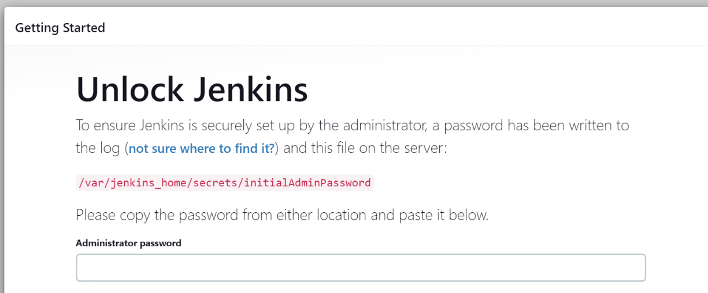

Jak widać, wymagane jest podanie hasła administratora. Można je z uzyskać poprzez użycie komendy:

```
docker exec -it <id kontenera> cat /var/jenkins_home/secrets/initialAdminPassword
```

ID kontenera jest dostępne po zastosowaniu *docker ps*, który wyświetla wszystkie dostępne uruchomione kontenery. Wybieramy kontener jenkinsowy.

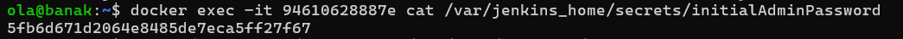

Po poprawnym wpisaniu hasła, należy utworzyć swoje konto i skonfigurować Jenkins.

#### Uruchomienie

**Konfiguracja wstępna i pierwsze uruchomienie**

Pierwsze utworzone projekty należą do kategorii Freestyle Project. Jest to klasyczny sposób tworzenia zadań w Jenkinsie, który pozwala na elastyczne definiowanie kroków budowy i konfiguracji zadań za pomocą interfejsu graficznego.

Freestyle project jest dobry, gdy potrzeba prostego i szybkiego sposobu uruchomienia zadań, ale może być trudniejszy do skalowania i utrzymania w przypadku bardziej skomplikowanych projektów.

- **Utwórz projekt, który wyświetla uname**
  
  Po wybraniu typu projektu, należy zapisać odpowiedni kod, który będzie wykonywany w ramach działania projektu.
  
  Zastosowany tutaj kod jest banalny:
  
  ```
  echo "uname"
  ```
  
  Program po uruchomieniu powinien wyświetlić *uname*.
  
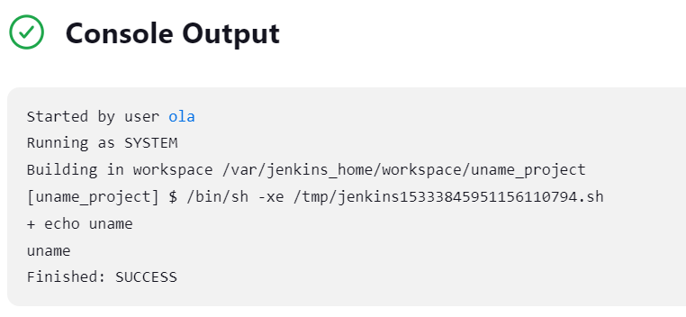
  
- **Utwórz projekt, który zwraca błąd, gdy godzina jest nieparzysta**
  
  Bardzo podobnie jak z poprzednim projektem, należy dodać odpowiedni kod odpowiedzialny za działanie projektu. Jest to kilka linijek z zastosowaniem konstrukcji warunkowej *if*:
  
  ```
  #!/bin/bash
  
  hour=$(date +%-H)
  
  if (( hour % 2 != 0 )); then
      echo "BLAD! Godzina $hour jest nieparzysta"
      exit 1
  else
      echo "SUKCES! Godzina $hour jest parzysta"
      exit 0
  fi
  ```
  
  Wynik działania programu w momencie, gdy godzina jest parzysta:
  
 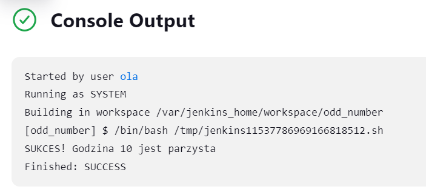
  
  Wynik działania programu w momencie, gdy godzina jest nieparzysta - program zwraca błąd:
  
 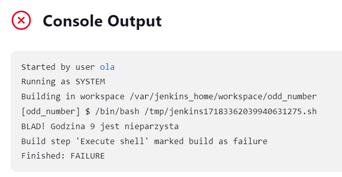
  

**Utwórz "prawdziwy" projekt, który:**

- **klonuje nasze repozytorium**
- **przechodzi na osobistą gałąź**
- **buduje obrazy z dockerfiles i/lub komponuje via docker-compose**

W celu uruchomienia projektu z poprzednich zajęć poprzez zadanie Jenkinsa, należy stworzyć nowy projekt (również typu Freestyle). Repozytorium jest publiczne, dlatego nie trzeba podawać `credensials` aby umożliwić jego sklonowanie. Wystarczy sam adres strony. W *Branches to build* należy podać nazwę swojej oosbistej gałęzi - u mnie jest to *AB413227*.

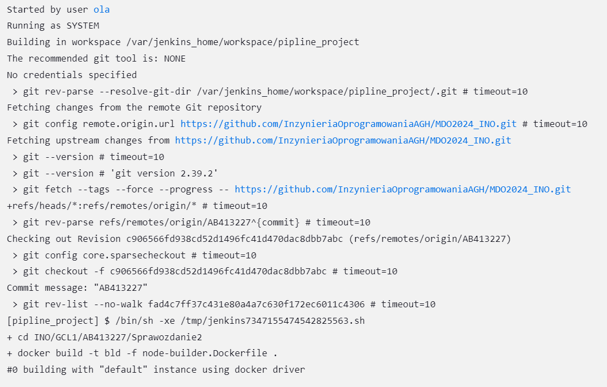

Do uruchomienia zdefiniowanego pliku, należy dopisać również kilka linijek kodu w wyznaczonym do tego miejscu, tak jak w poprzednich projektach:

```
cd INO/GCL1/AB413227/Sprawozdanie2
docker build -t bld -f node-builder.Dockerfile .
docker build -t test -f node-tester.Dockerfile .
```

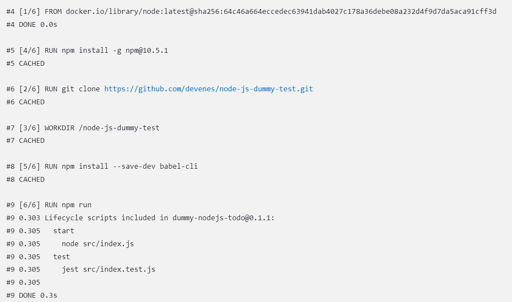
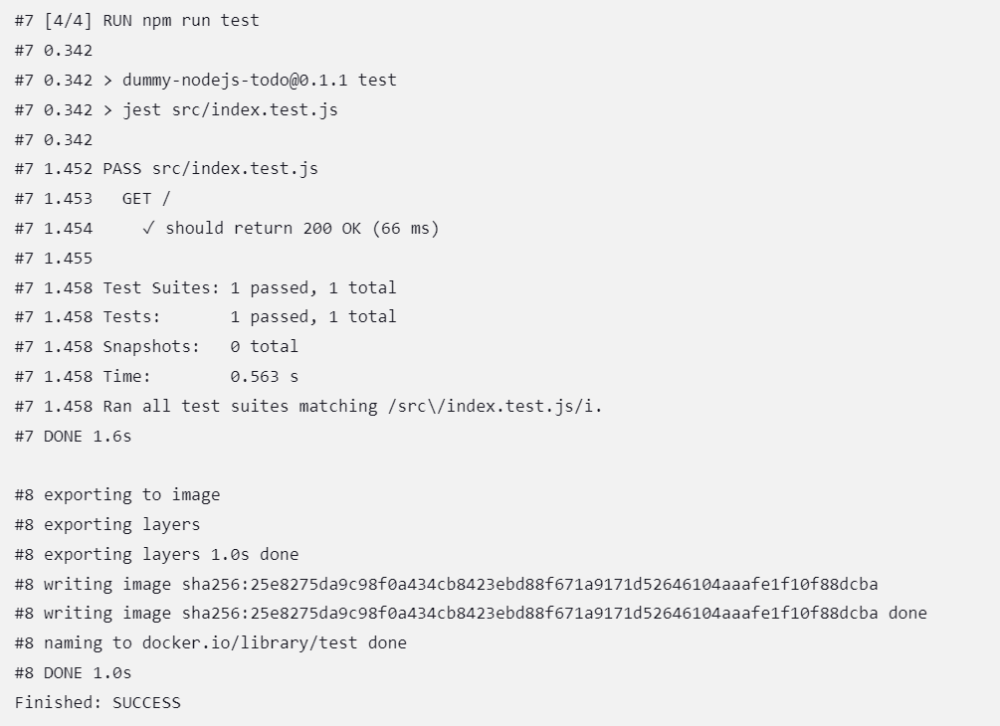

**Różnice pomiędzy DIND, a budowaniem bezpośrednio w kontenerze CI**

Budowanie na dedykowanym środowisku DIND (Docker-in-Docker) oferuje pełną izolację podczas procesu budowania, gdzie każde zadanie budowania jest uruchamiane w osobnym kontenerze Docker, działającym wewnątrz innego kontenera Docker. Ta metoda zapewnia maksymalną izolację, umożliwiając dostęp do pełnego stosu Docker. Mimo wszystko, konfiguracja DIND może być skomplikowana, wymagając ustawień bezpieczeństwa i wydajności.

Budowanie bezpośrednio w kontenerze CI oferuje prostszą konfigurację, ponieważ nie ma potrzeby obsługi DIND ani zarządzania warstwami kontenerów. Kontener CI uruchamiany jest bezpośrednio na hoście, co może być bardziej wydajne pod względem zużycia zasobów. Chociaż ta metoda może nie zapewniać takiej samej izolacji co DIND, to dla wielu przypadków użycia izolacja dostępna w kontenerze CI może być wystarczająca.

Wybór między DIND a budowaniem bezpośrednio w kontenerze CI zależy od potrzeb projektu i preferencji dotyczących izolacji środowiska, złożoności konfiguracji oraz wykorzystania zasobów. DIND oferuje pełną izolację i dostęp do pełnego stosu Docker, ale może być bardziej skomplikowany w konfiguracji i bardziej zasobożerny. Natomiast budowanie bezpośrednio w kontenerze CI może być prostsze i bardziej wydajne, chociaż może oferować mniejszą izolację.

#### Sprawozdanie (wstęp)

**Opracuj dokument z diagramami UML, opisującymi proces CI.**

- **Diagram aktywności, pokazujący kolejne etapy (collect, build, test, report)**
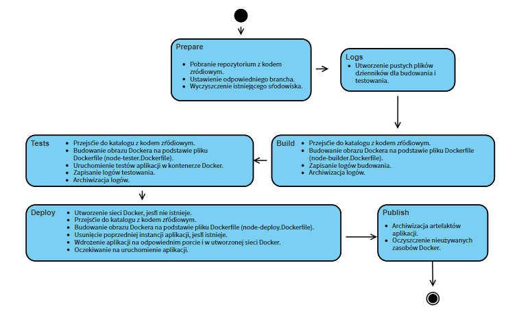
- **Diagram wdrożeniowy, opisujący relacje między składnikami, zasobami i artefaktami**

#### Pipeline

1. *Prepare*
  
  Pierwszy etap jest potrzebny do przygotowania środowiska projektu. Należy usunąć stary katalog, sklonować odpowiednie repozytorium, a następnie przenieść sięna odpowiednią gałąź. Wszystkie te operacje wykonywane były już na poprzednich laboratoriach w terminalu, teraz całość trzeba zrobić w jednym `stage`. Poprawne wykonanie tych operacji umożliwia pracę na najnowszej wersji kodu.
  
  ```
  stage('Prepare') {
           steps {
               
                  sh '''
                   rm -rf MDO2024_INO
                   git clone https://github.com/InzynieriaOprogramowaniaAGH/MDO2024_INO.git
                   cd MDO2024_INO
                   git checkout AB413227
                  '''
           
           }
       }
  ```
  
2. *Logs*
  
  Logi zawierają informacje o krokach procesu budowania, takich jak kompilacja kodu źródłowego, kopiowanie plików, instalacja zależności oraz wynikach testów jednostkowych, integracyjnych i testów wydajnościowych. Dzięki zapisywaniu tych informacji w plikach dziennika, użytkownicy mogą prześledzić historię procesu budowania i testowania, zidentyfikować i rozwiązać problemy oraz ocenić jakość i wydajność projektu. Pliki *bld.log* i *test.log* są wykorzystywane do rejestrowania logów związanych z procesem budowania i testowania.
  
  ```
   stage('Logs') {
           steps {
               dir('MDO2024_INO/INO/GCL1/AB413227/Sprawozdanie2'){
                   sh 'touch bld.log'
               }
               dir('MDO2024_INO/INO/GCL1/AB413227/Sprawozdanie2'){
                   sh 'touch test.log'
               }
           }
           
       }
  ```
  
3. *Build*
  
  Proces budowania jest kluczowym elementem w cyklu życia oprogramowania, pozwalającym na automatyzację kompilacji, testowania i wdrażania aplikacji.
  
  Następnie, wewnątrz bloku `steps`, znajdują się konkretne kroki wykonywane w ramach etapu budowania. Pierwszym krokiem jest zmiana katalogu roboczego za pomocą `dir('MDO2024_INO/INO/GCL1/AB413227/Sprawozdanie2')`. Jest to ważne, ponieważ umożliwia to Jenkinsowi wykonanie operacji budowania w odpowiednim środowisku, gdzie znajdują się niezbędne pliki i skrypty.
  
  Następnie wykonywany jest proces budowania obrazu Dockera. Polecenie `docker build` tworzy obraz na podstawie określonego pliku Dockerfile. Tutaj używane są opcje takie jak `-t` do nadania obrazowi etykiety oraz `-f` do wskazania konkretnego pliku Dockerfile. Wynik tego procesu, wraz z potencjalnymi komunikatami o błędach, jest przechwytywany przez `tee` i zapisywany do pliku dziennika *bld.log*. Ten krok jest kluczowy dla późniejszej analizy błędów, debugowania oraz śledzenia postępów procesu budowania.
  
  Na zakończenie, polecenie `archiveArtifacts` przechwytuje plik *bld.log* i archiwizuje go w Jenkinsie. Jest to ważne z punktu widzenia zarządzania jakością i śledzenia zmian w procesie budowania, umożliwiając późniejsze przeglądanie i analizę logów dla celów audytowych czy diagnostycznych.
  
  W ten sposób kod definiuje kompletny proces budowania obrazu Dockera w ramach Jenkins Pipeline, zapewniając automatyzację, powtarzalność i kontrolę jakości procesu budowania oprogramowania.
  
  Plik *node-builder.Dockerfile*, wykorzystywany do poprzedniego i obecnego sprawozdania:
  
  ```
  FROM node:latest
  
  RUN git clone https://github.com/devenes/node-js-dummy-test.git
  
  WORKDIR /node-js-dummy-test
  
  RUN npm install -g npm@10.5.1
  RUN npm install --save-dev babel-cli
  RUN npm run
  ```
  
  4. *Tests*
    

Ten fragment kodu definiuje etap testów, który jest kluczowym krokiem w procesie zapewniania jakości oprogramowania poprzez automatyzację testowania aplikacji.

Przy użyciu polecenia `sh`, wykonuje się proces budowania obrazu Dockera. W tym przypadku, obraz ten jest przeznaczony do testowania aplikacji. Polecenie `docker build` tworzy obraz na podstawie pliku Dockerfile, który jest specjalnie skonfigurowany do testowania aplikacji. Podobnie jak w poprzednim etapie, używany jest `tee`, aby przechwycić wyjście i ewentualne błędy procesu budowania, które są następnie zapisywane do pliku dziennika *test.log*.

Na końcu, polecenie `archiveArtifacts` przechwytuje plik *test.log* i archiwizuje go w Jenkinsie. Pozwala to na późniejsze przeglądanie i analizę logów z procesu testowania, co jest istotne dla diagnozowania ewentualnych błędów, audytu jakości oraz monitorowania postępów procesu testowania.

Plik *node-tester.Dockerfile*, wykorzystywany do poprzedniego i obecnego sprawozdania:

```
FROM bld
WORKDIR /node-js-dummy-test
RUN npm install -g jest
RUN npm run test
```

W celu sprawdzenia poprawności działania utworzyłam prosty Pipeline na podstawie trzech `stages`, projekt wypadł pozytywnie:

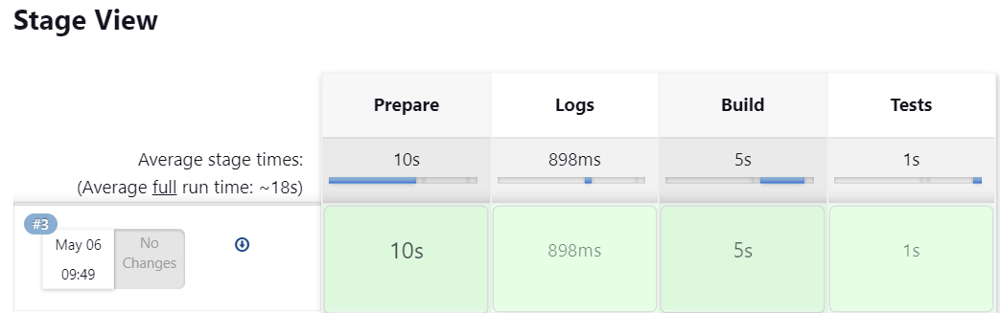

Następnie przeszłam do dwóch pozostałych części - *Deploy* i *Publish*.

5. *Deploy*
  

Po pomyślnym zakończeniu testów, etap *deploy* automatycznie wdraża zbudowaną aplikację lub oprogramowanie na odpowiednie środowisko, takie jak środowisko deweloperskie, testowe, stagingowe lub produkcyjne. Automatyzacja tego procesu eliminuje potrzebę ręcznego wdrażania, co z kolei przyspiesza cykl dostarczania oprogramowania. Etap ten ma na celu zwiększenie efektywności i skuteczności procesu wdrażania poprzez eliminację ludzkich błędów oraz zapewnienie spójności między różnymi środowiskami. Dzięki temu można uniknąć przypadkowych pomyłek i zapewnić powtarzalność procesu wdrażania.

```
stage('Deploy') {
            steps {
                
                sh 'docker network create my_network || true'
                
                dir("MDO2024_INO/INO/GCL1/AB413227/Sprawozdanie2") {
                    sh "docker build -t app-deploy -f node-deploy.Dockerfile ."
                }
                
                sh 'docker rm -f app || true'
                
                sh 'docker run -d -p 8081:8080 --name app --network my_network app-deploy'
                
                sleep 10
                
                   
                }
            
        }
```

5. *Publish*
  
  Etap ma na celu udostępnienie wytworzonych artefaktów, takich jak biblioteki, moduły, pliki konfiguracyjne, aby były dostępne do użycia przez inne aplikacje lub zespoły. Udostępnienie tych artefaktów umożliwia innym projektom korzystanie z gotowych komponentów zamiast implementowania ich od zera. Może być on również używany do zarządzania wersjami artefaktów. W momencie publikacji, zwykle nadawany jest odpowiedni numer wersji, co ułatwia śledzenie, które wersje są używane przez różne projekty oraz umożliwia wersjonowanie i zarządzanie zależnościami.
  
  ```
  stage('Publish') {
      steps {
                  dir('MDO2024_INO/INO/GCL1/AB413227/Sprawozdanie2'){
                      archiveArtifacts artifacts: "artifacts/art.tar"
                      sh 'docker system prune --all --volumes --force'
                  }    
              }
  }
  
  ```
  

Jak widać, wszystkie testy poszły prawidłowo:

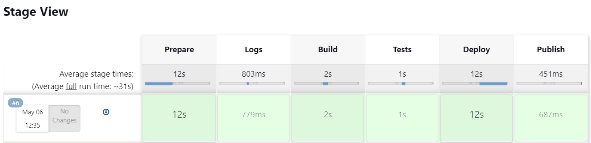

**Plik Pipeline**

```
pipeline {
 agent any
     
 stages {
     stage('Prepare') {
         steps {
             
                sh '''
                 rm -rf MDO2024_INO
                 git clone https://github.com/InzynieriaOprogramowaniaAGH/MDO2024_INO.git
                 cd MDO2024_INO
                 git checkout AB413227
                '''
         
         }
     }
     
     stage('Logs') {
         steps {
             dir('MDO2024_INO/INO/GCL1/AB413227/Sprawozdanie2'){
                 sh 'touch bld.log'
             }
             dir('MDO2024_INO/INO/GCL1/AB413227/Sprawozdanie2'){
                 sh 'touch test.log'
             }
         }
         
     }
     
     stage('Build '){
         steps{
                dir('MDO2024_INO/INO/GCL1/AB413227/Sprawozdanie2'){
                 sh 'docker build -t bld -f node-builder.Dockerfile . | tee bld.log'
                 archiveArtifacts artifacts: "bld.log"
                }
             
         }
     }
     stage('Tests'){
         steps{
                dir('MDO2024_INO/INO/GCL1/AB413227/Sprawozdanie2'){
                 sh 'docker build -t test -f node-tester.Dockerfile . | tee test.log'
                 archiveArtifacts artifacts: "test.log"
                }
             
         }
     }
     stage('Deploy') {
            steps {
                
                sh 'docker network create my_network || true'
                
                dir("MDO2024_INO/INO/GCL1/AB413227/Sprawozdanie2") {
                    sh "docker build -t app-deploy -f node-deploy.Dockerfile ."
                }
                
                sh 'docker rm -f app || true'
                
                sh 'docker run -d -p 8081:8080 --name app --network my_network app-deploy'
                
                sleep 10
                
                   
                }
            
        }
        stage('Publish') {
            steps {
                dir('MDO2024_INO/INO/GCL1/AB413227/Sprawozdanie2'){
                    archiveArtifacts artifacts: "artifacts/art.tar"
                    sh 'docker system prune --all --volumes --force'
                }    
            }     
        }
 }
}
```
