# Sprawozdanie 4

Aleksandra Banak

413227

## Cel ćwiczenia

Przy prawidłowym wykonaniu poniższych czynności gwarantowane jest zrozumienie podstaw Ansible - poznanie architektury i komponentów Ansible, takich jak Playbooks, Inventory, moduły i Role. Dzięki ćwiczeniom można nauczyć się również takich czynności jak pisanie plików Playbook w formacie YAML do automatyzacji różnych zadań oraz wykorzystanie modułów Ansible do realizacji specyficznych operacji (instalacja pakietów, zarządzanie użytkownikami, konfiguracja usług). Druga część zajęć poświęcona jest wdrożeniom nienadzorowanym. Kluczowe jest tu zrozumienie pojęcia wdrożeń nienadzorowanych, czyli poznanie koncepcji i korzyści związanych z automatyzacją instalacji systemów operacyjnych i aplikacji bez potrzeby interwencji użytkownika, wykorzystanie plików odpowiedzi do automatyzacji instalacji systemów operacyjnych na nowych maszynach.

## Automatyzacja i zdalne wykonywanie poleceń za pomocą Ansible

### Instalacja zarządcy Ansible

Ansible to narzędzie do automatyzacji zarządzania komputerami, które jest szczególnie przydatne w środowiskach bez interfejsu graficznego. Zamiast ręcznego przesyłania plików i wykonywania poleceń na różnych maszynach, Ansible umożliwia tworzenie plików konfiguracyjnych, w których definiowane są zadania do wykonania. Przykładowo, zamiast ręcznie instalować program na każdym serwerze, można napisać skrypt, który automatycznie przeprowadzi instalację na wszystkich wybranych maszynach jednocześnie. Dzięki temu jednym poleceniem można zautomatyzować i skoordynować różne procesy, oszczędzając czas i redukując ryzyko błędów.

Ćwiczenie zaczęłam od zainstalowania drugiej maszyny wirtualnej na moim komputerze. Powinna ona mieć dokładnie taki sam system jak poprzednia, u mnie jest to Ubuntu 22.04. Po poprawnej instalacji sprawdziłam obecność programu tar i serwera OpenSSH. W przypadku braku konkretnego programu, dokonałam potrzebnych instalacji.

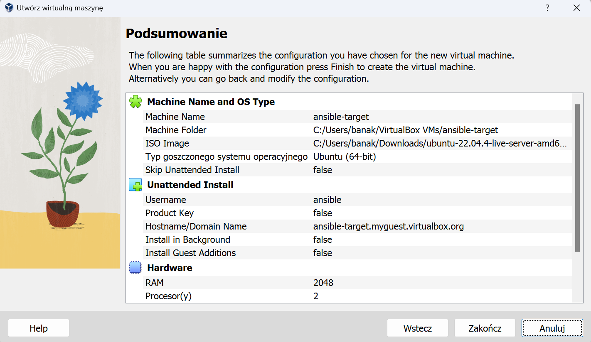

Przy tworzeniu maszyny, zadbałam o poprawny hostname oraz nazwę użytkownika.


Na sam koniec zrobiłam migawkę.

Na swojej **głównej** maszynie zainstalowałam pakiet `ansible`, korzystając ze strony https://docs.ansible.com/ansible/latest/installation_guide/index.html .

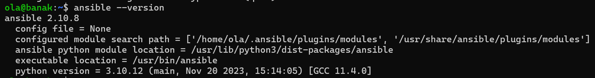

**Wymiana kluczy SSH pomiędzy maszynami**

Przełączyłam sieci w obu maszynach w tryb Bridge, zamiast NAT, aby maszyny mogły się znaleźć. W obu maszynach utworzyłam klucze poleceniem

```
ssh-keygen -t <type:dsa/rsa/ed25519/ecdsa> 
```

Ja wybrałam typ ecdsa.

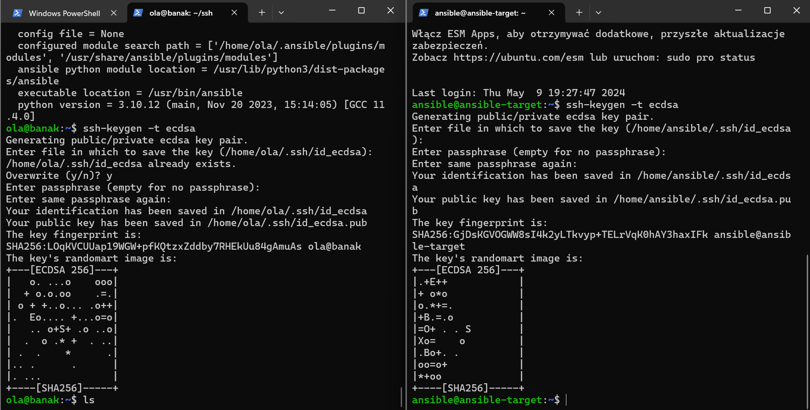

Następnie należy przekopiować klucz do odpowiedniego folderu. Użyta komenda:

```
ssh-copy-id -i <path_to_pub_key> user@hostname
```

Dzięku temu maszyny wymieniły się kluczami i w tym momencie nie wymagane jest juz podanie hasła przy logowaniu.

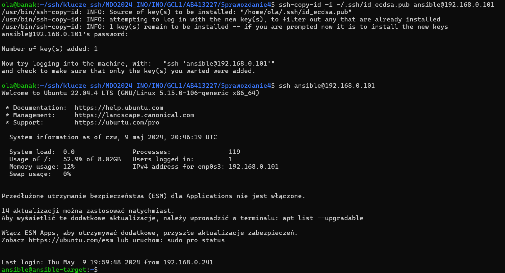

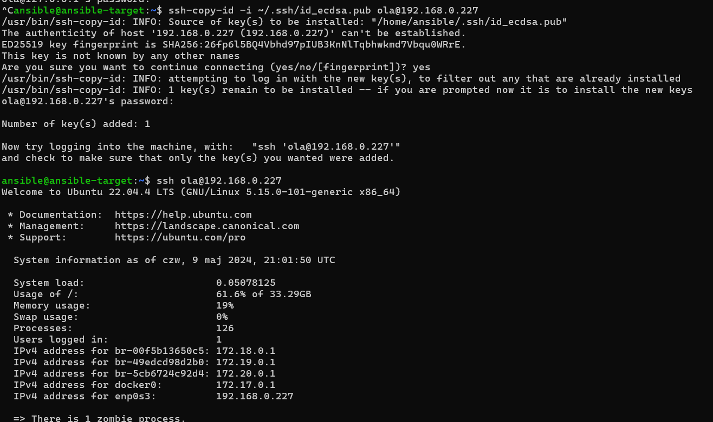

Należy pamiętać, aby dodać też klucz publiczny maszyny, na której zainstalowany jest *ansible*, tak aby mogła łączyć się poprzez ssh sama ze sobą bez konieczności podawania hasła.


### Inwentaryzacja

Komenda `hostnamectl` umożliwia wyciągnać potencjalne nazwy komputerów. Aby nie musieć wywoływać maszyn jedynie poprzez ich adres IP należy wprowadzić nazwy DNS. W pliku */etc/hosts* należy dodać linijkę z adresem IP i po spacji nazwę komputera. U mnie jest to:

```
 192.168.0.101 ansible-target
```

Sprawdziłam, czy łączność jest prawidłowa przy wykorzystaniu obu nazw, poprzez wywołanie *ping*.

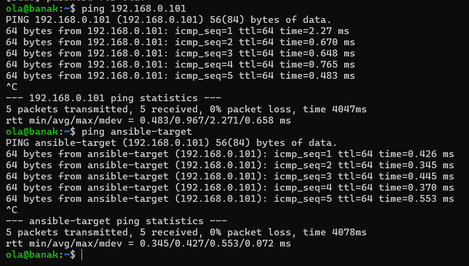

Następnie należy stworzyć plik inwentaryzacji przy wykorzystaniu [dokumentacji ansible](https://docs.ansible.com/ansible/latest/getting_started/get_started_inventory.html#get-started-inventory). Treś pliku *inventory.ini*:

```
[Orchestrators]
banak

[Endpoints]
ansible-target ansible_user=ansible
```

Weryfikacja inwentarza przebiega następująco:

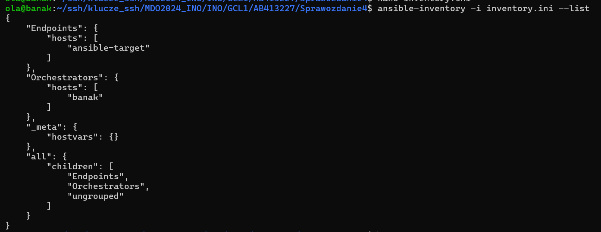

Wysłanie żądania `ping` do wszystkich maszyn odbywa się poprzez połączenie ssh. Konieczne jest dodanie klucza do swojej maszyny, o czym wspomniałam przy wymianie kluczy pomiędzy maszynami. W przeciwnym raziekonieczne będzie podanie hasła, a *ansible* zwróci błąd.

Zastosowałam komendę, która wysyła plik do wszystkich maszyn `Endpoints` .

```
ansible Endpoints -m ping -i inventory.ini
```

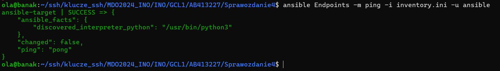

W przypadku wysłania do wszystkich maszyn (włącznie z orkiestratorem):

```
ansible all -m ping -i inventory.ini
```

Łączność między maszynami (endpointem a orkiestratorem) została zapewniona.

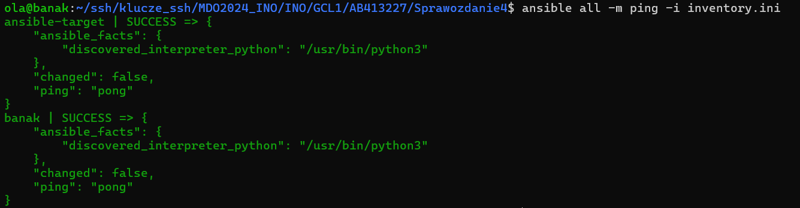

### Zdalne wywołanie procedur

- **Wyślij żądanie `ping` do wszystkich maszyn**

Na początku utworzyłam plik `playbook.yaml` ponownie według [oficjalnej dokumentacji](https://docs.ansible.com/ansible/latest/getting_started/get_started_playbook.html). Wysłanie żądania *ping* do wszystkich maszyn:

```
- name: Ping all machines
hosts: all
tasks:
- name: ping my hosts
ansible.builtin.ping:
```

Sprawdzenie poprawności działania komendą:

```
ansible-playbook -i inventory.ini playbook.yaml
```

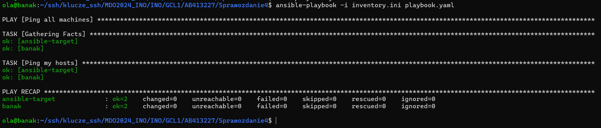

- **Skopiuj plik inwentaryzacji na maszyny/ę `Endpoints`**

```
- name: Copy inventory
hosts: Endpoints
tasks:
- name: Copy
copy:
src: ~/ssh/klucze_ssh/MDO2024_INO/INO/GCL1/AB413227/Sprawozdanie4/inventory.ini
dest: ~/inventory.ini
```

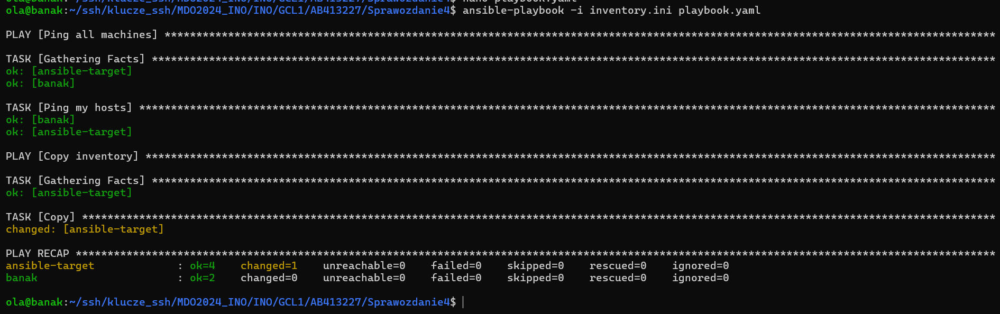

- **Zaktualizuj pakiety w systemie**

```
- name: Update package
  hosts: Endpoints
  vars:
    ansible_become_pass: ansible 
  tasks:
  - name: update
    become: yes
    apt:
      name: "*"
      state: latest
```

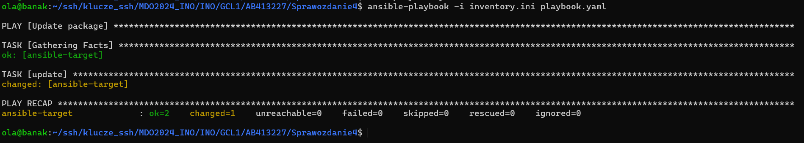

Konieczne okazało się użycie słowa `become=yes` i podania hasła do admina: `ansible_become_pass`. Bez tego ansible nie jest w stanie wykonać aktualizacji (`sudo apt update`).

- **Zrestartuj usługi `sshd` i `rngd`**
  
  W moim przypadku należało zainstalować usługę `rngd`, ponieważ nie była ona obecna na moim systemie. Zrobiłam to na serwerze *ansible-target.*
  

```
- name: Restart sshd and rngd
  hosts: Endpoints
  vars:
    ansible_become_pass: ansible
  tasks:
  - name: Restart sshd
    become: yes
    service:
      name: sshd
      state: restarted

  - name: Restart rngd
    become: yes
    service:
      name: rngd
      state: restarted
```

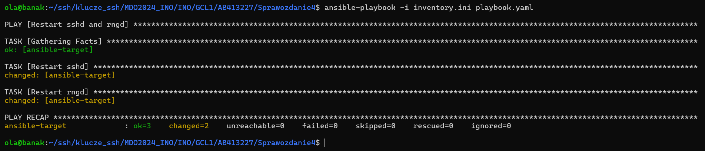

Kod `changed` oznacza, że ansible zmienił stan maszyny, w tym przypadku doprowadził do restartu działającego demona `sshd`.

Dzięki definicji poszczególnych zadań łatwo można rozróżnić każdy etap i dowiedzieć się, czy zadanie zostało wykonane poprawnie.

- **Przeprowadź operacje względem maszyny z wyłączonym serwerem SSH, odpiętą kartą sieciową**
  
  W celu wykonania tego zadania najpierw na serwerze maszyny *ansible-target* wyłączyłam kartę sieciową i serwer SSH.
  
  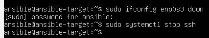
  
  *enp0s3* - nazwa urządzenia ubuntu
  

Po uruchomieniu playbooka wynik jest następujący - wyskakuje błąd. Ansible nie jest w stanie się połączyć z maszyną, w związku z czym playbook kończy swoje działanie.

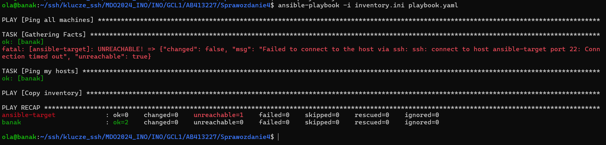

Po przetestowaniu tej opcji ponownie włączyłam kartę sieciową i serwer SSH.

```
sudo ifconfig enp0s3 up
sudo systemctl start ssh
```

### Zarządzanie kontenerem

Należy pobrać Docker na maszynę docelową jeżeli go nie ma.

```
- name: Pobieranie dockera
  become: true
  ansible.builtin.apt:
    name: docker.io
    state: latest

- name: Dzialanie bez reboota
  become: true
  command: systemctl enable --now docker
```

## Instalacje nienadzorowane

Podczas instalacji systemu Fedora zapisywany jest w systemie plik odpowiedzi. Jest to plik z konfiguracją systemu uzupełnioną podczas instalacji, zapisywany w pliku `anaconda-ks.cfg` w katalogu domowym użytkownika `root`.

Po zainstalowaniu systemu *Fedora 39* z instalatora sieciowego, należy skopiować plik odpowiedzi na podstawie którego będzie konstruować nowy plik.

```
sudo cp /root/anaconda-ks.cfg /tmp
```

Dodatkowo wersja 39 Fedory umożliwia dopisanie dodatkowych źródeł instalacji przed zainstalowaniem systemu. Wykorzystałam tę opcję, dzięki czemu w moim pliku od razu znajdowała się już linijka z lokalizacją serwerów lustrzanych.

Ponadto dopisałam polecenie, które definiuje wyczyszczenie wszystkich istniejących partycji na dysku:

```
clearpart --all
```

Cały plik `anaconda-ks.cfg` wygląda następująco:

```
# Generated by Anaconda 39.32.6
# Generated by pykickstart v3.48
#version=DEVEL
# Use graphical install
graphical

# Keyboard layouts
keyboard --vckeymap=pl --xlayouts='pl'
# System language
lang pl_PL.UTF-8

repo --name="updates-released" --mirrorlist=http://mirrors.fedoraproject.org/mirrorlist?repo=updates-released-f39&arch=x86_64
# Use network installation
url --mirrorlist="http://mirrors.fedoraproject.org/mirrorlist?repo=fedora-39&arch=x86_64"

%packages
@^minimal-environment
@container-management

%end

# Run the Setup Agent on first boot
firstboot --enable

# Generated using Blivet version 3.8.1
ignoredisk --only-use=sda
autopart
# Partition clearing information
clearpart --all

# System timezone
timezone Europe/Warsaw --utc

#Root password
rootpw --lock
user --groups=wheel --name=banak --password=$y$j9T$9Bm9SVimq6uKpdci6kbFVk8z$b.RtzsCpV24.v5cKHsu4/3JIr1o7mnx9AjOWjGm1dw/ --iscrypted --gecos="banak"

reboot
```

Po wszystkich potrzebych edycjach pliku, dodałam go do swojego folderu na GitHubie. Będzie on potrzebny do instalacji systemu.

Po wykonaniu powyższych czynności należy przejść do instalacji systemu ze wskazaniem ścieżki do pliku `anaconda-ks.cfg` znajdującego się na GitHubie.

Podczas działania programu rozruchowego `GRUB` trzeba wybrać opcję `e`, która uruchamia edytor linii poleceń Gruba - to pozwala edytować opcje rozruchowe. W tym miejscu zgodnie z [dokumentacją](https://anaconda-installer.readthedocs.io/en/latest/boot-options.html) należy dodać poniższą linijkę:

```
inst.ks=https://raw.githubusercontent.com/InzynieriaOprogramowaniaAGH/MDO2024_INO/AB413227/INO/GCL1/AB413227/Sprawozdanie4/anaconda-ks.cfg
```

Należy wykorzystać plik https (pobrać go z GitHuba):

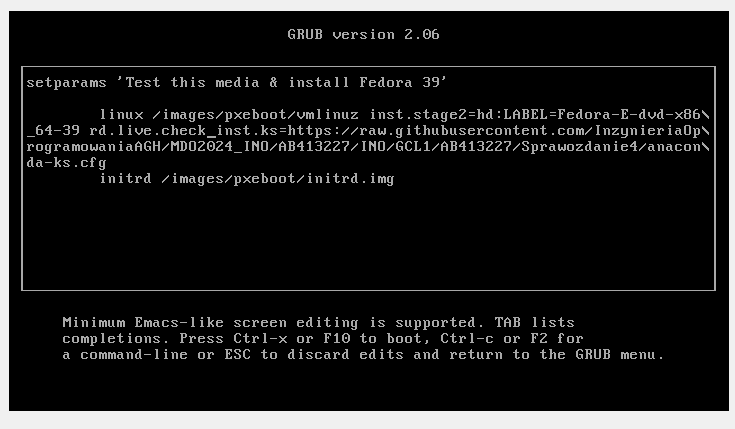

Po zatwierdzeniu zmian, następuje automatyczna instalacja pakietów oraz reboot systemu.

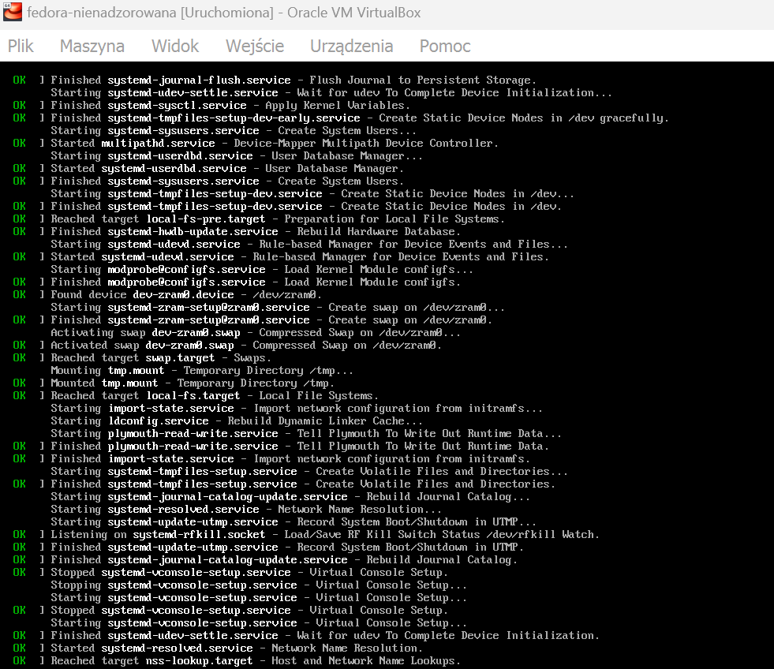

Po poprawnej instalacji, aby uruchomić system należy wybrać opcje `Troubleshooting -> Boot first drive`

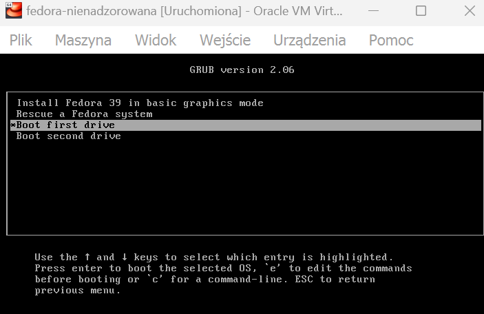

System uruchomił się:

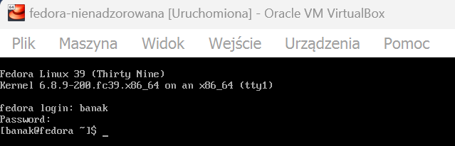
