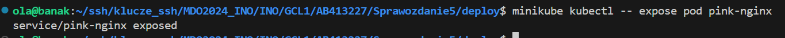
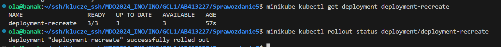
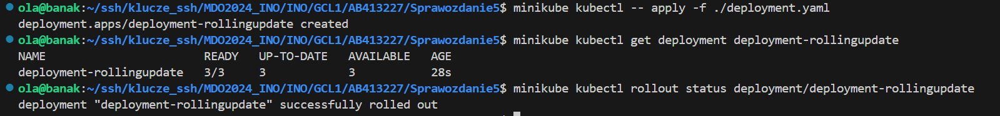

# Sprawozdanie 5

Aleksandra Banak

413227

## Cel projektu

Zaznajomienie się z wdrażaniem na zarządzalne kontenery poprzez Kubernetes.

### Instalacja klastra Kubernetes

#### Zaopatrzenie się w implementację stosu k8s oraz instalacja.

Ćwieczenie zaczełąm od pobrania minikube. Skorzystałam z udostępnionej na zajęciach [instrukcji](https://minikube.sigs.k8s.io/docs/start/). Wybrany wariant to Linux.

Pobrałam paczkę i zainstalowałam ją przy użyciu komendy:

```
curl -LO https://storage.googleapis.com/minikube/releases/latest/minikube_latest_amd64.deb
sudo dpkg -i minikube_latest_amd64.deb
```

#### Zaopatrzenie się w polecenie `kubectl` w wariancie minikube oraz alias.

`kubectl` umożliwia użytkownikowi sprawdzenie statusu swoich zasobów (np. usług). Zdecydowanie ułatwia to znajdowanie problemów i rozwiązywanie ich.

Pobranie `kubectl`:

```
minikube kubectl -- get po -A
```

Dodatkowo wprowadziłam alias:

```
alias kubectl="minikube kubectl --"
```


#### Uruchomienie Kubernetes:

Zastosowałam polecenie:

```
minikube start
```

Podczas uruchomienia weryfikowane są wszytskie wymagania, przy których Kubernetes może działać. Początkowo moja maszyna działała na 1 procesorze (potrzebne są minimum 2), co zostało od razu przechwycone i program wyrzucił błąd. Poprawiłam parametry i uruchomiłam maszynę ponownie. Problem się rozwiązał.


#### Uruchomienie Dashboard oraz zapoznanie się z koncepcjami funkcji wprowadzonych przez Kubernetesa.

Uruchomienie Dashboard:

```
minikube dashboard
```

Polecenie wykonałam w VisualStudio Code, co zdecydowanie ułatwiło sytuację, ponieważ ta aplikacja ma wbudowane przekierowanie portów. Przeglądarka otworzyła się automatycznie.


Przy próbie uruchomienia polecenia z terminala, nawet skopiowanie linku nie pomogło aktywować strony.


Przy sprawdzeniu popranego działania strony wyłączyłam Kubernetes komendą:

```
minikube stop
```

Zapobiega to pojawianiu się błędów w przyszłości i umożliwia ponowne poprawne otwarcie, tak jak opisałam to wyżej.

### Analiza posiadanego kontenera

#### Wybrana nowa aplikacja i jej dostosowanie.

Moja aplikacja bazuje na obrazie *nginx*. Zmodyfikowałam ją tak, żeby wyśiwetlana była data i godzina. Ustawiłam kolorowe tło. Taką prostą aplikację można stworzyć poprzez dodanie konfiguracji do obrazu bazowego.

Plik *Dockerfile*, który wykorzystuję:

```
FROM nginx:1.26

COPY ./index.html /usr/share/nginx/html/index.html
```

Napisaną przeze mnie konfigurację wprowadzam, kopiując plik konfiguracyjny (*index.html*). Po skopiowaniu, w momencie wyświetlenia po raz pierwszy strony bazującej na moim pliku, powinna się wyświetlać data i godzina na różowym tle.

Zaczynam od budowy obrazu:


Publikuję swój kontener na stronie DockerHub komendą:

```
docker push banakola/pink-nginx:1.0
```

Używam również specjalnego tagu. (niestety nie zrobiłam screena pierwszego Tag, ale wstawie tutaj tą operację dla kolejnego).


Następnie należy uruchomić kontener i sprawdzić, czy aplikacja działa poprawnie.


Wynik działania aplikacji:


Aplikacja spełnia wszystkie wymagania, które umożliwiają wykonanie dalszej instrukcji.

### Uruchamianie oprogramowania

#### 1. Uruchomienie konteneru na stosie:

Uruchomienie kontenera na stosie k8s:

```
minikube kubectl run -- <nazwa_wdrozenia> --image=<obraz_docker> --port=<wyprowadzany port> --labels app=<nazwa_wdrozenia>
```

Kontener uruchomiony w minikubie zostanie automatycznie ubrany w pod. Można to zauważyć na stronie minikube dashboard:


Działające pody można także wypisać za pomocą `kubectl`.

Po zastosowanym przeze mnie aliasie można też użyć polecenia `minikube kubectl --`. Przykładowa komenda pasująca u mnie:

```
minikube kubectl -- expose pod pink-nginx
```



co zwraca działającą usługę oraz:

```
minikube kubectl get pods
```

wypisujące wszytkie działające pody:


#### 2. Wyprowadzenie portu w celu dotarcia do eksponowanej funkcjonalności (aplikacji).

Użyta komenda:

```
kubectl port-forward pod/clock-nginx 8081:80
```


Przekierowałam port z wirtualnej maszyny manualnie na VisualStudio Code. Wybrałam port 8081, ponieważ był niezajęty przez żaden kontener.


Moja aplikacja jest uruchamiana po wpisaniu w wyszukiwarkę [https://localhost:8081](https://localhost:8081/).


### Konwersja wdrożenia ręcznego na wdrożenie deklaratywne YAML

#### 1. Stworzenie pliku yaml.

Plik utworzyłam bazując na przykładzie dostępnym w dokumentacji Kubernetes.

```
apiVersion: apps/v1
kind: Deployment
metadata:
  name: deployment
  labels:
    app: pink-nginx
spec:
  replicas: 4
  selector:
    matchLabels:
    app: pink-nginx
  template:
    metadata:
      labels:
        app: pink-nginx
    spec:
      containers:
        - name: pink-nginx
        image: banakola/pink-nginx:1.0
        ports:
        - containerPort: 80
```

W wymaganiach należało uwzględnić, że obraz posiada 4 repliki.

```
spec:
  replicas: 4
```

#### 2. Wdrożenie i zbadanie stanu:

Wdrożenie należy zacząć od zaaplikowania nowo stworzonego pliku do *kubectl*. Powoduje to również uruchomienie. Trzeba pamiętać o określonym aliasie (jeśli został on określony).

```
minikube kubectl -- apply -f ./deployment.yaml
```

Pobranie deployments:

```
minikube kubectl get deployments
```


Sprawdzenie statusu dokonywane jest na dashboar lub poprzez komendę:

```
minikube kubectl rollout status
```


Wyniki po uruchomieniu Dashboard komendą `minikube dashboard`:


### Przygotowanie nowego obrazu

#### Zarejestrowanie nowych wersji obrazu `Deploy` w DockerHub.

Każda z nowopowstałych wersji jest tworzona poprzez modyfikacje pliku *index.html*. Wybrałam opcję ręcznego budowania każdej z wersji. W związku z czym po każdej zmianie pliku *html* musiałam kolejne wykonać komendy:

`docker build -t pink-nginx .`

`docker tag pink-nginx banakola/pink-nginx:1.1`

`docker push banakola/pink-nginx:1.1`


Nowa wersja różni się kolorem tła (z różowego na zielony) i tekstem informującym, że jest to nowa wersja.


#### Wersja z błędem.

Wersja z błędem została zmodyfikowana poprzez dopisanie w pliku Dockerfile dodatkowej komendy. `CMD ["false"]` oznacza, że kontener natychmiast zakończy swoje działanie z błędem. Jest to przydatne w niektórych scenariuszach testowych lub diagnostycznych, właśnie tak jak tutaj.


#### Potwierdzenie z DockerHub.

Wszystkie wersje są dostępne na stronie DockerHub pod odpowiednimi Tagami obrazu.


### Zmiany w deploymencie

#### Zwiększenie replik do 10

Jedyna modyfikacja pliku *deployment.yaml* to zmiana liczby replik z 4 na 8:

```
spec:
  replicas: 8
```

Następnie stosowane jest `kubectl apply` i `kubectl get deployments`.


Wyniki w dashboard:


#### Zmniejszenie replik do 1

Zmniejszenie liczby replik do 1 oznacza, że tylko jedna instancja aplikacji będzie działać. Podczas wdrażania nowych wersji aplikacji, można początkowo zmniejszyć liczbę replik do 1, aby upewnić się, że nowa wersja działa poprawnie, zanim liczba replik będzie zwiększona do pełnej wartości.

Krok ten wykonany został tak samo jak poprzedni ze zmianą z 8 na 1. Zastosowałam te same komendy.

```
spec:
  replicas: 1
```


Wyniki w dashboard:


#### Zmniejszenie replik do 0

Zmniejszenie liczby replik do 0 oznacza, że wszystkie aktualnie działające Pody zostaną usunięte. W testowych środowiskach CI/CD, gdzie aplikacje są uruchamiane i zatrzymywane wielokrotnie, zmniejszenie liczby replik do 0 może być częścią procesu testowania, aby upewnić się, że wszystko działa poprawnie po ponownym uruchomieniu.

Krok ten wykonany został tak samo jak poprzedni ze zmianą z 1 na 0.


Wyniki w dashboard:


#### Zastosowanie nowej wersji obrazu

Aktualizacje mogą zawierać optymalizacje, które poprawiają wydajność i skalowalność aplikacji, zmniejszają zużycie zasobów.

Zmiana, jakiej dokonuję w pliku *deployment.yaml*:

```
containers:
- name: pink-nginx
  image: banakola/pink-nginx:1.1
  ports:
  - containerPort: 80
```


#### Zastosowanie starszej wersji obrazy

Starsze wersje, które są dobrze przetestowane i używane przez długi czas, mogą być bardziej stabilne i mniej podatne na nieznane problemy niż najnowsze wersje. Niektóre aplikacje lub zależności mogą być kompatybilne tylko ze starszymi wersjami obrazów. Aktualizacja do nowszej wersji może wymagać również aktualizacji innych komponentów, co może być czasochłonne i ryzykowne. Jeśli nowsza wersja obrazu wprowadza nowe błędy lub problemy, powrót do starszej wersji może być konieczny, aby utrzymać działanie aplikacji.

Wracam do wersji 1.0:

```
containers:
- name: pink-nginx
  image: banakola/pink-nginx:1.0
  ports:
  - containerPort: 80
```


#### Przywrócenie poprzedniej wersji

Zastosowałam komendę:

```
minikube kubectl rollout history deployment
```

Komenda ta pozwala na przegląd wszystkich zmian wprowadzonych do Deploymentu lub innego zarządzanego zasobu. Można zobaczyć kiedy i jakie zmiany zostały wprowadzone, co ułatwia debugowanie i zarządzanie wersjami.


### Kontrola wdrożenia

Utworzyłam skrypt sprawdzający czy w przeciągu podanego czasu wdrożenie zostanie wykonane. Jeśli deployment zakończy się powodzeniem, skrypt wyświetli odpowiedni komunikat i zakończy się sukcesem. Jeśli nie, skrypt wyświetli komunikat o błędzie i zakończy się niepowodzeniem.

```
#!/bin/bash

DEPLOYMENT_NAME="pink-deployment"
TIMEOUT=60

minikube kubectl -- apply -f ./pink-deployment.yaml

minikube kubectl get deployments 

if minikube kubectl -- rollout status deployment/$DEPLOYMENT_NAME --timeout=${TIMEOUT}s > /dev/null 2>&1; then
echo "Success! Deployment successfully rolled out."
exit 0
else
echo "Error. Deployment did not complete."
exit 1
fi
```

Wynik działania przedstawiony jest poniżej:


### Strategie wdrożenia

#### Przygotowanie wersji z różnymi strategiami wdrożeń

Domyślnie używana strategia to RollingUpdate.

**Recreate**

Zostaje zmieniona część `spec`. Reszta pliku *deployment.yaml* zostaje taka sama.

```
spec:
  replicas: 3
  strategy: 
    type: Recreate
  selector:
    matchLabels:
    app: pink-nginx
```



**Rolling Update (z parametrami `maxUnavailable` = 2 , `maxSurge` = 40%)**

```
spec:
  replicas: 3
  strategy: 
    strategy: 
      type: RollingUpdate
      rollingUpdate:
        maxUnavailable: 2
        maxSurge: 40%
  selector:
    matchLabels:
    app: pink-nginx
```



#### Wnioski

- **Recreate** polega na zamknięciu wszystkich istniejących podów przed uruchomieniem nowych. Podczas procesu wdrażania, istniejące pody są usuwane, a następnie nowe są tworzone od podstaw.
- **RollingUpdate** wprowadza nowe wersje podów stopniowo, zamieniając stare pody nowymi w określonych interwałach. Proces ten zapewnia, że aplikacja pozostaje dostępna podczas aktualizacji.
- **Canary** to strategia wdrażania, która polega na uruchomieniu nowej wersji aplikacji równocześnie z wersją produkcyjną, ale tylko na niewielkiej części ruchu użytkowników. Jeśli nowa wersja działa poprawnie, stopniowo zwiększa się jej udział w ruchu, aż do pełnego wdrożenia.

#### Użycie serwisu

Serwis zapewnia stały punkt dostępu do aplikacji, nawet jeśli pody są dynamicznie tworzone, niszczone i przemieszczane. To oznacza, że inne aplikacje i użytkownicy mogą zawsze łączyć się z aplikacją za pomocą tego samego adresu IP lub nazwy DNS, niezależnie od zmian w liczbie i lokalizacji podów. Umożliwia on również łatwe odnajdywanie podów przez inne aplikacje. Dzięki etykietom i selektorom można dynamicznie grupować pody należące do tego samego serwisu, co ułatwia zarządzanie i skalowanie aplikacji.

Mój plik:

```
apiVersion: v1
kind: Service
metadata:
  name: my-service
spec:
  selector:
    app: pink-nginx
  ports:
    - protocol: TCP
    port: 80
    targetPort: 80
```

Przekierowanie portu:

```
minikube kubectl -- apply -f ./service.yaml 
minikube kubectl port-forward service/my-service 8881:80
```

Działanie mojej aplikacji:


Ponownie należało pamiętać o przekierowaniu portów w VisualStudio Code.


