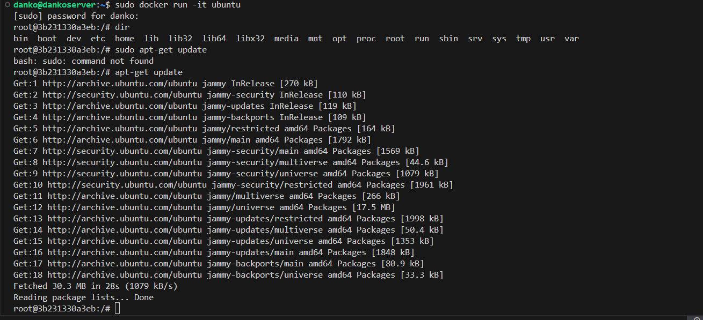

# Sprawozdanie nr 1
---
## Cel ćwiczenia:
 ## 1 część: Wprowadzenie do środowiska Git. Połączenie z serwerem na wirtualnej maszynie Ubuntu, umiejętność posługiwania się podstawowymi poleceniami Git: branch, commit, add, checkout, itp., poprawne rozumienie struktury gałęzi i posługiwanie się nimi w trakcie laboratorium. Należy zrozumieć ideę kluczy SSH i potrafić je generować.
 
 ## 2 część: Wprowadzenie do Dockera. Poznanie idei używania tego środowiska, odróżnienie go od wirtualnej maszyny, pierwsze użycie praktyczne obrazu, kontenera oraz ich terminologii. 

---

## Streszczenie laboratorium:

### W tym laboratorium utworzyłem serwer Ubuntu, a na nim dokonałem odpowiednich konfiguracji związanych z instalacją klienta Git, zarządzaniem kluczami SSH i połączeniem ich ze zdalnym repozytorium. 
### Moje zadanie polegało na stworzeniu i wdrożeniu swojego własnego katalogu roboczego do gałęzi grupowej, co ma na celu zobrazować pracę ze zdalnymi repozytoriami na GitHub. W tym celu należało sie posługiwać instrukcjami kolejno 'add', 'commit', 'push origin', co zaprezentowałem bardziej szczegółowo poniżej. Utworzyłem także pierwszy Git Hook, który służy za skrypt do pisania np. commitów tak jak w tym przypadku. 

### W kolejnej części zainstalowałem i skonfigurowałem system Docker, który ma za zadanie konteneryzacji aplikacji. Pobrałem przykładowe obrazy i na ich podstawie uruchamiałem kontenery w interaktywnej wersji, aby sprawdzić poprawność ich działania. Udało się stworzyć także Dockerfile, czyli pewną własnoręczną wersję obrazu. 

---
## Przygotowanie środowiska pracy i obsługa kluczy SSH
Utworzyłem serwer na systemie operacyjnym Ubuntu (Linux) w wersji konsolowej, aby móc się z nim łączyć za pomocą protokołu ssh na przykład w Visual Studio Code na mojej lokalnej maszynie. Taki zabieg pozwala na korzystanie z otwartego środowiska Linuxowego, który sprzyja zarządzaniu serwerem, jest elastyczny, a przede wszystkim postawiony od zera - w sposób przejrzysty widzimy wtedy kolejne zależności i ułatwiamy sobie pracę na zajęciach. 

Odpowiednia konfiguracja przy instalacji systemu polega na dostępie do serwera SSH, aby można było łączyć się z nim właśnie w sposób zdalny. 
Należało również pozwolić na import kluczy SSH z GitHub odhaczając poniższą opcję ze zrzutu ekranu.

## Klient Git
Git, czyli rozproszony system kontroli wersji będzie głownym narzędziem do zarządzania oraz edycji repozytoriów Github. Każdy programista posiada własną kopię repozytorium, do której może zapisywać zmiany bez połączenia z siecią.

Domyślnie system operacyjny miał już wgranego klienta Git. Sprawdziłem to za pomocą poniższego polecenia ze zrzutu ekranu: 'git --version'.

## Klonowanie repozytorium na 2 sposoby
Klonować repozytorium z GitHub można na kilka sposobów. Różnią się one przede wszystkim protokołem oraz sposobem weryfikacji.

  - za pomocą HTTPS
Jednym z tych sposobów jest klonowanie za pomocą HTTPS, czyli zwyczajnie kopiujemy link po instrukcji 'git clone' i oczekujemy na pobranie repozytorium. Niekiedy jest taka sytuacja, że nie możemy tego zrobić znając jedynie link. Należy wygenerować i skopiować tak zwany Personal Access Token, który działa właśnie jako sposób weryfikacji/hasła, po którym bezpośrednio możemy się dostać do repozytorium. 

W tym przypadku nie trzeba było podawać Personal Access Token, co widać na poniższym zrzucie ekranu. Udało się to zrobić przy pomocy samego linku do GitHub. Jest to spowodowane prawodpodobnei tym, że nasze repozytorium ma ogólnodostępne, publiczne uprawnienia, co powoduje że po prostu nie ma konieczności uwierzytelniania klonowania. 

  - za pomocą klucza SSH
  - utworzenie dwóch kluczy innych niż RSA
W przypadku generowania kluczy SSH proces wygląda następująco:

1. Generujemy klucz z poziomu Git ( inny niż popularny RSA ) 

Klucz pierwszy bez zabezpieczenia:

2. Dostajemy się do folderu z kluczami czyli '.ssh'

3. Wklejamy dostępny klucz z pliku podanego w linii poleceń do GitHub'owej zakładki z kluczami SSH i zatwierdzamy.

W tym momencie bez problemu możemy klonować repozytorium za pomocą kodu GitHub dedykowanego dla połączeń SSH.

Klucz drugi z zabezpieczeniem:
Podczas generowania kluczy w celu dodatkowej weryfikacji możemy zabezpieczyć klucz hasłem, który pojawia się podczas właśnie tej generacji. Dołączamy także polecenie '-o'  aby wyłączyć opcję bezpośredniego zapisywania klucza prywatnego.

Klonujemy repozytorium za pomocą klucza SSH:

## Przełączanie się pomiędzy gałęziami
Warto zwrócić uwagę na to, jak poruszamy się po galęziach w GitHub. W tym momencie widzimy tylko gałąź main z poziomu linii poleceń, mimo tego że prowadzący dodał nową gałąź grupową a polecenie git pull pokazuje nam, że wszystko jest zaktualizowane. Dzieje się tak ponieważ na naszym serwerze nie widzimy bezpośrednio tych gałęzi ale gdy przełączymy sie na nie poleceniem 'checkout' Git wysyła nam (abstrakcyjnie) wiadomosć że teraz ta gałąź zdalna będzie widoczna również na naszym serwerze. 
Przełączamy się następnie na gałąź grupową GCL1.

## Utworzenie gałęzi własnej pod gałęzią grupową 
Teraz tworzymy swoją własną gałąź, aby móc spokojnie pracować w swoim katalogu, bez ingerencji w to co się dzieje w gałęzi rodzicielskiej. W momencie w którym będziemy pewni swoich zmian będziemy mogli w dalszym ciągu commitować nasze zmiany w otoczeniu jedynie naszej gałęzi. 'checkout -b' pozwala właśnie na takie utworzenie gałęzi. 

Teraz chcemy aby nasza gałąź była dostępna publicznie w repozytorium. W tym celu należy użyć instrukcji 'push origin'. Po tym zobaczymy że pojawił się komunikat o dostępności naszej gałęzi na zdalnym repozytorium GitHub.

## Własny katalog roboczy
Teraz tworzymy własny katalog roboczy zważając abyśmy znajdowali się na właściwym branchu. 

## Własny Git Hooke
Git Hooke's to skrypty wywoływane przez Git za każdym razem kiedy wystąpi jakieś konkretne zdarzenie. Najczęściej pełni funkcję zabezpieczenia przed błędami lub pomocy w trakcie pewnego momentu w przepływie zmian.

Git Hooke's dzielimy na te po stronie klienta i serwera. W przypadku weryfikacji czy nazwa commita została napisana w poprawny sposób ( została poprzedzona konkretnymi znakami) właściwym rodzajem skryptu będzie 'commit-msg' po stronie klienta, który zmodyfikowałem w odpowiedni sposób.  
Poleceniem 'grep' wyszukujemy w pewnym ciągu znaków tych znaków których poszukujemy. Jeżeli ich nie ma to wypisujemy na ekran odpowiedni komunikat, że nazwa commitu jest błędna.

Skrypt powinien być umieszczony w folderze git/hooks oraz posiadać uprawnienia typu 'executive'.
W tym celu kopiujemy utworzony commit_msg do wspomnianego folderu oraz używamy instrukcji 'chmod u+x' aby nadać uprawnienia do wykonywania się skryptu.

Pozytywny skutek nadania uprawnień w prosty sposób można wyświetlić na pasku plików, gdzie przy pliku wykonywalnym widnieje znak '$'. Plik jest również w folderze przez nas stworzonym. 

Testowanie działania skryptu poprzez próbę zacommitowania bez inicjałów i z inicjałami.
Obserwujemy poprawne wyświetlenie błędu w trakcie próby commitu bez inicjałów.

## Plik ze sprawozdaniem
Budujemy sprawozdanie poprzez utworzenie folderu 'Sprawozdanie1'.

## Zrzuty ekranu
Zrzuty ekranu zostały odpowiednio dodane do osobnego folderu tak, żeby w zdalnym repozytorium były dostępne. Bezpośrednio nie da się przesyłać zdjęć do pliku Markdown sprawozdania, dlatego jednym ze sposobów jest wstawianie linków do zdjęć z innego folderu.

## Wysyłanie zmian do źródła

Błędem jaki napotkałem podczas commitowania (nie uwzględniając Git Hooke, który dodałem później) był brak identyfikacji mojego e-maila.

W celu naprawienia błędu skonfigurowałem globalnie zmienną user.email oraz user.name tak, aby Git zapamiętał moje dane. 

Później commit mógł się odbyć bez przeszkód. Globalna konfiguracja przeszła poprawnie.

## Wciągnięcie do gałęzi grupowej

Wciągnięcie do gałęzi grupowej polegało na zmergowaniu gałęzi osobistej do gałęzi grupowej z poziomu tej grupowej.

---

---

## Instalacja Dockera w systemie linuksowym

Przed rozpoczęciem pracy z Dockerem należało najpierw go zainstalować a następnie skonfigurować w naszym środowisku. 
Przy pomocy instrukcji 'sudo snap install docker' instalujemy aktualną wersję programu i sprawdzamy poprawność działania. 

## Rejestracja w Docker Hub

Docker Hub to platforma, gdzie udostępniane są obrazy, które można pobrać na nasz system i z nich korzystać/modyfikować je/tworzyć z nich kontenery. To taki odpowiednik repozytoriów na GitHubie. 
Założyłem tam konto tak jak zalecono w instrukcji, aby móc przeglądać i swobodnie korzystać z zasobów społeczności. 

## Pobranie obrazów z instrukcji

Na samym starcie nie ma zainstalowanych żadnych obrazów. Można je zainstalować na 2 sposoby: albo używając komendy pull, albo run(wtedy wyświetli się co prawda komunikat o braku takiego obrazu, ale po chwili zostanie on pobrany automatycznie)

BusyBox to program komputerowy łączący funkcje podstawowych narzędzi Uniksa w jednym pliku wykonywalnym. Właśnie go pobierzemy.

Taki sam schemat postępowania będzie w przypadku obrazu Ubuntu oraz mysql.

Poniżej widzimy jako dowód że wszystkie obrazy zostały poprawnie zainstalowane po tym jak zostanie wpisana komenda 'sudo docker images'. Wyświetla ona wszystkie aktualne obrazy. 

## Uruchomienie kontenera z obrazu busybox

Teraz naszym zadaniem będzie uruchomienie busybox instrukcją 'run'. W momencie, w którym jest ona pusta bez parametrów dodatkowych wtedy nie widzimy żandych rezultatów uruchomienia. to, że działa pokazuje nam jedynie komunikat w trakcie wyświetlania ostatnich procesów dockera na hoscie. Status wskazuje na 'Exited' czyli kontener działał i zakończył to działanie. 

Aby zobaczyć rezultat uruchomienia sprawdzimy działanie busybox w wersji interaktywnej.

Sprawdamy wersję busyboxa oraz Linuxa komendami odpowiednio : cat --help oraz uname -a.

## Uruchomienie kontenera z obrazu ubuntu

Teraz uruchamiamy system w kontenerze czyli korzystamy z obrazu ubuntu. 
Należy sprawdzić proces 0 w kontenerze, czyli PID1 - jest  to proces inicjalizujący odpowiedzialny za uruchomienei kontenera i samo działanie. 

Procesy Dockera działające na hoscie możemy sprawdzić na 2 sposoby. Pierwsztm z nich jest polecenie 'sudo docker container list'. (włączyłem do tego drugi terminal aby nie wychodzić z obecnego procesu)

Druga metoda, czyli wyświetlenie procesów za pomocą 'sudo docker ps'. Również wtedy wyświetlimy działające aktualnie procesy. 

Aktualizacje pakietów dostępne dla dockera:

Następnie wychodzimy z ubuntu i sprawdzamy czy tak jak zakładamy przetanie działać proces automatycznie po wyjściu. 

## Stworzenie prostego pliku Dockerfile

W składni Dockerfile używa się serii instrukcji do zdefiniowania, jak zbudować obraz Docker. Pierwszą komendą jest 'FROM'. Ta dyrektywa wskazuje obraz bazowy, od którego zaczniemy budowę obrazu. Kolejną ważną komendą jest 'RUN', która służy do wykonywania poleceń w nowym warstwowym obrazie. 'ADD' i 'COPY' to instrukcje, które kopiują nowe pliki, katalogi lub zdalne pliki url i dodają je do systemu plików obrazu. Każda linia w Dockerfile tworzy nową warstwę w obrazie Docker.

Moim obrazem bazowym będzie Ubuntu - jest to jeden z dwóch systemów który wybiorę. Jest to system kompatybilny i zdatny do instalacji Git oraz ssh. 

Przy pomocy komendy WORKDIR uruchamiar folder roboczy w który będzie zapisany mój plik. 

Instrukcją RUN uruchamiam polecenia warstwowe, w tym wypadku instalacja Git i ssh a później sklonowanie repozytorium za pomocą HTTPS. 
Inną opcją jest użycie tutaj znaków && które okazują się dobrą praktyką ponieważ nie tworzy się wtedy nowa warstwa tak jak w przypadku podwójnego użycia komendy RUN. 

Zbudowanie obrazu o nazwie 'image_git1' poleceniem 'build'.

Potwierdzenie utworzenia obrazu przy pomocy wyświetlenia 'docker images'.

Interaktywnie uruchamiamy obraz i sprawdzamy czy znajduje się tam nasz sklonowany katalog z laboratorium. 
Okazuje się że wszystko zostało skopiowane poprawnie i znajduje się nasz katalog w katalogu roboczym repo utworzonym w trakcie tworzenia Dockerfile. 

Sprawdzamy czy Git został poprawnie zainstalowany. 

## Czyszczenie kontenerów i obrazów 

Teraz naszym zdaniem jest pokazanie uruchomionych kontenerów a następnie wyczyszczenie ich. 
W tym celu aby wyświetlić te procesy standardowo używamy komendy ps -a -q aby zobaczyć tylko ich ID. 

USuwamy kontenery a następnie obrazy instrukcją rm. 

## Dodanie Dockerfile do folderu ze sprawozdaniem

Dockerfile został poprawnie przeniesiony w miejsce katalogu sprawozdania pierwszego, a następnie został wystawiony pull request do gałęzi grupowej jako zgłoszenie wykonanego zadania. 

Listing poleceń zawiera się w katalogu ze zrzutami ekranu jako plik tekstowy.

