# Sprawozdanie nr 2
---
## Cel ćwiczenia:
 ## txt

---

## Streszczenie laboratorium:

### txt

---
## Przygotowanie repozytorium z kodem oprogramowania 

Jako repozytorium którego będę używać podczas zajęć do budowania i testowania wybrałem 'eventsourcemock' - oprogramowanie wspomagające pracę z Event Sources.

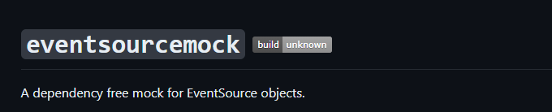

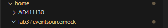

Kod dysponuje otwartą licencją

Event-sourcing to podejście do projektowania aplikacji, w którym dane są przechowywane w formie strumieni zdarzeń, czyli kolekcji niezmienialnych zapisów dotyczących wszystkich operacji na danych. Taki strumień stanowi główną bazę danych dla aplikacji, a każde nowe zdarzenie jest dopisywane na końcu strumienia. Dzięki temu każda zmiana danych jest reprezentowana jako nowe zdarzenie, a dostęp do historii danych pozwala na łatwe analizowanie i wyciąganie wniosków. 

Mocking z kolei to proces używany w testach jednostkowych, kiedy dana jednostka, która aktualnie jest testowana ma zewnętrzne zależności. Celem mockingu jest odizolowanie się i focus na kodzie który jest testowany aktualnie, a nie na stanie dependencji z których korzysta. W takim procesie zewnętrzne dependencje są zastępowane przez wewnętrznie sterowane zamienniki, które symulują zachowanie zależności. 

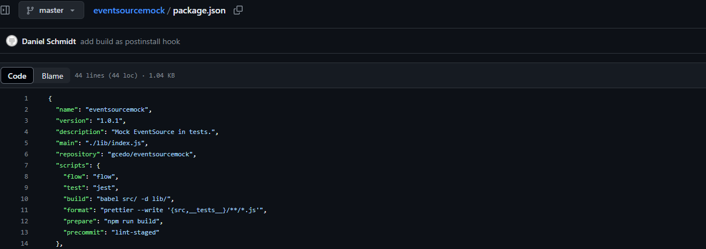

Repozytorium posiada narzędzia/pliki umożliwiające zbudowanie oraz przetestowanie oprogramowania. W pliku 'package.json' znajdują się odpowiednie zmienne oraz zależności potrzebne do zbudowania programu.

Kod w całości napisany jest w JavaScript, zatem skorzystam z obrazu 'node' dla Node.js, czyli środowiska uruchomieniowego dla JavaScript. O tyle jest to wybór racjonalny, że obraz będzie z góry przystosowany do aplikacji JS, będzie posiadać wstępne zależności i prawdopodobnie będzie miał znacznie większy rozmiar niż obraz fedory lub ubuntu. Dzięki temu będzie mniejszy problem z kompatybilnością naszego oprogramowania i mniejsze prawdopodobieństwo, że jakichś zależności będzie brakować. 

## Uruchomienie build i test dla oprogramowania

Zgodnie z celem ćwiczenia należało zbudować i przetestować oprogramowanie według ogólnie obowiązujących wymagań - program powinien posiadać coś na kształt make build oraz make test. Środowisko Makefile miało być dowolne. Program ma też zawierać zdefiniowane i obecne w repozytorium testy, które można uruchomić np. jako jeden z "targetów" Makefile'a. Testy muszą jednoznacznie formułować swój raport końcowy.

Zgodnie z tym skorzystałem ze środowiska "npm". 
NPM - domyślny manager pakietów dla środowiska Node.js. Jest aplikacją wiersza poleceń, za pomocą której można instalować aplikacje dostępne w repozytorium npm. 

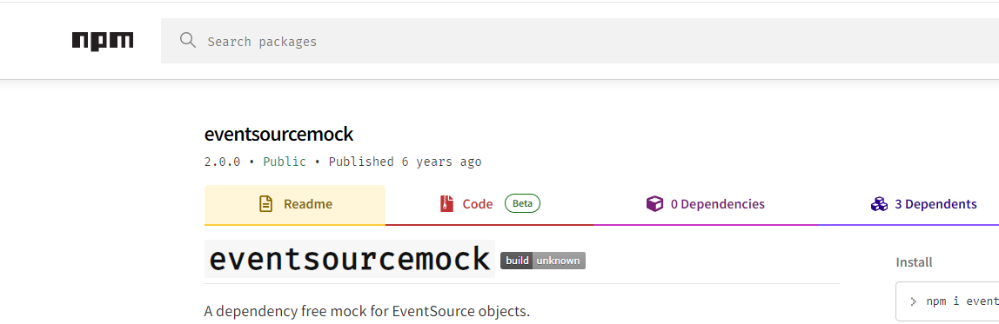

Instalacja npm przez 'sudo apt':

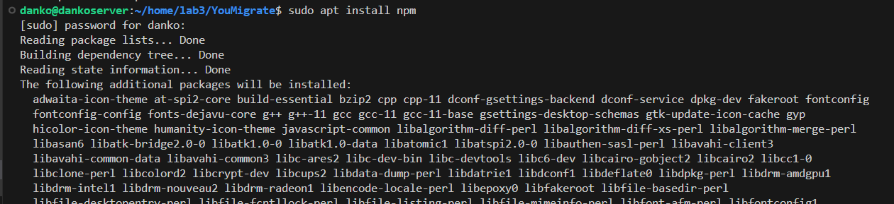

Oprogramowanie zawiera również pliki testujące, które jak widać w pliku package.json są uruchamiane po wpisaniu 'test'. Program odnosi się wtedy do plików '.js' znajdujących się w katalogu '_test_'.

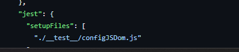

Sklonowałem repozytorium na serwer:

Przechodząc do katalogu z oprogramowaniem zainstalowałem odpowiednie zależności poprzez instrukcję 'npm install'. Taka instrukcja pozwala 'npm' na wyszukanie w katalogu pliku 'package.json', znalezienie w nim konkretnych wersji paczek i zainstalowanie ich. Jest to tak naprawdę równoznaczne z instrukcją 'build', czyli zbudowanie aplikacji poprzez przygotowanie paczek i środowisk potrzebnych do prawidłowego uruchomienia programu.

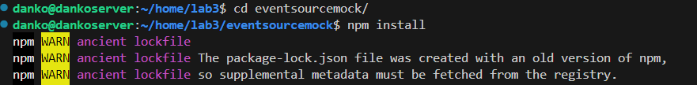

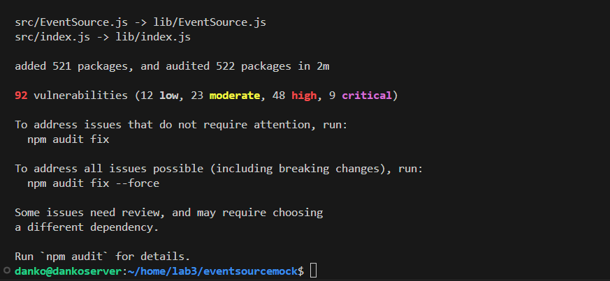

Program napotyka luki w zależnościach. Nie jestem pewien czym może być to spowodowane, ale w pliku 'package.json' znajduje się również instrukcja 'build' osobno jako skrypt. Nie uzyskałem natomiast informacji czym różni się ta instrukcja od zwykłego zainstalwoania dependencji poprzez 'npm install'.
Zakładam, że mogą jednak znajdować się tam pewne dodatkowe zależności, skrypty do uruchomienia, zatem buduję również program za pomocą instrukcji 'npm run build':

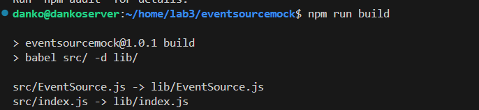

Należy teraz przetestować oprogramowanie. Dosyć prosta czynność, dlatego że znowu wykonujemy skrypt z pliku 'package.json'.

Wszystkie testy przechodzą pozytywnie pomimo luk w budowaniu. 14/14.

W ten sposób zbudowaliśmy i przetestowaliśmy program na serwerze. 

## Uruchomienie kontenera node

Tak jak napisałem wcześniej będziemy korzystać z obrazu 'node'. Nie ma go aktualnie na naszym dockerze, dlatego poprzez instrukcję 'sudo docker run node' pobieramy obraz. 

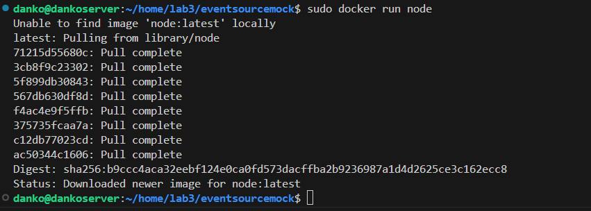

Sprawdzam poprawność instalacji, dlatego wyświetlam dostępne obrazy/repozytoria poprzez instrukcję 'sudo docker images'. Obraz 'node' waży 1.1 GB.
Następnie należało uruchomić kontener bazowy 'node'.

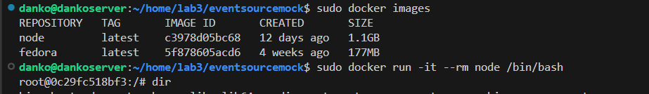

Moduł '-it' pozwala na uruchomienie interaktywnej wersji kontenera. Uruchamiam to także w wersji /bin/bash.

## Zaopatrzenie kontenera w wymagania wstępne 

Wstępnie kontener nie potrzebuje żadnych instalacji. Git jest już zainstalowany. Tak jak NPM.

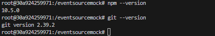

Teraz wystarczy sklonować repozytorium na kontener. 

## Sklonowanie repozytorium do kontenera 

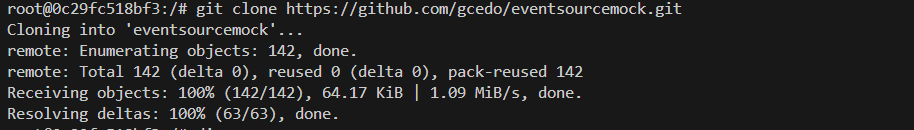

## Uruchomienie build 

Uruchamiam budowanie oprogramowania w dockerze. Okazuje się, że instrukcja 'npm run build' uruchamia się automatycznie podczas instalacji zależności. Mimo tego nadal pojawiają się problemy z lukami w zależnościach. Próbowałem naprawiać to poprzez 'npm audit' natomiast pojawiał się komunikat, że tych zależności nie da się naprawić autoamtycznie. 

Musiałbym albo pobierać ręcznie starsze wersje albo zgłaszać sprawę do supportu jak sugeruje komunikat.
Ta część ćwiczenia jest jedynie w celach poglądowych i automatyzacji więc pozostanę przy takiej wersji jaka jest. 

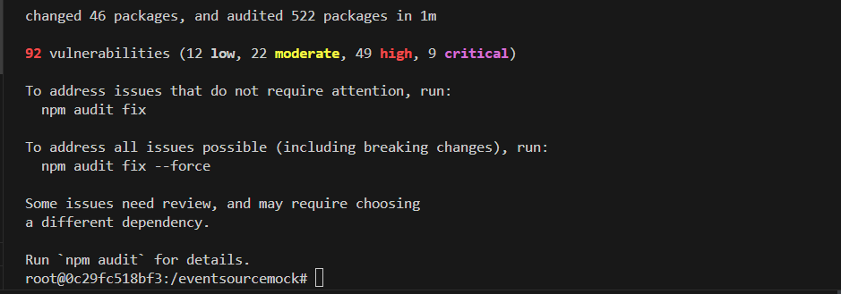

## Uruchomienie testów 

Testy nadal przechodzą pozytywnie. 

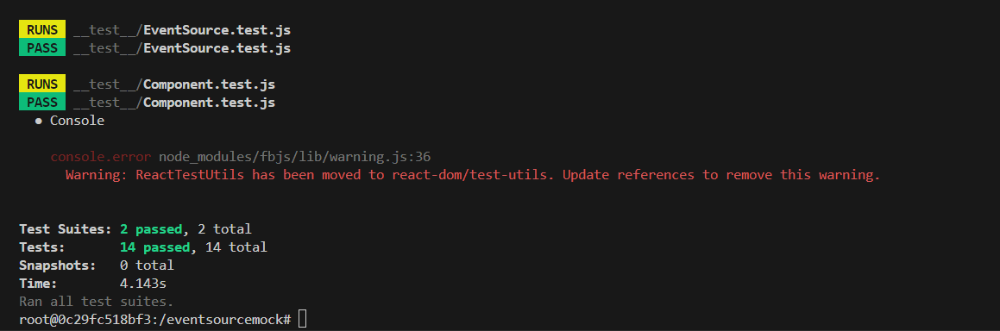

## Stworzenie plików Dockerfile 

W celu automatyzacji procesu budowania i testowania stworzyłem dwa pliki Docker - Dockerfile 

'build.Dockerfile' korzysta z obrazu 'node' i na tej podstawie tworzy kontener, pobiera repozytorium, przechodzi do katalogu projektowego i uruchamia pobieranie/instalowanie zależności. 
Czyli dosłownie automatyzacja czynności które wykonaliśmy chwilę wcześniej.

Celem takiej automatyzacji może być to, żeby z zewnątrz sterować całym procesem budowania aplikacji bez wchodzenia specjalnie w tryb interaktywny. Jest to jednorazowa czynność bazująca na obrazie node.

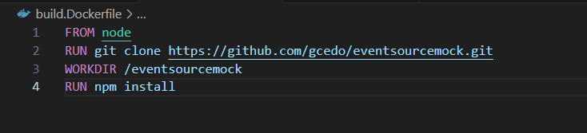

Podobnie tworzę Dockerfile automatyzujący testy. Tym razem bazujemy na obrazie build i przeprowadamy testy. 

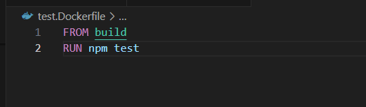

## Wykazanie poprawności działania kontenerów 

Z racji poprzednich problemów teoretycznie nie wychodzi mi budowanie programu. Tak naprawdę 'npm install' się nie kończy. 

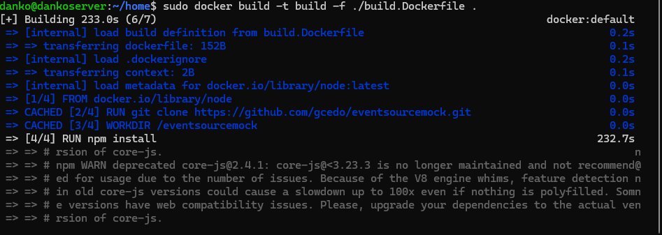

Okazało się że jest na to jeden sposób i to dość prosty. Wystarczyło do 'npm install' dorzucić jego update.

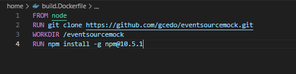

Po aktualizacji Dockerfile buduję program jeszcze raz: 

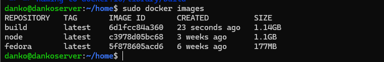

Udało się tym samym poprawnie zbudować program poprzez Dockerfile z zewnątrz. 

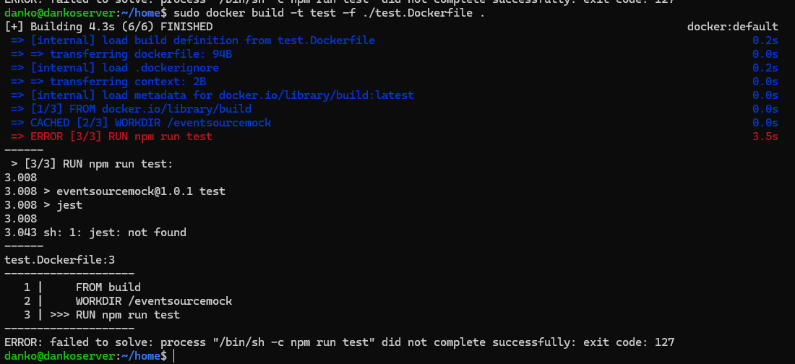

Nie udało mi się natomiast poprawnie przeprowadzić testów. Z pewnego powodu nie czyta "jest" który uruchamia się na komendę "npm test". Do tej pory nie potrafiłem wskazać gdzie leży błąd. 

---

---

## 

sudo docker volume create input_vol
sudo docker volume create output_vol

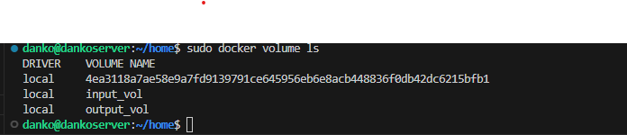

##

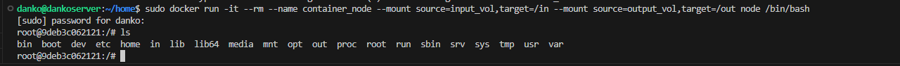

##

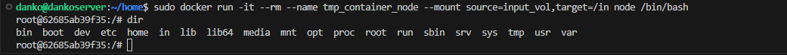

##

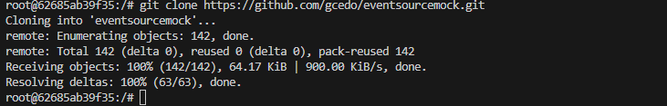

##

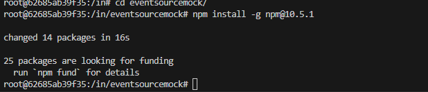

##

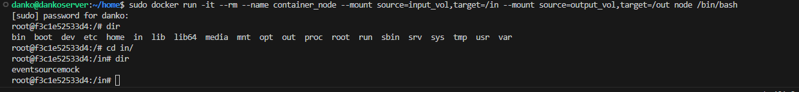

##

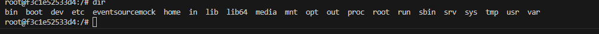

##

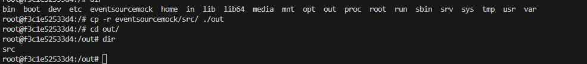

##

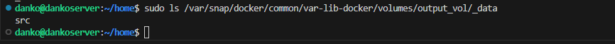

##

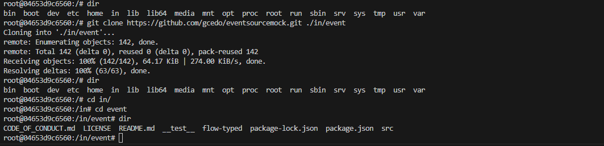

##

##

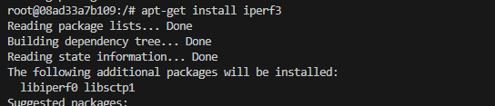

##

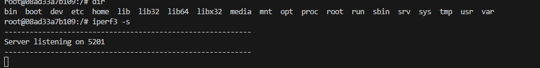

##

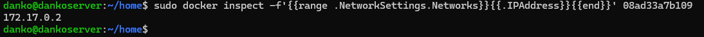

##

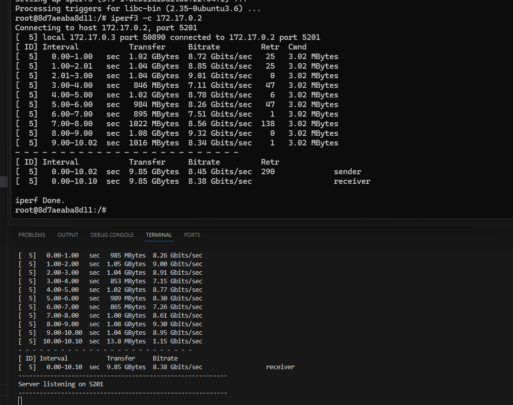

##

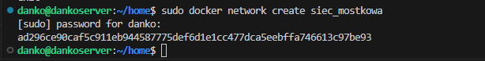

##

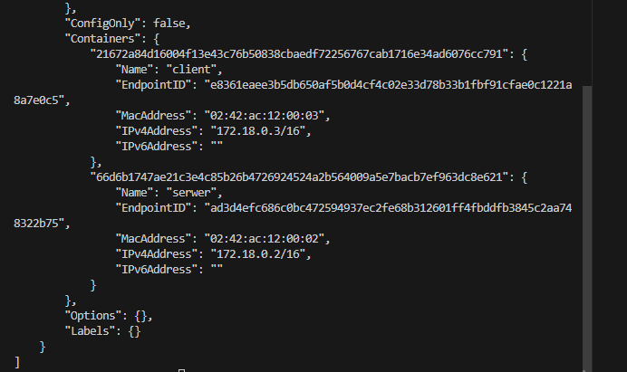

##

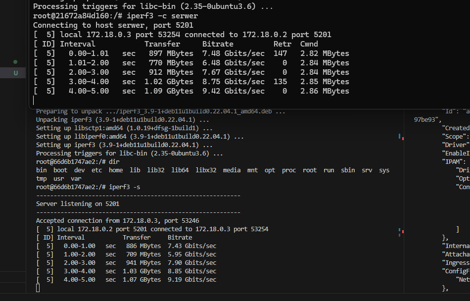

##

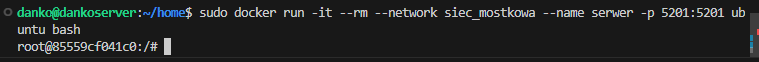

##

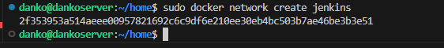

##

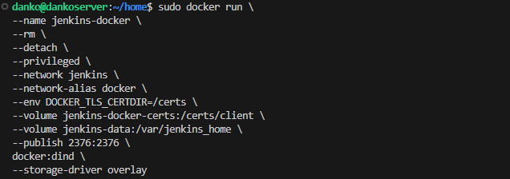

##

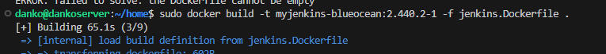

##

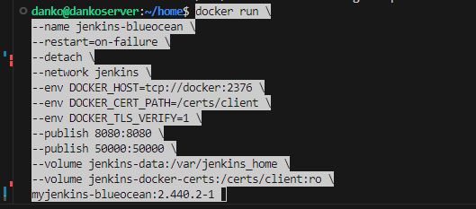

##

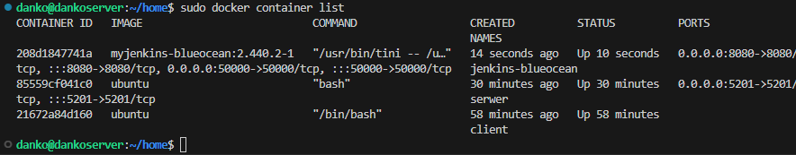

##

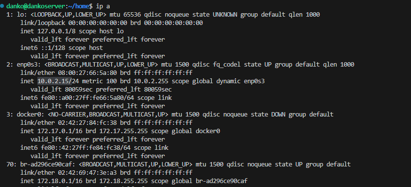

##

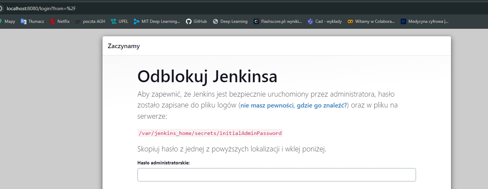
