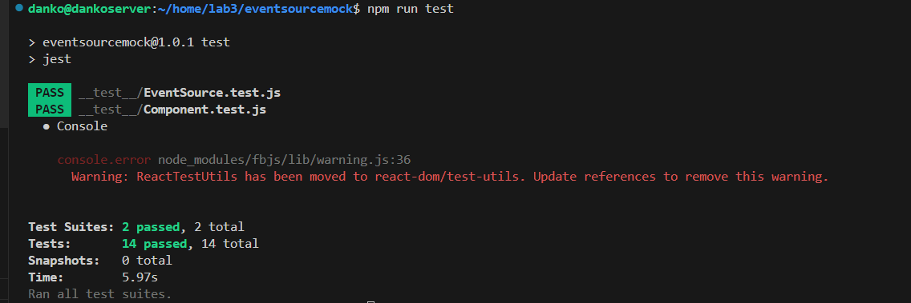

# Sprawozdanie nr 2
---
## Cel ćwiczenia:
 ## Celem ćwiczenia było przeprowadzenie kompleksowego procesu przygotowania repozytorium z kodem oprogramowania oraz uruchomienie budowy i testów tego oprogramowania w kontenerze Docker. Dodatkowo, zadaniem było  zaznajomienie się z wykorzystaniem woluminów oraz eksponowanie portów w kontenerach Docker. W ramach ćwiczenia również eksplorowano narzędzie Jenkins do automatyzacji procesów związanych z tworzeniem oprogramowania.

---

## Streszczenie laboratorium:

###  Repozytorium zostało przygotowane z odpowiednimi plikami umożliwiającymi budowę i testowanie oprogramowania. W trakcie budowania wykorzystano narzędzie npm, a także obraz 'node' dla Node.js w kontenerze Docker. Testy przeprowadzono zgodnie z instrukcjami zawartymi w pliku 'package.json'. Po udanym przetestowaniu oprogramowania, przechodzono do uruchomienia kontenera node oraz zaopatrzenia go w wymagania wstępne. W trakcie tego procesu napotkano pewne problemy z zależnościami, które wymagały ręcznej aktualizacji. 

### Następnie przystąpiono do pracy z woluminami, podłączając je do kontenerów i przekazując między nimi dane. Utworzono również własną sieć mostkową dla kontenerów. Eksponowano porty dla serwera iperf, umożliwiając badanie przepustowości łącza. Ostatnim etapem było przygotowanie Jenkinsa do automatyzacji procesów związanych z tworzeniem oprogramowania, gdzie również uruchomiono serwer Jenkinsa i przeprowadzono jego konfigurację.

---
## Przygotowanie repozytorium z kodem oprogramowania 

Jako repozytorium którego będę używać podczas zajęć do budowania i testowania wybrałem 'eventsourcemock' - oprogramowanie wspomagające pracę z Event Sources.

Kod dysponuje otwartą licencją

Event-sourcing to podejście do projektowania aplikacji, w którym dane są przechowywane w formie strumieni zdarzeń, czyli kolekcji niezmienialnych zapisów dotyczących wszystkich operacji na danych. Taki strumień stanowi główną bazę danych dla aplikacji, a każde nowe zdarzenie jest dopisywane na końcu strumienia. Dzięki temu każda zmiana danych jest reprezentowana jako nowe zdarzenie, a dostęp do historii danych pozwala na łatwe analizowanie i wyciąganie wniosków. 

Mocking z kolei to proces używany w testach jednostkowych, kiedy dana jednostka, która aktualnie jest testowana ma zewnętrzne zależności. Celem mockingu jest odizolowanie się i focus na kodzie który jest testowany aktualnie, a nie na stanie dependencji z których korzysta. W takim procesie zewnętrzne dependencje są zastępowane przez wewnętrznie sterowane zamienniki, które symulują zachowanie zależności. 

Repozytorium posiada narzędzia/pliki umożliwiające zbudowanie oraz przetestowanie oprogramowania. W pliku 'package.json' znajdują się odpowiednie zmienne oraz zależności potrzebne do zbudowania programu.

Kod w całości napisany jest w JavaScript, zatem skorzystam z obrazu 'node' dla Node.js, czyli środowiska uruchomieniowego dla JavaScript. O tyle jest to wybór racjonalny, że obraz będzie z góry przystosowany do aplikacji JS, będzie posiadać wstępne zależności i prawdopodobnie będzie miał znacznie większy rozmiar niż obraz fedory lub ubuntu. Dzięki temu będzie mniejszy problem z kompatybilnością naszego oprogramowania i mniejsze prawdopodobieństwo, że jakichś zależności będzie brakować. 

## Uruchomienie build i test dla oprogramowania

Zgodnie z celem ćwiczenia należało zbudować i przetestować oprogramowanie według ogólnie obowiązujących wymagań - program powinien posiadać coś na kształt make build oraz make test. Środowisko Makefile miało być dowolne. Program ma też zawierać zdefiniowane i obecne w repozytorium testy, które można uruchomić np. jako jeden z "targetów" Makefile'a. Testy muszą jednoznacznie formułować swój raport końcowy.

Zgodnie z tym skorzystałem ze środowiska "npm". 
NPM - domyślny manager pakietów dla środowiska Node.js. Jest aplikacją wiersza poleceń, za pomocą której można instalować aplikacje dostępne w repozytorium npm. 

Instalacja npm przez 'sudo apt':

Oprogramowanie zawiera również pliki testujące, które jak widać w pliku package.json są uruchamiane po wpisaniu 'test'. Program odnosi się wtedy do plików '.js' znajdujących się w katalogu '_test_'.

Sklonowałem repozytorium na serwer:

Przechodząc do katalogu z oprogramowaniem zainstalowałem odpowiednie zależności poprzez instrukcję 'npm install'. Taka instrukcja pozwala 'npm' na wyszukanie w katalogu pliku 'package.json', znalezienie w nim konkretnych wersji paczek i zainstalowanie ich. Jest to tak naprawdę równoznaczne z instrukcją 'build', czyli zbudowanie aplikacji poprzez przygotowanie paczek i środowisk potrzebnych do prawidłowego uruchomienia programu.

Program napotyka luki w zależnościach. Nie jestem pewien czym może być to spowodowane, ale w pliku 'package.json' znajduje się również instrukcja 'build' osobno jako skrypt. Nie uzyskałem natomiast informacji czym różni się ta instrukcja od zwykłego zainstalwoania dependencji poprzez 'npm install'.
Zakładam, że mogą jednak znajdować się tam pewne dodatkowe zależności, skrypty do uruchomienia, zatem buduję również program za pomocą instrukcji 'npm run build':

Należy teraz przetestować oprogramowanie. Dosyć prosta czynność, dlatego że znowu wykonujemy skrypt z pliku 'package.json'.

Wszystkie testy przechodzą pozytywnie pomimo luk w budowaniu. 14/14.

W ten sposób zbudowaliśmy i przetestowaliśmy program na serwerze. 

## Uruchomienie kontenera node

Tak jak napisałem wcześniej będziemy korzystać z obrazu 'node'. Nie ma go aktualnie na naszym dockerze, dlatego poprzez instrukcję 'sudo docker run node' pobieramy obraz. 

Sprawdzam poprawność instalacji, dlatego wyświetlam dostępne obrazy/repozytoria poprzez instrukcję 'sudo docker images'. Obraz 'node' waży 1.1 GB.
Następnie należało uruchomić kontener bazowy 'node'.

Moduł '-it' pozwala na uruchomienie interaktywnej wersji kontenera. Uruchamiam to także w wersji /bin/bash.

## Zaopatrzenie kontenera w wymagania wstępne 

Wstępnie kontener nie potrzebuje żadnych instalacji. Git jest już zainstalowany. Tak jak NPM.

Teraz wystarczy sklonować repozytorium na kontener. 

## Sklonowanie repozytorium do kontenera 

## Uruchomienie build 

Uruchamiam budowanie oprogramowania w dockerze. Okazuje się, że instrukcja 'npm run build' uruchamia się automatycznie podczas instalacji zależności. Mimo tego nadal pojawiają się problemy z lukami w zależnościach. Próbowałem naprawiać to poprzez 'npm audit' natomiast pojawiał się komunikat, że tych zależności nie da się naprawić autoamtycznie. 

Musiałbym albo pobierać ręcznie starsze wersje albo zgłaszać sprawę do supportu jak sugeruje komunikat.
Ta część ćwiczenia jest jedynie w celach poglądowych i automatyzacji więc pozostanę przy takiej wersji jaka jest. 

## Uruchomienie testów 

Testy nadal przechodzą pozytywnie. 

## Stworzenie plików Dockerfile 

W celu automatyzacji procesu budowania i testowania stworzyłem dwa pliki Docker - Dockerfile 

'build.Dockerfile' korzysta z obrazu 'node' i na tej podstawie tworzy kontener, pobiera repozytorium, przechodzi do katalogu projektowego i uruchamia pobieranie/instalowanie zależności. 
Czyli dosłownie automatyzacja czynności które wykonaliśmy chwilę wcześniej.

Celem takiej automatyzacji może być to, żeby z zewnątrz sterować całym procesem budowania aplikacji bez wchodzenia specjalnie w tryb interaktywny. Jest to jednorazowa czynność bazująca na obrazie node.

Podobnie tworzę Dockerfile automatyzujący testy. Tym razem bazujemy na obrazie build i przeprowadamy testy. 

## Wykazanie poprawności działania kontenerów 

Z racji poprzednich problemów teoretycznie nie wychodzi mi budowanie programu. Tak naprawdę 'npm install' się nie kończy. 

Okazało się że jest na to jeden sposób i to dość prosty. Wystarczyło do 'npm install' dorzucić jego update.

Po aktualizacji Dockerfile buduję program jeszcze raz: 

Udało się tym samym poprawnie zbudować program poprzez Dockerfile z zewnątrz. 

Nie udało mi się natomiast poprawnie przeprowadzić testów. Z pewnego powodu nie czyta "jest" który uruchamia się na komendę "npm test". Do tej pory nie potrafiłem wskazać gdzie leży błąd. 

---

---

## Przygotowanie woluminów

Rozpoczynamy pracę z woluminami. Wolumin to instancja, która pozwala na przechowywanie zasobów niezależnie od czasu życia kontenera. Ułatwia komunikację pomiędzy nimi, ponieważ każdy kontener który będzie miał przypisany ten sam wolumin będzie miał również te same dane.

Żeby jasno zrozumieć przepływ pomiędzy woluminami a kontenerami tworzymy dwa woluminy - wejściowy i wyjściowy.

sudo docker volume create input_vol

sudo docker volume create output_vol

A następnie sprawdzamy poprawność ich utworzenia:

## Podłączenie do kontenera bazowego

Pierwsze użycie woluminów rozpoczynamy od kontenera bazowego z wcześniejszego ćwiczenia, czyli 'node'. Wykażemy że woluminy rzeczywiście potrafią przekazywać niejako informacje i zapisywać je.

Uruchamiam kontener z flagą --mount, która oznacza właśnie dołączanie woluminów, określając ich źródło oraz miejsce docelowe, czyli (source,target):

source - nazwa woluminu

target - miejsce docelowe 

Ostateczna komenda którą uruchomiłem aby zmapować woluminy do kontenera bazowego 'node':

## Kontener tymczasowy - sklonowanie na wolumin wejściowy, uruchomienie build

I teraz dochodzimy do głównego celu posługiwania się woluminami. Powstaje pytanie.

Co należy zrobić żeby nie mając zainstalowanego git'a na kontenerze posiadać w jego środku repozytorium z git'a?

Z pomocą przychodzi nam kontener tymczasowy. Czyli tworzymy drugi kontener w którym będzie zainstalowany git oraz ściągniemy tam repozytorium. Następnie zbudujemy oprogramowanie na woluminie wejściowym.

Uruchamiamy kontener i dołączamy tak jak w poprzednim przypadku wolumin wejściowy, przez którego dwa kontenery będą się komunikować.

Klonujemy repozytorium do konteneraz GitHuba. Możemy to zrobić ponieważ w tym kontenerze możęmy posługiwać się Gitem.

Nie widzę przeszkód żeby wykonać budowanie na 2 sposoby. Mianowicie jedna opcja to taka, żeby zbudować program jeszcze na kontenerze tymczasowym, a druga żeby zrobić to już na tym pierwszym kontenerze. Być może druga opcja ma większy sens, dlatego że budowanie na kontenerze docelowym byłoby bardziej racjonalne, chociaż spróbuję skorzystać tutaj z tego pierwszego sposobu.

## Kontener docelowy - zapis do wolumina wyjściowego i na zewnątrz

Teraz przenosimy się na pierwszy kontener i sprawdzamy czy znajduje się tam nasze repozytorium.

Wszystko jest w porządku. Na woluminie wejściowym jest zapisane repo. 

Przenosimy repozytorium do środka kontenera.

A następnie kopiujemy zmiany które zaszły do wolumina wyjściowego. W tym przypadku raczej jest to folder 'node_modules', ale pozwolę sobie przesłać cały katalog 'src'. 

Należy również wykazać, że to, co przesłaliśmy na wolumin wyjściowy znajduje się poza kontenerem. Należało dostać się do plików globalnych gdzie te woluminy się znajdują.

Widzimy, że wewnątrz woluminu wyjściowego znajduje się nasz katalog src.

## Klonowanie bezpośrednie do woluminu wejściowego

Aby sklonować z wewnątrz kontenera repozytorium do woluminu wejściowgo bezpośrednio należało po prostu sklonować repo z zaznaczeniem katalogu. Dodałem dodatkowo podfolder, do odosobnienia nowgo repozytorium. 

## Dockerfile do wykonywania powyższych kroków 

Należało stworzyć Dockerfile do wyżej wymienionych kroków. Automatyzacja takich procesów polega najprościej mówiąc na tym, żeby powtórzyć wszystkie kroki jeszcze raz, ale w jednym pliku i z zachowaniem poprawności lokalizacji i uruchomień. 

W tym celu zbudowałem Dockerfile, utworzyłem podfoldery input i output, a następnie posługując się flagą RUN --mount zmapowałem woluminy do podfolderów wcześniej utworzonych. 

Przenosząc się do woluminu wejściowego sklonowałem repozytorium i zbudowałem tam program.

Jest to niejako podsumowanie wcześniejszych akapitów. 

## Eksponowanie portu

Iperf to narzędzie do pomiaru wydajności łącza zazwyczaj wewnątrz sieci LAN i przepustowości TCP oraz UDP. Funkcjonuje w środowisku systemów operacyjnych Microsoft Windows oraz Linux.

My będziemy badać ruch pomiędzy klientem a serwerem na naszych kontenerach. 

W tym celu uruchamiam ubuntu.

Aktualizuję apt-get a następnie instaluję iperf3

Uruchamiam serwer insturkcją 'iperf3 -s'.

Widzimy komunikat że serwer nasłuchuje na porcie 5201.

Teraz naszym zadaniem jest połączenie się do serwera klientem z innego terminala tak, żeby uruchomić ruch pomiędzy nimi. 

Aby połączyć się z serwerem konieczna jest informacja jak nazywa się serwer bądź jaki ma adres. Na ten moment przypatrzmy się jak sprawdzić adres serwera. 

Aby to zrobić należy uruchomić dedykowaną komendę 'inspect' z parametrami jak poniżej. Należy również dołączyć identyfikator kontenera, aby docker wiedziałem o jaki serwer nam chodzi do któego chcemy się połączyć. 

Teraz uruchamiamy inny kontener , tworzymy klienta do serwera o powyższym adresie. 

Widzimy ruch pomiędzy serwerem a klientem, wymianę danych, prędkość transferu oraz przedziały czasowe.

Kolejnym naszym zadaniem było utworzenie własnej sieci mostkowej. Tworzenie sieci następuje za pomocą isntrukcji 'docker network create'. Przy okazji od razu widzimy identyfikator.

Teraz tworzymy kontener serwera i klienta na podstawie naszego własnego połączenia sieciowego: 

docker run -it --rm --name server --network siec_mostkowa ubuntu bash

docker run -it --rm --name client --network siec_mostkowa ubuntu bash

Widzimy również klienta i serwer połączonych do sieci mostkowej przy użyciu polecenia 'inspect'.

Wykazuję również ruch pomiędzy instancjami.

Spróbowałem również połączyć się poza kontenerem ale mam informacji na temat tego jak powinno się to zrobić poprawnie. Serwer się uruchamia ale nie ma tego później dostępnego w połączeniu sieciowym.

## Jenkins

Jenkins – serwer typu open source służący do automatyzacji związanej z tworzeniem oprogramowania. W szczególności ułatwia budowanie, testowanie i wdrażanie aplikacji, czyli umożliwia rozwój oprogramowania w trybie ciągłej integracji i ciągłego dostarczania. 

Tworzymy sieć Jenkins:

Następnie zgodnie z dokumentacją uzupełniamy uruchomienie z konkretnymi parametrami a natępnie Dockerfile również zgodnie z dokumentacją. 

Budowanie Jenkins:

Udowadniam że kontener się uruchomił i jest w użyciu na podstawie statusu:

Sprawdzam adres wirtualnej maszyny co będzie mi potrzebne do utworzenia dedykowanego portu w VM dla Jenkins. 

Udało się połączyć w przeglądarce z Jenkins:

