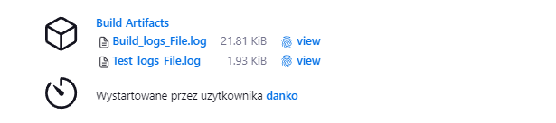

# Sprawozdanie nr 3
---
## Cel ćwiczenia:
 ## Celem ćwiczenia było przeprowadzenie procesu automatyzacji związanego z tworzeniem, testowaniem i wdrażaniem oprogramowania przy użyciu narzędzia Jenkins oraz kontenerów Docker. Ćwiczenie miało na celu zapoznanie się z konfiguracją Jenkinsa, tworzeniem i zarządzaniem kontenerami Docker oraz implementacją pełnego procesu CI/CD (Continuous Integration/Continuous Deployment) przy użyciu pipeline'ów.

---

## Streszczenie laboratorium:

###  Laboratorium rozpoczęło się od konfiguracji serwera Jenkinsa oraz tworzenia sieci kontenerów Docker, co umożliwiło automatyzację procesów związanych z tworzeniem, testowaniem i wdrażaniem oprogramowania. Następnie zgodnie z dokumentacją, skonfigurowano uruchomienie kontenera Jenkinsa oraz stworzono Dockerfile zgodnie z wymaganiami.

Po udanym zbudowaniu Jenkinsa, przystąpiono do konfiguracji jego wstępnych ustawień oraz uruchomienia przykładowych projektów. Pierwszy projekt polegał na wyświetleniu informacji o systemie poprzez wykonanie polecenia "uname -a", natomiast drugi projekt miał zwracać błąd w przypadku, gdy godzina jest nieparzysta. Oba projekty zostały wykonane zgodnie z oczekiwaniami.

Następnie przystąpiono do rozwiązania problemów związanych z uruchomieniem testów wewnątrz kontenera Docker. Zidentyfikowano, że komenda "npm test" nie może odnaleźć zależności "jest", co wymagało modyfikacji procesu budowania. Po naprawieniu tego problemu oraz rozszerzeniu miejsca na partycji, udoskonalono proces budowania i testowania poprzez utworzenie pełnego pipeline'a, który obejmował etapy: clone, build, test, logs, deploy oraz publish.

W ramach procesu deployowania, przygotowano środowisko, sklonowano repozytorium, zbudowano obraz dockerowy, przeprowadzono testy, zarchiwizowano pliki dzienników, uruchomiono kontener z przetestowaną aplikacją oraz opublikowano przetestowany obraz na DockerHubie.

---

## Jenkins

Jenkins – serwer typu open source służący do automatyzacji związanej z tworzeniem oprogramowania. W szczególności ułatwia budowanie, testowanie i wdrażanie aplikacji, czyli umożliwia rozwój oprogramowania w trybie ciągłej integracji i ciągłego dostarczania. 

Tworzymy sieć Jenkins:

Następnie zgodnie z dokumentacją uzupełniamy uruchomienie z konkretnymi parametrami a natępnie Dockerfile również zgodnie z dokumentacją. 

Budowanie Jenkins:

Udowadniam że kontener się uruchomił i jest w użyciu na podstawie statusu:

Sprawdzam adres wirtualnej maszyny co będzie mi potrzebne do utworzenia dedykowanego portu w VM dla Jenkins. 

Udało się połączyć w przeglądarce z Jenkins:

Panel główny Jenkins uruchomiony z adresu: localhost:8080:

W ramach wstępnej konfiguracji Jenkinsa spróbuję uruchomić zgodnie z poleceniem dwa przykładowe projekty:

- projekt, który wyświetla uname
- projekt, który zwraca błąd, gdy... godzina jest nieparzysta

Według interfejsu Jenkinsa wystarczy utworzyć projekt tak, jak wskazuje to panel w lewym rogu. Ja dla przykładu i praktyki stworzyłem jednoscenowy pipeline który wykonuje docelowe polecenie/funkcję.

W pierwszym przypadku scena o nazwie 'Display OS Name'  wywołuje polecenie 'uname -a'. która wyświetla informacje o systemie - jego pełną nazwę.

Po wykonaniu widzimy, że pole wyświetlające uruchamianie programu jest zielone, co oznacza że obyło się bez żadnych kodów błędu. Program uruchomił się poprawnie i zakończył po niecałej sekundzie.

Obserwując Logi jakie zwraca pierwszy program widzimy informacje szcegółowe o wersji Linux na Ubuntu.

Kolejnym miniprojektem jaki należało wykonać było zwrócenie informacje, czy godzina jest parzysta, czy nieparzysta. W momencie, kiedy jest nieparzysta ma zwracać błąd a zarazem okienko z uruchamianiem programu ma zaświecić się na czerwono. 

Na początku program definiuje obecną godzinę jako liczbę całkowitą Integer. Jeżeli liczba spełnia warunek parzystości to program zwraca pozytywną wiadomosc, a w przeciwnym wypadku zwraca błąd.

Zgodnie z tym co zostało zaimplementowane osiągnięto oczekiwane wyniki. Dla godzin nieparzystych zwrócono błąd co widać na załączonym obrazku:

Konsola wyjściowa dla drugiego miniprojektu:

---
Tym samym wykazałem że Jenkins działa poprawnie, utworzone kontenery się uruchomiły we właściwy sposób, sprawdziłem czy działa wyświetlanie konsoli wyjściowej oraz logów .

---

## Pipeline Build -> Test

Problem z jakim borykałem się jeszcze na poprzednich laboratoriach było to, że wewnątrz kontenera nie byłem w stanie poprawnie uruchomić testów. Komenda 'npm test' próbowała się dostać do 'jest' którego tak naprawdę nie było. Nie dało się tego odczytać. Próbowałem również używać pełnej ścieżki do 'package.json' natomiast npm nie był w stanie odczytać poprawnie tej ścieżki, co było dość zaskakujące. 

W takim wypadku postanowiłem zmodyfikować lekko kod budowania (Dockerfile) i testowania. Na początku spróbowałem do pliku 'test.Dockerfile' dorzucić instalację 'jest' poprzez 'npm'.To z kolei nie przechodziło z racji tego że instalacja 'jest' wymagała zasobów pochodzących od zasobów których jak sie okazało NIE POSIADAM. 

Zatem jest to jasna wiadomość, że trzeba powrócic do builda i COŚ poprawić.

Okazuje się, że 'npm install' w konkretnej wersji npm nie buduje wszystkich zależnośći i muszę skorzystać z 'npm run build' co tak samo muszę poprzedzić instalacją 'babel client' który mi pozwoli ten build wykonać. 

Kolejny problem z jakim się napotkałem to zbyt mała ilość miejsca na partycji. Okazuje się, że domyślnie spośród całości przydzielonego dysku do użytku przydzielona jest tylko połowa, co widać poniżej:

Przez to skończyło mi się miejsce na wykonywanie projektów. Musiałem przejść do procesu rozszerzenia miejsca.

Według znalezionego poradnika należało użyć poniższych komend aby pozwolić na użycie 100% zasobów dysku przydzielonego dla Ubuntu. 

Oprócz rozszerzenia pamięci należało także przydzielić tą pamięć do partycji i tak jak widać na poniższym obrazku udało to się zrobic i teraz mamy 16GB wolnego miejsca czyli tyle ile wcześniej nie byliśmy w stanie wykorzystać. 

Poniżej znajduje się wkonany przeze mnie pipeline definiujący wykonanie etapów clone, build oraz clone. 

Etap 'clone' jest wygenerowany przez odpowiedni skrypt w Jenkins, definiuje przejście na osobistą gałąź, sklonowanie repozytorium. 
Kolejnym etapem jest wykonanie budowania obrazu. Dodaję tu odpowiedni tag obrazu w celu poprawnego rozróżenia. Wskazuję także odpowiednią ścieżkę do buildera.
Podobnie sprawa wygląda z testowaniem programu.

Wszystkie pliku Dockerfile są dołączone do sprawozdania nr 3. 

Poprawne uruchomienie buildera.

Poprawne uruchomienie testera.

Stage View dla pipeline związanego z powyższym etapem. 

W finalnej części projektu należało utworzyć pełny pipeline zaczynając od przygotowania i zbudowania programu, a kończąc na opublikowaniu paczki/artefaktów gotowych do pobrania. 

Z racji tego, że dokonywałem kilku zmian/ doinstalowywałem w builderze paczki, zdecydowałem się na stworzenie własnego forka programu na Github.

## Pipeline

Zdecydowałem, że najwygodniejszą dla mnie formą przeprowadzenia publikacji będzie Dockerhub. Utworzę także artefakty związane z plikami logowymi. Będą to pliki build oraz test, dlatego że główną funkcjonalnością w repozytorium jest funkcja 'jest', która uruchamia się podczas testów. Publikuję na Dockerhub obraz utworzony przeze mnie po uruchomieniu kontenera. 

## Diagram aktywności

## Environment

Należało utworzyć Credentials w Jenkins, które posłużą nam jako zmienne globalne za pomocą których będzie można połączyć się do Dockerhub. 

Również z perspektywy Dockerhub należało wygenerować tokeny pozwalające nam na łączenie się do tego środowiska za pomocą loginu i hasła. 

Należało się dostać do globalnych Credentials, co widać poniżej.

## Preparation

W tym etapie, wykonuję przygotowanie środowiska przed rozpoczęciem procesu budowy i testowania. 
Najpierw usuwam poprzednią wersję projektu MDO2024_INO, aby mieć pewność, że pracuję na czystym środowisku. 

Następnie używam polecenia docker system prune --all --force, aby wyczyścić wszystkie niepotrzebne zasoby Docker, takie jak nieużywane obrazy, kontenery czy sieci. To zapewnia, że zaczynamy proces z pustym stanem, co może pomóc uniknąć potencjalnych problemów związanych z nadpisywaniem bądź odczytywaniem nieprawidłowych plików.

## Clone

W tym etapie pobieram najnowszą wersję kodu źródłowego z repozytorium GitHuba. Korzystam z polecenia git clone, aby sklonować repozytorium, które zawiera kod projektu MDO2024_INO. Pobieram oczywiście mój fork, który wcześniej wykonałem.

Następnie przechodzę do katalogu projektu i wykonuję checkout na określoną gałąź kodu za pomocą polecenia git checkout AD411130. To zapewnia, że pracujemy na najnowszej wersji kodu, która jest dostępna w repozytorium.

## Build

W tym etapie budujemy obraz dockerowy naszej aplikacji. Przechodząc do katalogu projektu, używam polecenia docker build z odpowiednim plikiem Dockerfile, aby zbudować obraz o nazwie node-build2:latest.

Logi z tego procesu zapisywane są do pliku Build_logs_File.log. Używam Docker'a do budowy obrazu, ponieważ jest to standardowy sposób pakowania i dystrybucji aplikacji, który zapewnia izolację i powtarzalność środowiska.

## Test

W tym etapie przeprowadzamy testy naszej aplikacji. Podobnie jak w przypadku budowania, przechodzę do katalogu projektu i używam polecenia docker build, tym razem z plikiem Dockerfile przeznaczonym do testowania.

Obraz ten nie korzysta z pamięci podręcznej (cache), co zapewnia, że każde uruchomienie testów odbywa się na czystym środowisku. Logi z tego procesu również zapisywane są do pliku Test_logs_File.log.

## Log files

Ten etap służy do przygotowania plików dzienników, które będą przechowywać logi z procesów budowania i testowania. 
Tworzę dwa pliki: Build_logs_File.log i Test_logs_File.log.

## Deploy

W tym etapie archiwizujemy pliki dzienników z procesów budowania i testowania, aby móc je przejrzeć w przyszłości w razie potrzeby. Następnie uruchamiamy kontener dockerowy z obrazem node_test_esm:latest, który zawiera naszą przetestowaną aplikację. 

Możemy chcieć zachować te logi dla celów audytowych lub do analizy w przypadku wystąpienia błędów w procesie deployowania.

## Publish 

W ostatnim etapie publikujemy nasz przetestowany obraz na DockerHubie. Najpierw logujemy się do DockerHuba, korzystając z dostarczonych poświadczeń. Następnie tagujemy nasz obraz nową nazwą dankoo4/albert_image i publikujemy go na DockerHubie za pomocą polecenia docker push. Dodatkowo, tworzymy plik archiwum albert_image.tar.gz, który zawiera nasz obraz dockerowy, aby można go było łatwo pobrać i uruchomić w innym środowisku. Archiwizujemy ten plik, aby zachować kopię naszego obrazu w przypadku potrzeby jego przywrócenia lub replikacji.

Poprzez użycie DockerHuba możemy łatwo udostępniać nasze obrazy dockerowe innym członkom zespołu lub użytkownikom spoza zespołu. Jest to również wygodny sposób dystrybucji oprogramowania, ponieważ DockerHub zapewnia publiczne repozytoria obrazów, które można łatwo udostępniać i zarządzać.

Udało się uzyskać pozytywne wyniki z pipeline.

Na początku dostawałem puste pliki logów, co stanowi problem.

Udało się naprawić powyższy problem poprzez dodanie 2>&1 do zapisu logów, natomiast przy każdym kolejnym uruchomeniu pipeline nie udawało się pobierać paczki tar.gz z Dockerhub. Pojawiał się problem którego nie potrafiłem do tej pory zidentyfikować.  

Opublikowany obraz na Dockerhub:

Moje osiągnięte wyniki w pełni zgadzają się schematem z tym co zawarłem w diagramie aktywności

