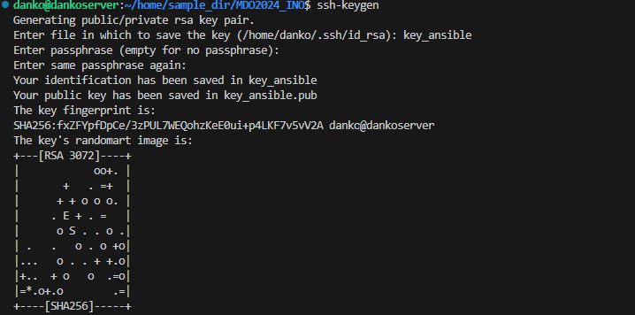
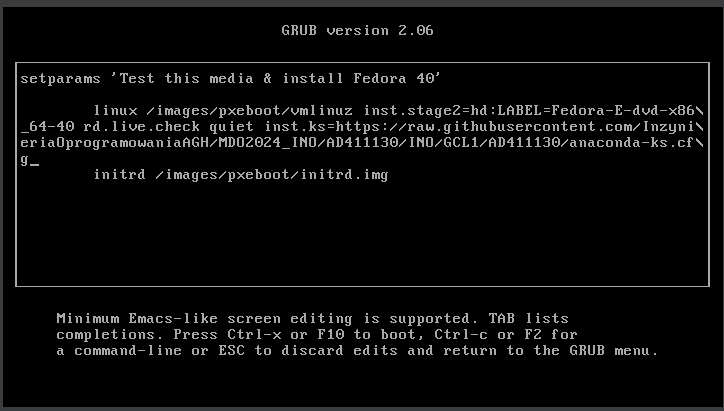

# Sprawozdanie nr 3
---
## Cel ćwiczenia:
 ## Celem ćwiczenia było 

---

## Streszczenie laboratorium:

###  Laboratorium 

---

## Instalacja zarządcy Ansible 

Należało zbudować pewien schemat zarządcy i zarządzającego Ansible tak, aby dokonywać swobodnych wymian plików pomiędzy maszynami. 
Zbudowałem zatem drugą maszynę wirtualną o nazwie Ansible o jak najmniejszym zbiorze zainstalowanego oprogramowania.

Zgodnie z instrukcją jaka była zawarta do laboratorium zapewniłem obecność tar oraz serwera OpenSSH jeszcze podczas instalacji systemu lub też w trakcie działania (część potrzebnych bibliotek była już załączona do systemu domyślnie).

Obecność programu 'tar':

Należało jasno zdefiniować hostname nowej maszyny tak, aby można było później swobodnie się do niej łączyć właśnie za pomocą tej nazwy. Trzeba ją będzie później połączyć z adresem IP tak, żeby hostname był rozpoznawany i równoznaczny z tym adresem IP.

Utworzyłem także użytkownika ansible tak jak widać zresztą powyżej.
Zgodnie z instrukcją zainstalowałem oprogramowanie Ansible na głównej maszynie według poniższych kolejno wymienionych poleceń.

### Czym jest Ansible?

Ansible – otwarte oprogramowanie służące do automatyzacji wdrażania, konfiguracji i zarządzania. Działa na systemach operacyjnych z rodziny Unix (w tym – uniksopodobnych), ale może być wykorzystywane zarówno na systemach z rodziny Unix jak i Microsoft Windows. - definicja z Wikipedii

Należało wykonać poniższe instrukcje w celu instalacji Ansible. Ponadto kierując się sugestiami z terminala instalowałem na bieżąco brakujące zależności potrzebne do zainstalwoania oprogramowania docelowego. 

Następnie należało wymienić klucze 'ssh' pomiędzy dwoma maszynami w celu wymiany informacji pomiędzy nimi, a także po to, aby można było korzystać swobodnie z Ansible. 
W tym przypadku Ansible będzie konieczne do zarządzania maszynami z poziomu Playbook'ów formatu 'yaml'. Polecenia będą wysyłane z masyzny zarządzajacej na której jest zainstalowany Ansible do maszyny zarządzanej.
Ponadto logowanie nie może wymagać podania hasła.

W celu wykonania powyższych poleceń na początku wygenerowałem klucz 'rsa' czyli domyślny, na maszynie zarządzającej aby następnie móc go przekopiować na drugą maszynę. 

Zmieniam również sposób podłączania się do karty sieciowej za pomocą sieci mostkowej. W tym momencie jasne stają się adresy IP każdej z maszyn. Są one oddzielne, a nie takie same tak jak w przypadku NAT, gdzie był dostępny tylko localhost. 

Następnie udostępniłem klucz na drugą maszynę za pomocą 'ssh-copy-id'. 

## Inwentaryzacja 

Naszym celem było to, aby wpisywanie 'ssh ansible@ansible-target' nie wymagało podawania hasła.
Zatem w tym momencie należało zająć się zamienieniem adresu IP na hostname. 

W tym celu wchodzimy do pliku /etc/hosts/ i dodajemy dane adresata oraz jego nazwę obok. W tym momencie będzie umożliwione logowanie się za pomocą hostname.

Teraz udowadniam że logowanie się za pomocą 'ssh ansible@ansible-target' działa w zupełności poprawnie. 

Tak samo należało postąpić w przypadku drugiej maszyny , tzn. z maszyny ansible-target do dankoserver. Schemat postępowania jest identyczny więc nie będę go drugi raz opisywać. 
Poniżej zrzuty ekranu : 

Weryfikuję łączność również z poziomu maszyny nadającej przy pomocy ping:

W tym miejscu należało stworzyć plik inwentaryzacji który niejako definiuje orkiestratora i endpoint czyli maszynę adresata. 

Teraz testujemy plik 'inventory.yaml' wysyłając ping do wszystkich maszyn odbierających. 

Z racji tego że nie mam wymienionego klucza w drugą stronę z masyny o nazwie ansible-target to nie jestem w stanie za pomocą inwentaryzacji sprawdzić pingu.

W tym celu po określeniu nazwy pliku w wierszu poleceń określam także Endpoints czyli tylko maszyny odbierające. Zadanie kończy się sukcesem.

## Zdalne wywoływanie procedur

Należało utworzyć playbook Ansible, który realizuje kroki z instrukcji, czyli: 

-Wyślij żądanie ping do wszystkich maszyn

-Skopiuj plik inwentaryzacji na maszyny/ę Endpoints

-Ponów operację, porównaj różnice w wyjściu

-Zaktualizuj pakiety w systemie

-Zrestartuj usługi sshd i rngd

-Przeprowadź operacje względem maszyny z wyłączonym serwerem SSH, odpiętą kartą sieciową

Poniższy playbook Ansible składa się z trzech głównych zadań, z których każde wykonuje inne operacje na hostach z grupy Endpoints.

Pierwsza część o nazwie "Ping to all Endpoints" używa modułu ping Ansible, aby sprawdzić dostępność hostów. Jest to podstawowy test łączności, który zapewnia, że wszystkie hosty w grupie Endpoints są osiągalne przed wykonaniem dalszych zadań.

Druga część, nazwana "Copying twice to Endpoints," dwukrotnie kopiuje ten sam plik inventory.yaml z lokalnej ścieżki źródłowej ~/home/sample_dir/MDO2024_INO/INO/GCL1/AD411130/Sprawozdanie4/inventory.yaml do docelowej lokalizacji ~/ansible_lab/ na każdym hoście. To zadanie jest powtarzane dwa razy, co jest zamierzone w celu zapewnienia, że plik został skopiowany poprawnie.

Trzecia część zawiera aktualizację pakietów i restartowanie usług. Pierwsze zadanie w tej sekcji, "Aktualizowanie pakietów," aktualizuje wszystkie zainstalowane pakiety na hostach do ich najnowszych wersji za pomocą modułu apt, co wymaga podniesionych uprawnień (root).

Następnie dwa kolejne zadania restartują usługi sshd i rng-tools przy użyciu modułu service, również z uprawnieniami root. Restartowanie tych usług zapewnia, że wszelkie aktualizacje konfiguracji są wdrożone i usługi działają zgodnie z oczekiwaniami.

Oto cały playbook wykonujący te polecenia:

Brakowało wcześniej polecenia uzupełniającego hasło do 'sudo', co widać na poniższym obrazku. Naprawiłem to uzupełniając kod o 'become:true". Wtedy na początku jesteśmy zobowiązani do podania jednorazowego hasła. 

Nie udało się jedynie uzyskać poprawnej odpowiedzi z 'rng-tools'. Nie mogłem rozwiązać do tej pory tego problemu.

Teraz próba z wyłączonym serwerem ssh:

Odpowiedź po wyłączeniu serwera SSH:

Odpięta karta sieciowa:

Brak odpowiedzi z odpiętą kartą sieciową:

## Zarządzanie kontenerem 

W tej części należało wykonać deploy programu z poprzednich zajęć posługując się Dockerem, Githubem, Dockerhubem. Należało przesłać Playbook z maszyny zarządzającej na maszynę zarządzaną.

Na początku zaktualizowałem 'dnf':

Później zainstalowałem Docker'a na maszynie ansible-target, tak aby maszyna mogła obsługiwać to co dostanie w poleceniu od pierwszej maszyny: 

Tak wygląda mój plik Deploy.yaml który pobiera obraz wrzucony preze mnie na Dockerhub na etapie Deploy, a następnie na etapie Container uruchamia kontener co stanowi mój Deploy właśnie.

Uruchomienie playbook'a Deploy. Na początku podajemy hasło, a następnie wykonywane są instrukcje. Mamy potwierdzenie wykonania instrukcji Deploy w postaci napisu 'changed'.

Kolejnym potwierdzeniem poprawnego wykonania instrukcji jest znalezienie się kontenera tego obrazu na maszynie docelowej. 

---

---

## Fedora

W kolejnej części laboratorium należało utworzyć źródło instalacji nienadzorowanej dla systemu operacyjnego hostującego nasze oprogramowanie
Następnie przeprowadzić instalację systemu, który po uruchomieniu rozpocznie hostowanie naszego programu.

Zacząłem od uprosczonej instalacji systemu Fedora na podstawie linku podanego w instrukcji. 

Dostałem się do pliku anaconda-ks.cfg czyli pliku konfiguracyjnego za pomocą którego będziemy mogli później tworzyć system od zera, a następnie przeniosłem go wyżej tak, abym miał dostęp do niego. 

Skopiowałem plik na lokalny komputer za pomocą scp oraz adresu ip komputera fedora tak, aby swobodnie można było go modyfikować a następnie przerzucić na github.

Następnie zamieściłem ten plik na swój github tak, żeby można było go potem ściągnąć do konfiguracji instalacyjnej, która będzie mogła już go swobodnie interpretować. 
Po przyciśnięciu 'e' pojawia się panel GRUB gdzie wybieramy opcję 'Test media & install Fedora 40' i tam wklejamy link do naszego Github, który potem system rozszyfruje. 

Instalacja systemu pprzebiega bezproblemowo:

Uruchamiamy opcję first drive:

Nastąpiło poprawne uruchomienie systemu, skonfigurowane tak jak w pliku konfiguracyjnym zewnętrznym co widać po tym że użytkownik ma nazwę 'danko' tak jak było podane w pliku. 

