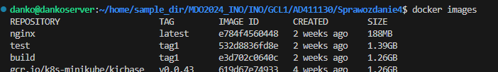
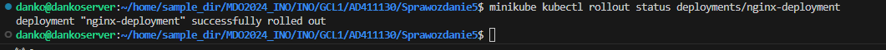
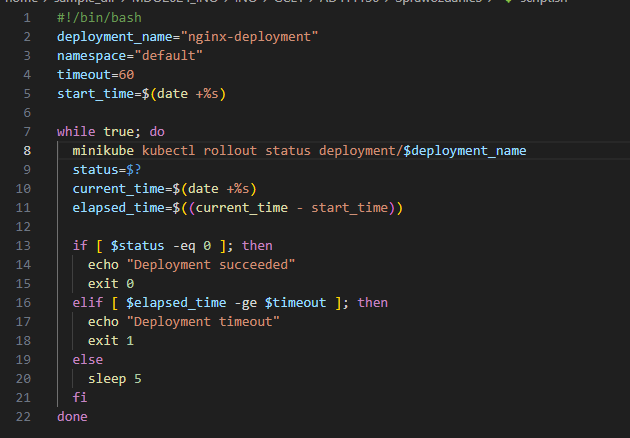

# Sprawozdanie nr 5
---
## Cel ćwiczenia:
 ### Celem ćwiczenia było zapoznanie się z procesem instalacji, konfiguracji oraz zarządzania klastrem Kubernetes przy użyciu Minikube na systemie Linux.  Należało przyswoić, jak uruchamiać aplikacje kontenerowe, monitorować ich stan oraz zarządzać ich wersjami za pomocą Kubernetes. Ważnym aspektem było również poznanie narzędzia kubectl oraz implementacja automatyzacji wdrożeń za pomocą plików YAML.

---

## Streszczenie laboratorium: 
### Laboratorium skupiło się na praktycznej instalacji i konfiguracji klastra Kubernetes przy użyciu Minikube oraz narzędzia kubectl. Rozpoczęto od instalacji Minikube, po czym przystąpiono do uruchomienia prostego serwera WWW nginx. Następnie wdrożono aplikację na klastrze, monitorując jej działanie zarówno z poziomu wiersza poleceń, jak i interfejsu graficznego dashboardu Kubernetes. Kolejnym etapem było zautomatyzowanie wdrożenia aplikacji za pomocą pliku YAML, a także przetestowanie aktualizacji i rollbacku wdrożeń. Laboratorium zakończyło się weryfikacją poprawności wdrożeń oraz ich kontrolą za pomocą skryptów.

###  Laboratorium 

---

## Instalacja klastra Kubernetes

Kubernetes jest platformą open-source do zarządzania kontenerami, która umożliwia automatyzację wdrażania, skalowania i zarządzania aplikacjami kontenerowymi.

Zgodnie z instrukcją posłużyłem się dokumentacją dotyczącą implementacji stosu kubernetes. W tym przypadku należało użyć kilku komend, aby osiagnąć zamierzone cele w związku z instalacją kubernetes/minikube. 

Instalacja miała postać 'Debian package' w wersji stabilnej na Linuxie x86-64.

Aby uruchomić Minikube należalo użyć jednej, prostej instrukcji 'minikube start'.

Polecenie uruchamia Minikube, a przy okazji sprawdza czy nasze środowisko spełnia wymagania dotyczące Minikube, czyli tak jak jest napisane w dokumentacji.

Wymagania sprzętowe:

'''
2 CPUs or more
2GB of free memory
20GB of free disk space
Internet connection
Container or virtual machine manager, such as: Docker, QEMU, Hyperkit, Hyper-V, KVM, Parallels, Podman, VirtualBox, or VMware Fusion/Workstation
'''

Po podłączeniu się spoza roota wiersz poleceń wygląda następująco:

Tak jak zresztą sugeruje też polecenie wyżej nie posiadam 'kubectl'.

### Czym jest kubectl?

Kubectl oznacza „ interfejs wiersza poleceń Kubernetes ”. Jest to narzędzie wiersza poleceń dla platformy Kubernetes umożliwiające wykonywanie wywołań API. Kubectl to główny interfejs, który pozwala użytkownikom tworzyć (i zarządzać) pojedynczymi obiektami lub grupami obiektów w klastrze Kubernetes.

Poniższym poleceniem doinstalowuje 'kubectl':

Sprawdzam, czy powyższe polecenia rzeczywiście uruchomiły kubernetes. W tym celu sprawdzam czy powstał kontener Docker-a  z działajacym minikubem tak, jak zostało to napisane przy okazji polecenia 'minikube start':

Kontener powstał w sposób poprawny. Następnym krokiem jest pokazanie głównego lokalnego panelu Kubernetes w przeglądarce. W tym celu uruchamiam w wierszu poleceń komendę:
'minikube dashoard'. 

Bezpośrednio przekierowuje mnie na stronę 

### Oto kilka kluczowych koncepcji i funkcji, które oferuje Kubernetes:

1.Pod:

-Pod to podstawowa jednostka wdrażania w Kubernetes. Może zawierać jeden lub więcej kontenerów (zwykle jeden), które są uruchamiane razem na tym samym hoście i współdzielą zasoby      takie jak sieć i pamięć masową.
-Wszystkie kontenery w Podzie mają wspólny adres IP i mogą się komunikować za pomocą localhosta.
-Pod jest zaprojektowany jako efemeryczny, co oznacza, że jest tworzony, uruchamiany i usuwany przez system automatycznie.

2.Deployment:

-Deployment zarządza zestawem identycznych Podów, zapewniając ich uruchomienie, aktualizację i skalowanie.
-Umożliwia deklaratywne zarządzanie aplikacjami: użytkownik definiuje stan, który chce osiągnąć, a Kubernetes realizuje ten stan, tworząc i aktualizując Pody.
-Deployment wspiera strategię Rolling Update, co pozwala na bezprzerwowe aktualizacje aplikacji.

3.Service:

-Service w Kubernetes definiuje logikę odkrywania usług i równoważenia obciążenia.
-Zapewnia stały punkt dostępu (adres IP i port), pod którym usługa jest dostępna, niezależnie od tego, które Pody ją realizują.
-Może łączyć się z Podami za pomocą etykiet (labels), umożliwiając dynamiczne odnajdywanie usług.

4.ReplicaSet:

-ReplicaSet zapewnia utrzymanie określonej liczby replik danego Podu w systemie.
-Jest często używany przez Deploymenty do zarządzania liczbą Podów. Deploymenty automatycznie tworzą ReplicaSety.

## Analiza posiadanego kontenera

Następnie należało zdefiniować krok Deploy aplikacji zdefiniowanej przez nas bądź w problematycznym przypadku skorzystać z gotowego oprogramowania. 
Z racji tego, że mój program nie nadawał się raczej do uruchomienia/działania posłużyłem się aplikacją 'nginx'.

### nginx  – serwer WWW (HTTP) oraz serwer proxy dla HTTP i IMAP/POP3
Zaprojektowany z myślą o wysokiej dostępności i silnie obciążonych serwisach (nacisk na skalowalność i niską zajętość zasobów). Wydawany jest na licencji BSD.

Pobrałem na początku 'nginx' na swoją maszynę tak, żebym miał go dostępnego w docker images.

Następnie, aby uruchomić 'nginx' użyłem polecenia 'docker run' i wpisałem również odpowiedni port na którym ma działać nginx po wpisaniu w przeglądarkę. Port musiał być wolny. 
Pierwszą domyślną opcją był port 8080:80 ale on już był zajęty, więc zmieniłem go na 8070:80. 

Chcąc sprawdzić działanie aplikacji należało połączyć się do serwera z poziomu przeglądarki wpisując adres IP oraz wcześniej ustalony port. Naszą stroną będzie plik 'index.html' domyślny ustalony z obrazu 'nginx', który będziemy później modyfikować.

Jak widać powyżej strona uruchamia się poprawnie, zatem przyjmujemy że obraz 'nginx' działa bezproblemowo.

W tym momencie możemy przejść do wprowadzenia swojej własnej konfiguracji obrazu.
Jednym ze sposobów na jakie można taką konfigurację wprowadzić jest modyfikacja pliku 'index.html'

Jako nowy już plik 'index.html' ma w sobie zawierać jedno słowo 'Hello !'. Chodzi o to, żeby zwyczajnie wprowadzić cokolwiek innego tak,żeby stanowiło to moją własną wersję.

Poniżej wygląd pliku:

Teraz podmieniamy pliki z poziomu wiersza poleceń zwyczajnie kopiując nowy plik do folderu z 'nginx' i sprawdzamy czy nowa konfiguracja  została zaktualizowana.
W tym celu znowu uruchamiam aplikację z poziomu przeglądarki i sprawdzam jak wygląda 'index.html'.

Następnie należy zrobić tak, aby nasza nowa aplikacja była dostępna dla dalszego działania. W moim przypadku zdecydowałem się na udostępnienie aplikacji na Dockerhub tak, żeby łatwo można było później ściągać, modyfikować i zarządzać obrazem z mojego konta na różnych środowiskach. 

Na początku buduję 'mynginx' na Dockerze tak żeby była aplikacja gotowa jako obraz. Następnie trzeba będzie udostępnic ten obraz publicznie.

W tym celu loguję się na Dockerhub poprzez polecenie 'docker login'. Podaje tam swój login i hasło na platformę tak, żebym miał wtedy dostęp do ściągania i wrzucania obrazu z i na Dockerhub. 

Następnie wrzucam mój obraz 'MYNGINX' odpowiednio otagowany (będzie to przydatne w dalszej części laboratorium ), czyli w moim przypadku 'v1', poleceniem 'docker push':

Widoczność obrazu 'mynginx' na Dockerhubie:

Wszystko działa poprawnie. Na moim koncie Dockerhub jest widoczny obraz wraz ze zdefiniowanym wcześniej tagiem.

## Uruchamianie oprogramowania

W kolejnej części należało uruchomić kontener na stosie k8s. 
W tym celu najpierw muszę załadować obraz pobrany z Dockerhub do minikube poprzez polecenie :
'minikube image load mynginx'

Następnie z poziomu minikube należy uruchomic kontener który zostanie automatycznie ubrany w 'pod'. 
Do takiego stanu rzeczy można doprowadzić korzystając z polecenia które uruchamia właśnie obraz w minikube. JEst on podany w instrukcji, czyli:

'minikube kubectl run -- <nazwa-wdrożenia> --image=<obraz-docker> --port=<wyprowadzany port> --labels app=<nazwa-wdrożenia>'

Odpowiednio modyfikuję polecenie, aby odpowiadało mojemu środowisku i mojej konfiguracji aplikacji:

Na początku okazało się że błędnie zdefiniowałem nazwę obrazu nie łącząc go z tym obrazem pobranym z Dockerhub, ale z moim lokalnym. Zadziało się tak z tego powodu, że nei dodałem przed nazwą obrazu swojego loginu z Dockerhub, a tak się składa że tą samą nazwę miałem ustawioną lokalnie. 

Z tego powodu miałem błąd przy tworzeniu poda.

Podobnie to wyglądało z poziomu dashboardu

Dopiero po zmianie nazwy na tą z Dockerhub pod był gotowy do użycia co widać za trzecim wyświetleniem ( za drugim wyświetleniem jeszcze kontener się tworzył stąd był brak gotowości).

Teraz wyświetlenie z poziomu Dashboardu:

## Przekucie wdrożenia manualnego w plik wdrożenia

W kolejnym etapie laboratorium należało wykonać automatyzację wdrożenia poprzez zdefiniowanie etapu 'Deployment' w pliku o rozszerzeniu 'yaml'. Takie rozwiązanie pozwoli pozbyć się ręcznego uzupełniania i przesyłania komend do terminala w celu wzdrożenia aplikacji. 

W jednym pliku mamy zdefiniowane metadane, ilość replik, nazwę aplikacji, użyty obraz, czy port kontenera.

Poniżej 'nginx-deployment.yaml' dotyczący mojej aplikacji 'mynginx' z Dockerhub, który pozwala na wzdrożenie aplikacji do minikube:

Na początku błędnie zdefiniowałem nazwę, bo jak się okazało minikube pozwala tylko na metadane przerywniki w postaci myślników, kropek.

Poprawnie zdefiniowana nazwa nginx-deployment w połączeniu z poleceniem 'minikube kubectl -- apply' pozwoliła na uruchomienie wdrożenia do lokalnego systemu kubernetes.

Poleceniem 'get deployments' sprawdzamy jakie wdrożenia zostały wykonane, przy okazji mając dostęp do dostępnych i gotowych podów, czyli pojedynczych jednostek wdrożenia.

Należało również sprawdzić w jaki sposób wygląda to z poziomu przeglądarki/dashboardu. 

Wizualnie mamy dostępną informację o uruchomionym Deploymencie, ponadto pojawiła nam się osobna rubryka która informuje o Deploymentach oraz o rzeczach takich jak:
Name, Image, Labels, Pods oraz kiedy zostało wdrożenie uruchomione. Zielona ikonka po lewej stronie jak i u góry informują nas że wszystko przebiegło pomyślnie.

Stan wdrożenia można zbadać również za pomocą polecenia 'kubectl rollout status':

Z poziomu dashboardu dostępna jest możliwość sprawdzenia uruchomionych podów. W naszym przypadku są to 3 pody z racji tego że zdefiniowaliśmy właśnei 3 repliki przy wdrożeniu automatycznym.

## Przygotowanie nowego obrazu

W kolejnej części należało zarejestrować nową wersję obrazu Deployowego. W naszym przypadku użyję następujacej strategii:

Aby uzyskać nową wersję aplikacji po raz kolejny ją zbuduję, ale tym razem znowu zmodyfikuję plik 'index.html'

Teraz wiadomo będzie że aplikacja została zaktualizowana ( użyta została wersja v2).

Po raz kolejny używam wcześniej już przedstawionego pliku Dockerfile który pozwoli mi na skopiowanie nowego pliku html do odpowiedniej ściezki mynginx, która zaktualizuje już ten plik i wdroży go do aplikacji. 

Budowanie nowej zmodyfikowanej aplikacji:

Widok z poziomu przeglądarki na aplikację - jak widać została zaktualizowana o nowy plik html:

Otagowujemy obraz jako v2 tak żeby jasno było wiadomo że to druga wersja aplikacji i żeby była ona jasno oddzielona od wersji pierwszej oraz domyślnej nginx. 

Widok 'docker images' pokazujący oddzielne wersje aplikacji:

Pushowanie obrazu na dockerhub w celu upublicznienia otagowanych już dwóch wersji programu:

Potwierdzenie że na Dockerhub jest już widoczny obraz z dwoma Tagami: v1 oraz v2:

## Zmiany w deploymencie

W ramach zmian w deploymencie należało aktualizować plik YAML z wdrożeniem i przeprowadzić ponownie to wdrożenie po zastosowaniu następujących zmian:

-zwiększenie replik  do 6

Modyfikacja pliku yaml:

Po zmianie widok z poziomu dashboard:

Pogląd na rollout history:

-zmniejszenie liczby replik do 1

Wykonanie instrukcji ręcznych:

Modyfikacja pliku yaml:

Po zmianie widok z poziomu dashboard:

-zmniejszenie liczby replik do 0

Po zmianie widok z poziomu dashboard:

-Zastosowanie nowej wersji obrazu

Modyfikacja pliku yaml:

Wykonanie instrukcji ręcznych:

-Przywracaj poprzednie wersje wdrożeń za pomocą poleceń : kubectl rollout history:

# Kontrola wdrożenia

Skrypt weryfikujący, czy wdrożenie "zdążyło" się wdrożyć (60 sekund)

