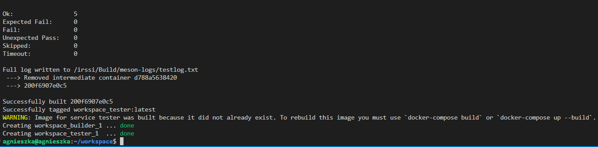
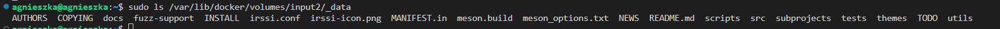
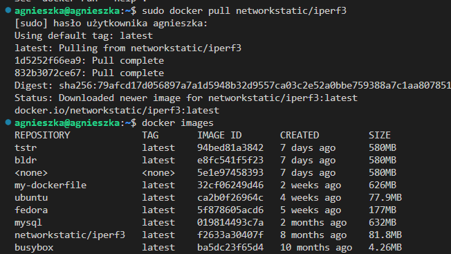
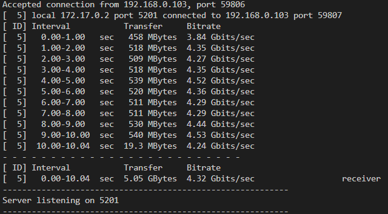

# Sprawozdanie 2
## Część 1 - Dockerfiles, kontener jako definicja etapu

### Wybór oprogramowania na zajęcia
W pierwszej części zadania sklonowałam repozytorium ze strony https://github.com/irssi/irssi do jednego z katalogów na maszynie wirtualnej. Aby móc zbudować aplikację, musiałam dosinstalować szereg zależności:

 ```
  241  git clone git@github.com:irssi/irssi.git
  242  cd irssi/
  243  ls 
  244  meson Build
  245  sudo apt install meson
  246  meson Build
  247  sudo apt install build-essential
  248  meson Build
  249  sudo apt install cmake
  250  meson Build
  251  sudo apt install libglib2.0-dev
  252  meson Build
  253  sudo apt install libssl-dev
  254  meson Build
  255  sudo apt install libncurses-dev
  256  meson Build
  257  ninja -C /irssi/Build
  258  cd Build/
  259  ninja test
  ```
  Przykładowa informacja o braku zależności, w tym przypadku biblioteki GLib:

  

  Po doinstalowaniu wszystkich niezbędnych zależności, testy wykonały się poprawnie:

 

### Przeprowadzenie buildu w kontenerze

#### 1. Manualne przeprowadzanie buildu w kontenerze.

Uruchomiłam kontener na obrazie ubuntu i podłączyłam terminal poleceniem:

```
docker run -it --rm ubuntu bash
```

gdzie:
`-it`: interaktywne uruchomienie kontenera oraz przypisanie terminalu hosta do kontenera

`-- rm`: automatyczne usunięcie kontenera po zakończeniu działania procesu wewnątrz kontenera

`bash`: otwiera interaktywny terminal bash wewnątrz kontenera 

Zaktualizowałam listę zależności i zainstalowałam gita:

```
apt-get update
apt-get install git
```
Sklonowałam repozytorium irrsi:


Następnie powtórzyłam instalowanie zależności z pierwszej części.

Zrzut ekranu przedstawiający wydruki terminala po wpisaniu polecenia: 

```
ninja -C /irssi/Build
```


Po zbudowaniu projektu uruchomiłam testy tak jak poprzednio:


#### 2. Przeprowadzenie buildu przy pomocy plików Dockerfile 

Stworzyłam dwa pliki Dockerfile:

- BLDR.Dockerfile, który wykonuje wszystkie kroki związane z budowaniem aplikacji

```
FROM ubuntu:latest

RUN apt-get update
RUN apt-get install -y git
RUN git clone https://github.com/irssi/irssi.git

WORKDIR /irssi

RUN apt install -y meson
RUN apt install -y build-essential
RUN apt install -y libglib2.0-dev
RUN apt install -y libssl-dev
RUN apt install -y libncurses-dev
RUN meson Build
RUN ninja -C /irssi/Build
```
Zmieniona wersja pliku uwzględniająca komentarz do ostatniego sprawozdania:
```
FROM ubuntu:latest

RUN apt-get update && \
    apt-get install -y \
    git \
    meson \
    build-essential \
    libglib2.0-dev \
    libssl-dev \
    libncurses-dev && \
    git clone https://github.com/irssi/irssi.git /irssi && \
    cd /irssi && \
    meson Build && \
    ninja -C /irssi/Build

WORKDIR /irssi
```
- TSTR.Dockerfile

```
FROM bldr

WORKDIR /irssi/Build
RUN ninja test
```

Przeprowadziłam build obrazu za pomocą polecenia:

```
docker build -t bldr -f BLDR.Dockerfile .
```

gdzie:
 `-t`: pozwala nadać nazwę obrazowi

 `-f`: pozwala na określenie ścieżki do pliku Dockerfile, który zostanie użyty do budowania obrazu

 Kropka oznacza, że Docker będzie szukał pliku Dockerfile w bieżącym katalogu.

 Za pierwszym razem nie udało się, ponieważ zapomniałam dodać w pliku Dockerfile przy niektórych komendach opcji `-y`, która automatycznie potwierdza zgody na instalację pakietów. 


Po wprowadzeniu poprawek obraz się zbudował:


Następnie, analogicznie zbudowałam obraz z testami poleceniem:


`docker build -t tstr -f TSTR.Dockerfile .`


Sprawdziłam moje obrazy. Widać wśród nich dopiero co zbudowane obrazy `bldr` i `tstr`.


Uruchomiłam kontener zbudowany na obrazie tstr interaktywnie, aby zobaczyć co w nim się znajduje. Po uruchomieniu, znalazłam się w zadanej w pliku Dockerfile ścieżce, z testami. Z ciekawości odpaliłam testy, mimo że już w trakcie budowania obrazu się zrobiły. 


Sprawdziłam co pracuje w kontenerze. Standardowo tylko terminal i polecenie którym sprawdziłam aktywne procesy. 


#### Docker Compose
Docker Compose umożliwia definiowanie całego środowiska aplikacji w jednym pliku konfiguracyjnym (docker-compose.yml), co ułatwia zarządzanie zależnościami między kontenerami oraz konfiguracją sieci.

Stworzyłam plik `docker-compose.yml` o treści
```
version: '3.3'

services:
  builder:
    build:
      context: .
      dockerfile: BLDR.Dockerfile

  tester:
    build:
      context: .
      dockerfile: TSTR.Dockerfile
    depends_on:
      - builder

networks:
  irssi_network:
    driver: bridge
```
Zdefiniowałam dwa kontenery - tester zależny od buildera. Zdefiniowałam też parametr `networks`, dzięki któremu możemy precyzyjnie kontrolować konfigurację sieciową naszych kontenerów, co zapewnia większą elastyczność i kontrolę nad infrastrukturą aplikacji. Może się to przydać, przy bardziej skomplikowanych projektach.  

Uruchomiłam zdefiniowane kontenery poleceniem:
```
docker-compose up -d
```



Polecenie do sprawdzenia, czy kontenery zostały poprawnie uruchomione:
```
docker-compose ps
```
Polecenie do zatrzymywania i usuwania kontenerów:
```
docker-compose down
```


## Część 2 - Dodatkowa terminologia w konteneryzacji, instancja Jenkins

### 1. Zachowywanie stanu 

Zapoznałam się z dokumentacją dockera https://docs.docker.com/storage/volumes/

Następnie utworzyłam wolumin wejściowy i wyjściowy za pomocą polecenia:

``` 
docker volume create <nazwa>
```

Wolumin wejściowy nazwałam `input_volume`, natomiast wyjściowy `output_volume`.

Wyświetliłam dostępne woluminy za pomocą polecenia:


```
docker volume ls
```


**Klonowanie irssi na wolumin wejściowy na zewnątrz kontenera**

Za pomocą poniższego polecenia utworzyłam nowy kontener o nazwie `ubuntu-volume` na podstawie obrazu ubuntu, ponieważ domyślnie nie ma tam zainstalowanego git'a :


gdzie: 
`--mount source=input_volum,target=/in`: Montuje wolumin o nazwie "input_volum" do ścieżki "/in" w kontenerze.

`--mount source=output_volum,target=/out`: Montuje wolumin o nazwie "output_volum" do ścieżki "/out" w kontenerze.

Sprawdziłam czy w kontenerze jest zainstalowany git:


Następnie w kontenerze zainstalowałam niezbędne zależności, dzięki którym będę mogła zbudować `irrsi `

Zaczęłam od najbardziej podstawowych jak `apt update`, a następnie instalowałam wszystkie biblioteki wymienione na początku sprawozdania.


Następnie poza kontenerem sklonowałam repozyorium `irrsi` do woluminu wejściowego za pomocą polecenia:

```
sudo git clone https://github.com/irssi/irssi.git $(docker volume inspect -f '{{ .Mountpoint }}' input_volume)
```
gdzie :
`$(docker volume inspect -f '{{ .Mountpoint }}' input_volume)` wykonuje polecenie `docker volume inspect`, aby uzyskać informacje o ścieżce montowania woluminu o nazwie `input_volume`, a następnie zwraca tę ścieżkę jako wynik

Wynik klonowania:


Przeszłam do uruchomionego kontenera i sprawdziłam, czy repozytorium sklonowało się na wolumin wejściowy:


Gdy upewniłam się, że repozytorium poprawnie się sklonowało, wpisałam polecenie `meson Build`. 
Wydruki terminala potwierdzające gotowość do zbudowania projektu:


Następnie wpisałam `ninja -C /in/Build` i Irssi poprawnie się zbudowało:


Dla pewności sprawdziłam, czy aplikacja przechodzi wszystkie testy:


Wynik budowania, zapisałam na wolumin wyjściowy poleceniem:
```
cp -r /in/Build /out
```
Upewniłam się, że wolumin wyjściowy zawiera skopiowaną zawartość:


Wyłączyłam kontener i sprawdziłam, czy zawartość woluminu wyjściowego jest dostępna na hoście:


**Klonowanie irssi na wolumin wejściowy wewnątrz kontenera.**

Następnie powtórzyłam uruchomienie kontenera z woluminami, jednak tym razem sklonowałam `irssi` na wolumin wejściowy wewnątrz kontenera.

Stworzyłam nowe, puste woluminy:


Uruchomiłam nowy kontener, podpięłam woluminy i zainstalowałam gita wewnątrz kontenera:


Sklonowałam repozytorium `irssi`:


Sprawdziłam zawartość woluminu wejściowego wewnątrz i na zewnątrz kontenera:




Powyższe czynności można zautomatyzować przy użyciu pliku Dockerfile. Zawartość takiego pliku mogłaby wyglądać w ten sposób:
```
FROM ubuntu:latest

RUN apt-get update && \
    apt-get install -y git

RUN --mount=type=volume,source=input_volume,target=/in git clone https://github.com/irssi/irssi.git

WORKDIR /in
RUN apt-get install -y meson build-essential libglib2.0-dev libssl-dev libncurses-dev && \
    meson Build

RUN ninja -C /in/Build
```
gdzie polecenie `RUN --mount=type=volume,source=input_volume,target=/in git clone https://github.com/irssi/irssi.git` wykonuje klonowanie repozytorium `irssi` z GitHuba do woluminu wejściowego `input_volume`, który jest montowany wewnątrz kontenera pod ścieżką `/in`.

Istnieje także możliwość stworzenia woluminu w pliku Dockerfile za pomocą instrukcji `VOLUME`.

Zastosowanie tego typu rozwiązania jest mniej elastyczne, ponieważ zmiana woluminów będzie wymagała zbudowania na nowo obrazu. Jednak jeśli montowanie woluminów jest stałe i niezmienne, można wykorzystać taką możliwość i zdefiniować je w pliku Dockerfile. 

### 2. Eksponowanie portu 

Zapoznałam się z dokumnetacją  https://iperf.fr/ .
Iperf3 to narzędzie do pomiaru przepustowości sieciowej. Pozwala użytkownikom testować prędkość przesyłania danych między dwoma punktami w sieci. Może być używane do testowania wydajności sieciowej w różnych scenariuszach, takich jak diagnostyka sieci, optymalizacja wydajności sieci, oraz sprawdzanie jakości połączenia sieciowego.

#### Komunikacja kontener - kontener (adres IP)
Ściągnęłam obraz Dockera `networkstatic/iperf3`:



Uruchomiłam wewnątrz kontenera serwer iperf3, który jest gotowy na przyjmowanie połączeń testowych na porcie 5201, za pomocą polecenia:
```
sudo docker run -it --name=iperf3server -p 5201:5201 networkstatic/iperf3 -s
```
gdzie:
`-p 5201:5201`: Określa przekierowanie portów. Mapuje port hosta 5201 na port kontenera 5201.

`networkstatic/iperf3`: Wcześniej pobrany obraz Dockera

`-s`: Jest to opcja dla iperf3, która uruchamia serwer iperf3 w kontenerze

Wybrałam port 5201, ponieważ jest to standardowy port używany przez iperf3 do komunikacji pomiędzy klientem a serwerem. 
Po uruchomieniu:


Następnie w innym terminalu, sprawdziłam adres ip tego serwera poleceniem:
```
sudo docker inspect -f '{{.Name}} - {{range .NetworkSettings.Networks}}{{.IPAddress}}{{end}}' $(sudo docker ps -aq)
```


Wiedząc, że adres ip serwera wynosi 172.17.0.2 uruchomiłam klienta poleceniem:
```
sudo docker run -it --rm --name=iperf3client networkstatic/iperf3 -c 172.17.0.2 
```

gdzie:

`--name=iperf3client`: Określa nazwę kontenera jako "iperf3client"

`networkstatic/iperf3`: Obraz Dockera

`-c 172.17.0.2`: Jest to opcja dla iperf3, która wskazuje adres IP serwera iperf3, z którym chce się połączyć i przeprowadzić testy prędkości. 

Klient:


Serwer:


#### Komunikacja kontener - kontener (nazwy)
Zapoznałam się z dokumentacją https://docs.docker.com/engine/reference/commandline/network_create/ .
Polecenia `network create` pozwala na tworzenie własnych sieci, co umożliwia izolację aplikacji i kontrolę nad ruchem sieciowym. 

Korzystając z możliwości, jakie daje nam narzędzie network create, utworzyłam dedykowaną sieć mostkową, poleceniem:
```
sudo docker network create --driver bridge my_bridge_network
```
gdzie:

`--driver bridge`: Określa typ sterownika używanego do utworzenia sieci. 


Następnie uruchomiłam kontener serwera iperf z wykorzystaniem nowej sieci:


Użyłam polecenie:
```
sudo docker run -d --name iperf-server-2 --network=my_bridge_network networkstatic/iperf3 iperf3 -s
```
gdzie:

`--network=my_bridge_network`: Określa, że ten kontener zostanie podłączony do wcześniej utworzonej sieci o nazwie "my_bridge_network".
`iperf3 -s`: Oznacza uruchomienie serwera iperf3 wewnątrz kontenera, po uruchomieniu

Następnie połączyłam się z serwerem iperf z innego kontenera:


Zastosowanie narzędzia network create umożliwiło połączenie się z serwerem iperf w kontenerze `iperf-server-2` za pomocą nazwy kontenera zamiast adresu IP.

#### Komunikacja kontener - host

Zainstalowałam iperf3 poleceniem:

```
sudo apt install iperf3
```

Uruchomiłam serwer, do nasłuchiwania na porcie 5201:


Po nawiązaniu połączenia z kontenerem serwera iperf, przeprowadziłam test przepustowości połączenia między hostem a kontenerem serwera.

W tym celu, użyłam polecenia na hoście:
```
sudo iperf3 - c loclahost -p 5201
```


#### Komunikacja kontener - inne urządzenie 

Aby połączyć się z kontenerem spoza hosta, wykorzystałam system windows, zainstalowany na moim komputerze. W tym celu zainstalowałam `Chocolatey`, a następnie `iperf3`:


Nastęnie, poprzez adres IP mojego hosta, połączyłam się z serwerem iperf. Użyłam polecenia:
```
iperf3 -c 198.168.0.107 -p 5201
```
Klient:


Serwer:



#### Wyciągnięcie logów z kontenera 
Aby wyciągnać logi, użyłam polcenia:
```
sudo docker logs iperf3server2 > logs.txt
```
Dzięki czemu mogłam zapisać do pliku tekstowego informacje o połączeniach.

Następnie poleceniem `cat` wyświetliłam informacje w terminalu:


Podsumowanie:

| Rodzaj Połączenia| Przepustowość  |
|----------|----------|
|   Kontener - kontener  (ip) |  32.0 Gbits/sec | 
|   Kontener - kontener  (nazwa) |  29.5 Gbits/sec | 
|   Kontener - host  |  34.7 Gbits/sec | 
|   Kontener - inne urządzenie|  4.32 Gbits/sec | 

Największa przepustowość wystepuje pomiędzy kontenerem a hostem, co może być spowodowane bezpośrednim dostępem do zasobów hosta. Eliminuje to dodatkowe warstwy i opóźnienia w komunikacji. Najniższa przepustowość (pomiędzy kontenerem a innym urządzeniem) sugeruje, że połączenie za pomocą sieci powoduje pewne ograniczenia. Może być to spowodowane różnymi czynnikami, takimi jak konfiguracja sieciowa czy też obciążeniem sieci.

### 3. Instancja Jenkins 

Zapoznałam się z dokumengtacją https://www.jenkins.io/doc/book/installing/docker/

Jenkins to narzędzie do automatyzacji procesów wytwarzania oprogramowania, takich jak kompilacja, testowanie i wdrażanie. Umożliwia przechodzenie przez te procesy w sposób zautomatyzowany, co przyspiesza dostarczanie oprogramowania i poprawia jego jakość. Jenkins jest popularnym narzędziem w dziedzinie ciągłej integracji (CI) i ciągłego dostarczania (CD).

W pierwszym kroku stworzyłam plik `docker-compose.yml` o treści:

```
version: '3.3'

services:
  jenkins:
    container_name: jenkins
    image: jenkins/jenkins:lts
    ports:
      - "8080:8080"
    volumes:
      - jenkins_home:/var/jenkins_home
    networks:
      - jenkins

  docker:
    container_name: docker
    image: docker:stable-dind
    privileged: true
    volumes:
      - jenkins_home:/var/jenkins_home
    networks:
      - jenkins
    depends_on:
      - jenkins

networks:
  jenkins:

volumes:
  jenkins_home:
```

Ten plik definiuje dwa serwisy: Jenkins i Docker. Serwis Jenkins jest uruchamiany z oficjalnego obrazu Jenkinsa (jenkins/jenkins:lts) i mapuje port 8080 hosta na port 8080 kontenera Jenkinsa. Serwis Docker używa obrazu docker:stable-dind, który zawiera Docker w Dockerze, co pozwala uruchamiać kontenery Docker wewnątrz kontenera Jenkinsa. 

Zainstalowałam `docker-compose`, a następnie aby uruchomić Jenkinsa wraz z Dockerem w kontenerach użyłam polecenia:
```
docker-compose up -d
```


Sprawdziłam czy Jenkins jest aktywny:


Aby uzyskać hasło, sprawdziłam logi jenkinsa poleceniem:
```
docker logs jenkins
```


W przeglądarce weszłam na http://192.168.0.107:8080/ , gdzie pierwsza część to IP mojego hosta. W poniższe pole wkleiłam hasło, skopiowane w logach.


Po zainstalowaniu wtyczek ukazał się panel admina:


### Zakres rozszerzony 
**Co jest potrzebne by w naszym Jenkinsie uruchomić Dockerfile dla buildera?**

Uruchomienie Dockerfile wewnątrz kontenera Jenkinsa, wymagając skonfigurowania kontenera Jenkinsa w trybie Docker in Docker.

Krok 1: Przygotowanie środowiska

`Dockerfile`- Definiuje środowisko do zbudowania.

`Jenkinsfile`- Definiuje sposób w jaki Jenkins powinien budować i testować projekt.

Krok 2: Konfiguracja Jenkinsa
Plugin Docker dla Jenkinsa: Plugin umożliwiający Jenkinsowi komunikację z Dockerem i uruchamianie kontenerów.

Krok 3: Wybór sposobu uruchomienia kontenera Jenkinsa.

- Tryb Docker in Docker:
Dodanie Docker jako usługi do pliku Docker Compose lub uruchomienie kontenera Jenkinsa z flagą --privileged.
- Zamontowanie gniazda Docker:
Alternatywnie, możemy zamontować gniazdo Docker z hosta do kontenera Jenkinsa. Pozwoli to Jenkinsowi na uruchamianie poleceń Dockera, które będą komunikować się z Dockerem na hoście.


**Co jest potrzebne w Jenkinsie by uruchomić Docker Compose?**

Aby uruchomić Docker Compose w Jenkinsie, należy upewnić się, że agenty Jenkinsa mają zainstalowany Docker oraz Docker Compose. Następnie w pliku Jenkinsfile należy zdefiniować etapy (stages), które będą uruchamiane za pomocą Docker Compose.

Niezbędne narzędzia to:

Docker Compose: Narzędzie umożliwiające definiowanie i uruchamianie wielu kontenerów Docker za pomocą jednego pliku konfiguracyjnego.

Plik docker-compose.yml: Plik konfiguracyjny, który definiuje, jakie kontenery Docker chcemy uruchomić i jak mają ze sobą współpracować.

Plugin Docker dla Jenkinsa: Plugin umożliwiający Jenkinsowi komunikację z Dockerem i uruchamianie kontenerów.