# Sprawozdanie 3
## Pipeline, Jenkins, izolacja etapów

**Cel sprawozdania:** Nauka tworzenia pipelinów CI/CD. Budowanie, testowanie, publikowanie artefaktów i wdrażanie aplikacji irssi. 

### 1. Wstęp
Wybrana aplikacja do zrealizowania celów tego laboratorium to `irssi`, której licencja, znajdująca się pod linkiem https://github.com/irssi/irssi/blob/master/COPYING, umożliwia dowolne korzystanie i modyfikację oprogramowania, z koniecznością udostępniania zmian na tej samej licencji. 

#### Wymagania wstęne środowiska
Wymagania wstępne środowiska są opisane w repozytorium irssi pod linkiem https://github.com/irssi/irssi/blob/master/INSTALL. 

#### Diagram wdrożenia UML 

Stworzyłam diagram wdrożenia UML na podstawie którego będę realizowała pipeline'a:

  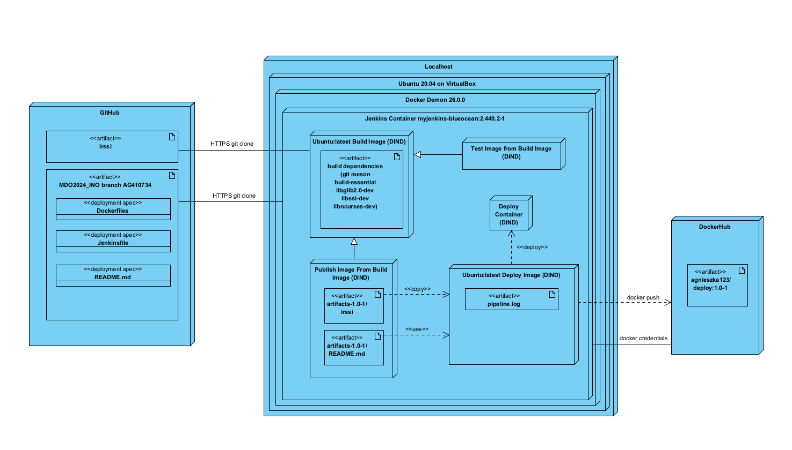

Kontenery DIND utworzone w Jenkinsie realizują po kolei etap `Build - Test - Publish - Deploy`. Obraz `Build` i `Deploy` bazują na obrazie `ubuntu`. Obrazy `Test` i `Publish` bazują na obrazie `build`.  W trakcie pipeline'a używam plików Dockerfiles umieszczonych w repozytorium GitHub. W obrazie `build` klonuję aplikację `irssi` z GitHuba. W końcowym etapie udostępniam obraz `doploy` z wdrożoną aplikacją `irssi` na DockerHubie. 

#### Diagram aktywności UML 

  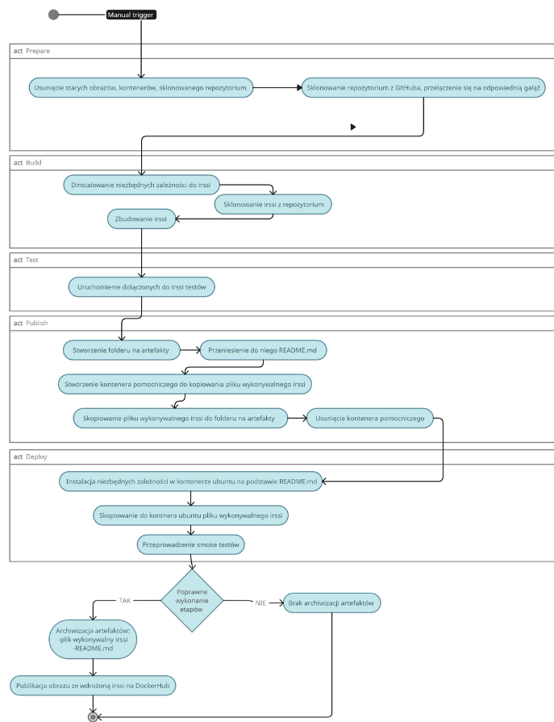

Powyższy diagram obrazuje przepływ pipeline'a poprzez wszystkie etapy zdefiniowane w Jenkinsfile. Do uruchomienia pipeline'a będę używała manualnego triggera tzn. sama będę klikała przycisk `Uruchom` w UI Jenkinsa. 

### 2. Przygotowanie

Na początku upewniłam się, że kontenery budujące i testujące irssi, utworzone na poprzednich zajęciach za pomocą docker compose działają. W tym celu w katalogu, gdzie znajduje się docker-compose uruchomiłam kontenery za pomocą komendy:

```
docker-compose up
```

  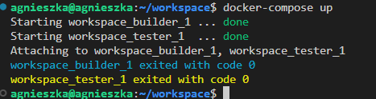

Można zauważyć logi, potwierdzające że kontenery się uruchomiły i zaraz zamknęły. Zawartość pliku docker-compose znajduje się w ostatnim sprawozdaniu, z tą zmianą, że usunęłam sieć irssi-network, żeby uniknąć na początek dodatkowych komplikacji. 

W kolejnym kroku uruchomiłam obraz eksponujący środowisko zagnieżdżone Dockera i Blueocean zgodnie z dokumentacją  https://www.jenkins.io/doc/book/installing/docker/.

  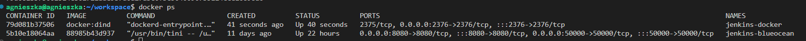


Przeszłam do przeglądarki i otworzyłam Jenkinsa pod adresem http://192.168.1.199:8080/. Zalogowałam się. 

  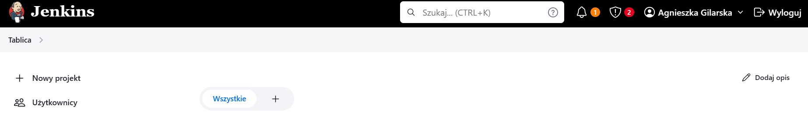

  

Blue Ocean to interfejs użytkownika Jenkinsa, który oferuje nowoczesne, interaktywne narzędzia do zarządzania Jenkinsem oraz przepływami pracy (pipelines). Po wejściu w Blue Ocean pokazuje się przyjazny UI do tworzenia pipelinów:

  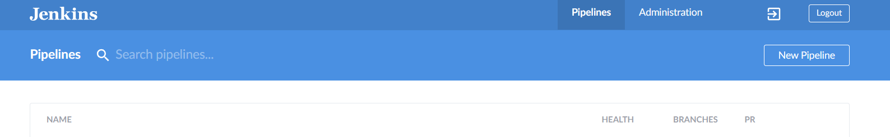

Po konfiguracji Jenkinsa zgodnie z dokumentacją, logi z jenkinsa powinny być przechowywane w ścieżce `var/jenkins_home`. W tym logi konkretnych jobów w ścieżce `var/jenkins_home/jobs/<nazwa_joba>/builds/<numer_buildu>/log`.

### 3. Uruchomienie
#### Konfiguracja wstępna i pierwsze uruchomienie

W celu utworzenia projektu wyświetlającego `uname`, kliknęłam w Jenkinsie `Nowy projekt`, następnie wybrałam opcję `Ogólny projekt` i nadałam nazwę 'uname project'.

 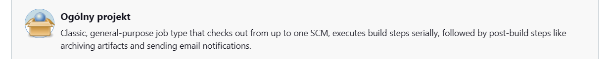

W krokach budowania, wybrałam opcję `uruchom powłokę`, w której to zostanie wywołane polecenie `uname -a`

  

Logi po uruchomieniu:

  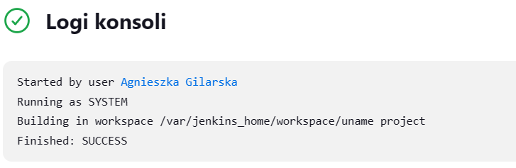

Kolejny projekt, to skrypt zwracający błąd, gdy godzina jest nieparzysta. Analogicznie do poprzeniego utworzyłam nowy projekt, który nazwałam 'hour project'. Składnia skryptu:

```
#!/bin/bash
hour=$(date +%H)

if [ $((hour % 2)) -ne 0 ]; then
    echo "Błąd: Aktualna godzina jest nieparzysta"
    exit 1
else
    echo "Aktualna godzina jest parzysta"
fi
```

Akurat zadanie zostało wykonane z powodzeniem, bo godzina była parzysta.

  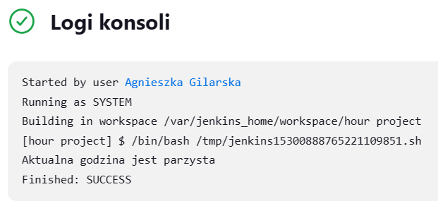

Ponieważ zależało mi, żeby job wykonał się o godzinie nieparzystej, skonfigurowałam go, żeby wykonał się znowu o wybranej godzinie. W tym celu w konfiguracji przeszłam do zakładki `wyzwalacze budowania` i zaznaczyłam `buduj cyklicznie`, następnie w harmonogramie wpisałam godzinę 17.

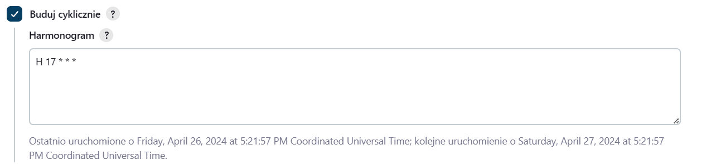

Po godzinie 17 wykonało się zadanie i zwróciło log:

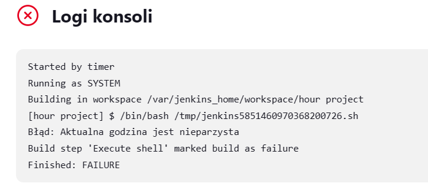

#### Budowanie obrazów irssi

Celem zadania, było sklonowanie naszego repozytorium, przejścia do pliku docker-compose na swojej gałęzi i zbudowanie z tego pliku obrazów.

Analogicznie utworzyłam nowy projekt w Jenkinsie, który nazwałam `irssi project`. Wybrałam opcję repoztytorium kodu Git i wkleiłam ścieżkę do naszego repozytorium.

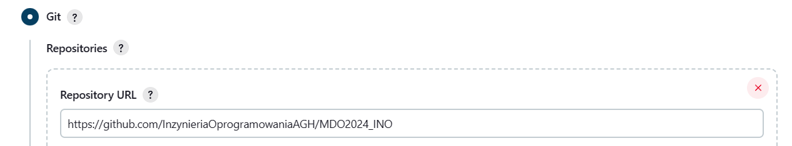

Następnie wybrałam moją gałąź:

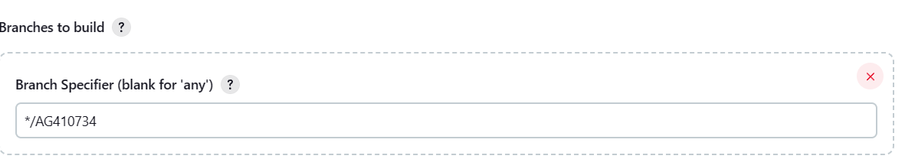

W kolejnym kroku zdefiniowałam ścieżkę do mojego pliku docker-compose.yml i wywołałam polecenie budujące obrazy z tego pliku.

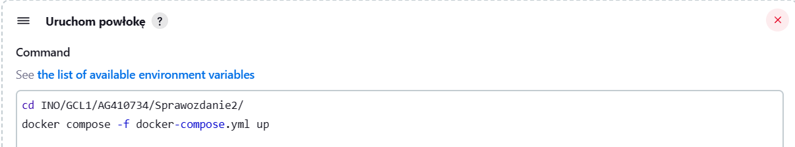

Pierwszym poważniejszym problemem, który napotkałam w trackie budowania, był brak docker compose w Jenkinsie.

W celu rozwiązania problemu, przeszłam do kontenera `jenkins-blueocean` i za pomocą dokumentacji ze strony https://docs.docker.com/compose/install/linux/#install-using-the-repository zainstalowałam manualnie `docker compose` w kontenerze. 

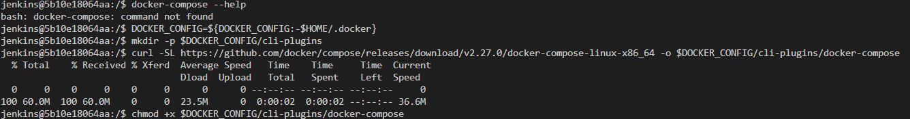

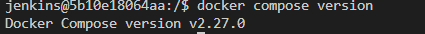

Drugim napotkanym problemem okazało się nadawanie domyślnej nazwy pierwszemu zbudowanemu obrazowi, co powodowało błąd przy próbie zbudowania testera z obrazu o nazwie `bldr`. Aby rozwiązać ten problem musiałam zmodyfikować plik `docker-compose.yml` tak aby nadawać obrazom konkretne nazwy, wykorzystując parametr `image:`

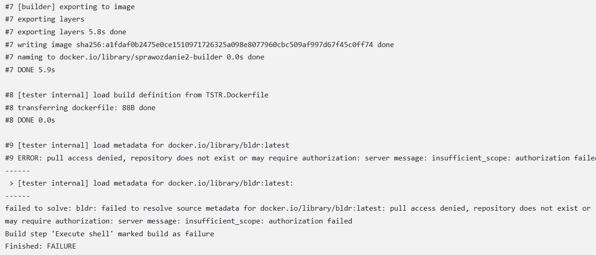

```
version: '3.3'

services:
  builder:
    build:
      context: .
      dockerfile: BLDR.Dockerfile
    image: bldr

  tester:
    build:
      context: .
      dockerfile: TSTR.Dockerfile
    image: tstr
    depends_on:
      - builder

networks:
  irssi_network:
    driver: bridge
```
Po wprowadzeniu poprawek, obrazy zostały zbudowane, a testy zakończyły się powodzeniem:

  

  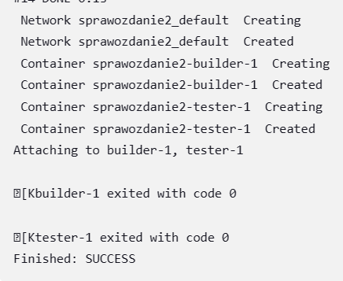


### 4. Pipeline

W celu realizacji pierwszego pipeline'a składającego się z trzech etapów, napisałam Jenkinsfile, który w stage `Clone` klonuje nasze repozytorium i przełącza się na moją gałąź, przy okazji usuwa wcześniej sklonowane repozytorium. W stage `Build` buduje z pliku BLDR.Dockerfile obraz odpowiedzialny za budowanie aplikacji. Następnie w stage `Test` buduje obraz z pliku TSTR.Dockerfile, który testuje aplikację. 

```
pipeline {
    agent any
    
    stages {
        stage('Clone') {
            steps {
                sh 'rm -rf MDO2024_INO'
                sh 'git clone https://github.com/InzynieriaOprogramowaniaAGH/MDO2024_INO.git'
                dir("MDO2024_INO"){
                    sh 'git checkout AG410734'
                }
            }
        }
        
        stage('Build') {
            steps {
                dir("MDO2024_INO/INO/GCL1/AG410734/Sprawozdanie2"){
                    sh 'docker build -t bldr -f BLDR.Dockerfile .'
                }
            }
        }
        
        stage('Test') {
            steps {
                dir("MDO2024_INO/INO/GCL1/AG410734/Sprawozdanie2"){
                    sh 'docker build -t tstr -f TSTR.Dockerfile .'
                }
            }
        }
    }
}
```
  Wynik przeprowadzonego pipeline'a:

  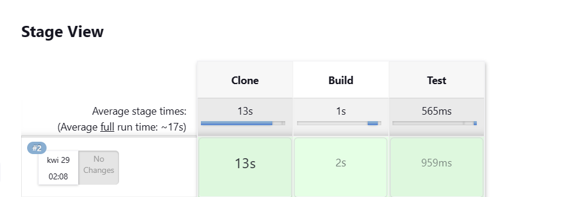

Wybrane podejście to użycie dedykowanego kontenra DIND. Plik Jenkinsfile umieściłam w repozytorium.

**Różnica pomiędzy podejściem DIND a CI**
Docker-in-Docker (DIND):
 - W tym podejściu, Jenkins uruchamia kontener Docker wewnątrz innego kontenera Docker. Pozwala to na budowanie, testowanie i wdrażanie aplikacji w izolowanym środowisku kontenera Docker, wewnątrz pipeline Jenkinsa.
- Kontener Docker wewnątrz innego kontenera Docker jest izolowany od środowiska hosta Jenkinsa. To zapewnia większą kontrolę nad środowiskiem Docker oraz pozwala na uniknięcie konfliktów z innymi procesami Dockera na hoście.

Budowanie na dedykowanym kontenerze CI:

- W tym podejściu, Jenkins wykonuje operacje budowania i testowania bezpośrednio na kontenerze CI, który może być hostowany na fizycznym lub wirtualnym serwerze.
- Wykonując operacje bezpośrednio na kontenerze CI, unikamy dodatkowych zasobów zużywanych przez kontener Docker wewnątrz kontenera Docker. Może to być szczególnie korzystne w środowiskach gdzie te zasoby są mocno ograniczone.

### 5. Pipeline irssi stage: Prepare, Build, Test, Publish, Deploy

Przy tworzeniu pipeline'a przyjęłam strategię przedyskutowaną na zajęciach. Kroki `Build` i `Test` miały zostać wykonane na podstawie wcześniej używanych plików Dockerfile budujących i testujących irssi. Następnie artefaktami kroku `Publish` miały zostać: plik wykonywalny irssi i README.md tłumaczący jakie zależności należy pobrać, aby poprawnie wdrożyć w kontenerze plik wykonywalny. Następnie w kroku `Deploy` miałam skopiować plik wykonywalny do kontnera (np. na obrazie ubuntu) i sprawdzić czy poprawnie wykonują się polecenia nieblokujące tj. "irssi --version", "irssi --help".
Wszystkie użyte pliki Dockerfile znajdują się w repozytorium w ścieżce:
`MDO2024_INO/INO/GCL1/AG410734/Sprawozdanie3/irssi-pipeline `.

#### Stage Prepare

W pierwszym kroku zatrzymuję i usuwam wszytskie pozostałe kontenery i obrazy po poprzednim pipelinie, a także sklonowane repozytorium https://github.com/InzynieriaOprogramowaniaAGH/MDO2024_INO.git, w którym znajdują się niezbędne pliki Dockerfile. Gdy miejsce zostanie odpowiednio posprzątane, klonuję repozytorium i przełączam się na swoją gałąź. Repozytorium jest publiczne więc nie wymaga użycia `cedentials`. Na początku pipeline dekalaruję zmienne środowiskowe pozwalające wersjonować artefekaty i obrazy. Zmienna VERSION przechowuje numer wersji aplikacji, a RELEASE przechwouje numer wydania. 

Początek pliku Jenkinsfile:

```
pipeline {
    agent any
    
    environment {
        VERSION = '1.0'
        RELEASE = '1'
    }
    
    stages {
        stage('Prepare') {
            steps {
                sh 'docker stop $(docker ps -q) || true'
                sh 'docker rm -f $(docker ps -a -q) || true'
                sh 'docker rmi -f $(docker images -q) || true'
                sh 'rm -rf MDO2024_INO'
                sh 'git clone https://github.com/InzynieriaOprogramowaniaAGH/MDO2024_INO.git'
                dir("MDO2024_INO") {
                    sh 'git checkout AG410734'
                }
            }
        }
```
#### Stage Build 
Następny etap to budowanie aplikacji, na podstawie `BLDR.DOCKERFILE`. W pliku zaciągam niezbędne dependencje, a następnie przeprowadzam budowanie aplikacji `irssi`. Irssi buduję na obrazie ubuntu.
```
FROM ubuntu:latest

RUN apt-get update && \
    apt-get install -y \
    git \
    meson \
    build-essential \
    libglib2.0-dev \
    libssl-dev \
    libncurses-dev && \
    git clone https://github.com/irssi/irssi.git /irssi && \
    cd /irssi && \
    meson Build && \
    ninja -C /irssi/Build

WORKDIR /irssi
```
#### Stage Test

Tak jak poprzednio w tym miejscu wykonuję testy dołączone do irssi. Obraz z testatmi bazuje na obrazie utworzonym, w poprzednim stage'u. Buduję obraz  z pliku `TSTR.Dockerfile`:

```
FROM bldr

WORKDIR /irssi/Build
RUN ninja test
```
Logi z pipeline'a potwierdzające przechodzenie testów:

  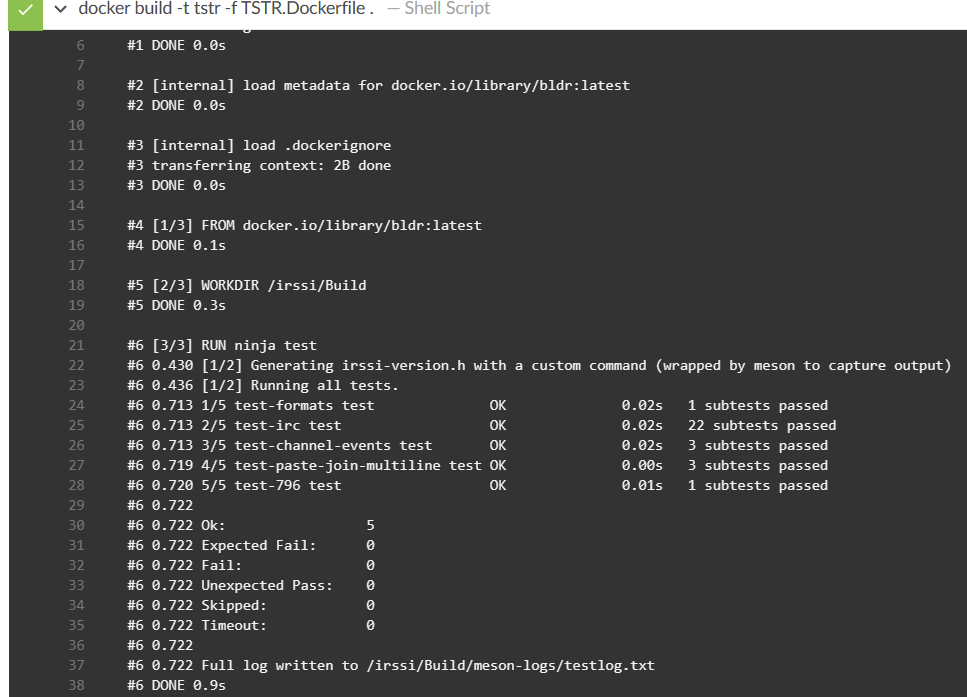

#### Stage Publish
Zdecydowałam się na wykonanie stage'u `Publish` przed `Deploy`, ponieważ do następnego etapu potrzebuję artefaktów, które będę mogła wdrożyć. W tym celu utworzyłam plik `PB.Dockerfile`, który bazuje na obrazie budującym irssi. 

```
FROM bldr

ARG VERSION
ARG RELEASE

RUN mkdir -p /artifacts-${VERSION}-${RELEASE}
RUN cp Build/src/fe-text/irssi /artifacts-${VERSION}-${RELEASE}

```
W pliku tym tworzę folder pomocniczy z unikalną nazwą, do którego skopiuję plik wykonywalny `irssi` utworzony na etapie `Buid`, zabieg ten nie jest konieczny, jednak ułatwia skopiowanie pliku na zewnątrz. 

Następnie w Jenkinsfile tworzę nowy, wersjonowany folder, który będzie zawierał dwa artefakty. Za pomocą komendy `docker create --name publish_temp publish` tworzę tymczosowy kontener o nazwie `publish_temp`, który posłuży mi do skopiowania pliku wykonywalnego `irssi`. Następnie za pomocą komendy docker `docker cp publish_temp:/artifacts-${VERSION}-${RELEASE}/irssi artifacts-${VERSION}-${RELEASE}` kopiuję plik wykonywalny z wnętrza kontenera do wersjonowanego lokalnego katalogu, do którego również kopiuję plik README.md. Na koniec usuwam pomocniczy kontener komendą `docker rm -f publish_temp`. Opcja -f oznacza, że zostanie on natychmiastowo zatrzymany i usunięty, bez względu na to, czy jest uruchomiony czy nie.

```
        stage('Publish') {
            steps {
                dir("MDO2024_INO/INO/GCL1/AG410734/Sprawozdanie3/irssi-pipeline") {
                    sh "docker build -t publish -f PB.Dockerfile --build-arg VERSION=${VERSION} --build-arg RELEASE=${RELEASE} ."
                    sh "mkdir -p artifacts-${VERSION}-${RELEASE}"
                    sh "mv README.md artifacts-${VERSION}-${RELEASE}/"
                    sh 'docker create --name publish_temp publish'
                    sh "docker cp publish_temp:/artifacts-${VERSION}-${RELEASE}/irssi artifacts-${VERSION}-${RELEASE}"
                    sh 'docker rm -f publish_temp'
                }
            }
        }
```

#### Stage Deploy
Na tym etapie przyjęłam strategię opisaną powyżej, czyli tworzę nowy obraz bazujący na tym samym obrazie co `Build` - ubuntu. Doinstalowywuję niezbędne zależności, których potrzebuje kontener ubuntu do uruchomienia irssi. Gdy doinstaluję to co niezbędne dla irssi, usuwam  listy pakietów, aby zmniejszyć rozmiar obrazu. Kolejny krok to skopiowanie pliku wykonywalnego irssi z folderu, do którego zapisywałam artefakty w kroku `Publish` i umieszczenie go w ścieżce `/usr/local/bin`, w której zazwyczaj znajdują się pliki wykonywalne. 

Plik DEPLOY.Dockerfile: 
```
FROM ubuntu

ARG VERSION
ARG RELEASE

RUN apt-get update \
    && apt-get install -y libglib2.0-0 \
    && rm -rf /var/lib/apt/lists/*

COPY artifacts-${VERSION}-${RELEASE}/irssi /usr/local/bin/
```
Na podstawie tego pliku buduję obraz wdrożeniowy i uruchamiam kontener o nazwie `irssi-${VERSION}-${RELEASE}`. Następnie w Jenkinsfile wykonuję polecenia:

```
sh "docker exec irssi-${VERSION}-${RELEASE} sh -c 'irssi --version && irssi --help'"
sh "docker logs irssi-${VERSION}-${RELEASE}"
```
Pierwsze z nich pozwala nieblokująco sprawdzić wersję irssi i opcje użycia irssi w kontenerze. Jest to pewnego rodzaju smoke test, który zakłada, że jeśli polecenia poprawnie się wykonują, to irssi prawidłowo zostało wdrożone w kontenerze. Aby uzyskać ten sam efekt można również użyć polecenia ENTRYPOINT w pliku Dockerfile.
Drugie polecenie wyświetla logi wyjścia standardowego tego kontenera. Może to być przydatne do monitorowania działania aplikacji lub do diagnozowania ewentualnych problemów. 

Logi z wykonania smoke testów:

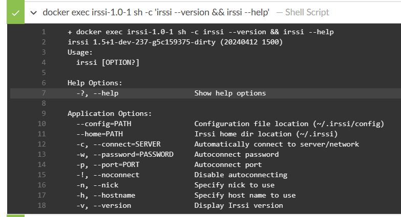

W koljnej sekcji omówię wybrany sposób dystrybucji.

### Sekcja post
Kolejny element dodany do Jenkinsfile, to sekcja post, która zostanie wykonana tylko, jeśli poprzednie stages zakończą się sukcesem. Służy ona do archiwizowania artefaktów i udostępniania obrazu Dockera. W tym miejscu stanęłam przed wyborem, jaki sposób dytrybucji byłby najbardziej odpowiedni dla pliku wykonywalnego irssi i doszłam do wniosku, że zaproponowany na zajęciach sposób z udostępnieniem archiwizacją dwóch artefaktów, jest w prawdzie bardziej elastyczny i umożliwia dostosowanie się do danego środowiska, dodatkowo zajmuje zdecydowanie mniej miejsca niż obraz irssi, ale też niesie ze sobą zagrożenie doinstalowania nieuwzględnionych w README.md zależności.

Sekcja post w Jenkinsfile:
```
post {
    success {
        dir("MDO2024_INO/INO/GCL1/AG410734/Sprawozdanie3/irssi-pipeline") {
            script {
                archiveArtifacts artifacts: "artifacts-${VERSION}-${RELEASE}/irssi, artifacts-${VERSION}-${RELEASE}/README.md", fingerprint: true, onlyIfSuccessful: true
            }
        }
        script {
            withCredentials([usernamePassword(credentialsId: 'docker-hub-credentials', usernameVariable: 'DOCKER_USERNAME', passwordVariable: 'DOCKER_PASSWORD')]) {
                sh 'docker login -u $DOCKER_USERNAME -p $DOCKER_PASSWORD'
                sh 'docker tag deploy $DOCKER_USERNAME/deploy:${VERSION}-${RELEASE}'
                sh 'docker push $DOCKER_USERNAME/deploy:${VERSION}-${RELEASE}'
            }
        }
    }
}
```
Jeśli byłoby to dla kogoś wygodniejsze można także zamienić sposób archwizowania artefaktów, na zip. Jednak w moim przypadku pozostałam przy dwóch osobnych plikach, ponieważ jest szansa że w takiej formie mogłyby się bardziej przydać, a dodatkowo plik wykonywalny nie zajmuje wiele miejsca w pamięci. 

Należałoby wtedy w ten sposób zmodyfikować Jenkinsfile:

```
  def timestamp = new Date().format("yyyyMMdd-HHmmss")
      def artifactsName = "artifacts-${VERSION}-${RELEASE}-${timestamp}"
      def tarFileName = "${artifactsName}.tar.gz"
      
      sh "tar -czf ${tarFileName} artifacts-${VERSION}-${RELEASE}"

      archiveArtifacts artifacts: "${tarFileName}", fingerprint: true, onlyIfSuccessful: true
  }
```
Wyprodukowany artefakt miałby postać:


Tak jak wspomniałam zdecydowałam się na udostępnie obrazu wdrożeniowego aplikacji irssi, ponieważ ze względu na dużą ilość niezbędnych dependencji dla irssi, łatwiej pracować z nią w pewnym określonym środowisku, gdzie już podstawowe wymagania zostały doinstalowane. Można także skorzystać ze zarchwizowanych artefaktów i samemu wdrożyć plik wykonywalny z niezbędnymi wymaganiami, co niesie ze sobą ryzyko potrzeby doinstalowania innych dependencji niż te określone w README.md. 

Czy obraz powinien zawierać zawartość sklonowanego repozytorium, logi i artefakty z builda?

Obraz raczej nie powinien zawierać artefaktów z builda, ponieważ wszytskie te zależnosci mogłyby dodatkowo obciążyć obraz. Mógłby zawierać plik tekstowy, zawierający logi z etapu build, w razie gdyby był jakiś problem z zależnościami, mogłoby to ułatwić szybsze dojście do rozwiązania. Również nie widzę potrzeby umieszczania zawartości sklonowanego repozytorium, ponieważ wszystko co niezbędne jest już doinstalowane w kontenerze. 

W celu udostępnienia obrazu na DockerHubie stworzyłam swoje konto na stronie https://hub.docker.com.

  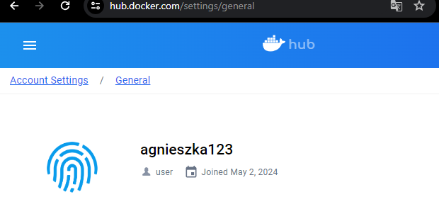

Następnie w Jenkinsie w ścieżce podanej na screenie poniżej, kliknęłam przycisk `Add credentials`, tak aby w pliku Jenkinsfile móc się odwołać do hasła i loginu, w celu zalgowania do DockerHuba i wypchnięcia obrazu.

  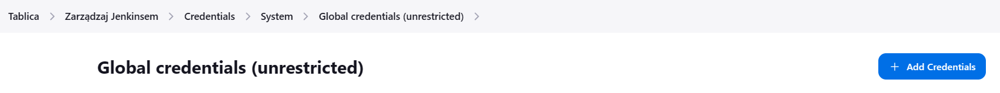

Powyższe dodane uwierzytelniajce, są przypisywane do zmiennych środowiskowych w pliku Jenkinsfile, za pomocą linijki:

```
withCredentials([usernamePassword(credentialsId: 'docker-hub-credentials', usernameVariable: 'DOCKER_USERNAME', passwordVariable: 'DOCKER_PASSWORD')])
``` 
Następnie loguję się do DockerHuba przy pomocy polecenia:

```
sh 'docker login -u $DOCKER_USERNAME -p $DOCKER_PASSWORD'
```

Kolejny etap to otagowanie obrazu przy pomocy polecenia:

```
sh 'docker tag deploy $DOCKER_USERNAME/deploy:${VERSION}-${RELEASE}'
```
W ten sposób obraz jest gotowy do wysłania na DockerHuba poleceniem:

```
sh 'docker push $DOCKER_USERNAME/deploy:${VERSION}-${RELEASE}'
```
Widok otagowanego obrazu na DockerHubie:

  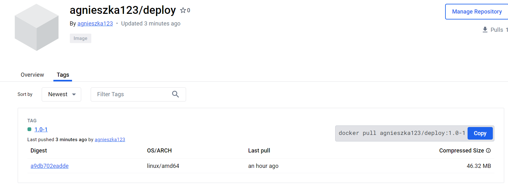

Wybrany przeze mnie sposób wersjonowania to Semantic Versioning, gdzie samemu ustalam numer wersji i wydania, co przy tak dużej ilości testowania rozwiązań w piplinie jest po prostu wygodniejsze. W przyszłości, gdy nasz projekt będzie stabilny, można zmienić na automatyczną zmianę wesji lub wydania na podstawie commita. 

#### Przeprowadzenie testu poprawności obrazu deploy 

Z DockerHuba skopiowałam komendę do pobrania mojego obrazu:

```
docker pull agnieszka123/deploy:1.0-1
```
Pobranie obrazu na maszynie wirtualnej:

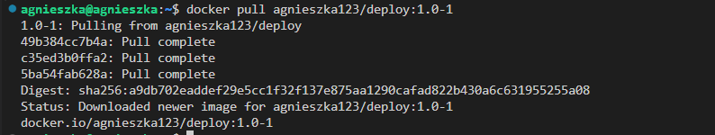

Ważne, żeby pobierać obraz z konkretnym tagiem, bo same użycie polecenia `docker pull agnieszka123/deploy` nie zadziała. 

Uruchomienie kontenera na obrazie wdrożeniowym irssi:

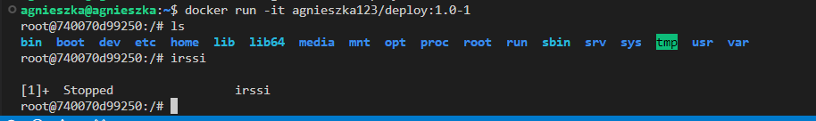

Widok działającej aplikacji irssi w kontenerze:

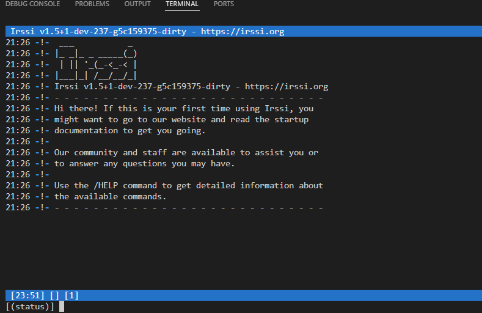

#### Jenkinsfile z SCM  

W kolejnym etapie dodałam Jenkinsfile na nasze repozytorium pod ścieżką `MDO2024_INO/blob/AG410734/INO/GCL1/AG410734/Sprawozdanie3/Jenkinsfile`. Aby Jenkinsfile był pobierany z GitHuba należało zmienić konfigurację pipeline.

W ustawieniach projektu, należało wybrać opcję `Pipeline script from SCM` i podać link do repozytorium:

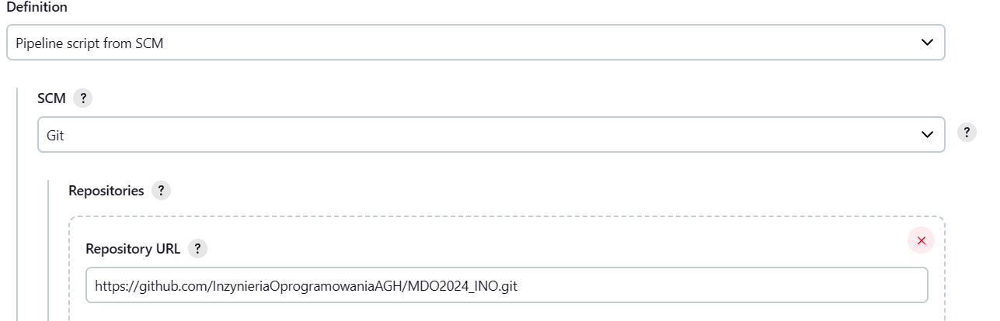

Następnie zmianiłam gałąź na swoją i podałam ścieżkę do pliku:

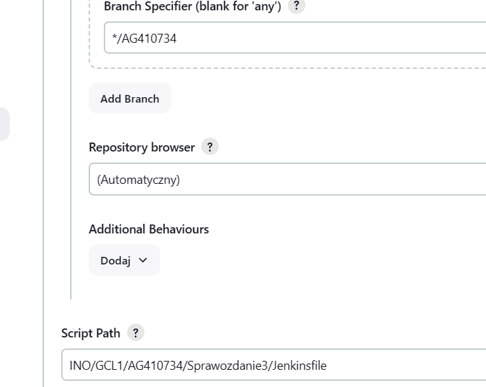

#### Podsumowanie

Ostatecznie Stage View dla pipeline wygląda w ten sposób:

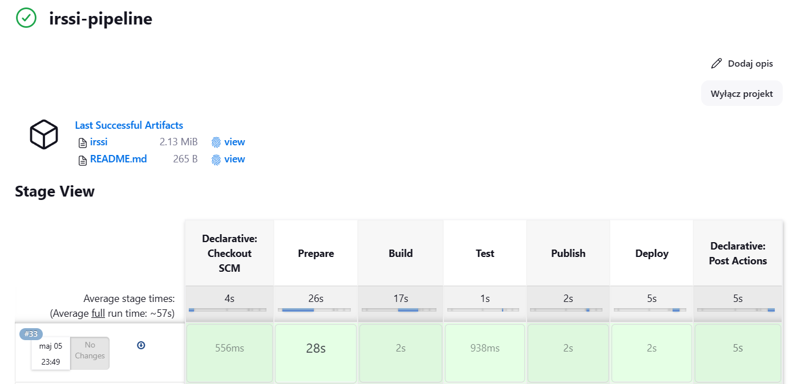

Zarchiwizowane artefkaty to logi pipeline'a, plik wykonywalny i README.md tłumaczące jak go używać:

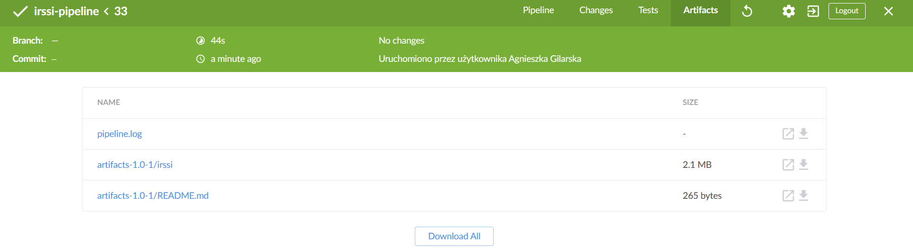

Plik Jenkinsfile:

```
pipeline {
    agent any
    
    environment {
        VERSION = '1.0'
        RELEASE = '1'
    }
    
    stages {
        stage('Prepare') {
            steps {
                sh 'docker stop $(docker ps -q) || true'
                sh 'docker rm -f $(docker ps -a -q) || true'
                sh 'docker rmi -f $(docker images -q) || true'
                sh 'rm -rf MDO2024_INO'
                sh 'git clone https://github.com/InzynieriaOprogramowaniaAGH/MDO2024_INO.git'
                dir("MDO2024_INO") {
                    sh 'git checkout AG410734'
                }
            }
        }
        
        stage('Build') {
            steps {
                dir("MDO2024_INO/INO/GCL1/AG410734/Sprawozdanie3/irssi-pipeline") {
                    sh 'docker build -t bldr -f BLDR.Dockerfile .'
                }
            }
        }
        
        stage('Test') {
            steps {
                dir("MDO2024_INO/INO/GCL1/AG410734/Sprawozdanie3/irssi-pipeline") {
                    sh 'docker build -t tstr -f TSTR.Dockerfile .'
                }
            }
        }
        
        stage('Publish') {
            steps {
                dir("MDO2024_INO/INO/GCL1/AG410734/Sprawozdanie3/irssi-pipeline") {
                    sh "docker build -t publish -f PB.Dockerfile --build-arg VERSION=${VERSION} --build-arg RELEASE=${RELEASE} ."
                    sh "mkdir -p artifacts-${VERSION}-${RELEASE}"
                    sh "mv README.md artifacts-${VERSION}-${RELEASE}/"
                    sh 'docker create --name publish_temp publish'
                    sh "docker cp publish_temp:/artifacts-${VERSION}-${RELEASE}/irssi artifacts-${VERSION}-${RELEASE}"
                    sh 'docker rm -f publish_temp'
                }
            }
        }
        
        stage('Deploy') {
            steps {
                dir("MDO2024_INO/INO/GCL1/AG410734/Sprawozdanie3/irssi-pipeline") {
                    sh "docker build -t deploy -f DEPLOY.Dockerfile --build-arg VERSION=${VERSION} --build-arg RELEASE=${RELEASE} ."
                    sh "docker run -it -d --name irssi-${VERSION}-${RELEASE} deploy"
                    sh "docker exec irssi-${VERSION}-${RELEASE} sh -c 'irssi --version && irssi --help'"
                    sh "docker logs irssi-${VERSION}-${RELEASE}"
                }
            }
        }
    }
    
    post {
        success {
            dir("MDO2024_INO/INO/GCL1/AG410734/Sprawozdanie3/irssi-pipeline") {
            script {
                
                archiveArtifacts artifacts: "artifacts-${VERSION}-${RELEASE}/irssi, artifacts-${VERSION}-${RELEASE}/README.md", fingerprint: true, onlyIfSuccessful: true
                }
            }
            script {
                withCredentials([usernamePassword(credentialsId: 'docker-hub-credentials', usernameVariable: 'DOCKER_USERNAME', passwordVariable: 'DOCKER_PASSWORD')]) {
                    sh 'docker login -u $DOCKER_USERNAME -p $DOCKER_PASSWORD'

                    sh 'docker tag deploy $DOCKER_USERNAME/deploy:${VERSION}-${RELEASE}'
                    sh 'docker push $DOCKER_USERNAME/deploy:${VERSION}-${RELEASE}'
                }
            }
        }
    }
}
```
Porównując początkowe założenia i produkt końcowy, mogę stwierdzić, że w większości udało się osiągnąć zaplanowany efekt. Różnica, którą dostrzegam to realcja pomiędzy obrazem `Publish`, a `Deploy` na diagramie wdrożeniowym UML. Relacja przedstawiona na diagramie jest pewnym uproszczeniem, gdzie artefakty są bezpośrenio kopiowane z `Publish` do `Deploy`. W rzeczywistości jest tworzony kontener pomocniczy, pomagający skopiować artefakty do folderu i dopiero z tego folderu kopiowane są w obrazie `Deploy`. Podejście to obchodzi potrzebę tworzenia sieci docker, w ramch której dwa niezależne konteney mogłyby siebie widzieć i nawzajem od siebie kopiować pliki. 

**"Definition of done"**
 - Czy opublikowany obraz może być pobrany z Rejestru i uruchomiony w Dockerze bez modyfikacji (acz potencjalnie z szeregiem wymaganych parametrów, jak obraz DIND)?

Tak, pobrany obraz zawiera wszystko co niezbędne wraz z aplikacją irssi. 

 - Czy dołączony do jenkinsowego przejścia artefakt, gdy pobrany, ma szansę zadziałać od razu na maszynie o oczekiwanej konfiguracji docelowej?

Tak, jednak najpierw należy się zapoznać z dołączonym artefaktem README.md, w którym znajduje się informacja o potencjalnych dependencjach, które należałoby doinstalować. 
