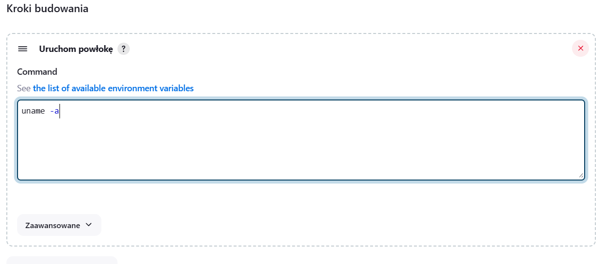
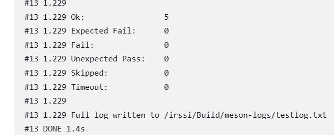

# Sprawozdanie 3
## Pipeline, Jenkins, izolacja etapów

**Cel sprawozdania:** 
### Przygotowanie


Na początku upewniłam się, że kontenery utworzone na poprzednich zajęciach za pomocą docker compose działają. W tym celu w katalogu, gdzie znajduje się docker-compose uruchomiłam kontenery za pomocą komendy:

```
docker-compose up
```

  

Można zauważyć logi, potwierdzające że kontenery się uruchomiły i zaraz zamknęły. Zawartość pliku docker-compose znajduje się w ostatnim sprawozdaniu, z tą zmianą, że usunęłam sieć irssi-network, żeby uniknąć na początek dodatkowych komplikacji. 

W kolejnym kroku uruchomiłam obraz eksponujący środowisko zagnieżdżone Dockera i Blueocean zgodnie z dokumntacją  https://www.jenkins.io/doc/book/installing/docker/.

  


Przeszłam do przeglądarki i otworzyłam Jenkinsa pod adresem http://192.168.1.199:8080/. Zalogowałam się. 

  

  

Blue Ocean to interfejs użytkownika Jenkinsa, który oferuje nowoczesne, interaktywne narzędzia do zarządzania Jenkinsem oraz przepływami pracy (pipelines). Po wejściu w Blue Ocean pokazuje się przyjazny UI do tworzenia pipelinów:


  

### Przygotowanie
#### Konfiguracja wstępna i pierwsze uruchomienie

W celu utworzenia projektu wyświetlającego `uname`, kliknęłam w Jenkinsie `Nowy projekt`, następnie wybrałam opcję `Ogólny projekt` i nadałam nazwę 'uname project'.

 

W krokach budowania, wybralam opcję `uruchom powłokę`, której to zostanie wywołane polecenie `uname -a`

  

Logi po uruchomieniu:

  

Kolejny projekt, to skrypt zwracający błąd, gdy godzina jest nieparzysta. Analogicznie do poprzeniego utworzyłam nowy projekt, który nazwałam 'hour project'. Składnia skryptu:

```
#!/bin/bash
hour=$(date +%H)

if [ $((hour % 2)) -ne 0 ]; then
    echo "Błąd: Aktualna godzina jest nieparzysta"
    exit 1
else
    echo "Aktualna godzina jest parzysta"
fi
```

Akurat zadanie zostało wykonane z powodzeniem, bo godzina była parzysta.

  

Ponieważ zależało mi, żeby job wykonał się o godzinie nieparzystej, skonfigurowałam go, żeby wykonał się znowu o wybranej godzinie. W tym celu w konfiguracji przeszłam do zakładki `wyzwalacze budowania` i zaznaczyłam `buduj cyklicznie`, następnie w harmonogramie wpisałam godzinę 17.


Po godzinie 17 wykonało się zadanie i zwróciło log:


#### Budowanie obrazów irssi

Celem zadania, było sklonowanie naszego repozytorium, przejścia do pliku docker-compose na swojej gałęzi i zbudowanie z tego pliku obrazów.

Analogicznie utworzyłam nowy projekt w Jenkinsie, który nazwałam `irssi project`. Wybrałam opcję repoztytorium kodu Git i wkleiłam ścieżkę do naszego repozytorium.


Następnie wybrałam moją gałąż


W kolejnym kroku zdefiniowałam ścieżkę do mojego pliku docker-compose.yml i wywołałam polecenie budujące obrazy z tego pliku.


Pierwszym poważniejszym problemem, który napotkałam w trackie budowania, był brak docker compose w Jenkinsie.

W celu rozwiązania problemu, przeszłam do kontenera `jenkins-blueocean` i za pomocą dokumentacji ze strony https://docs.docker.com/compose/install/linux/#install-using-the-repository zainstalowałam manualnie `docker compose` w kontenerze. 


Drugim napotkanym problemem okazało się nadawanie domyślnej nazwy pierwszemu zbudowanemu obrazowi, co powodowało błąd przy próbie zbudowania testera z obrazu o nazwie `bldr`. Aby rozwiązać ten problem musiałam zmodyfikować plik `docker-compose.yml` tak aby nadawać obrazom konkretne nazwy, wykorzystując parametr `image:`


```
version: '3.3'

services:
  builder:
    build:
      context: .
      dockerfile: BLDR.Dockerfile
    image: bldr

  tester:
    build:
      context: .
      dockerfile: TSTR.Dockerfile
    image: tstr
    depends_on:
      - builder

networks:
  irssi_network:
    driver: bridge
```
Po wprowadzeniu poprawek, obrazy zostały zbudowane. 

  

  


#### Pipeline

W celu realizacji pierwszego pipeline'a składającego się z trzech etapów, napisałam Jenkinsfile, który w stage `Clone` klonuje nasze repozytorium i przełącza się na moją gałąź, przy okazji usuwa wcześniej sklonowane repozytorium, w stage `Build` buduje z pliku BLDR.Dockerfile obraz odpowiedzialny za budowanie aplikacji. Następnie w stage `Test` buduje obraz z pliku TSTR.Dockerfile, który testuje aplikację. 

```
pipeline {
    agent any
    
    stages {
        stage('Clone') {
            steps {
                sh 'rm -rf MDO2024_INO'
                sh 'git clone https://github.com/InzynieriaOprogramowaniaAGH/MDO2024_INO.git'
                dir("MDO2024_INO"){
                    sh 'git checkout AG410734'
                }
            }
        }
        
        stage('Build') {
            steps {
                dir("MDO2024_INO/INO/GCL1/AG410734/Sprawozdanie2"){
                    sh 'docker build -t bldr -f BLDR.Dockerfile .'
                }
            }
        }
        
        stage('Test') {
            steps {
                dir("MDO2024_INO/INO/GCL1/AG410734/Sprawozdanie2"){
                    sh 'docker build -t tstr -f TSTR.Dockerfile .'
                }
            }
        }
    }
}
```
  Wynik przeprowadzonego pipeline'a:

  

Wybrane podejście to użycie dedykowanego kontenra DIND. Plik Jenkinsfile umieściłam w repozytorium.

**Różnica pomiędzy podejściem DIND a CI**
Docker-in-Docker (DIND):
 - W tym podejściu, Jenkins uruchamia kontener Docker wewnątrz innego kontenera Docker. Pozwala to na budowanie, testowanie i wdrażanie aplikacji w izolowanym środowisku kontenera Docker, wewnątrz pipeline Jenkinsa.
- Kontener Docker wewnątrz innego kontenera Docker jest izolowany od środowiska hosta Jenkinsa. To zapewnia większą kontrolę nad środowiskiem Docker oraz pozwala na uniknięcie konfliktów z innymi procesami Dockera na hoście.

Budowanie na dedykowanym kontenerze CI:

- W tym podejściu, Jenkins wykonuje operacje budowania i testowania bezpośrednio na kontenerze CI, który może być hostowany na fizycznym lub wirtualnym serwerze.
- Wykonując operacje bezpośrednio na kontenerze CI, unikamy dodatkowych zasobów zużywanych przez kontener Docker wewnątrz kontenera Docker. Może to być szczególnie korzystne w środowiskach gdzie te zasoby są mocno ograniczone.

