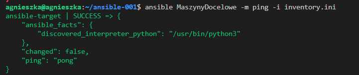

# Sprawozdanie 4
**Cel sprawozdania** : 
## Automatyzacja i zdalne wykonywanie poleceń za pomocą Ansible

### Instalacja zarządcy Ansible

W pierwszej kolejności utworzyłam nową maszynę wirtualną z takim samym systemem operacyjnym, jak maszyna na której pracuję. System operacyjny to Ubuntu 20.04 LTS.

Nadałam nazwę użytkownika `ansible` i hostname `ansible-target`:

  

Utworzona maszyna: 

  

Podstawowe informacje o maszynie:

  

Z repozytorium dystrybucji https://docs.ansible.com/ansible/latest/installation_guide/installation_distros.html#installing-ansible-on-ubuntu zainstalowałam oprogramowanie Ansible przy użyciu komend:

```
$ sudo apt update
$ sudo apt install software-properties-common
$ sudo add-apt-repository --yes --update ppa:ansible/ansible
$ sudo apt install ansible
```

  

W Ubuntu zazwyczaj domyślnie jest już zainstalowany tar i OpenSSH, ale żeby się upewnić możemy wpisać polecenia:

```
which tar
dpkg -l | grep openssh-server
```
Żeby sprawdzić czy serwer SSH jest uruchomiony należey wpisać:

```
sudo systemctl status ssh
```

Żeby włączyć:

```
sudo systemctl start ssh
```
**Wymiana kluczy ssh**
Aby wygenerować klucz ssh należy użyć polecenia (szczegółowo generowanie klucza opisałam w Sprawozdaniu 1):

```
ssh-keygen 
```

W celu wymiany kluczy używam polecenia:

```
ssh-copy-id -i ~/.ssh/id_rsa.pub ansible@192.168.1.104
```
Gdzie po parametrze `-i` podaję ścieżkę do klucza publicznego, a nastęnie adres docelowy użytkownika i ip docelowe.

Aby sprawdzić, czy klucz prawidłowo się przekopiował, można użyć polecenia na maszynie docelowej:

```
cat ~/.ssh/authorized_keys
```
Klucz prawidłowo się przekopiował:

  

Sprawdzam czy mogę się połączyć z maszyną bez konieczności podawania hasła poleceniem: 

```
ssh ansible@192.168.1.104
```

Połączenie z maszyną przebiega bez konieczności podawania hasła:

  

To samo robię w drugą stronę, żeby maszyny widziały się nawzajem bez konieczności podawania hasła w jakąkolwiek stronę.

Kopiowanie klucza:


Połączenie bez konieczności podawania hasła:


### Inwentaryzacja

Moje dwie maszyny mają już nadane przewidywalne nazwy:


Jednak gdyby tak nie było można to zrobić poleceniem:

```
hostnamectl set-hostname nowa-nazwa-hosta
```
Aby ustawić nazwy DNS dla maszyn wirtualnych, bez konieczności łączenia sie po IP, wchodzę do folderu `/etc/hosts` i ustawiam nazwę maszyny dla danego adresu IP:

W agnieszka@agnieszka wpisuję:


W ansible@ansible-target wpisuję:


Sprawdzam czy maszyny widzą się nawzajem po nazwie DNS:


W celu sprawdzenia poprawności połączenia można użyć jeszcze polecenia `ping`:


W kolejnym kroku za pomocą dokumentacji: https://docs.ansible.com/ansible/latest/getting_started/get_started_inventory.html buduję plik inwentaryzacji.

Tak jak na ćwiczeniach tworzę nowy katalog, w którym umieszczam plik `inventory.ini`.

Treść pliku `inventory.ini`:

```
[MaszynyDocelowe]
ansible-target ansible_user=ansible
```

Następnie wyświetlam maszyny zdefiniowane w pliku inventory (w tym przypadku inventory.ini) w formacie JSON za pomocą polecenia:

```
ansible-inventory -i inventory.ini --list
```


Następnie weryfikuję, czy ansible może połączyć się ze zdefiniowaną w pliku maszyną poleceniem:

```
ansible-inventory -i inventory.ini --list
```



W moim przypadku ważne było, żeby dodać do pliku `inventory.ini` nazwę użytkownika, ponieważ domyślnie nadawało mi nazwę użytkownika z maszyny z ansiblem, co powowdowało błąd połączenia. 

Zmodyfikowałam plik tak, aby zawierał sekcję [Orchestrators] - zawiera nazwę, pod którą będziemy odwoływać się do tej konkretnej maszyny w innych plikach konfiguracyjnych lub w playbookach Ansible, a także sekcję [Endpoints], zawierającą maszyny docelowe :

```
[Orchestrators]
orchestrator ansible_host=agnieszka ansible_user=agnieszka

[Endpoints]
01 ansible_host=ansible-target ansible_user=ansible

[all:children]
Orchestrators
Endpoints
```
Po wywołaniu `ansible ping` pojawił się błąd połaczenia z orchestratorem, żeby to naprawić dodałam do `known-hosts` klucz publiczny maszyny z ansiblem. Po dodaniu klucza wszystkie połączenia zakończyły się sukcesem:


### Zdalne wywoływanie procedur 

Na podstawie podanej dokumnetacji https://docs.ansible.com/ansible/latest/getting_started/get_started_playbook.html tworzę playbooka Ansible.

Na początku wsyłam żądanie `ping` do wszystkich maszyn:
```
- name: Ping all hosts
  hosts: all
  become: false
  tasks:
    - name: Ping all hosts
      ping:
```
Następnie kopiuję plik inwentryzacji z maszyny `Orchestratora` na maszynę `Endopoint` pod ścieżkę `/home/ansible/inventory_first.ini`. W kolejnym tasku w celu ponowienia operacji i sprawdzenia różnic w wyjściu, kopiuję plik inwentaryzacji jeszcze raz, nadaję nazwę `inventory_second.ini` i porównuję poleceniem `diff` z pierwszym skopiowanym. Operator || true sprawia, że nawet jeśli diff wykryje różnice i zakończy się błędem (z kodem wyjścia różnym od zera), zadanie nie zostanie oznaczone jako niepowodzenie. Wynik polecenia diff jest rejestrowany w zmiennej diff_output, a następnie wyświetlany.

```
- name: Copy inventory file to endpoints and compare
  hosts: Endpoints
  become: false
  tasks:
    - name: Copy inventory file to endpoints - first run
      copy:
        src: inventory.ini
        dest: /home/ansible/inventory_first.ini

    - name: Copy inventory file to endpoints - second run
      copy:
        src: inventory.ini
        dest: /home/ansible/inventory_second.ini

    - name: Check differences after second copy
      shell: diff /home/ansible/inventory_first.ini /home/ansible/inventory_second.ini || true
      register: diff_output

    - name: Display diff output
      debug:
        var: diff_output.stdout_lines
```
Kolejna część playbooka, to aktualizacja pakietów na `Endpoints`, za pomocą `apt update cache`. Wynik jest zapisywany w `update_output` i w kolejnym tasku wyświetlany. Kolejne taski to restartowanie usługi `sshd` i `rngd`, która w moim przypadku jest częścią pakietu `rng-tools` (system oparty na Ubuntu).

```

- name: Update packages and restart services
  hosts: Endpoints
  become: true
  tasks:
    - name: Update package repositories
      apt:
        update_cache: yes
      register: update_output

    - name: Display update output
      debug:
        msg: "{{ update_output }}"

    - name: Restart sshd service using systemd
      systemd:
        name: sshd
        state: restarted

    - name: Restart rngd service
      service:
        name: rng-tools
        state: restarted
```
Playbooka wykonuję poleceniem:

```
ansible-playbook -i inventory.ini --ask-become-pass playbook.yml
```
gdzie:

Flaga `-i` określa plik inwentaryzacji, który zawiera listę wszystkich maszyn, na których zostaną wykonane operacje zdefiniowane w playbooku. W tym przypadku plik inwentaryzacji to inventory.ini.

Flagi `--ask-become-pass` wymagają od użytkownika podania hasła uprawnień (sudo) przed uruchomieniem playbooka. Jest to potrzebne, ponieważ w playbooku jest ustawiona opcja become: true.

`playbook.yml` określa nazwę pliku playbooka, który chcę uruchomić.

Wynik wykonania playbooka:


Wyniki wskazują, że wszystkie zadania na obu hostach zostały wykonane pomyślnie, przy czym na hoście 01 wprowadzono sześć zmian w systemie, podczas gdy na hoście orchestrator nie było żadnych zmian. Można zauważyć, że w sumie w raporcie końcowym po wykonaniu playbooka dostępnych jest 7 stanów:
- `ok` - liczba zadań, które zostały pomyślnie wykonane bez wprowadzania żadnych zmian.

- `changed` - liczba zadań, które wprowadziły zmiany w systemie.

- `unreachable` - liczba hostów, z którymi Ansible nie był w stanie się połączyć.

- `failed` - liczba zadań, które zakończyły się niepowodzeniem.

- `skipped` - liczba zadań, które zostały pominięte (np. z powodu niespełnienia określonych warunków).

- `rescued` - liczba zadań, które zostały "uratowane" przez bloki rescue po wystąpieniu błędu.

- `ignored` - liczba zadań, które zakończyły się błędem, ale błąd został zignorowany (np. dzięki ignore_errors).

!!!!!!!!!!!

### Zarządzanie kontenerem

W tym podpunkcie będę realizowała wdrożenie mojego kontenera z `irssi` na maszynie `ansible-target`.

Na początek przechodzę do maszyny `ansible-target` i instaluję niezbędne biblioteki, aby moduł Ansible używany w playbooku do zarządzania kontenerami Docker'a działał poprawnie. Instaluję menedżer pakietów Pythona `pip` dla Pythona 3 i pakiet `docker`. 

```
sudo apt install python3-pip
pip3 install docker
```
Sprawdzam czy instalacja się powiodła poleceniem:

```
pip3 show docker
```


Należy także pamiętać o dodaniu uzytkownika do grupy Docker poleceniem:

```
sudo usermod -aG docker nazwa_użytkownika
```

Wracam do hosta i w pierwszej kolejności na podstawie dokumentacji https://docs.ansible.com/ansible/latest/playbook_guide/playbooks_reuse_roles.html tworzę szkielet roli poleceniem:

```
ansible-galaxy init irssi_deploy
```
Zdjęcie terminala po wykonaniu polecenia:


Struktura utworzonego katalogu:

```
irssi_deploy/
├── README.md
├── defaults
│   └── main.yml
├── files
├── handlers
│   └── main.yml
├── meta
│   └── main.yml
├── tasks
│   └── main.yml
├── templates
├── tests
│   ├── inventory
│   └── test.yml
└── vars
    └── main.yml
```
W pliku `defaults/main.yml` umieszczam domyślne wartości zmiennych używanych w roli.

```
---
# defaults file for irssi_deploy
docker_image: "agnieszka123/deploy:1.0-1"
container_name: "irssi_container"
host_port: 6667
container_port: 6667
volume_source: "/home/agnieszka/repo/MDO2024_INO/INO/GCL1/AG410734/Sprawozdanie3/irssi-pipeline/README.md"
volume_target: "/usr/README.md"

```
W pliku `tasks/main.yml` definuję zadanie do wykonania przez Ansible'a.
Pierwsze zadanie sprawdza, czy Docker jest zainstalowany na maszynie docelowej, wykonując polecenie `docker --version`. Wynik jest rejestrowany w zmiennej `docker_version`. Jeśli polecenie nie zwróci statusu wyjścia równego 0 (czyli nie powiedzie się), zadanie zostanie oznaczone jako niepowodzenie.

```
- name: Check if Docker is installed
  command: docker --version
  register: docker_version
  failed_when: docker_version.rc != 0
  changed_when: false
```
Następnie definuję zadanie pobierające obraz wdrażający `irssi` z DockerHub:

```
- name: Pull Docker image
  docker_image:
    name: "{{ docker_image }}"
    source: pull
```
Kolejne zadanie wykorzystuje moduł `docker_container`, aby utworzyć i uruchomić kontener na podstawie wcześniej pobranego obrazu. Określa także porty, na których ma być nasłuchiwane `irssi` oraz wolumeny, które mają być podłączone do kontenera, tak aby była wykonana instrukcja  *"podłącz storage oraz wyprowadź port"*. W moim przypadku volumen źródłowy udostępnia plik README.md, który jest artefaktem z poprzednich zajęć i określa niezbędne zależności w kontenerze z plikiem wykonywalnym `irssi`. W konfiguracji tego zadania określono, że kontener powinien zostać uruchomiony z opcją restartowania polityki "always". Oznacza to, że kontener zostanie automatycznie uruchomiony ponownie w razie awarii lub zatrzymania. Uruchamiam `Irssi` wewnątrz kontenera.

```
- name: Run the Irssi container
  docker_container:
    name: "{{ container_name }}"
    image: "{{ docker_image }}"
    state: started
    ports:
      - "{{ host_port }}:{{ container_port }}"
    volumes:
      - "{{ volume_source }}:{{ volume_target }}"
    restart_policy: always
```
W ostatnim zadaniu zatrzymuję i usuwam kontener, który został wcześniej utworzony. W tym celu używam również modułu `docker_container`.

```
- name: Stop and remove the container
  docker_container:
    name: "{{ container_name }}"
    state: absent
```
Gdy skonfiguruję szkielet roli, definiuję palybooka `deploy-irssi.yml`, który będzie wywoływał tę rolę. Zadania zdefiniowane w roli będą wykonywane przez maszyny docelowe `Endpoints`:

```
---
- hosts: Endpoints
  roles:
    - irssi_deploy
```
Zdefiniowanego playbooka `deploy-irssi.yml` uruchamiam poleceniem:

```
ansible-playbook -i inventory.ini deploy_irssi.yml
```
Wynik działania:


5 zadań zakończyło się sukcesem, w tym 2 spowodowały zmiany w systemie. W pierwszym przypadku kontener został uruchomiony i aplikacja `Irssi` została uruchomiona wewnątrz niego. W drugim przypadku kontener został zatrzymany i usunięty.

Pliki z części sprawozdania **zdalane wywoływania procedur** i **zarządzanie kontenerem**, zostały umieszczone w repozytorium w folderze `Sprawozdanie4/ansible`.