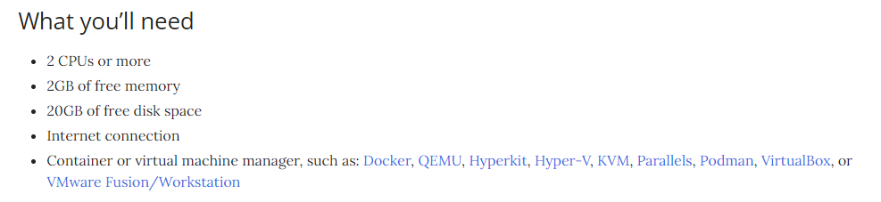
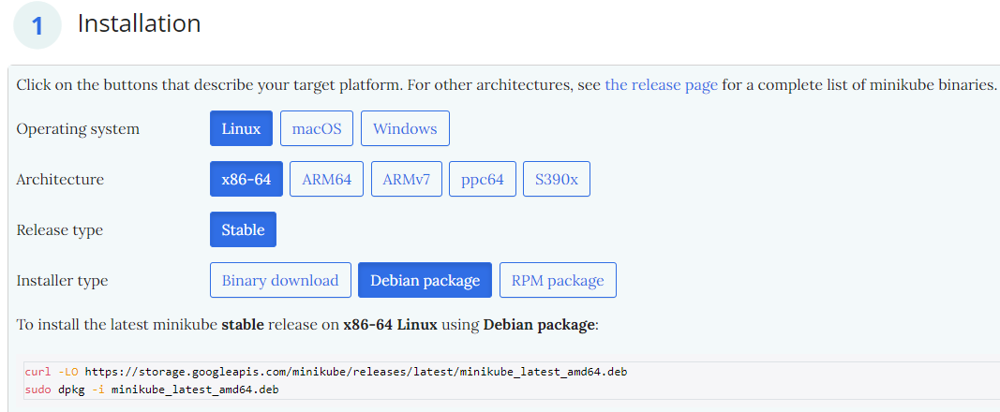
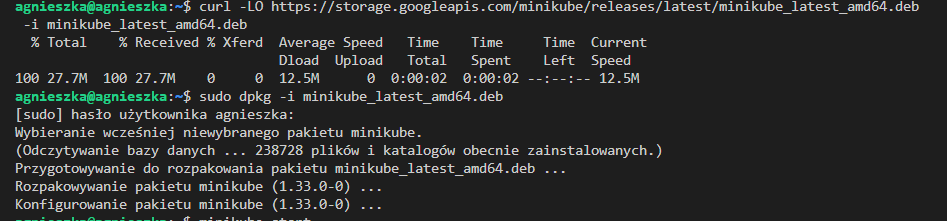
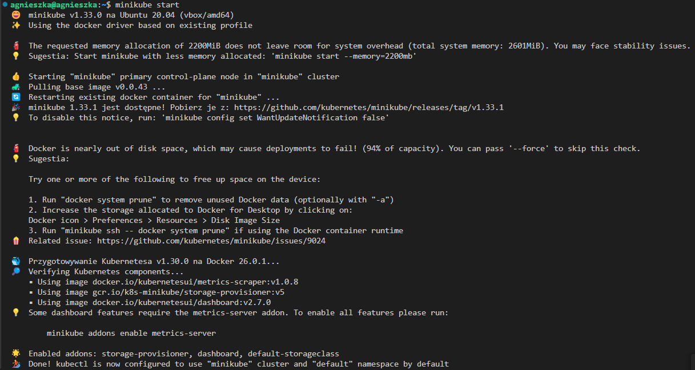
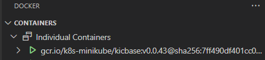
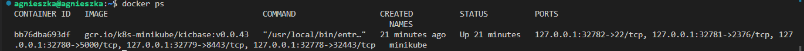
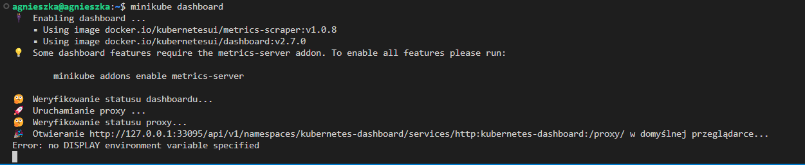

# Sprawozdanie 5
**Cel sprawozdania** 

## Wdrażanie na zarządzalne kontenery: Kubernetes (1)

### Instalacja klastra Kubernetes

Na  początku instaluję `minikube` zgodnie z dokumentacją ze strony https://minikube.sigs.k8s.io/docs/start/. 

Upewniam się, że moja maszyna spełnia wstępne wymagania:



Dostosowuję instalację do mojego systemu:



Użyte polecenia: 

```
curl -LO https://storage.googleapis.com/minikube/releases/latest/minikube-linux-amd64
sudo dpkg -i minikube_latest_amd64.deb
```



Uruchamiam `minikube` poleceniem:
```
minikube start
```




Pomimo ostrzeżenia o małej pamięci `minikube` poprawnie się uruchomił. Zgodnie z sugestią użyłam do wyczyszczenia dockera z nieużywanych kontenerów polecenia:
```
docker system prune
```
Uruchomiony kontener minikube:





Instaluję narzędzie `kubectl` do interakcji z klastrem Kubernetes poleceniami z dokumentacji https://kubernetes.io/docs/tasks/tools/install-kubectl-linux/:

```
curl -LO "https://dl.k8s.io/release/$(curl -L -s https://dl.k8s.io/release/stable.txt)/bin/linux/amd64/kubectl"

sudo install -o root -g root -m 0755 kubectl /usr/local/bin/kubectl
```
Poprawność zainstalowania można sprawdzić poleceniem:

```
kubectl version --client
```
Uruchamiam dashboard poleceniem:
```
minikube dashboard
```



Komunikat `Error: no DISPLAY environment variable specified` oznacza, że `Minikube` próbował otworzyć przeglądarkę graficzną, ale zmienna środowiskowa `DISPLAY` nie jest ustawiona. Jednak gdy się skopiuje link i wklei do wybranej przeglądarki to pokazuje się poprawnie okno z dashboardem:


