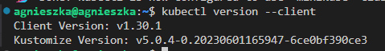
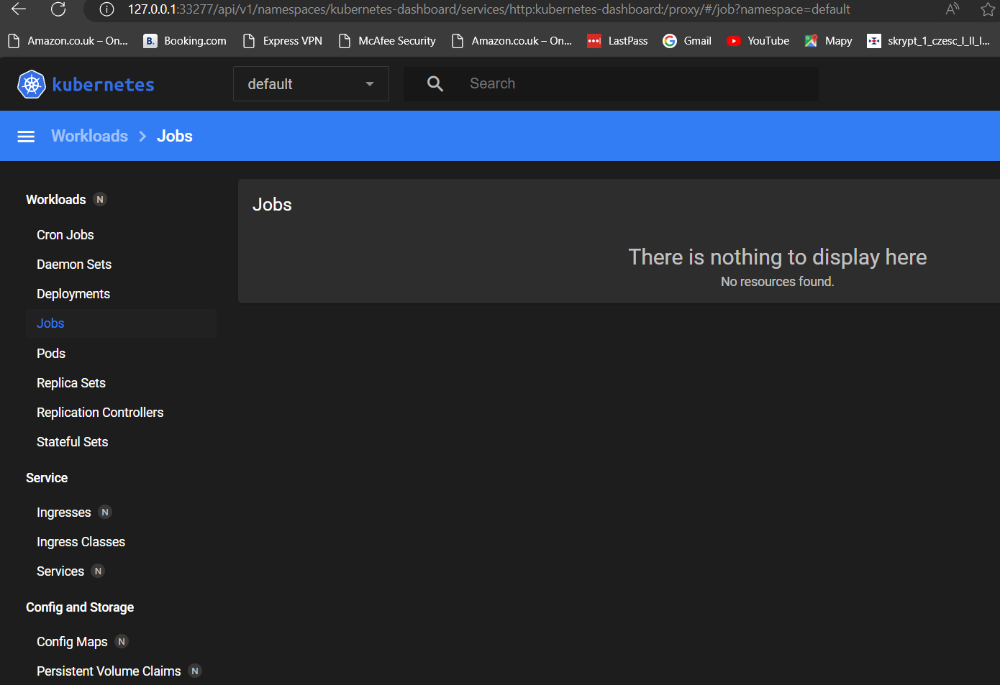
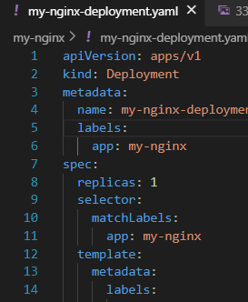

# Sprawozdanie 5
**Cel sprawozdania** - Wdrożenie aplikacji przy użyciu Kubernetesa, nauka różnych strategii wdrożenia

## Wdrażanie na zarządzalne kontenery: Kubernetes (1)

### Instalacja klastra Kubernetes

Na  początku instaluję `minikube` zgodnie z dokumentacją ze strony https://minikube.sigs.k8s.io/docs/start/. 

Upewniam się, że moja maszyna spełnia wstępne wymagania:


Dostosowuję instalację do mojego systemu:


Użyte polecenia: 

```
curl -LO https://storage.googleapis.com/minikube/releases/latest/minikube-linux-amd64
sudo dpkg -i minikube_latest_amd64.deb
```


Uruchamiam `minikube` poleceniem:
```
minikube start
```


Pomimo ostrzeżenia o małej pamięci `minikube` poprawnie się uruchomił. Zgodnie z sugestią użyłam do wyczyszczenia dockera z nieużywanych kontenerów, obrazów i sieci polecenia:
```
docker system prune -a
```

Przydzieliłam też maszynie większą ilość pamięci RAM, po czym uruchomiłam kontener jeszcze raz, tym razem `minikube` nie zgłosił żadnych ostrzeżeń związanych z zasobami:


Uruchomiony kontener minikube:


Instaluję narzędzie `kubectl` do interakcji z klastrem Kubernetes poleceniami z dokumentacji https://kubernetes.io/docs/tasks/tools/install-kubectl-linux/:

```
curl -LO "https://dl.k8s.io/release/$(curl -L -s https://dl.k8s.io/release/stable.txt)/bin/linux/amd64/kubectl"

sudo install -o root -g root -m 0755 kubectl /usr/local/bin/kubectl
```
Poprawność zainstalowania można sprawdzić poleceniem:

```
kubectl version --client
```



Uruchamiam dashboard poleceniem:
```
minikube dashboard
```


Komunikat `Error: no DISPLAY environment variable specified` oznacza, że `Minikube` próbował otworzyć przeglądarkę graficzną, ale zmienna środowiskowa `DISPLAY` nie jest ustawiona. Jednak gdy się skopiuje link i wklei do wybranej przeglądarki to pokazuje się poprawnie okno z dashboardem:



#### Koncepcje i obiekty używane przez Kubernetesa:

**Pod** -  to podstawowa jednostka operacyjna w Kubernetesie. Jest to najmniejsza i najprostsza jednostka, którą można tworzyć, wdrażać i zarządzać. Pod zawiera jeden lub więcej kontenerów (zwykle Docker), które dzielą zasoby i sieć. Wszystkie kontenery w podzie współdzielą ten sam adres IP i przestrzeń nazw.

**Deployment** - to zasób Kubernetesa, który zapewnia deklaratywny sposób zarządzania aplikacjami. Pozwala na:

 - Wdrażanie aplikacji,
 - Aktualizowanie aplikacji,
 - Skalowanie aplikacji (w górę lub w dół),
 - Rollback (przywracanie do wcześniejszych wersji).

**ReplicaSet** - to zasób, który zapewnia określoną liczbę replik danego poda w danym czasie. Jest używany głównie wewnętrznie przez Deploymenty do utrzymania pożądanej liczby replik.

**Service** - to zasób Kubernetes, który umożliwia odkrywanie usług i balansowanie obciążenia. Zapewnia stały adres IP i nazwę DNS, którą inne pody mogą używać do komunikacji.

**Namespace** - to mechanizm, który zapewnia izolację dla grup zasobów w klastrze. Używany do organizowania zasobów i umożliwiania współdzielenia jednego klastra przez wiele użytkowników.

**ConfigMap** - to zasób Kubernetes używany do przechowywania danych konfiguracyjnych w postaci par klucz-wartość. ConfigMap umożliwia oddzielenie konfiguracji od obrazu kontenera, co ułatwia zarządzanie konfiguracją aplikacji.

**Secret** to podobny do ConfigMap zasób, ale przeznaczony do przechowywania wrażliwych danych, takich jak hasła, tokeny OAuth, klucze SSH itp. Dane przechowywane w Secret są zaszyfrowane.

**Volume** to mechanizm, który pozwala na trwałe przechowywanie danych, które mogą być współdzielone przez kontenery w podzie. Kubernetes obsługuje różne typy wolumenów, w tym lokalne dyski, NFS, AWS EBS, Google Persistent Disk i inne.

**StatefulSet**  - to zasób, który zarządza wdrażaniem i skalowaniem zestawu podów oraz zapewnia gwarancje dotyczące ich kolejności i tożsamości. StatefulSet jest używany do zarządzania stateful aplikacjami, które wymagają stałych identyfikatorów, takich jak bazy danych.

**DaemonSet** -  to zasób, który zapewnia, że kopia poda jest uruchomiona na każdym węźle w klastrze (lub na wybranych węzłach). Używany do wdrażania zadań systemowych, takich jak monitoring lub logowanie.

**Job i CronJob** 
Job: to zasób, który uruchamia jeden lub więcej podów i gwarantuje, że określona liczba zadań (pomyślne zakończenie poda) zostanie wykonana.
CronJob: to rozszerzenie Job, które umożliwia planowanie zadań w sposób cykliczny, podobnie jak w cron w systemach Unix.

### Analiza posiadanego kontenera 

Wynikiem działania pieline'a z poprzedniego sprawozdania, był obraz deployowy, który zawierał zainstalowaną aplikację `Irssi` w izolowanym środowisku `Ubuntu`. `Irssi` jest klientem IRC działającym w trybie tekstowym i nie wystawia żadnych usług sieciowych ani interfejsów HTTP oraz wymaga interakcji użytkownika, co oznacza, że ​​potrzebuje wejścia z klawiatury do działania. Dodatkowo kontener z `Irssi` kończy działanie, gdy tylko użytkownik przestanie go używać. Powoduje to, że `Irssi` nie jest odpowiedni do uruchamiania jako autonomiczny kontener w środowisku chmurowym. Dlatego wybrałam Nginx, który jako serwer HTTP, doskonale spełnia wymagania dotyczące interfejsu sieciowego, trwałości działania oraz prostoty konfiguracji, co czyni go idealnym do demonstracji wdrażania aplikacji w kontenerach.

##### Przygotowanie konfiguracji Nginx

Utworzyłam katalog roboczy `my-nginx`, w którym utworzyłam plik konfiguracyjny `nginx.conf`:

```
events {}

http {
    server {
        listen 80;
        server_name localhost;

        location / {
            return 200 'My Nginx!';
            add_header Content-Type text/plain;
        }
    }
}
```
Przygotowałam plik Dockerfile, w którym do obrazu nginx dodaję utworzoną konfigurację i eksponuję port 80.

```
FROM nginx:latest

COPY nginx.conf /etc/nginx/nginx.conf

EXPOSE 80
```

Buduję obraz za pomocą komendy:
```
docker build -t my-nginx .
```
 

 
 
 Uruchamiam kontener w trybie odłączonym (-d) i mapuję port 9090 na maszynie lokalnej na port 80 w kontenerze poleceniem:
 ```
 docker run -d -p 9090:80 my-custom-nginx
```


Po przejściu do przeglądarki i wpisaniu adresu IP wraz z udostępnionym portem widać, że `Nginx` pracuje zgodnie z ustawioną wcześniej konfiguracją.


### Uruchamianie oprogramowania

`Minikube` to narzędzie, które pozwala na uruchomienie lokalnego klastra Kubernetes. Umożliwia testowanie i rozwój aplikacji w Kubernetes na lokalnej maszynie. Kiedy uruchamiamy kontener w Minikube, Kubernetes automatycznie tworzy `pod`, który zawiera ten kontener.

W pierwszej kolejności wypycham na DockerHuba utworzony obraz, tak aby uniknąć błędów związnaych z próbą uzyskania dostępu do obrazu. 


Następnie tworzę `pod'a` za pomocą podanego w instrukcji polecenia:
```
minikube kubectl run -- <nazwa-wdrożenia> --image=<obraz-docker> --port=<wyprowadzany port> --labels app=<nazwa-wdrożenia>
```


Sprawdzam, czy pod został poprawnie utworzony poleceniem:

```
kubectl get pods
```


Sprawdzam, także w dashboardzie:


Przechodzę do etapu wyprowadzenia portu, w tym celu stosuję nieco inne podejście niż podane w intrukcji. Zaczynam od utworzenia serwisu dla istniejącego już poda `my-nginx` poleceniem:

```
kubectl expose pod my-nginx --port=80 --target-port=80 --name=my-nginx-service
```
gdzie:

`--port=80:` Port, na którym serwis będzie dostępny.

`--target-port=80:` Port, na którym serwer Nginx działa wewnątrz kontenera.

`--name=my-nginx-service`: Nazwa serwisu, która będzie używana do odwoływania się do serwisu w klastrze.


Przekierowuję porty poleceniem:

```
 kubectl port-forward pod/my-nginx :80
```
Poleceniem tym pozwalam, aby port z podu Kubernetesa został przekierowany na dowolny loklany wolny port. 

Po wpisaniu polecenia został wybrany port `38337`


W zakładce `PORTS` w  VS Code, zmieniam konfigurację porta, tak aby można było odwoływać się do przekazanego portu na localhostcie:


Widok po wpisaniu `http://localhost:38337` w przeglądarce:


## Wdrażanie na zarządzalne kontenery: Kubernetes (2)

### Konwersja wdrożenia ręcznego na wdrożenie deklaratywne YAML

Dla mojej aplikacji tworzę plik z Deploymentem, który zarządza wdrażaniem i skalowaniem zestawu podów. Zapewnia, że określona liczba podów jest zawsze uruchomiona i zarządza ich aktualizacjami. Tworzę również plik z Service, który definiuje sposób dostępu do zestawu podów jako usługę sieciową. Service zapewnia trwały punkt końcowy (stały adres IP i nazwę DNS) oraz równoważy ruch sieciowy między podami.

Tworzę plik YAML dla wdrożenia, z 4 replikami:

```
apiVersion: apps/v1
kind: Deployment
metadata:
  name: my-nginx-deployment
  labels:
    app: my-nginx
spec:
  replicas: 4
  selector:
    matchLabels:
      app: my-nginx
  template:
    metadata:
      labels:
        app: my-nginx
    spec:
      containers:
      - name: my-nginx
        image: agnieszka123/my-nginx:1.0.1
        ports:
        - containerPort: 38337
```
Aby wdrożyć aplikację na klastrze Kubernetes używam polecenia:
```
kubectl apply -f my-nginx-deployment.yaml
```


Aby sprawdzić status wdrożenia używam polecenia:
```
kubectl rollout status deployment/my-nginx-deployment
```


Widok w `minikube dashboard`:


Plik yaml definiujący Service:
```
apiVersion: v1
kind: Service
metadata:
  name: my-nginx-service
spec:
  selector:
    app: my-nginx
  ports:
    - protocol: TCP
      port: 80
      targetPort: 38337
  type: LoadBalancer
```
Seriwis tworzę tym samym poleceniem co wcześniej wdrożenie:


Status sprawdzam poleceniem:
```
kubectl get service my-nginx-service
```


Widok w dashboardzie:


Wybrałam serwis typu `NodePort` ponieważ pozwala na dostęp do aplikacji z zewnątrz klastra, przypisując statyczny port na każdym węźle (node) klastra. Nie mam potrzeby korzystania z trudniejszego w konfiguracji np. `LoadBalncera`.

### Przygotowanie kilku wersji obrazu oraz testowanie zmian w deploymencie

Modyfikuję plik `my-nginx-deployment` tak aby przetestować wdrażanie z 8, 1 i 0 replikami.

Zmiana na 8 replik:


Po sprawdzeniu statusu otrzymuję informację o poprawnym wdrożeniu:


Zmiana na 1 replikę:




Zmiana na 0 replik:


Jak widać pomimo zerowej liczby podów `Deployment` jest wciąż w stanie `Running`.

W kolejnej części zmieniam wersję obrazu `my-nginx`. 

Stworzyłam obrazy różniące się nazwą w konfiguracji `nginx`:

- starsza wersja:


- nowsza wersja:


Różne wersje `my-nginx` na `DockerHubie`:


Zmieniam wersje w pliku i wdrażam:


Sprawdzam historię wdrożeń za pomocą polecenia:
```
kubectl rollout history deployment my-nginx-deployment
```


Żeby wyświetlić szczegółowe informacje o wdrożeniu używam polecenia:
```
kubectl describe deployment my-nginx-deployment
```


Można zauważyć, że zmiana wersji na starszą powiodła się, żeby wrócić do poprzedniej wersji używam polecenia:

```
kubectl rollout undo deployment my-nginx-deployment
```


Można zauważyć, że powrót do poprzedniej wersji zakończył się sukcesem:


Sprawdzam jeszcze wdrożenie na nowszej wersji obrazu `my-nginx:2.0.0` :


### Kontrola wdrożenia

Tworzę skrypt, który monitoruje wdrożenie w Kubernetes i automatycznie przeprowadza rollback, jeśli nowe wdrożenie nie zakończy się pomyślnie w określonym czasie:

```
#!/bin/bash

DEPLOYMENT_NAME="my-nginx-deployment"
NAMESPACE="default"
TIMEOUT=60
INTERVAL=5

# Sprawdzenie, czy wdrożenie istnieje
kubectl get deployment $DEPLOYMENT_NAME -n $NAMESPACE > /dev/null 2>&1
if [ $? -ne 0 ]; then
    echo "Deployment $DEPLOYMENT_NAME not found in namespace $NAMESPACE"
    exit 3
fi

end=$((SECONDS+TIMEOUT))

while [ $SECONDS -lt $end ]; do
    kubectl rollout status deployment/$DEPLOYMENT_NAME -n $NAMESPACE
    status=$?
    if [ $status -eq 0 ]; then
        echo "Deployment succeeded"
        exit 0
    elif [ $status -ne 0 ]; then
        echo "Waiting for deployment to complete..."
        # Sprawdzanie statusu replik
        replicas=$(kubectl get deployment $DEPLOYMENT_NAME -n $NAMESPACE -o jsonpath='{.status.replicas}')
        updated_replicas=$(kubectl get deployment $DEPLOYMENT_NAME -n $NAMESPACE -o jsonpath='{.status.updatedReplicas}')
        available_replicas=$(kubectl get deployment $DEPLOYMENT_NAME -n $NAMESPACE -o jsonpath='{.status.availableReplicas}')
        unavailable_replicas=$(kubectl get deployment $DEPLOYMENT_NAME -n $NAMESPACE -o jsonpath='{.status.unavailableReplicas}')
        echo "Replicas: $replicas, Updated: $updated_replicas, Available: $available_replicas, Unavailable: $unavailable_replicas"
    fi
    sleep $INTERVAL
done

echo "Deployment did not complete within the timeout period"
echo "Fetching details for debugging..."
kubectl describe deployment $DEPLOYMENT_NAME -n $NAMESPACE

echo "Initiating rollback to the previous version"
kubectl rollout undo deployment/$DEPLOYMENT_NAME -n $NAMESPACE
if [ $? -eq 0 ]; then
    echo "Rollback succeeded"
    exit 1
else
    echo "Rollback failed"
    exit 2
fi
```

Skrypt wykorzystuje wcześniej użyte polecenia zarówno do wdrożenia jak i do przywrócenia poprzedniej wersji. Pętla while sprawdza, czy bieżący czas (SECONDS) jest mniejszy od czasu końcowego (end).
`kubectl rollout status deployment/$DEPLOYMENT_NAME -n $NAMESPACE`: Sprawdza status wdrożenia.

`$?`: Zmienna, która przechowuje kod wyjścia ostatniego polecenia.
Jeśli kod wyjścia wynosi 0, oznacza to, że wdrożenie zakończyło się sukcesem.
Skrypt wypisuje komunikat "Deployment succeeded" i kończy działanie.

`sleep $INTERVAL`: Skrypt czeka przez określony interwał (10 sekund) przed ponownym sprawdzeniem statusu wdrożenia.

Jeśli pętla zakończy się, a wdrożenie nie zostanie zakończone sukcesem w określonym czasie (60 sekund), skrypt wypisuje komunikat "Deployment did not complete within the timeout period".
Następnie skrypt inicjuje rollback do poprzedniej wersji za pomocą polecenia `kubectl rollout undo deployment/$DEPLOYMENT_NAME -n $NAMESPACE`.

Nadaję uprawnienia do wykonywania pliku:
```
chmod +x deployment_verificator.sh
```


Używam poprawnego obrazu `my-nginx:2.0.0` z małą ilością replik, więc skrypt kończy się sukcesem:


Nawet pomimo dużej ilości replik (30) wdrożenie zajmuje mniej niż 60 sekund:


Po zmianie wersji obrazu na nieistniejącą, skrypt kończy się błędem i powraca do wcześniejszej wersji:


### Strategie wdrożenia

1. Recreate
W strategii Recreate, wszystkie istniejące pody są usuwane przed utworzeniem nowych. Jest to przydatne, gdy nie chce się mieć jednocześnie starych i nowych wersji aplikacji działających razem.

```
apiVersion: apps/v1
kind: Deployment
metadata:
  name: my-nginx-deployment
  labels:
    app: my-nginx
spec:
  replicas: 4
  strategy:
    type: Recreate
  selector:
    matchLabels:
      app: my-nginx
  template:
    metadata:
      labels:
        app: my-nginx
    spec:
      containers:
      - name: my-nginx
        image: agnieszka123/my-nginx:2.0.1
        ports:
        - containerPort: 38337
```


2. Strategia Rolling Update zastępuje istniejące pody stopniowo, aby zminimalizować przestoje i ryzyko problemów. Można dostosować parametry `maxUnavailable` i `maxSurge`, aby kontrolować, ile podów może być niedostępnych lub dodatkowych w trakcie aktualizacji.

```
apiVersion: apps/v1
kind: Deployment
metadata:
  name: my-nginx-deployment
  labels:
    app: my-nginx
spec:
  replicas: 4
  strategy:
    type: RollingUpdate
    rollingUpdate:
      maxUnavailable: 2
      maxSurge: 1
  selector:
    matchLabels:
      app: my-nginx
  template:
    metadata:
      labels:
        app: my-nginx
    spec:
      containers:
      - name: my-nginx
        image: agnieszka123/my-nginx:2.0.1
        ports:
        - containerPort: 38337
```


3. Canary Deployment to bardziej zaawansowana strategia, gdzie nowa wersja aplikacji jest wdrażana tylko na część instancji, aby przetestować jej działanie przed pełnym wdrożeniem. W Kubernetesie można to osiągnąć przez tworzenie oddzielnych Deploymentów i Service'ów z różnymi etykietami.

Canary Deployment
```
apiVersion: apps/v1
kind: Deployment
metadata:
  name: my-nginx-canary
  labels:
    app: my-nginx
    version: canary
spec:
  replicas: 1
  selector:
    matchLabels:
      app: my-nginx
      version: canary
  template:
    metadata:
      labels:
        app: my-nginx
        version: canary
    spec:
      containers:
      - name: my-nginx
        image: agnieszka123/my-nginx:2.0.1
        ports:
        - containerPort: 38337
```


Stable Deployment
```
apiVersion: apps/v1
kind: Deployment
metadata:
  name: my-nginx-stable
  labels:
    app: my-nginx
    version: stable
spec:
  replicas: 3
  selector:
    matchLabels:
      app: my-nginx
      version: stable
  template:
    metadata:
      labels:
        app: my-nginx
        version: stable
    spec:
      containers:
      - name: my-nginx
        image: agnieszka123/my-nginx:1.0.1
        ports:
        - containerPort: 38337
```
Service
```
apiVersion: v1
kind: Service
metadata:
  name: my-nginx-service
spec:
  selector:
    app: my-nginx
  ports:
    - protocol: TCP
      port: 80
      targetPort: 38337
  type: NodePort
```


Obserwacje i różnice
Recreate:

Wszystkie stare pody są usuwane przed utworzeniem nowych.
Możliwe przestoje, ale proste w implementacji.
Użyteczne, gdy stara i nowa wersja aplikacji nie mogą działać jednocześnie.
Rolling Update:

Nowe pody są stopniowo dodawane, a stare są usuwane.
Minimalne przestoje, bardziej złożona kontrola nad aktualizacją.
Parametry maxUnavailable i maxSurge umożliwiają precyzyjne sterowanie procesem aktualizacji.
Canary Deployment:

Nowa wersja jest wdrażana tylko na część instancji.
Możliwość testowania nowej wersji z mniejszym ryzykiem.
Większa złożoność w zarządzaniu, wymaga więcej zasobów (oddzielne Deploymenty i Service'y).

Używanie etykiet
Wszystkie powyższe strategie używają etykiet do selekcji odpowiednich podów. To pozwala na bardziej precyzyjne zarządzanie wdrożeniami i serwisami. W przypadku wieloma replikami, serwisy mogą kierować ruch do odpowiednich podów na podstawie etykiet.

Przy używaniu strategii takich jak Canary Deployment, etykiety odgrywają kluczową rolę w oddzielaniu różnych wersji aplikacji, umożliwiając stopniowe wdrażanie i testowanie nowych wersji przed pełnym wdrożeniem.
