# Sprawozdanie 1 - Hubert Kopczyński 411077

## Wstęp - Git, Gałęzie, SSH

Celem laboratorium nr 1 było zapoznanie się z podstawowymi funkcjami systememu kontroli wersji Git. Projekt rozpocząłem się od instalacji Git'a oraz konfiguracji obsługi kluczy SSH. Kolejnym krokiem było sklonowanie repozytorium przedmiotowego za pomocą protokołu HTTPS i personal access token. W następnej części zapewniłem dostęp do repozytorium za pośrednictwem kluczy SSH - w tym celu utworzyłem dwa klucze, w tym jeden zabezpieczony hasłem. W dalszej części projektu skolonowałem repozytorium przedmiotowe i utworzyłem własną gałąź HK411077, pozwalającą na izolację mojej pracy. Na koniec utworzyłem Git hooka weryfikującego format wiadomości commitów.

### Zainstalowanie klienta Git i obsługę kluczy SSH

Na początku zaktualizowałem bazę pakietów systemu i zainstalowałem klienta Git używając komendy: 
```sudo apt update && sudo apt install git```

Po zakończeniu instalacji, w celu weryfikcaji czy przebiegła pomyślnie, sprawdziłem wersję zainstalowanego Git'a: 
```git --version```

Zainstalowana wersja Git'a:


Następnie zainstalowałem obsługę kluczy SSH:

```sudo apt install openssh-client```

Oraz sprawdziłem również jego wersję:

```ssh -V```

Wersja ssh:

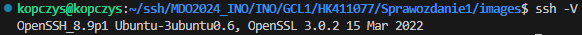

### Sklonuj repozytorium przedmiotowe za pomocą HTTPS i personal access token

Do realizacji tego kroku w pierwszej kolejności wygenerowałem Personal Access Point na GitHub'ie. W tym celu, na stornie GitHub przeszedłem do ustawień konta, wybierając "Settings" z menu rozwijanego po kliknięciu awatara w prawym górnym rogu. W menu po lewej stronie wybrałem "Developer settings". Następnie po lewej stronie wybrałem "Personal access tokens" i "Tokens (classic)". Napisałem notatkę "MDO", wygaśnięcie tokenu ustawiłem za 90 dni, zaznaczyłem zakres uprawnień "repo" i kliknąłem "Generate token".

Po powrocie do "Tokens (classic)" token wyglądał tak:


Teraz przeszedłem do sklonowania repozytorium za pomocą tego tokena. Utworzyłem nowy folder "https" i go otworzyłem na maszynie wirtualnej a następnie użyłem polecenia:

```git clone https://github.com/InzynieriaOprogramowaniaAGH/MDO2024_INO.git```

Polecenie spowodowało następujące działanie w terminalu:

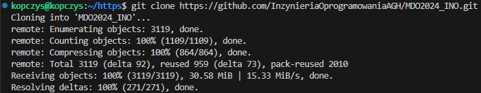

Teraz miałem już na swojej maszynie lokalną kopię repozytorium.

### Upewnij się w kwestii dostępu do repozytorium jako uczestnik i sklonuj je za pomocą utworzonego klucza SSH, zapoznaj się dokumentacją.

Pierwszy klucz utworzyłem za pomocą polecenia:

```ssh-keygen -t ed25519 -C "kopczys2001@gmail.com```

Podczas generowania klucza zostałem poproszony o podanie ścieżki do zapisania klucza ale zaakceptowałem domyślną ścieżkę (bez wpisywania czegokolwiek). Zostałem poproszony również o podanie hasła ale tutaj również pozostawiłem puste pole co spowodowało, że klucz ten nie jest zabezpieczony hasłem.

Powyższy proces powtórzyłem, tylko tym razem zmieniłem domyślną ścieżkę, żeby klucz zapisał się w folderze ssh_pass i dodatkowo zabezpieczyłem go hasłem.

Klucz należało dodać do ssh-agent'a. Uruchomiłem go za pomocą:

```eval "$(ssh-agent -s)"```

A następnie dodałem za pomocą poleceń:

```
ssh-add ~/.ssh/id_ed25519
ssh-add ssh_pass
```

Teraz w celu dodania klucze do konta GitHub, sprawdziłem ich sprawdziłem i skopiowałem ich zawartość:

```
cat ~/.ssh/id_ed25519.pub 
cat ssh_pass.pub
```

Skopiowałem zawartość najpierw pierwszego klucza, przeszedłem na stronę GitHub a następnie do "Settings" i w nich do ustawień "SSH i GPG keys". Kliknąłem "New SSH key" nadałem tytuł i wkleiłem skopiowaną zawartość w pole "Key". To samo powtórzyłem dla drugiego klucza. Dodane klucze wyglądały następująco:


W celu sklonowania repozytorium za pomocą SSH przeszedłem do repozytorium przedmiotowego na GitHub'ie i w sekcji "Clone or download" skopiowałem adres SSH. Na maszynie wirtualnej utworzyłem nowy folder "ssh", przeszedłem do niego i użyłem polecenia:

```git clone git@github.com:InzynieriaOprogramowaniaAGH/MDO2024_INO.git```

### Przełącz się na gałąź main, a potem na gałąź swojej grupy

Poruszanie się po gałęziach jest kluczowym aspektem dla utrzymania porządku i organizacji w projekcie pozwalającą na izolowaną pracę. Aby rozpocząć pracę na własnej gałęzi przeszedłem do katalogu repozytorium i sprawdziłem, na której gałęzi aktualnie jestem:

```git branch```

Następnie przełączyłem gałąź na "main":

```git checkout main```

W celu sprawdzenia, jakie gałęzie znajdują się w repozytorium użyłem polecenia:

```git branch --all```

Wynik sprawdzenia aktualnych gałęzi:

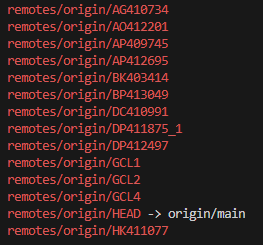

Teraz znałem już nazwę gałęzi grupy więc przeniosłem się na nią poleceniem:

```git checkout GCL1```

### Utwórz gałąź o nazwie "HK411077"

Celem tego kroku było zapewnienie organizacji i segregacji mojej pracy w repozytorium przedmiotowym. Własna gałąź pozwala na niezależne ekperymentowanie i rozwijanie projektów.

Znajdując się na gałęzi grupy, użyłem polecenia:

```git checkout -b HK411077```

Polecenie to nie tylko utworzyło nową gałąź, ale również przełączyło mnie automatycznie na nią. Sprawdziłem, czy moja gałąź została utworzona i zmieniona. Wynik był następujący:

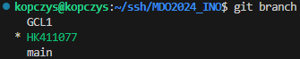

### Rozpoczęcie pracy na nowej gałęzi

Na mojej nowo utworzonej gałęzi HK411077, w katalogu grupy GCL1 utworzyłem nowy katalog o nazwie HK411077 w którym będą znajdowały się wszystkie materiały związane z moimi zadaniami.

```
mkdir HK411077
cd HK411077
```

Git hook'i to skrypty, które wykonwyane są przez Git przy różnych okazjach w celu zautomatyzowania pracy. W ramach projektu utworzyłem Git hook'a który sprawdza, czy wiadomość commita zaczyna się od "HK411077". Treść skrytu dla commit-msg hook'a:

```
#!/bin/sh

COMMIT_MSG_FILE=$1

if ! grep -q '^HK411077' "$COMMIT_MSG_FILE"; then
        echo >&2 "ERROR! Commit must start with 'HK411077'."
        exit 1
fi
```

Skrypt ten umieściłem w pliku **git/hooks/commit-mgs** w lokalnym repozytorium. Nadałem mu jeszcze uprawnienia za pomocą `chmod +x .git/hooks/commit-mgs` oraz przekopiowałem go do własnego katalogu roboczego.

Teraz, momencie gdy treść commit'a nie zaczyna się od "HK411077" wypisany jest następujący błąd:

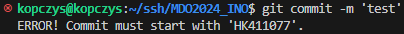

W momencie, gdy treść zaczyna się od "HK411077" rezultat jest następujący:

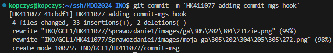

W swoim katalogu roboczym  utworzyłem kolejny katalog o nazwie "Sprawozdanie1" w którym umieszczone zostało sprawozdanie "Sprawozdanie1.md", które pisane jest w formacie **Markdown**. Utworzyłem również katalog "images", w których umieszczam zrzuty ekranu kolejnych etapów projektu.

Dodawanie zrzutów ekranu jako inline do sprawozdania realizuję poprzez wrzucanie ich z lokalnego komputera na maszynę wirtualną właśnie do folderu "images" i użycie formatu: `` w sprawozdaniu.

Kolejną rzeczą do zrobienia było wysłanie zmiany do zdalnego źródła. Robimy to za pomocą poleceń:

```
git add
git commit
git push
```

Pierwsza z powyższych komend dodaje zmiany, które zaszły, czyli nowe pliki, zmodyfikowane pliki itp. Za pomocą drugiego polecenia w którym opisujemy zmiany, które zaszły. Ostatnie polecenie przesyła zmiany z lokalnego źródła do zdalnego repozytorium GitHub.

Gdy chcemy sprawdzić co zostało zmienione lub dodane do naszego projektu możemy użyć polecenia

```git status```

Przykładowe użycie:

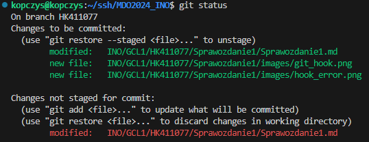

W tym wypadku widzimi, że zmiana która zaszła a nie została dodana to modyfikacja pliku "Sprawozdanie1.md".

Całość wysłania zmian do zdalnego źródła wygląda tak:

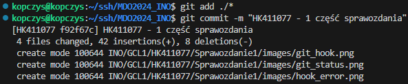
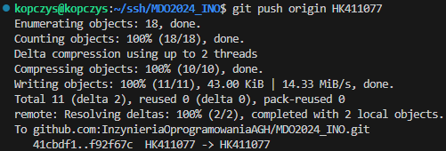

W celu wyciągnięcia mojej gałęzi na gałąź grupową przełączyłem się na gałąź grupy:

```git checkout GCL1```

A następnie użyłem polecenia:

```git merge HK411077```

Wynik był następujący:

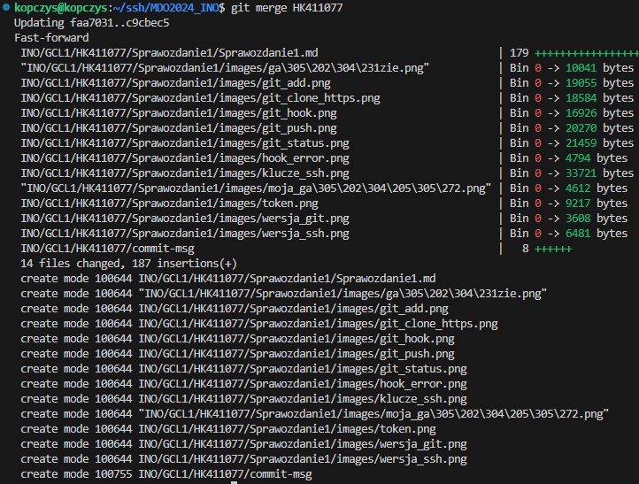

Gałąź została wyciągnieta, jednak nie mam możliwości wysłania tych zmian, gdyż nie posiadam wymaganych uprawnień. Taka zmiana może być jednak dodana przy pomocy pull request.

Wyrzucony błąd wygląda tak:

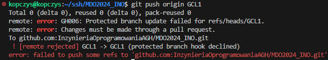

## Wstęp - Git, Docker

Celem laboratorium nr 2 było zainstalowanie Docker'a na systemie Linux, rejestracji w Docker Hub, pobrania i uruchomienia różnych obrazów, stworzenie, zbudowanie i uchomienie własnego obrazu Docker zawierającego Git oraz sklonowane repozytorium projektu.

### Instalacja Docker'a w systemie linuksowym

Instalacja Docker'a jest pierwszym krokiem do stworzenia izolowanego środowiska do pracy. Docker umożliwia uruchamianie aplikacji w kontenerach, co zapewnia spółność środowiska między różnymi maszynami.

Do zainstalowania Docker'a użyłem polecenia:

```sudo apt install docker.io```

W celu włączenia usługi Docker podczas każdorazowego uruchamiania systemu użyłem komendy:

```sudo systemctl status docker```

Aby sprawdzić, czy Docker na pewno się zainstalował, użyłem polecenia `docker` z następującym rezultatem:

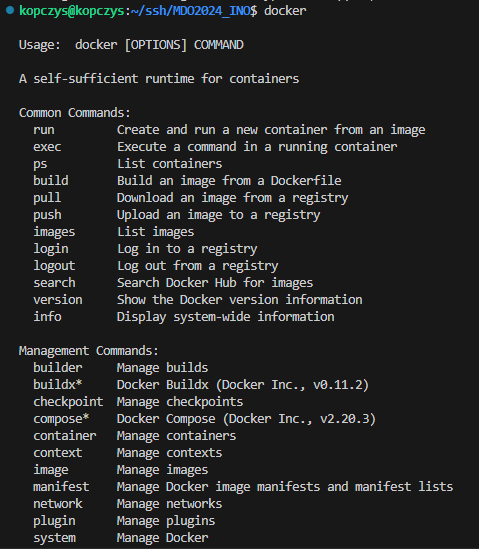

## Zarejestruj się w Docker Hub i zapoznaj z sugerowanymi obrazami

Dokonałem rejestracji w Docker Hub przy użyciu GitHub'a i przejrzałem dokumentację obrazów z dalszej części.

## Pobierz obrazy `hello-world`, `busybox`, `ubuntu` lub `fedora`, `mysql`

Obraz **hello-world** jest standardowym narzędziem do demonstracji i testowania podstawowej funkcjonalności Docker'a. Obraz pobrany został za pomocą polecenia: `sudo docker pull hello-world`.

*BusyBox* zapewnia zestaw narzędzi UNIX w jednym lekkim pliku wykonywalnym i jest często używany do tworzenia lekkich kontenerów do zadań takich jak debugowanie, testowanie i automatyzacja. Pobrałem go poleceniem: `sudo docker pull busybox`.

Jako, że korzystam z systemu operacyjnego Ubuntu Server, to pobrałem na niego obraz systemu **Fedora**. Obraz taki jak ten symuluje pełne środowisko systemowe. Pobrałem go za pomocą polecenie `sudo docker pull fedora`.

Ostatnim pobranym przeze mnie obrazem jest obraz **MySQL** umożliwiający szybkie uruchomienie bazy danych MySQL w kontenerze. Polecenie do pobrania: `sudo docker pull mysql`.

W celu sprawdzenia czy obrazy na pewno się pobrały użyłem polecenia:

`sudo docker images`

Pobrane obrazy:

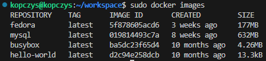

## Uruchomienie kontenera z obrazu `BusyBox`

Uruchomienie kontenera **BusyBox** można dokonać za pomocą polecenia

```sudo docker run busybox```

Po użyciu tej komendy kontener BusyBox automatycznie wyłączy się natychmiast po włączeniu. Działa to tak ze względu na system który czeka na operacje i jeśli ich nie ma, to samoistnie wyłącza kontener.

Żeby temu zapobiec należy uruchomić kontener interaktywnie dodając opcję **-i** przy uruchamianiu:

```sudo docker run -i busybox```

W celu sprawdzenia wersji **BusyBox'a** należy wpisać polecenie:

```cat --help```

Wersja BusyBox'a:

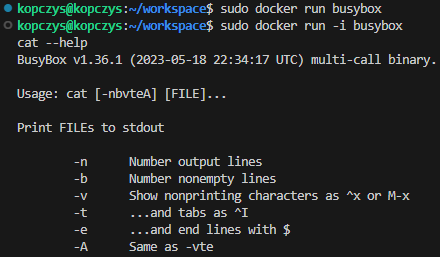

Żeby wyjść z kontenera, użyłem polecenia:

```exit```

## Uruchomienie "systemu w kontenerze" (obraz fedory)

Uruchomienie **fedory** podobnie jak uruchomienie **BusyBox'a** wykonałem w trybie interaktywnym, żeby system od razu nie wyłączył kontenera:

```sudo docker run -i fedora```

Aby użyć polecenia `ps` do sprawdzenia, jakie procesy działają wewnątrz kontenera należy najpierw zainstalować pakiet **procps**:

```dnf install procps -y```

Teraz możemy użyć polecenia `ps -aux`, które wyświetli nam informację o procesach:

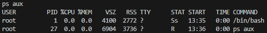

Do sprawdzenia procesów Docker'a na hoście, potrzebne mi było ID działającego kontenera **Fedora**. Wyświetliłem więc listę działających kontenerów poleceniem:

```sudo docker container list```

Dzięki temu uzyskałem ID działającej Fedory:

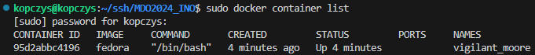

Znaleziony został przeze mnie proces root kontenera po użyciu komendy zawierającej wcześniej wspomniane ID Fedory:

```sudo docker top 95d2abbc4196```

Wynik działania tego polecenia:

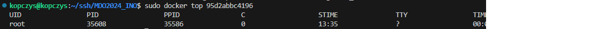

Żeby zaktualizować obecne programy i usługi w kontenerze wystarczyło w jego wnętrzu użyć polecenia:

```sudo dnf upgrade```

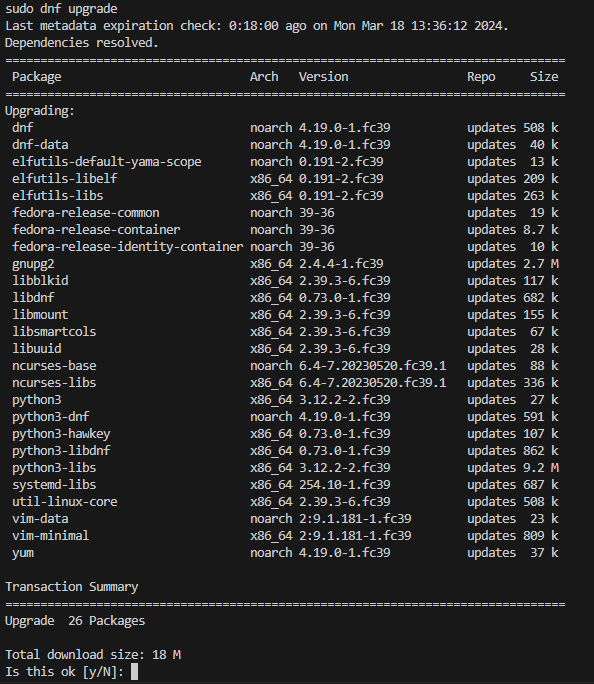

Pakiety zostały zaktualizowane więc pozostało tylko wyjść z kontenera poleceniem `exit`.

## Stworzenie własnoręcznie, zbudowanie i uruchomienie prostego pliku `Dockerfile` bazującego na wybranym systemie i sklonowanie repozytorium

Utworzyłem plik o nazwie "Dockerfile" poleceniem:

```touch Dockerfile```

Przeczytałem artykuł z dobrymi praktykami przy pisaniu Dockerfile i przeszedłem do napisania własnego.
Dockerfile zaczyna się linią:

```FROM ubuntu:latest``` 

Ta linia określa obraz bazowy, z którego budowany jest mój obraz Docker. W tym przypadku używany jest najnowszy dostępny obraz systemu Ubuntu. 

Kolejna linia aktualizuje listę pakietów dostępnych w repozytoriach systemu Ubuntu, a następnie instaluje pakiet **git** oraz **ssh**. Opcjonalna flaga **-y** została zastosowana, aby automatycznie zatwierdzać wszystkie pytania o zgodę. **RUN** wykonywane jest podczas budowania obrazu:

```RUN apt-get update && apt-get install -y git ssh```

**WORKDIR** ustawia katalog roboczy na **/projekt** wewnątrz kontenera Docker. Jeśli katalog nie istnieje to i tak zostanie utworzony automatycznie:

```WORKDIR /projekt```

Kolejna linia kodu również zawiera **RUN** ale ona służy do sklonowania repozytorium przedmiotowego Git bezpośrednio do obrazu:

```RUN git clone https://github.com/InzynieriaOprogramowaniaAGH/MDO2024_INO.git```

Ostatnia instrukcja **ENTRYPOINT** konfiguruje kontener do uruchomienia jako wykonywalny oraz po uruchomieniu kontenera otwiera powłoki bash:

```ENTRYPOINT ["/bin/bash"]```

Po zdefiniowaniu pliku **Dockerfile** należało go jeszcze zbudować za pomocą polecenia:

```sudo docker build -t new_image .```

Sprawdziłem następnie, czy obraz pojawił się na mojej maszynie wirtualnej:

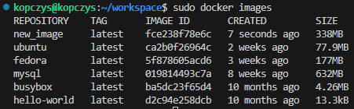

W celu weryfikacji, czy wszystko poszło tak jak powinno, uruchomiłem kontener w trybie interaktywnym i sprawdziłem, czy do katalogu roboczego zostało ściągnięte repozytorium:

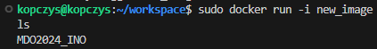

## Pokaż uruchomione (!= "działające") kontenery, wyczyść je

Wyświetlenie uruchomionych kontenerów moża zrobić stosując polecenie:

```sudo docker ps -a```

Flaga **-f** użyta została w celu przefiltrowania kontnerów i wyświetleniu tylko takich, które status mają jako "exited".

Moja lista uruchomionych kontenerów wygląda tak:

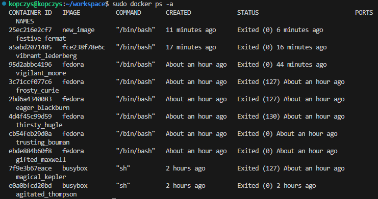

Przed usunęciem kontenerów, należy je napierw zatrzymać poleceniem:

```sudo docker stop $(sudo docker ps -a -q)```

Lista zatrzymanych kontenerów:

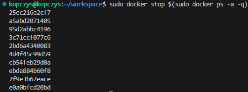

Żeby je usunąć, wystarczy użyć polecenia:

```sudo docker rm $(sudo docker ps -a -q)```

Lista ID usunętych kontenerów:

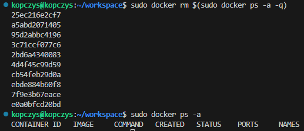

Jak widać na powyższym zrzucie ekranu, wszystkie kontenery zostały wyczyszczone.

## Czyszczenie obrazów

Aby wyczyścić obrazy, można posłużyć się poleceniem podobny, jak w przypadku zatrzymania czy usunięcia kontenerów, mianowicie:

```sudo docker rmi $(sudo docker ps -a -q)```

Użycie tej komendy w terminalu wygląda tak:

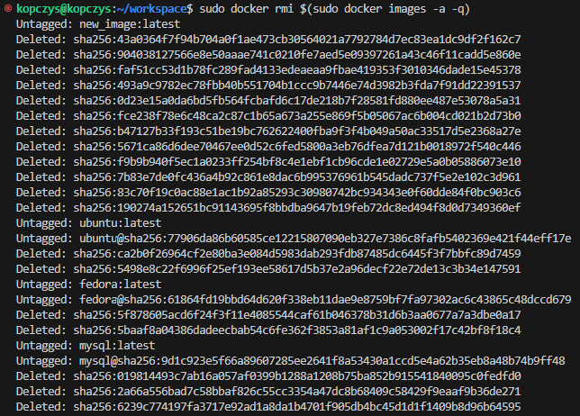

## Dodanie stworzonego pliku Dockerfile do folderu Sprawozdanie1 w repozytorium

W tym kroku wystarczyło jedynie przekopiować utworzony wcześniej plik **Dockerfile** do folderu **Sprawozdanie1** w repozytorium. U mnie odbyło się to w ten sposób:

```cp Dockerfile ~/ssh/MDO2024_INO/INO/GCL1/HK411077/Sprawozdanie1/```

## Wystawienie Pull Request'a do gałęzi grupowej

Na sam koniec wystawiłem już tylko Pull Request'a w celu formalnego zgłoszenia wykonanej pracy.