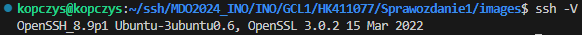
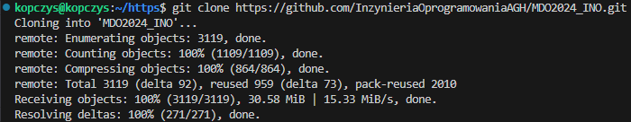
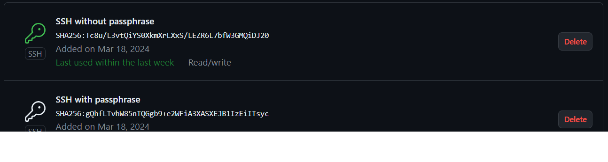
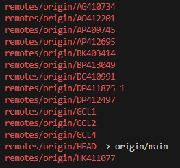
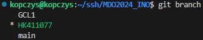
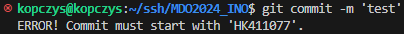
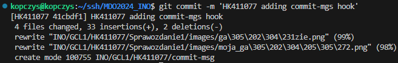
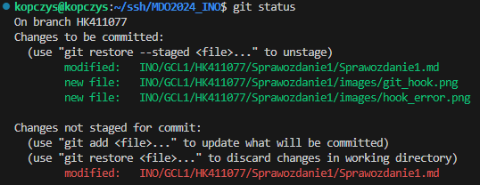
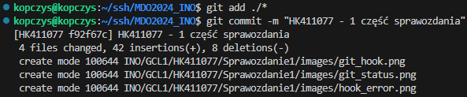
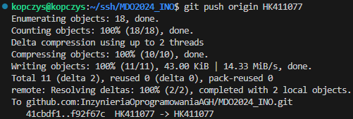

# Sprawozdanie 1 - Hubert Kopczyński 411077

## Wstęp - Git, Gałęzie, SSH

Celem laboratorium nr 1 było zapoznanie się z podstawowymi funkcjami systememu kontroli wersji Git. Projekt rozpocząłem się od instalacji Git'a oraz konfiguracji obsługi kluczy SSH. Kolejnym krokiem było sklonowanie repozytorium przedmiotowego za pomocą protokołu HTTPS i personal access token. W następnej części zapewniłem dostęp do repozytorium za pośrednictwem kluczy SSH - w tym celu utworzyłem dwa klucze, w tym jeden zabezpieczony hasłem. W dalszej części projektu skolonowałem repozytorium przedmiotowe i utworzyłem własną gałąź HK411077, pozwalającą na izolację mojej pracy. Na koniec utworzyłem Git hooka weryfikującego format wiadomości commitów.

### Zainstalowanie klienta Git i obsługę kluczy SSH

Na początku zaktualizowałem bazę pakietów systemu i zainstalowałem klienta Git używając komendy: 
```sudo apt update && sudo apt install git```

Po zakończeniu instalacji, w celu weryfikcaji czy przebiegła pomyślnie, sprawdziłem wersję zainstalowanego Git'a: 
```git --version```

Zainstalowana wersja Git'a:


Następnie zainstalowałem obsługę kluczy SSH:

```sudo apt install openssh-client```

Oraz sprawdziłem również jego wersję:

```ssh -V```

Wersja ssh:



### Sklonuj repozytorium przedmiotowe za pomocą HTTPS i personal access token

Do realizacji tego kroku w pierwszej kolejności wygenerowałem Personal Access Point na GitHub'ie. W tym celu, na stornie GitHub przeszedłem do ustawień konta, wybierając "Settings" z menu rozwijanego po kliknięciu awatara w prawym górnym rogu. W menu po lewej stronie wybrałem "Developer settings". Następnie po lewej stronie wybrałem "Personal access tokens" i "Tokens (classic)". Napisałem notatkę "MDO", wygaśnięcie tokenu ustawiłem za 90 dni, zaznaczyłem zakres uprawnień "repo" i kliknąłem "Generate token".

Po powrocie do "Tokens (classic)" token wyglądał tak:


Teraz przeszedłem do sklonowania repozytorium za pomocą tego tokena. Utworzyłem nowy folder "https" i go otworzyłem na maszynie wirtualnej a następnie użyłem polecenia:

```git clone https://github.com/InzynieriaOprogramowaniaAGH/MDO2024_INO.git```

Polecenie spowodowało następujące działanie w terminalu:



Teraz miałem już na swojej maszynie lokalną kopię repozytorium.

### Upewnij się w kwestii dostępu do repozytorium jako uczestnik i sklonuj je za pomocą utworzonego klucza SSH, zapoznaj się dokumentacją.

Pierwszy klucz utworzyłem za pomocą polecenia:

```ssh-keygen -t ed25519 -C "kopczys2001@gmail.com```

Podczas generowania klucza zostałem poproszony o podanie ścieżki do zapisania klucza ale zaakceptowałem domyślną ścieżkę (bez wpisywania czegokolwiek). Zostałem poproszony również o podanie hasła ale tutaj również pozostawiłem puste pole co spowodowało, że klucz ten nie jest zabezpieczony hasłem.

Powyższy proces powtórzyłem, tylko tym razem zmieniłem domyślną ścieżkę, żeby klucz zapisał się w folderze ssh_pass i dodatkowo zabezpieczyłem go hasłem.

Klucz należało dodać do ssh-agent'a. Uruchomiłem go za pomocą:

```eval "$(ssh-agent -s)"```

A następnie dodałem za pomocą poleceń:

```
ssh-add ~/.ssh/id_ed25519
ssh-add ssh_pass
```

Teraz w celu dodania klucze do konta GitHub, sprawdziłem ich sprawdziłem i skopiowałem ich zawartość:

```
cat ~/.ssh/id_ed25519.pub 
cat ssh_pass.pub
```

Skopiowałem zawartość najpierw pierwszego klucza, przeszedłem na stronę GitHub a następnie do "Settings" i w nich do ustawień "SSH i GPG keys". Kliknąłem "New SSH key" nadałem tytuł i wkleiłem skopiowaną zawartość w pole "Key". To samo powtórzyłem dla drugiego klucza. Dodane klucze wyglądały następująco:



W celu sklonowania repozytorium za pomocą SSH przeszedłem do repozytorium przedmiotowego na GitHub'ie i w sekcji "Clone or download" skopiowałem adres SSH. Na maszynie wirtualnej utworzyłem nowy folder "ssh", przeszedłem do niego i użyłem polecenia:

```git clone git@github.com:InzynieriaOprogramowaniaAGH/MDO2024_INO.git```

### Przełącz się na gałąź main, a potem na gałąź swojej grupy

Poruszanie się po gałęziach jest kluczowym aspektem dla utrzymania porządku i organizacji w projekcie pozwalającą na izolowaną pracę. Aby rozpocząć pracę na własnej gałęzi przeszedłem do katalogu repozytorium i sprawdziłem, na której gałęzi aktualnie jestem:

```git branch```

Następnie przełączyłem gałąź na "main":

```git checkout main```

W celu sprawdzenia, jakie gałęzie znajdują się w repozytorium użyłem polecenia:

```git branch --all```

Wynik sprawdzenia aktualnych gałęzi:



Teraz znałem już nazwę gałęzi grupy więc przeniosłem się na nią poleceniem:

```git checkout GCL1```

### Utwórz gałąź o nazwie "HK411077"

Celem tego kroku było zapewnienie organizacji i segregacji mojej pracy w repozytorium przedmiotowym. Własna gałąź pozwala na niezależne ekperymentowanie i rozwijanie projektów.

Znajdując się na gałęzi grupy, użyłem polecenia:

```git checkout -b HK411077```

Polecenie to nie tylko utworzyło nową gałąź, ale również przełączyło mnie automatycznie na nią. Sprawdziłem, czy moja gałąź została utworzona i zmieniona. Wynik był następujący:



### Rozpoczęcie pracy na nowej gałęzi

Na mojej nowo utworzonej gałęzi HK411077, w katalogu grupy GCL1 utworzyłem nowy katalog o nazwie HK411077 w którym będą znajdowały się wszystkie materiały związane z moimi zadaniami.

```
mkdir HK411077
cd HK411077
```

Git hook'i to skrypty, które wykonwyane są przez Git przy różnych okazjach w celu zautomatyzowania pracy. W ramach projektu utworzyłem Git hook'a który sprawdza, czy wiadomość commita zaczyna się od "HK411077". Treść skrytu dla commit-msg hook'a:

```
#!/bin/sh

COMMIT_MSG_FILE=$1

if ! grep -q '^HK411077' "$COMMIT_MSG_FILE"; then
        echo >&2 "ERROR! Commit must start with 'HK411077'."
        exit 1
fi
```

Skrypt ten umieściłem w pliku **git/hooks/commit-mgs** w lokalnym repozytorium. Nadałem mu jeszcze uprawnienia za pomocą `chmod +x .git/hooks/commit-mgs` oraz przekopiowałem go do własnego katalogu roboczego.

Teraz, momencie gdy treść commit'a nie zaczyna się od "HK411077" wypisany jest następujący błąd:



W momencie, gdy treść zaczyna się od "HK411077" rezultat jest następujący:



W swoim katalogu roboczym  utworzyłem kolejny katalog o nazwie "Sprawozdanie1" w którym umieszczone zostało sprawozdanie "Sprawozdanie1.md", które pisane jest w formacie **Markdown**. Utworzyłem również katalog "images", w których umieszczam zrzuty ekranu kolejnych etapów projektu.

Dodawanie zrzutów ekranu jako inline do sprawozdania realizuję poprzez wrzucanie ich z lokalnego komputera na maszynę wirtualną właśnie do folderu "images" i użycie formatu: `` w sprawozdaniu.

Kolejną rzeczą do zrobienia było wysłanie zmiany do zdalnego źródła. Robimy to za pomocą poleceń:

```
git add
git commit
git push
```

Pierwsza z powyższych komend dodaje zmiany, które zaszły, czyli nowe pliki, zmodyfikowane pliki itp. Za pomocą drugiego polecenia w którym opisujemy zmiany, które zaszły. Ostatnie polecenie przesyła zmiany z lokalnego źródła do zdalnego repozytorium GitHub.

Gdy chcemy sprawdzić co zostało zmienione lub dodane do naszego projektu możemy użyć polecenia

```git status```

Przykładowe użycie:



W tym wypadku widzimi, że zmiana która zaszła a nie została dodana to modyfikacja pliku "Sprawozdanie1.md".

Całość wysłania zmian do zdalnego źródła wygląda tak:




