# Sprawozdanie 2 - Hubert Kopczyński 411077

## Wstęp - Dockerfiles, kontener jako definicja etapu

Celem laboratorium nr 3 był wybór, budowanie oraz testowanie oprogramowania z otwartą licencją. Proces ten został przeprowadzony w środowisku kontenerowym z wykorzystaniem Docker'a.

### Wybór oprogramowania na zajęcia

Moim wyborem oprogramowania w ramach tych ćwiczeń został **node-js-dummy-test** które jest prostą aplikacją pozwalającą dodawać zadania na stronie oraz przechowywać nowe i ukończone zadania w różnych tablicach.

node-js-dummy-test jest udostępniony z otwartą licencją **Apache-2.0**, która pozwala na użycie komercyjne, modyfikację, dystrybucję, użycie patentu oraz użytek prywatny::

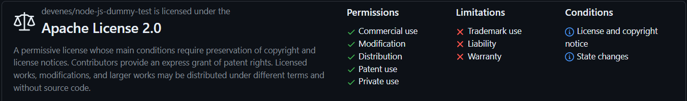

W projekcie tym wykorzystywany jest mechanizm **npm** (Node Package Manager), który służy do zarządzania zależnościami oraz umożliwiwa budowanie oraz testowanie projektu za pomocą odpowiednich skryptów zdewiniowanych w pliku *package.json*.

Aplikacja posiada również testy jednostkowe, które można uruchomić za pomocą polecenia `npm test`.

#### Klonowanie i przeprowadzenie build'u node-js-dummy-test

Na maszynie wirtualnej utworzyłem nowy folder **lab_03**, w którym miało zostać sklonowane repozytorium. W celu sklonowania wykorzystałem polecenie:

```git clone https://github.com/devenes/node-js-dummy-test.git```

Następnie przeszedłem do powstałego w ten sposób katalogu z klonowanym repozytorium i w pierwszej kolejności zainstalowałem na swojej maszynie wirtualnej menadżer wersji Node **nvm** (Node Version Manager), który umożliwia łatwą zmianę wersji Node.js. Otworzyłem drugi terminal i do zainstalowania użyłem poleceń:

```
curl -o- https://raw.githubusercontent.com/nvm-sh/nvm/v0.39.1/install.sh | bash
nvm install node
```

Gdy Node.js (razem z npm) się zainstalował, sprawdziłem ich wersje poleceniami:

```
node -v
npm -v
```

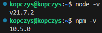

Teraz już mogłem zainstalować zależności i zbudować projekt za pomocą `npm install`, czego wynik był nastęępujący:

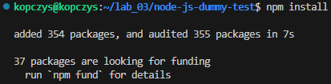

Jak widać na powyższym zrzucie ekranu wszystko przebiegło pomyślnie.

#### Uruchomienie testów jednostowych i programu

Wykonanie testów jednostkowych odbyło się za pomocą polecenia `npm test`:

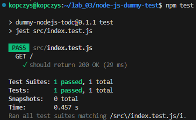

Testy przeebiegły pomyślnie więc uruchomiłem jeszcze program poleceniem `npm start` i sprawdziłem w przeglądarce, czy program działa poprawnie:

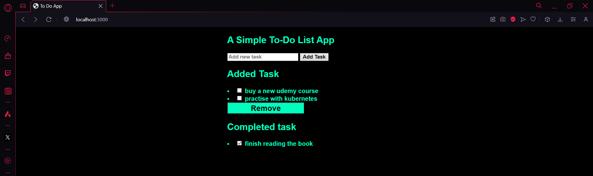

### Przeprowadzenie build'u node-js-dummy-test w kontenerze

Na początek musiałem wybrać odpowiedni obraz bazowy kontenera. Dla aplikacji Node.js dobrym wyborem jest obraz *node* dlatego wybór padł na niego. Uruchomiłem go poleceniem:

```
sudo docker run -it node bash
```

Obrazu nie miałem jeszcze pobranego więc została przy okazji pobrana jego najnowsza dostępna wersja:

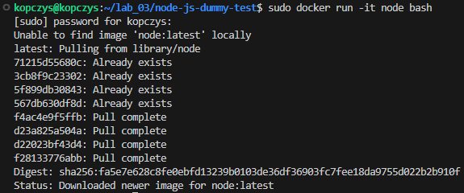

Kontener został uruchomiony z opcjami *-i* i *-t*. Pierwsza z nich to tryb interaktywny, który zapewnia, że standardowe wejście (STDIN) kontenera jest otwarte, dzięki czemu można na przykład wprowadzać dane do kontenera z konsoli, w której został uruchomiony.

Druga opcja *-t*, przydziela pseudoterminal (TTY -teletypewriter) dla kontenera dzięki czemu, sesja w kontenerze wygląda jak normalna sesja terminalu i możliwe jest korzystanie z pełnej funkcjonalności shell'a.

W przypadku obrazu *node*, kontener od razu, w trakcie budowania zostaje zaopatrzony w Git'a, zatem nie trzeba go dodatkowo instalować na nowo. Mogłem więc od razu przejść do sklonowania repozytorium node-js-dummy-test poleceniem:

```
git clone https://github.com/devenes/node-js-dummy-test.git
```

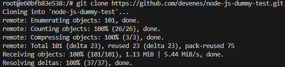

Następnie przeszedłem w kontenerze do katalogu *node-js-dummy-test* i ponownie zainstalowałem zależności, wykonałem build oraz testy jednostkowe poleceniami `npm install` i `npm test`:

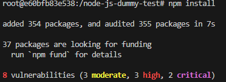

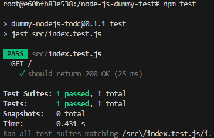

Wszystko przebiegło pomyślnie zatem mogłem przejść do dalszych zadań.

 ### Stworzenie dwóch plików *Dockerfile* automatyzujące kroki powyżej:

 Pierwszy kontener miał za zadanie przeprowadzić wszystkie kroki aż do *build'a*.

 Wyszedłem więc za pomocą polecenia `exit` z poprzedniego kontenera, przeszedłem do katalogu *lab_03* i utworzyłem w nim plik **build.Dockerfile**, którego zawartość wygląda tak:

 ```
FROM node:latest
RUN git clone https://github.com/devenes/node-js-dummy-test.git
WORKDIR /node-js-dummy-test
RUN npm install
```

Następnie, znajdując się w katalogu z utworzonym *Dockerfile*, utworzyłem obraz poleceniem:

```
sudo docker build -f build.Dockerfile -t node-app-build .
```

w którym opcja *-f* oznacza ścieżkę do pliku natomiast opcja *-t* nazwę kontenera. 

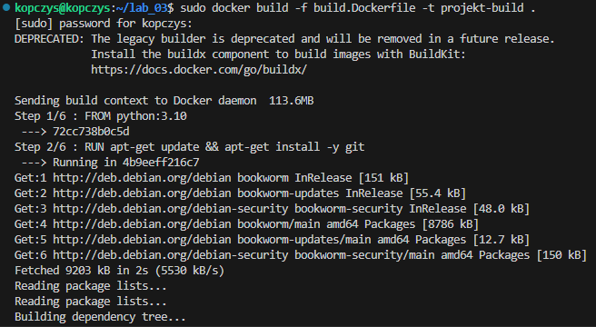

Drugi kontener miał bazować na pierwszym i wykonywać testy.

Utworzyłem zatem drugi *Dockerfile* o nazwie **test.Dockerfile**, którego zawartość wygląda tak:

```
FROM node-app-build
WORKDIR /node-js-dummy-test
RUN npm test
```

Zbudowałem obraz dla testów poleceniem:

```
sudo docker build -f test.Dockerfile -t node-app-test  .
```

I wszystko przebiegło pomyślnie:

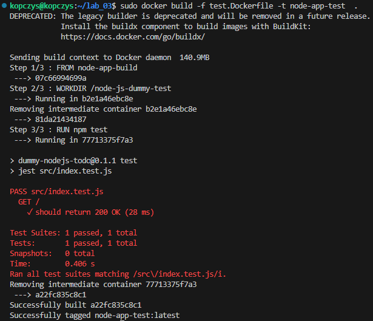

Sprawdziłem jeszcze, czy na pewno obrazy zostały zbudowane poleceniem `sudo docker images`:

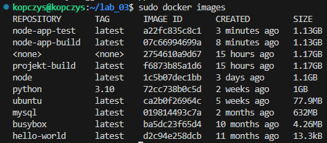

Zbudowane obrazy należało teraz uruchomić poleceniami:

```
sudo docker run node-app-build
sudo docker run node-app-test
```

### Wykazanie, że kontener wdraża się i pracuje poprawnie

Kontenery zostały już uruchomione, więc można sprawdzić, czy zostały i czy pracują poleceniem:

```
docker container list --all
```

Zwrócone zostaje:

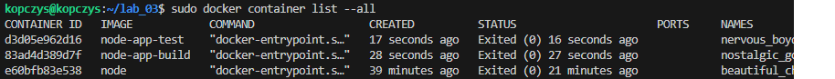

Widzimy jednak, że po uruchomieniu kontenery przestają działać, ponieważ wykonywane są tylko raz i nie ma potrzeby, żeby ciągle pracowały.

## Wstęp - dodatkowa terminologia w konteneryzacji, intancja Jenkins

