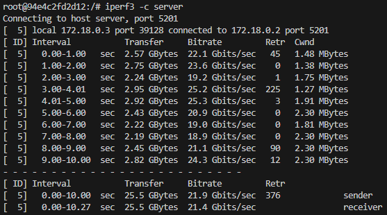

# Sprawozdanie 2 - Hubert Kopczyński 411077

## Wstęp - Dockerfiles, kontener jako definicja etapu

Celem laboratorium nr 3 był wybór, budowanie oraz testowanie oprogramowania z otwartą licencją. Proces ten został przeprowadzony w środowisku kontenerowym z wykorzystaniem Docker'a.

### Wybór oprogramowania na zajęcia

Moim wyborem oprogramowania w ramach tych ćwiczeń został **node-js-dummy-test** które jest prostą aplikacją pozwalającą dodawać zadania na stronie oraz przechowywać nowe i ukończone zadania w różnych tablicach.

node-js-dummy-test jest udostępniony z otwartą licencją **Apache-2.0**, która pozwala na użycie komercyjne, modyfikację, dystrybucję, użycie patentu oraz użytek prywatny::


W projekcie tym wykorzystywany jest mechanizm **npm** (Node Package Manager), który służy do zarządzania zależnościami oraz umożliwiwa budowanie oraz testowanie projektu za pomocą odpowiednich skryptów zdewiniowanych w pliku *package.json*.

Aplikacja posiada również testy jednostkowe, które można uruchomić za pomocą polecenia `npm test`.

#### Klonowanie i przeprowadzenie build'u node-js-dummy-test

Na maszynie wirtualnej utworzyłem nowy folder **lab_03**, w którym miało zostać sklonowane repozytorium. W celu sklonowania wykorzystałem polecenie:

```git clone https://github.com/devenes/node-js-dummy-test.git```

Następnie przeszedłem do powstałego w ten sposób katalogu z klonowanym repozytorium i w pierwszej kolejności zainstalowałem na swojej maszynie wirtualnej menadżer wersji Node **nvm** (Node Version Manager), który umożliwia łatwą zmianę wersji Node.js. Otworzyłem drugi terminal i do zainstalowania użyłem poleceń:

```
curl -o- https://raw.githubusercontent.com/nvm-sh/nvm/v0.39.1/install.sh | bash
nvm install node
```

Gdy Node.js (razem z npm) się zainstalował, sprawdziłem ich wersje poleceniami:

```
node -v
npm -v
```


Teraz już mogłem zainstalować zależności i zbudować projekt za pomocą `npm install`, czego wynik był nastęępujący:


Jak widać na powyższym zrzucie ekranu wszystko przebiegło pomyślnie.

#### Uruchomienie testów jednostowych i programu

Wykonanie testów jednostkowych odbyło się za pomocą polecenia `npm test`:


Testy przeebiegły pomyślnie więc uruchomiłem jeszcze program poleceniem `npm start` i sprawdziłem w przeglądarce, czy program działa poprawnie:


### Przeprowadzenie build'u node-js-dummy-test w kontenerze

Na początek musiałem wybrać odpowiedni obraz bazowy kontenera. Dla aplikacji Node.js dobrym wyborem jest obraz *node* dlatego wybór padł na niego. Uruchomiłem go poleceniem:

```
sudo docker run -it node bash
```

Obrazu nie miałem jeszcze pobranego więc została przy okazji pobrana jego najnowsza dostępna wersja:


Kontener został uruchomiony z opcjami *-i* i *-t*. Pierwsza z nich to tryb interaktywny, który zapewnia, że standardowe wejście (STDIN) kontenera jest otwarte, dzięki czemu można na przykład wprowadzać dane do kontenera z konsoli, w której został uruchomiony.

Druga opcja *-t*, przydziela pseudoterminal (TTY -teletypewriter) dla kontenera dzięki czemu, sesja w kontenerze wygląda jak normalna sesja terminalu i możliwe jest korzystanie z pełnej funkcjonalności shell'a.

W przypadku obrazu *node*, kontener od razu, w trakcie budowania zostaje zaopatrzony w Git'a, zatem nie trzeba go dodatkowo instalować na nowo. Mogłem więc od razu przejść do sklonowania repozytorium node-js-dummy-test poleceniem:

```
git clone https://github.com/devenes/node-js-dummy-test.git
```


Następnie przeszedłem w kontenerze do katalogu *node-js-dummy-test* i ponownie zainstalowałem zależności, wykonałem build oraz testy jednostkowe poleceniami `npm install` i `npm test`:


Wszystko przebiegło pomyślnie zatem mogłem przejść do dalszych zadań.

 ### Stworzenie dwóch plików *Dockerfile* automatyzujące kroki powyżej:

 Pierwszy kontener miał za zadanie przeprowadzić wszystkie kroki aż do *build'a*.

 Wyszedłem więc za pomocą polecenia `exit` z poprzedniego kontenera, przeszedłem do katalogu *lab_03* i utworzyłem w nim plik **build.Dockerfile**, którego zawartość wygląda tak:

 ```
FROM node:latest
RUN git clone https://github.com/devenes/node-js-dummy-test.git
WORKDIR /node-js-dummy-test
RUN npm install
```

Następnie, znajdując się w katalogu z utworzonym *Dockerfile*, utworzyłem obraz poleceniem:

```
sudo docker build -f build.Dockerfile -t node-app-build .
```

w którym opcja *-f* oznacza ścieżkę do pliku natomiast opcja *-t* nazwę kontenera. 


Drugi kontener miał bazować na pierwszym i wykonywać testy.

Utworzyłem zatem drugi *Dockerfile* o nazwie **test.Dockerfile**, którego zawartość wygląda tak:

```
FROM node-app-build
WORKDIR /node-js-dummy-test
RUN npm test
```

Zbudowałem obraz dla testów poleceniem:

```
sudo docker build -f test.Dockerfile -t node-app-test  .
```

I wszystko przebiegło pomyślnie:


Sprawdziłem jeszcze, czy na pewno obrazy zostały zbudowane poleceniem `sudo docker images`:


Zbudowane obrazy należało teraz uruchomić poleceniami:

```
sudo docker run node-app-build
sudo docker run node-app-test
```

### Wykazanie, że kontener wdraża się i pracuje poprawnie

Kontenery zostały już uruchomione, więc można sprawdzić, czy zostały i czy pracują poleceniem:

```
sudo docker container list --all
```

Zwrócone zostaje:


Widzimy jednak, że po uruchomieniu kontenery przestają działać, ponieważ wykonywane są tylko raz i nie ma potrzeby, żeby ciągle pracowały.

## Wstęp - dodatkowa terminologia w konteneryzacji, intancja Jenkins

Celem tej części sprawozdania jest przedstawienie procesu praktycznego wykorzystania Docker. Zostały utworzone woluminy do przechowywania danych wejściowych i wyjściowych, wykonana została konfiguracja sieciowa kontenerów, w tym uruchomienie serwer iperf w kontenerze. Na koniec pokazany został proces instalacji skonteneryzowanej instancji Jenkins.

### Przygotowanie woluminy wejściowego i wyściowego, podłączenie ich do kontenera bazowego

Do utworzenia woluminów, które pozwolą na zachowanie stany danych wejściowych i wyjściowych między uruchomieniami kontenera posłużyłem sie poleceniami:

```
sudo docker volume create input-volume
sudo docker volume create output-volume
```

Utworzne zostały dwa woluminy Docker - *input-volume* i *output-volume*. Aby to potwierdzić, można sprawdzić utworzone woluminy za pomocą polecenia `sudo docker volume ls`:


Tak utworzone woluminy należało podłączyć do kontenera bazowego, z którego wcześniej rozpoczynano pracę. W moim przypadku jest obrazem bazowym był obraz *node*. Aby woluminy podłączyć, należy kontener uruchomić z odpowiednimi flagami. W moim przypadku polecenie wyglądało tak:

```
sudo docker run -it --name volume-test-container --mount source=input-volume,target=/input --mount source=output-volume,target=/output node bash
```

W tym poleceniu flaga *--name* nadaje kontenerowi nazwę a flaga *--mount source={nazwa},target={nazwa}* montuje odpowiednie woluminy w odpowiednie miejsca w kontenerze.

Po zbudowaniu kontenera sprawdziłem, czy rzeczywiście woluminy zostały w nim utworzone, sprawdzając po prostu poleceniem `ls`, czy utworzone zostały foldery *input* i *output*:;


### Sklonowanie repozytorium na wolumin wejściowy

Do sklonowania repozytorium należało nie używać Git'a w utworzonym z woluminami kontenerze, zatem zrobiłem to poprzez uruchomienie kontenera pomocniczego, który Git'a już zawierał i również miał podłączony, ale tylko wejściowy wolumin. Otworzyłem drugi terminal i utworzenie takiego kontenera pomocniczego wykonałem poleceniem:

```
sudo docker run -it --rm --name tmp --mount source=input-volume,target=/input node bash
```

W kontenerze wszedłem do folderu *input* i skolonowałem w nim repozytorium *node-js-dummy-test poleceniem `git clone https://github.com/devenes/node-js-dummy-test.git`:


Po powróceniu na pierwszy terminal i wejściu do folderu *input* oraz użyciu polecenia `ls`, widać, że repozytorium zostało sklonowane poprawnie:


### Uruchomienie build w kontenerze bazowym

Przeszedłem do folderu z sklonowanym repozytorium i wykonałem pobranie zależności i build poleceniem:

```
npm install
```


Repozytrium skopiowałem również z wolumina wejściowego do wnętrza kontenera bazowego poleceniem:

```
cp -r node-js-dummy-test/ ..
```

### Zapisanie zbudowanych plików na woluminie wyjściowym, tak by były dostępne po wyłączeniu kontenera

Aby skopiować zbudowane w repozytorium pliki należy wejść z powrotem do folderu z repozytrium i sprawdzić, czy znajduje się w nim folder *node_modules* jeśli tak, to cały ten folder można przekopiować na wolumin wyjściowy poleceniem (znajdując się w katalogu repozytorium):

```
cp -r node_modules/ ../../output/
```

Teraz można przejść do folderu *output* i sprawdzić, czy pliki przekopiowały się poprawnie:


Można również poza kontenerem sprawdzić, czy pliki zostały zapisane prawidłowo za pomocą polecenia:

```
sudo ls /var/snap/docker/common/var-lib-docker/volumes/{nazwa_woluminu}/_data
```


### Ponowienie operacji z klonowaniem na wolumin wejściowy wewnątrz kontenera

Do tego celu wykorzystałem ten sam kontener co wcześniej (z podłączonymi dwoma woluminami). Do nowo utworzonego folderu *new* w woluminie wejściowym sklonowałem po prostu repozytorium poleceniem `git clone https://github.com/devenes/node-js-dummy-test.git`.


### Przedyskutowanie możliwości wykonania ww. kroków za pomocą `docker build` i pliku `Dockerfile`

Przy pomocy pliku *Dockerfile* można bez problemu odtworzyć powyższe kroki. Na maszynie wirtualnej utworzyłem nowy folder *lab_04* w którym utworzyłem również nowy plik Dockerfile - **volume_build.Dockerfile* z zawartością:

```
FROM node:latest

RUN mkdir input
RUN mkdir output

RUN --mount=type=bind,source=input-volume,target=/input,rw
RUN --mount=type=bind,source=output-volume,target=/output,rw

WORKDIR /input
RUN git clone https://github.com/devenes/node-js-dummy-test.git

WORKDIR /input/node-js-dummy-test
RUN npm install
RUN cp -r node_modules ../../output/new
```

Przyłączenie woluminów do obrazu odbywa się za pomocą `RUN --mount`.

## Eksponowanie portu

iPref to narzędzie służące do testowania przepustowości sieci między dwoma punktami w sieci. Zainstalowanie go w kontenerze odbywa się za pomocą polecenia:

```
apt-get install iperf3
```

Serwer uruchamia się poleceniem:

```
iperf3 -s
```


Żeby połączyć drugi kontener z tym serwerem należało sprawdzić najpierw sprawdzić jego adres, w moim przypadku takim poleceniem:

```
sudo docker inspect -f'{{range .NetworkSettings.Networks}}{{.IPAddress}}{{end}}' 47d1d06ce252
```


Widać na powyższym zrzucie ekranu, że adres serwera to *172.17.0.3*.

### Połączenie się z serwerem z drugiego kontenera

W nowym terminalu uruchomiłem kolejny kontener, który pełni rolę klienta. Do połączenia się z serwerem o poznanym już adresie użyłem polecenia:

```
iperf3 -c 172.17.0.3
```

W terminalu wyglądało to tak (dla klienta i dla serwera):


I to są wyniki testu przesyłu danych pomiędzy kontenerami - serwerem a klientem. W moim wypadku średnia prędkość to 21.8 Gb/s.

### Sieć mostkowa

Sieć mostkowa sprawia, że kontenery podłączone do tej samej sieci będą mogły komunikować się ze sobą ale nie będą widoczne z zewnątrz. Do utworzenia sieci mostkowej użyłem polecenia:

```
sudo docker network create new_network
```

Użycie tego polecenia zwróciło mi ID:


Teraz stworzyłem dwa kontenery, które zostaną podłączone do sieci poleceniem:

```
sudo docker run -it --rm --name server --network new_network ubuntu bash
sudo docker run -it --rm --name client --network new_network ubuntu bash
```

Zapisałem zwrócone ID sieci, więc nie musiałem go już sprawdzać żeby sprawdzić, czy kontenery zostały do niej podłączone. Można to jednak sprawdzić za pomocą polecenia `sudo docker network ls`.

Adresy dołączonych do sieci kontenerów sprawdziłem za pomocą polecenia:

```
sudo docker network inspect 5be9f9eefe7da7aceae1c3536915b5a1c4428e1c5d7bdcb43242acd1103d1532
```

A rezultat był zgodny z oczekiwanym:


Na pierwszym kontenerze utworzyłem serwer `iperf3 -s` a na drugim kontenerze podłączyłem do kontener do serwera po nazwie kontenera z serwerem:

```
iperf3 -s server
```

Wszystko przebiegło zgodnie z planem:




#### Połączenie się z hosta

Teraz należało spróbować połączyć się z serwerem spoza kontenera. Kontener serwerowy uruchamiam z dodatkową opcją *-p*, która służy do mapowania portów między konteneramem a hostem. Pierwsza część (przed znakiem **":"**) oznacza port na hoście (w tym przypadku port mojej witrualnej maszyny) a druga część (po znaku **"**) oznacza port wewnątrz kontenera, do którego ma być przekierowany ruch. W moim przypadku oba te pory to *5201*:

```
sudo docker run -it --rm --name server --network new_network -p 5201:5201 ubuntu bash
```


Następnie sprawdziłem adres serwera, który został utworzony w kontenerze poleceniem:

```
sudo docker inspect -f'{{range .NetworkSettings.Networks}}{{.IPAddress}}{{end}}' bcb035416d2e
```


Uruchomiałem na nim serwer poleceniem `iperf3 -s` i połączełem się do niego z drugiego terminala w maszynie wirtualnej znając już wcześniej adres:

```
iperf3 -c 172.18.0.2
```

Wynik jest następujący:


Widać, że w tym przypadku prędkość jest większa o niecałe 4Gb/s.

#### Połączenie spoza hosta

W tym przypadku na swój komputer pobrałem *iperf3*, otworzyłem terminal i przeszedłem w nim do folderu, w którym się on znajdował i próbowałem się połączyć poleceniem:

```
iperf3 -c 127.0.0.1 -p 5201
```

Jednak z jakiegoś powodu nie udało się połączyć, komunikat był następujący:


## Instalacja Jenkins

Instalację przeprowadziłem zgodnie z instrukcją, znajdującą się na stronie z dokumentacją *Jenkins*. W pierwszym kroku utworzyłem sieć mostkową w Dockerze poleceniem:

```
docker network create jenkins
```


Następnie pobrałem obraz *docker:dind* poprzez użycie polecenia z instrukcji:

```
docker run --name jenkins-docker --rm --detach \
  --privileged --network jenkins --network-alias docker \
  --env DOCKER_TLS_CERTDIR=/certs \
  --volume jenkins-docker-certs:/certs/client \
  --volume jenkins-data:/var/jenkins_home \
  --publish 2376:2376 \
  docker:dind --storage-driver overlay2
```

W kolejnym kroku utworzyłem nowy Dockerfile *jenkins.Dockerfile*, którego zawartość była następująca:

```
FROM jenkins/jenkins:2.440.2-jdk17
USER root
RUN apt-get update && apt-get install -y lsb-release
RUN curl -fsSLo /usr/share/keyrings/docker-archive-keyring.asc \
  https://download.docker.com/linux/debian/gpg
RUN echo "deb [arch=$(dpkg --print-architecture) \
  signed-by=/usr/share/keyrings/docker-archive-keyring.asc] \
  https://download.docker.com/linux/debian \
  $(lsb_release -cs) stable" > /etc/apt/sources.list.d/docker.list
RUN apt-get update && apt-get install -y docker-ce-cli
USER jenkins
RUN jenkins-plugin-cli --plugins "blueocean docker-workflow"
```

Znajdując się w katalogu z tym Dockerfile'm, użyłem polecenia do zbudowania nowego obrazu Dockera, zgodnie z instrukcją:

```
docker build -t myjenkins-blueocean:2.440.2-1 .
```

Ostatnią rzeczą, jaką należało wedługo instrukcji zrobić, było uruchomienie zbudowanego obrazu poleceniem:

```
docker run \
  --name jenkins-blueocean \
  --restart=on-failure \
  --detach \
  --network jenkins \
  --env DOCKER_HOST=tcp://docker:2376 \
  --env DOCKER_CERT_PATH=/certs/client \
  --env DOCKER_TLS_VERIFY=1 \
  --publish 8080:8080 \
  --publish 50000:50000 \
  --volume jenkins-data:/var/jenkins_home \
  --volume jenkins-docker-certs:/certs/client:ro \
  myjenkins-blueocean:2.440.2-1
```

Teraz, po sprawdzeniu aktualnie działających kontenerów mogłem zobaczyć, że rzeczywiście został on uruchomiony:


W celu pokazania ekranu logowania, należało przekierować porty w sieci NAT, z której korzysta VirtualBox. Adres mojej maszyny sprawdziłem za pomocą polecenia `ip a`:


Znając adres, mogłem przejść do VirtualBox'a, następnie otworzyć ustawienia mojej aktualnej maszyny wirtualnej i po kolei przejść: **Ustawienia->Sieć->Zaawansowane->Przekierowanie Portów**. W otworzonym oknie, kliknąłem przycisk **Dodaję nową regułę przekierowania portów.** i dodałem przekierowanie, które wygląda tak:


W dokumentacji Jenkins'a można znaleźć informację, że domyślnie korzysta on z portu 8080, zatem taki też ustawiłem powyżej.

Teraz po uruchomieniu przeglądarki i wpisaniu adresu **localhost:8080** zobaczyłem następujący rezultat:


Odczytałem jeszcze hasło, żeby sprawdzić, czy uda mi się zalogować za pomocą polecenia:

```
sudo docker exec 7670eae6b021 cat /var/jenkins_home/secrets/initialAdminPassword
```

Uzyskane hasło skopiowałem i wkleiłem na ekranie logowania. Udało mi się zalogować:

