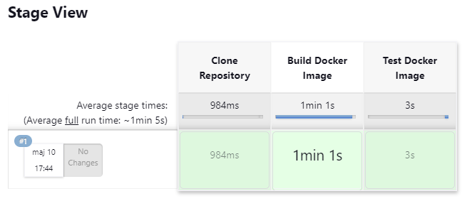
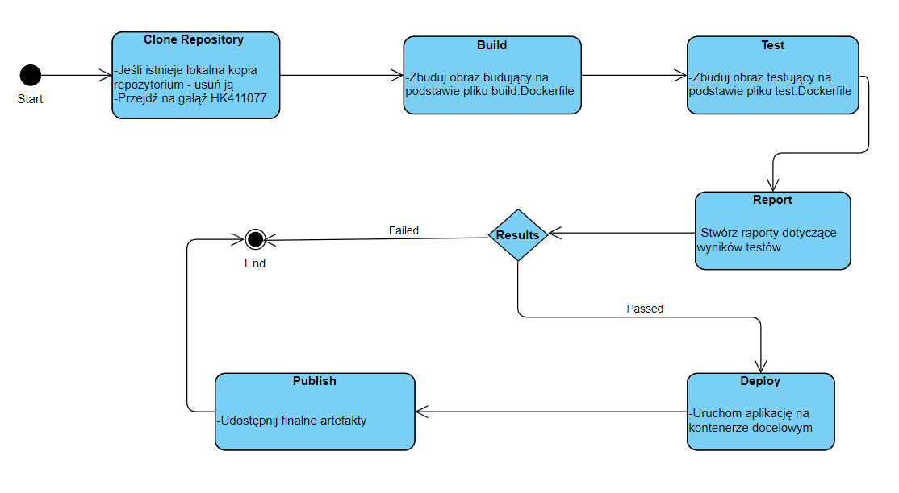

# Sprawozdanie 3 - Hubert Kopczyński 411077

## Wstęp - Pipeline, Jenkins, izolacja etapów

Celem tego sprawozdania jest przedstawienie procesu budowy, testowania, wdrażania i publikowania oprogramowania przy użyciu narzędzi takich jak Jenkins oraz konteneryzacja.

### Przygotowanie

Przed rozpoczęciem pracy z Jenkinsem, należało upewnić się, że kontenery używane do budowania i testowania aplikacji, które zostały stworzone w ramach jednych z poprzednich zajęć, są w pełni funkcjonalne. Aby to sprawdzić wykonałem następujące kroki:

* Przeszedłem do folderu **lab_03** na mojej maszynie wirtualnej, w którym utworzone były Dockerfile automatyzujące budowanie i testowanie aplikacji **node-js-dummy-test** i zbudowałem na ich podstawie obrazy Docker'a:


Widać na powyższych zrzutach, że obrazy zbudowały się poprawanie więc mogłem przejść dalej.

Uruchomienie Docker'a, który eksponuje środowisko zagnieżdżone oraz przygotowanie obrazu blueocean na podstawie obrazu Jenkins'a opisałem w ramach poprzedniego sprawozdania więc ten podpunkt pominąłem, sprawdziłem jedynie, czy kontenery *docker:dind* oraz *jenkins-blueocean* działają poprawnie:


Obraz Jenkinsa to standardowy obraz Docker zawierający Jenkins CI, który jest otwartoźródłowym narzędziem automatyzacji o szerokim zakresie zastosowań, ale głównie skoncentrowanym na automatyzacji budowania i testowania oprogramowania. Interfejs użytkownika w klasycznym obrazie Jenkinsa jest bardziej techniczny i może być mniej intuicyjny dla nowych użytkowników. Zawiera on wszystkie funkcjonalności Jenkinsa.

Blue Ocean to plugin do Jenkinsa, który dostarcza nowoczesny interfejs użytkownika, zaprojektowany by ułatwić i usprawnić proces CI/CD, szczególnie dla nowych użytkowników lub mniej technicznych osób. Blue Ocean automatycznie grupuje informacje związane z budową i testami w bardziej czytelne, wizualne reprezentacje, takie jak pipeline'y czy grafy. Umożliwia też łatwiejsze zarządzanie i wizualizację procesów ciągłej integracji i dostarczania.

### Uruchomienie 

Bedąc na głównej stronie Jenkins'a, wybrałem opcję *Nowy projekt*, który nazwałem "Dispaly Uname" a następnie ustawiłem go jako *Ogólny projekt*. Ukazała się wtedy strona do konfiguracji, na niej udałem się do miejca *Kroki budowania*, i dodałem krok budowania *Uruchom powłokę*. Dodałem tam jedynie treść `uname -a`. Konfigurację zapisałem, uruchomiłem build i przeszedłem do logów konsoli w których zobaczyłem:


Następnie należało utworzyć projekt, który zwraca błąd, gdy godzina jest nieparzysta. Utworzyłem projekt tak samo jak poprzedni i wykonałem go jako skrypt bash. Pobiera on aktualną godzinę a następnie sprawdza, czy jest podzielna przez 2, jeśli nie jest, skrypt kończy się błędem `exit 1`, co powoduje, że Jenkins oznaczy build jako nieudany. Skrypt wyglądał w ten sposób:

```
#!/bin/bash

HOUR=$(date +%H)

if [ $((HOUR % 2)) -ne 0 ]; then
  echo "Obecna godzina to $HOUR, czyli nieparzysta."
  exit 1
else
  echo "Obecna godzina to $HOUR, czyli parzysta."
fi
```

Wynik logów z konsoli w momencie, gdy godzina była parzysta i gdy godzina była nieparzysta:


Kolejną rzeczą do zrobienia było utworzenie "prawdziwego projektu", które będzie klonował repozytorium przedmiotowe, przechodził na osobistą gałąź i budował obrazy z Dockerfiles.

Na głównej stronie Jenkins'a ponownie utworzyłem nowy projekt który tym razem był typu *Pipeline*. W konfiguracji projektu przewinąłem do sekcji **Pipeline** a definicję pozostawiłem jako **Pipeline script**. Pipeline będzie zawierał dwa etapy - klonujący repozytorium i budujący obraz Dockerfile. W pierwszej sekcji usuwany będzie katalog *MDO2024_INO* jeśli już taki istnieje, jeśli nie istnieje to zwracana będzie wartość *true*. Następnie klonowane jest repozytorium przedmiotowe z mojej osobistej gałęzi *HK411077*.

W sekcji drugiej budowany jest jedynie obraz z Dockerfile zawierającego build mojej wybranej aplikacji *node-js-dummy-test*. Cały skrypt jest następujący:

```
pipeline {
    agent any

    stages {
        stage('Clone Repository') {
            steps {
                echo 'Klonowanie repozytrium'
                sh 'rm -r MDO2024_INO || true'
                git branch: 'HK411077', url: 'https://github.com/InzynieriaOprogramowaniaAGH/MDO2024_INO.git'
            }
        }

        stage('Build Docker Image') {
            steps {
                script {
                    echo 'Budowanie obrazu builda'
                    sh 'docker build -f ./INO/GCL1/HK411077/Sprawozdanie2/build.Dockerfile -t node-app-build .'
                }
            }
        }
        
        stage('Test Docker Image') {
            steps {
                script {
                    echo 'Budowanie obrazu testu'
                    sh 'docker build -f ./INO/GCL1/HK411077/Sprawozdanie2/test.Dockerfile -t node-app-test .'
                }
            }
        }
    }
}
```

Wynik uruchomienia tego projektu:



Przykładowe logi (z klonowania repozytorium i budowania obrazów):


### Diagramy UML

#### Wymagania wstępne środowiska:
- Sprzętowe:
  - Środowisko wirtualne z dostępem do internetu
  - Pamięć ram i przestrzeni dyskowej umożliwająca obsługę kontenerów DIND i Jenkins
- Oprogramowanie:
  - System operacyjny Ubuntu Server
  - Kontener Jenkins z zainstalowanym pluginem Blue Ocean i DIND skonfigurowany według instrukcji dostawcy oprogramowania
  - Node.js i npm do zarządzania zależnościami projektu
- Siecowie:
  - Dostęp do repozytorium kodu na GitHub'ie

#### Diagram aktywności



#### Diagram wdrożeniowy


### Pipeline

#### Clone repository

Pierwszy krok miał na celu skopiowanie najnowszego kodu źródłowego z repozytorium Git. Usuwa on, jeśli istnieje, katalog *MDO2024_INO* żeby upewnić się, że operacja klonowania rozpocznie się od zera a następnie klonuje repozytorium z gałęzi *HK411077*. Tak wykonany pierwszy krok umożliwia pracę na najnowszej wersji repozytorium.

```
stage('Clone Repository') {
    steps {
      echo 'Klonowanie repozytorium'
      sh 'rm -r MDO2024_INO || true'
      git branch: 'HK411077', url: 'https://github.com/InzynieriaOprogramowaniaAGH/MDO2024_INO.git'
    }
}
```

#### Build Docker Image

Krok ten ma na celu zbudowanie obrazu Docker na potrzeby builda aplikacji. Buduje on obraz Docker z wykorzystaniem pliku Dockerfile *build.Dockerfile* znajdującego się na ścieżce **./INO/GCL1/HK411077/Sprawozdanie2/** a nazwa zbudowanego obrazu ustalona zostaje jako **node-app-build**. Logi z budowania obrazu zapisywane są do pliku *build-image.log* i wyświetlane w konsoli.

```
stage('Build Docker Image') {
    steps {
        script {
            echo 'Budowanie obrazu builda'
            sh 'docker build -f ./INO/GCL1/HK411077/Sprawozdanie2/build.Dockerfile -t node-app-build . | tee build-image.log'
        }
    }
}
```

#### Test Docker Image

Ten krok również służy do budowania obrazu Docker, tym razem zawierającego testy aplikacji. W tym celu używany jest plik *test.Dockerfile* a nazwa pliku została określona jako **node-app-test**.  W tym kroku również przechwytywane są logi z konsoli i zapisywane do pliku **test-image.log**

```
stage('Test Docker Image') {
    steps {
        script {
            echo 'Budowanie obrazu testu'
            sh 'docker build -f ./INO/GCL1/HK411077/Sprawozdanie2/test.Dockerfile -t node-app-test . | tee test-image.log'
        }
    }
}
```

#### Deploy

W ramach tego etapu musiałem utworzyć nowy plik Dockerfile *deploy.Dockerfile*, służący do zbudowania obrazu uruchamiającego aplikację. Zawartość mojego Dockerfila wyglądała następująco:

```
FROM node-app-build

WORKDIR /node-js-dummy-test

CMD ["npm", "start"]
```

Utworzony plik wstawiłem do tego samego folderu w repozytorium co poprzednie pliki Dockerfile używane do tego pipeline'a.

Plik ten w kroku pipeline'a jest użyty właśnie do zbudowania obrazu Docker pod nazwą **kopczys/node-app**. Następnie jest próba utworzenia sieci Docker o nazwie **node-app-network** a *|| true* sprawia, że polecenie zakończy się błędem, jeśli sieć już istnieje. Ostatnie polecenie w tym kroku uruchamia nowy kontener na podstawie utworzonego obrazu **kopczys/node-app** z włączoną opcją *-d* czyli w trybie odłącznym, oznaczającym, że kontener działa w tle. Nazwa kontenera ustalona zostaje jako **node-app-container** i zostaje on przypisany do wcześniej utworzonej sieci **node-app-network**. Opcja *-p* mapuje port *8080* na hoście na port *8080* w kontenerze. Oznacza to, że aplikacja działająca na porcie 8080 w kontenerze będzie dostępna na porcie 8080 na hoście.

```
stage('Deploy') {
    steps {
        script {
            echo 'Budowanie i uruchamianie obrazu aplikacji'
            sh 'docker build -f ./INO/GCL1/HK411077/Sprawozdanie2/test.Dockerfile -t kopczys/node-app .'
            sh 'docker network create node-app-network || true'                  
            sh 'docker run -d --name node-app-container --network node-app-network -p 8080:8080 kopczys/node-app'
        }
    }
}
```

#### Publish

Ostatnim etapem jest etap *Publish*, który odpowiada za publikację obrazu Docker w Docker Hub. Skrypt w tym etapie rozpoczyna się od zalogowania się do Docker Hub za pomocą polecenia `docker login`. Parametr *-u* określa nazwę użytkownika - w moim przypadku *kopczys*, a parametr *-p* oczekuje na podanie hasła w miejscu *<MY_PASSWORD>* (w tym miejscu wpisałem właśnie swoje hasło). Po pomyślnym zalogowaniu, skrypt używa polecenia `docker push` do przesłania obrazu do Docker Hub. Parametr *kopczys/node-app* określa nazwę obrazu Docker, który ma być właśnie wypchnięty do rejestru.

```
stage('Publish') {
    steps {
        script {
            sh "docker login -u kopczys -p <MY_PASSWORD>"
            sh 'docker push kopczys/node-app'        
        }
    }
}
```

### Pipeline - podsumowanie

Cały mój pipeline wygląda tak:

```
pipeline {
    agent any

    stages {
        stage('Clone Repository') {
            steps {
                echo 'Klonowanie repozytorium'
                sh 'rm -r MDO2024_INO || true'
                git branch: 'HK411077', url: 'https://github.com/InzynieriaOprogramowaniaAGH/MDO2024_INO.git'
            }
        }

        stage('Build Docker Image') {
            steps {
                script {
                    echo 'Budowanie obrazu builda'
                    sh 'docker build -f ./INO/GCL1/HK411077/Sprawozdanie2/build.Dockerfile -t node-app-build . | tee build-image.log'
                }
            }
        }
        
        stage('Test Docker Image') {
            steps {
                script {
                    echo 'Budowanie obrazu testu'
                    sh 'docker build -f ./INO/GCL1/HK411077/Sprawozdanie2/test.Dockerfile -t node-app-test . | tee test-image.log'
                }
            }
        }

        stage('Deploy') {
            steps {
                script {
                    sh 'docker stop node-app-container || true'
                    sh 'docker rm node-app-container || true'
                    
                    echo 'Budowanie i uruchamianie obrazu aplikacji'
                    sh 'docker build -f ./INO/GCL1/HK411077/Sprawozdanie2/test.Dockerfile -t kopczys/node-app .'
                    sh 'docker network create node-app-network || true'                  
                    sh 'docker run -d --name node-app-container --network node-app-network -p 8080:8080 kopczys/node-app'
                }
            }
        }

        stage('Publish') {
            steps {
                script {
                    sh "docker login -u kopczys -p <MY_PASSWORD>"
                    sh 'docker push kopczys/node-app'        
                }
            }
        }
    }
}
```

Po zapisaniu go, przeszedłem już do uruchomienia a efekt był następujący:


Końcówka logów z pipeline:


Jak widać, wszystko poszło prawidłowo, więc spróbowałem już bezpośrednio na mojej maszynie wirtualnej pobrać za pomocą polecenia `docker run kopczys/node-app` wypchnięty przeze mnie obraz. Po wpisaniu tego polecenia efekt był następujący:


Co potwierdza, że wszystko poszło pomyślnie.