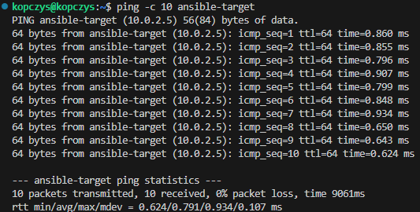

# Sprawozdanie 4 - Hubert Kopczyński 411077

## Wstęp - Automatyzacja i zdalne wykonywanie poleceń za pomocą Ansible, Pliki odpowiedzi dla wdrożeń nienadzorowanych


### Instalacja zarządcy Ansible

W ramach tych zajęć laboratoryjnych pierwszą do wykonania rzeczą było zainstalowanie zarządcy Ansible. W tym celu należało utworzyć nową maszynę wirtualną z takim samym system operacyjnym co maszyna główna i o jak najmniejszym zbiorzee zainstalowanego oprogramowania. W moim przypadku systemem operacyjnym był system **Ubuntu 22.04**. Podczas instalacji systemu wybrałem więc opcję *Ubuntu Server (minimized)*, która zapewnia, że zainstalowany system nie będzie miał zbędnych w tym wypadku dla nas pakietów:


Kolejną opcją którą również wybrałem podczas instalacji było zainstalowanie serwera SSH by nie musieć tego robić później:


Po zakończonej instalacji i zalogowaniu się na utworzone konto, które utworzyłem również podczas instalacji nadając nazwę użytkownika **ansible** i hostname **ansible-target**, sprawdziłem czy na maszynie zainstalowany jest program *tar* i *openSSH* poleceniami:

```
tar --version
ssh -V
```

Rezultat był następujący:


Oba te programy były zainstalowane więc przeszedłem do zrobieenia migawki maszyny:


W tym momencie przeszedłem na swoją główną maszynę wirtualną na której należało zainstalować oprogramowanie Ansible. W tym celu najpierw zaktualizowałem pakiety i system poleceniami:

```
sudo apt update
sudo apt upgrade
```

A następnie zgodnie z instrukcją instalacji w dokumentacji Ansible dla mojego systemu operacyjnego zainstalowałem pakiet *software-properties-common* poleceniem:

```
sudo apt install software-properties-common
```

Kolejną rzeczą w ramach instalacji było dodanie repozytorium *ppa:ansible/absible* poleceniem:

```
sudo add-apt-repository --yes --update ppa:ansible/ansible
```

Ostatnią rzeczą było już po prostu zainstalowanie programu *Ansible*:

```
sudo apt install ansible
```

Sprawdziłem jeszcze wersję zainstalowanego Ansible po to, żeby w ogóle być pewnym że się zainstalował poleceniem:

```
ansible --version
```

Polecenie zwróciło mi:


Co potwierdziło, że program zainstalował się prawidłowo.

Ostatnim krokiem w ramach instalacji była wymiana kluczy SSH między użytkownikiem na głównej maszynie wirtualnej, a użytkownikiem *ansible* z nowej maszyny tak, by logowanie `ssh ansible@ansible-target` nie wymagało podania hasła. Domyślnie obie moje maszyny używały sieci NAT i miały ten sam adres IP więc łączność pomiędzy nimi była niemożliwa. Żeby umożliwić im łączność musiałem wyłączyłem obie swoje maszyny wirtualne i w górnym pasku menu VirtualBox'a przeszedłem kolejno *Plik -> Narzędzia -> Network Manager*:


Gdy tam kliknąłem pojawiły się ustawienia sieci w których przeszedłem do zakładki *NAT Networks* i w niej utwórzyłem nową sieć z domyślnymi ustawieniami o nazwie *MyNetwork*:


W ustawieniach obu maszyn wirtalnych przeszedłem do zakładki *Sieć* i tam zamieniłem opcję *Podłączona do: NAT* na opcję *Podłączona do: Sieć NAT* i wybrałem nazwę utworzonej chwilę wcześniej sieci *MyNetwork*:


Żeby tak jak wcześniej móc korzystać z głównej maszyny wirtualnej za pomocą SSH w Visual Studio Code musiałem przekierować port maszyny głównej. W tym celu przeszedłem znowu tak jak wcześniej do *Network Manager* i tam na dole okna wybrałem zakładkę *Przekierowanie portów*. W odpalonej głównej maszynie wirtualnej sprawdziłem jaki adres ma za pomocą polecenia `ifconfig`:


Port dla połączeń SSH sprawdziłem natomiast w pliku pod ścieżką */etc/ssh/sshd_config*:


Teraz już tylko przepisałem to przy przekierowaniu portów i maszyna z powrotem działała mi po ssh (przekierowałem również port związany z Jenkinsem, żeby on również mógł działać mimo zmiany sieci):


Gdy wszystko już działało sprawdziłem w ten sam sposób, czyli za pomocą polecenia `ifconfig` adres nowej maszyny wirtualnej i dowiedziałem się że jest to adres *10.0.2.5*:


Na głównej maszynie wirtualnej spróbowałem się połączyć z nową maszyną poleceniem `ssh ansible@10.0.2.5* co zakończyło się pomyślnie:


Nie chciałem jednak łączyć się poprzez użycie adresu tylko poprzez użycie hostname'a więc do głównej maszyny musiałem dodać przekierowanie. Otworzyłem na głównej maszynie plik *etc/hosts* z uprawnieniami administratora czyli przy użyciu polecenia `sudo` i dopisałem w nim linijkę:

```
10.0.2.5 ansible-target
```

Plik zapisałem i spróbowałem teraz połączyć się po ssh używając polecenia `ssh ansible@ansible-target` co zakończyło się sukcesem:


Komunikacja działała już poprawnie więc teraz musiałem wymienić pomiędzy maszynami klucze SSH. Wystarczyło jedynie przekopiować klucz publiczny z maszyny *ansible-target* na maszynę główną używając w niej (głównej maszynie) polecenia:

```
ssh-copy-id ansible@ansible-target
```

I w tym momencie mogłem wreszcie logować się z głównej maszyny na nową bez użycia hasła używając jedynie `ssh ansible@ansible-target`:


### Inwentaryzacja

Kolejnym krokiem w ramach tych ćwiczeń laboratoryjnych było dokonanie inwentaryzacji systemów. Należało najpierw ustalić przewidywane nazwy komputerów stosując `hostnamectl` ale one były już przeze mnie ustalone wcześniej. Nazwa głównej maszyny w moim przypadku to *kopczys* natomiast druga maszyna to *ansible-target*. Potwierdziłem to jedynie sprawdzając wynik tego polecenia:


Wprowadzenie nazwy DNS drugiej maszyny w maszynie głównej również zrobiłem już wcześniej, edytujać plik pod ścieżką */etc/hosts* więc zweryfikowałem jedynie łączność poleceniem `ping -c 10 ansible-target`, w którym opcja *-c* oznacza ile pakietów zostanie wysłanych:



W drugiej maszynie, musiałem wprowadzić jednak nazwę DNS i zweryfikować łączność. W tym celu doinstalowałem na niej pakiet *nano* do edycji plików i pakiet *iputils-ping* do sprawdzania osiągalności hostów sieciowych. Teraz dzięki pakietowi *nano* mogłem zmodyfikować plik pod ścieżką */etc/hosts* i dodałem w nim linijkę:

```
10.0.2.4 kopczys
```

Zweryfikowałem łączność w taki sam sposób jak poprzednio (z tym że nazwą było *kopczys* a nie *ansible-target*) co dało pozytywny rezultat:


Używając dokumentacji *Ansible* należało teraz stworzyć plik inwentaryzacji. W tym celu utworzyłem na głównej maszynie folder *ansible_quickstart* i przeszedłem do niego. Wewnątrz folderu utworzyłem plik *inventory.ini*, z następującą zawartością:

```
[Orchestrators]
kopczys ansible_user=kopczys

[Endpoints]
ansible-target ansible_user=ansible
```

Znajdując się w folderze z tym plikiem dokonałem weryfikacji inwentarzu poleceniem:

```
ansible-inventory -i inventory.ini --list
```

Którego rezultat był taki:


Wysłanie żądania `ping` do wszystkich maszyn odbywa się za pomocą polecenia `ansible all -i inventory.ini -m ping`. Gdy spróbowałem po raz pierwszy wysłać ping rezultat był negatywny:


Okazało się, że klucz z maszyny głownej nie został wymieniony z nią samą. Żeby wyeliminować ten błąd użyłem polecenia `ssh-copy-id kopczys@kopczys`. Po wymianie klucza wysłanie ping'a do wszystkich maszyn poszło już bez żadnych problemów:


### Zdalne wywoływanie procedur

