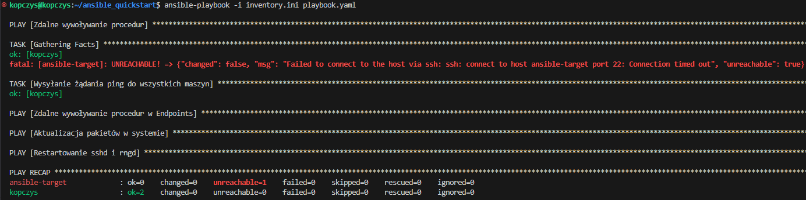

# Sprawozdanie 4 - Hubert Kopczyński 411077

## Wstęp - Automatyzacja i zdalne wykonywanie poleceń za pomocą Ansible, Pliki odpowiedzi dla wdrożeń nienadzorowanych

W ramach tych ćwiczeń laboratoryjnych przeprowadzono proces instalacji Ansible na głównej maszynie wirtualnej oraz konfigurację maszyny docelowej. Następnie przeprowadzono kroki związane z wymianą kluczy SSH, tworzeniem pliku inwentaryzacji, weryfikacją łączności między maszynami, oraz uruchomieniem playbooków Ansible do instalacji Dockera, wdrażania kontenerów i zarządzania nimi.

Drugie ćwiczenia dotyczyły instalacji i konfiguracji systemu Fedora za pomocą instalatora sieciowego oraz pliku odpowiedzi Anaconda. Udokumentowane zostały działania wykonane w celu automatyzacji instalacji systemu.

### Instalacja zarządcy Ansible

W ramach tych zajęć laboratoryjnych pierwszą do wykonania rzeczą było zainstalowanie zarządcy Ansible. W tym celu należało utworzyć nową maszynę wirtualną z takim samym system operacyjnym co maszyna główna i o jak najmniejszym zbiorzee zainstalowanego oprogramowania. W moim przypadku systemem operacyjnym był system **Ubuntu 22.04**. Podczas instalacji systemu wybrałem więc opcję *Ubuntu Server (minimized)*, która zapewnia, że zainstalowany system nie będzie miał zbędnych w tym wypadku dla nas pakietów:


Kolejną opcją którą również wybrałem podczas instalacji było zainstalowanie serwera SSH by nie musieć tego robić później:


Po zakończonej instalacji i zalogowaniu się na utworzone konto, które utworzyłem również podczas instalacji nadając nazwę użytkownika **ansible** i hostname **ansible-target**, sprawdziłem czy na maszynie zainstalowany jest program *tar* i *openSSH* poleceniami:

```
tar --version
ssh -V
```

Rezultat był następujący:


Oba te programy były zainstalowane więc przeszedłem do zrobieenia migawki maszyny:


W tym momencie przeszedłem na swoją główną maszynę wirtualną na której należało zainstalować oprogramowanie Ansible. W tym celu najpierw zaktualizowałem pakiety i system poleceniami:

```
sudo apt update
sudo apt upgrade
```

A następnie zgodnie z instrukcją instalacji w dokumentacji Ansible dla mojego systemu operacyjnego zainstalowałem pakiet *software-properties-common* poleceniem:

```
sudo apt install software-properties-common
```

Kolejną rzeczą w ramach instalacji było dodanie repozytorium *ppa:ansible/absible* poleceniem:

```
sudo add-apt-repository --yes --update ppa:ansible/ansible
```

Ostatnią rzeczą było już po prostu zainstalowanie programu *Ansible*:

```
sudo apt install ansible
```

Sprawdziłem jeszcze wersję zainstalowanego Ansible po to, żeby w ogóle być pewnym że się zainstalował poleceniem:

```
ansible --version
```

Polecenie zwróciło mi:


Co potwierdziło, że program zainstalował się prawidłowo.

Ostatnim krokiem w ramach instalacji była wymiana kluczy SSH między użytkownikiem na głównej maszynie wirtualnej, a użytkownikiem *ansible* z nowej maszyny tak, by logowanie `ssh ansible@ansible-target` nie wymagało podania hasła. Domyślnie obie moje maszyny używały sieci NAT i miały ten sam adres IP więc łączność pomiędzy nimi była niemożliwa. Żeby umożliwić im łączność musiałem wyłączyłem obie swoje maszyny wirtualne i w górnym pasku menu VirtualBox'a przeszedłem kolejno *Plik -> Narzędzia -> Network Manager*:


Gdy tam kliknąłem pojawiły się ustawienia sieci w których przeszedłem do zakładki *NAT Networks* i w niej utwórzyłem nową sieć z domyślnymi ustawieniami o nazwie *MyNetwork*:


W ustawieniach obu maszyn wirtalnych przeszedłem do zakładki *Sieć* i tam zamieniłem opcję *Podłączona do: NAT* na opcję *Podłączona do: Sieć NAT* i wybrałem nazwę utworzonej chwilę wcześniej sieci *MyNetwork*:


Żeby tak jak wcześniej móc korzystać z głównej maszyny wirtualnej za pomocą SSH w Visual Studio Code musiałem przekierować port maszyny głównej. W tym celu przeszedłem znowu tak jak wcześniej do *Network Manager* i tam na dole okna wybrałem zakładkę *Przekierowanie portów*. W odpalonej głównej maszynie wirtualnej sprawdziłem jaki adres ma za pomocą polecenia `ifconfig`:


Port dla połączeń SSH sprawdziłem natomiast w pliku pod ścieżką */etc/ssh/sshd_config*:


Teraz już tylko przepisałem to przy przekierowaniu portów i maszyna z powrotem działała mi po ssh (przekierowałem również port związany z Jenkinsem, żeby on również mógł działać mimo zmiany sieci):


Gdy wszystko już działało sprawdziłem w ten sam sposób, czyli za pomocą polecenia `ifconfig` adres nowej maszyny wirtualnej i dowiedziałem się że jest to adres *10.0.2.5*:


Na głównej maszynie wirtualnej spróbowałem się połączyć z nową maszyną poleceniem `ssh ansible@10.0.2.5` co zakończyło się pomyślnie:


Nie chciałem jednak łączyć się poprzez użycie adresu tylko poprzez użycie hostname'a więc do głównej maszyny musiałem dodać przekierowanie. Otworzyłem na głównej maszynie plik *etc/hosts* z uprawnieniami administratora czyli przy użyciu polecenia `sudo` i dopisałem w nim linijkę:

```
10.0.2.5 ansible-target
```

Plik zapisałem i spróbowałem teraz połączyć się po ssh używając polecenia `ssh ansible@ansible-target` co zakończyło się sukcesem:


Komunikacja działała już poprawnie więc teraz musiałem wymienić pomiędzy maszynami klucze SSH. Wystarczyło jedynie przekopiować klucz publiczny z maszyny *ansible-target* na maszynę główną używając w niej (głównej maszynie) polecenia:

```
ssh-copy-id ansible@ansible-target
```

I w tym momencie mogłem wreszcie logować się z głównej maszyny na nową bez użycia hasła używając jedynie `ssh ansible@ansible-target`:


### Inwentaryzacja

Kolejnym krokiem w ramach tych ćwiczeń laboratoryjnych było dokonanie inwentaryzacji systemów. Należało najpierw ustalić przewidywane nazwy komputerów stosując `hostnamectl` ale one były już przeze mnie ustalone wcześniej. Nazwa głównej maszyny w moim przypadku to *kopczys* natomiast druga maszyna to *ansible-target*. Potwierdziłem to jedynie sprawdzając wynik tego polecenia:


Wprowadzenie nazwy DNS drugiej maszyny w maszynie głównej również zrobiłem już wcześniej, edytujać plik pod ścieżką */etc/hosts* więc zweryfikowałem jedynie łączność poleceniem `ping -c 10 ansible-target`, w którym opcja *-c* oznacza ile pakietów zostanie wysłanych:


W drugiej maszynie, musiałem wprowadzić jednak nazwę DNS i zweryfikować łączność. W tym celu doinstalowałem na niej pakiet *nano* do edycji plików i pakiet *iputils-ping* do sprawdzania osiągalności hostów sieciowych. Teraz dzięki pakietowi *nano* mogłem zmodyfikować plik pod ścieżką */etc/hosts* i dodałem w nim linijkę:

```
10.0.2.4 kopczys
```

Zweryfikowałem łączność w taki sam sposób jak poprzednio (z tym że nazwą było *kopczys* a nie *ansible-target*) co dało pozytywny rezultat:


Używając dokumentacji *Ansible* należało teraz stworzyć plik inwentaryzacji. W tym celu utworzyłem na głównej maszynie folder *ansible_quickstart* i przeszedłem do niego. Wewnątrz folderu utworzyłem plik *inventory.ini*, z następującą zawartością:

```
[Orchestrators]
kopczys ansible_user=kopczys

[Endpoints]
ansible-target ansible_user=ansible
```

Znajdując się w folderze z tym plikiem dokonałem weryfikacji inwentarzu poleceniem:

```
ansible-inventory -i inventory.ini --list
```

Którego rezultat był taki:


Wysłanie żądania `ping` do wszystkich maszyn odbywa się za pomocą polecenia `ansible all -i inventory.ini -m ping`. Gdy spróbowałem po raz pierwszy wysłać ping rezultat był negatywny:


Okazało się, że klucz z maszyny głownej nie został wymieniony z nią samą. Żeby wyeliminować ten błąd użyłem polecenia `ssh-copy-id kopczys@kopczys`. Po wymianie klucza wysłanie ping'a do wszystkich maszyn poszło już bez żadnych problemów:


### Zdalne wywoływanie procedur

Teraz należało za pomocą playbooka Ansible w pierwszej kolejności wysłać żądanie `ping` do wszystkich maszyn. W tym celu w folderze *ansible_quickstart* utworzyłem plik *playbook.yaml*, którego zawartość edytowałem do kolejnych wymaganych podpunktów zadania, aczkolwiek do tego zadania jego zawartość wyglądała tak:

```
- name: Zdalne wywoływanie procedur
  hosts: all
  tasks:
    - name: Wysyłanie żądania ping do wszystkich maszyn
      ansible.builtin.ping:
```

Działanie playbook'a zarówno za tym jak i za każdym kolejnym razem sprawdzałem za pomocą polecenia:

```
ansible-playbook -i inventory.ini playbook.yaml
```

Rezultat:


Kolejnym krokiem było skopiowanie pliku inwentaryzacji na maszynę `Endpoints`. Do mojego playbook'a dodałem kolejną część:

```
- name: Zdalne wywoływanie procedur w Endpoints
  hosts: Endpoints
  tasks:
    - name: Kopiowanie pliku inwentaryzacji na maszynę Endpoints
      copy:
        src: ~/ansible_quickstart/inventory.ini
        dest: ~/inventory.ini
```

Po uruchomieniu playbook'a po raz pierwszy widać, że część odpowiadająca za kopiowanie pliku inwentaryzacji na maszynę Endpoints jest podświetlona na żółto. Związane jest to z tym, że operacja ta została wykonana po raz pierwszy i podczas niej zaszły zmiany w plikach na maszynie *ansible-target*:


Przy drugim uruchomieniu playbook'a część ta zmieniła swój kolor na zielony, co oznacza że wszystko poszło poprawnie i nie zostały zmodyfikowane żadne pliki:


Kolejną rzeczą do wykonania za pomocą playbook'a było zaktualizowanie pakietów w systemie. W tym wypadku konieczne było podanie hasła do admina `anisble_become_pass` na maszynie ansible-target i użycia `become=yes`:

```
- name: Aktualizacja pakietów w systemie
  hosts: Endpoints
  vars:
    ansible_become_pass: 12345
  tasks:
    - name: update
      become: yes
      apt:
        name: '*'
        state: latest
```

Pakiety systemów udało się zaktualizować:


Do wykonania restartu usługi `sshd` i `rngd` dopisałem taki fragment w playbook'u:

```
- name: Restartowanie sshd i rngd
  hosts: Endpoints
  vars:
    ansible_become_pass: 12345
  tasks:
  - name: Restart sshd
    become: yes
    service:
      name: sshd
      state: restarted

  - name: Restart rngd
    become: yes
    service:
      name: rngd
      state: restarted
```

W tym wypadku również konieczne jest użycie hasła admina i zastosowanie `become: yes`. Po uruchomieniu rezultat był taki:


Restartowanie usługi `sshd` przebiegło pomyślnie natomiast usługi `rngd` nie udało się zrestartować gdyż nawet nie było jej zainstalowanej na maszynie *ansible-target*. Zalogowałem się więc do niej i doinstalowałem pakiet w którym ta usługa się znajduje. Następnie musiałem go jeszcze uruchomić ale po tym okazało się, że po pobraniu odpowiednich pakietów nie mogłem dalej zrestartować pakietu `rngd` pod taką nazwą ale mogłem zrestartować go pod nazwą `rng-tools`:


Zmiana stanu przy restartowaniu tych usług oznacza, że poszło to zgodnie z planem.

Ostanim co należało zrobić to przeprowadzić te operacje z wyłączonym serwerem SSH oraz z odpiętą kartą sieciową. SSH na maszynie docelowej czyli na *ansible-target* wyłączyłem za pomocą polecenial:

```
sudo systemctl stop ssh
```

Teraz przy próbie wykonania playbook'a na głównej maszynie *kopczys* rezultat był taki:


Komunikat mówi, że nie udało się połączyć z hostem za pomocą ssh i połączenie zostało odrzucone.

W drugim przypadku w ustawieniach sieci w VirtualBox odznaczyłem opcję *Kabel podłączony* tak jak na zrzucie ekranu:


A po wykonanie playbook'a otrzymałem taki rezultat:



W komunikacie o błędzie tym razem widać, że zamiast odrzucenia połączenia to został przekroczony limit czasu połączenia więc wykonanie playbook'a również zakończyło się niepowodzeniem.

### Zarządzanie kontenerem

Do rozpoczęcia wykonywania tego zadania utworzyłem nowego playbook'a, którego najpierw wykorzystałem do pobrania Docker'a na maszynę docelową *ansible-target*. Plik *inventory.ini* pozostawiłem taki sam jak wcześniej kopiując go po prostu do nowego folderu z nowym playbook'iem. Playbook z instalacją Docker'a wygląda tak:

```
- name: Instalowanie Docker'a
  hosts: Endpoints
  vars:
    ansible_become_pass: 12345
  tasks:
    - name: update
      become: yes
      apt:
        name: '*'
        state: latest
    
    - name: Instalacja Docker'a
      become: yes
      apt:
        name: docker.io
        state: latest

    - name: Uruchom Dockera przy uruchomieniu systemu
      become: yes
      command: systemctl enable --now docker
```

Przed instalacją sprawdzane jest jeszcze w nim, czy pakiety na maszynie *ansible-target* są zaktualizowane i jeśli nie to najpierw je zaktualizuje. Po instalacji zapewniane jest jeszcze każdorazowe uruchamianie Docker'a podczas uruchamiania systemu.

Teraz mogłem przejść do pobrania aplikacji opublikowanej w ramach kroku `Publish` z poprzednich zajęć. Treść dopisana do playbook'a w tym celu:

```
- name: Pobranie aplikacji
  hosts: Endpoints
  vars:
    ansible_become_pass: 12345
  become: yes
  tasks:
    - name: Pobierz obraz z DockerHub
      community.docker.docker_image:
        name: kopczys/node-app
        source: pull
    - name: Uruchom kontener
      become: yes
      community.docker.docker_container:
        name: node-app-container
        image: kopczys/node-app
        state: started
        detach: yes
        ports:
          - "3000:3000"
```

W powyższym fragmencie najpierw zaciągany jest obraz z mojego DockerHub'a a następnie uruchamiany jest kontener w trybie rozłącznym ze zmapowanym portem 3000. Po zalogowaniu na drugą maszynę i sprawdzeniu pobranych obrazów mogę zobaczyć uzyskany rezultat:


Gdy sprawdziłem czy jest uruchomiony również zobaczyłem że tak był przez chwilę ale został automatycznie wyłączony:


Ostatnim co należało dopisać to fragment, który zatrzyma kontener (który i tak jest już zatrzymany po uruchomieniu) i usunie go. Tak wygląda kod który to robi:

```
- name: Zatrzymanie i usunięcie kontenera
  hosts: Endpoints
  vars:
    ansible_become_pass: 12345
  become: true
  tasks:
    - name: Zatrzymaj i usuń kontener
      docker_container:
        name: node-app-container
        state: absent

```

Po wykonaniu playbook'a i sprawdzeniu na maszynie docelowej listę obrazów otrzymałem teraz pustą listę co oznacza że kontener został poprawnie usunięty:


Całość uruchomienia playbook'a wyglądała tak:


Ostatnim co należało zrobić na tych ćwiczeniach laboratoryjnych to ubrać powyższe kroki w rolę, za pomocą szkieletowania `ansible-galaxy`. 

Zadanie to zacząłem od utworzenia folderu *roles*, w którym znajdą się moje role. W utworzonym folderze skorzystałem z poniższych poleceń do utworzenia 3 ról:

```
ansible-galaxy init install_docker
ansible-galaxy init download_image
ansible-galaxy init remove_container
```

W każdej z ról należało przejść do powstałego po użyciu polecenia folderu z rolą, następnie do folderu *tasks* i przekopiować odpowiednie fragmenty poprzedniego playbook'a. W przypadku *install_docker* było to:

```
- name: update
  become: yes
  apt:
    name: '*'
    state: latest

- name: Instalacja Docker'a
  become: yes
  apt:
    name: docker.io
    state: latest
- name: Uruchom Dockera przy uruchomieniu systemu
  become: yes
  command: systemctl enable --now docker
```

Dla *download_image*:

```
- name: Pobierz obraz z DockerHub
  community.docker.docker_image:
    name: kopczys/node-app
    source: pull
- name: Uruchom kontener
  become: yes
  community.docker.docker_container:
    name: node-app-container
    image: kopczys/node-app
    state: started
    detach: yes
    ports:
      - "3000:3000"
```

A dla *remove_container*:

```
- name: Zatrzymaj i usuń kontener
  docker_container:
    name: node-app-container
    state: absent
```

Teraz wróciłem do folderu, w którym utworzyłem foler *roles* czyli do *zarzadzanie_kontenerem* i utworzyłem tam nowego playbook'a *roles_playbook.yaml* z następującą zawartością:

```
- name: Playbook z użyciem roli
  hosts: Endpoints
  become: yes
  vars:
    ansible_become_pass: 12345
  roles:
    - install_docker
    - download_image
    - remove_container
```

Wykonałem teraz poleceniem `ansible-playbook -i inventory.ini roles_playbook.yaml` co zakończyło się powodzeniem:


## Pliki odpowiedzi dla wdrożeń nienadzorowanych

Na początku drugich ćwiczeń laboratoryjnych w ramach tego sprawozdania należało pobrać obraz systemu Fedora, stosując instalator sieciowy (*netinst*). Ja wybrałem obraz Fedora 40.

Podczas instalacji jako źródło instalacji wybrałem typ adresu URL jako *lista serwerów lustrzanych* i wpisałem adres `http://mirrors.fedoraproject.org/mirrorlist?repo=fedora-40&arch=x86_64`:


Wybór oprogramowania ustawiłem jako *Minimalna instalacja* z włączonym jednym dodatkowym oprogramowaniem - *Zarządzanie kontenerami*. Po ustawieniu wszystkiego w instalatorze wyglądało to tak:


Następnie rozpocząłem instalację.

Po zakończeniu instalacji zalogowałem się na utworzone konto. Będą w katalogu domowym mojego użytkownika przekopiowałem plik **anaconda-ks.cfg** do niego za pomocą polecenia:

```
sudo cp root/anaconda-ks.cfg .
```


Żeby móc zobaczyć zawartość pliku musiałem go również otworzyć z użyciem `sudo` czyli z uprawnieniami administratora. Gdy plik otworzyłem jego zawartość wyglądała tak:


W pliku brakowało wzmianek o repozytorium zatem dodałem w nim linię zawierającą:

```
repo --name=update --mirrorlist=http://mirrors.fedoraproject.org/mirrorlist?repo=updates-released-f40&arch=x86_64
```

Zmnieniłem również czyszczenie partycji na:

```
clearpart --all
```

Oraz dodałem wzmiankę zmiany nazwy hosta i na końcu pliku wzmiankę restartu systemu po ukończeniu instalacji:

```
network --hostname=kopczys
reboot
```

W tym momencie plik był gotowy do uruchomienia instalacji nienadzorowanej. Musiałem w tym celu umieścić go w repozytorium na GitHub'ie. Pobrałem go za pomocą `scp` na komputer lokalny a następnie wstawiłem do repozytorium przedmiotu.

Wyłączyłem maszynę z Fedorą i utworzyłem nową maszynę z tym samym obrazem. Podczas uruchamiania kliknąłem klawisz *e* w celu uruchomienia panelu *GRUB*. W otworzonym okienku dopisałem w linii poleceń polecenie:

```
inst.ks=https://https://raw.githubusercontent.com/InzynieriaOprogramowaniaAGH/MDO2024_INO/HK411077/INO/GCL1/HK411077/Sprawozdanie4/anaconda-ks.cfg
```


Teraz kliknąłem klawisz *F10*, który rozpoczął boot'owanie systemu. Po instalacji system sam się rzeczywiście zresetował, nie trzeba było tego ręcznie klikać jak w poprzednim przypadku. Gdy się zrestartował wszedłem w opcję *Troubleshooting* a następnie kliknąłem *Boot first drive* co uruchomiło system.


Tak przeprowadzone kroki uruchomiły system:

