# Sprawozdanie 5 - Hubert Kopczyński 411077

## Wstęp - Wdrażanie na zarządzalne kontenery: Kubernetes

W trakcie tych dwóch ćwiczeń laboratoryjnych przeprowadziłem serię działań związanych z wdrażaniem aplikacji w klastrze Kubernetes - konfigurację klastra, instalację aplikacji za pomocą plików YAML oraz eksperymentowaniu z różnymi strategiami wdrażania.

### Instalacja klastra Kubernetes

W ramach tych zajęć laboratoryjnych nr 10 pierwszą do wykonania rzeczą było zainstalowanie klastry Kubernetes. Należało zaopatrzyć się w implementację stosu k8s. Przeszedłem na stronę podaną w instrukcji, tam wybrałem system operacyjny *Linux* z architekturą *x86_64* i typem instalatora *Debian package*. Pobrałem najnowszą stabilną wersję *minikube* za pomocą polecenia z instrukcji:

```
curl -LO https://storage.googleapis.com/minikube/releases/latest/minikube_latest_amd64.deb
```

A następnie zainstalowałem *minikube* kolejnym poleceniem w instrukcji:

```
sudo dpkg -i minikube_latest_amd64.deb
```


Krastrę *minikube* uruchomiłem następnie poleceniem `minikube start`:


Teraz przeszedłem do zaopatrzenia się w polecenie `kubectl` w wariancie *minikube*. Mając zainstalowanego *minikube* mogłem je pobrać za pomocą polecenia:

```
minikube kubectl -- get po -A
```

W celu ułatwienia dalszej pracy, żeby za każdym razem nie musieć używać polecenia `minikube kubectl` tylko zamiast niego po prostu `kubectl` skorzystałem z instrukcji i użyłem polecenia:

```
alias kubectl="minikube kubectl --"
```


Sprawdziłem listę działających kontenerów i zobaczyłem na niej, że kontener z *minikube* faktycznie zaczął działać:


W przypadku korzystania z *minikube* ważnym jest, aby na maszynie wirtualnej dostosować ustawienia zasobów (RAM, CPU, disk space). W dokumentacji możemy dowiedzieć się, że minikube potrzebuje co najmniej 2 procesorów (najlepiej w tym przypadku ustawić chociaż 3), 2GB wolnej pamięci RAM, 20 GB wolnej przestrzeni na dysku i stałego łącza z Internetem. W momencie, gdy maszyna nie będzie spełniać tych wymagać, *minikube* po prostu nie będzie chciał się uruchomić.

Dashboard w *minikube* uruchamia się za pomocą polecenia `minikube dashboard`, które po użyciu automatycznie otwiera nam w przeglądarce dashboard. Po przejściu na stronę dashboard'u przeszedłem do sekcji *Pods* w zakładkach po lewej stronie i wyświetliłem wszystkie przestrzenie nazw w rozwijanym menu na górze strony, co dało mi taki efekt:


Zapoznałem się z koncepcjami funkcji wyprowadzanych przez Kubernetesa i dowiedziałem się, że:

* *Pod* to najmniejsza i najprostsza jednostka w środowisku kontenerowym, zawierająca jeden lub więcej konteenerów, które współdzielą zasoby i sieć.

* *Deployment* zarządza zestawem podów, zapewnia ich skalowanie, aktualizacje oraz odporność na awarie.

* *Service* to abstrakcja umożliwiająca logiczny dostęp do zestawu podów, zapewniając stabilny punkt komunikacji wewnątrz lub z zewnątrz klastra.

Poprawne zakończenie pracy Kubernetes'a, które zapobiega pojawieniu się jakichś błędów po ponownym włączeniu maszyny wirtualnej odbywa się poprzez użycie polecenia:

```
minikube stop
```

### Analiza posiadanego kontenera

Używana przeze mnie wcześniej aplikacja nie nadawała się do użycia w tym ćwiczeniu - kontener natychmiastowo kończył pracę po uruchomieniu. Zamiast niej, wybrałem aplikację *nginx*, którą zgodnie z instrukcją ubiorę we własną konfigurację.

Przed pobraniem *nginx* najpierw zaktualizowałem pakiety na swojej maszynie wirtualnej `sudo apt update` a następnie zainstalowałem go `sudo apt install nginx`.

Po zainstalowaniu sprawdziłem, czy *nginx* poprawnie pracuje poleceniem `sudo systemctl status nginx` i dowiedziałem się że tak:


Przeszedłem więc do utworzenia konfiguracji, której będzie używał *nginx*. W tym celu skopiowałem do swojego katalogu roboczego plik *index.html* ze ścieżki */usr/share/nginx/html/index.html* i zmodyfikowałem tytuł strony i nagłówek *h1* z *nginx'em* tak, żeby wyświetlał napis *HK411077*:

```
<!DOCTYPE html>
<html>
<head>
<title>HK411077</title>
<style>
    body {
        width: 35em;
        margin: 0 auto;
        font-family: Tahoma, Verdana, Arial, sans-serif;
    }
</style>
</head>
<body>
<h1>HK411077</h1>
<p>If you see this page, the nginx web server is successfully installed and
working. Further configuration is required.</p>

<p>For online documentation and support please refer to
<a href="http://nginx.org/">nginx.org</a>.<br/>
Commercial support is available at
<a href="http://nginx.com/">nginx.com</a>.</p>

<p><em>Thank you for using nginx.</em></p>
</body>
</html>
```

Teraz przeszedłem do utworzenia pliku *nginx.Dockerfile* o takiej zawartości:

```
FROM nginx
COPY index.html /usr/share/nginx/html/index.html
```

Dockerfile kopiuje zmodyfikowany plik *index.html* do wcześniej podanej ścieżki. Zbudowałem obraz Docker na podstawie utworzonego pliku Dockerfile poleceniem:

```
docker build -f nginx.Dockerfile -t my-nginx-app .
```

Zbudowany obraz należało przetestować lokalnie więc do uruchomienia kontenera użyłem polecenia:

```
docker run -d -p 8080:80 --name my-nginx-container my-nginx-app
```

I w przeglądarce internetowej przeszedłem pod adres *localhost:8080* w celu sprawdzenia, czy kontener uruchamia się i pracuje:


Kontener z *nginx'em* pracuje i zarówno nagłówek jak i tytuł strony zostały zmienione na ustalone przeze mnie.

Tak utworzony obraz należało opublikować w serwisie DockerHub. Zalogowałem się na DockerHub poleceniem `docker login`, kontener otagowałem `docker tag my-nginx-app kopczys/my-nginx-app:1.0` a na koniec opublikowałem poleceniem:

```
docker push kopczys/my-nginx-app:1.0
```

Po przejściu do serwisu DockerHub i sprawdzeniu profilu mogłem teraz zobaczyć, że obraz się tam znajdował:


Chciałem jeszcze raz sprawdzić, czy kontener będzie poprawnie pracował więc zakończyłem działanie poprzedniego kontenera z moim nginx'em a następnie pobrałem i uruchomiłem wstawiony na DockerHub obraz poleceniem `docker run -d -p 8080:80 --name my-nginx-container kopczys/my-nginx-app:1.0` i sprawdziłem przy użyciu `docker ps` czy na liście jest nowy, pracujący kontener:


Kontener działał prawidłowo, aplikacja również więc wszystkie wymagania do dalszej części instrukcji zostały spełnione.

### Uruchamianie oprogramowania

W tym punkcie należało uruchomić kontener na stosie k8s poleceniem:

```
minikube kubectl run -- <nazwa-wdrożenia> --image=<obraz-docker> --port=<wyprowadzany port> --labels app=<nazwa-wdrożenia>
```

W którym trzeba było dostosować pod siebie wszystkie parametry. Polecenie, którego użyłem prezentuje się w taki sposób:

```
minikube kubectl run -- my-nginx-app --image=kopczys/my-nginx-app:1.0 --port=80 --labels app=my-nginx-app
```

Przeszedłem do Dashboard'u i sprawdziłem zakładkę Pods w której zobaczyłem, że pod działa prawidłowo:


Za pomocą polecenia `minikube kubectl get pods` również sprawdziłem, czy pod jest uruchomiony:


Teraz wyprowadziłem port w celu dotarcia do eksponowanej funkcjonalności poprzez przekierowanie portów z poda na komputer poleceniem:

```
kubectl port-forward pod/my-nginx-app 8080:80
```

Co dało mi następujący rezultat:


Po spróbowaniu przejścia na stronę *localhost:8080* otrzymałem informację, że witryna jest nieosiągalna. Okazało się, że muszę przekierować jeszcze port *8080* z maszyny wirtualnej i zrobiłem to za pomocą Visual Studio Code:


Teraz mogłem przejść pod adres *localhost:8081* co zrobiłem i efektem było:


A output w konsoli zmienił się w:


### Konwersja wdrożenia ręcznego na wdrożenie deklaratywne YAML

Do wykonania tego zadania musiałem utworzyć plik *deployment.yaml*, który będzie zawierał definicję wdrożenia. W pliku zdefiniowałem wymaganą liczbę replik równą 4 a do jego utworzenia wykorzystałem przykładową konfigurację dostępną w dokumentacji Kubernetes'a.

Treść mojego pliku *deployment.yaml* jest następująca:

```
apiVersion: apps/v1
kind: Deployment
metadata:
  name: my-nginx-app
spec:
  replicas: 4
  selector:
    matchLabels:
      app: my-nginx-app
  template:
    metadata:
      labels:
        app: my-nginx-app
    spec:
      containers:
      - name: my-nginx-app
        image: kopczys/my-nginx-app:1.0
        ports:
        - containerPort: 80
```

Posiadając plik z konfiguracją należało go teraz zastosować za pomocą polecenia `kubectl apply` do klastra Kubernetes. Moje polecenie wyglądało w ten sposób:

```
minikube kubectl -- apply -f deployment.yaml
```

A po utworzeniu jego status sprawdziłem poleceniem:

```
minikube kubectl rollout status deployments/my-nginx-app
```

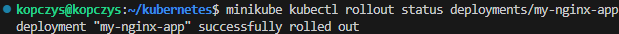

Oraz w Dashboardzie Kubernetes'a:

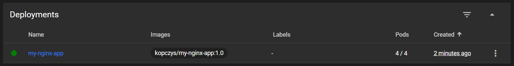

### Przygotowanie nowego obrazu

Nową wersję obrazu przygotowałem w ten sposób, że w pliku konfiguracyjny z jednego z poprzednich kroków dodałem jedynie w tytule i nagłówku dopisek *v1.1*. Następnie zbudowałem obraz za pomocą polecenia:

```
docker build -f nginx.Dockerfile -t my-nginx-app .
```

Otagowałem nowy obraz:

```
docker tag my-nginx-app kopczys/my-nginx-app:1.1
```

Oraz opublikowałem w serwisie DockerHub:

```
docker push kopczys/my-nginx-app:1.1
```

Przeszedłem do serwisu DockerHub i sprawdziłem czy pojawił się nowy obraz:

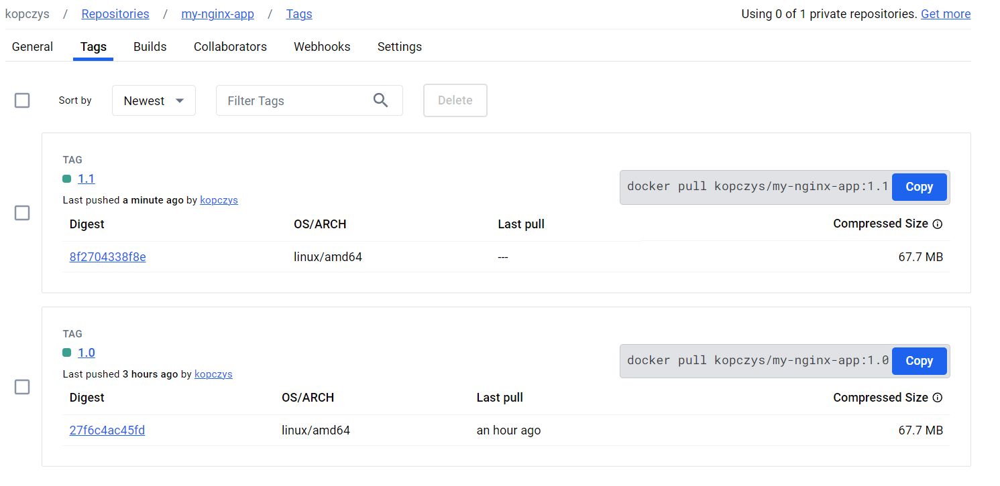

Sprawdziłem jeszcze, czy po uruchomienia kontenera z tym obrazem zaszły oczekiwane zmiany:

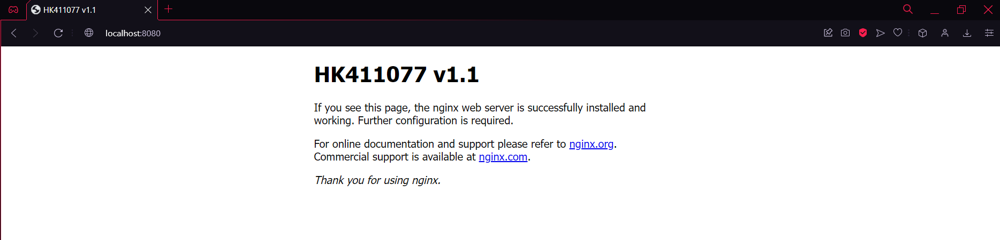

Do utworzenia obrazu, którego uruchomienie kończy się błędem posłużyłem się użyciem polecenia `CMD ["false"]` na końcu poprzedniego Dockerfile, który poza dodaniem tej linii kodu pozostał taki sam jak wcześniej a w pliku konfiguracyjny *index.html* jedynie dodałem tam gdzie wcześniej numer wersji, czyli *v1.2*.

Dockerfile z obrazem którego uruchomienie kończy się błędem:

```
FROM nginx
COPY index.html /usr/share/nginx/html/index.html
CMD ["false"]
```

Tą wersję również dodałem na DockerHub jako wersję *1.2* i tak teraz to wyglądało po wejściu i sprawdzeniu wersji mojej aplikacji:

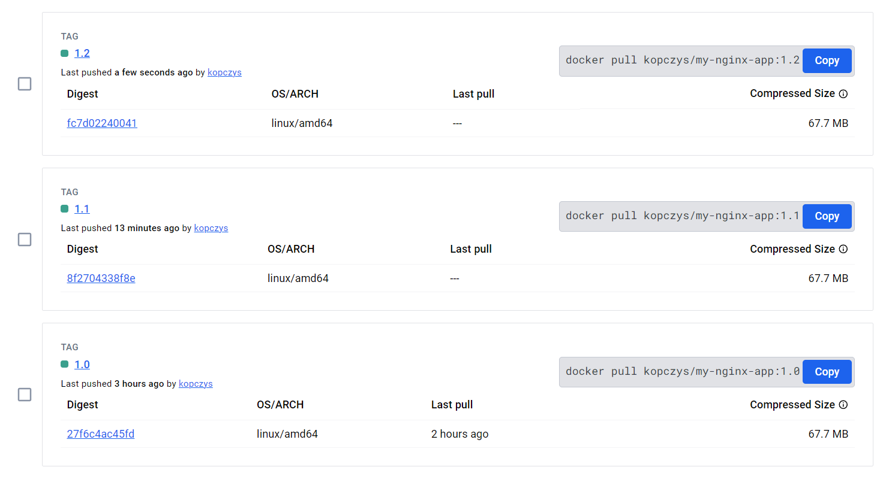

Tę wersję z błędem postanowiłem od razu sprawdzić w Deploymencie a wynik tego był taki:

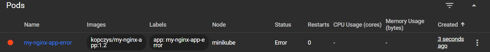

Najpierw dostałem błąd, następnie kubernetes próbował zrestartować poda i uruchomić go ponownie i tak w kółko:

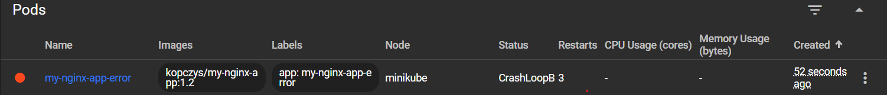

### Zmiany w deploymencie

W tym zadaniu należało dokonywać zmian w pliku YAML z deploymentem. Pierwszą zmianą, którą trzeba było wykonać było zwiększenie liczby replik. Ja zwiększyłem ich liczbę do 8 edytując w pliku *deployment.yaml* fragment:

```
spec:
  replicas: 8
```

Następnie zastosowałem polecenie `minikube kubectl -- apply -f deployment.yaml` i od razu po nim użyłem polecenia `minikube kubectl rollout status deployments/my-nginx-app` żeby na bieżąco sprawdzać zachodzące zmiany. Wynik zwiększenia podów w konsoli był taki:

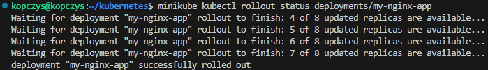

A w Dashboardzie wyglądało to w ten sposób:

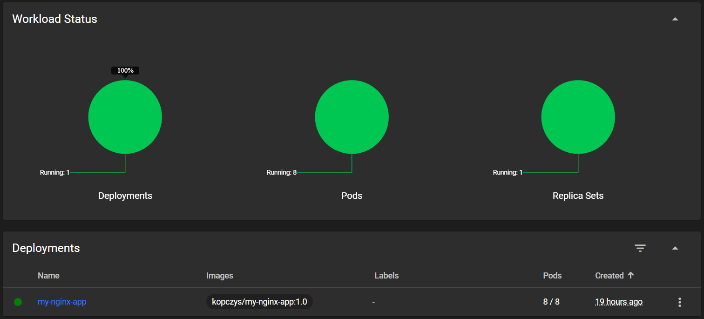

W ten sam sposób co zwiększenie liczby replik do 8, zmniejszyłem ich liczbę do 1. Sprawdzając status od razu po zastosowaniu nowej ilości replik, zobaczyłem jedynie, że deployment został poprawnie wykonany:

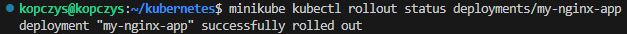

W Dashboardzie zauważyłem, że pody zostały usunięte w odwrotnej kolejności niż ich tworzenie, tj. pierwszy utworzony pod nie został usunęty. Całość w Dashboardzie wyglądała tak:

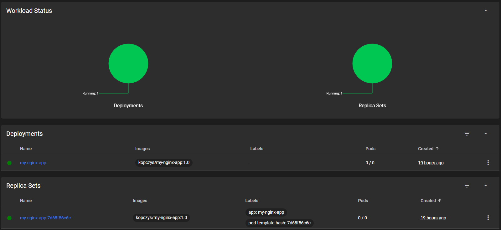

Zmniejszenie liczby replik do 0 również wykonałem w ten sam sposób, w wyniku czego status ponownie pokazał jedynie, że deployment wykonał się poprawnie a w Dashboardzie wyglądało to w ten sposób:

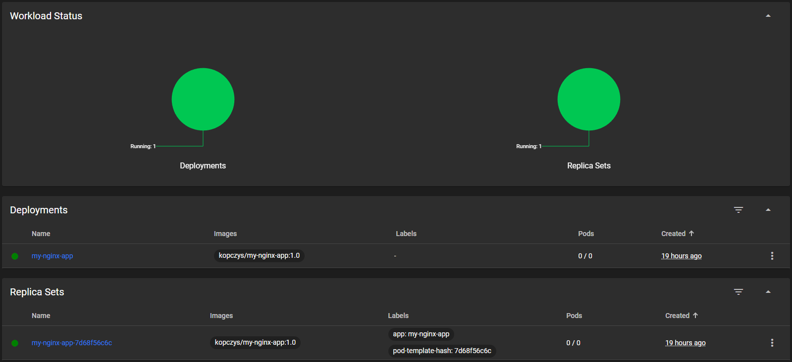

Widać, że po ustawieniu 0 replik Kubernetes usunął wszystkie uruchomione pody. Ustawienie takiej liczb replik pozwala tymczasowo zatrzymać aplikację bez jej usuwania, oszczędzając zasoby i umożliwiając łatwe ponowne uruchomienie.

Kolejnym punktem było zastosowanie nowej wersji obraz (najpierw zwiększyłem też liczbę replik do 4 dla starej wersji i dla nowej pozostawiłem tą samą liczbę). Do zmiany wersji dokonałem takiej zmiany w pliku YAML:

```
containers:
- name: my-nginx-app
  image: kopczys/my-nginx-app:1.1
  ports:
  - containerPort: 80
```

Czyli zmieniłem obraz *image* z `kopczys/my-nginx-app:1.0` na `kopczys/my-nginx-app:1.1`. Wynikiem takiej zmiany w statusie było:

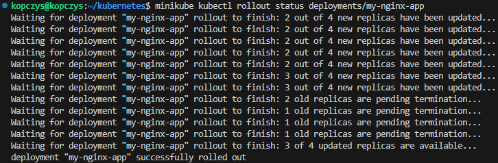

A w Dashboardzie, w sekcji *Pods*:

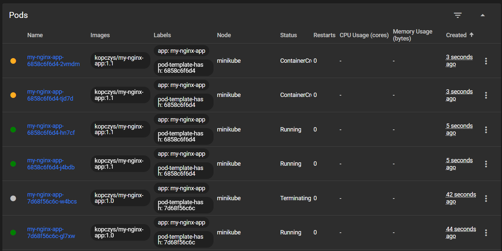

Widać tutaj, że pody starszej wersji obrazu zostają usunięte a w ich miejsce tworzone są nowe pody dla nowej wersji obrazu. Po usunięciu podów, pozostały już tylko 4 pody nowej wersji obrazu.

Ponownie zmieniłem wersję obrazu na starszą zmieniając treść w pliku YAML w wyniku czego miałem takie same wyniki jak w przypadku zmiany wersji na nową:

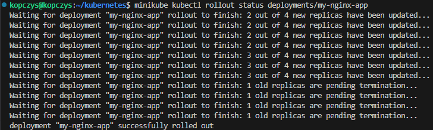

Rezultat w Dashboardzie:

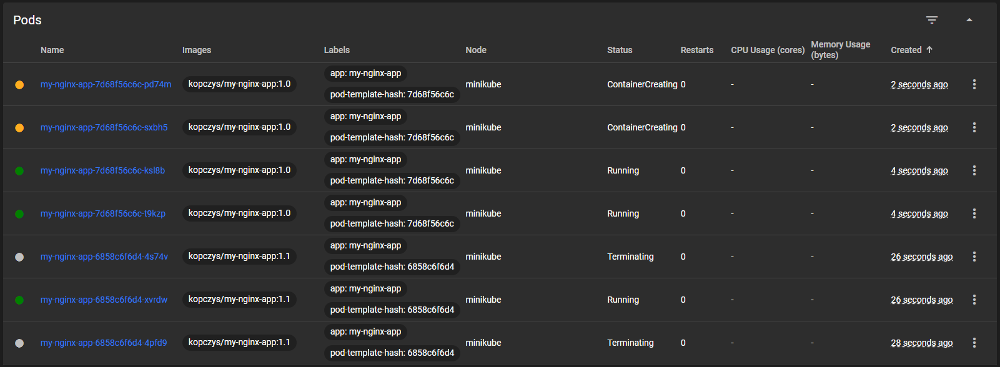

Za pomocą polecenia `kubectl rollout history` można sprawdzić listę zmian deploymentu. W moim przypadku polecenie to wyglądało tak:

```
minikube kubectl rollout history deployment/my-nginx-app
```

Zwrócony rezultat był taki:

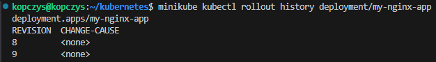

Na podstawie kolumny *REVISION* możemy wybierać wersję, do której chcemy wrócić. Do tego celu służy polecenie `kubectl rollout undo` w której poza nazwą deploymentu możemy na końcu dodać opcję `--to-revision=<REVISION>` i  w miejscu `<REVISION>` wpisać numer konkretnej wersji. Ja cofnąłem się o dokładnie jedną wersję do tyłu (bez dodawania tej opcji domyślnie za REVISION ustawione jest 0, w wyniku czego przywracana jest poprzednia wersja) za pomocą polecenia:

```
minikube kubectl rollout undo deployment/my-nginx-app
```

Wynikiem którego było cofnięcie podów do wersji *1.1*, i w statusie wyglądało to w ten sposób:

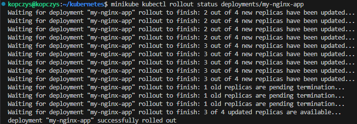

W Dashboardzie również zaszły oczekiwane zmiany:

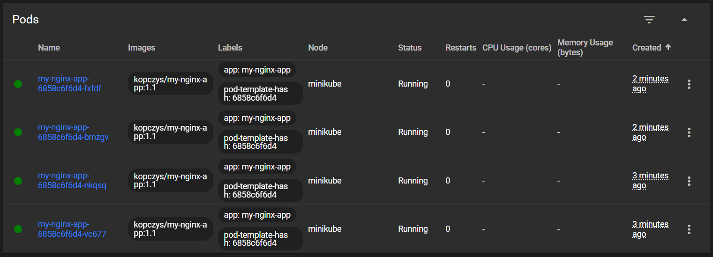

### Kontrola wdrożenia

Aby upewnić się, że wdrożenie zdołało wykonać się w ciągu 60 sekund, można napisać skrypt, który będzie cyklicznie sprawdzał status wdrożenie w określonych odstępach czasowych. Skrypt, który ja napisałem prezentuje się następująco:

```
#!/bin/bash

DEPLOYMENT_NAME="my-nginx-app"
DEPLOYMENT_FILE="deployment.yaml"

CHECK_DURATION=60
INTERVAL=5

check_deployment() {
  minikube kubectl rollout status deployment/$DEPLOYMENT_NAME --timeout=${INTERVAL}s
  return $?
}

echo "Wdrażanie aplikacji za pomocą pliku $DEPLOYMENT_FILE..."
minikube kubectl apply -f $DEPLOYMENT_FILE

start_time=$(date +%s)

echo "Sprawdzanie wdrożenia $DEPLOYMENT_NAME przez $CHECK_DURATION sekund..."

while true; do
  check_deployment
  if [ $? -eq 0 ]; then
    echo "Wdrożenie $DEPLOYMENT_NAME zakończyło się sukcesem."
    exit 0
  fi

  current_time=$(date +%s)
  elapsed_time=$((current_time - start_time))

  if [ $elapsed_time -ge $CHECK_DURATION ]; then
    echo "Wdrożenie $DEPLOYMENT_NAME nie zakończyło się w ciągu $CHECK_DURATION sekund."
    exit 1
  fi

  sleep $INTERVAL
done
```

Pliku *script.sh* w którym znajduje się powyższy skrypt nadałem uprawnienia do wykonywania za pomocą polecenia:

```
chmod +x script.sh
```

W wyniku uruchomienia skryptu, z updatem do wersji *1.1* mojej aplikacji otrzymałem:

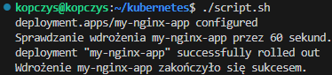

Żeby sprawdzić, czy skrypt działa poprawnie wykonałem go jeszcze dla wersji *1.2* mojego programu, czyli zawierającą błąd. Wynik był następujący:

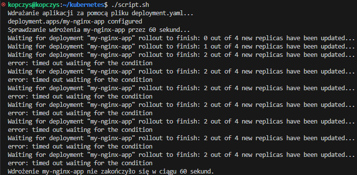

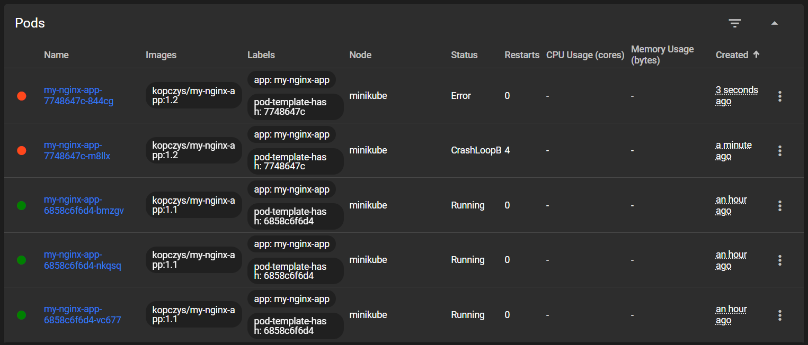

Po zastosowaniu tego skryptu wróciłem jednak do poprzedniej wersji wdrożenia poleceniem:

```
minikube kubectl -- rollout undo deployment/my-nginx-app
```

### Strategie wdrożenia

Pierwszą strategią wdrożenia była strategia *Recreate*, która powoduje wyłączenie i usunięcie wszystkich istniejących podów a następnie utworzenie nowych. Podczas tego procesu aplikacja jest niedostępna dla użytkowników. Do przetestowania tej strategii utworzyłem nowy plik YAML o nazwie *recreate.yaml*, którego zawartość wyglądała tak:

```
apiVersion: apps/v1
kind: Deployment
metadata:
  name: my-nginx-app
spec:
  replicas: 4
  selector:
    matchLabels:
      app: my-nginx-app
  strategy:
    type: Recreate
  template:
    metadata:
      labels:
        app: my-nginx-app
    spec:
      containers:
      - name: my-nginx-app
        image: kopczys/my-nginx-app:1.0
        ports:
        - containerPort: 80
```

Strategia została tutaj określona w części `spec` i przyjęta została jako `Recreate`. Wynikiem uruchomienia tego pliku wdrożeniowego było:

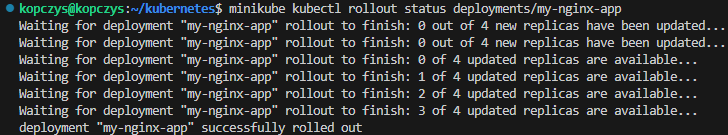

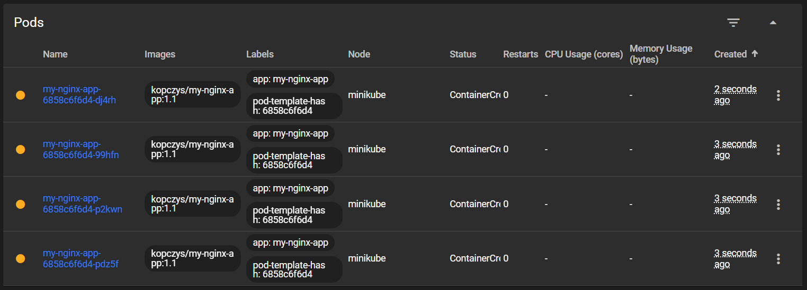

Drugą strategią do przetestowania było *Rolling Update* z parametrami `maxUnavailable` > 1, `maxSurge` > 20%. Ta strategia polega na stopniowej aktualizacji podów, pozwalając na równoczesne istnienie starych i nowych wersji aplikacji. Dzięki temu strategia ta minimalizuje czas niedostępności aplikacji. Do jej przetestowania utworzyłem nowy plik wdrożeniowy *rolling-update.yaml* o następującej zawartości:

```
apiVersion: apps/v1
kind: Deployment
metadata:
  name: my-nginx-app
spec:
  replicas: 4
  selector:
    matchLabels:
      app: my-nginx-app
  strategy:
    type: RollingUpdate
    rollingUpdate:
      maxUnavailable: 2
      maxSurge: 25%
  template:
    metadata:
      labels:
        app: my-nginx-app
    spec:
      containers:
      - name: my-nginx-app
        image: kopczys/my-nginx-app:1.0
        ports:
        - containerPort: 80
```

Jak widać w kodzie powyżej, wartość `maxUnavailable` ustawiłem na 2 i oznacza ona maksymalną ilość podów, które mogą być niedostępne podczas wdrażania. Wartość `maxSurge` przyjąłem jako 25% i oznaczna ona maksymalną liczbę instancji, które mogą być utworzone ponad ich docelową liczbę (może być wartością liczbową lub procentową). Wynikiem działania tego pliku było:

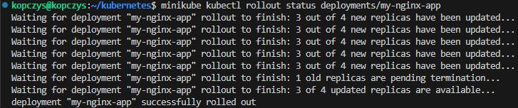

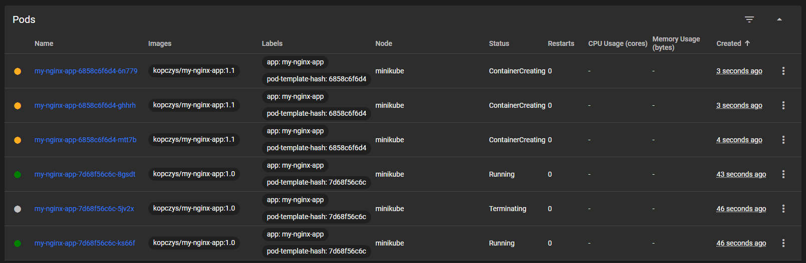

Ostatnia wersja wdrożenia to *Canary Deployment workload*, która polega na wdrażaniu nowej wersji aplikacji na małą cześć ruchu w celu przetestowania jej stabilności i wydajności przed pełnym wdrożeniem. Jest to użyteczna strategia do minimalizacji ryzyka wprowadzania błędów w aplikacji. Do jej przetestowania utworzyłem plik *canary-deployment.yaml*, w którym było:

```
apiVersion: apps/v1
kind: Deployment
metadata:
  name: my-nginx-app-canary
  labels:
    app: my-nginx-app
    track: canary
spec:
  replicas: 1
  selector:
    matchLabels:
      app: my-nginx-app
      track: canary
  template:
    metadata:
      labels:
        app: my-nginx-app
        track: canary
    spec:
      containers:
      - name: my-nginx-app
        image: kopczys/my-nginx-app:1.1
        ports:
        - containerPort: 80
```

Etykieta `track: canary` zastosowana jest w tym wypadku jedynie do rozróżnienia wersji.

W wyniku uruchomienia otrzymałem:

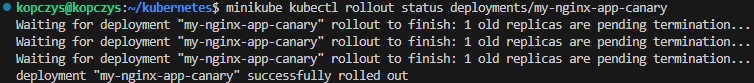

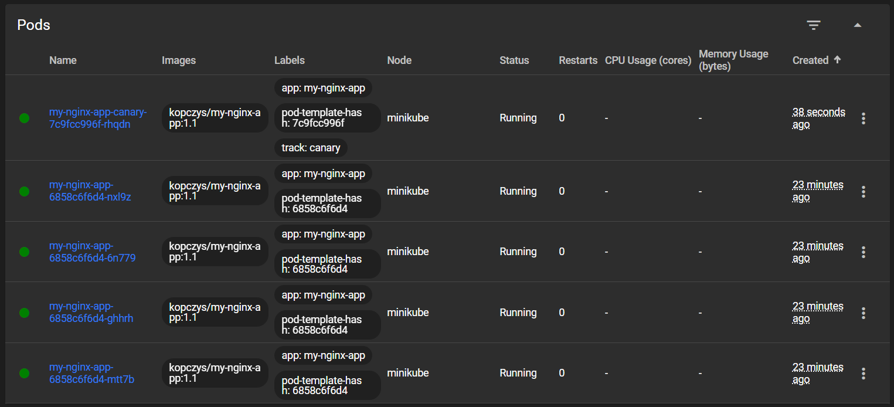

Ostatnim zdaniem w ramach tych ćwiczeń laboratoryjnych było użycie serwisów. *Service* to abstrakcja umożliwiająca logiczny dostęp do zestawu podów, zapewniając stabilny punkt komunikacji wewnątrz lub z zewnątrz klastra. 

Dla swojego wdrożenia *my-nginx-app* utworzyłem plik *service.yaml* o poniższej zawartości:

```
apiVersion: v1
kind: Service
metadata:
  name: my-nginx-service
spec:
  selector:
    app: my-nginx-app
  ports:
    - protocol: TCP
      port: 80
      targetPort: 80
```

Serwis utworzyłem za pomocą polecenia `minikube kubectl -- apply -f service.yaml`, a następnie przekierowałem port:

```
minikube kubectl port-forward service/my-nginx-service 8080:80
```

I przekierowałem port w Visual Studio Code co pozwoliło mi przejść na stronę aplikacji:

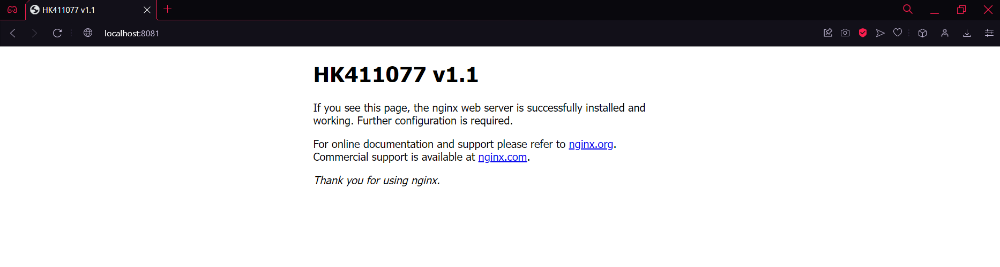

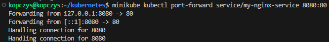