# Sprawozdanie 5 - Hubert Kopczyński 411077

## Wstęp - Wdrażanie na zarządzalne kontenery: Kubernetes

### Instalacja klastra Kubernetes

W ramach tych zajęć laboratoryjnych nr 10 pierwszą do wykonania rzeczą było zainstalowanie klastry Kubernetes. Należało zaopatrzyć się w implementację stosu k8s. Przeszedłem na stronę podaną w instrukcji, tam wybrałem system operacyjny *Linux* z architekturą *x86_64* i typem instalatora *Debian package*. Pobrałem najnowszą stabilną wersję *minikube* za pomocą polecenia z instrukcji:

```
curl -LO https://storage.googleapis.com/minikube/releases/latest/minikube_latest_amd64.deb
```

A następnie zainstalowałem *minikube* kolejnym poleceniem w instrukcji:

```
sudo dpkg -i minikube_latest_amd64.deb
```

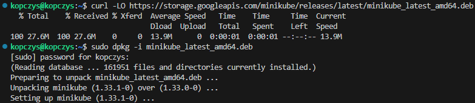

Krastrę *minikube* uruchomiłem następnie poleceniem `minikube start`:

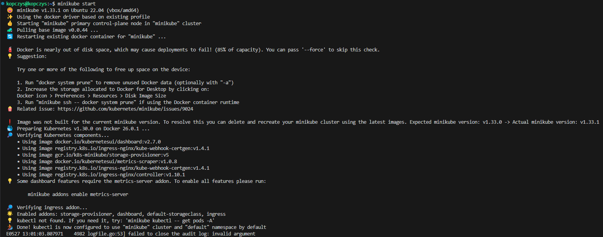

Teraz przeszedłem do zaopatrzenia się w polecenie `kubectl` w wariancie *minikube*. Mając zainstalowanego *minikube* mogłem je pobrać za pomocą polecenia:

```
minikube kubectl -- get po -A
```

W celu ułatwienia dalszej pracy, żeby za każdym razem nie musieć używać polecenia `minikube kubectl` tylko zamiast niego po prostu `kubectl` skorzystałem z instrukcji i użyłem polecenia:

```
alias kubectl="minikube kubectl --"
```

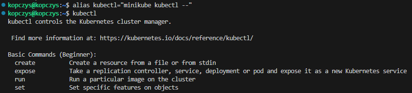

Sprawdziłem listę działających kontenerów i zobaczyłem na niej, że kontener z *minikube* faktycznie zaczął działać:

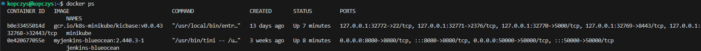

W przypadku korzystania z *minikube* ważnym jest, aby na maszynie wirtualnej dostosować ustawienia zasobów (RAM, CPU, disk space). W dokumentacji możemy dowiedzieć się, że minikube potrzebuje co najmniej 2 procesorów (najlepiej w tym przypadku ustawić chociaż 3), 2GB wolnej pamięci RAM, 20 GB wolnej przestrzeni na dysku i stałego łącza z Internetem. W momencie, gdy maszyna nie będzie spełniać tych wymagać, *minikube* po prostu nie będzie chciał się uruchomić.

Dashboard w *minikube* uruchamia się za pomocą polecenia `minikube dashboard`, które po użyciu automatycznie otwiera nam w przeglądarce dashboard. Po przejściu na stronę dashboard'u przeszedłem do sekcji *Pods* w zakładkach po lewej stronie i wyświetliłem wszystkie przestrzenie nazw w rozwijanym menu na górze strony, co dało mi taki efekt:

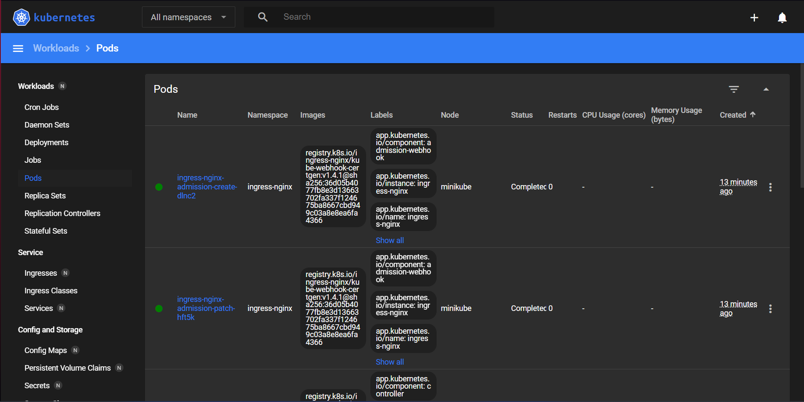

Zapoznałem się z koncepcjami funkcji wyprowadzanych przez Kubernetesa i dowiedziałem się, że:

* *Pod* to najmniejsza i najprostsza jednostka w środowisku kontenerowym, zawierająca jeden lub więcej konteenerów, które współdzielą zasoby i sieć.

* *Deployment* zarządza zestawem podów, zapewnia ich skalowanie, aktualizacje oraz odporność na awarie.

* *Service* to abstrakcja umożliwiająca logiczny dostęp do zestawu podów, zapewniając stabilny punkt komunikacji wewnątrz lub z zewnątrz klastra.

Poprawne zakończenie pracy Kubernetes'a, które zapobiega pojawieniu się jakichś błędów po ponownym włączeniu maszyny wirtualnej odbywa się poprzez użycie polecenia:

```
minikube stop
```

### Analiza posiadanego kontenera

Używana przeze mnie wcześniej aplikacja nie nadawała się do użycia w tym ćwiczeniu - kontener natychmiastowo kończył pracę po uruchomieniu. Zamiast niej, wybrałem aplikację *nginx*, którą zgodnie z instrukcją ubiorę we własną konfigurację.

Przed pobraniem *nginx* najpierw zaktualizowałem pakiety na swojej maszynie wirtualnej `sudo apt update` a następnie zainstalowałem go `sudo apt install nginx`.

Po zainstalowaniu sprawdziłem, czy *nginx* poprawnie pracuje poleceniem `sudo systemctl status nginx` i dowiedziałem się że tak:

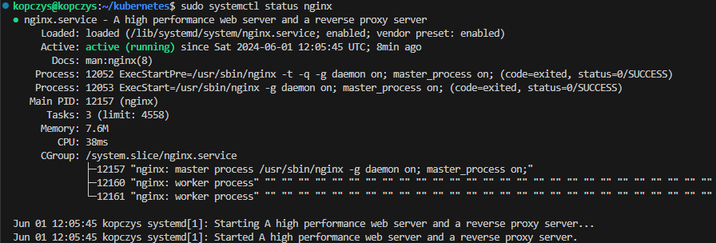

Przeszedłem więc do utworzenia konfiguracji, której będzie używał *nginx*. W tym celu skopiowałem do swojego katalogu roboczego plik *index.html* ze ścieżki */usr/share/nginx/html/index.html* i zmodyfikowałem tytuł strony i nagłówek *h1* z *nginx'em* tak, żeby wyświetlał napis *HK411077*:

```
<!DOCTYPE html>
<html>
<head>
<title>HK411077</title>
<style>
    body {
        width: 35em;
        margin: 0 auto;
        font-family: Tahoma, Verdana, Arial, sans-serif;
    }
</style>
</head>
<body>
<h1>HK411077</h1>
<p>If you see this page, the nginx web server is successfully installed and
working. Further configuration is required.</p>

<p>For online documentation and support please refer to
<a href="http://nginx.org/">nginx.org</a>.<br/>
Commercial support is available at
<a href="http://nginx.com/">nginx.com</a>.</p>

<p><em>Thank you for using nginx.</em></p>
</body>
</html>
```

Teraz przeszedłem do utworzenia pliku *nginx.Dockerfile* o takiej zawartości:

```
FROM nginx
COPY index.html /usr/share/nginx/html/index.html
```

Dockerfile kopiuje zmodyfikowany plik *index.html* do wcześniej podanej ścieżki. Zbudowałem obraz Docker na podstawie utworzonego pliku Dockerfile poleceniem:

```
docker build -f nginx.Dockerfile -t my-nginx-app .
```

Zbudowany obraz należało przetestować lokalnie więc do uruchomienia kontenera użyłem polecenia:

```
docker run -d -p 8080:80 --name my-nginx-container my-nginx-app
```

I w przeglądarce internetowej przeszedłem pod adres *localhost:8080* w celu sprawdzenia, czy kontener uruchamia się i pracuje:

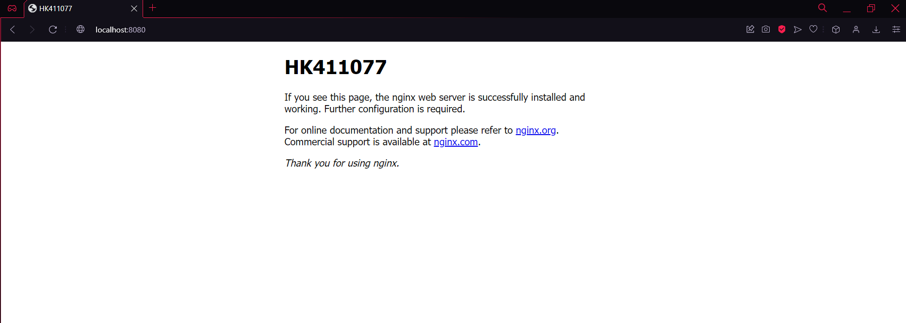

Kontener z *nginx'em* pracuje i zarówno nagłówek jak i tytuł strony zostały zmienione na ustalone przeze mnie.

Tak utworzony obraz należało opublikować w serwisie DockerHub. Zalogowałem się na DockerHub poleceniem `docker login`, kontener otagowałem `docker tag my-nginx-app kopczys/my-nginx-app:1.0` a na koniec opublikowałem poleceniem:

```
docker push kopczys/my-nginx-app:1.0
```

Po przejściu do serwisu DockerHub i sprawdzeniu profilu mogłem teraz zobaczyć, że obraz się tam znajdował:

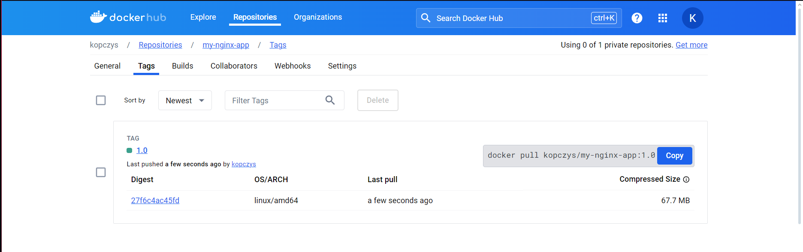

Chciałem jeszcze raz sprawdzić, czy kontener będzie poprawnie pracował więc zakończyłem działanie poprzedniego kontenera z moim nginx'em a następnie pobrałem i uruchomiłem wstawiony na DockerHub obraz poleceniem `docker run -d -p 8080:80 --name my-nginx-container kopczys/my-nginx-app:1.0` i sprawdziłem przy użyciu `docker ps` czy na liście jest nowy, pracujący kontener:

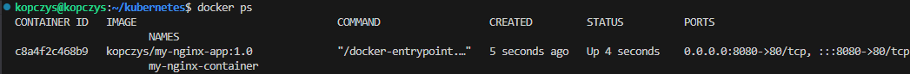

Kontener działał prawidłowo, aplikacja również więc wszystkie wymagania do dalszej części instrukcji zostały spełnione.

### Uruchamianie oprogramowania

W tym punkcie należało uruchomić kontener na stosie k8s poleceniem:

```
minikube kubectl run -- <nazwa-wdrożenia> --image=<obraz-docker> --port=<wyprowadzany port> --labels app=<nazwa-wdrożenia>
```

W którym trzeba było dostosować pod siebie wszystkie parametry. Polecenie, którego użyłem prezentuje się w taki sposób:

```
minikube kubectl run -- my-nginx-app --image=kopczys/my-nginx-app:1.0 --port=80 --labels app=my-nginx-app
```

Przeszedłem do Dashboard'u i sprawdziłem zakładkę Pods w której zobaczyłem, że pod działa prawidłowo:

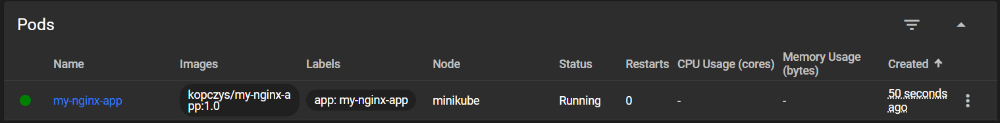

Za pomocą polecenia `minikube kubectl get pods` również sprawdziłem, czy pod jest uruchomiony:

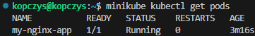

Teraz wyprowadziłem port w celu dotarcia do eksponowanej funkcjonalności poprzez przekierowanie portów z poda na komputer poleceniem:

```
kubectl port-forward pod/my-nginx-app 8080:80
```

Co dało mi następujący rezultat:

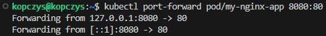

Po spróbowaniu przejścia na stronę *localhost:8080* otrzymałem informację, że witryna jest nieosiągalna. Okazało się, że muszę przekierować jeszcze port *8080* z maszyny wirtualnej i zrobiłem to za pomocą Visual Studio Code:

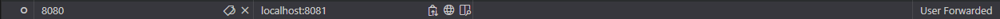

Teraz mogłem przejść pod adres *localhost:8081* co zrobiłem i efektem było:

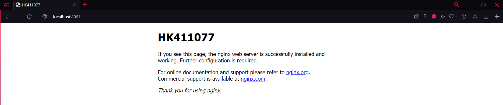

A output w konsoli zmienił się w:

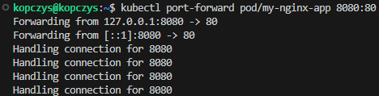

### Konwersja wdrożenia ręcznego na wdrożenie deklaratywne YAML