# Sprawozdanie 1
Wykonał: Jakub Ficek, IO.

## Cel projektu
Naszym celem jest sprawdzenie czy śrowodowisko jest dobrze przygotowane, zaznajomienie się z podstawowymi funkcjami gita oraz nauka i zrozumienie czym jest docker. Zagłębimy się w klucze SSH, gałęzie oraz hooki gita, a także w instalacje, konfigurację i uruchamianie Dockera (kontenerów). 

## Streszczenie projektu 

## Wykonane kroki
### 1. Zainstalowanie klienta Git i obsługi kluczy SSH.
Wykonanie tego kroku było automatyczne bez większej ingerencji z mojej strony. Wraz ze stawianiem i instalowaniem serwera Ubuntu na wirtualnej maszynie zaznaczyłem opcję uwzględniającą pobranie OpenSSH podczas instalacji. Git w Linuxie zainstalowany jest automatycznie. Jednak, aby sprawdzić czy wszystko jest w porządku uruchomiłem komendę:

    git --version && ssh -V

Spowoduje ona sprawdzenie wersji gita oraz OpenSSH, co udowadnia nam, że mamy zaintalowanego klienta, a także obsługę kluczy, ponieważ jest to jedna z paczek w SSH.
Wynik działania komend:

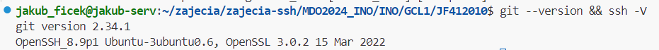

### 2. Sklonowanie repozytorium przedmiotowego za pomocą HTTPS i personal access token.

Aby sklonować repozytorium za pomocą HTTPS, musimy wejść w nie na githubie i skopiować odpowiednio link pod zakładką HTTPS. Komenda, której będziemy używać to:

    git clone https://github.com/InzynieriaOprogramowaniaAGH/MDO2024_INO.git

Aby jednak dokonać klonowania musimy podać odpowiednio naszą nazwę github i hasło, które będzie personal access tokenem. Musimy go odpowiednio wygnerować w ustawieniach naszego konta na githubie (Settings/Developer Settings/Token).

W przypadku korzystania z Remote SSH w Visual Studio Codzie potwierdzenie tożsamości może przebiegać inaczej. W moim przypadku miałem połączone konto GitHub z VSCode przez co musiałem ustalić w pliku: **.gitconfig** odpowiednie dane, takie jak:

    git config --global user.email "jakubficek138@gmail.com"
    git config --global user.name "JakubFicek"

Weryfikacja konta przebiega wtedy poprzez zalogowanie się do konta GitHub w wyskakującym okienku.

Potwierdzenie sklonowania repozytorium:

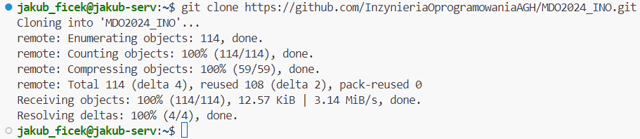

### 3. Sklonowanie repozytorium za pomocą utworzonego klucza SSH.

- #### Utworzenie dwóch klucze SSH (jeden z hasłem).
  Klucze SSH pozwolą nam na szybsze przygotowywanie stanowiska pracy. Nie będziemy musieli podawać loginu i tokenu za każdym razem, przy każdej komendzie. Generujemy je za pomocą:

      ssh-keygen

  Klucze, które wybrałem to *ed25519* oraz *ecdsa*. Wygenerowałem je odpowiednio przez:

      ssh-keygen -t ed25519 -C "jakubficek138@gmail.com"
      ssh-keygen -t ecdsa -C "jakubficek138@gmail.com"

  Warto zaznaczyć, że klucze te generują się w dwóch wersjach, publicznej i prywatnej.
  
  W przypadku pierwszego z kluczy ustawiłem jeszcze hasło, które będe podawać podczas kiedy klucz będzie używany, na przykład podczas dodawania klucza do **ssh-agent**. Hasło ustawiamy w momencie kiedy pojawiają się komunikaty:
        
      Enter passphrase (empty for no passphrase): 
      Enter same passphrase again: 

  Następnie, musimy dodać nasz klucz do ssh-agenta, ponieważ jest to narzędzie zarządzające tymi kluczami. Dodajemy do niego klucz prywatny, czyli ten z dwóch wygenerowanych kluczy bez formatu *.pub*. Agenta uruchamiamy poprzez: 
        
      eval "$(ssh-agent -s)"

  co daje nam odpowiedni PID.
  Dodawanie kluczy do agenta wykonałem następująco:
      
      ssh-add ~/.ssh/id_ed25519
      ssh-add ~/.ssh/id_ecdsa

  Zrzut ekranu pokazujący generowanie jednego z kluczy:

  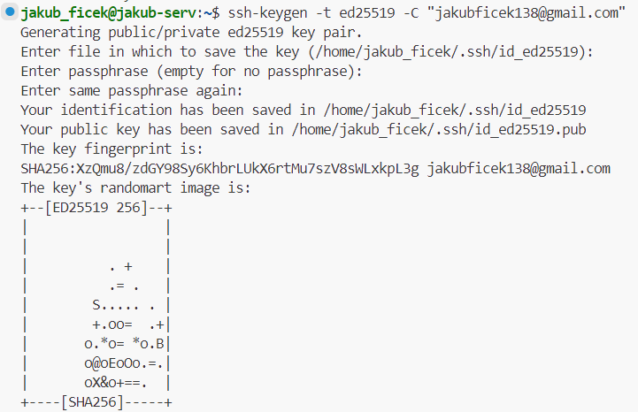

  Zrzut ekranu potwierdzający hasło dla klucza pierwszego, przy dodawaniu go do agenta:

  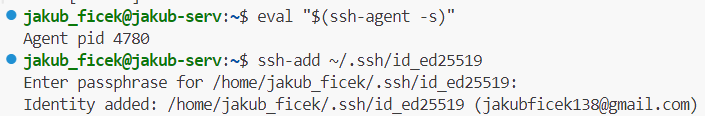

  Wygenerowane klucze w folderze '~/.ssh':

  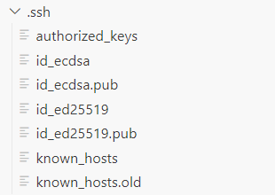

- #### Skonfigurowanie klucza SSH jako metodę dostępu do GitHuba.
  Aby skonfigurować klucz, by nie był on bezużytyczeny dodałem go do konta GitHub. Dzięki temu wszystkie działania związne z moim kontem nie będą musiały być osobno uwierzytelnianie. Wszystko będzie wykonywane automatycznie. 

  Do konta dodaje się klucz publiczny. Jego zawartość możemy wyświetlić w konsoli poprzez:

      cat ~/.ssh/id_ed25519.pub

  Po skopiowaniu wchodzimy w Ustawienia naszego konta, w zakładkę Kluczę SSH i GPG, aby tam dodać klucz. Odpowiednio nadajemy mu tytuł i wklejamy jego całą zawartość (nie możemy pominąć emaila, ani pierwszej cześci, która identyfikuje typ).

  Dodany klucz powinien wyglądać następująco:

  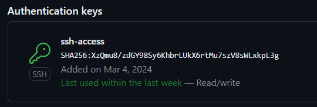

- #### Sklonowanie repozytorium z wykorzystaniem protokołu SSH.
  Końcowym etapem, który potwierdzi poprawne działanie klucza, będzie próba sklonowania repozytorium. Poprawnie działający klucz powinien wymagać od nas tylko podania ustawionego hasła podczas tworzenia. Pominięte powinny zostać podawanie nazwy konta GitHub oraz prywatnego tokena.

  Klonowanie zostało wykonane poprzez komende:

      git clone git@github.com:InzynieriaOprogramowaniaAGH/MDO2024_INO.git

  Odpowiedni link znajdziemy pod zakładką SSH w naszym repozytorium. 

  Poprawne klonowanie powinno po wpisaniu hasła dostępu do klucza odrazu zwrócić nam folder główny. Widać to na poniższym zrzucie ekranu:

  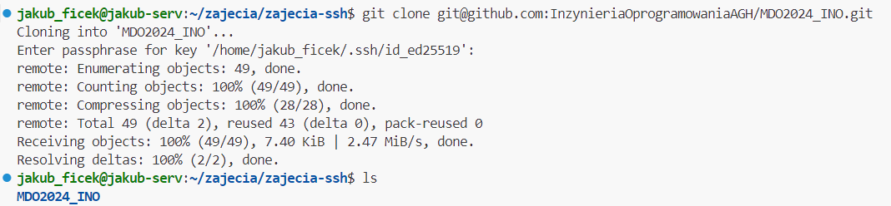

### 4. Przełączenie się na gałąź main i swojej grupy.

Po sklonowaniu repozytorium ważne jest to jak będziemy się w nim poruszać. Aby praca była zsynchronizowana przez wiele osób stworzone zostały gałęzie. Po wejściu do folderu możemy sprawdzić wszystkie istniejące gałęzie oraz to w jakiej obecnie się znajdujemy. Użyjemy komendy:

    git branch --all

Pozwoli nam to zauważyć gałąź naszej grupy. Jest to gałąź **GLC1**. 

Przełączenie się między gałęzią główną, a grupy wykonałem komendą: 

    git checkout GCL1 

Potwierdza to poniższy zrzut ekranu:

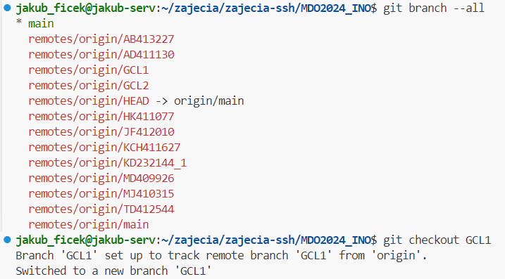

### 5. Utworzenie gałęzi "JF412010".

Po przejściu na gałąź grupy, kolejnym krokiem jest stworzenie swojej gałęzi na której będę pracować. Składa się ona z moich inicjałów oraz numeru indeksu. Ważne jest, żeby nie tworzyć jej podczas kiedy jesteśmy na gałęzi głównej. 

Tworzenie nowej gałęzi wykonywane jest za pomocą tej samej komendy co przejście z opcją **-b**. Od razu po stworzeniu tej gałęzi nastąpi także przejście na nią. Pełna komenda:

    git checkout -b JF412010

Za pomocą:

    git branch

możemy sprawdzić, czy nasza gałąź została stworzona i zmieniona:

### 6. Rozpoczęcie pracy na nowej gałęzi.
- #### Stworzenie katalogu "JF412010" w folderze grupy.
  Będąc w nowej gałęzi stwórzyłem folder o takiej samej nazwie jak nazwa gałęzi. Znajdować się będą w nim wszystkie pliki do zajęc oraz foldery ze sprawozdaniam w formacie *.md*.

  Folder stworzyłem z terminala poprzez:

      mkdir JF412010

- #### Napisanie Git hook'a oraz jego poprawne umiejscowienie. 
  **Git hook**, który stworzyłem to skrypt weryfikujący, każdy mój "commit message". Sprawdza, czy zaczyna się on od moich inicjałów i numeru indeksu, czyli: "JF412010" 
  
  Korzystając z przykładowych githook'ów w folderze ".git/hooks", stwierdziłem, że najlepszym rodzajem do takiej weryfikacji będzie hook **commit-msg**. Służyny on właśnie do takiego sprawdzania.

  Skrypt odrazu tworze we wcześniej stworzonym katalogu. Jego nazwa to *'commit-msg'* według podanego wzoru. 

  Jest to skrypt napisany w powłoce **Bash**. 
  Na wstępie odczytuje argument, czyli wiadomość naszego commita i przypisuje ją do zmiennej:

      COMMIT_MSG_FILE=$1

  Potem jest to już zwykły *if* w którym używam funkcji **grep**. Jest to narzędzie służące do wyszukiwania. Użyłem do niego opcji **"-q"**. Zwraca ona 0, w przypadku gdy znaleziony zostanie szukany wzorzec. 

  Wzorzec natomiast jest w postaci:

      '^JF412010'

  Sprawdza czy na początku commita znajdują się moje inicjały oraz numer indeksu. W regex'ie symbol **"^"** oznacza, że wzorzec musi znaleźć się na początku linii czy napisu. 
  
  Aby hook działał, skopiowałem go do właściwego miejsca, czyli folderu *".git/hooks"*. Dzięki temu uruchamia się za każdym razem kiedy robię commita.

  Zrzut ekranu potwierdzający działanie hooka:

  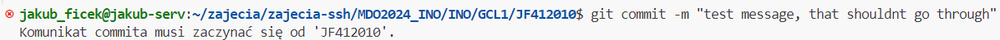

  Poprawnie stworzony commit: 

  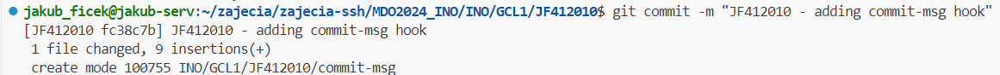

- #### Pełna treść githooka.
      !/bin/sh

      COMMIT_MSG_FILE=$1

      # Sprawdzenie, czy komunikat commita zaczyna się od "JF412010"
      
      if ! grep -q '^JF412010' "$COMMIT_MSG_FILE"; then
          echo >&2 "Komunikat commita musi zaczynać się od   'JF412010'."
          exit 1
      fi

- #### Tworzenie sprawozdania.
  
  Sprawodzanie zostanie tworzone w formacie "Markdown" w pliku o nazwie **README.md**, ale w odpowiednim katalogu. Będzie to katalog o nazwie **"Sprawozdanie1"** w folderze **"JF412010"**.

  Ułożenie folderów oraz potwierdzenie stworzonego sprawozdania:

  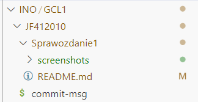

- #### Dodawanie zrzutów ekranu.
  
  Zrzuty ekranu będą dodawane jako zdjęcia *inline*. Zdjęcia w tej postaci tworzone są poprzez 

      

  Aby zdjęcia były dostępne wszędzie muszą także znajdować się w tym katalogu i być przesyłane wraz ze sprawozdaniem. Dlatego stworzyłem folder **"screenshots"**. Znajdują się w nich wszystkie zrzuty ekranu zawarte w tym sprawozdanie. Ścieżka do nich jest w postaci:

      "./screenshots/<nazwa zdjęcia>"
  
  Przykłady tych zdjęć można znaleźć powyżej w sprawozdaniu.

- #### Wysyłanie zmian do zdalnego źródła.
  
  Wysyłanie zmian do zdalnego źródła odbywa się za pomocą komend:

      git add
      git commit
      git push

  Pierwszą z nich dodajemy nasze zmiany, czyli na przykład nowe pliki, czy też zmienione. Po ich dodaniu możemy stworzyć "commit", który opisuje po krótce co zostało dodane/zmienione. Po stworzeniu commita bądź commitów możemy wykonać push, czyli wypchać zmiany do źródła. Oznacza to, że przesyłamy zmiany z lokalnego urządzenia/serwera do zdalnego repozyterium w GitHubie.

  W wykonywaniu przesyłania przydatna jest komenda:

      git status

  Mówi nam ona co zostało zmienione bądź dodane i co musimy dodać komendą *add*.

  Przykładowe przesłanie:

  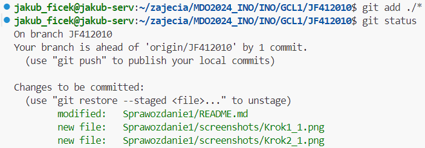
  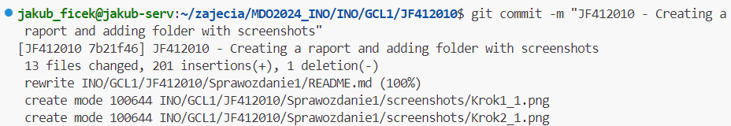
  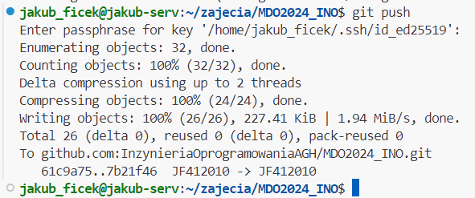
  
- #### Spróbuj wciągnąć swoją gałąź do gałęzi grupowej

Próbe wciągnięcia mojej gałęzi do gałęzi grupowej zacząłem od zmiany gałęzi na gałąź grupy:

    git branch GCL1

Moja gałąź została wciągnięta, jednak, aby wysłać te zmiany do lokalnego źródła za pomocą *git push* dostaję komunikat o braku uprawnień. Taka zmiany musi być dodawana poprzez *pull request*. Dzięki temu moje zmiany mogą być zwerfyikowane i dopiero wtedy połączone.

Wygląda to następująco:
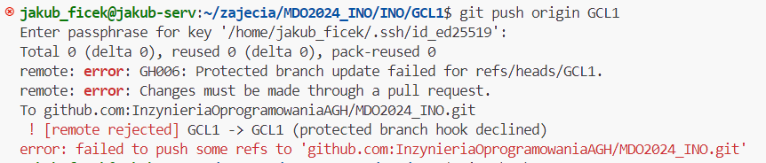

- #### Zaktualizuj sprawozdanie i zrzuty o ten krok i wyślij aktualizację do zdalnego źródła (na swojej gałęzi)

Ostatnia aktualizacja polegała na dodaniu zmian i wysłaniu ich do źródła znanymi już komendami:

    git add ./
    git commit -m "JF412010 raport update"
    git push