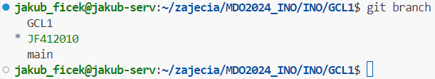

# Sprawozdanie 1
Wykonał: Jakub Ficek, IO.

## Cel projektu
Naszym celem jest sprawdzenie czy śrowodowisko jest dobrze przygotowane, zaznajomienie się z podstawowymi funkcjami gita oraz nauka i zrozumienie czym jest docker. Zagłębimy się w klucze SSH, gałęzie oraz hooki gita, a także w instalacje, konfigurację i uruchamianie Dockera (kontenerów). 

## Streszczenie projektu 
Podczas projektu wykonałem klonowanie repozytorium dwoma sposobami, konfiguracje kluczy ssh na swoim koncie github i serwerze ubuntu. Stworzyłem także gałąź na której będę pracować na tych zajęciach, odpowiedni folder oraz nauczyłem się używać wszystkich potrzebnych komend związanych z gitem.
Stworzyłem także sprawozdanie, w którym opisuje kroki swojego postępowania i aktualizowałem je na bieżąco.

Nauczyłem się co to jest docker, do czego służy oraz co to są obrazy. Pobierałem potrzebne obrazy, uruchamiałem je i wykonywałem w nich odpowiednie polecenia. Stworzyłem także własny plik Dockerfile, który uwzględnia tworzenie systemu ubuntu z odrazu sklonowanym repozytorium przedmiotu. Na samym końcu nauczyłem się czyścić obrazy oraz uruchomione kontenery.

## Wykonane kroki z zajęć 1
### 1. Zainstalowanie klienta Git i obsługi kluczy SSH.
Wykonanie tego kroku było automatyczne bez większej ingerencji z mojej strony. Wraz ze stawianiem i instalowaniem serwera Ubuntu na wirtualnej maszynie zaznaczyłem opcję uwzględniającą pobranie OpenSSH podczas instalacji. Git w Linuxie zainstalowany jest automatycznie. Jednak, aby sprawdzić czy wszystko jest w porządku uruchomiłem komendę:

    git --version && ssh -V

Spowoduje ona sprawdzenie wersji gita oraz OpenSSH, co udowadnia nam, że mamy zaintalowanego klienta, a także obsługę kluczy, ponieważ jest to jedna z paczek w SSH.
Wynik działania komend:

### 2. Sklonowanie repozytorium przedmiotowego za pomocą HTTPS i personal access token.

Aby sklonować repozytorium za pomocą HTTPS, musimy wejść w nie na githubie i skopiować odpowiednio link pod zakładką HTTPS. Komenda, której będziemy używać to:

    git clone https://github.com/InzynieriaOprogramowaniaAGH/MDO2024_INO.git

Aby jednak dokonać klonowania musimy podać odpowiednio naszą nazwę github i hasło, które będzie personal access tokenem. Musimy go odpowiednio wygnerować w ustawieniach naszego konta na githubie (Settings/Developer Settings/Token).

W przypadku korzystania z Remote SSH w Visual Studio Codzie potwierdzenie tożsamości może przebiegać inaczej. W moim przypadku miałem połączone konto GitHub z VSCode przez co musiałem ustalić w pliku: **.gitconfig** odpowiednie dane, takie jak:

    git config --global user.email "jakubficek138@gmail.com"
    git config --global user.name "JakubFicek"

Weryfikacja konta przebiega wtedy poprzez zalogowanie się do konta GitHub w wyskakującym okienku.

Potwierdzenie sklonowania repozytorium:

### 3. Sklonowanie repozytorium za pomocą utworzonego klucza SSH.

- #### Utworzenie dwóch klucze SSH (jeden z hasłem).
  Klucze SSH pozwolą nam na szybsze przygotowywanie stanowiska pracy. Nie będziemy musieli podawać loginu i tokenu za każdym razem, przy każdej komendzie. Generujemy je za pomocą:

      ssh-keygen

  Klucze, które wybrałem to *ed25519* oraz *ecdsa*. Wygenerowałem je odpowiednio przez:

      ssh-keygen -t ed25519 -C "jakubficek138@gmail.com"
      ssh-keygen -t ecdsa -C "jakubficek138@gmail.com"

  Warto zaznaczyć, że klucze te generują się w dwóch wersjach, publicznej i prywatnej.
  
  W przypadku pierwszego z kluczy ustawiłem jeszcze hasło, które będe podawać podczas kiedy klucz będzie używany, na przykład podczas dodawania klucza do **ssh-agent**. Hasło ustawiamy w momencie kiedy pojawiają się komunikaty:
        
      Enter passphrase (empty for no passphrase): 
      Enter same passphrase again: 

  Następnie, musimy dodać nasz klucz do ssh-agenta, ponieważ jest to narzędzie zarządzające tymi kluczami. Dodajemy do niego klucz prywatny, czyli ten z dwóch wygenerowanych kluczy bez formatu *.pub*. Agenta uruchamiamy poprzez: 
        
      eval "$(ssh-agent -s)"

  co daje nam odpowiedni PID.
  Dodawanie kluczy do agenta wykonałem następująco:
      
      ssh-add ~/.ssh/id_ed25519
      ssh-add ~/.ssh/id_ecdsa

  Zrzut ekranu pokazujący generowanie jednego z kluczy:

  

  Zrzut ekranu potwierdzający hasło dla klucza pierwszego, przy dodawaniu go do agenta:

  

  Wygenerowane klucze w folderze '~/.ssh':

  

- #### Skonfigurowanie klucza SSH jako metodę dostępu do GitHuba.
  Aby skonfigurować klucz, by nie był on bezużytyczeny dodałem go do konta GitHub. Dzięki temu wszystkie działania związne z moim kontem nie będą musiały być osobno uwierzytelnianie. Wszystko będzie wykonywane automatycznie. 

  Do konta dodaje się klucz publiczny. Jego zawartość możemy wyświetlić w konsoli poprzez:

      cat ~/.ssh/id_ed25519.pub

  Po skopiowaniu wchodzimy w Ustawienia naszego konta, w zakładkę Kluczę SSH i GPG, aby tam dodać klucz. Odpowiednio nadajemy mu tytuł i wklejamy jego całą zawartość (nie możemy pominąć emaila, ani pierwszej cześci, która identyfikuje typ).

  Dodany klucz powinien wyglądać następująco:

  

- #### Sklonowanie repozytorium z wykorzystaniem protokołu SSH.
  Końcowym etapem, który potwierdzi poprawne działanie klucza, będzie próba sklonowania repozytorium. Poprawnie działający klucz powinien wymagać od nas tylko podania ustawionego hasła podczas tworzenia. Pominięte powinny zostać podawanie nazwy konta GitHub oraz prywatnego tokena.

  Klonowanie zostało wykonane poprzez komende:

      git clone git@github.com:InzynieriaOprogramowaniaAGH/MDO2024_INO.git

  Odpowiedni link znajdziemy pod zakładką SSH w naszym repozytorium. 

  Poprawne klonowanie powinno po wpisaniu hasła dostępu do klucza odrazu zwrócić nam folder główny. Widać to na poniższym zrzucie ekranu:

  

### 4. Przełączenie się na gałąź main i swojej grupy.

Po sklonowaniu repozytorium ważne jest to jak będziemy się w nim poruszać. Aby praca była zsynchronizowana przez wiele osób stworzone zostały gałęzie. Po wejściu do folderu możemy sprawdzić wszystkie istniejące gałęzie oraz to w jakiej obecnie się znajdujemy. Użyjemy komendy:

    git branch --all

Pozwoli nam to zauważyć gałąź naszej grupy. Jest to gałąź **GLC1**. 

Przełączenie się między gałęzią główną, a grupy wykonałem komendą: 

    git checkout GCL1 

Potwierdza to poniższy zrzut ekranu:

### 5. Utworzenie gałęzi "JF412010".

Po przejściu na gałąź grupy, kolejnym krokiem jest stworzenie swojej gałęzi na której będę pracować. Składa się ona z moich inicjałów oraz numeru indeksu. Ważne jest, żeby nie tworzyć jej podczas kiedy jesteśmy na gałęzi głównej. 

Tworzenie nowej gałęzi wykonywane jest za pomocą tej samej komendy co przejście z opcją **-b**. Od razu po stworzeniu tej gałęzi nastąpi także przejście na nią. Pełna komenda:

    git checkout -b JF412010

Za pomocą:

    git branch

możemy sprawdzić, czy nasza gałąź została stworzona i zmieniona:

### 6. Rozpoczęcie pracy na nowej gałęzi.
- #### Stworzenie katalogu "JF412010" w folderze grupy.
  Będąc w nowej gałęzi stwórzyłem folder o takiej samej nazwie jak nazwa gałęzi. Znajdować się będą w nim wszystkie pliki do zajęc oraz foldery ze sprawozdaniam w formacie *.md*.

  Folder stworzyłem z terminala poprzez:

      mkdir JF412010

- #### Napisanie Git hook'a oraz jego poprawne umiejscowienie. 
  **Git hook**, który stworzyłem to skrypt weryfikujący, każdy mój "commit message". Sprawdza, czy zaczyna się on od moich inicjałów i numeru indeksu, czyli: "JF412010" 
  
  Korzystając z przykładowych githook'ów w folderze ".git/hooks", stwierdziłem, że najlepszym rodzajem do takiej weryfikacji będzie hook **commit-msg**. Służyny on właśnie do takiego sprawdzania.

  Skrypt odrazu tworze we wcześniej stworzonym katalogu. Jego nazwa to *'commit-msg'* według podanego wzoru. 

  Jest to skrypt napisany w powłoce **Bash**. 
  Na wstępie odczytuje argument, czyli wiadomość naszego commita i przypisuje ją do zmiennej:

      COMMIT_MSG_FILE=$1

  Potem jest to już zwykły *if* w którym używam funkcji **grep**. Jest to narzędzie służące do wyszukiwania. Użyłem do niego opcji **"-q"**. Zwraca ona 0, w przypadku gdy znaleziony zostanie szukany wzorzec. 

  Wzorzec natomiast jest w postaci:

      '^JF412010'

  Sprawdza czy na początku commita znajdują się moje inicjały oraz numer indeksu. W regex'ie symbol **"^"** oznacza, że wzorzec musi znaleźć się na początku linii czy napisu. 
  
  Aby hook działał, skopiowałem go do właściwego miejsca, czyli folderu *".git/hooks"*. Dzięki temu uruchamia się za każdym razem kiedy robię commita.

  Zrzut ekranu potwierdzający działanie hooka:

  

  Poprawnie stworzony commit: 

  

- #### Pełna treść githooka.
      !/bin/sh

      COMMIT_MSG_FILE=$1

      # Sprawdzenie, czy komunikat commita zaczyna się od "JF412010"
      
      if ! grep -q '^JF412010' "$COMMIT_MSG_FILE"; then
          echo >&2 "Komunikat commita musi zaczynać się od   'JF412010'."
          exit 1
      fi

- #### Tworzenie sprawozdania.
  
  Sprawodzanie zostanie tworzone w formacie "Markdown" w pliku o nazwie **README.md**, ale w odpowiednim katalogu. Będzie to katalog o nazwie **"Sprawozdanie1"** w folderze **"JF412010"**.

  Ułożenie folderów oraz potwierdzenie stworzonego sprawozdania:

  

- #### Dodawanie zrzutów ekranu.
  
  Zrzuty ekranu będą dodawane jako zdjęcia *inline*. Zdjęcia w tej postaci tworzone są poprzez 

      

  Aby zdjęcia były dostępne wszędzie muszą także znajdować się w tym katalogu i być przesyłane wraz ze sprawozdaniem. Dlatego stworzyłem folder **"screenshots"**. Znajdują się w nich wszystkie zrzuty ekranu zawarte w tym sprawozdanie. Ścieżka do nich jest w postaci:

      "./screenshots/<nazwa zdjęcia>"
  
  Przykłady tych zdjęć można znaleźć powyżej w sprawozdaniu.

- #### Wysyłanie zmian do zdalnego źródła.
  
  Wysyłanie zmian do zdalnego źródła odbywa się za pomocą komend:

      git add
      git commit
      git push

  Pierwszą z nich dodajemy nasze zmiany, czyli na przykład nowe pliki, czy też zmienione. Po ich dodaniu możemy stworzyć "commit", który opisuje po krótce co zostało dodane/zmienione. Po stworzeniu commita bądź commitów możemy wykonać push, czyli wypchać zmiany do źródła. Oznacza to, że przesyłamy zmiany z lokalnego urządzenia/serwera do zdalnego repozyterium w GitHubie.

  W wykonywaniu przesyłania przydatna jest komenda:

      git status

  Mówi nam ona co zostało zmienione bądź dodane i co musimy dodać komendą *add*.

  Przykładowe przesłanie:

  
  
  
  
- #### Spróbuj wciągnąć swoją gałąź do gałęzi grupowej

Próbe wciągnięcia mojej gałęzi do gałęzi grupowej zacząłem od zmiany gałęzi na gałąź grupy:

    git checkout GCL1

Potwierdzenie:

Moja gałąź została wciągnięta, jednak, nie mogę wysłać tych zmian do lokalnego źródła za pomocą *git push*. Dostaję komunikat o braku uprawnień. Taka zmiana musi być dodawana poprzez *pull request*. Dzięki temu to co przesyłam może być zwerfyikowane i dopiero wtedy połączone.

Wygląda to następująco:

- #### Zaktualizuj sprawozdanie i zrzuty o ten krok i wyślij aktualizację do zdalnego źródła (na swojej gałęzi)

Ostatnia aktualizacja polegała na dodaniu zmian i wysłaniu ich do źródła znanymi już komendami:

    git add ./
    git commit -m "JF412010 raport update"
    git push

## Wykonane kroki z zajęć 2
### 1. Zainstalowanie Dockera w systemie linuksowym.

Sprawdzenie czy mamy docker na naszym systemie można wykonać poprzez komendę
    
    docker

Ja nie miałem go pobranego. Ponieważ byłem na ubuntu zamknąłem serwer i wykonałem migawkę, aby zachować stan swojego serwera, gdyby coś poszło nie tak.

Pobranie dockera wykonałem poprzez:

    sudo snap install docker

Następnie, aby nie używać go z komendą **sudo** dodałem dockera do grupy, tak samo jak konto użytkownika na którym jestem. Komendy, których użyłem to:

    sudo groupadd docker
    sudo gpasswd -a $USER docker
    newgrp docker

Zresetowałem maszyne i zrobiłem migawkę, jednak nie były one potrzebne, ponieważ wszystko dobrze się pobrało.

Dla testu uruchomiłem oraz pobrałem obraz *hello-world* poprzez:

    docker run hello-world

Wynik to:

### 2. Zarejestrowanie się w Docker Hub i zapoznanie z sugerowanymi obrazami.

Zarejestrowanie na stronie wykonołem poprzez połączenie konta GitHub z Docker Hubem. Dzięki temu powininem mieć bardziej spersonalizowane sugerowane obrazy.

### 3. Pobranie obrazów.

Pobieranie obrazów wykonałem poprzez komendę:

    docker pull <nazwa>

Można to jednak zrobić także poprzez

    docker run <nazwa>

Dzięki temu odrazu uruchamiałem dane obrazy. 
Mój system to dystrubucja *ubuntu*, zatem pobrałem *fedora*.

Pobrane obrazy:

### 4. Uruchomienia kontener z obrazu busybox.

Pierwsze uruchomienie kontenera z obrazu **busybox** wykonałem poprzez:

    docker run busybox

- #### Efekt uruchomienia kontenera.

    Kontener nie zwrócił nic w terminalu jednak wiemy, że działał. Komenda

        docker container list

    nie wypisze tego, ponieważ działanie kontenera zostało zakończone. Możemy to znaleźć dopisując do powyższej instrukcji flagę *--all*:

        docker container list --all

    

- #### Podłączenie **interaktywne** do kontenera do konktenera oraz wywyłąnie numeru wersji.

    Podłączenie interaktywne do kontenera pozwala nam wykonywać w nim komendy, podczas gdy kontere jest w stanie **running**, czyli kiedy działa.

    Dopisując *-it* jesteśmy w stanie uruchomić busyboxa interaktywnie:

        docker run -it busybox  

    Pojawia się nam możliwość wpisywania komend. Aby sprawdzić wersję busyboxa nie zadziała komenda 

        version

    czy 

        -v

    Możemy to sprawdzić poprzez:

        cat --help

    Z podłączenia wychodzimy komendą:

        exit

    Wynik tego sprawdzenia wygląda następująco:

    

### 5. Uruchomienie "systemu w kontenerze".
System w kontenerze, który będę uruchamiał to *fedora*. Zrobiłem to za pomocą:

    docker run -it fedora

Zrobiłem to w osobnym terminalu, aby móc sprawdzić działanie tego kontera.

- #### PID1 w kontenerze i procesy dockera na hoście.
    **PID1** jest to proces init, odpowiedzialny za inicjalizację innych procesów.
    Sprawdzenie co to za proces zrobiłem komendą

        ps

    w kontenerze. Nie było to jednak takie proste, ponieważ na wstępie nie mamy zainstalowanego **ps**.
    
    Instalacji możemy dokonać komendą:

        dnf install procps -y

    Instrukcja **ps** zwraca nam jednak bardzo mało informacji dlatego lepiej będzie użyć jej z opcjami:

        ps -aux

    Wynikiem będzie znalezienie procesu o ID 1 tego kontenera:

    

    Aby sprawdzić na hoście procesy dockera, możemy wywołać listę działających kontenerów. Dzięki temu pokażą się nam wszystkie kontenery, których procesy możemy szukać. Po wybraniu ID odpowiedniego kontenera, w tym przypadku fedory, posłużymy się komendą:

        docker top <CONTAINER ID>

    Znajdziemy wtedy proces root kontenera (ma on tylko uprawnienia root na kontenerze).

    

- #### Aktualizacja pakietów.

    Aktualizacje pakietów w systemie fedory w kontenerze przebiegnie tak samo jak w zwyczajnym systemie. Użyłem komendy:

        sudo dnf update

    Dostajemy wtedy listę wszystkich pakietów, których aktulizacje możemy przprowadzić. Zgadzamy się na pobranie odpowiednim znakiem i pobieramy wszystkie zmiany.

    

- #### Wyjście.

    Wyjście z systemu w kontenrze możemy wykonać komendą:

        exit

    

    Potwierdzeniem może być wypisanie wszystkich procesów i sprawdzenie statusu. Po wyjściu powinno być **Exited**.

        docker container list --all

    Wynik potwierdzajacy:

    
    
### 6. Stworzenie własnoręcznie, zbudowanie i uruchomienie prostego pliku Dockerfile bazujący na wybranym systemie i klonowanie repozytorium.

Stworzyłem plik Dockerfile. Oparty będzie on o system ubuntu. 

Zaczyna się on więc od:

    FROM ubuntu:latest

- #### Dobre praktyki.
    Następnie przeczytałem dobre praktyki przy tworzeniu Dockerfile. 

    Kolejnym krokiem przy tworzeniu będzie zaaktualizowanie pakietów oraz pobranie gita i ssh. Ważne aby obie te instrukcje wykonane były w jednej linii.

        RUN apt-get update && apt-get install -y git ssh

    Kolejnym krokiem będzie pobranie argumentu, który będzie dodawać podczas budowania projektu. Będzie to prywatny klucz, dzięki któremu sklonujemy nasze repozytorium.

        ARG SSH_PRIVATE_KEY

    Ostatnia instrukcja jest połączeniem dodawania kluczy, nadawania odpowiednich uprawnień, upewniania się, że github jest rozpoznawany przez ssh oraz klonowanie.

        RUN mkdir /root/.ssh/ && \
            echo "${SSH_PRIVATE_KEY}" > /root/.ssh/id_ed25519 && \
            chmod 600 /root/.ssh/id_ed25519 && \
            touch /root/.ssh/known_hosts && \
            ssh-keyscan github.com >> /root/.ssh/known_hosts && \
            git clone git@github.com:InzynieriaOprogramowaniaAGH/MDO2024_INO.git

    Na tym zakończyłem swój plik Dockerfile. Aby sprawdzić czy wszystko działa pobranie zbudowałem swój obraz:

        docker build --build-arg SSH_PRIVATE_KEY="$(cat ~/.ssh/id_ed25519)" -t ubuntu_image .

    Po zbudowaniu sprawdziłem czy obraz się stworzył:

    

    Mogłem go więc uruchomić i sprawdzić czy działa:

    

- #### Upewnienie się czy obraz będzie miał git-a.

    Wykonałem to poprzez zapisanie wersji gita w osobnym pliku podczas budowania konteneru. Instrukcja ta znajduje się pod pobraniem gita oraz pakietów:

        RUN git --version > git_version.txt

- #### Uruchomienie w trybie interaktywnym i zweryfikowanie że jest tam ściągnięte nasze repozytorium.

    Ostatnim krokiem jest sprawdzenie czy repozytorium zostało sklonowane. Będzie to ostateczne potwierdzenie poprawności działania mojego Dockerfile. Uruchomiłem go więc interaktywnie i sprawdziłem czy folder znajduje się w kontenerze oraz czy działa git:

    

### 7. Uruchomione kontenery oraz czyszczenie ich.

Uruchomione, ale nie działające kontenery można sprawdzić za pomocą komendy:

    docker ps -a -f status=exited

Wyczyszczenie natomiast robimy poprzez:

    docker rm

Pamiętać jednak trzeba o odpowiednich argumentach do tej funkcji, czyli w pełnej postaci, która usunie wszystkie uruchomione kontenery będzie to:

    docker rm $(docker ps -a -f status=exited -q)

Ważne jest aby dodać opcję *-q*, ponieważ wtedy dostaniemy tylko liste z ID kontenerów, przez co opcja *rm* nie będzie miała problemów z usunięciem np. nazwy obrazu kontenera, bo *ps -a*, także je wypisuje.

Wypisanie i usunięcie:

### 8. Czyszczenie obrazów.

Obrazy dockera wypisane są po komendzie:

    docker images -a

Aby je usunąć, użyjemy:

    docker rmi $(docker images -a -q)

Wyniki:

### 9. Dodanie plików Dockerfile do folderu swojego Sprawozdanie1 w repozytorium.

Swój stworzony plik Dockerfile od razu stworzyłem w folderze Sprawozdanie1, tak więc nie musiałem go przenosić.

### 10. Wystawienie Pull Request do gałęzi grupowej.

Pull Request wykonałem po przesłaniu wszystkich zmian do lokalnego źródła. Skończyłem także sprawozdanie. Zrobiłem go za pomocą strony githuba. Ważne, aby wybrać gałąź do której wystawiamy nasze zapytanie na gałąź grupy, a nie gałąź główną.