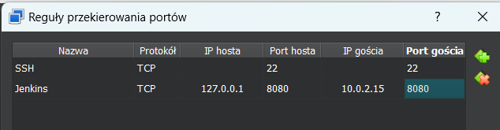

# Sprawozdanie 2
Wykonał: Jakub Ficek, IO.

## Cel projektu
Celem tych dwóch zajeć jest zapoznanie się ze sposobami budowania aplikacji, rozszerzanie wiedzy o Dockerfile, poznamy nowe terminologie związane z konteneryzacją takie jak woluminy oraz eksponowanie portu (część dotycząca sieci). 

## Streszczenie projektu 
Projekt ten zaczyna się od wybrania odpowiedniego oprogramowania oraz zbudowania go i przetestowaniu w naszym środowisku. Dzięki temu zbierzemy informacje potrzebne nam do przygotowania tych samych kroków w środowisku skonteneryzowanym. 

Zapoznajemy się także z terminem woluminu oraz jego obsługą. Będziemy tworzyć dwa woluminy, jeden na którym zbudujemy nasze oprogramowanie, a drugi na który przekopiujemy zawartość zbudowanego projektu np. *node modules*. Zajmiemy się także uruchomieniem serwera iperf. Połączymy z nim kontener, przetestujemy ruch oraz sprawdzimy inne połączenie np. spoza hosta. Na samym końcu wykonana zostanie instalacja Jenkinsa.

## Wykonane kroki z zajęć 3
### Wybór oprogramowania na zajęcia
* Znajdź repozytorium z kodem dowolnego oprogramowania, które:

Oprogramowanie, które wybrałem to **Sample Game Unit Test Application**. Jest to aplikacja, która jest przykładem testów, ale także demonstracją możliwości budowania CICD wewnątrz AWS CodeBuild.

Wybrałem program w Node.js ponieważ jest to najbardziej interesująca mnie technologia z bardzo przejrzystym i prostym postępowaniem w przypadku budowania oraz testowania aplikacji.

* Program ten dysponuje otwartą licencją:

Jest to licencja **MIT-0**. Oznacza to, że mogę kod używać, modyfikować, kopiować i generalnie robić z nim co chce.


* Jest także umieszczony wraz ze swoimi narzędziami Makefile:

Dla nodejs takie narzędzie nazywa się **npm** (node package modules), czyli domyślny manager pakietów dla środowiska Node.js. 

Budowanie aplikacji odbywa się za pomocą:

    npm instal

Dzięki temu pobieramy wszystkie potrzebne paczki i zależności, które zapisane są w plikach *package.json* i *package-lock.json*.

W przypadku testowania, jest to równie proste:

    npm test

* Aplikacja zawiera zdefiniowane i obecne w repozytorium testy, które można uruchomić. Testy jednoznacznie formułują swój raport. 

Projekt w swojej strukturze zawiera stworzone testy w pliku index.js w osobnym folderze:


* Sklonowanie repozytorium, przeprowadzenie build programu w tym doinstalowanie wymaganych zależności:

Klonowanie repozytorium wykonałem znaną już komendy ```git clone``` oraz z HTTPS:

    git clone https://github.com/aws-samples/node-js-tests-sample.git


Build przeprowadziłem poprzez ```npm install```:


* Uruchomienie testów jednostkowych dołączonych do repozytorium:

Testy jednostkowe wykonałem poprzez ```npm test``` po zbudowaniu projektu. Możemy zauważyć, że wymagany końcowy raport testów znajduję się i wszystkie przeszły:


### Przeprowadzenie buildu w kontenerze
#### 1. Wykonanie kroków `build` i `test` wewnątrz wybranego kontenera bazowego, w moim przypadku wystarczający kontener to ```node```.

* uruchomienie konteneru z podłączonym TTY, aby rozpocząć interaktywną prace:

Uruchomienie kontenery wykonałem poprzez:

    docker run -it node bash

Jako, że nie miałem obrazu ```node``` lokalnie to odrazu będzie on pobrany.

Opcja *-t* pozwala natomiast na uruchomienie kontenera z **TTY**, czyli *Teletype*, urządzenie odpowiedzialne za podstawowy input-output. Wybrałem do tego **Bash**. Potrzeba jeszcze dodać *-i*, ponieważ pozwala nam na połączenie STDIN.

* zaopatrzenie konteneru odbywa się automatycznie poprzez proces budowania, *git* jest dołączony do obrazu.

* sklonowanie repozytorium:


* uruchomienie *build*:

Aby uruchomić budowanie, należy pamiętać o przejściu do sklonowanego repozytorium komendą ```cd```.


* uruchomienie testów:


#### 2. Stworzenie dwóch plików `Dockerfile` automatyzujących kroki powyżej:
* Kontener pierwszy przeprowadza wszystkie kroki aż do *builda*.

Kod stworzonego Dockerfile, który uwzględnia wszystkie powyższe komendy:

    FROM node:latest
    RUN git clone https://github.com/aws-samples/node-js-tests-sample.git
    WORKDIR /node-js-tests-sample
    RUN npm install

Ważne jest aby dodać przejście do odpowiedniej lokalizacji przed wywołaniem ```npm install```.

Obraz zbudowany został poprzez:

    docker build -f ./BLD.Dockerfile -t bld_node .

Opcja *-f* odpowiada za wyznaczenie ścieżki do pliku, opcja *-t* za nazwę. Ważne, żeby build zakończyć ```.```.


* Kontener drugi bazuje na pierwszym i wykonuje testy.

Jego zawartość to:

    FROM bld_node
    WORKDIR /node-js-tests-sample
    RUN npm test

Ten Dockerfile zawiera jedynie przejście do odpowiedniego folderu naszego kontenera oraz uruchmienie testów. Jest to możliwe ponieważ oparty jest on (**FROM**) na wcześniej zbudowanym obrazie *bld_node*.

Zbudowany został poprzez:

    docker build -f ./TEST.Dockerfile -t test_node --progress=plain --no-cache .

Dzięki temu zobaczymy wszystkie informacje, a także wykonane testy i to czy przeszły (zwróciły poprawny wynik).


#### 3. Wykazanie, że kontener wdraża się i pracuje poprawnie. 

Trzeba pamiętać, że zbudowany obraz, to nie jest działający kontener. Kontener uruchmiamy za pomocą ```docker run```. 

Jako, że nic w nich nie wykonujemy oraz, że nie ma potrzeby uruchamiać go interaktywnie, to wynik tego, czy kontenery wdrażają się i pracują można sprawdzić poprzez:

    docker container list --all

Wypisany wynik zwróci nam status kontenera i to czy działał:


W kontenerach tych po zbudowaniu nie pracuje nic. Nie używamy w Dockerfilu **CMD**, zatem uruchomienie nie spowoduje niczego. Kontenery jednak mają przygotwane repozytorium i przetestowany działający kod. 

Warto także zaznaczyć, że testy nie wykonywane są przy uruchomieniu kontenera (CMD), tylko przy samym budowaniu (RUN). Dotyczą one kodu, który początkowo otrzymujemy, a nie działającej aplikacji. Także wykonywane są tylko raz.

## Wykonane kroki z zajęć 4

### Zachowywanie stanu
#### 1. Przygotowanie woluminu wejściowego i wyjściowego i podłączenie ich do kontenera bazowego, z którego rozpoczynano poprzednio pracę.

Wolumin jest to mechanizm, który pozwala nam na zachowywanie danych stworzonych w dockerze lub znajdującym się w nim. 

Możemy go przygotować za pomocą komendy:

    docker volume create v_in

Tak samo stworzymy wolumin wyjściowy:

    docker volume create v_out

Stworzone woluminy możemy sprawdzić poprzez:

    docker volume ls


Kontener bazowy, który używałem na zajęciach trzecich to **node**. Aby podłączyć do niego woluminy będziemy używać flagi *--mount*. Jako, że podłączamy dwa woluminy to możemy użyć dwóch flag. Będziemy musieli określić *source*, czyli nazwę woluminu oraz *target*, czyli lokalizację tego woluminu (miejsca w których zapiszemy nasze dane). Pełna komenda to:

    docker run -it --rm --name my_node --mount source=v_in,target=/input --mount source=v_out,target=/output node bash

Warto zaznaczyć, że *source=* i *target=* mają być oddzielone tylko przecinkiem, dodanie tam spacji może spowodować błędy przy uruchomieniu.

Możemy sprawdzić po uruchomienie kontenera czy znajdują się w nim nasze woluminy, które powinny stworzyć nowe foldery określone w targetach.


#### 2. Uruchomienie konteneru, zainstalowanie niezbędnych wymagań wstępnych (pamiętając o nieużywaniu *gita*).

Wszystkie wymagania wstępne potrzebne do sklonowania repozytorium są odrazu w *nodzie*. Jest też git, którego nie będę używać.

#### 3. Sklonowanie repozytorium na wolumin wejściowy.

Wykonam to poprzez uruchomienie konteneru pomocniczego zawierającego git. W moim przypadku będzie to kontener z obrazu *node*. Kontener ten będzie miał przyłączony stworzony wcześniej wolumin wejściowy w którym wykonamy klonowanie repozytorium. Dzięki temu repozytorium znajdzie się na woluminie i będę mógł zbudować je we wcześniejszym stworzonym kontenerze.

Uruchomienie konteneru:

    docker run -it --rm --name help_node --mount source=v_in,target=/input node bash

Następnie następuje przejście do folderu woluminu i sklonowanie repozytorium:

    git clone https://github.com/aws-samples/node-js-tests-sample.git


#### 4. Uruchomienie buildu w kontenerze oraz skopiowanie repozytorium do wewnątrz kontenera.

Uruchamiamy ponownie wcześniejszy kontener z dwoma woluminami. Następnie wykonamy build w folderze *input* w sklonowanym repozytorium za pomocą:

    npm install


Skopiowanie repozytorium do wnętrza kontenera z woluminu wejściowego poprzez komendę **cp**:

    cp -r node-js-tests-sample/ ../


#### 5. Zapisanie zbudowanych plików na woluminie wyjściowym, tak by były dostępne po wyłączniu kontenera.

Zbudowane pliki w moim projekcie to przede wszystkim pliki zawarte w folderze **node_modules**. Skopiowanie ich do wolumina wyjściowego nastąpi poprzez komendę **cp**.
Należy pamiętać, że wolumin wyjściowy zapisany jest w ścieżce **~/output**. Zatem pełna komenda to:

    cp -r node_modules/ ../../output/

Potwierdzenie przekopiowania:


Zapisane pliki poza kontenerem:


#### 6. Ponowienie operacji, ale klonowanie na wolumin wejściowy przeprowadzono wewnątrz kontenera przy użyciu gita.

Klonowanie na wolumin wyjściowy wewnątrz kontenera jest bardzo proste. Używamy tego samego kontenera z dwoma woluminami i klonujemy tą samą komendą, ale w innym folderze (folderze o nazwie *new_repo*), żeby wyróżnić wcześniejszy projekt od nowo sklonowanego:

    git clone https://github.com/aws-samples/node-js-tests-sample.git ./input/new_repo


#### 7. Przedyskutowanie możliwość wykonania ww. kroków za pomocą `docker build` i pliku `Dockerfile`. 

Stworzenie wyżej wymienionych kroków jest możliwe poprzez zbudowanie obrazu za pomocą pliku Dockerfile. Musimy prześledzić wcześniejsze kroki i odtworzyć proces. Klonowanie repozytorium odbędzie się odrazu w zbudowanym obrazie wewenątrz weluminu wejściowego. Następnie zbudujemy nowo postały projekt. 

Plik nazwałem **VOL_BLD**. Jego zawartość to:

    FROM node:latest

    RUN mkdir input
    RUN mkdir output

    RUN --mount=type=bind,source=v_in,target=/input,rw
    RUN --mount=type=bind,source=v_out,target=/output,rw
    WORKDIR /input
    RUN git clone https://github.com/aws-samples/node-js-tests-sample.git
    WORKDIR /input/node-js-tests-sample
    RUN npm install
    RUN cp -r node_modules ../../output/new_node_modules

Skorzystałem z komendy: `RUN --mount` aby dołączyć woluminy do obrazu. Iterpretowane są one jako jako pliki z hosta zapisane w folderach *v_in* i *v_out*. Następnie wykonane zostały kolejne znane już nam kroki.


Uruchomie kontener i sprawdzę czy wszystko powstało tak jak powinno, a mianowicie sklonowano repozytorium w osobnym folderze i zbudowano, a następnie skopiowano zbudowane pliki. Dołączyłem także woluminy, których target pokrywa się z tym połączonym w Dockerfile'u:

    docker run -it --rm --mount source=v_in,target=/input --mount source=v_out,target=/output vol_node bash


### Eksponowanie portu
#### 1. Uruchomienie wewnątrz kontenera serweru iperf (iperf3).

**Iperf** to narzędzie pomiaru wydajności łącza i jego analizy.

Kontener, który wybrałem to ubuntu. Zainstalowanie iperf3 wykonam poprzez:

    apt-get install iperf3

Następnie mogę przejść do uruchomienia serweru iperf komendą:

    iperf3 -s

Aby sprawdić adres tego serwera użyje:

    docker inspect -f'{{range .NetworkSettings.Networks}}{{.IPAddress}}{{end}}' df1f8c96b32e


#### 2. Połączenie się z nim z drugiego kontenera oraz zbadanie ruchu.

Połączenie z nowego kontenera jako klient wykonamy następująco:

    iperf3 -c <adres_serwera>

Adres serwera mamy podany już wyżej, zatem:

    iperf3 -c 172.17.0.2

Po wykonaniu tego kroku dostaniemy podsumowanie:


Iperf testuje szybkość połączenie między kontenerem, który działa jako serwer, a tym który działa jako klient i potrzebował adresu.

#### 3. Wykorzystanie własnej dedykowanej sieci mostkowej i próba połączenie z serwerem iperf. 

Dedykowaną sieć mostkową można stworzyć za pomocą `docker network create`. Podstawowa opcja zadaje *Driver*, który zarządza siecią jako *bridge*, zatem nie musimy tego podawać. Następnie taką sieć można przyłączyć do stworzonego kontenera za pomocą flagi **--network**. 

Stworzenie dedykowanej sieci:

    docker network create my_network

Uruchomiamy teraz kontenery do któych przyłączymy naszą sieć. Jeden będzie odpowiadał za serwer, a drugi za klienta. To dobry moment, żeby zaznaczyć, że dzięki nowej sieci podłączonej do kontenerów możemy posłużyć się nazwami kontenerów zamaist odresów podczas łączenia. Jest to możliwe ponieważ docker korzysta z serwera DNS. 

Stworzenie kontenerów, z przyłączoną siecią i nazwą:

    docker run -it --rm --name iperf_serv --network my_network ubuntu bash
    
    docker run -it --rm --name iperf_client --network my_network ubuntu bash

Uruchamiamy serwer i sprawdzamy jaki adres otrzymamy i czy uległ on zmianie:

    iperf3 -s

Następnie sprawdzamy id naszej nowej sieci:

    docker network ls

i sprawdzamy nowe adresy dołączonych kontenerów:

    docker network inspect 330630e06908


Połączenie klienta z serwerem wykonamy za pomocą nazwy **iperf_serv**:

    iperf3 -c iperf_serv

Potwierdzenie:


#### 4. Połączenie się spoza kontenera (z hosta i spoza hosta).

Spróuję teraz połączyć się z hosta, czyli wirtualnej maszyny. To dobry moment, żeby powiedzieć, że docker tworzy swoją sieć, przez co różni się ona od tej z wirtualnej maszyny czy spoza hosta.

Połączenie spoza hosta robimy jako klient do działającego serwera w kontenerze, aby porównać szybkość przesyłania z poprzednimi. 

Kontener urochamiamy z dodatkowymi opcjami. Port na którym będzie nasłuchiwać to **5201**. 

Pełna komenda to:

    docker run -it --rm --network my_network --name iperf3_serv -p 5201:5201 --mount source=v_out,target=/logs ubuntu bash

Połączenie hosta z dockerem następuje poprzez `-p 5201:5201`. Dalej korzystamy ze stworzonej wcześniej sieci. Dołączymy także wolumin aby wyciągnąc logi z serwera. 

Przez problemy z odczytaniem nazwy na hoście posłyżyłem się adresem ip konteneru. Sprawdziłem go:

    docker inspect -f'{{range .NetworkSettings.Networks}}{{.IPAddress}}{{end}}' 526eca24a454

Mogłem teraz połączyć się z hosta z działającym serwerem:

    iperf3 -c 172.18.0.2

Wynik:


Sprawdźmy teraz czy logi zostały zapisane w woluminie i co zawierają.

Najpierw skopiowałem je z miejsca w którym zapisują dane woluminy. Następnie odczytałem zapisaną zawartość poprzez:

    cat logs/server.log

Należy także zwracać uwagę na uprawnienia, ponieważ możebyć konieczna ich zmiana. Przydatna będzie komenda `chmod`.


Połączenie spoza hosta zacząłem od pobrania iperf3 na windowsa. Należy zapamiętać, gdzie rozpakowaliśmy naszą paczkę. 

Następnie uruchomiłem ten sam serwer, który używałem do połączenia z hosta. Stworzyłem przekierowanie portu 5201 w wiertualnej maszynie. Należy także pamiętać o uwzględnieniu zapisania logów. 

Połączenie klienta wykonałem komendą w **cmd**:

    iperf3.exe -c 127.0.0.1 -p 5201

Wynik:


Adres 127.0.0.1 jest adresem wirtualnej maszyny. Na potwierdzenie poprawnego działania i połączenie sprawdziłem log z działającego serwera z włączonym serwerem:


#### 5. Przedstawienie przepustowości komunikacji lub problem z jej zmierzeniem

Połączenie     -     Bitrate:
* Połączenie kontenerów przez automatycznie tworzoną sieć dockera: **4.86 Gbits/s**.
* Stworzone połączenie przez własną dedykowaną sieć mostkową dockera: **12 Gbits/s**.
* Połączenie z hosta do serwera, czyli wirtaulnej maszyny: **10.8 Gbits/s**.
* Połączenie spoza hosta, czyli z Widnowsa: **182 Mbits/s**.

Jak widać najszybsze połączenie uzyskamy przy stworzeniu własnej sieci, specjalnie stworzonej do tego połączenia. Połączenie z hosta działa równie szybko, ponieważ dalej używaliśmy stworzonej wcześniej sieci. Dodatkowo jednak został udostępniony port co połączyło hosta z serwerem.

Najwolniejsze jest połączenie z poza hosta.

### Instancja Jenkins
#### 1. Po zapoznaniu się z dokumentacją przeprowadzenie instalacji skonteneryzowanej instancji Jenkinsa z pomocnikiem DIND.

Instalacje jenkinsa zaczynamy od stworzenia sieci mostkowej jenkinsa:

    docker network create jenkins

Następnie pobieramy docker image poprzez uruchomienie konteneru z opdowiednimi opcjami wedługo instrukjci (nie ma potrzeby przepisywania wyjaśnieś wszystkich części instrukcji, zawarte są one w instrukcji).

    docker run \
    --name jenkins-docker \
    --rm \
    --detach \
    --privileged \
    --network jenkins \
    --network-alias docker \
    --env DOCKER_TLS_CERTDIR=/certs \
    --volume jenkins-docker-certs:/certs/client \
    --volume jenkins-data:/var/jenkins_home \
    --publish 2376:2376 \
    docker:dind \
    --storage-driver overlay2

#### 2. Zainicjalizowanie instacji oraz wykazanie działających kontenerów.

Następnym krokiem będzie stworzneie zcustomowanego obrazu jenkinsa poprzez dołączony do instrukcji Dockerfile:

    FROM jenkins/jenkins:2.440.2-jdk17
    USER root
    RUN apt-get update && apt-get install -y lsb-release
    RUN curl -fsSLo /usr/share/keyrings/docker-archive-keyring.asc \
    https://download.docker.com/linux/debian/gpg
    RUN echo "deb [arch=$(dpkg --print-architecture) \
    signed-by=/usr/share/keyrings/docker-archive-keyring.asc] \
    https://download.docker.com/linux/debian \
    $(lsb_release -cs) stable" > /etc/apt/sources.list.d/docker.list
    RUN apt-get update && apt-get install -y docker-ce-cli
    USER jenkins
    RUN jenkins-plugin-cli --plugins "blueocean docker-workflow"

Następnie przechodzimy do uruchomienia budowania poprzez: 

    docker build -t myjenkins-blueocean:2.440.2-1 -f JENKINS.Dockerfile .

Tutaj lekko zmieniamy komendę z instrukcji, ponieważ dodajemy ścieżke do pliku Dockerfile, gdyż mamy 3 takie pliki w folderze sprawozdania.

Na koniec uruchamiamy nasz kontener:

    docker run \
    --name jenkins-blueocean \
    --restart=on-failure \
    --detach \
    --network jenkins \
    --env DOCKER_HOST=tcp://docker:2376 \
    --env DOCKER_CERT_PATH=/certs/client \
    --env DOCKER_TLS_VERIFY=1 \
    --publish 8080:8080 \
    --publish 50000:50000 \
    --volume jenkins-data:/var/jenkins_home \
    --volume jenkins-docker-certs:/certs/client:ro \
    myjenkins-blueocean:2.440.2-1 

Kontener działa co możemy sprawdzić następująco:

    docker container list


Jednak aby uruchomić ekran logowania musimy dokonać pare upsrawnień, wynikających z wyboru wirtualnej maszyny (VirtualBox). Przez to, że moja VM używa **NAT** jako sieci konieczne będzie dodanie przekirowywania portów z VM do hosta. Dzięki temu uruchominy ekran Jenkinsa w przeglądarce.

Zacznijmy od znalezienia adresu VM:

    ip a

W moim przypadku jest to: **10.0.2.15**:


Następnie wchodzimy w ustawienia sieci w VirtualBoxie i przechdzimy do zaawansowanych -> Przekierowanie portów:

Dodajemy nowe przekierowanie:



Możemy teraz wejść w przeglądarce do okna Jenkinsa poprze:

    localhost:8080

Wynik:


Hasło możemy odczytać poprzez:

    sudo docker exec ${CONTAINER_ID or CONTAINER_NAME} cat /var/jenkins_home/secrets/initialAdminPassword
