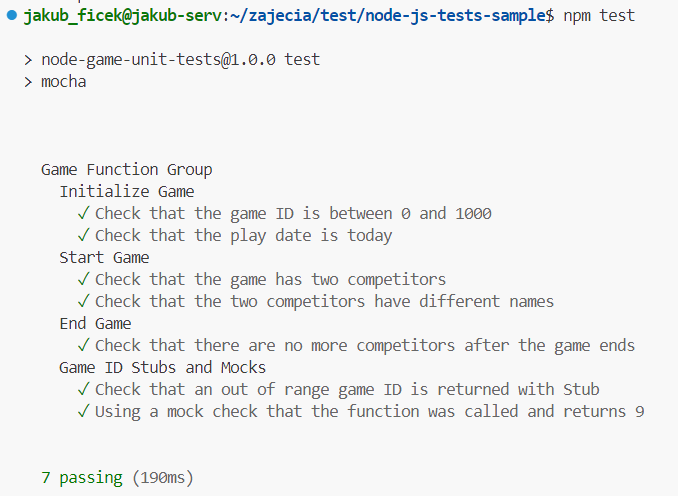

# Sprawozdanie 2
Wykonał: Jakub Ficek, IO.

## Cel projektu

## Streszczenie projektu 

## Wykonane kroki z zajęć 3
### Wybór oprogramowania na zajęcia
* Znajdź repozytorium z kodem dowolnego oprogramowania, które:

Oprogramowanie, które wybrałem to **Sample Game Unit Test Application**. Jest to aplikacja, która jest przykładem testó, ale także demonstracją możliwości budowania CICD wewnątrz AWS CodeBuild.

Wybrałem program w Node.js ponieważ jest to najbardziej interesująca mnie technologia z bardzo przejrzystym i prostym postępowaniem w przypadku budowania oraz testowania aplikacji.

* Program ten dysponuje otwartą licencją:

Jest to licencja MIT-0. Oznacza to, że mogę kod używać, modyfikować, kopiować i generalnie robić z nim co chce.


* Jest także umieszczony wraz ze swoimi narzędziami Makefile:

Dla nodejs takie narzędzie nazywa się **npm** (node package modules), czyli domyślny manager pakietów dla środowiska Node.js. 

Budowanie aplikacji odbywa się za pomocą:

    npm instal

Dzięki temu pobieramy wszystkie potrzebne paczki i zależności, które zapisane są w plikach *package.json* i *package-lock.json*.

W przypadku testowania, jest to równie proste:

    npm test

* Aplikacja zawiera zdefiniowane i obecne w repozytorium testy, które można uruchomić. Testy jednoznacznie formułują swój raport. 

Projekt w swojej strukturze zawiera stworzone testy w pliku index.js w osobnym folderze:


* Sklonowanie repozytorium, przeprowadzenie build programu w tym doinstalowanie wymaganych zależności:

Klonowanie repozytorium wykonałem znaną już komendy ```git clone``` oraz z HTTPS:

    git clone https://github.com/aws-samples/node-js-tests-sample.git


Build przeprowadziłem poprzez ```npm install```:


* Uruchomienie testów jednostkowych dołączonych do repozytorium:

Testy jednostkowe wykonałem poprzez ```npm test``` po zbudowaniu projektu. Możemy zauważyć, że wymagany końcowy raport testów znajduję się i wszystkie przeszły:



### Przeprowadzenie buildu w kontenerze
#### 1. Wykonanie kroków `build` i `test` wewnątrz wybranego kontenera bazowego, w moim przypadku wystarczający kontener to ```node```.

* uruchomienie konteneru z podłączonym TTY, aby rozpocząć interaktywną prace:

Uruchomienie kontenery wykonałem poprzez:

    docker run -it node bash

Jako, że nie miałem obrazu ```node``` lokalnie to odrazy będzie on pobrany.

Opcja *-t* pozwala natomiast na uruchomienie kontenera z **TTY**, czyli *Teletype*, urządzenie odpowiedzialne za podstawowy input-output. Wybrałem do tego **Bash**. Potrzeba jeszcze dodać *-i*, ponieważ pozwala nam na połączenie STDIN.

* zaopatrzenie konteneru odbywa się automatycznie poprzez proces budowania, *git* jest dołączony do obrazu.

* sklonowanie repozytorium:


* uruchomienie *build*:

Aby uruchomić budowanie, należy pamiętać o przejściu do sklonowanego repozytorium komendą ```cd```.


* uruchomienie testów:


#### 2. Stworzenie dwóch plików `Dockerfile` automatyzujących kroki powyżej:
* Kontener pierwszy przeprowadza wszystkie kroki aż do *builda*.

Kod stworzonego Dockerfile, który uwzględnia wszystkie powyższe komendy:

    FROM node:latest
    RUN git clone https://github.com/aws-samples/node-js-tests-sample.git
    WORKDIR /node-js-tests-sample
    RUN npm install

Ważne jest aby dodać przejście do odpowiedniej lokalizacji przed wywołaniem ```npm install```.

Obraz zbudowany został poprzez:

    docker build -f ./BLD.Dockerfile -t bld_node .

Opcja *-f* odpowiada za wyznaczenie ścieżki do pliku, opcja *-t* za nazwę. Ważne, żeby build zakończyć ```.```.


* Kontener drugi bazuje na pierwszym i wykonuje testy.

Jego zawartość to:

    FROM bld_node
    WORKDIR /node-js-tests-sample
    RUN npm test

Ten Dockerfile zawiera jedynie przejście do odpowiedniego folderu naszego kontenera oraz uruchmienie testów. Jest to możliwe ponieważ oparty jest on (**FROM**) na wcześniej zbudowanym obrazie *bld_node*.

Zbudowany został poprzez:

    docker build -f ./TEST.Dockerfile -t test_node --progress=plain --no-cache .

Dzięki temu zobaczymy wszystkie informacje, a także wykonane testy i to czy przeszły (zwróciły poprawny wynik).


#### 3. Wykazanie, że kontener wdraża się i pracuje poprawnie. 

Trzeba pamiętać, że zbudowany obraz, to nie jest działający kontener. Kontener uruchmiamy za pomocą ```docker run```. 

Jako, że nic w nich nie wykonujemy oraz, że nie ma potrzeby uruchamiać go interaktywnie, to wynik tego, czy konrenery wdrażają się i pracują można sprawdzić poprzez:

    docker container list --all

Wypisany wynik zwróci nam status kontenera i to czy działał:


W kontenerach tych po zbudowaniu nie pracuje nic. Nie używamy w Dockerfilu **CMD**, zatem uruchomienie nie spowoduje niczego. Kontenery jednak mają przygotwane repozytorium i przetestowany działający kod. 

Warto także zaznaczyć, że testy nie wykonywane są przy uruchomieniu kontenera (CMD), tylko przy samym budowaniu (RUN). Dotyczą one kodu, który początkowo otrzymujemy, a nie działającej aplikacji. Także wykonywane są tylko raz.
