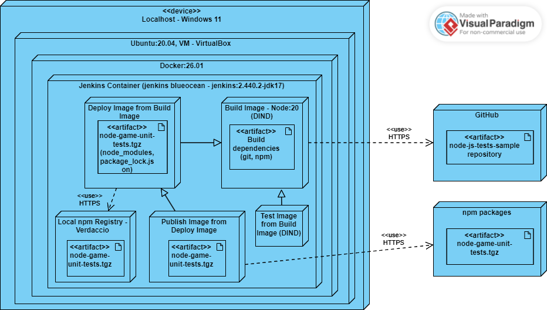

# Sprawozdanie 3
Wykonał: Jakub Ficek, IO.

## Cel projektu
Główny cel projektu to zapoznanie się z pojęciami takimi jak Pipeline oraz CI/CD. Wiedzę tą poznamy poprzez naukę Jenkinsa, czyli serweru służącego właśnie do automatyzacji związanej z tworzeniem oprogramowania.

## Streszczenie projektu 
Projekt opiera się o stworzenie zautomatyzowanego procesu wdrożenia wybranego projektu z wcześniejszych zajęć. Będziemy posługiwać się Jenkinsem, tworząc pipeline. Automatyzacja będzie polegała na izolacji etapów takich jak: Preparation, Build, Test, Deploy i Publish. Wszystko wykonane będzie za pomocą DIND (kontenerów w kontenerze). Dodatkowo stworzone zostaną diagramy określające pomysł na wykonanie tego zadaniu. Całość zostanie podsumowana, a różnice między planem, a wykonaniem opisane.

## Wykonane kroki z zajęć 5, 6 i 7:

### Przygotowanie
#### Instancja Jenkins:
#### 1. Po zapoznaniu się z dokumentacją przeprowadzenie instalacji skonteneryzowanej instancji Jenkinsa z pomocnikiem DIND.

Instalacje jenkinsa zaczynamy od stworzenia sieci mostkowej jenkinsa:

    docker network create jenkins

Następnie pobieramy docker image poprzez uruchomienie konteneru z opdowiednimi opcjami wedługo instrukjci (nie ma potrzeby przepisywania wyjaśnieś wszystkich części instrukcji, zawarte są one w instrukcji).

    docker run \
    --name jenkins-docker \
    --rm \
    --detach \
    --privileged \
    --network jenkins \
    --network-alias docker \
    --env DOCKER_TLS_CERTDIR=/certs \
    --volume jenkins-docker-certs:/certs/client \
    --volume jenkins-data:/var/jenkins_home \
    --publish 2376:2376 \
    docker:dind \
    --storage-driver overlay2

#### 2. Zainicjalizowanie instacji oraz wykazanie działających kontenerów.

Następnym krokiem będzie stworzneie zcustomowanego obrazu jenkinsa poprzez dołączony do instrukcji Dockerfile:

    FROM jenkins/jenkins:2.440.2-jdk17
    USER root
    RUN apt-get update && apt-get install -y lsb-release
    RUN curl -fsSLo /usr/share/keyrings/docker-archive-keyring.asc \
    https://download.docker.com/linux/debian/gpg
    RUN echo "deb [arch=$(dpkg --print-architecture) \
    signed-by=/usr/share/keyrings/docker-archive-keyring.asc] \
    https://download.docker.com/linux/debian \
    $(lsb_release -cs) stable" > /etc/apt/sources.list.d/docker.list
    RUN apt-get update && apt-get install -y docker-ce-cli
    USER jenkins
    RUN jenkins-plugin-cli --plugins "blueocean docker-workflow"

Następnie przechodzimy do uruchomienia budowania poprzez: 

    docker build -t myjenkins-blueocean:2.440.2-1 -f JENKINS.Dockerfile .

Tutaj lekko zmieniamy komendę z instrukcji, ponieważ dodajemy ścieżke do pliku Dockerfile.

Na koniec uruchamiamy nasz kontener:

    docker run \
    --name jenkins-blueocean \
    --restart=on-failure \
    --detach \
    --network jenkins \
    --env DOCKER_HOST=tcp://docker:2376 \
    --env DOCKER_CERT_PATH=/certs/client \
    --env DOCKER_TLS_VERIFY=1 \
    --publish 8080:8080 \
    --publish 50000:50000 \
    --volume jenkins-data:/var/jenkins_home \
    --volume jenkins-docker-certs:/certs/client:ro \
    myjenkins-blueocean:2.440.2-1 

Kontenery działają co możemy sprawdzić następująco:

    docker container list

Jednak aby uruchomić ekran logowania musimy dokonać pare upsrawnień, wynikających z wyboru wirtualnej maszyny (VirtualBox). Przez to, że moja VM używa **NAT** jako sieci konieczne będzie dodanie przekirowywania portów z VM do hosta. Dzięki temu uruchominy ekran Jenkinsa w przeglądarce.

Zacznijmy od znalezienia adresu VM:

    ip a

W moim przypadku jest to: **10.0.2.15**:

Następnie wchodzimy w ustawienia sieci w VirtualBoxie i przechdzimy do zaawansowanych -> Przekierowanie portów:

Dodajemy nowe przekierowanie:

Możemy teraz wejść w przeglądarce do okna Jenkinsa poprze:

    localhost:8080

Wynik:

Hasło możemy odczytać poprzez:

    sudo docker exec ${CONTAINER_ID or CONTAINER_NAME} cat /var/jenkins_home/secrets/initialAdminPassword

Dzięki temu wykonujemy tą komendę w kontenerze i odrazu dostajemy hasło administratorskie, które po stworzeniu konta admina zostanie usuniętę. 

Po zalogowaniu dostajemy poniższe okno:

#### 3. Różnica między obrazem blueocean, a obrazem Jenkinsa

Różnice między obrazem blueocean, a obrazem Jenkinsa to głównie inny interfejs użytkownika i doświadczenia, jakie oferują oba obrazy. Blueocean jest bardziej nowoczesny i przyjazny dla użytkownika, podczas gdy Jenkins oferuje większą elastyczność i możliwości dostosowania. Można powiedzieć, że Obraz blueocean to wizualna nakładka na Jenkinsa, która ma na celu ułatwienie i usprawnienie procesu budowy, testowania i wdrażania aplikacji.

#### 4. Wybrany projekt **node-js-tests-sample**:

Oprogramowanie, które wybrałem to **Sample Game Unit Test Application**. Jest to aplikacja, która jest przykładem testów, ale także demonstracją możliwości budowania CICD wewnątrz AWS CodeBuild.

Wybrałem program w Node.js ponieważ jest to najbardziej interesująca mnie technologia z bardzo przejrzystym i prostym postępowaniem w przypadku budowania oraz testowania aplikacji.

* Program ten dysponuje otwartą licencją:

Jest to licencja **MIT-0**. Oznacza to, że mogę kod używać, modyfikować, kopiować i generalnie robić z nim co chce.

Projekt działa poprawnie, buduje się oraz przechodzi wszystkie testy co udowodnione zostało w sprawozdaniu drugim oraz udowodnione zostanie w projekcie, który klonuje nasze repozytorium i buduje stworzone obrazy z poprzednich zajęć. Znajduje się to w części związanej z Uruchomieniem.

### Uruchomienie

#### Projekt, który wyświetla uname:

Jest to prosty projekt, który stworzyłem z opcji projektu głównego. Użyłem jedynie komend na powłoce poprzez jej uruchomienie w krokach budowania. 

Uname sprawdzamy za pomocą:

    uname -a

Dodatkowo wypisałem także kim jestem poprzez `whoami`, godzinę w sekundach `date +%s` oraz pliki w lokalizacji poprzez `ls`.

Kod na powłoce:

Wynik działania projektu:

#### Projekt, który zwraca błąd gdy godzina jest nieparzysta:

Projekt ten stworzył tak samo jak poprzedni. Wykonałem go jako skrypt bash. Pobiera on godzinę, następnie sprawdza, czy reszta z dzielenia przez 2 zwraca 0, jeżeli tak to oznacza, że godzina jest parzysta, a jeżeli nie to zwracamy błąd.

Kod wyżej opisanego skryptu:

Wynik dla godziny parzystej i nieparzystej:

Zwracanie w skrypcie 1, zamiast 0, powoduje wystąpienie błędu.

#### Projekt, który klonuje nasze repozytorium i buduje stworzony obrazy z poprzednich zajęć:

To zadanie wykonałem już za pomocą pipeline'u. Polega ono na sklonowaniu naszego repozytorium przedmiotu wejście na moją branch oraz zbudowaniu przygotowanych w poprzednim sprawozdaniu plików. Projekt ten ma na celu przygotowanie mnie do późniejszego pipelineu, zrozumienie składki oraz tego jak działają poszczególne kroki (steps). 

Podzieliłem ten projekt na 3 kroki:
- Preparation
- Build
- Test

Komendy używane są znane i pobrane odpowiednio z wcześniejszego sprawozdania, poza pierwszą, która pozwala na sklonowanie repozytorium:

    git branch: 'JF412010', url: 'https://github.com/InzynieriaOprogramowaniaAGH/MDO2024_INO.git'

Użyłem tutaj możliowści Jenkinsa w postaci **Pipeline Syntax**. Dzięki temu podałem tylko odpowiednie dane (Credentialse nie były potrzebne, ponieważ nasze repozytorium jest publiczne) i wygenerowałem treść skryptu. Dzięki temu automatycznie klonuje repozytorium, wchodzę do sklonowanego folderu i przechodzę na odpowiednią gałąź. 

Pełna treść Jekinsfile zawiera się w pliku *Jenkinsfile_Bld_test.groovy* i jest to:

    pipeline {
        agent any

        stages {
            stage('Preperation') {
                steps {
                    echo 'Pobieranie repo'
                    git branch: 'JF412010', url: 'https://github.com/InzynieriaOprogramowaniaAGH/MDO2024_INO.git'
                }
            }
            stage('Build') {
                steps {
                    echo 'Build'
                    sh 'docker build -f ./INO/GCL1/JF412010/Sprawozdanie2/BLD.Dockerfile -t bld_node .'
                }
            }
            stage('Test') {
                steps {
                    echo 'Test'
                    sh 'docker build -f ./INO/GCL1/JF412010/Sprawozdanie2/TEST.Dockerfile -t test_node --progress=plain --no-cache .'
                }
            }
        }
    }

Wyniku uruchomienia tego prostego projektu to:

### Wstęp - Diagramy opisujące proces CI/CD.

Poniżej przedstawie diagramy tego jak przewiduje, że będzie wyglądał mój proces. 

Jest to pierwotny plan, co może (i będzie jak sie okazuje) prowadziło do rozbieżności ze stan końcowym. Będą one omówinione w podsumowaniu części **Pipeline**.

#### Diagram UML aktywności:

Diagram aktywności przedstawiający przewidywany przebieg przygotowania, budowania testowania i deployowania mojego projektu.

#### Diagram UML wdrożenia:

Diagram wdrożeń przedstawiający przewidywane przezemnie zależności:

### Pipeline

#### Fork projektu

Na początku przed przystąpieniem do stworzenia pipeline'u muszę podjąć decyzje co do tego czy tworzyć fork wybranego przez siebię projektu. Zależeć to będzie od tego, czy w sklonowanym repozytorium będę dokonywać jakichś zmian. W moim przypadku konieczne będzie dodanie jednego pliku, pozwalającego mi na pobranie opublikowanej paczki z lokalnego repozytorium (plik formatu *.npmrc*). 

Fork projektu można wykonać poprzez GitHub odpowiednio w interesującym nas repozytorium:

#### Preperation

W tej części kluczowe będzie usunięcie obrazów zbudowanych we wcześniejszych uruchomieniach, ponieważ musimy pamiętać, że zapisujemy wszystkie dane w dockerze jenkinsa, który trzyma te dane w pamięci. Wyczyszczone zostaną także logi, które osobno zapiszę jako artefakty po wykonaniu testów.

W tej części kluczowe będzie także sklonowanie repozytorium przedmiotu oraz wybranie odpowiedniej gałęzi, ponieważ będę korzystać z plików **Dockerfile** zamieszczonych w swoim katalogu.

Zacznę od usunięcia sklonowanego repozytorium, aby sklonować nowe:

    rm -rf MDO2024_INO

Następnie wykonuje klonowanie za pomocą Pipeline Syntax:

    git branch: 'JF412010', url: 'https://github.com/InzynieriaOprogramowaniaAGH/MDO2024_INO.git'

Warto przypomnieć, że odrazu następuję przejście do sklonowanego repozutorium. Następnie uruchomie skrypt, który wyczyści powstałe wcześniej obrazy i działające kontenery. Znajduje się on w folderze **node-js-tests-sample**:

    #!/bin/bash

    # Deleting .npmrc file
    if [ -f ".npmrc" ]; then
    rm .npmrc
    fi

    # Check if there are running containers
    if [ "$(docker ps -q)" ]; then
    # Stop running containers
    docker stop $(docker ps -q)
    fi

    # Deleting images
    if [ "$(docker images -q)" ]; then
    docker rmi -f $(docker images -q)
    fi

    # Deleting containers
    if [ "$(docker ps -a -q)" ]; then
    docker rm -f $(docker ps -a -q)
    fi

    # Directory for temporary logs, deleting them at the end and saving as artifacts
    if [ ! -d "temp_logs" ]; then
    mkdir temp_logs
    fi

Dodatkowo tworzymy folder na logi, który potem usuniemy. Logi zostaną zapisane jako odpowiednie artefakty.

Kroki w pipeline wyglądają następująco:
    
    stage('Preparation') {
        steps {
            echo "Preparation"
            sh 'rm -rf MDO2024_INO'
            git branch: 'JF412010', url: 'https://github.com/InzynieriaOprogramowaniaAGH/MDO2024_INO.git'
                
            dir ('./INO/GCL1/JF412010/Sprawozdanie3/node-js-tests-sample') {
                sh 'chmod +x docker_clear.sh'
                sh './docker_clear.sh'
            }
        }
    }

#### Build

Build zdecydowałem się przeprowadzić na osobnym DIND. W tym miejscu warto zaznaczyć jaka jest różnica pomiędzy wybranym przezemnie podejściem a bezpośrednim uruchomieniem buildu na kontenerze CI. 

* Uruchomienie na kontenerze CI: 
  
    Wszystkie pipeline'y korzystają z tej samej instancji Dockera. Oznacza to, że jeśli jeden pipeline modyfikuje konfigurację Dockera, może to mieć wpływ na inne pipeline'y. Jest to szybsze i zużywa mniej zasobów, ale również jest mniej bezpieczne.

* Docker-in-Docker (DIND):

    Polega na uruchomieniu pełnej instancji Dockera wewnątrz każdego kontenera. Dzięki temu każdy pipeline ma swoją własną, izolowaną instancję, co umożliwia pełną kontrolę nad środowiskiem.

Obrazem bazowym dla mojego kontenera będzie obraz Node. Jako, że nie ma różnicy między runtimowym obrazem, a obrazem z dependencjami zdecydowałem się na świadome wybraniu tagu tego obrazu. Mój wybór padł na **node:20**. Jest to stosunkowo nowa wersja obrazu, która spełnia wszystkie wymogi dotyczące mojego projektu oraz *lokalnego rejestru verdaccio*, którego będę używać.

Projekt zostanie zbudowany odrazu podczas budowania obrazu na podstawie pliku **BLD.Dockerfile**:

    # syntax=docker/dockerfile:1

    FROM node:20

    RUN git clone https://github.com/JakubFicek/node-js-tests-sample.git
    WORKDIR /node-js-tests-sample
    RUN npm install

Uruchomienie budowania tego obrazu wraz z zapisem logów wykonałem komendą:

    docker build -f ./BLD.Dockerfile -t bld_node . 2>&1 | tee ./temp_logs/build_log_${BUILD_NUMBER}.txt

Warto zaznaczyć, że **BUILD_NUMBER** jest zmienną środowiskową, co spowoduje, że nasze logi nie będą się nadpisywać, a zapisywać w zależności od numeru uruchomienia pipeline'u. 

Zapisywanie do pliku wykonałem poprzez `2>&1 | tee` dzięki temu przekazujemy wyjście do pliku oraz do standardowego wyjścia.

Zapisywanie logów odbywa się za pomocą `archiveArtifacts` z odpowiednimi parametrami, czyli nazwą pliku, który chcemy zapisać oraz z tym czy zapisujemy go tylko w przypadku gdy build i test przechodzą poprawnie:

    archiveArtifacts artifacts: "temp_logs/build_log_${BUILD_NUMBER}.txt", onlyIfSuccessful: false

W moim przypadku chcę także, aby logi zapisywały się przy niepoprawnym działaniu builda i testów.

Całość części odpowiedzialnej za build wygląda następująco:

    stage('Build') {
        steps {
            echo "Build"
            dir ('./INO/GCL1/JF412010/Sprawozdanie3/node-js-tests-sample') {
                sh 'docker build -f ./BLD.Dockerfile -t bld_node . 2>&1 | tee ./temp_logs/build_log_${BUILD_NUMBER}.txt'
                archiveArtifacts artifacts: "temp_logs/build_log_${BUILD_NUMBER}.txt", onlyIfSuccessful: false
            }
        }
    }

#### Test

Test również uruchamiany jest w osobnym kontenerze, który bazuję na kontenerze zbudowanym. W związku z tym początek Dockerfile, będzie zaczynać się od:

    FROM bld_node:latest

Cały plik znajduje się w folderze **node-js-tests-sample**, jego nazwa to **TEST.Dockerfile**.

    # syntax=docker/dockerfile:1

    FROM bld_node:latest

    WORKDIR /node-js-tests-sample
    RUN npm test

Zbudowanie tego obrazu, a co za tym idzie przetestowanie naszego buildu odbywa się następująco komendą:

    docker build --no-cache -f ./TEST.Dockerfile -t test_node . 2>&1 | tee ./temp_logs/test_log_${BUILD_NUMBER}.txt

Tak samo uwzględniamy tutaj zapis logów. Dodatkowo jednak zawarta jest flaga --no-cache, która oznacza, że docker nie będzie wykorzystywać zapisanych danych w pamięci Cache. Przy buildzie jest to przydatne, bo znacznie przyśpiesza proces, jednak przy testach pomijane są testy i nie wypisuje nam ich podsumowania.

Całość części odpowiedzialnej za test wygląda następująco:

    stage('Test') {
        steps {
            echo "Test"
            dir ('./INO/GCL1/JF412010/Sprawozdanie3/node-js-tests-sample') {
                sh 'docker build --no-cache -f ./TEST.Dockerfile -t test_node . 2>&1 | tee ./temp_logs/test_log_${BUILD_NUMBER}.txt'
                archiveArtifacts artifacts: "temp_logs/test_log_${BUILD_NUMBER}.txt", onlyIfSuccessful: false
            }
        }
    }

Na tym etapie przeprowadziłem test bez stworzenia jeszcze dalszych kroków w pipeline. Projekt działa poprawnie co potwierdzają poniższe zrzuty:

Otworzyłem także artefakt z testami, co potwierdza, że wszystkie przeszły.

#### Deploy

* **Opis**:

Deploy mojego projektu wykonany będzie niekonwencjonalnie, ponieważ jest to projekt, którego jedyną funckjonalnością są testy. 

Będzie on przebiegał poprzez zbudowanie dwóch obrazów oraz uruchomienie konteneru. W kontenerze w DIND uruchomione zostanie lokalne npm registry. Do tego rejestru będę publikować swój projekt (node_modules, package_lock.js) z pierwszego obrazu podczas budowania. Obraz ten będzie oparty na wersji obrazu, który budował mój projekt. 

Następnie po publishu mojej paczki do rejestru nastąpi zbudowanie drugiego obrazu. Obraz ten będzie oparty na Node, jednak będzie on w innej wersji niż obraz do budowania (Build oparty jest na *Node:20*, podczas gdy Deploy oparty będzie na *Node:19*). Nowo zbudowany obraz będzie odpowiadał za sklonowanie plików projektu, następnie pobraniu opublikowanej paczki i sprawdzeniu czy publish został wykonany poprawnie, a co za tym idzie uruchomienie testów (logi osobno zostaną zapisane). Po sciągnięciu paczki, przewidywany wynik to bezbłędne uruchomienie testów.

* **Wykonanie**:

Zacząłem od uruchomienia lokalnego rejestru w kontenerze. Korzystałem z **verdaccio**. Uruchomiłem go za pomocą:

    docker run -d --rm --name verdaccio -p 4873:4873 verdaccio/verdaccio

Ważne jest, aby przy kopiowaniu komendy uruchomienia z ich oficjalnej strony pamiętać, że nie możemy uruchomić tego kontenera interaktywnie. Dodatkowo, nie obędzie się bez opcji **-d**, która oznacza 'detached', czyli odłączony. Dzięki temu kontener nie zablokuje naszego pipeline'u. Był to jeden z napotkanych przezemnie problemów.

Następnie przeszedłem do stworzenia obrazu, który będzie bazował na obrazie do budowania projektu. Dzięki temu odrazu będzie miał dostęp do zbudowanego projektu i będzie mógł opublikować naszą paczkę. Plik Dockerfile ma nazwę **DEPLOY1.Dockerfile**, jego treść to:

    FROM bld_node:latest

    ARG VERSION_UPDATE
    ARG HOST_IP

    WORKDIR /node-js-tests-sample

    RUN npm install -g npm-cli-adduser

    RUN npm-cli-adduser --registry http://${HOST_IP}:4873 --username user --password pass --email email@example.com
    RUN npm version ${VERSION_UPDATE} --no-git-tag-version
    RUN npm publish --registry http://${HOST_IP}:4873

W tym miejscu także następuje wersjonowanie paczki. Przesyłamy wersję jako argument z pipeline wprowadzany przez nas. Dodatkowo wprowadzona jest odpowiedia zmienna **HOST_IP**, która odpowiada za IP jenkins-docker'a. Dzięki temu wiemy, na jakim adresie uruchomione jest nasze lokalne repozytorium.

Pobieramy także odpowiednią paczkę **npm-cli-adduser**, potrzebną do założenia i zalogowania się na konto npm nieinterakwtynie. W tym obrazie konto jest nieznaczące, ponieważ jest to nasze lokalne registry, do którego pushujemy publiczną paczkę, zatem nie będziemy potrzebować konta. Tak więc dane wprowadzone są jawnie, czego nie powinno się robić przy normalnych projektach. Tutaj nie ma to najmniejszego znaczenia. 

Komenda:

    npm publish --registry http://${HOST_IP}:4873

Odpowiada za przesłanie projektu do rejestru, a flaga określa do jakiego, gdyż bez parametrów, domyślny rejest to npm registry, czyli oficjalny rejestr twórców npm.

Paczka w rejestrze wygląda następująco:

Następny krok to stworzenie obrazu opartego na innej wersji node i pobranie naszej paczki z rejestru, a następnie weryfikacja, czy testy da się uruchomić bez budowania całego projektu. Plik Dockerfile to **DEPLOY2.Dockerfile**:

    FROM node:19

    RUN git clone https://github.com/JakubFicek/node-js-tests-sample.git
    WORKDIR /node-js-tests-sample

    COPY .npmrc /node-js-tests-sample/.npmrc

    RUN npm install node-game-unit-tests

    RUN npm test

Kluczowe jest tu skopiowanie wcześniej stworzonego w pipeline pliku **.npmrc**, który okeśli konfigurację, zmieniającą domyślny rejestr z którego będziemy pobierać paczkę. Komenda używa do stworzenia pliku to:

    echo "registry=http://${HOST_IP}:4873" > .npmrc

Będzie on także odpowiednio usuwany. Wyniki testu są także zapisywane jako osobny artefakt, wersjonowany numerem buidu pipeline.

Oba te obrazu powinny być budowane z opcją **--no-cache**. Pierwszy obraz, ponieważ w przypadko korzystanai z cache nie zawsze dokonywane jest logowanie i dodawanie konta rejestru, co uniemożliwa publish. Co do sprawdzania działania projektu, jest to uzasadnione każdorazowym przeprowadzaniem testów.

Całość części odpowiedzialnej za deploy wygląda następująco:

    stage('Deploy') {
        steps {
            echo "Deploy"
            sh 'docker run -d --rm --name verdaccio -p 4873:4873 verdaccio/verdaccio'
            dir ('./INO/GCL1/JF412010/Sprawozdanie3/node-js-tests-sample') {
                sh "docker build --build-arg HOST_IP=${HOST_IP} --no-cache -f ./DEPLOY1.Dockerfile --build-arg VERSION_UPDATE=${VERSION_UPDATE} -t deploy1_node ."
                sh 'echo "registry=http://${HOST_IP}:4873" > .npmrc'
                sh "docker build --no-cache -f ./DEPLOY2.Dockerfile -t deploy2_node . 2>&1 | tee ./temp_logs/test_deploy_log_${BUILD_NUMBER}.txt"
                archiveArtifacts artifacts: "temp_logs/test_deploy_log_${BUILD_NUMBER}.txt", onlyIfSuccessful: false
                }
            }
        }

#### Publish

* **Opis**:

Publish projektu opiera się na jednym obrazie. Bazuje on na drugim obrazie do deployu. Jego zadanie do opublikowanie projektu (paczki) do większego rejestru jakim jest npm registry. W tym celu będę załadał konto developerskie na którym opublikuje swój projekt.

* **Wykonanie**:

Zacząłem od założenia konta. 

Kolejny krok to będzie odpowiednio zbudowanie obrazu na podstawie drugiego obrazu do deployu i usunięcie skopiowanego pliku .npmrc, ponieważ chcemy odwoływać się teraz do domyślnego rejestru.

Kluczowe będzie także zalogowanie się do konta. Będzie trzeba przesyłać te dane poprzez parametry, a także wygenerować odpowiedni token.

W swoim jenkinsie dodałem odpowiednie credentialse. Zrobiłem to w zakładce **Credentials** w części systemu. Jedna odpowiada za hasło do konta, a druga za token autoryzacyjny. 

Token wygenerowałem w koncie NPM w zakładce **Access Tokens**. Do wyboru były 2 rodzaje tokenów, ja wybrałem ten stały (classic), który nazwany jest Automation. Jest to specjalny token, który pozwala na pomięcie podwójnen autoryzacji w przypadku publishing'u. Jest to wieć idealny token skierowany wręcz do tego typu zadania.

Następnie stworzyłem obraz oparty na ostatnim obrazie do deployu, w którym pobraliśmy paczkę z lokanlnego rejestru i uruchomiliśmy testy projekty (== uruchomiliśmy projekt). Jego treść jest zawarta w pliku **PUBLISH.Dockerfile**:

    FROM deploy2_node:latest

    ARG VERSION_UPDATE
    ARG NPM_TOKEN
    ARG NPM_PASSW

    WORKDIR /node-js-tests-sample

    RUN rm .npmrc
    RUN npm config set //registry.npmjs.org/:_authToken=${NPM_TOKEN}
    RUN npm install -g npm-cli-adduser

    RUN npm-cli-adduser --username jakub_ficek --password ${NPM_PASSW} --email jakubficek138@gmail.com
    RUN npm version ${VERSION_UPDATE} --no-git-tag-version

    RUN npm publish

Kluczowe jest tu przesyłanie dwóch parametrów. Nie ma tutaj nieznanych wcześniej komend, jednak wystąpiły pewne problemy z autoryzacją npm. Według ich oficjalnej strony, jedynie dołączenie tokenu wraz z linkiem do rejestru powinno rozwiązać problemy dotyczące autoryzacji, jednak okazało się to być bardziej skomplikowane. W moim przypadku nie udało się obejść autoryzacja dwustopniowej i przy publishu wykonuje potwierdzenie z aplikacji. Dlatego też dodałem konto npm za pomocą `npm-cli-adduser`, co nie jest wskazane. Wydaje mi się, że problemem mogłobyć wcześniejsze konfigurowanie projektu do pobrania z lokalnego repozytorium i zapisywanie poprzedniego konta (nieznaczącego). Jednak usunięcie pliku **.npmrc** powinno rozwiązywać problem, gdzie tak się nie okazało. Po wielu próbach musiałem zaprzestać szukania rozwiązania tego problemu, gdyż większość stron zalecała logowanie, co uczyniłem dodając konto.

Dodatkowo upewniłem się, że konsola jenkinsa nie wyświetla przekazanego tokenu. Taki problem mógł wystąpić podczas używania **"**, zamiast **'**.

Wersjonowanie zostało uwzględnione w ten sam sposób, co wersjonowanie w przypadku przesyłania do lokalnego rejestru (wersja musi być zgodna). 
Dodatkową zauważyłem, że nie można opublikować paczki do lokalnego rejestru w tej samej nazwie i wersji, jeżeli znajduje się ona w rejestrze domyślnym (npm). Co tylko potwierdza poprawne opublikowanie paczki.

Całość części odpowiedzialnej za publish wygląda następująco:

    stage('Publish') {
        steps {
            echo "Publish"
            dir ('./INO/GCL1/JF412010/Sprawozdanie3/node-js-tests-sample') {
                sh 'docker build --build-arg NPM_TOKEN=${NPM_TOKEN} --build-arg NPM_PASSW=${NPM_PASSW} --no-cache --build-arg VERSION_UPDATE=${VERSION_UPDATE} -f ./PUBLISH.Dockerfile -t publish_node .'
            }
        }
    }

#### Podsumowanie:

* **Potwierdzenie działania.**

Zdjęcie opublikowanej paczki w registry npm:

Zdjęcie artefaktów (logów) z pipeline:

Zdjęcie potwierdzonego działania pipeline z jenkinsa:

* **Różnice między stanem rzeczywistym, a stanem opisanym poprzez diagramy UML.**

Kluczową różnicą okazało się wprowadzenie dwóch kontenerów do deployu. Oddzielnie jeden do wysyłania paczki do lokalnego rejstru i oddzielnie drugi (w innej wersji), który tę opublikowaną paczkę do projektu pobierał. Pomysł ten został wprowadzony na późniejszym etapie, przez co diagramy z pomysłem okazały się rozbieżne do rzeczywistego stanu. Różnice znajdują się w obudiagaramach. Brakuje uwzględniania jedynie dwóch różnych obrazów. Warto zaznaczyć, że obraz do publishu budowany będzie na tym obrazie, który pobierał paczkę i sprawdzał, czy wszystko w projekcie działa poprawnie.

* **Pełny plik Jenkinsfile:**

        pipeline {
            agent any
            
            environment {
                VERSION_UPDATE = '1.1.4'
                HOST_IP ='172.20.0.3'
                NPM_TOKEN = credentials('NPM_TOKEN')
                NPM_PASSW = credentials('NPM_PASSW')
            }

            stages {
                stage('Preparation') {
                    steps {
                        echo "Preparation"
                        sh 'rm -rf MDO2024_INO'
                        git branch: 'JF412010', url: 'https://github.com/InzynieriaOprogramowaniaAGH/MDO2024_INO.git'
                        dir ('./INO/GCL1/JF412010/Sprawozdanie3/node-js-tests-sample') {
                            sh 'chmod +x docker_clear.sh'
                            sh './docker_clear.sh'
                        }
                    }
                }
                stage('Build') {
                    steps {
                        echo "Build"
                        dir ('./INO/GCL1/JF412010/Sprawozdanie3/node-js-tests-sample') {
                            sh 'docker build -f ./BLD.Dockerfile -t bld_node . 2>&1 | tee ./temp_logs/build_log_${BUILD_NUMBER}.txt'
                            archiveArtifacts artifacts: "temp_logs/build_log_${BUILD_NUMBER}.txt", onlyIfSuccessful: false
                        }
                    }
                }
                stage('Test') {
                    steps {
                        echo "Test"
                        dir ('./INO/GCL1/JF412010/Sprawozdanie3/node-js-tests-sample') {
                            sh 'docker build --no-cache -f ./TEST.Dockerfile -t test_node . 2>&1 | tee ./temp_logs/test_log_${BUILD_NUMBER}.txt'
                            archiveArtifacts artifacts: "temp_logs/test_log_${BUILD_NUMBER}.txt", onlyIfSuccessful: false
                        }
                    }
                }
                stage('Deploy') {
                    steps {
                        echo "Deploy"
                        sh 'docker run -d --rm --name verdaccio -p 4873:4873 verdaccio/verdaccio'
                        dir ('./INO/GCL1/JF412010/Sprawozdanie3/node-js-tests-sample') {
                            sh "docker build --build-arg HOST_IP=${HOST_IP} --no-cache -f ./DEPLOY1.Dockerfile --build-arg VERSION_UPDATE=${VERSION_UPDATE} -t deploy1_node ."
                            sh 'echo "registry=http://${HOST_IP}:4873" > .npmrc'
                            sh "docker build --no-cache -f ./DEPLOY2.Dockerfile -t deploy2_node . 2>&1 | tee ./temp_logs/test_deploy_log_${BUILD_NUMBER}.txt"
                            archiveArtifacts artifacts: "temp_logs/test_deploy_log_${BUILD_NUMBER}.txt", onlyIfSuccessful: false
                        }
                    }
                }
                stage('Publish') {
                    steps {
                        echo "Publish"
                        dir ('./INO/GCL1/JF412010/Sprawozdanie3/node-js-tests-sample') {
                            sh 'docker build --build-arg NPM_TOKEN=${NPM_TOKEN} --build-arg NPM_PASSW=${NPM_PASSW} --no-cache --build-arg VERSION_UPDATE=${VERSION_UPDATE} -f ./PUBLISH.Dockerfile -t publish_node .'
                        }
                    }
                }
            }

            post {
                always {
                    dir ('temp_logs') {
                        deleteDir()
                    }
                }
            }
        }

### Pełna lista kontrolna
Pozwala mi ona na podsumowanie mojego sprawozdania (co udało się zrobić, a co nie) oraz planowanie czynności względem ścieżki krytycznej. Powyższa lista została opisana w powyżej w sprawozdaniu, z uwzględnieniem użytych komend, plików oraz potwierdzeniem poprzez zrzut ekranu.

- [x] Aplikacja została wybrana
- [x] Licencja potwierdza możliwość swobodnego obrotu kodem na potrzeby zadania
- [x] Wybrany program buduje się
- [x] Przechodzą dołączone do niego testy
- [x] Zdecydowano, czy jest potrzebny fork własnej kopii repozytorium
- [x] Stworzono diagram UML zawierający planowany pomysł na proces CI/CD
- [x] Wybrano kontener bazowy lub stworzono odpowiedni kontener wstepny (runtime dependencies)
- [x] Build został wykonany wewnątrz kontenera
- [x] Testy zostały wykonane wewnątrz kontenera
- [x] Kontener testowy jest oparty o kontener build
- [x] Logi z procesu są odkładane jako numerowany artefakt
- [x] Zdefiniowano kontener 'deploy' służący zbudowanej aplikacji do pracy
- [x] Uzasadniono czy kontener buildowy nadaje się do tej roli/opisano proces stworzenia nowego
- [x] Wersjonowany kontener 'deploy' ze zbudowaną aplikacją jest wdrażany na instancję Dockera
- [x] Następuje weryfikacja, że aplikacja pracuje poprawnie (*smoke test*)
- [x] Zdefiniowano, jaki element ma być publikowany jako artefakt
- [x] Uzasadniono wybór: kontener z programem, plik binarny, flatpak, archiwum tar.gz, pakiet RPM/DEB
- [x] Opisano proces wersjonowania artefaktu (można użyć *semantic versioning*)
- [x] Dostępność artefaktu: publikacja do Rejestru online, artefakt załączony jako rezultat builda w Jenkinsie
- [x] Przedstawiono sposób na zidentyfikowanie pochodzenia artefaktu
- [x] Pliki Dockerfile i Jenkinsfile dostępne w sprawozdaniu w kopiowalnej postaci oraz obok sprawozdania, jako osobne pliki
- [x] Zweryfikowano potencjalną rozbieżność między zaplanowanym UML a otrzymanym efektem
- [x] Sprawozdanie pozwala zidentyfikować cel podjętych kroków