# Sprawozdanie 4
Wykonał: Jakub Ficek, IO.

## Cel projektu

Zapoznanie się z narzędziem ansible do automatyzacji oraz do zdalnego wykonywania poleceń oraz poznanie i stworzenie pliku konfiguracyjnego do nienadzorowanej istalacji, pozwalający nam także wprowadzić wybrany działający program odrazu do systemu.

## Streszczenie projektu 

W tym projekcie zacząłem od zainstalowania drugiej maszyny Ansible, opisałem ten proces, wprowadziłem wymianę kluczy między maszynami, aby komunikacja przebiegała bez podawania hasła. Dodatkowo użyłem maszyny Ansible do wdrożenia kontenera na drugiej maszynie, który pozwala uruchomić dany pogram.

Wdrożyłem także maszynę za pomocą pliku kickstart (w sposób nienadzorowany), następnie za pomocą tego samego pliku dodałem do niego możliwość wdrożenia i uruchomienia wybranej aplikacji.

## Wykonane kroki z zajęć 8:

### Instalacja zarządcy Ansible
#### 1. Utworzenie drugiej maszynę wirtualną o **jak najmniejszym** zbiorze zainstalowanego oprogramowania:
* Zastosowanie tego samego systemu operacyjnego, co "główna" maszyna:

W moim przypadku wybrany system operacyjny to **ubuntu 22.04**. Wirtualną maszynę, tworzyłem na wzór poprzedniej, ze zmniejszoną pamięcia (w razie potrzeby przydziele więcej). Dałem jej także mniejsze zasoby procesora i pamięci RAM. 

Aby ubewnić się, że wirtualna maszyna będzie jak najmniejsza, podczas instalacji wybrałem opcję **minimized**, co pokazuje poniższy zrzut ekranu:

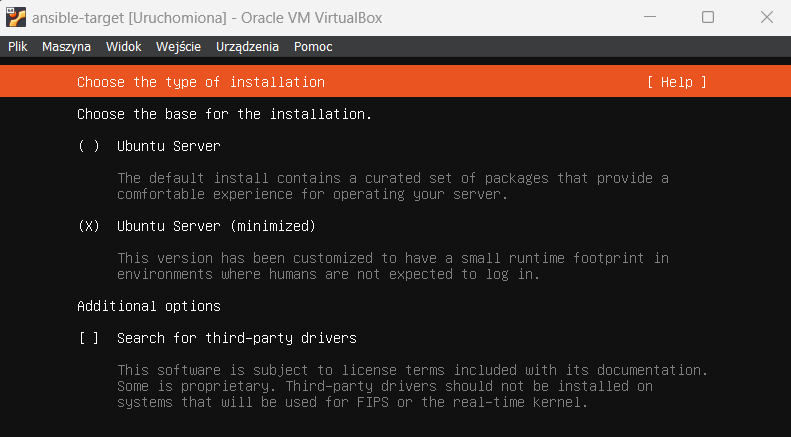

* Zapewnienie obecności programu `tar` i serwera OpenSSH (`sshd`)

Obecność programu tar została zapewniona automatycznie, co do OpenSSH, wybrałem taką opcję podczas instalacji. Potwierdzenie działania na nowej maszynie wykonałem sprawdzając wersję:

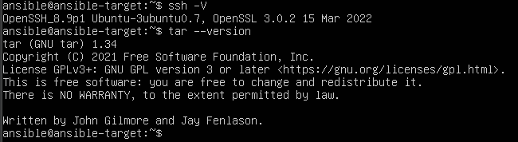

* Nadanie maszynie *hostname* `ansible-target` i utworzenie użytkownika `ansible`:

Dokonałem tego także podczas instalacji. Powyższy screenshot potwierdza także tą część. Widoczne jest to poprzez:

`ansible@ansible-target:`

* Zrobienie migawki maszyny:

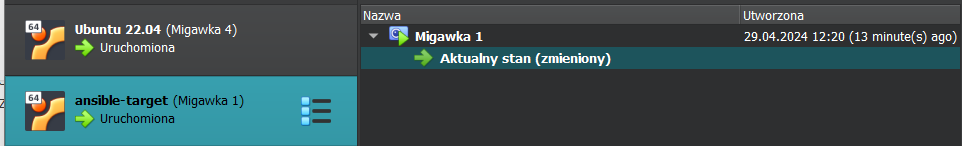

#### 2. Na głównej maszynie wirtualnej zainstalowałem oprogramowanie Ansible.

Postępując zgodnie z załączoną instrukcją, wybrałem odpowiednio swój system (ubuntu) i wykonałem instalację. Zacząłem od aktulizacji i upgrade'u systemu:

    sudo apt update
    sudo apt upgrade

Następnie wykonałem instalacje *software-properties-common*, dzięki instrukcji:

    sudo apt install software-properties-common

Mogłem przejść do pobrania oprogramowania Ansible z repozytorium dystrybucji poprzez:

    sudo add-apt-repository --yes --update ppa:ansible/ansible

Dzięki tym kroką przeszedłem do instalacji:

    sudo apt install ansible

Sprawdzenie poprzez wersję:

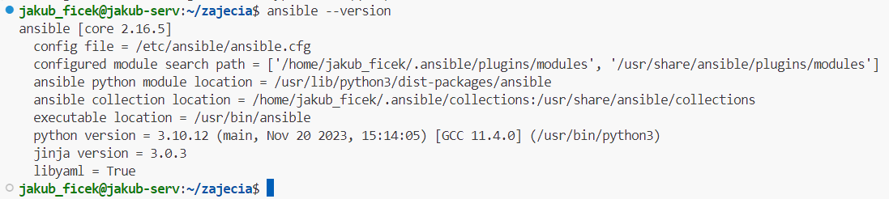

Oznacza to, że oprogramowanie zostało zainstalowane poprawnie.

#### 3. Wymień klucze SSH między użytkownikiem w głównej maszynie wirtualnej, a użytkownikiem `ansible` z nowej tak, by logowanie `ssh ansible@ansible-target` nie wymagało podania hasła

Na wstępnie zorientowałem się, że moje maszyny działają na domyślnych ustawieniach sieci NAT i mają taki sam adres. Oznaczało to, że musiał stworzyć nową sieć NAT, która następnie przypisałem do obu tych maszyn. Dzięki temu każda z nich otrzyma swój indywidualny adres. Problem ten często występuje w VirtualBoxie. 

Sieć stworzyłęm w Narzędziach -> Sieć -> NAT Networks. 

Ustawienai zostawiłem domyśly, zmieniłem jedynie nazwę. Przypisałem następnie sieć do maszyn w ustawieniach sieci, zmianiając opcje z NAT na NAT Networks. Sprawdziłem adres swojej głównej maszyny. Uległ on zmianie, tak samo jak nowej. 

Dodałem jeszcze Port Forwarding do adresu głównej maszyny, tak aby działało to co miałem zrobione wcześniej:

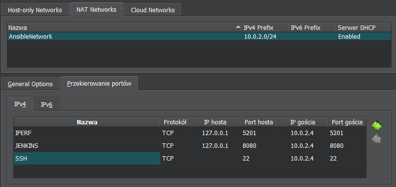

Dzięki temu, nie musiałem zmieniać żadnych ustawień i wszystko (WinSCP, VSCode) połączyły się odrazu bez problemu. 

Sprawdziłem następnie czy maszyny mogą się komunikować poprzez logowanie do nowej maszyny z maszyny głównej. Była to komenda:

    ssh ansible@10.0.2.15

Komunikacja działa:

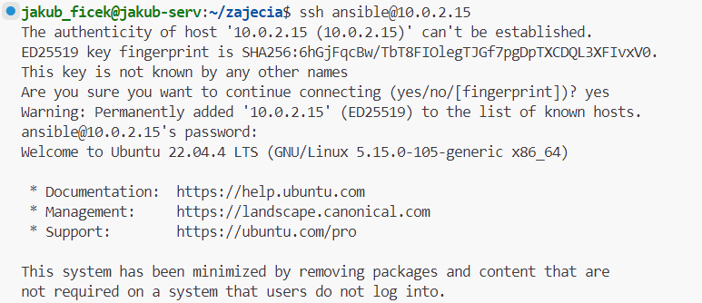

Następnie aby łączyć się poprzez:

    ssh ansible@ansible-target

muszę dodać nazwę hosta do maszyny głównej.

Otworzyłem plik `etc/hosts` i dodałem do niego:

    10.0.2.15 ansible-target

Sprawdziłem czy wszystko zadziałało:

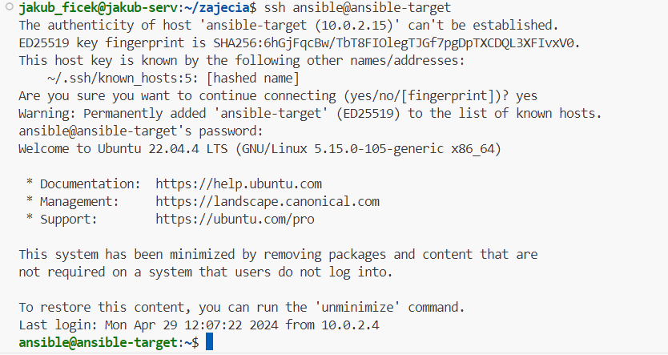

Po tych krokach mogę przejść do wymiany kluczy SSH. Na początku wygenerowałem klucz na maszynie głównej:

    ssh-keygen -t rsa

Nie ustawiłem passphrase, a lokalizację ustawiłem na domyślną. Teraz należy przekopiować treść publicznego klucza do maszyny ansbile-target.

Jest do tego specjalna komenda, której użyje:

    ssh-copy-id -i ~/.ssh/id_rsa.pub ansible@ansible-target

Flaga **-i** pozwala nam określić lokalizację klucza. Po skopiowaniu dostajemy potwierdzenie:

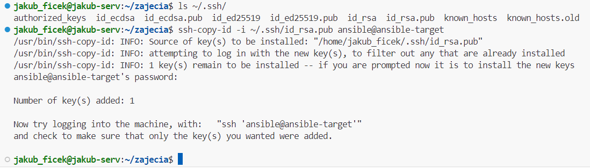

Logowanie powinno przebiegać automatycznie, bez podania hasła, co widać poniżej:

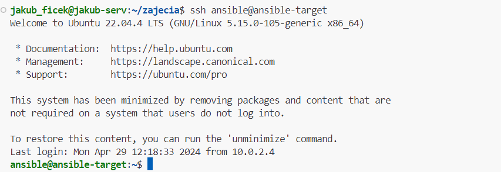

### Inwentaryzacja

#### 1. Ustalenie nazw i zweryfikowanie łączności między maszynami.

Nazwy maszyn zostały ustalone już wcześniej. Maszyna główna nosi nazwę **jakub-serv**, a druga z maszyn **ansible-target**. Dodawanie nazwy do serwera DNS, czyli pliku **/etc/hosts** zostało opisane wyżej dla dodawania nowej maszyny. Dodany został także host **jakub-serv** do nowej maszyny tym samym sposobem. 

Potwierdzenie nazw hostów możemy wykonać za pomocą komendy `hostname`:

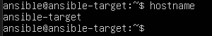

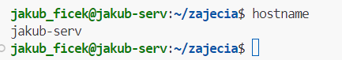

Co do potwierdzenia dodania nazw do serwera DNS, zrobimy to sprawdzając łączność za pomocą komendy:

    ping -c 4

Co wykona wysłanie czterech pakietów i wyświeli podsumowanie dotyczące łączności. Dla obu przypadków dostajemy:

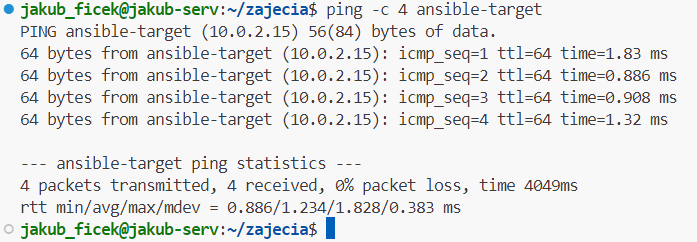
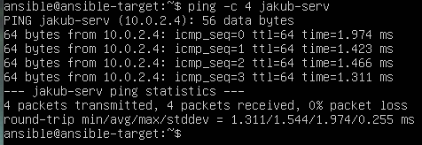
  
#### 2. Stworzenie pliku inwentaryzacji

Korzystając z załączonego poradnika przeszedłem do stworzenia pliku w formacie **.yaml**. Wybrałem ten format ponieważ, bardziej mi się podoba, jest według mnie czytelniejszy. Korzystając z pliku inwentarza (*inventory.yaml*), Ansible może zarządzać dużą liczbą hostów za pomocą pojedynczej komendy. Upraszcza to znacznie pracę. 

Rozróżnie w swoim pliku dwie sekcję, `Orchestrators` oraz `Endpoints`, gdzie za główny serwer, czyli "dyrygenta" odpowiada **jakub-serv**, a za serwer docelowy **ansible-target**. Dodatkowo te serwery obejmę w w grupę `networks`.

Cały plik prezentuje się następująco:

    Orchestrators:
        hosts:
            host-jakub-serv:
              ansible_host: jakub-serv
              ansible_user: jakub_ficek

    Endpoints:
        hosts:
            target-hosts:
              ansible_host: ansible-target
              ansible_user: ansible
            
    network:
      children:
        Orchestrators:
        Endpoints:

### 3. Żądanie ping do wszystkich maszyn:

Dzięki grupie **network** będę w stanie wysłać ping do wszystkich maszyn korzystając z pliku inwentaryzacyjnego.

Komenda wygląda następująco:

    ansible -i inventory.ini network -m ping

Po opcji *-i* określamy plik inwentaryzacyjny, a opcja *-m* określa moduł, który używamy, w tym przypadku **ping**.

Pierwotnie problemem okazuje się tutaj być to, że nie mamy wymienionego klucza z maszyny na której pracuje do niej samej. Przez to dostajemy błąd:

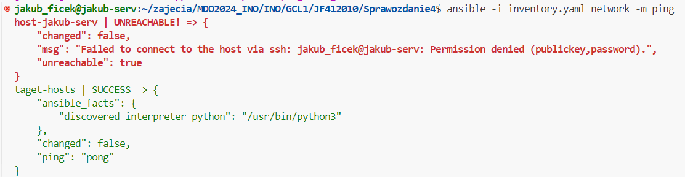

W tym momencie po zastanowieniu nie wydaje się, aby połączenie z dyrygenta do dyrygenta było konieczne, ponieważ głównie będziemy z dyrygenta działać na punktach docelowych, jednak wprowadziłem odpowiedni klucz, aby wyeliminować błąd. Zrobiłem to tak samo jak w pierwszej części sprawozdania.

Wynik końcowy bez błędów:

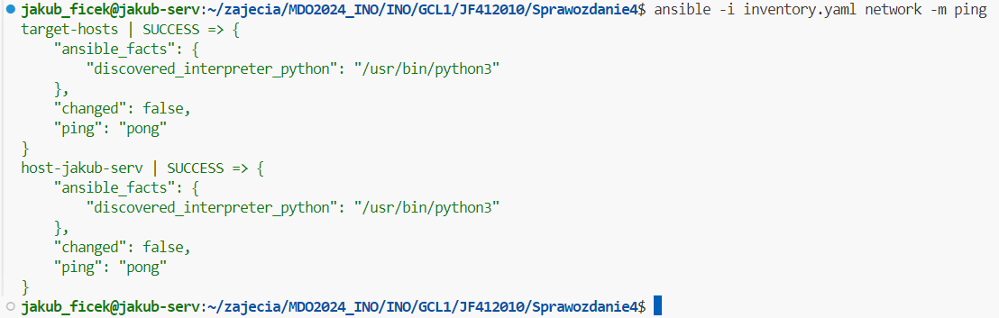

Możemy także wykonać sprawdzenia łącza do samych punktów docelowych poprzez:

    ansible -i inventory.yaml Endpoints -m ping

Co daje:

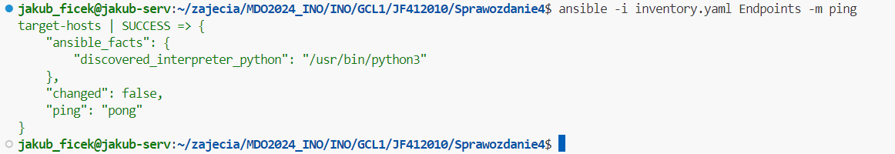
  
### Zdalne wywoływanie procedur

Wszystkie wymienione kroki w tej części wykonam za pomocą jednego playbooka. 

**Playbook** to plan automatyzacji, w formacie *YAML*, który Ansible wykorzystuje do wdrażania i konfigurowania zarządzanych węzłów. 

Plik na którym będę pracować to *playbook.yaml*. Umieszcze w nim odpowiednie zadania pasujące do tych wymienionych w instrukcji. 

Zacząłem od żądania do wszystkich maszyn. Wygląda to następująco:

    - name: Żądanie ping do wszystkich maszyn
    hosts: network
    tasks:
    - name: Ping all
        ansible.builtin.ping:

Określam hosty jako całą sieć i używam wtyczki **ansible.builtin.ping**.

Następnie przeszedłem do dwóch operacji kopiowania wykonane poprzez **copy** z określeniem ścieżki do pliku i ścieżki docelowej kopiowanego inwentarza. Operacja została wykonana dwukrotnie, a różnica zostanie omówiona po uruchomieniu całego playbooka.

    - name: Skopiowanie pliku inwentaryzacji na maszynę Endpoints
      copy:
        src: ~/zajecia/MDO2024_INO/INO/GCL1/JF412010/Sprawozdanie4/inventory.yaml
        dest: ~/inventory/inventory.yaml

    - name: Ponowienie operacji skopiowania
      copy:
        src: ~/zajecia/MDO2024_INO/INO/GCL1/JF412010/Sprawozdanie4/inventory.yaml
        dest: ~/inventory/inventory.yaml

Aktualizacja pakietów wykonan zostanie za pomocą wtyczki **ansible.builtin.apt**. Musimy w niej określić co chcemy zrobić, pobrać, zaaktualizować, usunąc, zatem określiłem nazwę jako **'*'**, dzięki temu aktualizuje wszystkie pakiety, a stan jako **latest**, co oznacza, że aktualizuje pakiety do najnowszych.

    - name: Aktualizowanie pakietów
      become: true
      ansible.builtin.apt:
        name: "*"
        state: latest
    
W tym miejscu uwzględniona zostaje także opcja z parametru *become*. Pozwoli ona na przyznanie uprawnień administratora (sudo). Hasło będę podawać poprzez dodanie flagi **--ask-become-pass** do komendy uruchamiającej mój playbook.

Kolejny krok to zrestartowanie usług `sshd` i `rngd`. Tutaj problemem na mojej maszynie okazało się, że usługa rngd nie nazywa się tak u mnie nawet po pobraniu odpowiednich paczek. W związku z tym restartować będą ją pod inną nazwą, czyli `rng-tools`. 

W obu przypadkach używam **ansible.builtin.service** z nazwą i stanem jaki chcemy uzyskać, czyli `restarted`. Należy pamiętać o uprawnieniach administratora!

    - name: Restart usługi sshd
      become: true 
      ansible.builtin.service:
        name: sshd
        state: restarted

    - name: Restart usługi rng-tools
      become: true
      ansible.builtin.service:
        name: rng-tools
        state: restarted

Następnie przeszedłem do uruchomienia za pomocą komendy:

    ansible-playbook -i inventory.yaml --ask-become-pass playbook.yaml

Cały plik playbooka:

    - name: Żądanie ping do wszystkich maszyn
    hosts: network
    tasks:
    - name: Ping all
        ansible.builtin.ping:

    - name: Zadania dotyczące hostów w Endpoints
    hosts: Endpoints
    tasks:
        - name: Skopiowanie pliku inwentaryzacji na maszynę Endpoints
        copy:
            src: ~/zajecia/MDO2024_INO/INO/GCL1/JF412010/Sprawozdanie4/inventory.yaml
            dest: ~/inventory/inventory.yaml

        - name: Ponowienie operacji skopiowania
        copy:
            src: ~/zajecia/MDO2024_INO/INO/GCL1/JF412010/Sprawozdanie4/inventory.yaml
            dest: ~/inventory/inventory.yaml

        - name: Aktualizowanie pakietów
        become: true
        ansible.builtin.apt:
            name: "*"
            state: latest

        - name: Restart usługi sshd
        become: true
        ansible.builtin.service:
            name: sshd
            state: restarted

        - name: Restart usługi rng-tools
        become: true
        ansible.builtin.service:
            name: rng-tools
            state: restarted 

Wynik prezentuje się następująco:

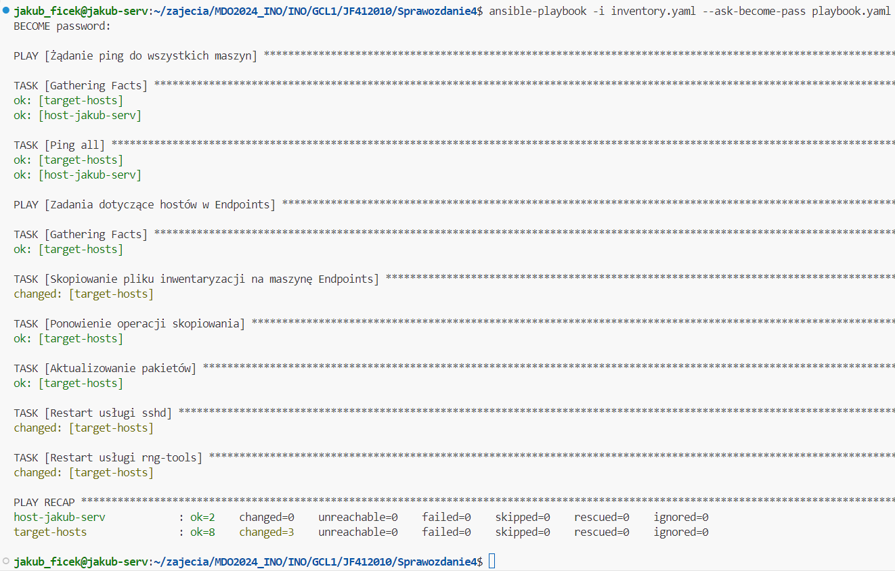

Różnica pomiędzy pierwszym kopiowaniem pliku a drugim, polega na tym, że pierwszy raz zwraca nam status **CHANGED**, a drugi **OK**. Oznacza to, że za pierwszym razem dokonaliśmy zmian (skopiowaliśmy plik), za drugim nie było takiej potrzeby, bo plik był juz na miejscu, dostaliśmy więc odpowiedni status.

Przeprowadzenie operacje względem maszyny z wyłączonym serwerem SSH: 

Wyłączenie ssh wykonałem następująco na maszynie docelowej:

    sudo systemctl stop ssh

Wykonanie playbooka:

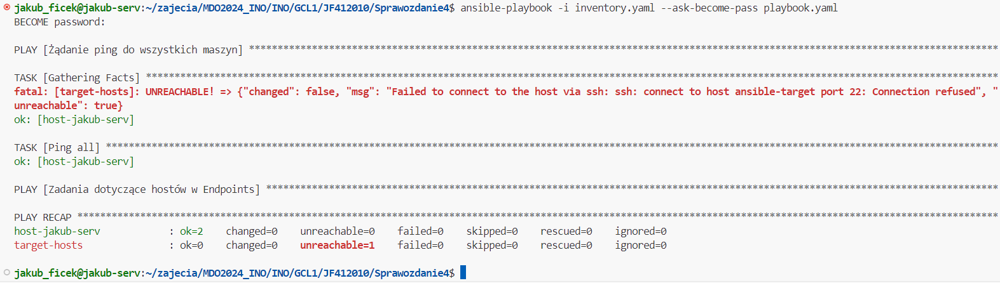

Nie udało się połączyć z maszyną. Następnie uruchomie ponownie ssh.

Przeprowadzenie operacje względem maszyny z odpiętą kartą sieciową:

Kartę odpiąłem w ustawieniach sieci VM. Konkretnie w Sieć -> Zaawansowane -> [ ] Kabel podłączony.

Wynik uruchomienia to:

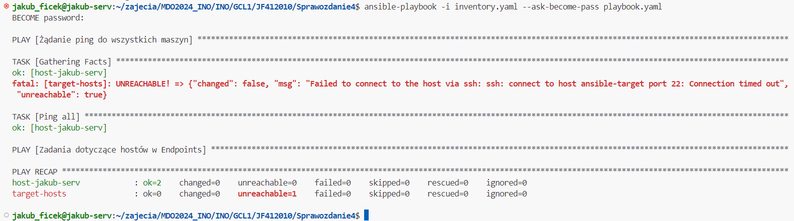

W pierwszym przypadku (bez SSH) połączenie zostało odrzucone, w przypadku braku karty sieciowej dostaliśmy natomiast timed out.
  
### Zarządzanie kontenerem

Na cele tego zadania zostanie stworzony nowy plik Dockerfile do deployu. Wynika to z tego, że w poprzednim zadania proces Deployu był parametryzowany oraz o wiele bardziej skomplikowany niż powinien, tzn. używaliśmy lokalnego repozytorium, pobieraliśmy pliki .npmrc z odpowiednich folderów itd. Nie ma też opublikowanych obrazów na *dockerhubie*, ponieważ korzystałem z *npm*. Sama paczka została opublikowana, co oznacza, że do uruchomienia projektu (przeprowadzenia testów, to jedyne co robi) potrzebne jest sklonowanie plików głownych i pobranie paczki z repozytorium npm. Nie potrzeba jednak projektu budować. Publikowanie do lokalnego repozytorium także nie jest kluczowe, gdyż nie będziemy powielać w tym zadaniu publisha, a jedynie same uruchomienie. 

Problemem okazałoby się także uruchomienie pierwszego kontenera z poprzednich zajęć, bo wymagał on podłączenie do kontenera ze zbudowaną aplikacją.

Nowy plik Deploy:

    FROM node:20

    RUN git clone https://github.com/JakubFicek/node-js-tests-sample.git
    WORKDIR /node-js-tests-sample

    # FROM NPM REPOSITORY
    RUN npm install node-game-unit-tests

    # URUCHOMIENIE APLIKACJI
    RUN npm test

Uruchomienie aplikacji przebiega jako uruchomienie testów każdorazowo przy uruchamianiu kontenera. Po tym uproszczeniu przechodzimy do stworzenia playbooku. 

Zaczynamy od pobrania dockera na maszynę docelową jeżeli go nie ma. 

    - name: Pobieranie dockera
      become: true
      ansible.builtin.apt:
        name: docker.io
        state: latest
  
    - name: Umożliewienie jego dzialania bez reboota
      become: true
      command: systemctl enable --now docker

Następnie przechodzimy do skopiowania obrazu do deployu, gdyż nie był on opublikowywany w żadnym repozytorium. Dodatkowo wykonujemy budowanie obrazu poprzez paczkę **docker_image**, a uruchomienie poprzez **docker_container**. Po uruchomieniu uruchomią się testy, czyli to co robi ta aplikacja. 

    - name: Pobieranie obrazu do zbudowania/do deployu programu
      copy:
        src: ~/zajecia/MDO2024_INO/INO/GCL1/JF412010/Sprawozdanie4/DEPLOY.Dockerfile
        dest: ~/node_app/Dockerfile

    - name: Budowanie obrazu.
      become: true
      community.docker.docker_image:
        name: deploy
        build:
          path: /home/ansible/node_app/
        source: build

    - name: Run container - and application in this
      become: true
      community.docker.docker_container:
        name: node_app
        image: deploy

Używane tutaj parametry same mówią za siebie. Ścieżka w docker_image prowadzi nas do miejsca gdzie znajduje się Dockerfile.

Komenda uruchamiająca playbook:

ansible-playbook -i inventory.yaml --ask-become-pass container-playbook.yaml

Wykonanie:

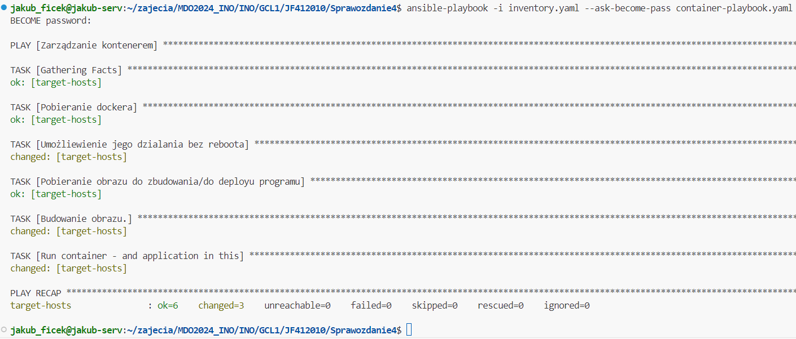

Zdjęcie potwierdzające zbudowanie obrazu i uruchomienie konteneru wraz z aplikacją:

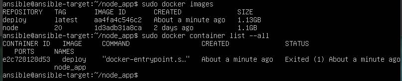

Aplikacja uruchamia się i kończy swoje działanie. Oznacza to, że nie trzeba zatrzymywać konteneru, jednak i tak wykonywane jest to w jednym zadaniu playbooka:

    - name: Remove container
      become: true
      community.docker.docker_container:
        name: node_app
        state: absent

Wynik:

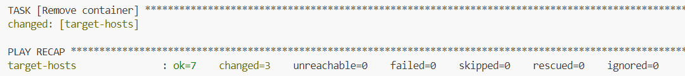
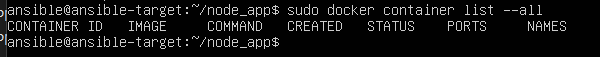

Warto zaznaczyć, że komendy z dockerem potrzebują uprawnień administratora.

Ostatni krok to ubranie powyższego playbooka w rolę ze szkieletowaniem `ansible-galaxy`. Pomaga to przy większych projektach utrzymać czystość oraz lepiej organizować procesy.

Zacząłem od stworzenia folderu:

    mkdir -p ./ansible/roles

Będę tworzyć w nim swoje role. Poprzedni playbook podziele na dwie części, **prepare** i **container_handling**. Stworzę więc dwie role:

    ansible-galaxy init prepare
    ansible-galaxy init container_handling

Pomijam dodawanie wiadomości, czy informacji związanymi z rolami, ponieważ projekt jest na tyle mały, że nie potrzuje tego. 

Przenoszę do odpowiednich folderów roli swoje zadania. Mowa tu o folderze tasks. Zmiany są w pliku **main.yml**.

Dla roli **prepare** będą to:

    - name: Pobieranie dockera
      become: true
      ansible.builtin.apt:
        name: docker.io
        state: latest
    
    - name: Umożliewienie jego dzialania bez reboota
      become: true
      command: systemctl enable --now docker

    - name: Pobieranie obrazu do zbudowania/do deployu programu
      copy:
        src: ~/zajecia/MDO2024_INO/INO/GCL1/JF412010/Sprawozdanie4/DEPLOY.Dockerfile
        dest: ~/node_app/Dockerfile

Dla roli **container_handling**:

    - name: Budowanie obrazu.
      become: true
      community.docker.docker_image:
        name: deploy
        build:
        path: /home/ansible/node_app/
        source: build

    - name: Run container - and application in this
      become: true
      community.docker.docker_container:
        name: node_app
        image: deploy

    - name: Remove container
      become: true
      community.docker.docker_container:
        name: node_app
        state: absent

Stworzony zostanie nowy playbook, który uwzględni te dwie role. W folderze **ansible**. Jego treść to:

    - name: Run node_app with roles
    hosts: Endpoints
    roles:
    - prepare
    - container_handling
  
Jego uruchomienie to:

    ansible-playbook -i inventory.yaml --ask-become-pass ./ansible/playbook.yaml

Jego wynik wygląda tak samo jak wcześniej:

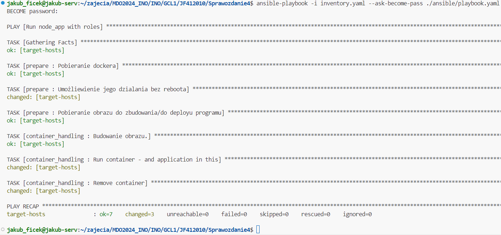

Struktura roli ukazana będzie w folderze *ansible/roles*. Także przesłana do repozytorium.

## Wykonane kroki z zajęć 9:

### Nienadzorowana instalacja.

Głównym celem tych zajęc było przygotowanie źródła instalacyjnego systemu dla maszyny wirtualnej. 

Dzięki temu mamy uzyskać nienadzorowaną instalację systemu (wybranego przezemnie) fedora 40. Dodatkowo system ten po zainstalowaniu ma hostować wybraną przez nas na wcześjeszych zajęciach aplikację.

Zacząłem od zainstalowania systemu Fedora. Pierwsza instalacja przebiega w sposób nadzorowany. Naszym zadaniem jest ustalenie wszystkich potrzebnych parametrów do takiej instalacji. To znaczy, ustalamy nazwę użytkownika, nazwę hosta, wybieramy minimalną wersję fedory, ale także potrzebne składniki przy instalacji, takie jak menadżer kontenerów. 

Po poprawnym procesie instalacji powstanie plik o nazwie **anaconda-ks.cfg**, który będzie naszą bazą do źródła instalacyjnego systemu.

Pobieramy ten plik z fedory i przenosimy do naszego repozytorium.

Zacząłem od przekopiowania go z lokalizacji **/root/**:

    sudo cp /root/anaconda-ks.cfg /home/ignite/anaconda-ks.cfg

Następnie skorzystam z wyspisania tego pliku i przekopiowałem to ręcznie, gdyż tak było najszbyciej. Bez przypisywania nowego adresu IP, łączenia się poprzez ssh itd.

Plik ten odrazu trzeba zmodyfikować, gdyż brakuje w nik kluczowych składników, aby instalacja przebiegła niezależnie.

Jako, że korzystałem z domyślnych repozytorium to brakuje w pliku wzmianek na ten temat. Dodaje to następująco:

    url --mirrorlist="http://mirrors.fedoraproject.org/mirrorlist?repo=fedora-40&arch=x86_64"
    repo --name=updates-released --mirrorlist=http://mirrors.fedoraproject.org/mirrorlist?repo=updates-released-f40&arch=x86_64

Następnie kluczowe będzie wyczyszczenie wszystkich partycji poprzez:

    clearpart --all

Hostname nadałem już przy pierwszej instalacji na:

    ignite-TEMPLATE

Jednak w pliku konfiguracyjnym brakuje jeszcze ponownego uruchomienia systemu, czyli:

    reboot

W tym momencie plik jest gotowy do uruchomienia instalacji nienadzorowanej. Potrzebne jednak będzie jego umieszczenie na hoście, do którego odwoła się instalator, w moim przypadku github, repozytorium przedmiotu poprzez opcje *raw*. Dzięki temu możliwe jest pobranie pliku z **wget**, a nie całej strony.

W VirtualBoxie tego pliku użyje po uruchomieniu maszyny, wraz z początkiem instalacji. Po uruchomieniu pierwszych opcji opcji wybieram opcję **e**, która otwiera tryb GRUB, gdzie mogę podać link do swojego pliku odpowiednio poprzez:

    inst.ks=https://raw.githubusercontent.com/InzynieriaOprogramowaniaAGH/MDO2024_INO/JF412010/INO/GCL1/JF412010/Sprawozdanie4/anaconda-ks.cfg

Co wygląda następująco:

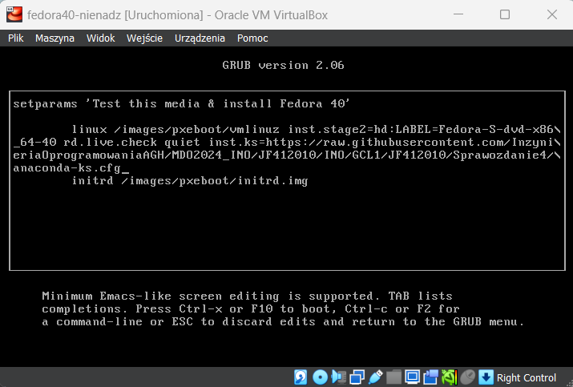

Po uruchomieniu dostajemy pierwsze informacje odnośnie naszej konfiguracji, języka itp. Następnie jest pobieranie plików, a po skończeniu ponowne uruchomienie i otworzenie gotowego systemu.

Odczytywanie pliku konfiguracyjnego, potwierdzone jest na początku instalacji:

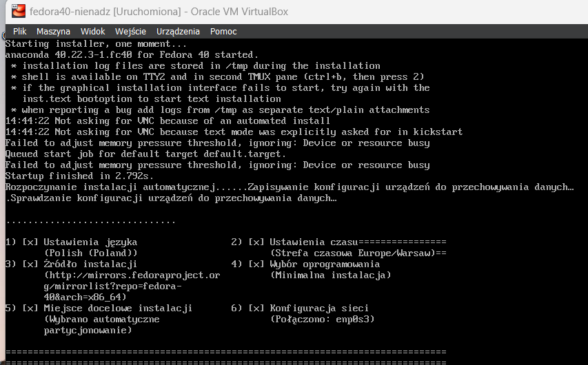

Pobieranie plików:

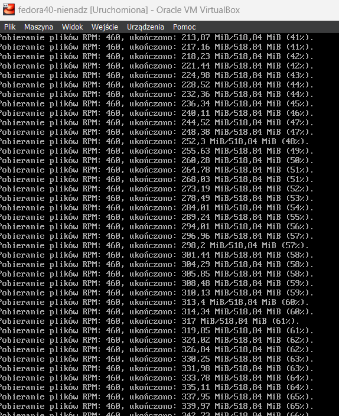

System uruchomił się:

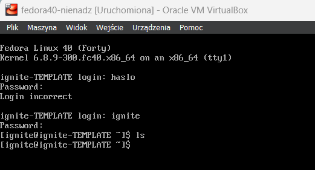

Po tych krokach przejdę do drugiej części tych zajęć.

### Rozszerzenie pliku o odpowiednie repozotyria i oprogramowanie.

W tej części będę starał się uruchomić swój program odrazu po zainstalowaniu systemu. Jego główne działanie to wykonywanie testów. Opublikowana paczka do tego projektu znajduje się w repozytorium npm. Moim pomysłem na to uruchomienie będzie dołączenie takich zależności jak node i pobranie repozytorium tego projektu. Następnie w nim wykonanie pull opublikowanej paczki i uruchomienie programu. Jest to inne podejście niż dotychczas, ale jeżeli chodzi o aplikacje na nodzie wydaje się sensowne. 

Chcę to wykonać poprzez dołączenie skryptu, który wykona się w sekcji **%post**. Skrypt ten odpowie za pobranie odpowiednich plików oraz następnie wejściu do repozytorium i pobraniu opublikowanej paczki. Następuje także testowanie, czyli uruchomienie. Wszystkie logi zapiszę w pliku, co pozwoli mi potwierdzić wykonanie.

Treść skryptu:

    #!/bin/bash

    git clone https://github.com/JakubFicek/node-js-tests-sample.git /home/ignite/node-js-tests-sample

    cd /home/ignite/node-js-tests-sample

    npm install node-game-unit-tests

    npm test

Jest to prosty srypt, który pobiore za pomocą **wget** z repozytorium. Odpowiada za przygotowanie plików potrzebnych do uruchomienia programu oraz za sam program. Pobieram gotową paczkę z repozytorium npm.

Dane zapisane będą na koncie użytkownika.

Co do zmienioncyh sekcji pliku konfiguracyjnego wygląda to następująco:

    %packages
    @^minimal-environment
    @container-management
    nodejs
    git

    %end

Dodanie kluczowych paczek takich jak nodejs i git. Następnie:

    %packages
    @core
    wget
    %end

    %post --erroronfail --log=/root/post-logs.log

    wget -O /tmp/configure.sh https://raw.githubusercontent.com/InzynieriaOprogramowaniaAGH/MDO2024_INO/JF412010/INO/GCL1/JF412010/Sprawozdanie4/script.sh
    chmod +x /tmp/configure.sh
    /tmp/configure.sh

    %end

Osobno przed samym skryptem dodana zostaje paczka **wget**, ponieważ wyczytałem, że wtedy mogę jej użyć, jednak nie sprawdzałem czy po dodanie wcześniej zadziała.

Następnie zapisuje skrypy w plikach tymczasowych i uruchamiam go. On robi już resztę. Co do weryfikacji uruchomienia zrobię to wchodząc w logi zapisane w root. Końcowy wynik pokazuje, że testy się uruchomiły, co oznacza, że program zadziałał.
Znajduje się on także u użytkowika i da się go uruchomić:

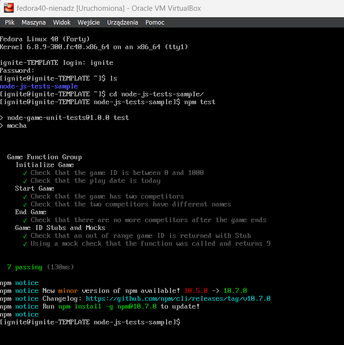

Udowodnienie uruchomienia podczas części post pliku kickstart:

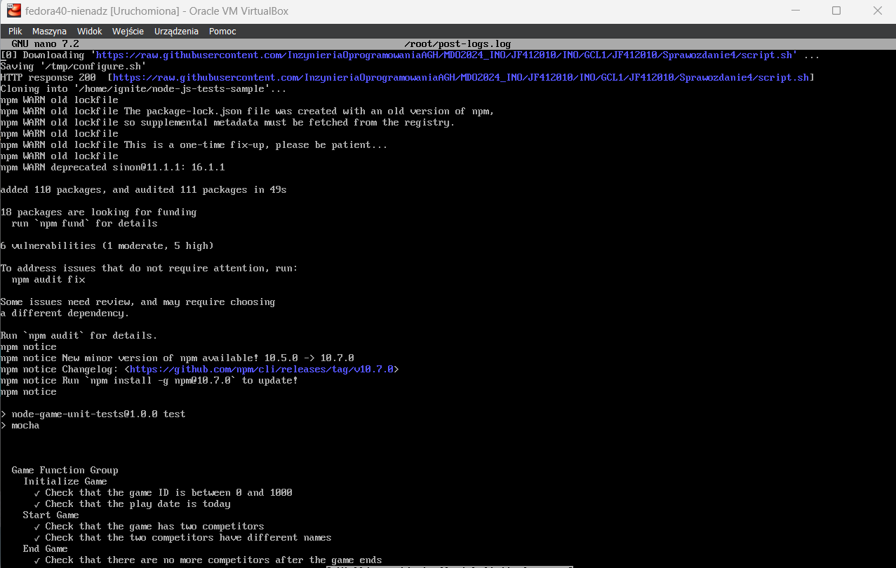
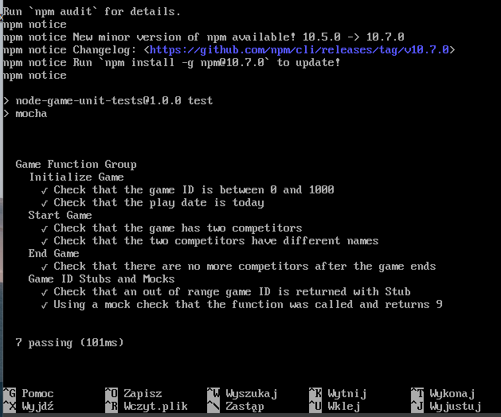

Podsumowując, program nie musi działać w kontenerze, dlatego nie został on stworzony. Paczka potrzebna do jego uruchomienia jest już wysłana do globalnego repozytorium, co uproszcza jego uruchomienie. Problem z próbami uruchomienia tego w kontenerze wiązałby się z dostępem do potrzebnych obrazów. W związku ze specyficznym programem obrałem więc to podejście.