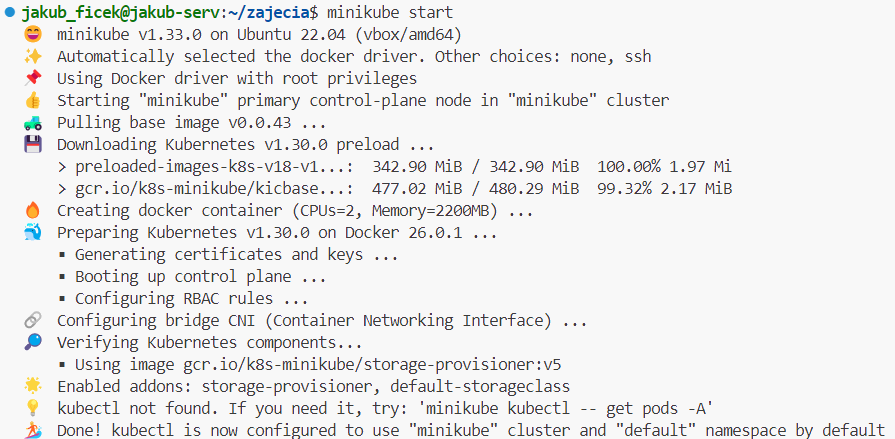
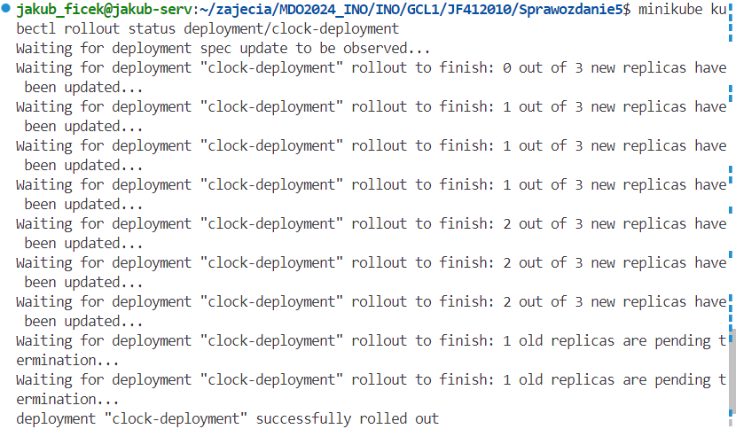
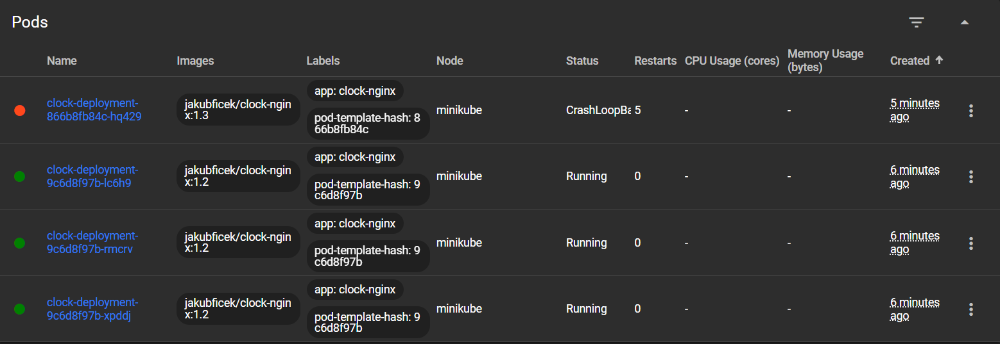

# Sprawozdanie 4
Wykonał: Jakub Ficek, IO.

## Cel projektu

Zaznajomienie się z wdrażaniem na zarządzalne kontenery poprzez Kubernetes.

## Streszczenie projektu 

Pojekt zacząłem od instalacji klastra Kubernetes, jego dostosowaniu oraz sprawdzeniu działania. Następnie wykonałem kofniguracje nowego obrazu do deployu i stworzyłem nową aplikację, którą będę wdrażać. Wdrożyłem tą aplikację za pomocą komend i wyprowadziłem port, sprawdzając poprawne działanie aplikacji.

Przekonwertowałem wdrożenie ręczne na deklaratywne, przygotowałem nowe wersje swojej aplikacji (w tym jedna z błędem), zmieniałem swój plik deployment, stworzyłem skrypt kontrolujący czas wdrożenia oraz przetestowałem service i różnce strategie wdrażania. 

## Wykonane kroki z zajęć 10:
### Instalacja klastra Kubernetes

#### 1. Zaopatrzenie się w implementację stosu k8s oraz instalacja.

Korzystając z załączonej [instrukcji](https://minikube.sigs.k8s.io/docs/start/) przeszedłem do strony, która określa jak pobrać minkube. Po sprawdzeniu wszystkich potrzebnych parametrów przeszedłem do pobierania. 

Wybrany wariant to Linux w architekturze x86-64, a tym instalatora to paczka debian, ze względu na system, który używam, czyli ubuntu.

Pobrałem paczkę poprzez: 

    curl -LO https://storage.googleapis.com/minikube/releases/latest/minikube_latest_amd64.deb

Następnie zainstalowałem ją:

    sudo dpkg -i minikube_latest_amd64.deb


#### 2. Zaopatrzenie się w polecenie `kubectl` w wariancie minikube oraz alias.

Polecenie `kubectl` wprowadzone zostało, aby użytkownik byłw stanie sprawdzić status swoich zasobów, czyli podów, deploymentów i usług. Dzięki temu jesteśmy w stanie rozwiązać dane problemy lub je zauwazyć.

Pobranie `kubectl` wykonałem poprzez:

    minikube kubectl -- get po -A

Aby uprościć sobie dalszą pracę wprowadziłem także alias:

    alias kubectl="minikube kubectl --"


#### 3. Uruchomienie Kubernetes:

Mogłem przejść do uruchomienia minikube za pomocą:

    minikube start

Co zweryfikowało wszystkie potrzebne parametry wirutalnej maszyny. W przypadku niespełnienia minimalnych wymagać Kubernetes nie uruchomiłby się:



Minimalne wymogi to 2GB ramu, 20GB wolnej pamięci oraz przynajmniej dwa rdzenie procesora, co w moim przypadku zostało zapewnione na początku tworzenia wirtualnej maszyny. Nie musiałem więc dokonywać żadnych zmian.

Poprawne uruchomienie potwierdza działający kontener:


#### 4. Uruchomienie Dashboardu oraz zapoznanie się z koncepcjami funkcji wprowadzonych przez Kubernetesa.
 
Dashboard uruchomiłem poprzez jedną komendę:

    minikube dashboard

Zrobiłem to jednak w Visual Studio Code, który ma automatyczne wbudowane przekierowanie portów, co znacznie ułatwi dalsze zadanie. 


Przeglądarka nie otwarła się automatycznie, gdyż kiedyś zablokowałem gdzieś tą opcję, jednak wystarczyło skopiować, bądź otworzyć link wyświetlony w terminalu.

Otwarty dashboard:


Wyświetlam w nim dodatkowo wszystkie Pod'y na których działa Kubernetes. W przypadku gdy używamy deploymentu naprzykład z pliku, widoczny będzie on w zakładce Deployment, a stworzone przez niego Pod'y (w zadanej ilości) uruchomione zostaną w zakładce Pods.

Zaznaczyć także warto, że poprawne wyłączenie kubernetesa działa komendą:

    minikube stop

Dzięki temu uruchomienie wykonane może zostać tak jak poprzednio, bez błędów.

### Analiza posiadanego kontenera
 
#### 1. Weryfikacja wybranego projektu z wcześniejszych zajęć.

Wcześniejszy wybrany projekt na którym działałem dotyczył aplikacji, której działanie polegało na uruchomieniu testów. Nie robiła ona nic więcej, w związku z tym kluczowę na tym etapie będzie zamienienie jej na coś działającego na kontenerze, ciągle. 

Konieczne będzie stworzenie obrazu budującego nową aplikację oraz jego deploy w postaci konteneru.

#### 2. Wybrana nowa aplikacja i jej dostosowanie.

Moją nową aplikacją będzie zegar wyświetlany na obrazie bazującym na nginx. Jest to bardzo prosta aplikacja, którą tworzy się poprzez dodanie konfiguracji do obrazu nginx. Zmieniamy wygląd strony głównej poprzez prosty plik html z uwzględnionym skryptem wypisującym godzinę.

Na potrzeby tych laboratoriów wybrałem opcję optimum, która wiąże się jedynie z przygotowaniem obrazu, bez tworzenia całego pipeline'u. Zrobię wszystkie potrzebne części manualnie i opiszę je w tej części.

Mój proces działania będzie wyglądać następująco. 
 * Zacznę od zbudowania swojej aplikacji za pomocą stworzonego pliku Dockerfile. 
 * Pomijam testy aplikacji, ponieważ nie posiada żadnych. Sam test może opierać się na sprawdzeniu czy działa i czy wpisuje aktualną godzinę na stronie.
 * Następnie wykonuje publish na DockerHub, po wcześniejszym otagowaniu oraz zalogowaniu.
 * Ostatni etap to proces deploy z globalnego rejestru kontenerów.

Plik dockerfile od którego zacznę ma następującą postać:

    FROM nginx:1.26

    COPY ./index.html /usr/share/nginx/html/index.html

Bazuje on na obrazie **nginx** w wersji 1.26, czyli jednej z ostatnich, ale zawierającej wszystko to czego potrzebuje do działania swojej aplikacji.

Własną konfigurację oraz samą aplikację wprwoadzam poprzez skopiowanie pliku konfiguracyjnego, który jest plikem **index.html**. Określa on co dzieje się na widocznej przez nas stronie. Kopiuje go do odpowiedniego folderu, gdzie zostanie podmnieniony z automatycznie wygenerowanym plikiem powitania nginx.

Zbudowanie obrazu wykonałem następująco:

    docker build -t clock-nginx .


Następnie loguje się na konto DockerHub poprzez:

    docker login

Zdałem także odpowiedni tag swojego kontenera:

    docker tag clock-nginx jakubficek/clock-nginx:1.0

Na końcu opublikowałem go:

    docker push jakubficek/clock-nginx:1.0

Mogę go teraz znaleźć na swoim profilu:


Pozostaje teraz sprawdzić kork deploy, czyli uruchomienie kontenera i sprawdzenia poprawnego działania aplikacji (oraz ciągłego działania). Będę uruchamiać kontener odpowiednio z rejestru. Należy także pamiętać o uruchomieniu w trybie *detached*, aby pozostawić wolny terminal i o przekierowaniu portów, aby móc oglądać działającą aplikację w przeglądarce.

Odpowiednia komenda:

    docker run -d --rm -p 80:80 --name clock-nginx jakubficek/clock-nginx:1.0

Wynik działającego kontenera:


Wynik działającej aplikacji:


Jak widać aplikacja działa, wypisuję godzinę oraz skonfigurowane powitanie. Działa ona także jako kontener co powoduje, że spełnia wszystkie wymagania potrzebne do wykonania dalszych instrukcji z tych zajęć.

### Uruchamianie oprogramowania

#### 1. Uruchomienie konteneru na stosie:

Kontener zostanie uruchomiony na stosie k8s za pomocą komendy:
    
    minikube kubectl run -- <nazwa-wdrożenia> --image=<obraz-docker> --port=<wyprowadzany port> --labels app=<nazwa-wdrożenia>

Pozostaje dostosować do niego wszystkie parametry takie jak nazwa wdrożenia, obraz docker z DockerHub i port.

Z wcześniejszego opisu mojego deployu wyciągniemy wszystkie te informację, zatem komenda, której użyłem to:

    minikube kubectl run -- clock-nginx --image=jakubficek/clock-nginx:1.0 --port=80 --labels app=clock-nginx

Kontener uruchomiony w minikubie zostanie automatycznie ubrany w pod. Możemy zauważyć to w uruchomionym minikube dashboard:


Działające pody można także wypisać za pomocą `kubectl`, w moim przypadku zadałem alias, więc będzie to `minikube kubectl --`.  Można użyć:

    minikube kubectl -- expose pod clock-nginx

co zwraca działającą usługę oraz:

    minikube kubectl get pods

wypisujące wszytkie działające pody:


#### 2. Wyprowadzenie portu w celu dotarcia do eksponowanej funkcjonalności (aplikacji).

Zrobiłem to za pomocą komendy:

    kubectl port-forward pod/clock-nginx 8080:80

Co dało mi:


Dodatkowo musiałem przekierować porst z wirtualnej maszyny za pomocą VSCode:


Moja aplikacja działa więc pod adresem: https://localhost:8081. Co po sprawdzeniu pozwala wyświetlić zegar:


Co do komunikacji, widać wcześniej jak po komndzie port-forward oraz po komunikowaniu się z portem dokonywana jest łączność. 

## Wykonane kroki z zajęć 11.

### Konwersja wdrożenia ręcznego na wdrożenie deklaratywne YAML

#### 1. Stworzenie pliku yaml.

Konwersje wdrożenia ręcznego na deklaratywne wykonuje się za pomocą pliku YAML. Określamy rodzaj tego pliku, nazwę naszego deploymentu, w moim przypadku **clock-deployment**, bo moja aplikacja działa jako zegar w nginx, nazwę samej aplikacji, ilość replik, strategię i obraz z którego będziemy korzystać (jakubficek/clock-nginx:1.0).

Plik był wzorowany na tym z przykłady dostarczonego w dokumentacji Kubernetesa. Jego treść to:

    apiVersion: apps/v1
    kind: Deployment
    metadata:
      name: clock-deployment
      labels:
        app: clock-nginx
    spec:
      replicas: 4
    # strategy: 
    #   type: Recreate
      selector:
        matchLabels:
        app: clock-nginx
      template:
        metadata:
          labels:
            app: clock-nginx
        spec:
          containers:
        - name: clock-nginx
            image: jakubficek/clock-nginx:1.0
            ports:
            - containerPort: 80

Obraz miał posiadać 4 repliki po wdrożeniu. Zadaje to w miejscu:

    spec:
      replicas: 4


#### 2. Wdrożenie i zbadanie stanu:

Wdrożenie rozpoczynamy od zaaplikowania nowo stworzonego pliku do *kubectl*. Powoduje to także uruchomienie. Robimy to komendą:

    minikube kubectl -- apply -f ./clock-deployment.yaml

Należy pamiętać o określonym wcześniej aliasie!

Następnie używamy komendy, która pobierze deploymenty:

    minikube kubectl get deployments

Jego status można sprawdzać na dashboardzie, ale także za pomocą:

    minikube kubectl rollout status

Co daje nam:


W Dashboardzie, wygląda to następująco:


### Przygotowanie nowego obrazu

#### Zarejestrowanie nowych wersji obrazu `Deploy` w DockerHub.

Nowe wersje mojego programu wprowadzone zostają poprzez modyfikacje pliku konfiguracyjnego z nginx, czyli strony startowej. Wraz z nowymi wersjami (trzema wprowadzonymi, w tym jedna z błędem) dodany został paragram informujący nas o wersji, dzięki któremu możemy rozróżnic w jakiejs wersji działa zegar. 

Znajduje się to w tym miejscu pliku:


Dalej zdecydowałem się na szybkie, ręczne zbudowanie i publikowanie nowych wersji. Po wykonaniu każdej zmiany wykonywałem build obrazu:

    docker build -t clock-nginx .

Następnie tagowałem nowy obraz:

    docker tag clock-nginx jakubficek/clock-nginx:1.1

i publikowałem:

    docker push jakubficek/clock-nginx:1.1

Zmiany wyglądają następująco:


Można zweryfikować pojawienie się nowego paragramu z wcześniejszymi zrzutami ekranu, pokazującymi działania aplikacji (zajęcia 10).

#### Wersja z błędem.

Wersja z błędem została wprowadzona poprzez dopisanie do Dockerfile odpowiedniej komendy używanej w konsoli. Jest to
`false`, wywoływana poprzez **CMD** w pliku. Jego nowy wygląd to:

    FROM nginx:latest

    COPY ./index.html /usr/share/nginx/html/index.html

    CMD ["false"]

W przypadku tego obrazu i tej wersji, kontener nie uruchomi się. Od razu wykonałem to jako sprawdzenie deploymentu do kubernetesa:


Dostajemy błąd, a kubernetes próbuje restartować poda i uruchamiać jeszcze raz. Status się zmienia, ale możemy zauważyć także **Error**:


#### Potwierdzenie z DockerHub

Po wprowadzeniu wszystkich wersji możemy znaleźć je na dockerhub'ie pod Tagami obrazu:


### Zmiany w deploymencie

Ta część polega na aktualizacji pliku YAML z wdrożeniem i przeprowadzaniu go ponownie dla nowych przypadków.

#### 1. Zwiększenie replik do 10:

Wersja zostaje ta sama, natomiast zwiększana jest ilość replik poprzez:

    spec:
      replicas: 10

Następnie stosowane jest `kubectl apply` i `kubectl get deployments`. Daje nam to powiększenie działających podów z 4 na 10.

Status pokazał kroki jakie wykonywał kubernetes:


W Dashboardzie natomiast jest to widoczne następująco:


#### 2. Zmniejszenie replik do 1:

Krok ten wykonany został tak samo jak poprzedni ze zmianą z 10 na 1. 

Status zwraca jedynie, że deployment został wykonany poprawnie (najprawdopodobniej ze względu na szybkość wykonania się zmniejszenia ilości replik).

Natomiast Dashboard pokazuje:


#### 3. Zmniejszenie replik do 0:

Krok ten wykonany został tak samo jak poprzedni ze zmianą z 1 na 0.

W Dashboardzie dostajemy:


Zastosowanie zerowej ilości replik ma sens w przypadku testów naszego pliku jak i w przypadku, kiedy czekamy tylko na 'zielone światło', aby wdrożyć aplikację. Dzięku temu możemy ją bardzo szybko postawić i mieć wszystko przygotowane w przypadku decyzji o uruchomieniu/wdrożeniu.

#### 4. Zastosowanie nowej wersji obrazu:

W tej części stworzę **3** repliki swojego konteneru. Zrobię je w wersji 1.0, aby następnie dokonać aktualizacji na już działających podach.

Zastosowana strategia pozostanie domyślna, czyli **RollingUpdate**. Zamiast jednocześnie aktualizować wszystkie pody aplikacji, RollingUpdate wymienia je jeden po drugim. Dzięki temu aplikacja pozostaje dostępna podczas całego procesu aktualizacji. Wprowadza ona także nowy pod, aby nie zmniejszać możliwości i wydajności aplikacji.

Wersję zmieniam pobierając nowy obraz:

    containers:
    - name: clock-nginx
      image: jakubficek/clock-nginx:1.1
      ports:
      - containerPort: 80

Po uruchomieniu wdrożenia dostaje więc:


Wynik w dashboardzie wygląda natomiast następująco:


#### 5. Zastosowanie starszej wersji obrazy:

Następnie wykonam w ten sam sposób zmiane wersji na 1.0, poprzez pobranie odpowiedniego obrazu.

Status:


Dashobard:


   
#### 6. Przywrócenie poprzedniej wersji: 
 * ```kubectl rollout history```

Komenda:

    minikube kubectl rollout history deployment/clock-deployment

zwraca historie wszystkich rewizji (REVISION), czyli zmian deploymentu. Można także dodać powód zmiany. 


Na tej podstawie możemy teraz wybrać rewizję do której chcemy wrócić i cofnąc się do tej takiej wersji. 

Wykonujemy to jednak za pomocą drugiej komendy.

 * ```kubectl rollout undo```

Możemy cofnąć się o jedną wersję wstecz podajać jedynie:

    minikube kubectl rollout undo deployment/clock-deployment

Bądź do konkretnej wersji wcześniej poprzez:

    minikube kubectl rollout undo deployment/clock-deployment --to-revision=11

Ja użyłem tej drugiej komendy. 

Wynik działania to cofnięcie podów do wersji 1.1, natomiast status zwrócił:




### Kontrola wdrożenia

W tym celu stworzyłem skrypt, który sprawdza, czy w 60s wykona się wdrożenie. Dodatkowo skrypt ten przypisuje plik yaml oraz uruchamia wdrożenie. Następnie zwraca on odpowiedni wynik.

Jego treść to:

    #!/bin/bash

    DEPLOYMENT_NAME="clock-deployment"
    TIMEOUT=60

    minikube kubectl -- apply -f ./clock-deployment.yaml

    minikube kubectl get deployments 

    if minikube kubectl -- rollout status deployment/$DEPLOYMENT_NAME --timeout=${TIMEOUT}s > /dev/null 2>&1; then
    echo "Deployment successfully rolled out within the time limit."
    exit 0
    else
    echo "Deployment did not complete within the time limit."
    exit 1
    fi

Jego działanie jest dość proste. Pobieramy nazwę deploymentu i czas w sekundach (60). Następnie wykonujemy apply, które uruchamia wdrożenie. Dodatkowo dla siebie pobieram także deployment, aby wypisał się.

Odpowiednio uruchamiany jest wtedy `rollout status`, który ma podaną flagę `--timeout`. Dzięku temu, jeżeli deployment będzie trwać więcej niż 60s to zostanie wyrzucony error (wysyłam go do innego źródła, żeby nie brudził konsoli), a następnie komunikat, że deployment nie wdrożyłsię w określonym czasie.

Update do wersji 1.2 weryfikowany skryptem:
 


Wykorzystałem teraz wersję w błędem, deployment nie dojdzie w niej do skutku bo kontenery nie uruchomią się, przez co będzie trwać dłużej niz 60s, a skrypt zwróci błąd:




Warto zaznaczyć, że po wyłączeniu skryptu, deployment dalej działa i trzeba go cofnąć do poprzedniej wersji poprzez:

    minikube kubectl -- rollout undo deployment/clock-deployment

Dzięku temu wszystko będzie działać poprawnie.

### Strategie wdrożenia

#### Przygotowanie wersji z różnymi strategiami wdrożeń:

Domyślnie używana strategia to RollingUpdate. Została ona wcześniej po krótce opisana. Teraz zastosujemy 3 strategię. Będę one w postaci osobnych plików w folderze strategies.

Strategię określamy w części `spec`, wybierając odpowiedni typ. 

Jako, że określam nowy rodzaj deploymentu dla tej samej aplikacji to oznacza, że aby zauważyć sposób działania strategi, muszę najpierw wdrożyć ją w wersji, którą mogę następnie zaaktualizować. Zacznę więc od wdrożenia wersji 1.1 i będę ją aktualizować do 1.2 starając się zauważyć różnicę pomiędzy strategiami. Działam na 3 replikach.

* Recreate

Plik ma postać:

    apiVersion: apps/v1
    kind: Deployment
    metadata:
      name: clock-deployment-recreate
      labels:
        app: clock-nginx
        version: 1.1
    spec:
      replicas: 3
      strategy: 
        type: Recreate
      selector:
        matchLabels:
        app: clock-nginx
      template:
        metadata:
          labels:
            app: clock-nginx
        spec:
        containers:
          - name: nginx
            image: jakubficek/clock-nginx:1.2
            ports:
            - containerPort: 80

Zmieniła się zatem strategia, dodałem także jeden label z wersją.

Stosuje więc `apply` następnie `get deployment clock-deployment-recreate`. Wcześniej miałem tylko jeden więc mogłem używać ogólnej komendy.

Aby zrozumieć działania będę śledzić zachowanie wdrożenia komendą `status`.

(Mowa tu o komendach z `kubectl rollout`!)

Wynik działania:


Dodatko można zauważyć, że strategia ta usuwa wszystkie działające wcześniej kontenery i tworzy w ich miejsce nowe.

* Rolling Update (z parametrami `maxUnavailable` = 2 , `maxSurge` = 40%)

Strategia ta zapewnie aktualizacje podów stopniowo, jednocześnie usuwając te starsze.

Wprowadzone parametry odpowiadają za:

**maxUnavailable** - określa maksymalną ilość podów, które mogą być niedostępne podczas wdrażania.

**maxSurge** - określa maksymalną liczbę instancji, które mogą być utworzone ponad ich docelową liczbę. Wartość może być liczbą bezwzględną (na przykład 5) lub procentem docelowej liczby podów (na przykład 40%). 

Wprowadziłem je następująco:

    strategy: 
      type: RollingUpdate
      rollingUpdate:
        maxUnavailable: 2
        maxSurge: 40%

Status działania strategii:


Strategia ta odrazu zaaktualizowała dwa pody (bo tak mogła), następnie trzeci czekał na swoją kolej pracując jako jedyny i potem został zaaktualizowany i usunięty.

* Canary Deployment workload

W strategii Canary nowa wersja aplikacji jest wdrażana jednocześnie z istniejącą wersją, ale tylko dla części ruchu lub użytkowników. Ma to na celu testowanie nowej wersji w warunkach produkcyjnych, ale z minimalnym wpływem na użytkowników. Po wdrożeniu nowej wersji dla części ruchu, obserwuje się jej wydajność i stabilność przed pełnym wdrożeniem.

Oznacza się ją poprzez etykietę np: 

    track: canary

dla nowej wersji, testowanej, a:

    track: stable

dla wersji sprawdzonej, starej.

Cały plik wdrażający 2 pody w wersji canary, odpowiednio oetykietowanie wygląda następująco:

    apiVersion: apps/v1
    kind: Deployment
    metadata:
      name: clock-deployment-canary
      labels:
        app: clock-nginx
        version: v1.2
        track: canary
    spec:
      replicas: 1
      selector:
        matchLabels:
          app: clock-nginx
          version: v1.2
          track: canary
      template:
        metadata:
          labels:
            app: clock-nginx
            version: v1.2
            track: canary
        spec:
          containers:
          - name: clock-nginx
            image: jakubficek/clock-nginx:1.2
            ports:
            - containerPort: 80

Jego działania zostało opisano wyżej.

Wszystkie pody:


#### Różnice:

Podsumowując różnicę między strategiami:

* Recreate: Całkowicie zatrzymuje i wymiania wszystkie pody, co prowadzi do niedostępności aplikacji, ale czasami jest konieczne.
* RollingUpdate: Stopniowa aktualizacja podów, zachowując dostępność aplikacji, jednak należy pamiętać, że mogą wystąpić różnego rodzaju błędy z synchronizacją np. bazy danych.
* Canary: Wprowadzanie nowej wersji dla części użytkoników w celu testowania przed pełnym wdrożeniem.

#### Użycie serwisów

Serwis jest metodą eksponowania aplikacji sieciowej, która działa na jednym bądź większej ilości podów.

Pozwoli nam to zautomatyzować udostępnianie adresu np. strony z zegarem w moim przypadku, bez znania ilości podów. 

Można wprowadzić je w tym samym pliku co plik wdrożeniowy, bądź osobno i wybrać konkretną aplikację, jej port i port na którym ma działać. Stworzę osobny plik **service.yaml**. 

Będzie on wybierał moją aplikację, czyli: *clock-nginx* i przekierowywał port 80 na 80. Dzięku temu będę mógł sprawdzić działanie mojej aplikacji.

Plik jest w postaci:

    apiVersion: v1
    kind: Service
    metadata:
      name: my-service
    spec:
      selector:
        app: clock-nginx
      ports:
        - protocol: TCP
        port: 80
        targetPort: 80

Następnie mając już wszystkie pody w jednym servicie (wszystkie applikacje nazywają się tak samo, więc wszystkie zostały objęte) mogę wykonać przekierowanie portu.

    minikube kubectl port-forward service/my-service 8080:80

co uruchomiło mi moją aplikację po przekierowaniu portu w VSCode:


Sam service możnabyło dodać do pliku wdrożenia, oddzielając je odpowiednio od siebie. 

Ważne jest także aby nazywać aplikację odpowiednio przez etykiety, gdyż dzięki tej samej nazwie byłem w stanie wybrać je selectorem wszystkie naraz.