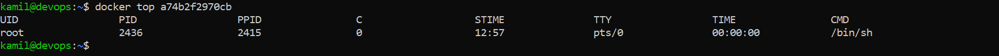

# Sprawozdanie 1
## Cel ćwiczenia

Celem ćwiczenia było zaznajomienie z `gitem` i `dockerem`, należało utworzyć prostego git hooka oraz dockerfile'a


## Przebieg ćwiczenia - zajęcia 1
### Instalacja klienta Git i obsługa kluczy SSH

Zainstalowałem gita poleceniem:

```
sudo apt install git
```
`ssh-keygen` był u mnie domyślnie zainstalowany na maszynie.

### Sklonowanie repozytorium przedmiotowego za pomocą HTTPS

Przeszedłem do [repozytorium grupowego](https://github.com/InzynieriaOprogramowaniaAGH/MDO2024_INO), i skopiowałem jego link HTTPS

<div align="center">
    
</div>

<br>

i poleceniem ```git clone <url>``` sklonowałem repozytorium

<div align="center">
    
</div>

### Utworzenie personal access token

Klikając na githubie: `Settings > Developer settings > Personal access tokens > Tokens (classic) > Generate new token (classic) > Select scope: repo > Generate token` utworzyłem personal access token

<div align="center">
    
</div>


### Utworzenie kluczy SSH, dodanie ich do GitHuba i sklonowanie repozytorium

Poleceniem `ssh-keygen -t <algorithm> -C "your_email@example.com"` utworzyłem klucz ssh

*Utworzenie klucza z algorytmem ed25519 zabezpieczonego hasłem*

<div align="center">
    
</div>

<br>

*Utworzenie klucza z algorytmem ecdsa nie zabezpieczonego hasłem*

<div align="center">
    
</div>

<br>

Następnie uruchomiłem ssh-agent w tle i dodałem do niego utworzone klucze

<div align="center">
    
</div>

<br>

Wyświetliłem klucz z rozszerzeniem .pub poleceniem `cat` i skopiowałem go do schowka

<div align="center">
    
</div>

<br>

Aby skonfigurować klucz SSH jako metodę dostępu do githuba przeszedłem do `Settings > SSH and GPG keys > New SSH key` wkleiłem klucz publiczny i kliknąłem przycisk `Add SSH key`

<div align="center">
    
</div>

<br>

Przeszedłem do [repozytorium grupowego](https://github.com/InzynieriaOprogramowaniaAGH/MDO2024_INO), i skopiowałem jego link SSH 


<div align="center">
    
</div>

i poleceniem ```git clone <url>``` sklonowałem repozytorium

<div align="center">
    
</div>

### Utworzenie własnej gałęzi

Przełączyłem się na gałąź `main` a następnie na gałąź `GCL1` z użyciem polecenia `git checkout <branch name>`

<div align="center">
    
</div>

Następnie utworzyłem własną gałąź poleceniem:
```
git checkout -b KCH411627
```

### Praca na gałęzi

Utworzyłem nowy katalog poleceniem:

```
mkdir KCH411627
```

Następnie z folderu `.git/hooks` skopiowałem plik `commit-msg.sample` i zeedytowałem go tak aby weryfikował czy każdy "commit message" zaczynał się od KCH411627, do napisania skryptu użyłem pythona ponieważ jestem z nim najlepiej zaznajomiony 

```
#!/bin/python3

import sys

def main():
	with open(sys.argv[1], 'r') as file:
		lines = file.readlines()
		first_line = lines[0]
		first_word = first_line.split(" ")[0].strip('\n')
		
		if first_word != "KCH411627":
			print("Commit should start with: KCH411627")
			sys.exit(1)

	sys.exit(0)

if __name__ == "__main__":
	main()
```

Napisany skrypt skopiowałem do katalogu `.git/hooks` bez rozszerzenia .sample 

<div align="center">
    
</div>

<br>

*Utworzony git hook działa poprawnie*

<div align="center">
    
</div>

<br>

Następnie poleceniem `git add .` i `git commit -m "<message>"` zrobiłem commita

<div align="center">
    
</div>

<br>

Poleceniem `git push <remote> <branch>` wysłałem zmiany do zdalnego źródła

<div align="center">
    
</div>

<br>

Przeszedłem do gałęzi grupy i poleceniem `git merge <branch>` wciągnąłem swoją gałąź do gałęzi grupowej

<div align="center">
    
</div>

<br>

Próbowałem wysłać zmiany do zdalnego źródła ale operacja nie powiodła się z powodu ochrony gałęzi
<div align="center">
    
</div>

## Przebieg ćwiczenia - zajęcia 2

### Zainstalowanie dockera

Zainstalowałem dockera poleceniem:
```
sudo apt install docker.io
```

<div align="center">
    
</div>

<br>

Dodałem się do grupy docker żeby móc wykonywac polecenia docker bez sudo i zrestartowałem maszynę aby zmiany zadziałały
```
sudo usermod -aG docker kamil
```
### Pobranie obrazów

Poleceniem `docker pull <image name>` pobrałem obrazy `hello-world`, `busybox`, `fedora`, `mysql`

<div align="center">
    
</div>


### Uruchomienie kontenera z obrazu busybox

Uruchomiłem kontener z obrazu busybox poleceniem `docker run <image>`, ale w konsoli nie było żadnego efektu, ale po użyciu polecenia `docker ps -l` widać że kontener się uruchomił i zakończył swoje działanie

<div align="center">
    
</div>

<br>

Następnie połączyłem się do kontenera interaktywnie i wywołałem numer wersji busyboxa 

<div align="center">
    
</div>

### Uruchomienie kontenera z obrazu fedory

Połączyłem się z kontenerem interaktywnie poleceniem:
```
docker run --tty --interactive fedora /bin/sh
```

Następnie zainstalowałem `ps` poleceniem:
```
dnf install procps -y
```

I wyświetliłem `PID1` w kontenerze

<div align="center">
    
</div>

Oraz wyświetliłem procesy dockera na hoście

<div align="center">
    
</div>

Następnie zaktualizowałem pakiety:
```
sudo dnf update
```
i wyszedłem z kontenera:
```
exit
```
### Stworzenie Dockerfile

Stworzyłem Dockerfile

```
FROM fedora

RUN sudo dnf update
RUN sudo dnf install git
RUN git clone https://github.com/InzynieriaOprogramowaniaAGH/MDO2024_INO.git
```
Będąc w katalogu ze stworzonym dockerfilem, zbudowałem go poleceniem:

```
docker build -t my_image .
```

Następnie uruchomiłem kontener w trybie interaktywnym i zweryfikowałem że obraz ma git oraz że jest ściągnięte repozytorium

<div align="center">
    
</div>

<br>

Wyświetliłem uruchomione kontenery

<div align="center">
    
</div>

<br>

I wyczyściłem je
<div align="center">
    
</div>

<br>

 Następnie wyświetliłem obrazy i również je wyczyściłem

<div align="center">
    
</div>