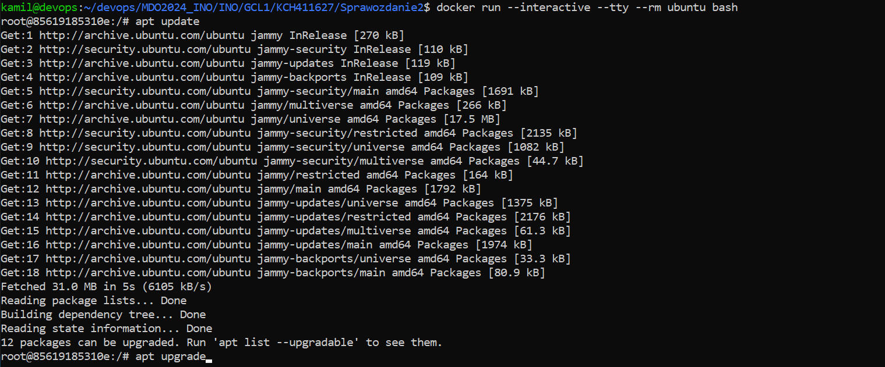
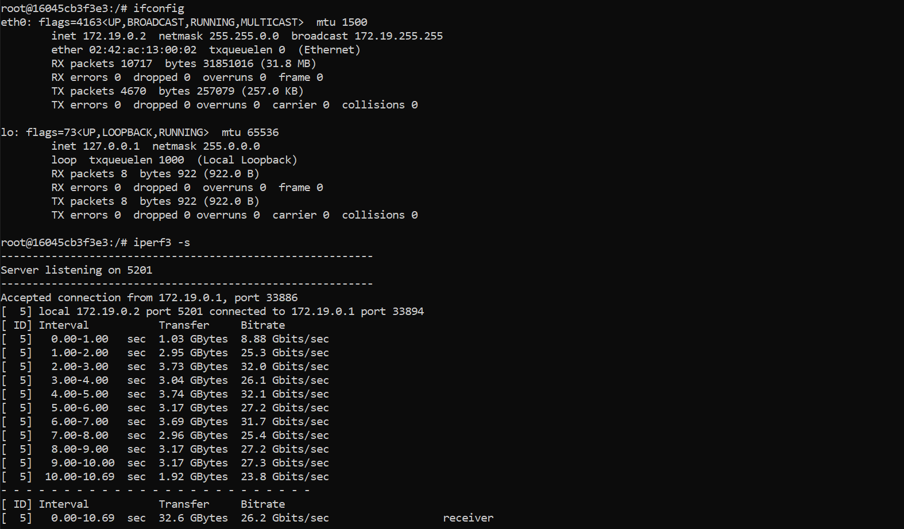

# Sprawozdanie 2

## Cel ćwiczenia

Celem ćwiczenia było zaznajomienie z dockerem: budowanie dockerfile'ów, woluminy oraz sieci.

## Przebieg ćwiczenia - zajęcia 3

### Znalezienie repozytorium

Znalazłem repozytorium [maven-demo](https://github.com/davidmoten/maven-demo), które dysponuje otwartą licencją (Apache-2.0 license), zawiera narzędzie do budowania (maven) oraz posiada testy.

<div align="center">
    
</div>

### Sklonowanie i uruchomienie

Sklonowałem repozytorium poleceniem:

```
git clone https://github.com/davidmoten/maven-demo.git
```

Następnie zainstalowałem maven'a:

<div align="center">
    
</div>

<br>

Zbudowałem program poleceniem:

```
mvn clean install
```

<div align="center">
    
</div>

<div align="center">
    
</div>

<br>

Uruchomiłem testy:

```
mvn test
```

<div align="center">
    
</div>

### Przeprowadzenie buildu w kontenerze

Uruchomiłem obraz ubuntu w trybie interaktywnym, zaktualizowałem pakiety, pobrałem gita oraz maven'a:

```
apt update
apt upgrade
apt install git
apt install maven 
```

<div align="center">
    
</div>

<br>

Pobrałem repozytorium:

<div align="center">
    
</div>

<br>


Zbudowałem program:

<div align="center">
    
</div>

<div align="center">
    
</div>

<br>

Uruchomiłem testy:

<div align="center">
    
</div>

### Stworzenie Dockerfile

Stworzylem Dockerfile który przeprowadza wszystkie kroki aż do builda:

```
FROM ubuntu

RUN apt update && \
    apt upgrade -y && \
    apt install -y git && \
    apt install -y maven

RUN git clone https://github.com/davidmoten/maven-demo.git
WORKDIR /maven-demo
RUN mvn clean install
```

Następnie go zbudowałem:
```
docker build -f BLDR.Dockerfile -t bldr .
```

<div align="center">
    
</div>


<div align="center">
    
</div>

<br>

Utworzyłem drugi dockerfile który bazuje na pierwszym i wykonuje testy

```
FROM bldr 

WORKDIR /maven-demo
RUN mvn test
```

<br>

I go zbudowałem:

<div align="center">
    
</div>

<div align="center">
    
</div>

<br>

*zbudowane obrazy*

<div align="center">
    
</div>

<br>

Uruchomienie kontenerów

<div align="center">
    
</div>

<br>

Oba kontenery uruchamiają się poprawnie i kończą swoją pracę (exited 0)

<div align="center">
    
</div>

## Przebieg ćwiczenia - zajęcia 4

Utworzyłem dwa woluminy, wejściowy (*vol_input*) i wyjściowy (*vol_output*) poleceniem:
```
docker volume create <name>
```

<div align="center">
    
</div>

<br>

Uruchomiłem i podłączyłem do kontenera bazowego (ubuntu) utworzone woluminy:

```
docker run --mount source=<volume_name>,target=<path> <image>
```

<div align="center">
    
</div>

<br>

Zainstalowałem niezbędne wymagania wstępne (oprócz gita)

```
apt update
apt upgrade
apt install maven 
```

<div align="center">
    
</div>

<br>

Postanowiłem że sklonuje repozytorium na wolumin wejściowy klonując repozytorium bezpośrednio do folderu w którym znajduję się wolumin

<br>

Otworzyłem nowy terminal i zobaczyłem gdzie znajduje się wolumin w systemie poleceniem:

```
docker volume inspect <volume_name>
```

<div align="center">
    
</div>

<br>

Przeszedłem do ścieżki "Mountpoint" i tam sklonowałem repozytorium, musiałem wejść w tryb super usera bo nie miałem uprawnień 

<div align="center">
    
</div>

<br>

Następnie w kontenerze zbudowałem program

<div align="center">
    
</div>

<div align="center">
    
</div>

<br>

Program buduje się do folderu *target* więc go skopiowałem poleceniem `cp` do wolumina wyjściowego:

<div align="center">
    
</div>

<br>

Pliki są zapisane tak aby były dostępne po wyłączeniu kontenera

<div align="center">
    
</div>

### Ponowanie operacji ale z gitem w kontenerze

Usunąłem dane z woluminów, uruchomiłem nowy kontener z obrazem bazowym ubuntu i podłączyłem woluminy, zainstalowałem niezbędne wymagania wstępne (maven) wraz z gitem i sklonowałem repozytorium na wolumin wejściowy:

<div align="center">
    
</div>

<br>

Zbudowałem i przekopiowałem do wolumina wyjściowego:

<div align="center">
    
</div>

### Dockerfile

Utworzyłem dockerfila:
```
FROM ubuntu

RUN mkdir input && \
    mkdir output

RUN --mount=type=bind,source=vol_input,target=/input,rw && \
    --mount=type=bind,source=vol_output,target=/output,rw

RUN apt update && \
    apt upgrade -y && \
    apt install -y git && \
    apt install -y maven

WORKDIR /input
RUN git clone https://github.com/davidmoten/maven-demo.git
WORKDIR /maven-demo
RUN mvn clean install
RUN cp -r target ../../output
```

Ale niestety nie udało mi się go zbudować. Dlaczego? nie wiem. Wyskakuje błąd że nie można odnaleźć source'a czyli woluminu a jest on utworzony.

<div align="center">
    
</div>

### Eksponowanie portu

Uruchomiłem kontener z obrazem ubuntu, zainstalowałem `iperf3` oraz `net-tools`, sprawdziłem ip i uruchomiłem server iperf
```
apt install iperf3
apt install net-tools
ifconfig
iperf3 -s
```

<div align="center">
    
</div>

<br>

Uruchomiłem drugi kontener z ubuntu i również zainstalowałem iperf, uruchomiłem klienta łącząć sie po adresie ip pierwszego kontenera:
```
iperf3 -c <ip>
```

<div align="center">
    
</div>

### Docker network

Utworzyłem własną sieć mostkową o nazwie *new_network*:
```
docker network create -d <driver> <name>
```

<div align="center">
    
</div>

<br>

Następnie uruchomiłem kontener o nazwie `server`:

<div align="center">
    
</div>

<br>

Oraz kontener o nazwie `client`:

<div align="center">
    
</div>

<br>

Uruchomiłem server ipref w kontenerze:

<div align="center">
    
</div>

<br>

I połączyłem się do niego w kliencie używając nazwy kontenera:

<div align="center">
    
</div>

### Łączenie z hosta

Znowu uruchomiłem kontener z ubuntu ale tym razem z otworzonym portem 5201

<div align="center">
    
</div>

<br>

Uruchomiłem server ipref

<div align="center">
    
</div>

<br>

 Połączyłem się z hosta używając adresu ip

<div align="center">
    
</div>

### Łączenie spoza hosta

Pobrałem iperf3 na komputer i połączyłem sie z kontenerem:

<div align="center">
    
</div>

<br>

Wynik połączenia z servera w kontenerze:

<div align="center">
    
</div>

### Przepustowość komunikacji

Domyślna sieć mostkowa - 27.4 Gbits/sec
<br>
Własna sieć mostkowa - 28.4 Gbits/sec
<br>
Łącznie z hosta - 26.2 Gbits/sec
<br>
Łącznie z poza hosta - 357 Mbits/sec


Najwolniejsze jest łącznie z poza hosta a reszta jest na podobnym poziomie.
