# Sprawozdanie 3

## Cel ćwiczenia

Celem ćwiczenia było utworzenie pipelinie'u w jenkinsie który wykonuje kroki `build -> test -> deploy -> publish` wybranej przez na aplikacji z poprzednich zajęć

## Przebieg ćwiczenia - zajęcia 5, 6 i 7

### Upewnienie się że kontenery budujące i testujące działają

Zbudowałem ponownie kontenery budujące i testujące w celu sprawdzenia czy działają

<div align="center">
    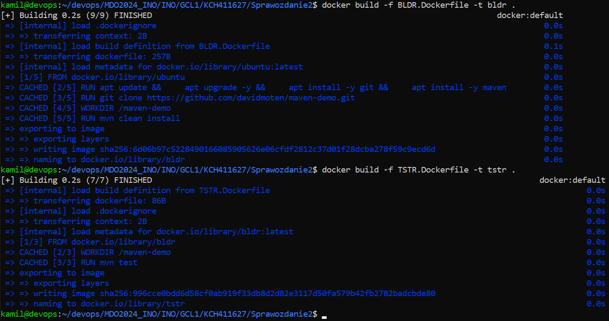
</div>

<br>

Następnie je uruchomiłem, obydwa działają poprawnie (exit 0)

<div align="center">
    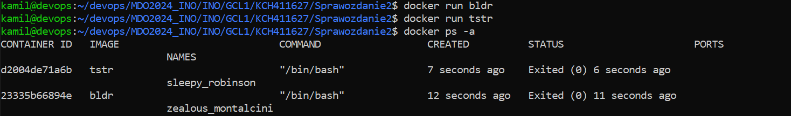
</div>

### Instalacja Jenkinsa

Postępując zgodnie z [instrukcją](https://www.jenkins.io/doc/book/installing/docker/), najpierw utworzyłem sieć o nazwie `jenkins`


```
docker network create jenkins
```

<div align="center">
    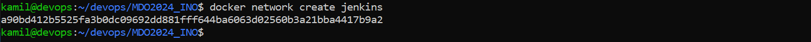
</div>

<br>

Aby używać dockera w jenkinsie nalezy uruchomić `docker:dind` (docker in docker)

```
docker run --name jenkins-docker --rm --detach \
  --privileged --network jenkins --network-alias docker \
  --env DOCKER_TLS_CERTDIR=/certs \
  --volume jenkins-docker-certs:/certs/client \
  --volume jenkins-data:/var/jenkins_home \
  --publish 2376:2376 \
  docker:dind --storage-driver overlay2
```

<div align="center">
    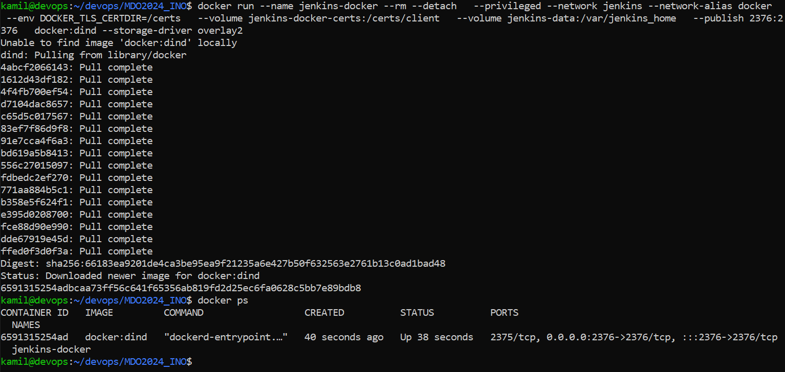
</div>

<br>

Utworzyłem dockerfila jenkinsa

```
FROM jenkins/jenkins:2.440.3-jdk17
USER root
RUN apt-get update && apt-get install -y lsb-release
RUN curl -fsSLo /usr/share/keyrings/docker-archive-keyring.asc \
  https://download.docker.com/linux/debian/gpg
RUN echo "deb [arch=$(dpkg --print-architecture) \
  signed-by=/usr/share/keyrings/docker-archive-keyring.asc] \
  https://download.docker.com/linux/debian \
  $(lsb_release -cs) stable" > /etc/apt/sources.list.d/docker.list
RUN apt-get update && apt-get install -y docker-ce-cli
USER jenkins
RUN jenkins-plugin-cli --plugins "blueocean docker-workflow"
```

Zbudowałem go

```
docker build -t myjenkins-blueocean:2.440.3-1 .
```

<div align="center">
    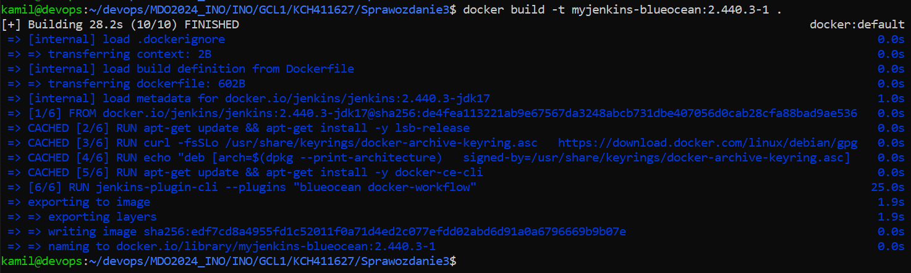
</div>

<br>

Uruchomiłem jenkinsa

```
docker run --name jenkins-blueocean --restart=on-failure --detach \
  --network jenkins --env DOCKER_HOST=tcp://docker:2376 \
  --env DOCKER_CERT_PATH=/certs/client --env DOCKER_TLS_VERIFY=1 \
  --publish 8080:8080 --publish 50000:50000 \
  --volume jenkins-data:/var/jenkins_home \
  --volume jenkins-docker-certs:/certs/client:ro \
  myjenkins-blueocean:2.440.3-1
```

<div align="center">
    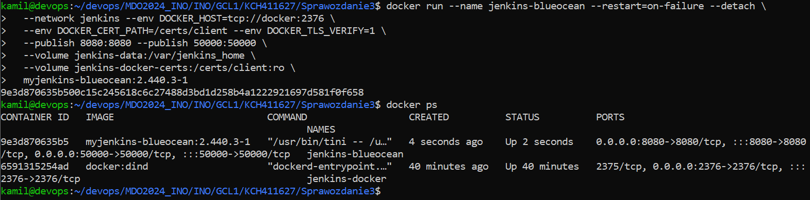
</div>

### Konfiguracja jenkinsa

Po wpisanu w przegladarke `localhost:8080` pojawia się okno proszące o hasło


<div align="center">
    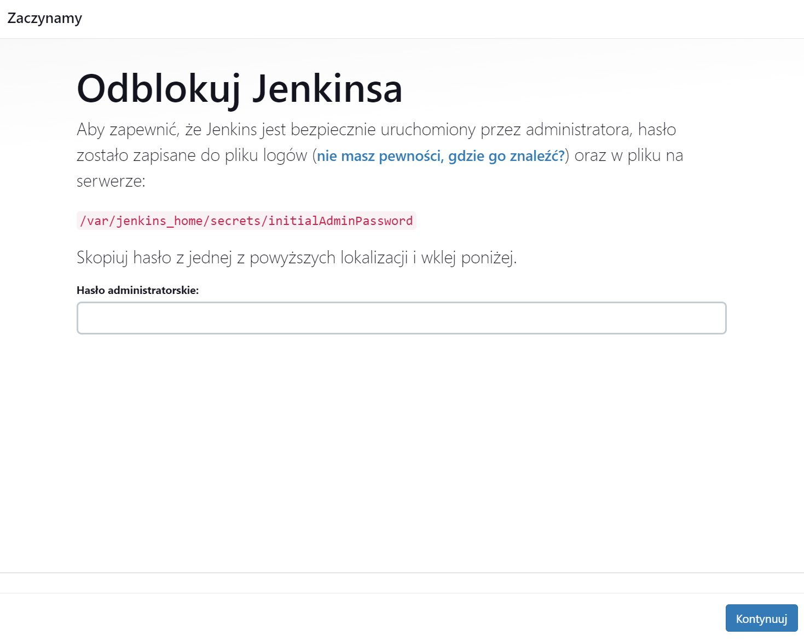
</div>

<br>

Hasło można zobaczyć w logach kontenera jenkinsa
```
docker logs jenkins-blueocean
```

<div align="center">
    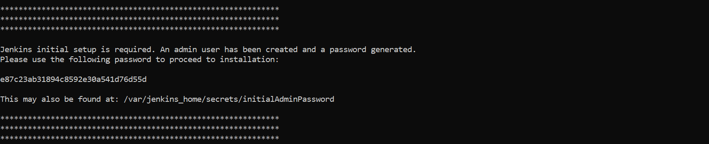
</div>

<br>

Po wpisaniu hasła zainstalowałem sugerowane wtyczki

<div align="center">
    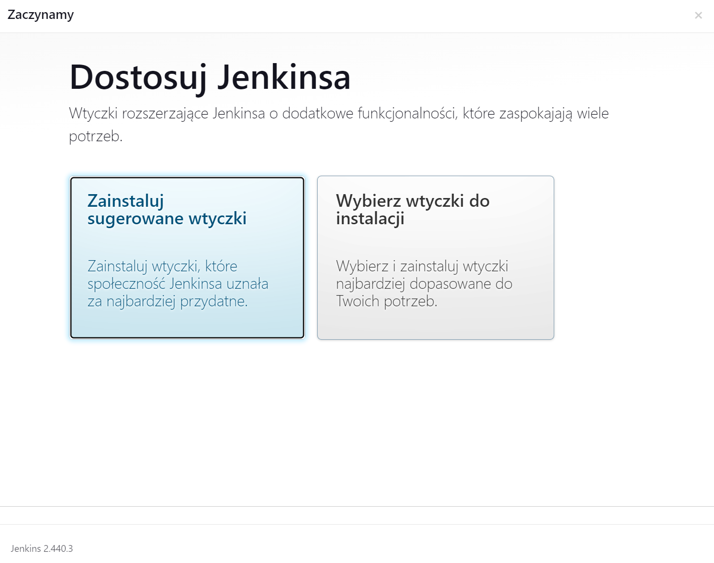
</div>

<br>

Utworzyłem  pierwszego administratora

<div align="center">
    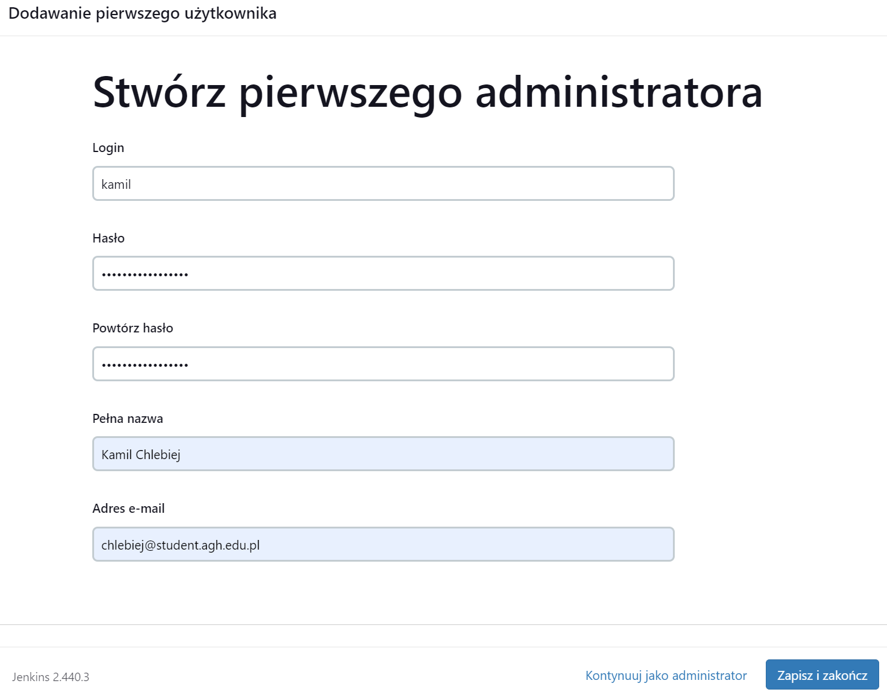
</div>

<br>

Wpisałem roota jenkinsa czyli `localhost:8080` i zakończyłem konfiguracje

<div align="center">
    
</div>


### Utworzenie pierwszego projektu

Utworzyłem nowy pipline o nazwie `proj_01`

<div align="center">
    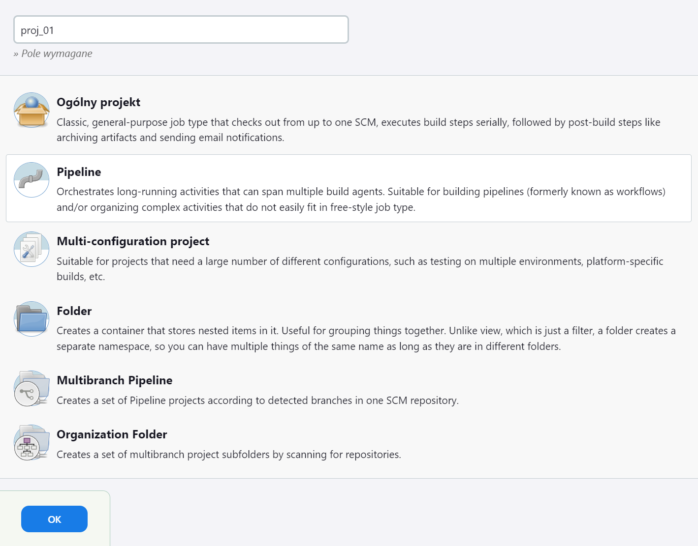
</div>

<br>

Napisałem skryt który wyświetla `uname`

<div align="center">
    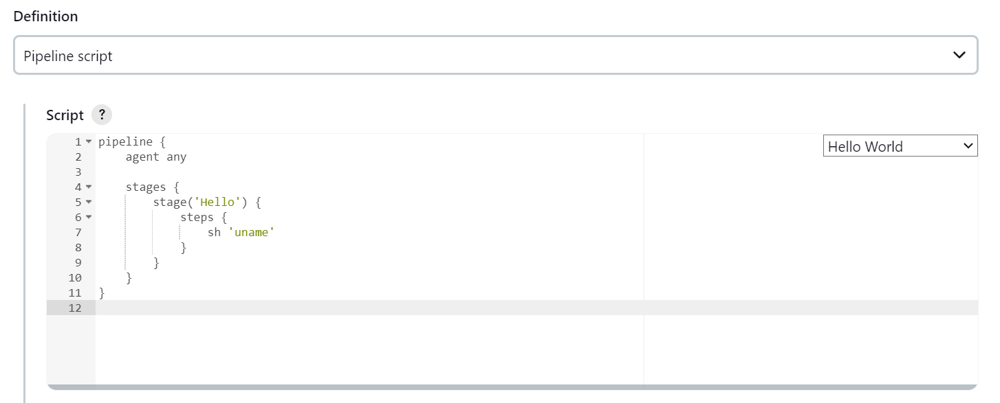
</div>

<br>

Uruchomiłem pipeline

<div align="center">
    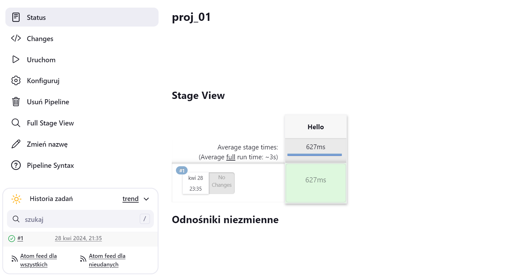
</div>

<br>

Projekt działa poprawnie, w logach jest wyświetlone `uname`

<div align="center">
    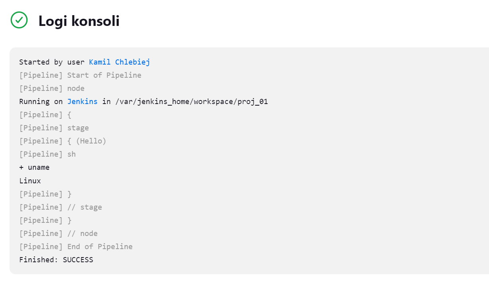
</div>

<br>

Utworzyłem drugi projekt o nazwie `proj_02`, następnie napisałem skrypt który sprawdza czy godzina jest parzysta, jeśli nie, zwraca błąd

<div align="center">
    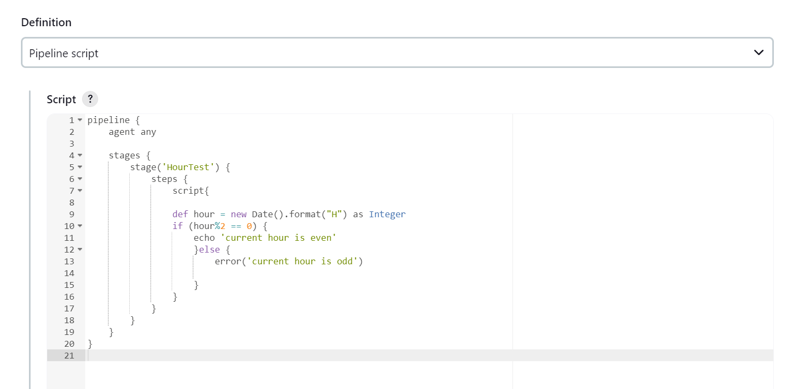
</div>

<br>

Uruchomiłem go i błąd o nieparzystej godzinie został poprawnie zwrócony

<div align="center">
    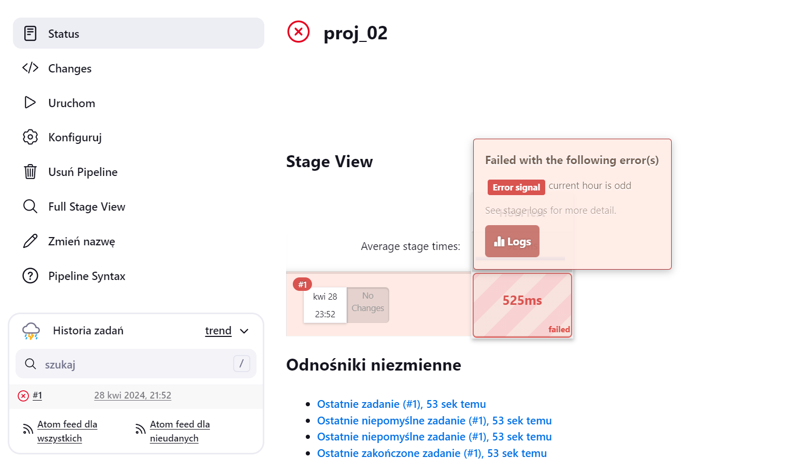
</div>

<br>

### Utworzenie "prawdziwego" projektu

Utworzyłem pipline który składa się z trzech kroków: Prepare, Build, Test

Krok *Prepare* usuwa poprzednio utworzony folder ze sklonowanym repozytorium, klonuje repozytorium i przechodzi na moją osobistą gałąź `KCH411627` 

Krok *Build* uruchamia build dockerfila budującego

Krok *Test* urchamia build dockerfila testujacego 

<!-- <div align="center">
    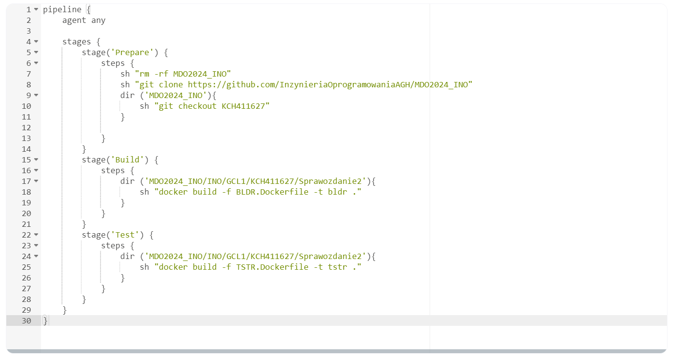
</div>

<br> -->

```
pipeline {
    agent any

    stages {
        stage('Prepare') {
            steps {
                sh "rm -rf *"
                sh "git clone https://github.com/InzynieriaOprogramowaniaAGH/MDO2024_INO"
               
                dir ('MDO2024_INO'){
                    sh "git checkout KCH411627"
                }
                
            }
        }
        stage('Build') {
            steps {
                dir ('MDO2024_INO/INO/GCL1/KCH411627/Sprawozdanie2'){
                    sh "docker build -f BLDR.Dockerfile -t bldr . "
                }
            }
        }
        stage('Test') {
            steps {
                dir ('MDO2024_INO/INO/GCL1/KCH411627/Sprawozdanie2'){
                    sh "docker build -f TSTR.Dockerfile -t tstr . "
                }
            }
        }
    }
}
```

Uruchomiłem utworzony pipeline:

<div align="center">
    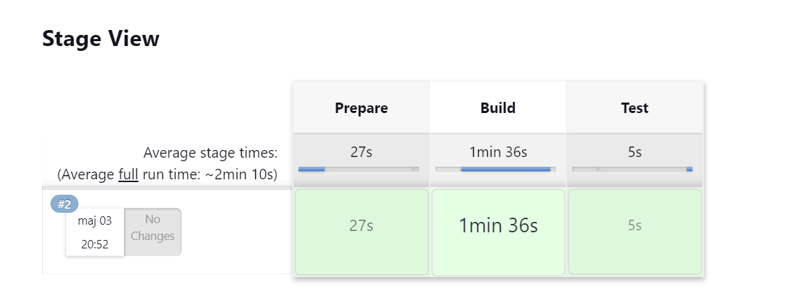
</div>

<div align="center">
    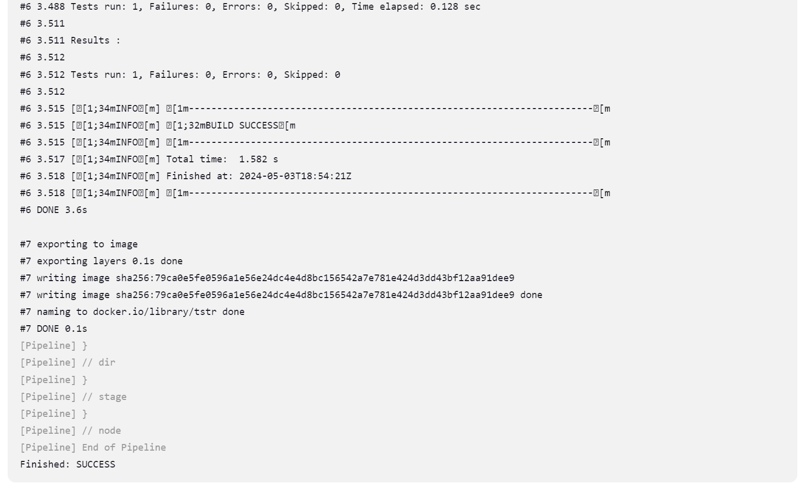
</div>

<br>

### Diagramy UML

Diagramy zostały utworzone za pomocą narzedzia [Visual paradigm online](https://online.visual-paradigm.com/pl/)

Diagram aktywności:

<div align="center">
    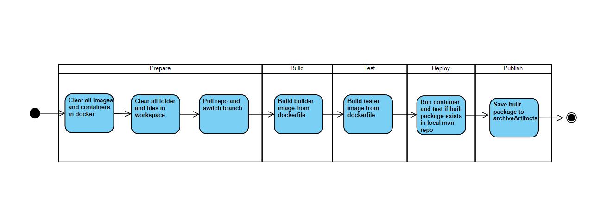
</div>

<br>

Diagram wdrożeniowy:

<div align="center">
    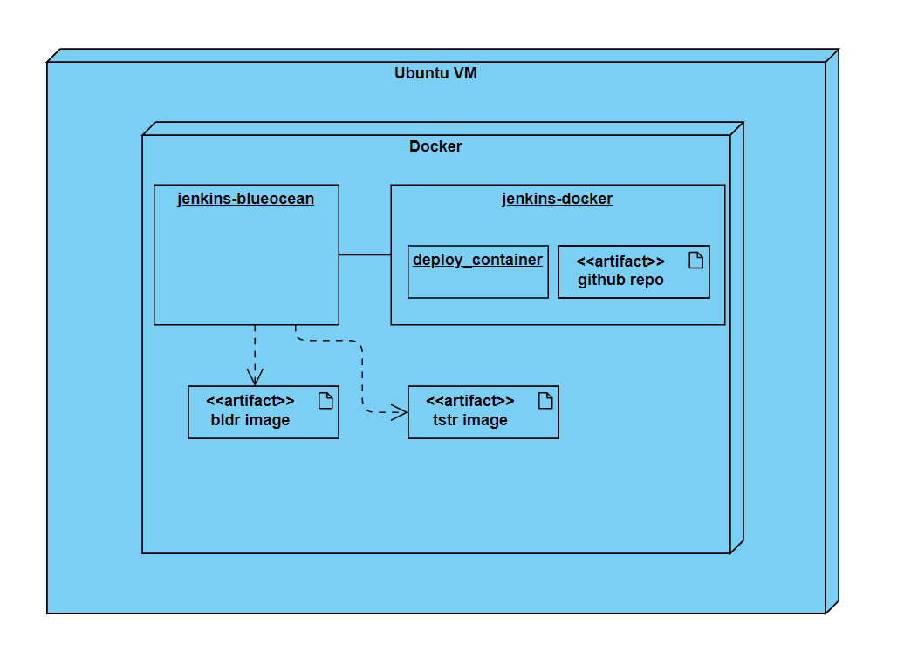
</div>

<br>

### Deploy

Ponieważ projekt `maven-demo` nie posiada klasy z funkcją main nie jest możliwe uruchomienie pliku .jar

Z tego powodu postanowiłem że krok deploy będzie polegał na sprawdzeniu czy zbudowany projekt można znaleźć w lokalnym repozytorium mavena, jeśli tak to przechodzimy do kroku publish jeśli nie to zwracamy błąd. 

Do deploya użyłem kontenera z obrazu `build` ponieważ był on wystarczalny i nie widzę sensu żeby tworzyć nowy obraz do deploya.

Do sprawdzenie czy projekt można znaleźć wykorzystałem poleceni mavena: 

```
mvn dependency:get -Dartifact=demo:maven-demo:0.1-SNAPSHOT
```

```
stage('Deploy') {
    steps {
            sh 'docker run -d -t -i --name deploy_container bldr'
            
            sh 'docker exec deploy_container mvn dependency:get -Dartifact=demo:maven-demo:0.1-SNAPSHOT'
            
            sh 'docker stop deploy_container'
    }
}
```

<!-- <div align="center">
    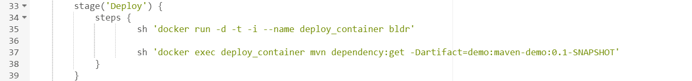
</div> -->


<div align="center">
    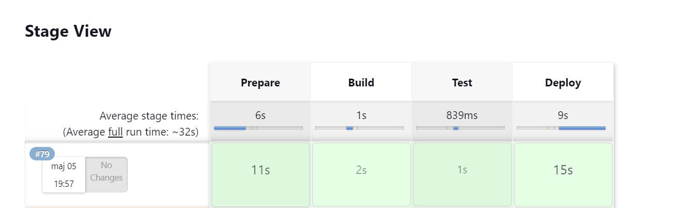
</div>

<br>

Gdy zmienimy artefakt, na przykład wersje na `0.2-SNAPSHOT`, otrzymujemy spodziewany błąd 

```
mvn dependency:get -Dartifact=demo:maven-demo:0.2-SNAPSHOT
```

<div align="center">
    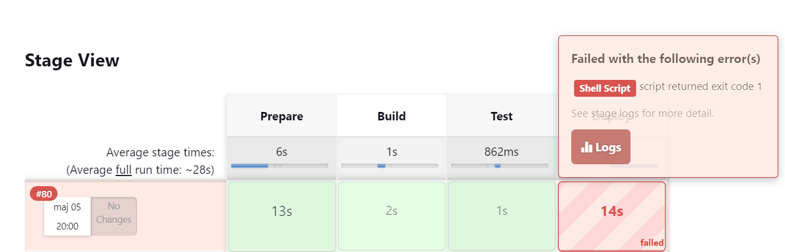
</div>

<br>

### Publish

Krok **publish** polega na zapisaniu utworzonego w kroku **build** pliku .jar do `archiveArtifacts`

<!-- <div align="center">
    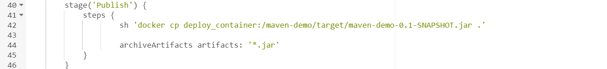
</div>

<br> -->

```
stage('Publish') {
    steps {
            sh 'docker cp deploy_container:/maven-demo/target .'
            
            archiveArtifacts artifacts: 'target/*.jar'
    }
}
```

<div align="center">
    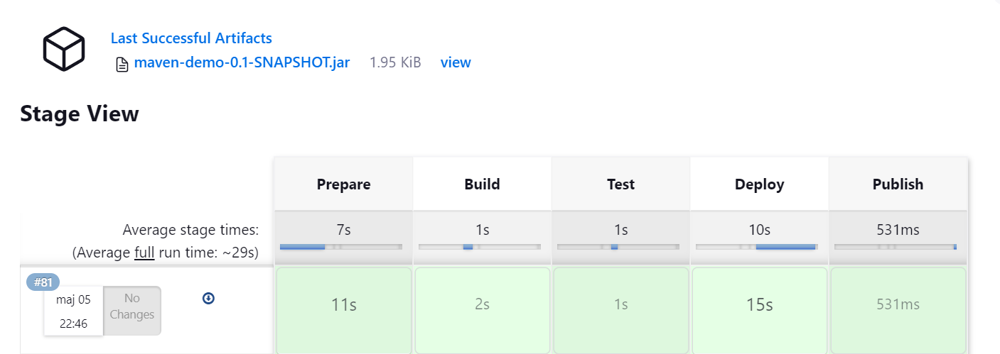
</div>

<br>

### Logi

Na koniec została archiwizacja logów. Do niego również użyłem `archiveArtifacts` oraz polecenia `2>&1 | tee` które pozwala na wypisanie wyjścia do konsoli oraz do pliku. Do numeracji logów użyłem zmiennej środowiskowej `BUILD_NUMBER`

```
stage('Build') {
    steps {
        dir ('MDO2024_INO/INO/GCL1/KCH411627/Sprawozdanie2'){
            sh "docker build -f BLDR.Dockerfile -t bldr . 2>&1 | tee build_log${BUILD_NUMBER}.txt"
            
            archiveArtifacts artifacts: 'build_log*.txt'
        }
    }
}
stage('Test') {
    steps {
        dir ('MDO2024_INO/INO/GCL1/KCH411627/Sprawozdanie2'){
            sh "docker build -f TSTR.Dockerfile -t tstr . 2>&1 | tee test_log${BUILD_NUMBER}.txt"
            
            archiveArtifacts artifacts: 'test_log*.txt'
        }
    }
}
stage('Deploy') {
    steps {
            sh 'docker run -d -t -i --name deploy_container bldr'
            
            sh 'docker exec deploy_container mvn dependency:get -Dartifact=demo:maven-demo:0.1-SNAPSHOT 2>&1 | tee deploy_log${BUILD_NUMBER}.txt'
            
            sh 'docker stop deploy_container'
            
            archiveArtifacts artifacts: 'deploy_log*.txt'
    }
}
```

<div align="center">
    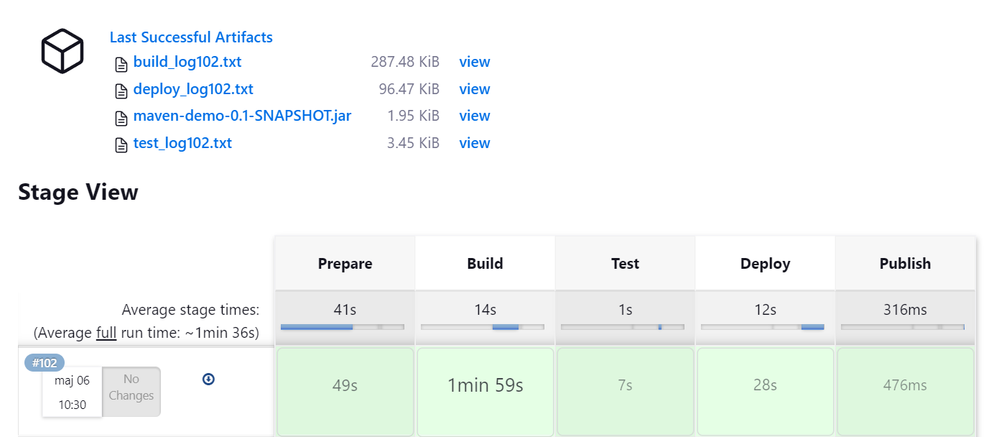
</div>

### Małe podsumowanie

Do kroku `preparation` dopisałem linijkę która czyści obrazy i kontenery
```
docker system prune -af
```
Polecenie to również czyści cache dlatego dodałem dopiero na końcu. (Czas wykonania pipeline'u z kliku sekund zamienia sie na ~2 minuty)

Według mnie jest zgodność z diagramami UML (poza archiwizacją logów)


Ostateczny `jenkisfile`
```
pipeline {
    agent any

    stages {
        stage('Prepare') {
            steps {
                sh "rm -rf *"
                sh "git clone https://github.com/InzynieriaOprogramowaniaAGH/MDO2024_INO"
               
                sh 'docker system prune -af'
               
                
                dir ('MDO2024_INO'){
                    sh "git checkout KCH411627"
                }
                
            }
        }
        stage('Build') {
            steps {
                dir ('MDO2024_INO/INO/GCL1/KCH411627/Sprawozdanie2'){
                    sh "docker build -f BLDR.Dockerfile -t bldr . 2>&1 | tee build_log${BUILD_NUMBER}.txt"
                    
                    archiveArtifacts artifacts: 'build_log*.txt'
                }
            }
        }
        stage('Test') {
            steps {
                dir ('MDO2024_INO/INO/GCL1/KCH411627/Sprawozdanie2'){
                    sh "docker build -f TSTR.Dockerfile -t tstr . 2>&1 | tee test_log${BUILD_NUMBER}.txt"
                    
                    archiveArtifacts artifacts: 'test_log*.txt'
                }
            }
        }
        stage('Deploy') {
            steps {
                    sh 'docker run -d -t -i --name deploy_container bldr'
                    
                    sh 'docker exec deploy_container mvn dependency:get -Dartifact=demo:maven-demo:0.1-SNAPSHOT 2>&1 | tee deploy_log${BUILD_NUMBER}.txt'
                    
                    sh 'docker stop deploy_container'
                    
                    archiveArtifacts artifacts: 'deploy_log*.txt'
            }
        }
        stage('Publish') {
            steps {
                    sh 'docker cp deploy_container:/maven-demo/target .'
                    
                    archiveArtifacts artifacts: 'target/*.jar'
            }
        }
    }
}
```

