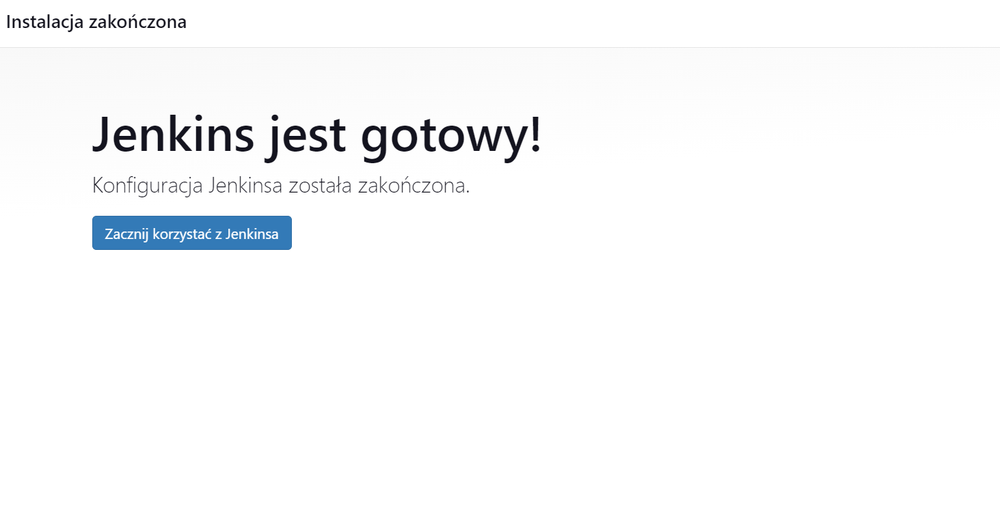

# Sprawozdanie 3

## Cel ćwiczenia

## Przebieg ćwiczenia - zajęcia 5

### Upewnienie się że kontenery budujące i testujące działają

Zbudowałem ponownie kontenery budujące i testujące w celu sprawdzenia czy działają

<div align="center">
    
</div>

<br>

Następnie je uruchomiłem, obydwa działają poprawnie (exit 0)

<div align="center">
    
</div>

### Instalacja Jenkinsa

Postępując zgodnie z [instrukcją](https://www.jenkins.io/doc/book/installing/docker/), najpierw utworzyłem sieć o nazwie `jenkins`


```
docker network create jenkins
```

<div align="center">
    
</div>

<br>

Aby używać dockera w jenkinsie nalezy uruchomić `docker:dind` (docker in docker)

```
docker run --name jenkins-docker --rm --detach \
  --privileged --network jenkins --network-alias docker \
  --env DOCKER_TLS_CERTDIR=/certs \
  --volume jenkins-docker-certs:/certs/client \
  --volume jenkins-data:/var/jenkins_home \
  --publish 2376:2376 \
  docker:dind --storage-driver overlay2
```

<div align="center">
    
</div>

<br>

Utworzyłem dockerfila jenkinsa

```
FROM jenkins/jenkins:2.440.3-jdk17
USER root
RUN apt-get update && apt-get install -y lsb-release
RUN curl -fsSLo /usr/share/keyrings/docker-archive-keyring.asc \
  https://download.docker.com/linux/debian/gpg
RUN echo "deb [arch=$(dpkg --print-architecture) \
  signed-by=/usr/share/keyrings/docker-archive-keyring.asc] \
  https://download.docker.com/linux/debian \
  $(lsb_release -cs) stable" > /etc/apt/sources.list.d/docker.list
RUN apt-get update && apt-get install -y docker-ce-cli
USER jenkins
RUN jenkins-plugin-cli --plugins "blueocean docker-workflow"
```

Zbudowałem go

```
docker build -t myjenkins-blueocean:2.440.3-1 .
```

<div align="center">
    
</div>

<br>

Uruchomiłem jenkinsa

```
docker run --name jenkins-blueocean --restart=on-failure --detach \
  --network jenkins --env DOCKER_HOST=tcp://docker:2376 \
  --env DOCKER_CERT_PATH=/certs/client --env DOCKER_TLS_VERIFY=1 \
  --publish 8080:8080 --publish 50000:50000 \
  --volume jenkins-data:/var/jenkins_home \
  --volume jenkins-docker-certs:/certs/client:ro \
  myjenkins-blueocean:2.440.3-1
```

<div align="center">
    
</div>

### Konfiguracja jenkinsa

Po wpisanu w przegladarke `localhost:8080` pojawia się okno proszące o hasło


<div align="center">
    
</div>

<br>

Hasło można zobaczyć w logach kontenera jenkinsa
```
docker logs jenkins-blueocean
```

<div align="center">
    
</div>

<br>

Po wpisaniu hasła zainstalowałem sugerowane wtyczki

<div align="center">
    
</div>

<br>

Utworzyłem  pierwszego administratora

<div align="center">
    
</div>

<br>

Wpisałem roota jenkinsa czyli `localhost:8080` i zakończyłem konfiguracje

<div align="center">
    
</div>


### Utworzenie pierwszego projektu

Utworzyłem nowy pipline o nazwie `proj_01`

<div align="center">
    
</div>

<br>

Napisałem skryt który wyświetla `uname`

<div align="center">
    
</div>

<br>

Uruchomiłem pipeline

<div align="center">
    
</div>

<br>

Projekt działa poprawnie, w logach jest wyświetlone `uname`

<div align="center">
    
</div>

<br>

<div align="center">
    
</div>

<br>

<div align="center">
    
</div>

<br>