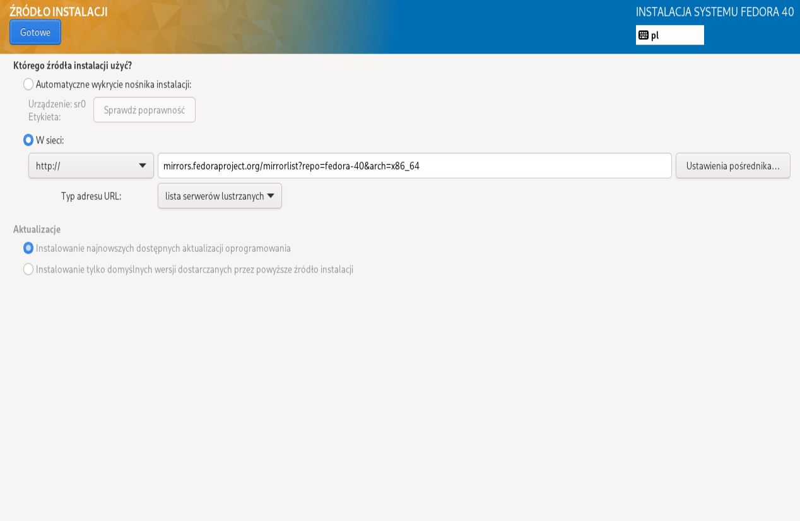

# Sprawozdanie 4

## Cel ćwiczenia
## Przebieg ćwiczenia - zajęcia 8 

### Utworzenie drugiej maszyny wirtualnej

Utworzyłem drugą maszynę wirtualną z systemem *ubuntu server 24.04.4* (tak jak maszyna główna)

<div align="center">
    
</div>

<div align="center">
    
</div>

<br>

Wybrałem opcje instalacji systemu o jak najmniejszym zbiorze zainstalowanego oprogramowania

<div align="center">
    
</div>

<br>

Nadałem maszynie *hostname* `ansible-target` oraz utworzyłem użytkownika `ansible`

<div align="center">
    
</div>

<br>

System zainstalował się pomyślnie (widok po reboot'cie)

<div align="center">
    
</div>

<br>

 System posiada program `tar` oraz server `OpenSSH`

<div align="center">
    
</div>

### Połączenie sieciowe maszyn

Aby maszyny mogły się widzieć w sieci muszą należeć do jednej sieci

Więc utworzyłem nową sieć NAT o nazwie *MyNatNetwork* w VirtualBox'ie po przez przejście `File > Tools > Network Manager > NAT networks > create `

<div align="center">
    
</div>

<br>

Dodałem obie maszyny do nowo utworzonej sieci

<div align="center">
    
</div>

<br>

Sprawdziłem ip maszyny głównej (`10.0.2.4`)

<div align="center">
    
</div>

<br>

Oraz ip drugiej maszyny (`10.0.2.15`)

<div align="center">
    
</div>

<br>

Sprawdziłem czy maszyny się widzą po przez `ping`

<div align="center">
    
</div>

<br>


Wróciłem do ustawień sieci *MyNatNetwork* i dodałem przekierowanie portów aby móc się połączyć z hosta

<div align="center">
    
</div>

<br>

Połączenia z hosta do maszyny głownej

<div align="center">
    
</div>

<br>

Połączenie z hosta do drugiej maszyny

<div align="center">
    
</div>

### Wymiana kluczy ssh

Utworzyłem klucz ssh z algorytmem szyfrowania *ed25519*

<div align="center">
    
</div>

<br>

Wymieniłem klucz SSH pomiędzy użytkownikiem na głównej maszynie i użytkownikiem ansible.

<div align="center">
    
</div>

<br>

Dodałem utworzony klucz do agenta SSH i zalogowałem się do drugiej maszyny. Wymiana kluczy się udała, teraz nie trzeba wpisywać hasła przy logowaniu.

<div align="center">
    
</div>

### Inwentaryzacja

Zainstalowałem `ansible` na maszynie głównej

<div align="center">
    
</div>

<br>

Zapisałem ip 10.0.2.15 (druga maszyna) jako ansible-target do pliku `etc/hosts` aby łączyć się po nazwie a nie po adresie ip

<div align="center">
    
</div>

<br>

Sprawdziłem połączenie po nazwie za pomocą `ping`

<div align="center">
    
</div>

### Plik inwentaryzacji

Utworzyłem plik inventory.ini, w którym są trzy sekcje `Orchestrators`, `Endpoints` oraz `All`.

```
[Orchestrators]
devops ansible_user=kamil

[Endpoints]
ansible-target

[All:children]
Orchestrators
Endpoints
```
<br>

Wysłałem żądanie `ping` do wszystkich maszyn (musiałem dodać klucz ssh do maszyny głównej aby móc się do niej połączyć)

<div align="center">
    
</div>

### Zadalne wywoływanie procedur

Utworzyłem plik `playbook.yaml`

Stworzyłem *play* który jako zadanie ma wysłanie `ping` do wszystkich maszyn

```
- name: Ping play
  hosts: All
  tasks:
  - name: Ping all hosts
    ansible.builtin.ping:
```

<br>

Stworzyłem nowy *play* który będzie wykonywał zadania na maszynie w sekcji `Endpoints`

Napisałem zadanie które tworzy nowy folder *ansible* i kopiuje do niego plik `inventory.ini` z głównej maszyny, a następnie kopiuje drugi raz.

```
- name: Endpoints play
  hosts: Endpoints
  tasks:
  - name: Creating directory
    become: true    
    ansible.builtin.file:
      path: ~/ansible
      state: directory
      mode: '0755'

  - name: Copying inventory file
    copy:
      src: inventory.ini
      dest: ~/ansible/inventory.ini

  - name: Copying inventory file again 
    copy:
      src: inventory.ini
      dest: ~/ansible/inventory.ini
```

<br>

Kolejne zadanie aktualizuje pakiety w systemie

```
  - name: Package update
    become: true
    ansible.builtin.apt:
      name: "*"
      state: latest
```

<br>

Ostatnie zadania restartują usługi `sshd` i `rngd`

```
  - name: Sshd restart
    become: true 
    ansible.builtin.service:
      name: sshd
      state: restarted

  - name: Rngd restart
    become: true
    ansible.builtin.service:
      name: rng-tools
      state: restarted
```

<br>

Cały plik `playbook.yaml`

```
- name: Ping play
  hosts: All
  tasks:
  - name: Ping all hosts
    ansible.builtin.ping:

- name: Endpoints play
  hosts: Endpoints
  tasks:
  - name: Creating directory
    become: true    
    ansible.builtin.file:
      path: ~/ansible
      state: directory
      mode: '0755'

  - name: Copying inventory file
    copy:
      src: inventory.ini
      dest: ~/ansible/inventory.ini

  - name: Copying inventory file again 
    copy:
      src: inventory.ini
      dest: ~/ansible/inventory.ini
      
  - name: Package update
    become: true
    ansible.builtin.apt:
      name: "*"
      state: latest

  - name: Sshd restart
    become: true 
    ansible.builtin.service:
      name: sshd
      state: restarted

  - name: Rngd restart
    become: true
    ansible.builtin.service:
      name: rng-tools
      state: restarted
  
```

<br>

Uruchomiłem playbooka z opcją `--ask-become-pass` aby móc wykonać polecenia które potrzebują uprawnień administratora (zadania z `become: true`) 

<div align="center">
    
</div>

Przy ponownym skopiowaniu pliku `inventory.ini` zmienił się stan z `changed` na `ok`

<br>

Na drugiej maszynie wyłączyłem server SSH i uruchomiłem

```
sudo systemctl stop ssh
```

I uruchomiłem ponownie playbooka na maszynie głównej, durga maszyna jest `unreachable`, `Connection refused`

<div align="center">
    
</div>

<br>

Odpiąłem karte sieciową od drugiej maszyny (odznaczyłem *Cable Connected*)

<div align="center">
    
</div>

<br>

Uruchomiłem ponownie playbooka, druga maszyna jest `unreachable`, `Connection timed out`

<div align="center">
    
</div>

### Modyfikacja aplikacji z poprzednich zajęć

Przez to że wybrana przeze mnie aplikacja ([maven-demo](https://github.com/davidmoten/maven-demo)) nic nie robi, postanowiłem że dopisze funkcje `main` od niej

```
public class Thing {
    public static void main(String[] args) {
        System.out.println("Hello world! Hello maven!");
    }
}
```

Oraz dodam do `pom.xml` potrzebny plugin aby móc zbudować fatjar'a

```
<plugin>
    <groupId>org.apache.maven.plugins</groupId>
    <artifactId>maven-assembly-plugin</artifactId>
    <configuration>
        <appendAssemblyId>
            false
        </appendAssemblyId>
        <archive>
            <manifest>
                <mainClass>demo.Thing</mainClass>
            </manifest>
        </archive>
        <descriptorRefs>
            <descriptorRef>jar-with-dependencies</descriptorRef>
        </descriptorRefs>
    </configuration>
    <executions>
        <execution>
            <id>make-assembly</id> 
            <phase>package</phase> 
            <goals>
                <goal>single</goal>
            </goals>
        </execution>
    </executions>
</plugin>
```
Dzięki tym modyfikacjom aplikacja wyświetla napis "*Hello world! Hello maven!*" po uruchomieniu.

### Zarządzanie kontenerem

Utworzyłem nowy plik playbook o nazwie `docker-playbook.yaml`

Napisałem pierwszy `play` który polega na pobraniu `docker`, utworzeniu folderu o nazwie `ansible` i przekopiowaniu do niego pliku `.jar`

```
-name: Docker prepare
  hosts: Endpoints
  tasks:
  - name: Download docker
    become: true
    ansible.builtin.apt:
      name: docker.io
      state: latest

  - name: Creating directory
    become: true    
    ansible.builtin.file:
      path: ~/ansible
      state: directory
      mode: '0755'

  - name: Copying jar file 
    copy:
      src: ~/devops/maven-demo/target/maven-demo-0.1-SNAPSHOT.jar
      dest: ~/ansible/app.jar
```
<br>

Następnie utworzyłem nowy `play` którego zadaniami są:

Uruchomienie `dockera`

```
  - name: Start docker
    become: true
    ansible.builtin.service:
      name: docker
      state: started
```
Utworzenie i uruchomienie konteneru deployowego w trybie interaktywnym z obrazu `openjdk` (jedyna wymaga dependencja do wybranego przeze mnie projektu) 

```
  - name: Create a deploy container
    become: true
    community.docker.docker_container:
      name: deploy 
      image: openjdk 
      detach: true
      interactive: true
```

Przekopiowanie pliku `.jar` do kontenera deployowego (aby móc używać `community.docker.docker_container_copy_into` musiałem zaktualizować kolekcję `community.docker` poleceniem 
`ansible-galaxy collection install community.docker`)

```      
  - name: Copy a jar file into the deploy container
    become: true
    community.docker.docker_container_copy_into:
      container: deploy 
      path: /home/ansible/ansible/app.jar
      container_path: app.jar
```
Uruchomienie aplikacji w kontenerze

```
  - name: Run app in deploy container
    become: true
    community.docker.docker_container_exec:
      container: deploy
      command: java -jar app.jar
    register: result
```
Wyswietlenie wyniku aplikacji

```
  - name: Print stdout
    ansible.builtin.debug:
      var: result.stdout
```

Usunięcie kontenera

```
  - name: Remove deploy container
    become: true
    community.docker.docker_container:
      name: deploy
      state: absent
```

<br>

Cały `docker-playbook.yaml`

```
-name: Docker prepare
  hosts: Endpoints
  tasks:
  - name: Download docker
    become: true
    ansible.builtin.apt:
      name: docker.io
      state: latest

  - name: Creating directory
    become: true    
    ansible.builtin.file:
      path: ~/ansible
      state: directory
      mode: '0755'

  - name: Copying jar file 
    copy:
      src: ~/devops/maven-demo/target/maven-demo-0.1-SNAPSHOT.jar
      dest: ~/ansible/app.jar
      
- name: Docker play
  hosts: Endpoints
  tasks:
  - name: Start docker
    become: true
    ansible.builtin.service:
      name: docker
      state: started
  
  - name: Create a deploy container
    become: true
    community.docker.docker_container:
      name: deploy 
      image: openjdk 
      detach: true
      interactive: true
      
  - name: Copy a jar file into the deploy container
    become: true
    community.docker.docker_container_copy_into:
      container: deploy 
      path: /home/ansible/ansible/app.jar
      container_path: app.jar

  - name: Run app in deploy container
    become: true
    community.docker.docker_container_exec:
      container: deploy
      command: java -jar app.jar
    register: result

  - name: Print stdout
    ansible.builtin.debug:
      var: result.stdout

  - name: Remove deploy container
    become: true
    community.docker.docker_container:
      name: deploy
      state: absent
```

<br>

Wynik uruchomienia playbooka


<div align="center">
    
</div>

### Role 

Utworzyłem dwie role `Docker_prepare` i `Docker` w nowo stworzonym folderze `roles`


<div align="center">
    
</div>

<br>

Dla roli `Docker-prepare` przekopiowałem zadania z `play` "Docker prepare" do `roles/Docker_prepare/tasks/main.yml`

Dla roli `Docker` przekopiowałem zadania z `play` "Docker play" do `roles/Docker/tasks/main.yml`

Utworzyłem nowy playbook `role-playbook.yaml` w folderze `roles`

```
- name: Run docker 
  hosts: Endpoints
  roles:
  - Docker_prepare 
  - Docker
```

Uruchomiłem nowy playbook, wynik jest taki sam jak poprzednio.

<div align="center">
    
</div>

## Przebieg ćwiczenia - zajęcia 9 

### Pobranie i zainstalowanie fedory

Pobrałem obraz [fedory](https://mirroronet.pl/pub/mirrors/fedora/linux/releases/40/Server/x86_64/iso/) server 40, utworzyłem nową maszynę wirtualną i rozpocząłem instalacje


<div align="center">
    
</div>

<br>

Wybrałem minimalną instalację oprogramowania

<div align="center">
    
</div>

<br>

Ustawiłem hostname `fedora-server`

<div align="center">
    
</div>

<br>

Utworzyłem użytkownika `fedora`

<div align="center">
    
</div>

<br>

Dodałem link do repozytoriów

<div align="center">
    
</div>

<br>

Instalacja fedory przebiegła pomyślnie

<div align="center">
    
</div>

<br>

Połączyłem się z fedorą przez ssh i skopiowałem plik `root/anaconda-ks.cfg`

Następnie skopiowany plik .cfg zmodyfikowałem:

Aby plik odpowiedzi zawsze formatował cały dysk dodałem do niego polecenie

```
clearpart --all
```

W `%packages` dodałem dependencje do uruchomienia aplikacji czyli `java'e` oraz `wget` aby móc pobrać plik .jar w sekcji `%post`
```
%packages
@^minimal-environment
java-11-openjdk
wget

%end
```

`--log=/root/ks-post.log` Pozwoli na zapisanie logów,

```
%post --log=/root/ks-post.log
```

Przy pomocy `wget` pobieram plik .jar zhostowany na githubie

```
wget -O /opt/app.jar https://github.com/InzynieriaOprogramowaniaAGH/MDO2024_INO/raw/KCH411627/INO/GCL1/KCH411627/Sprawozdanie4/maven-demo.jar
```

Tworzę service aby móc uruchomić aplikacje java po zakończeniu instalacji systemu

```
# Create a systemd service file for the Java application
cat <<EOF > /etc/systemd/system/app.service
[Unit]
Description=Java Application

[Service]
ExecStart=/usr/bin/java -jar /opt/app.jar
SuccessExitStatus=143

[Install]
WantedBy=multi-user.target
EOF
```


Reloaduje systemd, włączam utworzony serwis i go uruchamiam

```
# Reload systemd to apply the new service file
systemctl daemon-reload

# Enable the service to start on boot
systemctl enable app.service

# Start the Java application immediately
systemctl start app.service

%end
```

Aby po instalacji systemu sam się uruchomił ponownie dodaje:

```
reboot
```

Cały plik `con.cfg`

```
# Generated by Anaconda 40.22.3
# Generated by pykickstart v3.52
#version=DEVEL
# Use graphical install
graphical

# Keyboard layouts
keyboard --vckeymap=pl --xlayouts='pl'
# System language
lang pl_PL.UTF-8

# Network information
network  --bootproto=dhcp --device=enp0s3 --ipv6=auto --activate
network  --hostname=fedora-server

# Use network installation
url --mirrorlist="http://mirrors.fedoraproject.org/mirrorlist?repo=fedora-40&arch=x86_64"
repo --name=update --mirrorlist=http://mirrors.fedoraproject.org/mirrorlist?repo=updates-released-f40&arch=x86_64

%packages
@^minimal-environment
java-11-openjdk
wget

%end

# Run the Setup Agent on first boot
firstboot --enable

# Generated using Blivet version 3.9.1
ignoredisk --only-use=sda
autopart
# Partition clearing information
clearpart --all

# System timezone
timezone Europe/Warsaw --utc

#Root password
rootpw --lock
user --groups=wheel --name=fedora --password=$y$j9T$Jxsox5Cpc7rScuW2kFattr9g$zRPq2DZadvm7OivMfpUGpFipzsmq16zs9JFbaCzFSW3 --iscrypted


%post --log=/root/ks-post.log
wget -O /opt/app.jar https://github.com/InzynieriaOprogramowaniaAGH/MDO2024_INO/raw/KCH411627/INO/GCL1/KCH411627/Sprawozdanie4/maven-demo.jar

# Create a systemd service file for the Java application
cat <<EOF > /etc/systemd/system/app.service
[Unit]
Description=Java Application

[Service]
ExecStart=/usr/bin/java -jar /opt/app.jar
SuccessExitStatus=143

[Install]
WantedBy=multi-user.target
EOF

# Reload systemd to apply the new service file
systemctl daemon-reload

# Enable the service to start on boot
systemctl enable app.service

# Start the Java application immediately
systemctl start app.service

%end

reboot
```
<br>

Po uruchomieniu maszyny, klikam `e` i dodaje linijke `inst.ks=https://raw.githubusercontent.com/InzynieriaOprogramowaniaAGH/MDO2024_INO/KCH411627/INO/GCL1/KCH411627/Sprawozdanie4/con.cfg` aby instalator mógł wczytać plik kickstart (ważne jest aby podać plik `raw`).

Po przez klikniecie `ctrl+x` uruchamia się instalacja 

<div align="center">
    
</div>

<br>