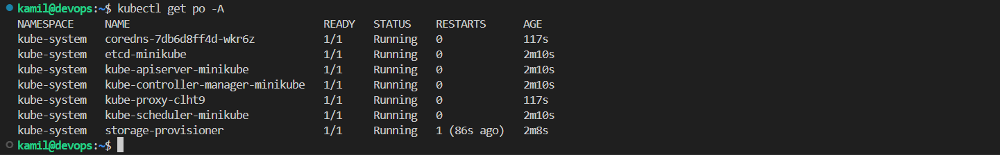
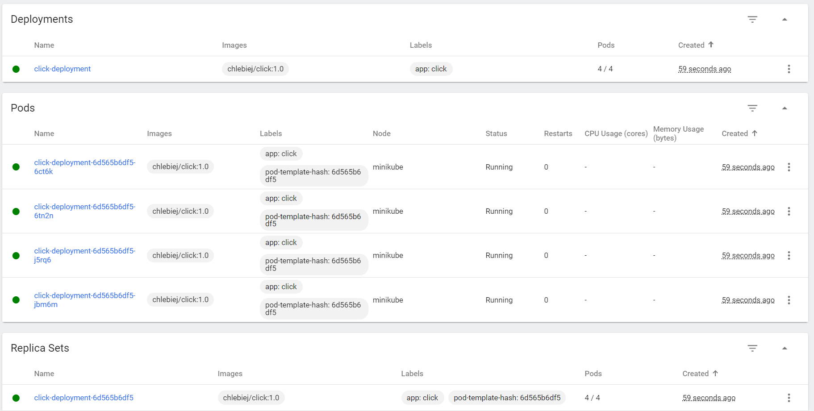
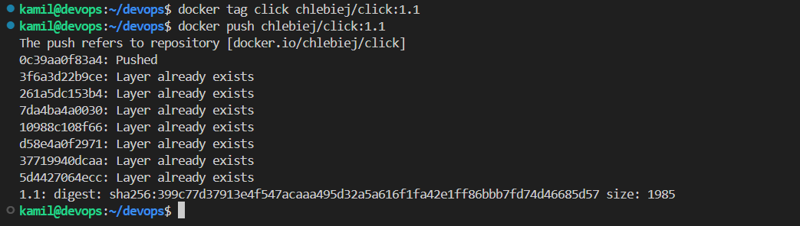
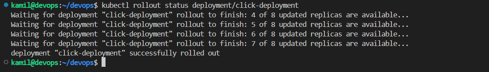
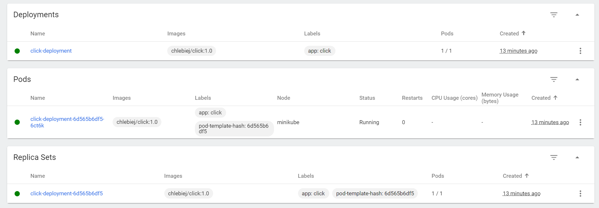

# Sprawozdanie 5

## Cel ćwiczenia

Celem ćwiczenia było zapoznanie z kubernetes czyli wdrażaniem aplikacji na zarządzalne kontenery  

## Przebieg ćwiczenia - zajęcia 10 

### Instalacja minikube 

Aby pobrać i zainstalować `minikube` użyłem dwóch poleceń:

```
curl -LO https://storage.googleapis.com/minikube/releases/latest/minikube_latest_amd64.deb
sudo dpkg -i minikube_latest_amd64.deb
```

<div align="center">
    
</div>

<br>

Zaopatrzyłem się w polecenie `kubectl` tworząc alias:

```
alias kubectl="minikube kubectl --"
```

### Uruchomienie kubernetes

Uruchomiłem kubernetesa za pomocą polecenia:

```
minikube start
```

<div align="center">
    
</div>

<br>

Działający kontener kubernetes

<div align="center">
    
</div>

<br>

Wyświetliłem wszystkie pody

```
kubectl get po -A
```

<div align="center">
    
</div>

<br>

Uruchomiłem dashboard. Visual studio code automatycznie przekierowuje porty więc nie musiałem się o to martwić

```
minikube dashboard
```

<div align="center">
    
</div>

Po kliknięciu w link uruchamia się strona z dashboardem

<div align="center">
    
</div>

### Analiza posiadanego kontenera

Przez to ze wybrana przeze mnie aplikacja na poprzednich zajęciach nie nadaje się do pracy w kontenerze, wymieniłem ją na obraz nginx z wykonaną przeze stroną startową.

Stworzyłem nowego dockerfile:
```Dockerfile
FROM nginx

COPY index.html /usr/share/nginx/html/index.html
```

Zbudowałem obraz:
```
docker build -f click.Dockerfile -t click .
```
<div align="center">
    
</div>

<br>

uruchomiłem aplikacje udostępniając port 8081 (oraz przekierowałem port w visual studio code)
```
docker run --rm -p 8081:80 click
```

<div align="center">
    
</div>

<br>

Aplikacja pracuje jako kontener

<div align="center">
    
</div>

<br>

Stworzona przeze mnie aplikacja wyświetla liczbę kliknięć czerwonego przycisku przez użytkownika :)

<div align="center">
    
</div>

### Uruchamianie oprogramowania na stosie k8s

Próbowałem uruchomić poda

```
kubectl run click --image=click --port=80 --labels app="click"
```

Ale wystąpił błąd. Zrozumiałem że k8s nie wykrywa obrazów lokalnych więc muszę mój zbudowany obraz przesłać do docker huba.

<div align="center">
    
</div>

### Docker hub

Zalogowałem się do docker huba
```
docker login
```

<div align="center">
    
</div>

<br>

Dodałem tag z wersją do obrazu i przesłałem obraz do docker huba

```
docker tag click chlebiej/click:1.0
docker push chlebiej/click:1.0
```

<div align="center">
    
</div>

<div align="center">
    
</div>

### Uruchamianie oprogramowania na stosie k8s v2

Uruchomiłem poda

```
kubectl run click --image=chlebiej/click:1.0 --port=80 --labels app="click"
```
 
<div align="center">
    
</div>

Tym razem pod uruchomił się poprawnie i działa

<div align="center">
    
</div>

<br>

Wyprowadziłem port 8082 (oraz przekierowałem port 8082 w visual studio code)

<div align="center">
    
</div>

Udało się połączyć

<div align="center">
    
</div>

## Przebieg ćwiczenia - zajęcia 11 
### Wdrożenie YAML

Stworzyłem plik wdrożeniowy w formacie YAML, który tworzy 4 repliki

```YAML
apiVersion: apps/v1
kind: Deployment
metadata:
  name: click-deployment
  labels:
    app: click 
spec:
  replicas: 4
  selector:
    matchLabels:
      app: click 
  template:
    metadata:
      labels:
        app: click 
    spec:
      containers:
      - name: click 
        image: chlebiej/click:1.0
        ports:
        - containerPort: 80
```

Uruchomiłem go:

```
kubectl apply -f click.yaml
```

<div align="center">
    
</div>

<br>

Zbadałem stan:

```
kubectl rollout status deployment/click-deployment
```

<div align="center">
    
</div>

<div align="center">
    
</div>


### Przygotowanie nowego obrazu

Stworzyłem nową wersję aplikacji (zamieniłem kolor przycisku z czerwonego na niebieski)

Zbudowałem ją:
```
docker build -f click.Dockerfile -t click .
```
<div align="center">
    
</div>

<br>

Uruchomiłem aplikację aby sprawdzić czy działa poprawnie

```
docker run --rm -p 8081:80 click
```

<div align="center">
    
</div>

<div align="center">
    
</div>

<br>

Dodałem tag i wysłałem nowy obraz na docker huba

```
docker tag click chlebiej/click:1.1
docker push chlebiej/click:1.1
```

<div align="center">
    
</div>

<br>

Następnie zrobiłem kolejną wersje tym razem której uruchomienie kończy się błędem. Użyłem do tego polecenia `exit 1` w dockerfile'u. Zbudowałem, dodałem tag i wysłałem obraz do docker huba.

```Dockerfile
FROM nginx

COPY index2.html /usr/share/nginx/html/index.html

CMD exit 1
```

<div align="center">
    
</div>

<br>

```
kubectl run click --image=chlebiej/click:1.2 --port=80 --labels app="click"
```
<div align="center">
    
</div>

<br>

Obrazy na docker hubie:

<div align="center">
    
</div>

### Zmiany w deploymencie

Robiłem zmiany po przez zmianę pliku wdrożeniowego `click.yaml` a następnie je aplikowałem:

```
kubectl apply -f click.yaml 
```

<br>

Zwiększenie replik do 8

```
...
replicas: 8
...
```

<div align="center">
    
</div>

<div align="center">
    
</div>

<br>

Zmniejszenie replik do 1

```
...
replicas: 1
...
```

<div align="center">
    
</div>

<div align="center">
    
</div>

<br>

Zmniejszenie replik do 0
```
...
replicas: 0
...
```

<div align="center">
    
</div>

<div align="center">
    
</div>

<br>

Zastosowanie nowej wersji obrazu

```
...
image: chlebiej/click:1.1
...
```

<div align="center">
    
</div>

<div align="center">
    
</div>

<br>

Zastosowanie starszej wersji obrazu

```
...
image: chlebiej/click:1.0
...
```

<div align="center">
    
</div>

<div align="center">
    
</div>

<br>

Wyświetliłem poprzednie wersje wdrożeń:

```
kubectl rollout history deployment/click-deployment
```
<div align="center">
    
</div>

<br>

Przywróciłem poprzednią wersje:

```
kubectl rollout undo deployment/click-deployment --to-revision=2
```

<div align="center">
    
</div>


### Kontrola wdrożenia

Napisałem skrypt weryfikujący, czy wdrożenie zdążyło się wdrożyć w ciągu 60 sekund

```bash
#!/bin/bash

minikube kubectl -- apply -f click.yaml;

if ! minikube kubectl -- rollout status deployment/click-deployment --timeout=60s; then
exit 1 
fi
```

Uruchomiłem go dla aplikacji w wersji 1.0

<div align="center">
    
</div>

<br>

Oraz dla sprawdzenia, aplikacja w wersji dla której uruchomienie kończy się błędem (1.2) 

<div align="center">
    
</div>

### Strategie wdrożenia

**Recreate**

Utworzyłem plik wdrożeniowy ze strategią `recreate`. Strategia ta polega na tym że najpierw zakańcza działanie podów i dopiero wtedy uruchamia nowe.

```YAML
spec:
  strategy:
    type: Recreate
```

<br>

Tutaj widać że zanim uruchomi nowe pody kończy działanie starych
<div align="center">
    
</div>

<br>

**Rolling Update**

Utworzyłem plik wdrożeniowy ze strategią `rollingUpdate`. Strategia ta stopniowo kończy działanie starych podów i uruchamia nowe. 

Opcje:
- `maxUnavailable` - maksymalna liczba podów która może być nie dostępna podczas aktualizacji
- `maxSurge` - maksymalna liczba podów która może być utworzona ponad wybraną liczbę podów

```YAML
strategy:
    type: RollingUpdate 
    rollingUpdate:
        maxUnavailable: 2
        maxSurge: 30%
```

<div align="center">
    
</div>

<br>

**Canary Deployment workload**

Utworzyłem plik wdrożeniowy ze strategią `canary`. Strategia ta pozwala dodać poda z aplikacją z nowszą wersją do podów ze starszą wersją. Pozwala to na testowanie jak rodzi sobie nowa wersja nie wymieniając całej aplikacji od razu na nowszą wersje.

```YAML
labels:
    app: click
    track: canary
```

<div align="center">
    
</div>